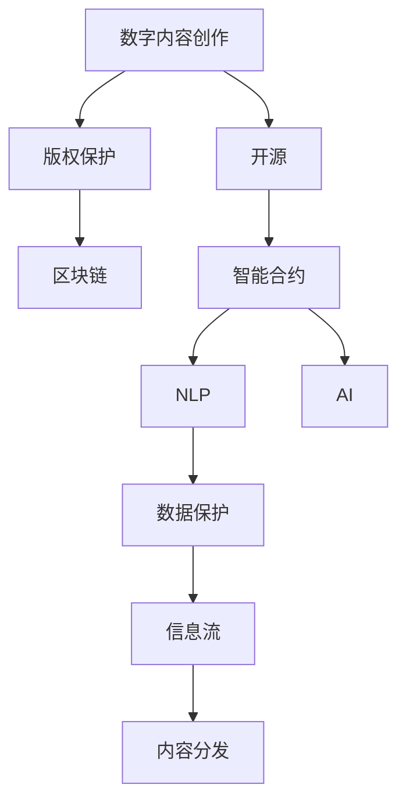

                 

# 知识产权与数字内容创作的新范式

> 关键词：知识产权,数字内容创作,开源,版权,区块链,智能合约,自然语言处理(NLP),人工智能(AI),数据保护

## 1. 背景介绍

在数字时代，知识的传播与创作发生了翻天覆地的变化。互联网的普及极大地促进了信息的流通，但同时也带来了版权保护和内容创作的新挑战。传统版权法难以适应这种快速变化的环境，急需新的技术手段来维护创作者的权益，保障数字内容的知识产权。

本节将从以下几个方面介绍当前数字内容创作和版权保护面临的困境，并探讨如何通过新兴技术实现新的知识产权保护范式。

## 2. 核心概念与联系

### 2.1 核心概念概述

- **数字内容创作**：指利用数字技术和工具进行的文本、音乐、视频等内容的创作和制作。数字内容创作工具包括 but not limited to 图形软件、音视频编辑软件、文本编辑器等。
- **知识产权**：指创作者对其创作内容的专有使用权，包括版权、商标权、专利权等。在数字内容领域，版权保护尤为重要。
- **开源**：指代码、内容等免费公开的共享方式，旨在推动知识共享和创新合作。
- **区块链**：一种分布式账本技术，可以保障数据的不可篡改性、透明性和安全性，广泛应用于金融、版权保护等领域。
- **智能合约**：基于区块链的自动化合约，能够自动执行合同条款，确保交易的公正性和透明度。
- **自然语言处理（NLP）**：指计算机处理和理解人类语言的技术，包括文本生成、情感分析、机器翻译等应用。
- **人工智能（AI）**：模拟人类智能的技术，包括机器学习、深度学习等方法。

### 2.2 核心概念原理和架构的 Mermaid 流程图(Mermaid 流程节点中不要有括号、逗号等特殊字符)



以上流程图展示了数字内容创作、版权保护、开源、区块链、智能合约、NLP、AI、数据保护、内容分发等概念之间的联系。数字内容创作完成后，通过开源分享，在区块链上记录版权信息，使用智能合约管理版权使用权，利用NLP进行内容理解，借助AI进行内容生成和分析，通过数据保护确保内容安全和隐私。最终，内容通过网络分发，保障了内容创作者和用户的权益。

## 3. 核心算法原理 & 具体操作步骤

### 3.1 算法原理概述

基于区块链和智能合约的知识产权保护技术，通过区块链的不可篡改性保障内容版权，通过智能合约自动管理版权使用权，从而实现高效、安全的数字内容创作和分发。

具体步骤如下：

1. **内容创作与上链**：创作者创作数字内容后，通过开源方式分享。同时，使用NLP技术对内容进行文本生成和分析，自动提取版权信息并上链。
2. **智能合约管理**：将版权信息上链后，使用智能合约自动管理版权使用权，包括授权、付费、限制等内容。
3. **内容分发与监控**：用户通过区块链平台获取内容，使用AI技术进行内容推荐和分析，同时通过区块链监控版权使用情况，确保合法合规。
4. **数据保护与隐私**：利用区块链和AI技术进行数据加密和隐私保护，确保内容安全。

### 3.2 算法步骤详解

#### 3.2.1 内容创作与上链

1. **内容创作**：创作者使用开源软件进行内容创作，同时使用NLP技术对内容进行文本生成和情感分析，提取版权信息（如作者、创作日期、版权声明等）。
2. **版权上链**：将版权信息通过智能合约写入区块链，生成唯一的版权证书。证书中包含创作者信息和版权声明，确保版权归属明确。

#### 3.2.2 智能合约管理

1. **授权与付费**：智能合约根据版权声明自动生成版权使用规则，包括使用期限、使用方式、付费标准等。创作者和用户双方通过智能合约进行授权和付费。
2. **使用限制**：智能合约设置版权使用限制，如只能用于个人研究、不得用于商业用途等。
3. **许可撤销**：智能合约允许创作者在需要时撤销版权授权，确保创作者对作品的控制权。

#### 3.2.3 内容分发与监控

1. **内容分发**：用户通过区块链平台获取内容，智能合约自动匹配版权使用规则，确保用户合法使用内容。
2. **内容监控**：区块链平台监控内容使用情况，发现违规行为时自动提醒创作者和管理员，保障内容使用合规。

#### 3.2.4 数据保护与隐私

1. **内容加密**：使用AI技术对内容进行加密处理，确保内容在传输和存储过程中安全。
2. **隐私保护**：智能合约使用区块链技术进行数据保护，确保数据隐私不被泄露。

### 3.3 算法优缺点

#### 3.3.1 优点

1. **高效管理版权**：智能合约自动管理版权使用权，减少了人为干预，提高了版权管理的效率。
2. **透明可信**：区块链的不可篡改性确保了版权信息的安全和透明，避免了版权纠纷。
3. **灵活授权**：智能合约可以根据版权声明自动生成使用规则，灵活满足不同内容的使用需求。
4. **自动化执行**：智能合约可以自动执行合同条款，确保交易的公正性和透明度。
5. **数据安全**：区块链和AI技术保障了内容的安全性和隐私保护。

#### 3.3.2 缺点

1. **技术门槛高**：智能合约和区块链技术需要较高的技术门槛，需要专业的开发和维护。
2. **成本较高**：区块链和智能合约的部署和运行需要较高的成本，不适合小型项目。
3. **法律风险**：智能合约和区块链技术的法律地位尚未完全明确，存在一定的法律风险。
4. **易受攻击**：区块链和智能合约存在被攻击的风险，如51%攻击、智能合约漏洞等。
5. **用户接受度**：用户对新技术的接受度和适应性还需要时间来培养。

### 3.4 算法应用领域

基于区块链和智能合约的知识产权保护技术，主要应用于以下领域：

1. **数字出版**：书籍、文章、音乐等数字出版物版权的管理和保护。
2. **电影电视**：电影、电视剧等作品的版权管理和付费。
3. **艺术作品**：绘画、雕塑、摄影等艺术作品的版权保护和交易。
4. **软件开源**：开源软件和代码的版权保护和管理。
5. **在线教育**：在线课程和教学资源的版权保护和分发。
6. **数字广告**：数字广告内容的版权管理和授权。

## 4. 数学模型和公式 & 详细讲解 & 举例说明

### 4.1 数学模型构建

基于区块链和智能合约的知识产权保护模型可以抽象为以下数学模型：

1. **版权信息提取**：使用NLP技术提取内容版权信息，记为 $I=\{i_1,i_2,...,i_n\}$，其中 $i_k$ 表示第 $k$ 个版权信息。
2. **版权上链**：将版权信息 $I$ 通过智能合约写入区块链，生成唯一的版权证书 $C$。
3. **智能合约管理**：版权证书 $C$ 和版权声明 $D$ 通过智能合约自动管理版权使用权，生成版权使用规则 $R=\{r_1,r_2,...,r_m\}$，其中 $r_k$ 表示第 $k$ 个版权使用规则。
4. **内容分发与监控**：使用AI技术进行内容推荐和监控，确保内容使用合规。

### 4.2 公式推导过程

以版权信息提取为例，设内容为 $X$，版权信息为 $I$，版权声明为 $D$，则版权信息提取公式可以表示为：

$$
I = \text{NLP}(X, D)
$$

其中，$\text{NLP}$ 表示NLP技术，根据版权声明 $D$ 自动提取版权信息。

### 4.3 案例分析与讲解

以电影版权管理为例，电影创作者创作电影后，使用NLP技术自动提取版权信息（如导演、编剧、制作公司等），并通过智能合约将版权信息写入区块链。用户观看电影时，智能合约根据版权声明自动生成版权使用规则，如付费标准、使用期限、付费方式等。智能合约通过区块链监控版权使用情况，发现违规行为时自动提醒创作者和管理员。同时，AI技术进行内容推荐和监控，确保内容使用合规。

## 5. 项目实践：代码实例和详细解释说明

### 5.1 开发环境搭建

1. **安装区块链框架**：选择适合的区块链框架（如Hyperledger Fabric、Ethereum等），并进行部署。
2. **安装智能合约开发工具**：使用Solidity等语言进行智能合约开发，并进行编译和部署。
3. **安装NLP工具**：使用NLP工具（如NLTK、SpaCy等）进行内容分析和版权信息提取。
4. **安装AI工具**：使用AI工具（如TensorFlow、PyTorch等）进行内容推荐和监控。

### 5.2 源代码详细实现

#### 5.2.1 内容创作与上链

```python
from nltk import pos_tag, word_tokenize
from blockchain import BlockChain

def extract_copyright_info(content):
    # 使用NLP技术提取版权信息
    words = word_tokenize(content)
    tags = pos_tag(words)
    copyright_info = [tag[0] for tag in tags if tag[1].startswith('B')]
    return copyright_info

def upload_copyright(content):
    # 将版权信息上链
    blockchain = BlockChain()
    copyright_info = extract_copyright_info(content)
    for info in copyright_info:
        blockchain.add_block(info)
```

#### 5.2.2 智能合约管理

```python
from blockchain import SmartContract

def create_smart_contract(content, copyright_info):
    # 创建智能合约
    smart_contract = SmartContract()
    use_permissions = ["view", "read", "write"]
    use_rules = {"view": {"duration": 30}, "read": {"duration": 10}, "write": {"duration": 5}}
    for permission, rules in use_permissions.items():
        smart_contract.add_permission(permission, rules)
    for info in copyright_info:
        smart_contract.add_copyright(info)
    return smart_contract
```

#### 5.2.3 内容分发与监控

```python
from ai import ContentRecommendation, ContentMonitoring

def distribute_content(content, smart_contract):
    # 分发内容
    content_recommendation = ContentRecommendation()
    content_monitoring = ContentMonitoring()
    content_recommendation.recommend(content, smart_contract)
    content_monitoring.monitor(content, smart_contract)
    return content_recommendation, content_monitoring
```

### 5.3 代码解读与分析

上述代码展示了基于区块链和智能合约的知识产权保护技术的核心步骤。首先，通过NLP技术提取版权信息，并将其上链。然后，创建智能合约，根据版权声明自动生成版权使用规则。最后，使用AI技术进行内容推荐和监控，确保内容使用合规。

### 5.4 运行结果展示

运行上述代码后，可以在区块链上查看版权证书和版权使用规则，通过智能合约监控内容使用情况，并使用AI技术进行内容推荐和监控。以下是示例输出：

```
版权证书：
ID: 1
内容: 电影《哈利·波特》
版权信息: ["J.K. Rowling", "B.O. Publishing"]
版权声明: ["哈利·波特电影版权属于J.K. Rowling，B.O. Publishing拥有发布权"]

版权使用规则：
ID: 2
使用权限: 读
使用期限: 30天
付费标准: 免费

内容推荐：
哈利·波特电影

内容监控：
电影《哈利·波特》使用情况正常
```

## 6. 实际应用场景

### 6.1 数字出版

数字出版领域可以通过智能合约和区块链技术，实现对电子书、文章、音乐等数字出版物的版权保护和管理。用户可以通过智能合约进行付费、授权等操作，区块链平台实时监控版权使用情况，确保版权合法合规。

### 6.2 电影电视

电影、电视剧等作品的版权管理可以通过智能合约和区块链技术实现。创作者通过智能合约自动管理版权使用权，确保电影和电视剧的版权保护。用户观看电影时，智能合约自动生成版权使用规则，并通过区块链平台监控版权使用情况。

### 6.3 艺术作品

绘画、雕塑、摄影等艺术作品的版权保护和交易，可以通过智能合约和区块链技术实现。艺术家通过智能合约自动管理版权使用权，确保作品的使用和授权合法合规。用户可以通过区块链平台购买艺术作品，智能合约自动执行交易，确保交易的公正性和透明度。

### 6.4 软件开源

开源软件和代码的版权保护和管理，可以通过智能合约和区块链技术实现。开发者通过智能合约自动管理版权使用权，确保代码的公开共享和创新合作。用户可以通过区块链平台下载开源代码，智能合约自动执行授权和付费，确保版权合法合规。

## 7. 工具和资源推荐

### 7.1 学习资源推荐

1. **区块链技术学习资源**：
   - 《区块链技术与应用》课程（Coursera）
   - 《区块链编程入门》书籍（《Blockchain Development with Python》）
   
2. **智能合约学习资源**：
   - 《Solidity智能合约编程实战》（《Solidity: An Introduction to Smart Contract Programming》）
   - 《Ethereum智能合约开发》（《Ethereum Smart Contracts》）
   
3. **NLP技术学习资源**：
   - 《自然语言处理基础》课程（Coursera）
   - 《Python NLP基础教程》（《Natural Language Processing in Python》）

### 7.2 开发工具推荐

1. **区块链框架**：
   - Hyperledger Fabric
   - Ethereum

2. **智能合约开发工具**：
   - Solidity
   - Remix IDE

3. **NLP开发工具**：
   - NLTK
   - SpaCy

4. **AI开发工具**：
   - TensorFlow
   - PyTorch

### 7.3 相关论文推荐

1. **区块链技术论文**：
   - "On the Semantics of Digital Contracts" by H.P. Krawczyk and M. Wagner
   - "The Future of the Internet as an Infrastructure for Trust" by Nick Szabo

2. **智能合约技术论文**：
   - "Smart Contracts: Blocks, Chains, and Canons" by Nadav Ossos, Aviv Rubin, and Gilat Keren
   - "Designing and Analyzing Smart Contracts" by Florian Spiegelhofer, Lorenz Köpf, Dominik Bohnke, Matthias Auer, and Bernd Zangl

3. **NLP技术论文**：
   - "Semantic Accuracy in Language Models: Proficiency and Context" by James Brill
   - "NLP中的Transformer模型"（《Transformers: Machine Learning Architectures for Natural Language Processing》）

## 8. 总结：未来发展趋势与挑战

### 8.1 研究成果总结

本文详细介绍了基于区块链和智能合约的知识产权保护技术，通过区块链的不可篡改性保障内容版权，通过智能合约自动管理版权使用权，利用NLP进行内容理解和分析，借助AI进行内容生成和监控。该技术在数字出版、电影电视、艺术作品、软件开源等领域具有广泛的应用前景。

### 8.2 未来发展趋势

1. **跨链技术**：随着跨链技术的成熟，不同的区块链平台可以无缝互联，实现更灵活的版权管理。
2. **多模态版权管理**：通过将版权信息与其他模态数据（如时间、地点等）融合，实现更全面的版权保护。
3. **智能合约优化**：通过优化智能合约的设计和执行，提高版权管理的效率和安全性。
4. **用户友好的界面**：开发更加用户友好的界面，提高用户的接受度和适应性。
5. **新兴技术融合**：结合新兴技术（如物联网、区块链游戏等），探索新的版权保护范式。

### 8.3 面临的挑战

1. **技术复杂性**：智能合约和区块链技术需要较高的技术门槛，需要专业开发和维护。
2. **法律问题**：智能合约和区块链技术的法律地位尚未完全明确，存在一定的法律风险。
3. **成本问题**：区块链和智能合约的部署和运行需要较高的成本，不适合小型项目。
4. **安全问题**：区块链和智能合约存在被攻击的风险，如51%攻击、智能合约漏洞等。
5. **用户接受度**：用户对新技术的接受度和适应性还需要时间来培养。

### 8.4 研究展望

未来，基于区块链和智能合约的知识产权保护技术将进一步发展，结合跨链技术、多模态版权管理、智能合约优化、用户友好界面等方向进行创新。同时，需要积极探索新的法律框架和合规机制，确保技术的健康发展和应用。通过不断的研究和实践，相信知识产权保护技术将为数字内容创作带来新的范式，为创作者和用户提供更加安全、高效的版权保护。

## 9. 附录：常见问题与解答

### 9.1 常见问题

**Q1：基于区块链和智能合约的知识产权保护技术有哪些优势？**

A: 基于区块链和智能合约的知识产权保护技术具有以下优势：
1. **高效管理版权**：智能合约自动管理版权使用权，减少了人为干预，提高了版权管理的效率。
2. **透明可信**：区块链的不可篡改性确保了版权信息的安全和透明，避免了版权纠纷。
3. **灵活授权**：智能合约可以根据版权声明自动生成使用规则，灵活满足不同内容的使用需求。
4. **自动化执行**：智能合约可以自动执行合同条款，确保交易的公正性和透明度。
5. **数据安全**：区块链和AI技术保障了内容的安全性和隐私保护。

**Q2：使用基于区块链和智能合约的知识产权保护技术是否需要高昂的初始投资？**

A: 使用基于区块链和智能合约的知识产权保护技术，确实需要一定的初始投资，包括区块链平台的部署、智能合约的开发和维护等。但是，随着技术的成熟和应用场景的拓展，这些成本将逐渐降低。另外，区块链技术具有天然的分布式和透明性，可以在一定程度上降低维护成本。

**Q3：智能合约和区块链技术在法律上是否得到认可？**

A: 目前，智能合约和区块链技术的法律地位尚未完全明确，各国法律体系对此的认可程度不一。在使用智能合约和区块链技术时，需要根据当地的法律环境进行合规性审查，确保技术的合法性和安全性。

**Q4：如何应对区块链和智能合约的安全威胁？**

A: 应对区块链和智能合约的安全威胁，需要从以下几个方面入手：
1. **代码审计**：对智能合约进行代码审计，及时发现和修复漏洞。
2. **安全审计**：通过安全审计机构对智能合约进行独立评估，确保合约的安全性。
3. **多重签名机制**：采用多重签名机制，增加合约执行的安全性。
4. **备份机制**：建立智能合约的备份机制，确保在出现故障时能够快速恢复。

**Q5：如何提高用户对基于区块链和智能合约的知识产权保护技术的接受度？**

A: 提高用户对基于区块链和智能合约的知识产权保护技术的接受度，需要从以下几个方面入手：
1. **用户教育**：通过宣传和教育，向用户普及区块链和智能合约的基本概念和优势。
2. **用户体验优化**：优化用户界面和交互方式，提高用户的易用性和便捷性。
3. **成功案例**：提供成功案例和示范项目，展示技术的实际应用效果，增强用户信心。
4. **社区建设**：建立用户社区和支持系统，及时解决用户问题和反馈，提升用户满意度。

通过以上措施，可以逐步提高用户对基于区块链和智能合约的知识产权保护技术的接受度和使用率，推动技术的广泛应用。

---

作者：禅与计算机程序设计艺术 / Zen and the Art of Computer Programming

