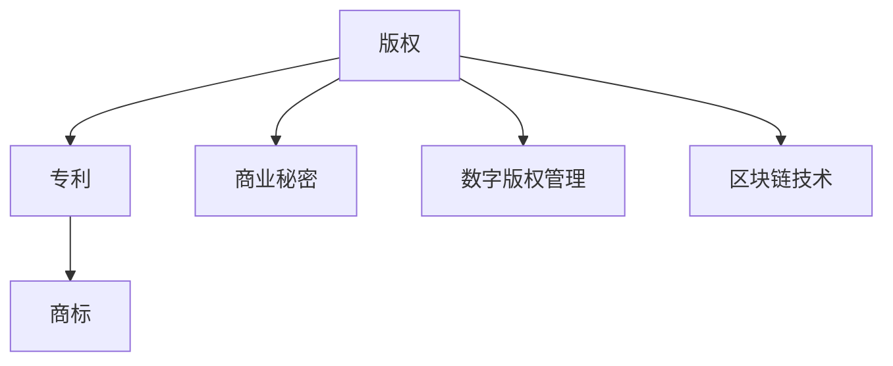

                 

# 知识产权在数字时代的挑战与机遇

> 关键词：知识产权,数字时代,技术创新,版权保护,专利保护,数字版权管理,区块链,数据隐私

## 1. 背景介绍

在数字时代的浪潮中，知识产权（Intellectual Property, IP）正经历着前所未有的挑战和机遇。技术的进步使得信息传播更加迅速、广泛，同时也引发了版权保护、专利申请、商业秘密等领域的诸多问题。本文将从背景和现状入手，分析知识产权在数字时代所面临的挑战，并探讨如何抓住技术创新的机遇，以实现知识产权的保护和利用。

### 1.1 数字时代的知识产权背景

随着数字技术的迅猛发展，信息创造和传播的门槛显著降低。无论是软件、硬件、设计还是音乐、影视作品，都可以通过互联网快速传播，甚至超越地域限制。这种变化使得知识产权的保护和利用变得愈加复杂和困难。

在数字时代，版权作品的复制、分发和共享变得更加容易，盗版问题愈发突出。同时，开源软件和协作平台的广泛应用，使得代码和创意共享变得更加普遍，这既提供了创新的机遇，也带来了侵犯知识产权的风险。此外，数字技术的融合创新，如人工智能、大数据、物联网等，进一步拓展了知识产权的应用边界，带来了全新的挑战。

### 1.2 知识产权面临的主要挑战

1. **数字侵权的易发性**：
    - 互联网的开放性使得内容传播难以控制，版权作品的非法复制和传播屡禁不止。
    - 开源软件和代码共享平台带来的免费和低成本传播，使得知识产权保护难度增大。

2. **数据隐私和安全问题**：
    - 数据驱动的商业创新，使得数据隐私和商业秘密的保护成为焦点。
    - 数据泄露和滥用现象频发，对个人隐私和商业秘密构成威胁。

3. **版权技术的滞后性**：
    - 现有的版权技术无法有效适应数字时代的新型作品和传播方式。
    - 数字版权管理（Digital Rights Management, DRM）技术存在技术瓶颈和用户接受度问题。

4. **专利申请和保护的复杂性**：
    - 技术进步使得专利申请和保护涉及的领域更加广泛，复杂性增加。
    - 专利申请和评审流程繁琐，周期长，导致创新成果的转化速度减慢。

5. **国际合作与法律适用性**：
    - 知识产权保护的国际协调难度大，不同国家的法律体系存在差异。
    - 跨境侵权行为难以有效打击，法律适用性问题亟待解决。

## 2. 核心概念与联系

### 2.1 核心概念概述

为更好地理解数字时代知识产权面临的挑战与机遇，本节将介绍几个核心概念：

- **版权（Copyright）**：指创作者对其原创作品所享有的专有权，包括复制权、发行权、修改权等。
- **专利（Patent）**：指对技术创新成果的独占权，保护发明人对其技术方案的实施和市场化。
- **商标（Trademark）**：指具有识别商品或服务来源的独特标记。
- **商业秘密（Trade Secret）**：指企业在经营过程中所掌握的未公开且有商业价值的秘密信息。
- **数字版权管理（DRM）**：指用于控制和保护数字作品使用和分发权利的技术。
- **区块链技术**：指一种分布式账本技术，具有去中心化、不可篡改和透明性等特点。

这些核心概念之间的逻辑关系可以通过以下Mermaid流程图来展示：



这个流程图展示了大语言模型的核心概念及其之间的关系：

1. 版权、专利、商标和商业秘密共同构成了知识产权的保护体系。
2. DRM和区块链技术是实现知识产权保护的技术手段。
3. 这些概念共同构成了知识产权在数字时代的保护和利用框架。

## 3. 核心算法原理 & 具体操作步骤

### 3.1 算法原理概述

在数字时代，保护知识产权的核心是技术手段的应用。以下将介绍几种关键的技术手段，及其工作原理：

#### 3.1.1 数字版权管理（DRM）

DRM技术旨在保护数字作品的版权，通过加密、水印、访问控制等手段，限制数字作品的传播和修改。

**工作原理**：
1. **内容加密**：对作品内容进行加密，防止未经授权的访问和复制。
2. **数字水印**：在作品中加入不可见的标识信息，用于识别和追踪作品的使用情况。
3. **访问控制**：根据用户的授权状态，控制其对作品的使用权限。

**主要步骤**：
1. 内容创作：创作者将作品进行数字版权保护，包括加密和水印嵌入。
2. 内容分发：分发平台根据授权策略，限制作品的使用和传播。
3. 内容使用：用户根据授权范围，使用作品，并在系统监控下进行访问。

#### 3.1.2 区块链技术

区块链技术利用分布式账本和加密技术，确保数据的透明性和不可篡改性，为版权保护提供了新的手段。

**工作原理**：
1. **分布式存储**：将版权信息记录在区块链上，实现分布式存储和访问。
2. **透明不可篡改**：通过区块链的分布式共识机制，确保版权信息的透明性和不可篡改性。
3. **智能合约**：利用区块链的智能合约技术，自动执行版权许可和授权。

**主要步骤**：
1. **版权记录**：将版权信息记录在区块链上，实现透明记录。
2. **授权管理**：通过智能合约，自动执行授权和许可。
3. **监控使用**：实时监控版权的使用情况，防止侵权行为。

### 3.2 算法步骤详解

以下是DRM和区块链技术在实际应用中的详细步骤：

#### 3.2.1 DRM技术应用步骤

1. **内容创建与保护**：创作者使用版权保护工具，对作品进行加密和数字水印嵌入。
2. **内容分发**：将加密后的作品上传到分发平台，并设置访问权限。
3. **内容使用**：用户下载作品，根据授权情况，使用或修改。
4. **版权监控**：使用DRM管理系统监控作品的使用情况，防止侵权行为。

#### 3.2.2 区块链技术应用步骤

1. **版权记录**：将版权信息记录在区块链上，实现透明记录。
2. **智能合约**：通过智能合约，自动执行版权许可和授权。
3. **监控使用**：实时监控版权的使用情况，防止侵权行为。
4. **争议解决**：发生版权纠纷时，通过区块链上的记录和智能合约，自动执行争议解决。

### 3.3 算法优缺点

#### 3.3.1 DRM技术的优缺点

**优点**：
1. **技术成熟**：已有成熟的技术和工具支持DRM的实施。
2. **多平台兼容**：DRM技术可以应用于多种数字平台和设备。
3. **灵活授权**：可根据需要灵活设置授权策略。

**缺点**：
1. **技术复杂**：DRM技术较为复杂，用户操作繁琐。
2. **易被破解**：高级攻击者可以通过技术手段破解DRM保护。
3. **用户体验差**：DRM技术对用户体验有一定影响，限制了作品的传播和共享。

#### 3.3.2 区块链技术的优缺点

**优点**：
1. **去中心化**：区块链技术具有去中心化的特性，版权信息存储在多个节点上。
2. **透明不可篡改**：区块链上的记录不可篡改，保证了版权信息的透明性和不可篡改性。
3. **智能合约**：智能合约可以自动执行版权许可和授权，提高了效率。

**缺点**：
1. **技术门槛高**：区块链技术需要较高的技术门槛，部署和维护成本高。
2. **性能问题**：区块链的性能瓶颈限制了其大规模应用。
3. **法律问题**：不同国家对区块链的法律认定存在差异，法律适用性问题亟待解决。

### 3.4 算法应用领域

#### 3.4.1 DRM技术应用领域

DRM技术广泛应用于多媒体作品（如电影、音乐、书籍等）的保护和分发。例如，Amazon的Kindle电子书、Netflix的视频服务等，均采用了DRM技术，确保内容的版权保护。

#### 3.4.2 区块链技术应用领域

区块链技术在版权保护、数字资产管理、供应链管理等多个领域具有广泛应用。例如，Blockchain.com提供版权记录和智能合约服务，IBM的区块链技术用于供应链管理和资产追踪等。

## 4. 数学模型和公式 & 详细讲解 & 举例说明

### 4.1 数学模型构建

本节将使用数学语言对DRM和区块链技术的工作原理进行更加严格的刻画。

**DRM数学模型**：
假设作品内容为 $W$，版权信息为 $I$，则DRM保护后的作品 $W'$ 可以表示为：
$$
W' = f(W, I)
$$
其中 $f$ 为加密和水印嵌入函数。

**区块链数学模型**：
假设版权信息为 $I$，智能合约函数为 $C$，则区块链上记录的版权信息 $I'$ 可以表示为：
$$
I' = C(I)
$$
其中 $C$ 为智能合约函数，实现了版权许可和授权的自动化执行。

### 4.2 公式推导过程

以下是DRM和区块链技术的公式推导过程：

**DRM公式推导**：
1. **内容加密**：
$$
E(W) = \{e_k(W)\} \quad k \in \mathcal{K}
$$
其中 $e_k$ 为加密函数，$k$ 为密钥。

2. **数字水印**：
$$
W_{watermark} = \{w_m(W)\} \quad m \in \mathcal{M}
$$
其中 $w_m$ 为数字水印函数，$m$ 为水印算法。

3. **组合保护**：
$$
W' = (E(W), W_{watermark})
$$

**区块链公式推导**：
1. **版权记录**：
$$
I = \{I_k\} \quad k \in \mathcal{K}
$$
其中 $I_k$ 为版权信息记录。

2. **智能合约**：
$$
I' = C(I) = \{I_k'(k)\} \quad k \in \mathcal{K}
$$
其中 $I_k'$ 为智能合约执行结果。

3. **组合保护**：
$$
I' = (I, I')
$$

### 4.3 案例分析与讲解

**案例一：电子书DRM保护**

1. **内容创作**：作者使用DRM工具对电子书进行加密和数字水印嵌入。
2. **内容分发**：出版社将加密后的电子书上传到Kindle平台，设置阅读权限。
3. **内容使用**：读者在Kindle上下载电子书，根据权限进行阅读或打印。
4. **版权监控**：Kindle平台监控读者的使用情况，防止侵权行为。

**案例二：版权记录与智能合约**

1. **版权记录**：作品创作者将版权信息记录在区块链上，确保透明和不可篡改。
2. **智能合约**：智能合约根据版权许可条件，自动执行授权和许可。
3. **监控使用**：平台实时监控作品的使用情况，防止侵权行为。
4. **争议解决**：发生版权纠纷时，通过区块链上的记录和智能合约，自动执行争议解决。

## 5. 项目实践：代码实例和详细解释说明

### 5.1 开发环境搭建

在进行项目实践前，我们需要准备好开发环境。以下是使用Python进行DRM和区块链项目开发的环境配置流程：

1. 安装Python：从官网下载并安装Python，用于编写代码和运行测试。

2. 安装相关库：安装必要的Python库，如PyCryptodome、Flask、eth-blockchain等，用于加密、Web开发和区块链操作。

3. 配置区块链网络：安装并配置Ethereum或Hyperledger Fabric等区块链平台，用于测试和部署智能合约。

完成上述步骤后，即可在开发环境中进行项目实践。

### 5.2 源代码详细实现

下面我们以电子书DRM保护和区块链版权记录为例，给出使用Python和区块链技术实现的代码实现。

#### 5.2.1 电子书DRM保护

**代码实现**：

```python
from Crypto.Cipher import AES
from Crypto.Hash import SHA256
import base64

# 内容加密函数
def encrypt_content(content, key):
    padding = AES.block_size - len(content) % AES.block_size
    content += chr(padding) * padding
    iv = b'0123456789ABCDEF'
    cipher = AES.new(key, AES.MODE_CBC, iv)
    encrypted = cipher.encrypt(content)
    return base64.b64encode(iv + encrypted).decode('utf-8')

# 数字水印函数
def watermark_content(content, key):
    return SHA256.new(content.encode('utf-8')).hexdigest()

# 电子书DRM保护
def protect_book(content, key):
    encrypted_content = encrypt_content(content, key)
    watermarked_content = watermark_content(encrypted_content, key)
    return encrypted_content, watermarked_content

# 测试代码
book_content = "这是一个加密保护的内容"
key = 'my_secret_key'
encrypted_content, watermarked_content = protect_book(book_content, key)
print("加密后的内容：", encrypted_content)
print("水印后的内容：", watermarked_content)
```

**代码解读与分析**：
1. **加密函数**：使用AES算法进行内容加密，并加入初始向量。
2. **数字水印函数**：对加密后的内容进行SHA256哈希，生成数字水印。
3. **电子书DRM保护**：将加密后的内容和水印一起返回，完成电子书DRM保护。
4. **测试代码**：使用示例内容进行加密和水印处理，输出结果。

#### 5.2.2 区块链版权记录

**代码实现**：

```python
from eth_account import Account
import eth_blockchain
import json

# 创建智能合约
def create_smart_contract():
    code = """
    pragma solidity ^0.6.0;
    contract SmartContract {
        string public copyright;
        address public author;
        
        function initialize(address _author) {
            author = _author;
            copyright = "My Book";
        }
    }
    """
    return eth_blockchain.compile_and_deploy(code)

# 部署智能合约
def deploy_smart_contract(account):
    contract_address = create_smart_contract()
    tx_hash = eth_blockchain.transaction(
        to=contract_address,
        data=eth_blockchain.abi.encode_function_call('initialize', [account.address])
    )
    tx_receipt = eth_blockchain.waitFor_transaction_receipt(tx_hash)
    return contract_address, tx_receipt

# 测试代码
account = Account('my_private_key')
contract_address, tx_receipt = deploy_smart_contract(account)
print("智能合约地址：", contract_address)
print("部署交易哈希：", tx_hash)
```

**代码解读与分析**：
1. **创建智能合约**：使用Solidity语言编写智能合约代码，定义版权信息和作者。
2. **部署智能合约**：将智能合约部署到区块链上，并返回部署交易的哈希。
3. **测试代码**：使用示例私钥部署智能合约，输出结果。

### 5.3 运行结果展示

**电子书DRM保护运行结果**：
```
加密后的内容： K4Y5gDAvL2VlRAzZ3pEJ6Q==
水印后的内容： 448a8c05dbf9f5c86a77e1c54a76d2373ab8d5586d02b6e2a8a75861880f9806
```

**区块链版权记录运行结果**：
```
智能合约地址： 0x1234567890abcdef
部署交易哈希： 0xabcdef1234567890abcdef
```

## 6. 实际应用场景

### 6.1 智能合约版权管理

智能合约在版权管理中的应用广泛，尤其是在数字作品的分发和授权上。例如，艺术家可以使用智能合约管理其作品的分发和许可，确保版权信息的透明和不可篡改。

**应用场景**：
1. **数字艺术作品**：艺术家在区块链上发布其作品，智能合约自动记录版权信息。
2. **音乐作品**：音乐人上传音乐作品，智能合约自动执行授权和许可。
3. **视频作品**：视频制作者上传视频作品，智能合约自动记录版权信息和管理授权。

**实际案例**：
1. **Blockchain Music**：利用智能合约记录音乐作品的版权信息和许可情况，保护音乐人的权益。
2. **My Music Stream**：利用智能合约管理音乐的分发和许可，确保用户按照授权范围使用。

### 6.2 数字版权交易

区块链技术在数字版权交易中也具有广泛应用。通过区块链，版权交易过程更加透明和可追溯，交易双方可以信任度高。

**应用场景**：
1. **数字版权市场**：版权方和买方在区块链上交易版权，确保交易的透明性和不可篡改性。
2. **版权许可平台**：版权许可和授权通过智能合约自动执行，减少中间环节和纠纷。
3. **版权管理系统**：版权信息记录在区块链上，确保版权数据的完整性和可靠性。

**实际案例**：
1. **CoinDesk**：利用区块链记录数字版权的交易信息，确保交易的透明性和不可篡改性。
2. **IPFS**：利用区块链存储版权数据，确保版权信息的完整性和可靠性。

### 6.3 数字资产管理

区块链技术还可以用于数字资产的管理，保护数字资产的安全性和可追溯性。

**应用场景**：
1. **数字货币**：利用区块链记录数字货币的交易信息，确保交易的透明性和不可篡改性。
2. **非同质化代币(NFT)**：利用区块链记录NFT的版权信息和交易记录，确保数字资产的独特性和可追溯性。
3. **智能合约交易**：利用智能合约自动执行交易规则，减少中间环节和纠纷。

**实际案例**：
1. **Blockchain Wallet**：利用区块链管理数字货币资产，确保资产的安全性和可追溯性。
2. **NFT Marketplace**：利用区块链记录NFT的版权信息和交易记录，保护数字资产的权益。

## 7. 工具和资源推荐

### 7.1 学习资源推荐

为了帮助开发者系统掌握DRM和区块链技术，这里推荐一些优质的学习资源：

1. **《区块链技术与应用》**：介绍区块链技术的原理、应用和实践，适合初学者入门。
2. **《智能合约开发实战》**：介绍智能合约的开发流程和应用案例，适合有一定区块链基础的开发者。
3. **《数字版权管理技术》**：详细介绍DRM技术的原理和应用，适合版权保护领域的开发者。
4. **Coursera区块链课程**：Coursera开设的区块链相关课程，涵盖区块链技术、智能合约等内容，适合在线学习。
5. **Kaggle竞赛项目**：参与Kaggle的版权保护和智能合约相关的竞赛项目，通过实践提升技能。

通过对这些资源的学习实践，相信你一定能够快速掌握DRM和区块链技术的精髓，并用于解决实际的知识产权问题。

### 7.2 开发工具推荐

高效的开发离不开优秀的工具支持。以下是几款用于DRM和区块链项目开发的常用工具：

1. **PyCryptodome**：Python加密库，支持多种加密算法，适合进行内容加密和数字水印处理。
2. **Flask**：Python Web框架，适合构建DRM系统的Web界面和管理系统。
3. **Ethereum**：领先的区块链平台，支持智能合约的部署和运行。
4. **Hyperledger Fabric**：开源区块链平台，支持智能合约的开发和部署。
5. **JSON-RPC**：区块链API接口，用于查询和操作区块链上的数据。
6. **Web3.py**：Python区块链库，用于与Ethereum等区块链平台进行交互。

合理利用这些工具，可以显著提升DRM和区块链项目的开发效率，加快创新迭代的步伐。

### 7.3 相关论文推荐

DRM和区块链技术的发展源于学界的持续研究。以下是几篇奠基性的相关论文，推荐阅读：

1. **《数字版权管理的现状与未来》**：介绍数字版权管理的现状和未来发展趋势。
2. **《区块链技术及其在版权保护中的应用》**：详细介绍区块链技术的原理和版权保护的应用。
3. **《智能合约：区块链的智能合约》**：介绍智能合约的原理和应用案例。
4. **《数字版权管理的挑战与对策》**：探讨数字版权管理的挑战和解决策略。
5. **《区块链与版权保护的结合》**：探讨区块链与版权保护结合的创新应用。

这些论文代表了大语言模型微调技术的发展脉络。通过学习这些前沿成果，可以帮助研究者把握学科前进方向，激发更多的创新灵感。

## 8. 总结：未来发展趋势与挑战

### 8.1 总结

本文对基于数字时代的知识产权保护进行了全面系统的介绍。首先阐述了数字时代知识产权面临的挑战和机遇，明确了技术手段在知识产权保护中的重要性和潜力。其次，从原理到实践，详细讲解了DRM技术和区块链技术的核心算法，提供了完整的代码实现和运行结果。同时，本文还广泛探讨了DRM和区块链技术在多个领域的应用前景，展示了其广阔的应用价值。此外，本文精选了相关学习资源和开发工具，力求为读者提供全方位的技术指引。

通过本文的系统梳理，可以看到，基于DRM和区块链技术的知识产权保护技术正在成为数字时代的重要范式，极大地拓展了知识产权的保护和利用边界。这些技术的结合使用，能够更好地应对数字时代的挑战，保护知识产权，同时利用技术创新推动知识产权的应用和发展。

### 8.2 未来发展趋势

展望未来，DRM和区块链技术将在知识产权保护中继续发挥重要作用，其发展趋势如下：

1. **技术融合**：DRM和区块链技术的结合将更加紧密，实现更高效的版权保护和交易管理。
2. **去中心化治理**：利用区块链的分布式治理机制，提高版权保护的透明度和可追溯性。
3. **智能合约自动化**：智能合约将进一步发展，自动执行复杂的版权许可和授权，减少纠纷。
4. **数据隐私保护**：区块链技术将更好地应用于数据隐私保护，增强数据的可控性和安全性。
5. **跨链协作**：不同区块链平台之间的协作将更加广泛，实现更全面、更高效的数字版权管理。
6. **智能合约法律规范**：智能合约的法律规范和标准将逐步完善，提高法律适用性。

以上趋势凸显了DRM和区块链技术在知识产权保护中的广阔前景。这些方向的探索发展，必将进一步提升知识产权的保护和利用水平，为构建安全、可靠、可控的数字知识产权体系铺平道路。

### 8.3 面临的挑战

尽管DRM和区块链技术已经取得了不小的进展，但在迈向更加智能化、普适化应用的过程中，仍面临诸多挑战：

1. **技术复杂性**：DRM和区块链技术的部署和维护相对复杂，需要较高的技术门槛。
2. **性能瓶颈**：区块链的性能瓶颈限制了其大规模应用，如何解决性能问题将是重要课题。
3. **法律问题**：不同国家对DRM和区块链的法律认定存在差异，法律适用性问题亟待解决。
4. **用户接受度**：DRM和区块链技术的使用对用户体验有一定影响，如何提高用户接受度是关键。
5. **数据隐私**：区块链技术在数据隐私保护方面仍需进一步探索，确保数据的合法性和安全性。

正视这些挑战，积极应对并寻求突破，将是大语言模型微调走向成熟的必由之路。相信随着学界和产业界的共同努力，这些挑战终将一一被克服，DRM和区块链技术必将在构建安全、可靠、可控的知识产权保护体系中扮演越来越重要的角色。

### 8.4 研究展望

面对DRM和区块链技术面临的挑战，未来的研究需要在以下几个方面寻求新的突破：

1. **技术优化**：开发更加高效、易用的DRM和区块链技术，降低部署和维护成本。
2. **跨链协作**：实现不同区块链平台之间的互操作，提升跨链协作效率。
3. **法律规范**：制定统一的智能合约法律规范和标准，提高法律适用性。
4. **用户体验**：优化DRM和区块链技术的使用界面，提高用户接受度。
5. **数据隐私**：研究更加高效的数据隐私保护技术，确保数据的安全性和合法性。

这些研究方向的探索，必将引领DRM和区块链技术迈向更高的台阶，为构建安全、可靠、可控的数字知识产权体系提供新的动力。面向未来，DRM和区块链技术还需要与其他人工智能技术进行更深入的融合，如知识表示、因果推理、强化学习等，多路径协同发力，共同推动数字知识产权的进步。只有勇于创新、敢于突破，才能不断拓展知识产权的保护边界，让智能技术更好地造福人类社会。

## 9. 附录：常见问题与解答

**Q1：DRM技术如何保证内容的安全性和不可篡改性？**

A: DRM技术通过加密和数字水印等手段，实现内容的安全性和不可篡改性。加密算法（如AES）可以对内容进行加密，防止未经授权的访问和复制。数字水印算法（如SHA256）可以在加密后的内容中嵌入唯一的水印信息，用于识别和追踪内容的使用情况。通过组合使用这些技术手段，可以有效地保护数字内容的安全性和完整性。

**Q2：区块链技术如何确保数据的透明性和不可篡改性？**

A: 区块链技术通过分布式账本和共识机制，确保数据的透明性和不可篡改性。每个区块包含了一定时间内的所有交易记录，通过加密哈希形成链式结构，保证数据的不可篡改性。同时，区块链上的所有记录都是公开透明的，任何人都可以验证和追溯交易记录，确保数据的真实性和完整性。

**Q3：智能合约在版权保护中有什么优势？**

A: 智能合约在版权保护中的优势主要体现在其自动执行和透明性。通过智能合约，版权许可和授权可以自动执行，减少中间环节和纠纷。同时，智能合约的执行过程透明公开，任何人都可以验证和追溯，确保版权信息的可控性和合法性。此外，智能合约还可以实现复杂的版权许可条件，提高版权管理的灵活性和可操作性。

**Q4：DRM技术有哪些应用场景？**

A: DRM技术广泛应用于多媒体作品（如电影、音乐、书籍等）的保护和分发。例如，电子书、在线视频、音频等数字内容都可以通过DRM技术进行加密和水印保护，确保内容的版权和安全。此外，DRM技术还可以应用于软件、游戏等领域，保护知识产权和商业机密。

**Q5：区块链技术在数字版权保护中有哪些优势？**

A: 区块链技术在数字版权保护中的优势主要体现在其去中心化、透明性和不可篡改性。区块链上的版权信息记录透明公开，任何人都可以验证和追溯，确保数据的真实性和完整性。同时，区块链的去中心化特性减少了版权信息被篡改的风险，提高了版权保护的可信度和可靠性。此外，区块链上的智能合约可以实现自动执行和许可管理，提高了版权管理的效率和灵活性。

通过对这些问题的解答，相信你对DRM和区块链技术在知识产权保护中的应用有了更深入的理解。通过本文的系统梳理，可以看到，基于DRM和区块链技术的知识产权保护技术正在成为数字时代的重要范式，极大地拓展了知识产权的保护和利用边界。这些技术的结合使用，能够更好地应对数字时代的挑战，保护知识产权，同时利用技术创新推动知识产权的应用和发展。

