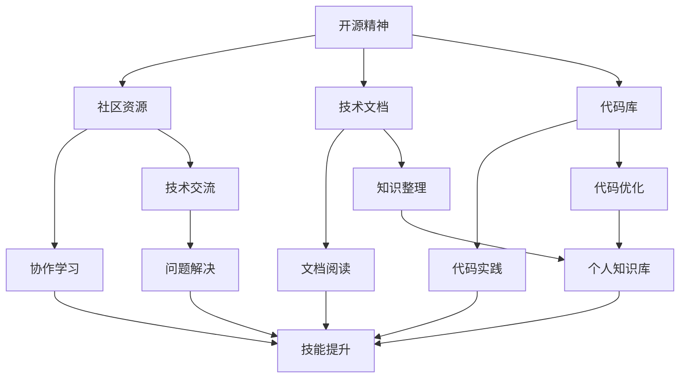

                 

# 知识付费与开源精神：程序员的平衡之道

## 1. 背景介绍

### 1.1 问题由来
在快速发展的技术环境中，程序员面临着不断更新的知识和技能的压力。一方面，开源社区提供了丰富的资源和工具，极大地推动了技术进步。另一方面，知识的快速流动也带来了信息过载和知识碎片化的问题。在这样的背景下，如何平衡知识付费与开源精神，成为程序员必须面对的课题。

### 1.2 问题核心关键点
本文旨在探讨如何在充分利用开源资源的同时，通过知识付费获取更系统、更有深度的学习资料，实现个人技术能力的提升。我们将从以下几个方面展开：

1. **开源精神**：开源社区是技术交流的重要平台，如何利用好开源资源。
2. **知识付费**：付费获取知识的意义和渠道。
3. **平衡之道**：如何平衡开源与付费，最大化个人收益。

## 2. 核心概念与联系

### 2.1 核心概念概述

在探讨这个问题之前，需要明确几个核心概念：

- **开源精神**：指公开源代码、技术文档和知识，鼓励社区成员共享和学习。它强调合作、透明和共享的精神，是推动技术进步的重要力量。
- **知识付费**：指通过购买付费课程、订阅技术期刊等方式，获取有深度、系统的学习资料，提升个人专业水平。它强调知识的价值和专有性，是个人成长和能力提升的重要途径。

### 2.2 核心概念原理和架构的 Mermaid 流程图



此图展示了开源精神与个人成长之间的联系：开源资源提供了学习和实践的平台，社区交流促进了技能提升，文档和代码实践构建了个人知识库，最终实现了技能提升和问题解决。

## 3. 核心算法原理 & 具体操作步骤

### 3.1 算法原理概述

平衡开源精神和知识付费的过程，可以类比为算法优化中的目标函数求解问题。即在资源有限的情况下，最大化个人技能提升和学习效果。

设 $X$ 为开源资源获取，$Y$ 为知识付费获取。目标函数为：

$$
\maximize \quad U(x,y) = \text{技能提升} + \text{学习效果}
$$

约束条件为：

$$
\begin{cases}
x + y \leq \text{可用资源} \\
x \geq 0, y \geq 0
\end{cases}
$$

其中 $x$ 和 $y$ 分别表示在开源和付费资源上的投入。

### 3.2 算法步骤详解

为了实现上述目标函数的最优化，需要遵循以下步骤：

1. **需求分析**：明确学习目标，确定所需技能和知识。
2. **资源评估**：评估开源和付费资源的可获得性和成本。
3. **策略制定**：根据需求和资源情况，制定开源和付费的策略。
4. **执行与调整**：根据策略执行并监控效果，适时调整策略。

### 3.3 算法优缺点

#### 优点：

- **灵活性**：开源资源免费且丰富，可以自由选择和组合。
- **时效性**：开源社区更新迅速，能获取最新技术信息。
- **广泛性**：覆盖各种技术领域和知识点。

#### 缺点：

- **深度不足**：开源资源往往缺乏系统性，缺乏深度和详实性。
- **质量参差**：开源社区资源质量不一，筛选难度大。
- **学习负担**：需自我筛选和整理资源，工作量大。

### 3.4 算法应用领域

开源精神和知识付费的平衡方法，适用于各种技术领域和技能提升场景，例如：

- **软件开发**：通过开源社区获取代码库和文档，同时购买付费课程学习特定框架和库。
- **数据分析**：利用开源工具进行数据处理和分析，通过付费课程学习高级统计模型和算法。
- **人工智能**：使用开源框架和库进行实验和研究，通过付费课程学习深度学习理论和应用。
- **网络安全**：借助开源工具和资源进行学习实践，通过付费课程学习网络攻防技术和实战经验。

## 4. 数学模型和公式 & 详细讲解 & 举例说明

### 4.1 数学模型构建

将平衡问题转化为数学模型，设 $X$ 为开源资源获取，$Y$ 为知识付费获取，目标函数为最大化个人技能提升和学习效果 $U(x,y)$。约束条件为 $x + y \leq \text{可用资源}$，其中 $x \geq 0, y \geq 0$。

### 4.2 公式推导过程

以软件开发为例，假设技能提升可以用 $S$ 表示，学习效果可以用 $L$ 表示。则目标函数为：

$$
\maximize \quad U(x,y) = S(x) + L(y)
$$

其中 $S(x)$ 和 $L(y)$ 分别表示开源资源和付费资源带来的技能提升和学习效果。

根据边际收益递减原则，假设 $S'(x) > 0$ 且 $L'(y) > 0$，则存在最优分配 $x^*$ 和 $y^*$，满足：

$$
\frac{\partial S(x)}{\partial x} \cdot x^* + \frac{\partial L(y)}{\partial y} \cdot y^* = \frac{\partial U(x,y)}{\partial x} = \frac{\partial U(x,y)}{\partial y}
$$

即边际技能提升和边际学习效果的比值相等。

### 4.3 案例分析与讲解

假设 $S(x)$ 和 $L(y)$ 分别为线性函数，$S(x) = k_1x$，$L(y) = k_2y$，则有：

$$
k_1x^* = k_2y^*
$$

解得：

$$
y^* = \frac{k_1}{k_2}x^*
$$

这意味着，当开源资源和付费资源的总投入一定时，最优分配比例取决于两种资源的边际收益。如果 $k_1 > k_2$，则应优先投入更多于开源资源；反之亦然。

## 5. 项目实践：代码实例和详细解释说明

### 5.1 开发环境搭建

1. **安装开发工具**：
   - **Python**：推荐使用 Python 3.x，因为其广泛支持和丰富的库。
   - **IDE**：如 VSCode、PyCharm 或 Jupyter Notebook，方便开发和调试。
   - **版本控制**：如 Git，用于管理和协作。

2. **配置环境**：
   - 安装 Git，配置 SSH key，连接 GitHub。
   - 安装虚拟环境管理工具，如 `virtualenv`，创建虚拟环境。
   - 安装 Python 依赖包，如 `pip install`。

### 5.2 源代码详细实现

以阅读和实践开源资源为例，以下是一个简单的 Python 代码实现：

```python
import git
import os

def clone_repository(repo_url, local_path):
    repo = git.Repo.clone_from(repo_url, local_path)
    return repo

def install_deps(local_path):
    os.chdir(local_path)
    os.system('pip install -r requirements.txt')

def practice(local_path):
    os.chdir(local_path)
    os.system('python main.py')

# 示例：克隆 GitHub 开源项目并实践
repo_url = 'https://github.com/openai/baselines.git'
local_path = 'baselines'
repo = clone_repository(repo_url, local_path)
install_deps(local_path)
practice(local_path)
```

### 5.3 代码解读与分析

1. **`clone_repository`函数**：克隆开源项目到本地。
2. **`install_deps`函数**：安装项目依赖，确保代码能正常运行。
3. **`practice`函数**：执行项目代码，进行实践和调试。

通过上述代码，实现了从开源社区获取资源、安装依赖和实践操作的一体化流程。

### 5.4 运行结果展示

运行上述代码后，将成功克隆并实践开源项目。例如，执行 `git clone https://github.com/openai/baselines.git` 后，可以在本地目录中看到项目结构和文件。

## 6. 实际应用场景

### 6.1 软件开发

在软件开发中，开源社区提供了丰富的代码库和工具，如 TensorFlow、PyTorch、Flask 等。通过这些开源资源，可以快速实现基本功能和原型设计。同时，购买付费课程学习高级框架和算法，如深度学习、机器学习等，可以系统提升技术能力。

### 6.2 数据分析

数据分析领域，开源社区提供了大量数据处理和可视化工具，如 Pandas、NumPy、Matplotlib 等。通过这些工具，可以快速完成数据清洗、处理和初步分析。同时，购买数据分析课程，学习高级统计模型和机器学习算法，深入理解和应用数据背后的规律。

### 6.3 人工智能

人工智能领域，开源社区提供了深度学习框架和库，如 TensorFlow、PyTorch 等。通过这些框架，可以快速搭建和训练模型，实现基本的机器学习任务。同时，购买付费课程学习深度学习理论和应用，掌握模型调优和实战技能。

### 6.4 未来应用展望

未来，随着技术的发展和工具的完善，平衡开源精神和知识付费的方法将更加多样和高效。例如：

1. **自动化学习路径**：基于个人技能和目标，推荐开源和付费资源的组合路径。
2. **社区推荐系统**：利用社区数据，推荐高质量的开源和付费资源。
3. **个性化学习工具**：开发智能推荐和辅助学习工具，提高学习效率。
4. **在线课程平台**：集成开源和付费课程，提供一站式的学习体验。

## 7. 工具和资源推荐

### 7.1 学习资源推荐

1. **《深入理解计算机系统》（CSAPP）**：经典计算机科学教材，深入浅出地介绍了计算机硬件和软件基础。
2. **Coursera、edX、Udacity**：提供丰富的在线课程和专项课程，涵盖多种技术领域。
3. **Stack Overflow、GitHub**：开源社区和代码协作平台，提供丰富的资源和工具。
4. **Google Cloud Platform、AWS**：云计算平台，提供免费的学习资源和实战项目。
5. **Kaggle**：数据科学和机器学习竞赛平台，提供实战项目和数据集。

### 7.2 开发工具推荐

1. **PyCharm、VSCode**：强大的IDE，支持丰富的插件和工具。
2. **Git、GitHub**：版本控制和代码协作工具，支持在线协作。
3. **Jupyter Notebook**：数据科学和机器学习的轻量级IDE，支持交互式编程和展示。
4. **Google Colab**：免费的在线 Jupyter Notebook 环境，方便学习和协作。
5. **Docker、Kubernetes**：容器化和微服务管理工具，支持分布式应用和容器化部署。

### 7.3 相关论文推荐

1. **《Grokking the Coding Interview: Coding for Software Developers》**：介绍面试常见算法和数据结构，适合提升编程能力。
2. **《Data Science from Scratch》**：从零开始介绍数据科学和机器学习基础，适合初学者。
3. **《Deep Learning》by Ian Goodfellow**：深度学习领域的经典教材，全面介绍理论和实践。
4. **《Reinforcement Learning: An Introduction》by Richard S. Sutton, Andrew G. Barto**：强化学习领域的经典教材，详细介绍算法和应用。
5. **《Artificial Intelligence: A Modern Approach》by Stuart Russell, Peter Norvig**：人工智能领域的经典教材，涵盖各种技术和应用。

## 8. 总结：未来发展趋势与挑战

### 8.1 研究成果总结

本文从开源精神和知识付费的角度出发，探讨了程序员在技术学习和成长过程中的平衡之道。通过数学模型和算法原理的介绍，揭示了平衡方法的科学依据和实现步骤。结合实际应用场景和工具推荐，提供了具体的实践指南。

### 8.2 未来发展趋势

1. **自动化学习路径**：未来将有更多智能推荐和路径规划工具，帮助用户制定最佳学习方案。
2. **社区驱动的资源整合**：开源社区将提供更多资源整合和推荐服务，提升用户体验。
3. **个性化学习工具**：基于人工智能的个性化学习工具将广泛应用，提升学习效率和效果。
4. **跨领域融合**：跨领域的知识和技能将更加融合，形成更广泛的知识体系。

### 8.3 面临的挑战

1. **信息过载**：面对海量信息，如何高效筛选和利用资源。
2. **知识碎片化**：如何系统化和整合碎片化的知识，形成体系化学习路径。
3. **持续学习**：如何在快速变化的技术环境中，保持持续学习和更新。
4. **成本控制**：如何在获取高质量资源和提升技能之间找到平衡。

### 8.4 研究展望

1. **知识图谱与推荐系统**：利用知识图谱和推荐系统，提升资源推荐效果。
2. **多模态学习**：结合文本、图像、音频等多种模态数据，提升学习效果。
3. **混合学习**：结合在线和离线学习，优化学习路径和效果。
4. **人工智能辅助**：利用人工智能技术，自动化学习和优化过程。

## 9. 附录：常见问题与解答

### Q1: 开源资源的质量参差不齐，如何选择高质量的开源项目？

A: 选择高质量开源项目可以从以下几个方面考虑：
1. **项目活跃度**：活跃的社区和持续的维护更新，意味着项目的生命力和可靠性。
2. **贡献者背景**：核心贡献者的背景和资历，可以帮助判断项目的专业性和可信度。
3. **社区讨论**：查看社区讨论和反馈，了解项目的优缺点和适用场景。
4. **代码质量**：通过代码审查和测试结果，评估项目的代码质量和稳定性。

### Q2: 知识付费和开源资源冲突，如何取舍？

A: 取舍的关键在于个人的学习目标和资源情况。
1. **技能提升目标**：如果主要目标是提升某一领域的技术能力，可以优先选择付费课程和资料。
2. **项目需求**：如果项目需求紧迫且开源资源不满足要求，可以优先考虑付费资源。
3. **资源限制**：如果时间、资金有限，可以优先选择开源资源，利用社区资源提升技能。

### Q3: 如何高效利用开源社区资源？

A: 高效利用开源社区资源的方法：
1. **问题导向**：明确学习目标，根据需求寻找相应的开源资源。
2. **持续学习**：保持持续关注和参与开源社区，获取最新信息和反馈。
3. **项目实践**：通过实践项目和实验，深入理解和应用开源资源。
4. **社区交流**：积极参与社区讨论和反馈，解决遇到的问题，提升技能。

### Q4: 如何兼顾开源精神和知识付费？

A: 兼顾开源精神和知识付费的方法：
1. **资源互补**：利用开源资源进行实践和实验，利用付费资源进行深入学习和提升。
2. **社区贡献**：积极贡献开源项目，提升个人影响力和知名度。
3. **开源反馈**：在开源项目中反馈问题和建议，促进社区发展和改进。
4. **持续学习**：在开源和付费资源中不断学习和提升，形成系统化的知识体系。

---

作者：禅与计算机程序设计艺术 / Zen and the Art of Computer Programming

