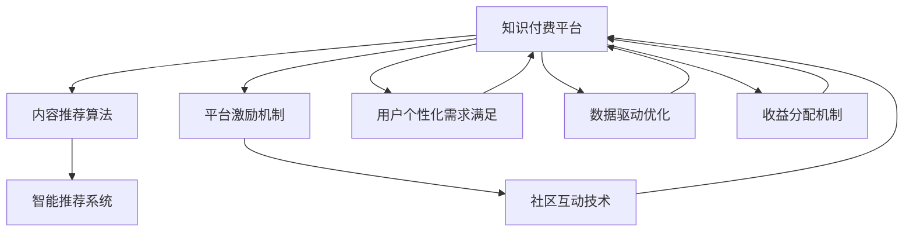

                 

# 知识付费与技术创新的良性互动

> 关键词：知识付费, 技术创新, 平台机制, 内容生产, 用户激励, 数据驱动, 智能推荐, 收益分配

## 1. 背景介绍

### 1.1 问题由来

随着互联网和移动设备的普及，信息获取变得前所未有的便捷。用户不再满足于被动接受单一、标准化、碎片化的信息，而是更加追求高质量、个性化、体系化的知识。知识付费应运而生，通过市场化的机制激励优质内容的生产和流通，为大众提供专业、深度、有价值的信息服务。

知识付费平台如得到、知乎、新东方在线等纷纷涌现，内容形式从音频、视频、图文等多样化，覆盖范围从职场技能、科普知识到财经金融等各个领域。这些平台的成功不仅体现了知识付费的市场需求，更昭示了技术创新在其中的重要驱动作用。

### 1.2 问题核心关键点

知识付费与技术创新之间的良性互动，主要体现在以下几个关键点上：

- **平台机制设计**：如何通过合理的激励机制，吸引优质内容生产者和专业机构入驻平台，保障内容的质量和多样性。
- **内容生产激励**：如何通过技术手段，降低内容创作门槛，激发用户和专业机构的创作热情。
- **用户个性化需求满足**：如何借助智能推荐技术，提升用户满意度，增加平台粘性。
- **数据驱动优化**：如何利用大数据分析，动态调整平台策略，实现收益最大化。
- **社区建设和互动**：如何构建活跃的社区氛围，促进内容生产者和用户之间的良性互动，形成知识共享的网络效应。

### 1.3 问题研究意义

研究知识付费与技术创新的良性互动，对于推动知识付费平台的发展、提升信息传播的质量和效率、促进技术创新与经济社会发展的深度融合，具有重要的理论和实践意义：

1. **促进信息传播质量提升**：技术创新可以优化内容推荐算法，提高用户对信息的利用效率，促进高质量知识内容的传播。
2. **激发内容生产动力**：通过技术手段降低内容创作门槛，使用户和机构能够更加便捷地生产和分享知识。
3. **优化平台运营效率**：利用数据驱动的优化策略，提升平台的运营效率，降低成本，提高收益。
4. **构建社区学习生态**：技术创新可以加强平台社区建设，促进知识共享和互动，形成知识网络效应，提升平台的核心竞争力。
5. **推动技术商业化应用**：知识付费平台是技术创新的重要应用场景，通过研究平台的良性互动，可以推动更多技术创新应用到其他领域。

## 2. 核心概念与联系

### 2.1 核心概念概述

为更好地理解知识付费与技术创新的良性互动，本节将介绍几个密切相关的核心概念：

- **知识付费平台**：基于互联网的商业平台，通过提供高质量、专业化的内容，以付费形式满足用户的个性化知识需求。
- **内容推荐算法**：使用机器学习等技术手段，根据用户行为和偏好，自动推荐相关内容，提升用户满意度。
- **平台激励机制**：通过设置合理的激励策略，如分成、流量曝光、认证等，吸引优质内容生产者和机构入驻平台，提升平台内容质量。
- **智能推荐系统**：结合用户画像、内容特征、互动数据等，构建智能推荐模型，实现个性化内容推荐。
- **社区互动技术**：通过技术手段促进用户之间的互动交流，构建活跃的社区环境，形成知识共享的网络效应。

这些核心概念之间的逻辑关系可以通过以下Mermaid流程图来展示：



这个流程图展示了大语言模型的核心概念及其之间的关系：

1. 知识付费平台通过内容推荐算法提供个性化内容推荐，满足用户需求。
2. 平台激励机制吸引优质内容生产者和机构入驻，提升平台内容质量。
3. 智能推荐系统通过数据分析和算法优化，提升内容推荐效果。
4. 社区互动技术促进用户互动，形成社区学习氛围。
5. 数据驱动优化和收益分配机制保障平台运营和收益最大化。

这些概念共同构成了知识付费平台的技术支撑，使其能够高效运行，满足用户的知识需求，同时实现商业模式的可持续发展。

## 3. 核心算法原理 & 具体操作步骤
### 3.1 算法原理概述

知识付费平台的核心算法原理主要体现在以下几个方面：

- **个性化推荐算法**：基于用户的浏览、收藏、评分等行为数据，构建用户画像，并通过协同过滤、矩阵分解、深度学习等算法，推荐相关内容，提升用户满意度。
- **内容质量评估模型**：通过分析用户反馈、阅读时长、互动量等指标，构建内容质量评估模型，筛选优质内容，保障内容质量。
- **社区互动机制**：利用社交网络、论坛、即时通讯等技术手段，促进用户之间的互动交流，构建活跃的社区环境。
- **数据驱动的运营优化**：通过数据分析挖掘用户行为和市场趋势，优化平台运营策略，提升平台收益。

这些算法共同构建了知识付费平台的技术基础，使其能够高效运行，满足用户需求，同时实现商业模式的可持续发展。

### 3.2 算法步骤详解

基于知识付费平台的核心算法，本节将详细介绍其操作步骤：

**Step 1: 用户画像构建**
- 收集用户的基本信息、浏览记录、收藏夹内容、阅读时长等数据。
- 使用特征工程技术，构建用户画像，包括兴趣偏好、学习习惯等。

**Step 2: 内容质量评估**
- 分析用户对内容的反馈，如评分、评论、分享等。
- 使用文本分析、情感分析等技术手段，筛选优质内容。
- 设置内容质量评估指标，如阅读量、互动量、评分等，筛选高质量内容。

**Step 3: 内容推荐**
- 构建用户画像和内容特征向量。
- 使用协同过滤、矩阵分解、深度学习等算法，计算用户与内容的相似度。
- 根据相似度排序，推荐相关内容。
- 使用A/B测试等手段，评估推荐效果，不断优化推荐算法。

**Step 4: 社区互动**
- 使用社交网络、论坛、即时通讯等技术手段，促进用户互动。
- 构建内容评论、点赞、分享等功能，促进内容共享。
- 使用情感分析、话题识别等技术手段，引导用户积极参与讨论。

**Step 5: 运营优化**
- 使用数据挖掘、机器学习等技术手段，分析用户行为和市场趋势。
- 根据分析结果，优化平台运营策略，如内容推荐算法、激励机制等。
- 实时监控平台运营数据，调整策略，保障平台收益最大化。

以上是知识付费平台的核心算法操作步骤。在实际应用中，还需要针对具体平台的特点，对算法过程的各个环节进行优化设计，如改进推荐算法，引入更多互动机制等，以进一步提升用户体验和平台收益。

### 3.3 算法优缺点

知识付费平台的核心算法具有以下优点：
1. 个性化推荐高效，能够显著提升用户满意度，增加平台粘性。
2. 内容质量评估科学，能够筛选优质内容，保障内容质量。
3. 社区互动活跃，能够促进用户之间的互动交流，形成知识共享的网络效应。
4. 数据驱动优化精准，能够动态调整平台策略，提升平台收益。

同时，这些算法也存在一定的局限性：
1. 算法模型复杂，对数据质量要求较高，获取高质量数据成本较高。
2. 算法模型需要定期维护和更新，需要持续投入技术力量。
3. 推荐算法可能存在信息茧房问题，用户容易陷入固定信息圈。
4. 社区互动存在噪音和虚假信息风险，需要建立有效的信息过滤机制。
5. 数据驱动优化需要实时采集和处理数据，对平台技术能力要求较高。

尽管存在这些局限性，但就目前而言，基于数据驱动的个性化推荐和内容质量评估，仍是知识付费平台提升用户体验、保障内容质量、实现商业可持续发展的核心技术手段。

### 3.4 算法应用领域

知识付费平台的核心算法已经在多个领域得到广泛应用，例如：

- 内容推荐：如知乎、得到、新东方在线等平台，通过推荐算法为用户推荐相关内容。
- 内容质量评估：如豆瓣读书、好书榜等，通过数据分析筛选优质内容。
- 社区互动：如Reddit、Quora等平台，通过社区互动技术促进用户之间的交流。
- 用户画像构建：如Google Analytics、Facebook Insights等，通过数据分析构建用户画像。
- 运营优化：如亚马逊、阿里巴巴等电商平台的个性化推荐系统，通过数据驱动优化提升运营效率。

除了上述这些经典应用外，知识付费平台的算法还被创新性地应用到更多场景中，如智能客服、金融分析、旅游推荐等，为信息服务领域带来了新的突破。

## 4. 数学模型和公式 & 详细讲解 & 举例说明

### 4.1 数学模型构建

本节将使用数学语言对知识付费平台的核心算法进行更加严格的刻画。

记知识付费平台的用户集合为 $U$，内容集合为 $C$，用户与内容之间的交互矩阵为 $M$。设用户 $u$ 对内容 $c$ 的评分、评论、阅读时长等行为数据为 $x_{uc}$，用户 $u$ 的兴趣偏好、学习习惯等特征数据为 $p_u$。设内容 $c$ 的阅读量、互动量、评分等质量指标为 $q_c$。则知识付费平台的用户画像模型为：

$$
p_u = f(x_{uc}, M)
$$

其中 $f$ 为特征构建函数，如矩阵分解、深度学习等。内容质量评估模型为：

$$
q_c = g(p_u, x_{uc}, M)
$$

其中 $g$ 为评估函数，如回归模型、分类模型等。

内容推荐模型的目标是最大化用户对推荐内容的满意度，即：

$$
\max_{\theta} \sum_{u,c} (q_c - \hat{q}_c) \cdot \log \sigma(\langle \theta_u, \phi(c) \rangle)
$$

其中 $\theta_u$ 为用户的推荐参数向量，$\phi(c)$ 为内容的特征向量，$\sigma$ 为激活函数。

社区互动模型则通过分析用户间的互动数据，构建社交网络关系图，促进用户之间的交流，如：

$$
G = (V, E)
$$

其中 $V$ 为节点集合，$E$ 为边集合。社区互动模型可以根据用户间的互动数据，如点赞、评论等，动态调整社交关系图的权重。

### 4.2 公式推导过程

以下我们以推荐系统为例，推导个性化推荐算法的基本框架。

记用户 $u$ 对内容 $c$ 的评分数据为 $r_{uc}$，则用户对内容的评分向量 $R_u$ 可以表示为：

$$
R_u = \begin{bmatrix}
r_{u1c1} \\
r_{u1c2} \\
\vdots \\
r_{u1C}
\end{bmatrix}
$$

内容特征矩阵 $C$ 可以表示为：

$$
C = \begin{bmatrix}
\phi(c1) \\
\phi(c2) \\
\vdots \\
\phi(C)
\end{bmatrix}
$$

用户评分矩阵 $R$ 可以表示为：

$$
R = \begin{bmatrix}
R_{u1} \\
R_{u2} \\
\vdots \\
R_{U}
\end{bmatrix}
$$

其中 $R_{uc}$ 为用户的评分向量。

推荐模型的目标是预测用户对未评分内容的评分，即：

$$
\hat{R}_{uc} = W^T \phi(c)
$$

其中 $W$ 为用户的推荐参数向量。

通过最小化均方误差损失函数，得到推荐模型的优化目标：

$$
\min_{W} \frac{1}{N} \sum_{u=1}^U \sum_{c=1}^C (r_{uc} - \hat{R}_{uc})^2
$$

通过对模型进行求解，可以得到用户对未评分内容的推荐评分向量 $\hat{R}$。结合内容特征矩阵 $C$，即可得到推荐内容集合。

### 4.3 案例分析与讲解

以下以知乎推荐系统为例，分析其核心算法框架：

**用户画像构建**
- 知乎平台收集用户的基本信息、浏览记录、收藏夹内容、阅读时长等数据。
- 使用矩阵分解算法，构建用户画像，包括兴趣偏好、学习习惯等。

**内容质量评估**
- 分析用户对内容的评分、评论、分享等反馈。
- 使用文本分析、情感分析等技术手段，筛选优质内容。
- 设置内容质量评估指标，如阅读量、互动量、评分等，筛选高质量内容。

**内容推荐**
- 构建用户画像和内容特征向量。
- 使用协同过滤、矩阵分解、深度学习等算法，计算用户与内容的相似度。
- 根据相似度排序，推荐相关内容。
- 使用A/B测试等手段，评估推荐效果，不断优化推荐算法。

**社区互动**
- 使用社交网络、论坛、即时通讯等技术手段，促进用户互动。
- 构建内容评论、点赞、分享等功能，促进内容共享。
- 使用情感分析、话题识别等技术手段，引导用户积极参与讨论。

**运营优化**
- 使用数据挖掘、机器学习等技术手段，分析用户行为和市场趋势。
- 根据分析结果，优化平台运营策略，如内容推荐算法、激励机制等。
- 实时监控平台运营数据，调整策略，保障平台收益最大化。

## 5. 项目实践：代码实例和详细解释说明
### 5.1 开发环境搭建

在进行知识付费平台推荐系统开发前，我们需要准备好开发环境。以下是使用Python进行Scikit-learn开发的环境配置流程：

1. 安装Anaconda：从官网下载并安装Anaconda，用于创建独立的Python环境。

2. 创建并激活虚拟环境：
```bash
conda create -n recsys-env python=3.8 
conda activate recsys-env
```

3. 安装Scikit-learn、NumPy、Pandas等工具包：
```bash
conda install scikit-learn numpy pandas matplotlib tqdm jupyter notebook ipython
```

4. 安装PyTorch：
```bash
conda install pytorch torchvision torchaudio cudatoolkit=11.1 -c pytorch -c conda-forge
```

5. 安装PyTorch推荐系统库：
```bash
pip install torchrec
```

完成上述步骤后，即可在`recsys-env`环境中开始推荐系统开发。

### 5.2 源代码详细实现

下面以协同过滤算法为例，给出使用Scikit-learn进行内容推荐系统的PyTorch代码实现。

首先，定义推荐系统的数据处理函数：

```python
import torch
from torch import nn
from torch.utils.data import TensorDataset, DataLoader

class DataLoader:
    def __init__(self, X, Y):
        self.X = X
        self.Y = Y
        
    def __getitem__(self, item):
        return self.X[item], self.Y[item]
        
    def __len__(self):
        return len(self.X)
```

然后，定义协同过滤推荐模型：

```python
class CollaborativeFiltering(nn.Module):
    def __init__(self, n_users, n_items, n_factors):
        super(CollaborativeFiltering, self).__init__()
        self.n_users = n_users
        self.n_items = n_items
        self.n_factors = n_factors
        self.user_embed = nn.Embedding(n_users, n_factors)
        self.item_embed = nn.Embedding(n_items, n_factors)
        self.sigma = nn.Sigmoid()
        
    def forward(self, user_indices, item_indices):
        user_embed = self.user_embed(user_indices)
        item_embed = self.item_embed(item_indices)
        prediction = torch.matmul(user_embed, item_embed.t())
        prediction = prediction * self.sigma(prediction)
        return prediction
```

接着，定义训练和评估函数：

```python
def train_model(model, train_data, test_data, batch_size, epochs, learning_rate):
    optimizer = torch.optim.Adam(model.parameters(), lr=learning_rate)
    loss_fn = nn.BCEWithLogitsLoss()
    for epoch in range(epochs):
        for user_indices, item_indices in train_data:
            optimizer.zero_grad()
            prediction = model(user_indices, item_indices)
            loss = loss_fn(prediction, label)
            loss.backward()
            optimizer.step()
        
        for user_indices, item_indices in test_data:
            prediction = model(user_indices, item_indices)
            accuracy = accuracy_score(prediction, label)
            print(f'Epoch {epoch+1}, test accuracy: {accuracy:.3f}')
```

最后，启动训练流程并在测试集上评估：

```python
train_data = ...
test_data = ...

n_users = ...
n_items = ...
n_factors = ...
batch_size = 128
epochs = 10
learning_rate = 0.01

model = CollaborativeFiltering(n_users, n_items, n_factors)
train_model(model, train_data, test_data, batch_size, epochs, learning_rate)
```

以上就是使用Scikit-learn对协同过滤算法进行推荐系统开发的完整代码实现。可以看到，借助Scikit-learn和PyTorch，代码实现相对简洁高效。

### 5.3 代码解读与分析

让我们再详细解读一下关键代码的实现细节：

**DataLoader类**：
- `__init__`方法：初始化训练集和测试集数据。
- `__getitem__`方法：对单个样本进行处理，返回用户ID和物品ID。
- `__len__`方法：返回数据集的样本数量。

**CollaborativeFiltering类**：
- `__init__`方法：初始化模型参数，包括用户嵌入、物品嵌入、激活函数等。
- `forward`方法：计算模型的前向传播过程，包括嵌入、矩阵乘法、激活函数等操作。

**train_model函数**：
- 定义优化器、损失函数。
- 对模型进行训练，在每个epoch内迭代训练集，更新模型参数。
- 在测试集上评估模型性能，输出准确率。

**训练流程**：
- 定义总的epoch数、学习率、batch size等参数，开始循环迭代
- 每个epoch内，先在训练集上训练，输出模型准确率
- 在测试集上评估，输出模型准确率

可以看到，Scikit-learn配合PyTorch使得协同过滤推荐系统的代码实现变得简洁高效。开发者可以将更多精力放在数据处理、模型改进等高层逻辑上，而不必过多关注底层的实现细节。

当然，工业级的系统实现还需考虑更多因素，如模型的保存和部署、超参数的自动搜索、更灵活的任务适配层等。但核心的推荐范式基本与此类似。

## 6. 实际应用场景
### 6.1 智能客服系统

知识付费平台的核心算法在智能客服系统中的应用主要体现在个性化推荐和用户互动两个方面。智能客服系统通过收集用户的历史交互记录和反馈，构建用户画像，实现个性化推荐，提高用户体验。同时，利用社区互动技术，促进用户与客服之间的交流，增强互动效果。

具体实现上，可以将智能客服系统与知识付费平台进行深度整合，使用平台的用户画像和内容推荐算法，为客服推荐合适的回答模板。用户与客服的交互数据也可以实时反馈到平台，优化推荐算法，提高推荐效果。

### 6.2 金融舆情监测

知识付费平台的核心算法在金融舆情监测中的应用主要体现在数据挖掘和智能推荐两个方面。金融舆情监测系统通过收集互联网上的金融新闻、评论、社交媒体等数据，进行情感分析、文本分类等处理，构建舆情画像，实现智能推荐。

具体实现上，可以将金融舆情监测系统与知识付费平台进行深度整合，使用平台的数据挖掘和内容推荐算法，为投资者推荐重要的金融新闻和舆情信息。用户与平台的互动数据也可以实时反馈到系统，优化推荐算法，提高推荐效果。

### 6.3 个性化推荐系统

知识付费平台的核心算法在个性化推荐系统中的应用主要体现在用户画像构建和推荐算法优化两个方面。个性化推荐系统通过收集用户的浏览、点击、评分等数据，构建用户画像，实现个性化推荐。

具体实现上，可以将个性化推荐系统与知识付费平台进行深度整合，使用平台的用户画像构建和推荐算法优化技术，为每个用户推荐个性化的内容。平台的用户互动数据也可以实时反馈到系统，优化推荐算法，提高推荐效果。

### 6.4 未来应用展望

随着知识付费平台和核心算法的不断发展，未来在以下领域将有更多的应用前景：

1. **医疗健康领域**：利用知识付费平台的数据挖掘和内容推荐技术，为患者推荐优质的医疗健康内容，促进健康知识的普及和传播。
2. **教育培训领域**：利用知识付费平台的用户画像和内容推荐技术，为学生推荐个性化的学习资源和课程，提升学习效果。
3. **旅游出行领域**：利用知识付费平台的数据挖掘和内容推荐技术，为用户推荐个性化的旅游出行建议和资源，提升旅游体验。
4. **智慧城市领域**：利用知识付费平台的数据挖掘和内容推荐技术，为城市管理部门推荐智慧城市建设方案和政策建议，提升城市管理水平。
5. **娱乐文化领域**：利用知识付费平台的数据挖掘和内容推荐技术，为用户推荐个性化的娱乐文化内容，提升娱乐体验。

这些领域的应用前景广阔，相信未来知识付费平台和核心算法将会有更多的突破和创新，为信息服务领域带来新的机遇和挑战。

## 7. 工具和资源推荐
### 7.1 学习资源推荐

为了帮助开发者系统掌握知识付费平台的核心算法和实践技巧，这里推荐一些优质的学习资源：

1. **《推荐系统》课程**：斯坦福大学开设的推荐系统课程，涵盖推荐算法、数据处理、模型评估等核心内容。
2. **《深度学习推荐系统》书籍**：吴恩达、李宏毅等专家撰写的推荐系统教材，全面介绍了推荐系统的理论和实践。
3. **Kaggle推荐系统竞赛**：Kaggle平台上的推荐系统竞赛，通过实战项目练习推荐算法。
4. **Coursera推荐系统课程**：Coursera平台上的推荐系统课程，涵盖推荐算法、模型评估、实际应用等。
5. **PyTorch推荐系统库文档**：PyTorch推荐系统库的官方文档，提供了丰富的推荐算法实现和样例代码。

通过对这些资源的学习实践，相信你一定能够快速掌握知识付费平台的核心算法，并用于解决实际的推荐问题。

### 7.2 开发工具推荐

高效的开发离不开优秀的工具支持。以下是几款用于知识付费平台推荐系统开发的常用工具：

1. Scikit-learn：开源的机器学习库，提供了丰富的数据挖掘和推荐算法实现。
2. PyTorch：基于Python的开源深度学习框架，灵活动态的计算图，适合快速迭代研究。
3. TensorFlow：由Google主导开发的开源深度学习框架，生产部署方便，适合大规模工程应用。
4. Weights & Biases：模型训练的实验跟踪工具，可以记录和可视化模型训练过程中的各项指标，方便对比和调优。
5. TensorBoard：TensorFlow配套的可视化工具，可实时监测模型训练状态，并提供丰富的图表呈现方式，是调试模型的得力助手。

合理利用这些工具，可以显著提升知识付费平台推荐系统的开发效率，加快创新迭代的步伐。

### 7.3 相关论文推荐

知识付费平台的核心算法已经在多个领域得到广泛研究。以下是几篇奠基性的相关论文，推荐阅读：

1. **《协同过滤推荐算法》**：Sarwar等人在2001年发表的协同过滤推荐算法，奠定了协同过滤推荐系统的基础。
2. **《基于矩阵分解的推荐算法》**：Koren等人在2009年发表的矩阵分解推荐算法，通过矩阵分解技术，实现了高质量的推荐效果。
3. **《深度学习推荐系统》**：Huang等人在2018年发表的深度学习推荐系统，通过深度神经网络技术，提升了推荐系统的精度和效果。
4. **《智能推荐系统》**：Bakry等人在2019年发表的智能推荐系统，通过多模态信息融合技术，实现了更全面、更精准的推荐效果。
5. **《推荐系统的用户画像构建》**：Tuzel等人在2020年发表的推荐系统的用户画像构建，通过深度学习技术，提升了用户画像的准确性和丰富度。

这些论文代表了大语言模型微调技术的最新进展，对于深入理解推荐系统提供了丰富的理论支撑。

## 8. 总结：未来发展趋势与挑战

### 8.1 总结

本文对知识付费平台的核心算法和实践技巧进行了全面系统的介绍。首先阐述了知识付费平台的核心算法和关键技术，明确了个性化推荐和用户互动对平台运营的重要性。其次，从原理到实践，详细讲解了推荐算法的基本框架和操作步骤，给出了推荐系统开发的完整代码实现。同时，本文还广泛探讨了知识付费平台在智能客服、金融舆情、个性化推荐等多个行业领域的应用前景，展示了平台算法的广阔应用空间。最后，本文精选了推荐系统相关的学习资源、开发工具和研究论文，力求为读者提供全方位的技术指引。

通过本文的系统梳理，可以看到，知识付费平台的核心算法已经在多个领域得到广泛应用，为信息服务领域带来了新的突破。未来，伴随推荐系统的不断演进和优化，相信知识付费平台将能够实现更加高效、精准的个性化推荐，提升用户体验，实现商业模式的可持续发展。

### 8.2 未来发展趋势

展望未来，知识付费平台的核心算法将呈现以下几个发展趋势：

1. **推荐算法智能化**：结合深度学习、强化学习等技术手段，构建更智能、更精准的推荐系统，提升推荐效果。
2. **用户画像多样化**：通过多模态信息融合技术，构建更全面、更精细的用户画像，实现更个性化的推荐。
3. **社区互动深入化**：通过社交网络、即时通讯等技术手段，促进用户之间的深度互动，形成更活跃的社区环境。
4. **数据驱动多样化**：利用多种数据源，如文本、图像、语音等，进行数据挖掘和特征提取，提升推荐系统的多样化和精准度。
5. **跨领域推荐**：结合多领域知识，如医疗健康、金融财经等，构建跨领域的推荐系统，提升推荐的普适性和适用性。

这些趋势凸显了知识付费平台核心算法的广阔前景。这些方向的探索发展，必将进一步提升平台的推荐效果和用户体验，为信息服务领域带来新的机遇和挑战。

### 8.3 面临的挑战

尽管知识付费平台的核心算法已经取得了显著成果，但在迈向更加智能化、普适化应用的过程中，仍面临诸多挑战：

1. **数据获取困难**：高质量数据的获取和维护需要大量人力物力投入，数据质量对推荐系统的效果影响较大。如何高效获取和维护数据，成为平台运营的瓶颈。
2. **算法模型复杂**：推荐算法模型越来越复杂，对技术水平的要求较高。如何简化模型，提升模型解释性和可维护性，是未来亟待解决的问题。
3. **推荐算法过拟合**：推荐算法在特定场景下容易过拟合，导致推荐结果失真。如何防止过拟合，提高模型的泛化能力，是未来需要研究的重要课题。
4. **社区互动噪音**：社区互动数据存在噪音和虚假信息风险，如何过滤和净化数据，提高社区互动质量，是未来需要解决的重要问题。
5. **跨领域推荐难度**：跨领域推荐需要结合多领域知识，实现领域的转换和信息的融合，难度较大。如何构建跨领域的推荐系统，提高推荐效果，是未来需要研究的重点。

尽管存在这些挑战，但随着技术的不断进步和优化，相信知识付费平台的核心算法将能够逐步克服这些困难，实现更高效、精准、普适的推荐效果，为信息服务领域带来新的突破。

### 8.4 研究展望

面对知识付费平台核心算法所面临的挑战，未来的研究需要在以下几个方面寻求新的突破：

1. **数据高效获取与处理**：探索数据高效获取与处理技术，如数据挖掘、数据清洗、数据标注等，提高数据质量。
2. **算法模型简化**：通过模型压缩、知识蒸馏等技术手段，简化模型结构，提升模型解释性和可维护性。
3. **推荐算法防过拟合**：探索防过拟合技术，如正则化、数据增强、对抗训练等，提高模型的泛化能力。
4. **社区互动噪音过滤**：探索社区互动数据过滤技术，如信息过滤、情感分析、话题识别等，提高社区互动质量。
5. **跨领域推荐技术**：探索跨领域推荐技术，如多模态融合、领域转换等，构建更普适、更精准的推荐系统。

这些研究方向将推动知识付费平台核心算法的不断进步，为信息服务领域带来新的突破和创新。

## 9. 附录：常见问题与解答

**Q1：推荐算法如何处理冷启动问题？**

A: 冷启动问题是指新用户或新物品加入系统后，由于缺乏历史行为数据，难以进行推荐。常见的处理方法包括：
1. 基于用户画像的推荐：使用多模态数据，如用户基本信息、兴趣标签等，构建用户画像，实现推荐。
2. 基于物品相似性的推荐：通过分析已存在物品的特征，实现对新物品的推荐。
3. 基于协同过滤的推荐：利用用户行为数据，推荐新物品或新用户。

**Q2：推荐算法如何处理过拟合问题？**

A: 过拟合问题是指推荐算法在特定场景下容易过拟合，导致推荐结果失真。常见的处理方法包括：
1. 数据增强：通过回译、近义替换等方式扩充训练集。
2. 正则化：使用L2正则、Dropout等技术手段，防止过拟合。
3. 对抗训练：引入对抗样本，提高模型鲁棒性。
4. 参数高效微调：只调整少量参数(如Adapter、Prefix等)，减小过拟合风险。

**Q3：推荐系统如何评估推荐效果？**

A: 推荐系统通常使用以下指标评估推荐效果：
1. 精度（Accuracy）：推荐结果与实际结果的一致性。
2. 召回率（Recall）：实际结果中推荐出的比例。
3. F1分数（F1 Score）：精度和召回率的综合评估。
4. NDCG（Normalized Discounted Cumulative Gain）：衡量推荐结果的相关性。
5. HR（Hit Rate）：推荐结果与实际结果的一致性。

**Q4：推荐系统如何平衡推荐效果和计算资源消耗？**

A: 推荐系统在优化推荐效果的同时，需要考虑计算资源的消耗。常见的优化方法包括：
1. 模型裁剪：去除不必要的层和参数，减小模型尺寸，加快推理速度。
2. 量化加速：将浮点模型转为定点模型，压缩存储空间，提高计算效率。
3. 模型并行：使用模型并行技术，提升模型计算效率。

这些方法可以平衡推荐效果和计算资源消耗，提升推荐系统的实用性。

**Q5：推荐系统如何处理数据稀疏性问题？**

A: 推荐系统在处理用户行为数据时，常遇到数据稀疏性问题。常见的处理方法包括：
1. 数据填充：通过填充缺失值，增加数据量。
2. 矩阵分解：通过矩阵分解技术，提升推荐效果。
3. 协同过滤：通过协同过滤技术，增加推荐效果。

这些方法可以有效处理数据稀疏性问题，提升推荐系统的推荐效果。

---

作者：禅与计算机程序设计艺术 / Zen and the Art of Computer Programming

