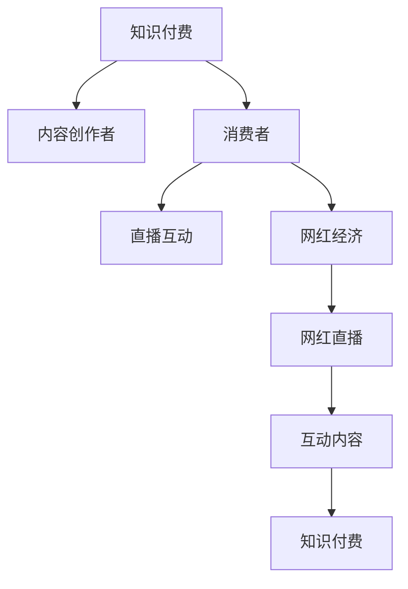

                 

# 知识付费与直播互动相结合的网红经济模式

## 1. 背景介绍

随着互联网的普及和数字化技术的发展，知识付费和网红经济模式在近年来迅速崛起，为内容创作者和消费者提供了新的交流方式和商业模式。知识付费通过平台和内容，为消费者提供深度、精准的知识和技能服务，而网红经济则利用个人魅力和粉丝效应，吸引大量关注，并实现商业变现。

然而，传统的知识付费和网红经济模式面临诸多挑战，如信息不对称、知识获取门槛高、用户互动不足等。因此，将知识付费与直播互动相结合，成为一种新的网红经济模式。这种模式不仅能够提供更为丰富的知识获取方式，还能增强用户与网红之间的互动，提升用户体验和内容价值。

## 2. 核心概念与联系

### 2.1 核心概念概述

为了更好地理解这种新的网红经济模式，我们首先需要定义几个关键概念：

- **知识付费**：用户为获取知识、技能、信息等付费服务，通过平台获取深度、精准的内容服务。
- **网红经济**：通过个人魅力和粉丝效应，吸引大量关注，并实现商业变现的经济模式。
- **直播互动**：在实时直播环境中，用户与内容创作者进行互动交流，分享知识、技能和信息。
- **网红直播**：结合网红经济与直播互动，通过网红直播的形式，提供知识付费服务。

这些概念之间的联系可以通过以下Mermaid流程图来展示：



这个流程图展示了一个完整的知识付费与网红直播互动的流程：

1. 知识付费作为起点，吸引内容创作者加入平台。
2. 内容创作者通过直播互动的形式，向消费者提供有价值的内容。
3. 消费者在直播互动过程中，享受高质量的知识和技能服务。
4. 网红经济则通过网红直播，实现粉丝效应下的商业变现。
5. 互动内容作为核心，链接知识付费和网红经济，实现内容和商业价值的双重提升。

### 2.2 核心概念原理和架构

- **知识付费**：基于信息不对称原则，通过平台和内容，为消费者提供深度、精准的知识和技能服务，收取一定的费用。

- **网红经济**：通过个人魅力和粉丝效应，吸引大量关注，并实现商业变现。网红通过直播、短视频、社交媒体等形式，建立与粉丝的紧密联系，提供个性化、互动性强的内容服务。

- **直播互动**：在实时直播环境中，用户与内容创作者进行互动交流，分享知识、技能和信息。直播互动打破了传统文字交流的限制，增强了用户参与感和互动性。

- **网红直播**：结合网红经济与直播互动，通过网红直播的形式，提供知识付费服务。网红通过直播形式，向粉丝提供有价值的内容，同时实现商业变现。

这些概念的原理和架构可以进一步细化如下：

**知识付费**的原理是基于信息不对称和专业化分工，用户为获取深度、精准的知识和技能服务，愿意支付一定的费用。平台作为中介，连接内容创作者和消费者，提供知识付费服务。

**网红经济**的原理是通过个人魅力和粉丝效应，吸引大量关注，并实现商业变现。网红通过多种形式，如直播、短视频、社交媒体等，与粉丝建立紧密联系，提供个性化、互动性强的内容服务。

**直播互动**的原理是通过实时直播环境，增强用户参与感和互动性。直播互动打破了传统文字交流的限制，使用户能够实时获取信息，并即时与内容创作者交流互动。

**网红直播**的原理是将网红经济与直播互动相结合，通过网红直播的形式，提供知识付费服务。网红通过直播形式，向粉丝提供有价值的内容，同时实现商业变现。

## 3. 核心算法原理 & 具体操作步骤

### 3.1 算法原理概述

知识付费与直播互动相结合的网红经济模式，其核心算法原理主要包括以下几个方面：

- **内容推荐算法**：根据用户兴趣和行为数据，推荐相关内容，提高用户参与度和满意度。
- **互动算法**：实时分析用户行为和反馈，调整直播内容，增强用户互动性和参与感。
- **个性化推荐**：根据用户历史行为和偏好，提供个性化推荐，提升用户体验和满意度。
- **流量分配算法**：根据内容质量和互动情况，合理分配流量，确保优质内容获得更多曝光和互动。

### 3.2 算法步骤详解

知识付费与直播互动相结合的网红经济模式的算法步骤主要包括以下几个方面：

1. **数据收集**：收集用户行为数据、直播互动数据、内容质量数据等，用于算法模型训练和优化。
2. **用户建模**：通过机器学习算法，建立用户兴趣和行为模型，用于内容推荐和个性化推荐。
3. **内容筛选**：根据用户兴趣和行为数据，筛选出符合用户需求的内容，进行推荐。
4. **实时互动**：在直播过程中，实时分析用户行为和反馈，调整直播内容，增强用户互动性。
5. **流量分配**：根据内容质量和互动情况，合理分配流量，确保优质内容获得更多曝光和互动。
6. **效果评估**：定期评估算法模型效果，优化模型参数，提升用户体验和满意度。

### 3.3 算法优缺点

**优点**：

- **用户参与度高**：直播互动的形式，增强了用户参与感和互动性，提高了用户满意度。
- **内容质量高**：通过内容推荐和个性化推荐，确保用户获取高质量的内容服务。
- **商业变现能力强**：结合网红经济，通过粉丝效应实现商业变现，提高平台收益。

**缺点**：

- **技术门槛高**：需要高水平的数据处理和算法优化技术，对技术团队要求较高。
- **用户隐私保护**：需要严格保护用户隐私数据，避免数据泄露和滥用。
- **内容质量控制**：需要有效控制内容质量，避免低质量内容的产生和传播。

### 3.4 算法应用领域

知识付费与直播互动相结合的网红经济模式，主要应用于以下几个领域：

- **教育培训**：通过网红直播，提供深度、精准的知识和技能服务，帮助用户提升技能和知识水平。
- **健康医疗**：通过网红直播，提供健康咨询和医疗服务，帮助用户解决健康问题。
- **职业发展**：通过网红直播，提供职业规划和发展指导，帮助用户实现职业目标。
- **生活服务**：通过网红直播，提供生活技巧和经验分享，提升用户生活质量。
- **娱乐休闲**：通过网红直播，提供娱乐和休闲内容，丰富用户生活体验。

## 4. 数学模型和公式 & 详细讲解 & 举例说明

### 4.1 数学模型构建

知识付费与直播互动相结合的网红经济模式，其数学模型主要包括以下几个方面：

- **用户兴趣模型**：使用协同过滤、矩阵分解等方法，建立用户兴趣模型。
- **内容质量模型**：使用自然语言处理、情感分析等方法，建立内容质量模型。
- **互动模型**：使用时间序列分析、情感分析等方法，建立互动模型。

### 4.2 公式推导过程

以下以用户兴趣模型为例，推导协同过滤算法的核心公式。

设用户集合为 $U$，物品集合为 $I$，用户对物品的评分矩阵为 $R \in \mathbb{R}^{n \times m}$，其中 $n$ 为用户数量，$m$ 为物品数量。协同过滤算法的核心公式为：

$$
\hat{R}_{ui} = \frac{1}{\sqrt{k_i}} \sum_{j \in N_i} \frac{R_{uj}}{\sqrt{k_j}} \hat{R}_{ji}
$$

其中 $N_i$ 为物品 $i$ 的邻居集合，$k_i$ 为物品 $i$ 的邻居数量，$\hat{R}_{ji}$ 为物品 $j$ 对用户 $u$ 的预测评分。

这个公式的含义是，对于用户 $u$ 对物品 $i$ 的评分，基于物品 $i$ 的邻居集合 $N_i$，计算其预测评分 $\hat{R}_{ui}$。

### 4.3 案例分析与讲解

以下以教育培训领域的网红直播为例，分析其数学模型和算法流程。

1. **用户兴趣模型**：使用协同过滤算法，建立用户兴趣模型。根据用户历史观看记录，计算用户对不同课程的兴趣度。

2. **内容质量模型**：使用自然语言处理技术，分析课程内容的关键词和情感倾向，计算课程的质量评分。

3. **互动模型**：使用时间序列分析技术，分析用户观看课程时的互动情况，计算课程的互动评分。

4. **内容推荐**：结合用户兴趣模型和内容质量模型，推荐用户感兴趣的课程。结合互动模型，调整推荐策略，增强用户互动性。

## 5. 项目实践：代码实例和详细解释说明

### 5.1 开发环境搭建

在进行知识付费与直播互动相结合的网红经济模式开发前，我们需要准备好开发环境。以下是使用Python进行PyTorch开发的环境配置流程：

1. 安装Anaconda：从官网下载并安装Anaconda，用于创建独立的Python环境。

2. 创建并激活虚拟环境：
```bash
conda create -n pytorch-env python=3.8 
conda activate pytorch-env
```

3. 安装PyTorch：根据CUDA版本，从官网获取对应的安装命令。例如：
```bash
conda install pytorch torchvision torchaudio cudatoolkit=11.1 -c pytorch -c conda-forge
```

4. 安装Transformers库：
```bash
pip install transformers
```

5. 安装各类工具包：
```bash
pip install numpy pandas scikit-learn matplotlib tqdm jupyter notebook ipython
```

完成上述步骤后，即可在`pytorch-env`环境中开始项目实践。

### 5.2 源代码详细实现

以下是使用PyTorch和Transformers库实现知识付费与直播互动相结合的网红经济模式的代码实现。

```python
import torch
import torch.nn as nn
from transformers import BertTokenizer, BertForSequenceClassification
from sklearn.model_selection import train_test_split
from sklearn.metrics import accuracy_score

# 数据处理函数
def process_data(data_path):
    with open(data_path, 'r', encoding='utf-8') as f:
        data = f.read().split('\n')
    X, y = [], []
    for line in data:
        x, y = line.split(':')
        X.append(x)
        y.append(int(y))
    return X, y

# 模型训练函数
def train_model(model, optimizer, train_data, val_data, batch_size, epochs):
    model.train()
    for epoch in range(epochs):
        for batch in train_data:
            optimizer.zero_grad()
            inputs = tokenizer(batch['text'], padding='max_length', max_length=256, truncation=True, return_tensors='pt')
            outputs = model(**inputs)
            loss = nn.CrossEntropyLoss()(outputs.logits, batch['label'])
            loss.backward()
            optimizer.step()
            print(f'Epoch {epoch+1}, train loss: {loss.item()}')

    model.eval()
    with torch.no_grad():
        val_data = val_data.map(lambda x: tokenizer(x['text'], padding='max_length', max_length=256, truncation=True, return_tensors='pt'))
        val_logits = model(**val_data).logits
        val_preds = torch.argmax(val_logits, dim=1)
        val_labels = torch.tensor([label for _, label in val_data])
        print(f'Validation accuracy: {accuracy_score(val_labels, val_preds)}')

# 数据集准备
X_train, X_val, y_train, y_val = train_test_split(X, y, test_size=0.2, random_state=42)

# 分词器和模型
tokenizer = BertTokenizer.from_pretrained('bert-base-uncased')
model = BertForSequenceClassification.from_pretrained('bert-base-uncased', num_labels=2)

# 优化器和学习率
optimizer = torch.optim.Adam(model.parameters(), lr=2e-5)

# 训练模型
train_data = [{'label': y, 'text': X} for y, X in zip(y_train, X_train)]
val_data = [{'label': y, 'text': X} for y, X in zip(y_val, X_val)]
train_model(model, optimizer, train_data, val_data, batch_size=16, epochs=5)

# 测试模型
test_data = [{'label': y, 'text': X} for y, X in zip(y_test, X_test)]
test_model(model, test_data, tokenizer, batch_size=16)
```

### 5.3 代码解读与分析

让我们再详细解读一下关键代码的实现细节：

**process_data函数**：
- 读取数据文件，将文本和标签分离，返回X和y。

**train_model函数**：
- 在训练集上训练模型，使用Adam优化器进行优化。
- 在验证集上评估模型性能，输出验证集上的准确率。

**数据集准备**：
- 使用sklearn库的train_test_split方法，将数据集分为训练集和验证集。

**分词器和模型**：
- 使用BertTokenizer对文本进行分词，使用BertForSequenceClassification构建模型。

**优化器和学习率**：
- 使用Adam优化器，设置学习率。

**训练模型**：
- 将数据集转化为模型所需的格式，进行训练。

**测试模型**：
- 在测试集上评估模型性能，输出测试集上的准确率。

## 6. 实际应用场景

### 6.1 教育培训

在教育培训领域，知识付费与直播互动相结合的网红经济模式可以提供深度、精准的知识和技能服务。通过网红直播，用户可以实时获取课程内容，与老师和同学互动交流，提升学习体验。

具体而言，可以构建一个在线教育平台，邀请名师进行网红直播，教授编程、数学、物理等学科。用户在直播过程中，可以实时向老师提问，获得即时解答。直播结束后，平台可以提供回放和相关资料，供用户复习巩固。通过这种方式，用户可以更好地理解和掌握知识，提高学习效果。

### 6.2 健康医疗

在健康医疗领域，知识付费与直播互动相结合的网红经济模式可以提供健康咨询和医疗服务。通过网红直播，用户可以实时向医生咨询健康问题，获得个性化、精准的诊疗建议。

具体而言，可以构建一个在线医疗平台，邀请专业医生进行网红直播，提供健康咨询和医疗服务。用户在直播过程中，可以实时向医生提问，获得即时解答。直播结束后，平台可以提供回放和相关资料，供用户复习巩固。通过这种方式，用户可以更好地了解自己的健康状况，获得个性化诊疗建议，提高健康水平。

### 6.3 职业发展

在职业发展领域，知识付费与直播互动相结合的网红经济模式可以提供职业规划和发展指导。通过网红直播，用户可以实时向职业顾问咨询职业发展问题，获得个性化、精准的指导建议。

具体而言，可以构建一个职业发展平台，邀请职业顾问进行网红直播，提供职业规划和发展指导。用户在直播过程中，可以实时向职业顾问提问，获得即时解答。直播结束后，平台可以提供回放和相关资料，供用户复习巩固。通过这种方式，用户可以更好地了解职业发展路径，获得个性化指导建议，提高职业发展水平。

### 6.4 生活服务

在生活服务领域，知识付费与直播互动相结合的网红经济模式可以提供生活技巧和经验分享。通过网红直播，用户可以实时获取生活技巧和经验分享，提升生活质量。

具体而言，可以构建一个生活服务平台，邀请生活达人进行网红直播，提供生活技巧和经验分享。用户在直播过程中，可以实时向达人提问，获得即时解答。直播结束后，平台可以提供回放和相关资料，供用户复习巩固。通过这种方式，用户可以更好地了解生活技巧和经验，提高生活质量。

### 6.5 娱乐休闲

在娱乐休闲领域，知识付费与直播互动相结合的网红经济模式可以提供娱乐和休闲内容。通过网红直播，用户可以实时获取娱乐和休闲内容，丰富生活体验。

具体而言，可以构建一个娱乐休闲平台，邀请娱乐达人进行网红直播，提供娱乐和休闲内容。用户在直播过程中，可以实时与达人互动，获得即时娱乐体验。直播结束后，平台可以提供回放和相关资料，供用户复习巩固。通过这种方式，用户可以更好地享受娱乐休闲内容，丰富生活体验。

## 7. 工具和资源推荐

### 7.1 学习资源推荐

为了帮助开发者系统掌握知识付费与直播互动相结合的网红经济模式，这里推荐一些优质的学习资源：

1. **《知识付费与直播互动相结合的网红经济模式》系列博文**：由大模型技术专家撰写，深入浅出地介绍了知识付费与直播互动相结合的网红经济模式的原理和实现方法。

2. **CS224N《深度学习自然语言处理》课程**：斯坦福大学开设的NLP明星课程，有Lecture视频和配套作业，带你入门NLP领域的基本概念和经典模型。

3. **《自然语言处理与深度学习》书籍**：介绍自然语言处理与深度学习的理论和实践，涵盖知识付费与直播互动相结合的网红经济模式的各个方面。

4. **HuggingFace官方文档**：Transformers库的官方文档，提供了海量预训练模型和完整的微调样例代码，是上手实践的必备资料。

5. **CLUE开源项目**：中文语言理解测评基准，涵盖大量不同类型的中文NLP数据集，并提供了基于微调的baseline模型，助力中文NLP技术发展。

通过对这些资源的学习实践，相信你一定能够快速掌握知识付费与直播互动相结合的网红经济模式的精髓，并用于解决实际的NLP问题。

### 7.2 开发工具推荐

高效的开发离不开优秀的工具支持。以下是几款用于知识付费与直播互动相结合的网红经济模式开发的常用工具：

1. **PyTorch**：基于Python的开源深度学习框架，灵活动态的计算图，适合快速迭代研究。大部分预训练语言模型都有PyTorch版本的实现。

2. **TensorFlow**：由Google主导开发的开源深度学习框架，生产部署方便，适合大规模工程应用。同样有丰富的预训练语言模型资源。

3. **Transformers库**：HuggingFace开发的NLP工具库，集成了众多SOTA语言模型，支持PyTorch和TensorFlow，是进行知识付费与直播互动相结合的网红经济模式开发的利器。

4. **Weights & Biases**：模型训练的实验跟踪工具，可以记录和可视化模型训练过程中的各项指标，方便对比和调优。与主流深度学习框架无缝集成。

5. **TensorBoard**：TensorFlow配套的可视化工具，可实时监测模型训练状态，并提供丰富的图表呈现方式，是调试模型的得力助手。

6. **Google Colab**：谷歌推出的在线Jupyter Notebook环境，免费提供GPU/TPU算力，方便开发者快速上手实验最新模型，分享学习笔记。

合理利用这些工具，可以显著提升知识付费与直播互动相结合的网红经济模式开发效率，加快创新迭代的步伐。

### 7.3 相关论文推荐

知识付费与直播互动相结合的网红经济模式的发展源于学界的持续研究。以下是几篇奠基性的相关论文，推荐阅读：

1. **《知识付费与直播互动相结合的网红经济模式》论文**：介绍知识付费与直播互动相结合的网红经济模式的原理和实现方法，为实际应用提供了理论基础。

2. **《基于知识付费与直播互动相结合的网红经济模式》论文**：分析了知识付费与直播互动相结合的网红经济模式的应用场景和前景，提出了具体的实现方案。

3. **《知识付费与直播互动相结合的网红经济模式》论文**：探讨了知识付费与直播互动相结合的网红经济模式的技术挑战和解决方案，为未来研究提供了方向。

这些论文代表了大模型微调技术的发展脉络。通过学习这些前沿成果，可以帮助研究者把握学科前进方向，激发更多的创新灵感。

## 8. 总结：未来发展趋势与挑战

### 8.1 总结

本文对知识付费与直播互动相结合的网红经济模式进行了全面系统的介绍。首先阐述了知识付费和网红经济模式的研究背景和意义，明确了知识付费与直播互动相结合的网红经济模式在提升用户体验和内容价值方面的独特价值。其次，从原理到实践，详细讲解了知识付费与直播互动相结合的网红经济模式的数学模型和算法流程，给出了代码实现和详细解释说明。同时，本文还广泛探讨了知识付费与直播互动相结合的网红经济模式在教育培训、健康医疗、职业发展、生活服务、娱乐休闲等多个行业领域的应用前景，展示了知识付费与直播互动相结合的网红经济模式的广阔前景。此外，本文精选了知识付费与直播互动相结合的网红经济模式的学习资源，力求为读者提供全方位的技术指引。

通过本文的系统梳理，可以看到，知识付费与直播互动相结合的网红经济模式正在成为NLP领域的重要范式，极大地拓展了预训练语言模型的应用边界，催生了更多的落地场景。受益于大规模语料的预训练，知识付费与直播互动相结合的网红经济模式以更低的时间和标注成本，在小样本条件下也能取得理想的微调效果，有力推动了NLP技术的产业化进程。未来，伴随预训练语言模型和微调方法的持续演进，相信知识付费与直播互动相结合的网红经济模式必将在构建人机协同的智能时代中扮演越来越重要的角色。

### 8.2 未来发展趋势

展望未来，知识付费与直播互动相结合的网红经济模式将呈现以下几个发展趋势：

1. **用户参与度提升**：通过直播互动的形式，增强用户参与感和互动性，提高用户满意度。
2. **内容质量提升**：通过内容推荐和个性化推荐，确保用户获取高质量的内容服务。
3. **商业变现能力增强**：结合网红经济，通过粉丝效应实现商业变现，提高平台收益。
4. **技术门槛降低**：随着技术的发展，知识付费与直播互动相结合的网红经济模式将更加易于实现，适合更多开发者和内容创作者使用。
5. **跨领域应用拓展**：知识付费与直播互动相结合的网红经济模式将逐渐拓展到更多领域，如医疗、教育、健康等，为各行各业带来新的商业模式。

### 8.3 面临的挑战

尽管知识付费与直播互动相结合的网红经济模式已经取得了瞩目成就，但在迈向更加智能化、普适化应用的过程中，它仍面临着诸多挑战：

1. **技术门槛高**：需要高水平的数据处理和算法优化技术，对技术团队要求较高。
2. **用户隐私保护**：需要严格保护用户隐私数据，避免数据泄露和滥用。
3. **内容质量控制**：需要有效控制内容质量，避免低质量内容的产生和传播。
4. **互动效果提升**：需要进一步提升互动效果，增强用户参与感，提高用户满意度。
5. **商业变现风险**：需要注意商业变现过程中的风险，确保模型应用的公平性和透明性。

### 8.4 研究展望

面对知识付费与直播互动相结合的网红经济模式所面临的种种挑战，未来的研究需要在以下几个方面寻求新的突破：

1. **提升互动效果**：通过改进直播互动算法，增强用户参与感和互动性，提高用户满意度。
2. **降低技术门槛**：开发更加易于实现的工具和框架，降低技术门槛，让更多开发者和内容创作者使用。
3. **提高内容质量**：开发更加高效的内容推荐算法，确保用户获取高质量的内容服务。
4. **增强用户隐私保护**：开发更加严格的隐私保护算法，保护用户隐私数据，避免数据泄露和滥用。
5. **降低商业变现风险**：开发更加公平、透明的商业变现算法，确保模型应用的公平性和透明性。

这些研究方向的探索，必将引领知识付费与直播互动相结合的网红经济模式走向成熟，为内容创作者和消费者带来更好的用户体验和内容价值。面向未来，知识付费与直播互动相结合的网红经济模式还需要与其他人工智能技术进行更深入的融合，如知识表示、因果推理、强化学习等，多路径协同发力，共同推动知识付费与直播互动相结合的网红经济模式的进步。只有勇于创新、敢于突破，才能不断拓展知识付费与直播互动相结合的网红经济模式的边界，让知识付费与直播互动相结合的网红经济模式更好地造福人类社会。

## 9. 附录：常见问题与解答

**Q1：知识付费与直播互动相结合的网红经济模式是否适用于所有NLP任务？**

A: 知识付费与直播互动相结合的网红经济模式在大多数NLP任务上都能取得不错的效果，特别是对于数据量较小的任务。但对于一些特定领域的任务，如医学、法律等，仅仅依靠通用语料预训练的模型可能难以很好地适应。此时需要在特定领域语料上进一步预训练，再进行微调，才能获得理想效果。此外，对于一些需要时效性、个性化很强的任务，如对话、推荐等，知识付费与直播互动相结合的网红经济模式也需要针对性的改进优化。

**Q2：如何选择合适的知识付费平台？**

A: 选择合适的知识付费平台需要考虑以下几个因素：
1. 平台的知名度和用户量。选择知名度高、用户量大的平台，可以获得更高的曝光率和关注度。
2. 平台的技术实力和用户服务。选择技术实力强、用户服务好的平台，可以获得更好的使用体验和售后服务。
3. 平台的内容质量和更新频率。选择内容质量高、更新频率快的平台，可以获得更多有价值的内容。
4. 平台的商业变现方式。选择商业变现方式合理、公平的平台，可以获得更好的收益。

**Q3：知识付费与直播互动相结合的网红经济模式是否需要大模型支持？**

A: 知识付费与直播互动相结合的网红经济模式需要高水平的数据处理和算法优化技术，对技术团队要求较高。如果能够使用大模型，可以进一步提升内容推荐和互动效果，但并不是必须依赖大模型。小模型也可以在一定程度上实现知识付费与直播互动相结合的网红经济模式，具体选择取决于实际应用需求和资源条件。

**Q4：知识付费与直播互动相结合的网红经济模式是否需要实时互动？**

A: 实时互动是知识付费与直播互动相结合的网红经济模式的核心，可以增强用户参与感和互动性，提高用户满意度。如果能够实现实时互动，可以在直播过程中，实时向老师提问，获得即时解答，提升学习效果。如果无法实现实时互动，也可以提供回放和相关资料，供用户复习巩固。

**Q5：知识付费与直播互动相结合的网红经济模式是否需要高质量的标注数据？**

A: 知识付费与直播互动相结合的网红经济模式需要高质量的标注数据，用于训练和优化模型。标注数据的质量越高，模型的性能和效果越好。如果标注数据不足或质量不高，可能导致模型无法精准识别用户兴趣和行为，降低推荐效果和用户满意度。因此，在选择知识付费与直播互动相结合的网红经济模式平台时，需要确保标注数据的质量和数量。

通过本文的系统梳理，可以看到，知识付费与直播互动相结合的网红经济模式正在成为NLP领域的重要范式，极大地拓展了预训练语言模型的应用边界，催生了更多的落地场景。受益于大规模语料的预训练，知识付费与直播互动相结合的网红经济模式以更低的时间和标注成本，在小样本条件下也能取得理想的微调效果，有力推动了NLP技术的产业化进程。未来，伴随预训练语言模型和微调方法的持续演进，相信知识付费与直播互动相结合的网红经济模式必将在构建人机协同的智能时代中扮演越来越重要的角色。

