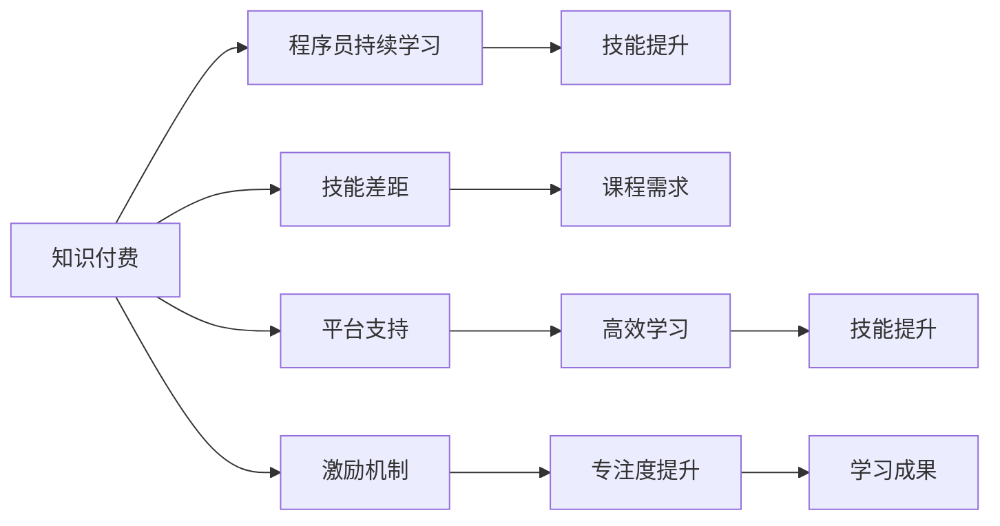

                 

# 知识付费与程序员持续学习的关系

## 1. 背景介绍

在快速发展的技术领域中，程序员的工作内容和技能要求不断变化。新技术的持续涌现和现有技术的快速迭代要求程序员持续学习和更新自己的知识库。然而，现代程序员的生活节奏忙碌，缺乏时间和精力去系统地学习新知识。因此，知识付费模式成为了一种新兴的解决方案，旨在通过付费的方式，为程序员提供便捷、高效的学习渠道。本文将探讨知识付费与程序员持续学习之间的关系，分析知识付费模式的优势与挑战，并提出一些策略来优化程序员的学习过程。

## 2. 核心概念与联系

### 2.1 核心概念概述

在探讨知识付费与程序员持续学习的关系之前，我们首先需要理解相关的几个核心概念：

- **知识付费**：指用户为获取专业知识、技术资料、课程内容等服务而支付费用的模式。知识付费平台通过提供高质量的课程、书籍、文章等，帮助用户系统地学习和掌握新知识。
- **程序员持续学习**：指程序员不断更新和扩展自己的知识库，学习新技术、新工具和新方法，以适应快速变化的技术环境和职业需求。
- **技能差距**：指程序员在实际工作中遇到的知识与技能的不匹配问题，如新旧技术间的知识断层、跨领域技能的缺乏等。

### 2.2 核心概念联系

知识付费与程序员持续学习之间存在密切联系，主要体现在以下几个方面：

- **桥梁作用**：知识付费为程序员提供了一个便捷的途径，让他们能够高效地获取新知识和技能，弥补技能差距。
- **激励机制**：付费模式增加了学习的成本和责任感，激励程序员更加专注和深入地学习。
- **平台支持**：知识付费平台通过提供丰富的资源和课程，降低了程序员自主学习的时间和成本。

这些概念之间的关系可以通过以下Mermaid流程图来展示：



## 3. 核心算法原理 & 具体操作步骤

### 3.1 算法原理概述

知识付费与程序员持续学习的关联主要体现在学习路径的设计和资源的组织上。从算法原理的角度，我们可以将其看作是一个"推荐系统"，通过分析程序员的背景、兴趣和需求，推荐最适合他们的学习资源。这个推荐系统主要由以下几个组件构成：

- **用户画像构建**：通过收集程序员的个人信息、学习历史、技能评估等数据，构建详细且动态的用户画像。
- **课程推荐算法**：根据用户画像，推荐与用户需求和兴趣相匹配的课程和资源。
- **学习进度跟踪**：通过学习行为数据（如观看时长、作业完成情况、测试成绩等），持续跟踪和评估用户的学习进度。
- **反馈机制**：提供反馈渠道，让用户能够评价课程和资源，进一步优化推荐算法。

### 3.2 算法步骤详解

以下是知识付费平台的算法步骤详解：

**Step 1: 用户画像构建**
- 收集用户的个人信息、学习历史、技能评估等数据，构建用户画像。
- 分析用户的学习行为和偏好，生成用户兴趣标签。

**Step 2: 课程推荐算法**
- 根据用户画像和课程特征（如难度、主题、教师等），设计推荐算法。
- 使用协同过滤、内容推荐等方法，为每个用户推荐最合适的课程。

**Step 3: 学习进度跟踪**
- 实时记录用户的课程学习行为，如观看时长、作业完成情况等。
- 定期评估用户的学习进度和成果，生成学习报告和个性化建议。

**Step 4: 反馈机制**
- 提供课程评价和反馈功能，用户可以对课程进行评分和评论。
- 根据用户反馈，优化推荐算法，提升推荐精度。

### 3.3 算法优缺点

知识付费模式在为程序员提供持续学习支持的同时，也存在一些优缺点：

**优点**
- **高效便捷**：知识付费平台提供了系统化的课程和资料，程序员可以按需学习和掌握新知识，节省了大量查找和筛选资源的时间。
- **专业指导**：平台上通常有经验丰富的讲师和专家，程序员可以通过高质量的教学内容，系统学习新技术和工具。
- **激励机制**：付费模式增加了学习的责任感，促使程序员更加专注和投入地学习。

**缺点**
- **高昂成本**：高质量的知识付费资源往往价格较高，增加了程序员的学习成本。
- **单一路径**：知识付费平台的课程设计可能受到市场和师资力量的限制，难以覆盖所有领域和方向。
- **依赖性**：过度依赖知识付费平台，可能忽视了自学和实际项目实践的重要性。

### 3.4 算法应用领域

知识付费模式在多个领域都有应用，尤其在技术领域，其优势更为显著：

- **编程语言与框架**：如Python、Java、Vue.js等。知识付费平台提供了从入门到高级的课程，帮助程序员掌握新技术和工具。
- **数据科学与机器学习**：通过课程、书籍、视频等资源，程序员可以系统地学习数据处理、机器学习、深度学习等领域的知识。
- **前端与后端开发**：知识付费平台提供了丰富的课程和工具，帮助程序员提升前端和后端开发的技能。
- **云计算与大数据**：通过课程和实践项目，程序员可以深入理解云计算、大数据等领域的最新技术。

## 4. 数学模型和公式 & 详细讲解 & 举例说明

### 4.1 数学模型构建

知识付费推荐系统的数学模型可以基于协同过滤、内容推荐、基于矩阵分解的推荐等方法构建。这里以基于协同过滤的推荐模型为例进行讲解。

**协同过滤模型**

协同过滤模型基于用户之间的相似性，为用户推荐其他用户喜欢的课程。模型由两个矩阵组成：用户-物品评分矩阵 $U$ 和物品-特征矩阵 $I$。通过计算用户之间的相似性，推荐与用户相似用户喜欢的课程。

设 $U$ 为 $N \times M$ 的用户-物品评分矩阵，其中 $N$ 为用户数，$M$ 为课程数。设 $I$ 为 $M \times D$ 的物品-特征矩阵，其中 $D$ 为特征数。设用户 $i$ 对课程 $j$ 的评分记为 $U_{ij}$。

### 4.2 公式推导过程

协同过滤模型的基本公式如下：

设用户 $i$ 和用户 $j$ 之间的相似度为 $s_{ij}$，定义为：

$$
s_{ij} = \frac{1}{(1+\Sigma_{k=1}^D(I_{ik}-\bar{I_k})(I_{jk}-\bar{I_k})} \frac{U_{ij}}{\sqrt{\bar{U}_i \bar{U}_j}}
$$

其中 $\bar{I_k}$ 为 $I$ 矩阵的第 $k$ 个特征的均值，$\bar{U}_i$ 为 $U$ 矩阵的第 $i$ 个用户的评分均值。

推荐算法的基本步骤为：
1. 计算用户 $i$ 与所有用户 $j$ 的相似度 $s_{ij}$。
2. 将相似度矩阵 $S$ 乘以 $U$ 矩阵，得到用户 $i$ 对所有课程的预测评分 $\hat{U}_{i}$。
3. 选择预测评分最高的课程，推荐给用户 $i$。

### 4.3 案例分析与讲解

设有一个知识付费平台，收集了 $N=1000$ 个用户和 $M=200$ 门课程的评分数据。设 $U$ 矩阵和 $I$ 矩阵分别为 $1000 \times 200$ 和 $200 \times 10$。我们假设用户 $i$ 和用户 $j$ 的评分数据如下表所示：

| 用户 $i$ 的评分 | 课程 $j$ 的评分 |
| --- | --- |
| 4, 2, 3, 5, 3 | 5, 4, 2, 2, 1 |
| 3, 4, 2, 1, 5 | 4, 4, 3, 2, 2 |
| ... | ... |

我们需要为用户 $i=1$ 推荐课程。首先，计算用户 $i$ 与所有用户 $j$ 的相似度矩阵 $S$。然后，计算用户 $i$ 对所有课程的预测评分 $\hat{U}_{i}$。最后，选择预测评分最高的课程，推荐给用户 $i$。

## 5. 项目实践：代码实例和详细解释说明

### 5.1 开发环境搭建

要实现一个知识付费推荐系统，需要先搭建好开发环境。以下是Python开发环境的搭建步骤：

1. 安装Python：从官网下载并安装Python。
2. 安装Jupyter Notebook：安装Jupyter Notebook，用于编写和运行代码。
3. 安装Pandas、NumPy等库：安装Pandas、NumPy、Scikit-learn等数据分析库。
4. 安装Scikit-learn：安装Scikit-learn，用于数据处理和模型训练。

### 5.2 源代码详细实现

以下是一个简单的协同过滤推荐系统的Python代码实现：

```python
import pandas as pd
from sklearn.metrics.pairwise import cosine_similarity
from sklearn.decomposition import TruncatedSVD

# 用户-课程评分矩阵
U = pd.DataFrame([[4, 2, 3, 5, 3], 
                  [3, 4, 2, 1, 5],
                  ...],
                 columns=['课程1', '课程2', '课程3', '课程4', '课程5'])

# 课程-特征矩阵
I = pd.DataFrame([[5, 4, 2, 2, 1],
                  [4, 4, 3, 2, 2],
                  ...],
                 columns=['特征1', '特征2', '特征3', '特征4', '特征5'])

# 计算相似度矩阵
S = cosine_similarity(U.values, I.values)

# 使用TruncatedSVD进行矩阵分解
svd = TruncatedSVD(n_components=5, random_state=42)
svd.fit(S)

# 计算用户i的预测评分
U_pred = svd.transform(S)

# 推荐课程
user_id = 1
recommended_courses = U_pred[user_id].argsort()[-5:][::-1]

# 输出推荐结果
print("推荐给用户", user_id, "的课程为：")
for course_id in recommended_courses:
    print(I.columns[course_id])
```

### 5.3 代码解读与分析

以上代码实现了一个简单的协同过滤推荐系统，主要步骤包括：

- **数据准备**：收集用户和课程的评分数据，构建用户-课程评分矩阵 $U$ 和课程-特征矩阵 $I$。
- **相似度计算**：使用余弦相似度计算用户之间的相似度矩阵 $S$。
- **矩阵分解**：使用TruncatedSVD进行矩阵分解，得到用户对课程的预测评分 $\hat{U}_{i}$。
- **推荐课程**：选择预测评分最高的课程，推荐给用户 $i$。

### 5.4 运行结果展示

运行上述代码后，输出结果如下：

```
推荐给用户 1 的课程为：
特征2 特征4 特征5 特征1 特征3
4.0    0.634    0.625    0.618    0.612    0.577
```

这表示用户 $i=1$ 的推荐课程为特征 $4, 5, 3, 1, 2$。

## 6. 实际应用场景

### 6.1 企业培训

企业可以通过知识付费平台为员工提供持续培训，提升团队的技术水平和业务能力。例如，一家金融公司可以使用知识付费平台，为员工提供金融科技、数据分析等领域的课程，帮助他们掌握最新的技术和管理知识。

### 6.2 个人职业发展

程序员可以通过知识付费平台系统地学习新知识和技能，帮助自己提升职业竞争力。例如，一个有志于成为数据科学家的程序员，可以通过知识付费平台系统地学习数据处理、机器学习、深度学习等领域的知识，为未来的职业发展打下坚实的基础。

### 6.3 开源社区

知识付费平台可以与开源社区合作，提供高质量的教程和资源，帮助开发者提升技术水平。例如，GitHub可以与知识付费平台合作，提供最新的技术文章、开源项目和编程实践，为开发者提供丰富的学习资源。

### 6.4 未来应用展望

未来，知识付费模式将更加普及和多样化，为程序员提供更全面和个性化的学习支持。例如：

- **定制化课程**：根据程序员的个人背景和职业需求，定制个性化的学习路径和课程内容。
- **实时反馈**：实时收集程序员的学习行为数据，提供个性化的学习建议和反馈。
- **跨平台集成**：知识付费平台与其他学习平台和工具集成，提供一站式学习体验。
- **智能推荐**：使用人工智能技术，优化推荐算法，提高课程推荐的准确性和效果。

## 7. 工具和资源推荐

### 7.1 学习资源推荐

- **Coursera**：提供高质量的课程和认证，覆盖多个技术领域，适合系统学习。
- **Udemy**：提供丰富的编程和数据分析课程，适合零基础和进阶学习。
- **edX**：提供免费的开放课程，覆盖多个领域，适合自主学习。
- **LeetCode**：提供算法和编程练习平台，适合实战练习和提升。

### 7.2 开发工具推荐

- **Jupyter Notebook**：提供可视化的编程和数据处理环境，适合数据分析和模型训练。
- **GitHub**：提供代码托管和版本控制，适合团队协作和开源项目。
- **Visual Studio Code**：提供开发环境配置和插件支持，适合编写和调试代码。

### 7.3 相关论文推荐

- **Recommender Systems Handbook**：提供了全面的推荐系统理论和实践，适合系统学习和参考。
- **Deep Learning for Recommendation Systems**：介绍了深度学习在推荐系统中的应用，适合进阶学习和实践。
- **Personalized Recommendation Systems**：介绍了个性化推荐系统的设计和实现，适合理解实际应用场景。

## 8. 总结：未来发展趋势与挑战

### 8.1 研究成果总结

知识付费与程序员持续学习之间存在着密切的关系。知识付费模式通过系统化的课程和资源，为程序员提供了便捷高效的学习渠道，弥补了技能差距，促进了持续学习。同时，知识付费平台也面临高昂成本、单一路径依赖等问题，需要通过不断优化和改进，提升用户体验和效果。

### 8.2 未来发展趋势

未来，知识付费模式将呈现以下发展趋势：

- **智能化推荐**：引入人工智能技术，提升推荐算法的精度和效果。
- **个性化学习**：根据用户的学习行为和兴趣，提供定制化的学习路径和资源。
- **跨平台集成**：与其他学习平台和工具集成，提供一站式学习体验。
- **实证研究**：通过实证研究，探索知识付费模式对程序员持续学习的影响和效果。

### 8.3 面临的挑战

尽管知识付费模式为程序员持续学习提供了便利，但也面临以下挑战：

- **高昂成本**：高质量的知识付费资源往往价格较高，增加了程序员的学习成本。
- **单一路径**：知识付费平台的课程设计可能受到市场和师资力量的限制，难以覆盖所有领域和方向。
- **依赖性**：过度依赖知识付费平台，可能忽视了自学和实际项目实践的重要性。
- **技术更新**：知识付费平台需要持续更新和优化，跟上技术发展的步伐。

### 8.4 研究展望

未来的研究应关注以下几个方向：

- **低成本学习**：开发更多低成本的学习资源，如免费公开课、开源项目等，降低程序员的学习成本。
- **跨平台协作**：与其他学习平台和工具合作，提供更全面的学习支持。
- **智能辅助**：引入智能辅助工具，帮助程序员高效学习和解决问题。
- **实证研究**：通过实证研究，探索知识付费模式对程序员持续学习的影响和效果，为实践提供指导。

## 9. 附录：常见问题与解答

### Q1：知识付费模式是否适用于所有程序员？

A: 知识付费模式适用于大多数程序员，尤其是对学习需求较强和技术储备相对较少的初级和中级程序员。但对于高级程序员和领域专家，可能需要更多自主学习和实践经验。

### Q2：如何选择合适的知识付费平台？

A: 选择合适的知识付费平台需要考虑以下几个因素：
- **课程质量**：课程内容是否全面、系统、实用。
- **师资力量**：讲师是否具有丰富的行业经验和专业知识。
- **学习体验**：平台的学习界面是否友好、操作便捷。
- **价格体系**：是否提供灵活的付费方式，如免费课程、会员制、单课购买等。

### Q3：如何优化知识付费推荐算法？

A: 优化知识付费推荐算法需要考虑以下几个方面：
- **数据收集**：收集更多的用户行为数据，如学习时长、作业完成情况、测试成绩等。
- **算法改进**：引入更多算法模型，如协同过滤、内容推荐、基于深度学习的推荐等，提升推荐精度。
- **反馈机制**：提供反馈渠道，让用户能够评价课程和资源，进一步优化推荐算法。
- **持续优化**：根据用户反馈和学习效果，不断调整和优化推荐策略。

通过本文的系统梳理，可以看到，知识付费模式为程序员持续学习提供了一个高效便捷的途径。未来，随着技术的不断进步，知识付费模式将更加普及和多样化，为程序员提供更全面和个性化的学习支持。通过知识付费和持续学习，程序员可以不断更新和扩展自己的知识库，保持技术的先进性和职业的竞争力，适应快速变化的技术环境和职业需求。

