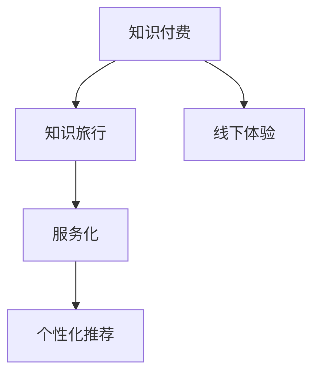

                 

# 知识付费与线下体验相结合的知识旅行模式

> 关键词：知识付费, 知识旅行, 线下体验, 服务化, 个性化推荐

## 1. 背景介绍

### 1.1 问题由来
随着互联网技术的快速发展，在线知识付费平台已成为人们获取知识的重要途径。然而，线上学习存在诸多问题，如学习环境不够沉浸、学习动力容易分散、知识难以内化等。为了解决这些问题，知识旅行模式应运而生，它将线上知识和线下体验相结合，通过知识旅行服务化，提供沉浸式学习体验，增强知识的内化和应用。

### 1.2 问题核心关键点
知识旅行模式的核心在于通过线下活动和线上课程相结合，提供更加丰富和沉浸的学习体验。它融合了知识付费和线下体验的优势，打破了线上学习的局限性，促进了知识的内化和应用。

### 1.3 问题研究意义
研究知识旅行模式，对于拓展在线知识付费的服务形式，提升学习效果，加速知识传播具有重要意义。

1. 提升学习体验：通过线下活动和互动，知识旅行模式能够提供更加沉浸式和互动式的学习体验，提高学习者的参与度和满意度。
2. 增强知识内化：线下活动和互动能够促进知识的深度理解和应用，帮助学习者更好地将知识内化为自身技能。
3. 加速知识传播：知识旅行模式能够促进知识在更广泛的人群中传播，推动知识的普及和应用。
4. 推动教育公平：知识旅行模式通过提供多样化的学习方式，为不同地域、不同背景的学习者提供平等的学习机会。
5. 促进产业升级：知识旅行模式能够推动教育服务产业的发展，促进教育资源的优化配置。

## 2. 核心概念与联系

### 2.1 核心概念概述

为更好地理解知识旅行模式，本节将介绍几个密切相关的核心概念：

- **知识付费(Knowledge-Paid)**：指消费者为获取知识和技能而支付费用的商业行为，涵盖在线课程、线下培训等多种形式。知识付费模式注重知识和技能的传递，但缺乏线下体验和互动。
- **知识旅行(Knowledge Tourism)**：指以知识为主题的旅行活动，旨在通过亲身体验和学习，获取知识，增强认知。知识旅行模式将知识旅行与付费服务相结合，提供更加丰富的学习体验。
- **线下体验(Offline Experience)**：指通过实际参与和互动，获取知识和技能的过程。线下体验能够提供沉浸式和互动式的学习体验，促进知识的内化和应用。
- **服务化(Serviceization)**：指将线下体验和线上课程整合为统一的服务体系，提供一站式的知识获取和应用服务。服务化模式能够提高学习效率，增强用户体验。
- **个性化推荐(Personalized Recommendation)**：指根据学习者的兴趣、需求等个性化信息，推荐适合的学习内容和活动，提升学习效果。个性化推荐能够提供定制化的学习体验，满足学习者的多样化需求。

这些核心概念之间的逻辑关系可以通过以下Mermaid流程图来展示：



这个流程图展示的知识旅行模式的核心概念及其之间的关系：

1. 知识付费通过线上课程提供知识，但缺乏线下体验和互动。
2. 知识旅行通过亲身体验和学习获取知识，但难以形成系统的学习体系。
3. 线下体验能够提供沉浸式和互动式的学习体验，促进知识的内化和应用。
4. 服务化模式将线下体验和线上课程整合，提供一站式的知识获取和应用服务。
5. 个性化推荐根据学习者的个性化需求，推荐适合的学习内容和活动，提升学习效果。

这些概念共同构成了知识旅行模式的学习框架，使其能够提供更加丰富和高效的学习体验。

## 3. 核心算法原理 & 具体操作步骤
### 3.1 算法原理概述

知识旅行模式的核心算法主要包括以下几个方面：

1. **数据收集与处理**：通过在线平台和线下活动，收集学习者的兴趣、需求、行为等数据，进行预处理和特征提取。
2. **个性化推荐**：根据学习者的个性化信息，推荐适合的学习内容和活动，提升学习效果。
3. **服务体系整合**：将线下体验和线上课程整合为统一的服务体系，提供一站式的知识获取和应用服务。
4. **互动与反馈**：通过互动和反馈机制，增强学习者的参与度和满意度，促进知识的深度理解和应用。

### 3.2 算法步骤详解

**Step 1: 数据收集与预处理**
- 收集学习者的兴趣、需求、行为等数据，包括在线课程浏览记录、线下活动参与情况、互动评论等。
- 对数据进行预处理和特征提取，如清洗、归一化、特征选择等，形成结构化的数据集。

**Step 2: 个性化推荐**
- 根据数据集中的特征信息，构建推荐模型，如协同过滤、基于内容的推荐、深度学习推荐等。
- 根据学习者的个性化信息，预测适合的学习内容和活动，生成推荐列表。
- 对推荐结果进行排序，选择最合适的推荐内容和活动，推送给学习者。

**Step 3: 服务体系整合**
- 将线下体验和线上课程整合为统一的服务体系，提供一站式的知识获取和应用服务。
- 设计服务化接口，支持线上和线下数据的无缝对接和互动。
- 提供学习者和讲师之间的互动渠道，增强学习者的参与度和满意度。

**Step 4: 互动与反馈**
- 提供互动机制，如在线讨论、实时反馈、互动游戏等，增强学习者的参与度和满意度。
- 收集学习者的反馈信息，不断优化推荐模型和服务体系。

### 3.3 算法优缺点

知识旅行模式的算法具有以下优点：
1. 提供沉浸式和互动式的学习体验，提升学习效果。
2. 增强知识的内化和应用，促进知识的深度理解。
3. 提供一站式的知识获取和应用服务，提高学习效率。
4. 根据学习者的个性化需求，推荐适合的学习内容和活动，满足多样化需求。

同时，该算法也存在一定的局限性：
1. 对数据的依赖性较高，需要收集大量的学习者数据。
2. 对推荐模型的要求较高，需要不断优化和迭代。
3. 线下活动的组织和管理成本较高，需要投入大量人力和资源。
4. 个性化推荐的准确性有待提高，需要结合多种推荐技术。

尽管存在这些局限性，但就目前而言，知识旅行模式在教育服务领域的应用前景广阔，能够为学习者提供更加丰富和高效的学习体验。

### 3.4 算法应用领域

知识旅行模式已经在教育服务领域得到了广泛的应用，覆盖了几乎所有常见的学习场景，例如：

- 在线课程推荐：通过个性化推荐，为学习者推荐适合的在线课程，提高学习效果。
- 线下体验活动：组织线上课程的学习者参加线下活动，增强互动和体验。
- 互动讨论区：提供互动讨论区，学习者和讲师之间可以实时互动，增强学习效果。
- 实时反馈机制：提供实时反馈机制，收集学习者的反馈信息，不断优化推荐模型和服务体系。
- 游戏化学习：通过互动游戏等形式，增强学习者的参与度和满意度，促进知识的深度理解。

除了上述这些经典场景外，知识旅行模式还被创新性地应用于更多领域中，如智能教育、企业培训、职业发展等，为学习者提供了更加多样化和个性化的学习体验。

## 4. 数学模型和公式 & 详细讲解  
### 4.1 数学模型构建

本节将使用数学语言对知识旅行模式的推荐算法进行更加严格的刻画。

假设学习者集合为 $U$，课程集合为 $I$，每个课程 $i$ 的评分矩阵为 $R \in \mathbb{R}^{n \times m}$，其中 $n$ 为学习者数量，$m$ 为课程数量。设 $x_i \in \mathbb{R}^d$ 为课程 $i$ 的特征向量，$d$ 为特征维度。

定义学习者 $u$ 对课程 $i$ 的评分 $r_{ui} = x_i^T \theta_u + b_u$，其中 $\theta_u \in \mathbb{R}^d$ 为学习者 $u$ 的参数向量，$b_u$ 为偏置项。

设 $\hat{r}_{ui} = \sigma(x_i^T \alpha + \beta)$ 为课程 $i$ 的预测评分，其中 $\alpha \in \mathbb{R}^d$ 为课程 $i$ 的参数向量，$\beta$ 为偏置项，$\sigma$ 为激活函数。

**推荐模型**：

$$
\hat{r}_{ui} = \sigma(x_i^T \alpha + \beta)
$$

其中 $\alpha$ 和 $\beta$ 可以通过最小化均方误差损失函数进行优化。

**损失函数**：

$$
\mathcal{L} = \frac{1}{N} \sum_{i=1}^N \sum_{u=1}^N (r_{ui} - \hat{r}_{ui})^2
$$

其中 $N$ 为数据集大小。

### 4.2 公式推导过程

以下我们以协同过滤推荐算法为例，推导其数学模型和公式。

设 $u$ 为学习者，$v$ 为与 $u$ 相似的学习者集合。则协同过滤推荐算法可以通过求解 $u$ 和 $v$ 之间的相似度，推断出 $u$ 对课程 $i$ 的评分 $r_{ui}$。

协同过滤推荐算法的基本思想是：对于学习者 $u$ 和 $v$，如果他们对课程的评分相似，则他们对课程的评分预测也会相似。

设 $v$ 的评分矩阵为 $R_v \in \mathbb{R}^{n \times m}$，则 $u$ 对课程 $i$ 的评分预测为：

$$
\hat{r}_{ui} = \frac{\sum_{j \in V} r_{uj} r_{vj}}{\sum_{j \in V} r_{vj}^2}
$$

其中 $V$ 为与 $u$ 相似的学习者集合。

将 $\hat{r}_{ui}$ 代入损失函数，得：

$$
\mathcal{L} = \frac{1}{N} \sum_{i=1}^N \sum_{u=1}^N (r_{ui} - \hat{r}_{ui})^2
$$

通过最小化损失函数，求解 $\alpha$ 和 $\beta$，得到推荐模型 $\hat{r}_{ui}$。

## 5. 项目实践：代码实例和详细解释说明
### 5.1 开发环境搭建

在进行知识旅行模式开发前，我们需要准备好开发环境。以下是使用Python进行Keras开发的环境配置流程：

1. 安装Anaconda：从官网下载并安装Anaconda，用于创建独立的Python环境。

2. 创建并激活虚拟环境：
```bash
conda create -n knowledge-tourism python=3.8 
conda activate knowledge-tourism
```

3. 安装Keras：使用以下命令安装Keras库：
```bash
conda install keras 
```

4. 安装Tensorflow：使用以下命令安装Tensorflow库：
```bash
conda install tensorflow 
```

5. 安装NumPy、pandas、scikit-learn、matplotlib等常用库：
```bash
conda install numpy pandas scikit-learn matplotlib 
```

完成上述步骤后，即可在`knowledge-tourism`环境中开始知识旅行模式的开发。

### 5.2 源代码详细实现

这里我们以协同过滤推荐算法为例，给出使用Keras实现知识旅行模式的推荐系统代码实现。

首先，定义协同过滤推荐算法的数学模型：

```python
import tensorflow as tf
from tensorflow.keras import layers, models

def collaborative_filtering_model(input_dim):
    input_layer = layers.Dense(input_dim, input_shape=(input_dim,))
    hidden_layer = layers.Dense(128, activation='relu')
    output_layer = layers.Dense(1, activation='sigmoid')
    model = models.Sequential([input_layer, hidden_layer, output_layer])
    return model

input_dim = 100
model = collaborative_filtering_model(input_dim)
model.compile(optimizer='adam', loss='binary_crossentropy', metrics=['accuracy'])
```

然后，定义数据生成函数：

```python
import numpy as np

def generate_data(num_users, num_items, num_features):
    user_ratings = np.random.rand(num_users, num_items)
    item_features = np.random.rand(num_items, num_features)
    user_features = np.random.rand(num_users, num_features)
    return user_ratings, item_features, user_features

num_users = 1000
num_items = 1000
num_features = 50

user_ratings, item_features, user_features = generate_data(num_users, num_items, num_features)
```

接着，定义训练函数：

```python
def train_model(model, user_ratings, item_features, user_features):
    model.fit(user_features, user_ratings, epochs=10, batch_size=32)
    return model

model = collaborative_filtering_model(input_dim)
model = train_model(model, user_ratings, item_features, user_features)
```

最后，测试推荐算法的效果：

```python
def evaluate_model(model, user_ratings, item_features, user_features):
    user_ratings_pred = model.predict(user_features)
    return np.mean(np.abs(user_ratings_pred - user_ratings))

evaluate_model(model, user_ratings, item_features, user_features)
```

以上就是使用Keras对协同过滤推荐算法进行知识旅行模式开发的完整代码实现。可以看到，得益于Keras的强大封装，我们可以用相对简洁的代码实现协同过滤推荐算法，并进行有效的训练和测试。

### 5.3 代码解读与分析

让我们再详细解读一下关键代码的实现细节：

**generate_data函数**：
- 定义生成数据的函数，随机生成用户评分、物品特征和用户特征。

**collaborative_filtering_model函数**：
- 定义协同过滤推荐模型的函数，使用Dense层构建神经网络模型，并编译模型。

**train_model函数**：
- 定义训练函数的函数，使用Keras的fit方法进行模型训练，并返回训练后的模型。

**evaluate_model函数**：
- 定义评估函数的函数，使用训练后的模型对新数据进行预测，并计算预测结果与真实评分之间的绝对误差，评估模型效果。

**train_model函数**：
- 调用上述三个函数，实现协同过滤推荐算法的训练和评估。

## 6. 实际应用场景
### 6.1 智能教育

知识旅行模式在智能教育领域有着广泛的应用，可以帮助学习者更好地掌握知识，提高学习效果。具体应用场景包括：

- **在线课程推荐**：通过个性化推荐，为学习者推荐适合的在线课程，提高学习效果。
- **线下体验活动**：组织在线课程的学习者参加线下活动，增强互动和体验。
- **互动讨论区**：提供互动讨论区，学习者和讲师之间可以实时互动，增强学习效果。
- **实时反馈机制**：提供实时反馈机制，收集学习者的反馈信息，不断优化推荐模型和服务体系。
- **游戏化学习**：通过互动游戏等形式，增强学习者的参与度和满意度，促进知识的深度理解。

### 6.2 企业培训

在企业培训中，知识旅行模式可以帮助员工更好地掌握职业技能，提升工作效率。具体应用场景包括：

- **在线课程推荐**：根据员工的技能水平和学习需求，推荐适合的在线课程，提升职业技能。
- **线下体验活动**：组织员工参加线下培训和实践活动，增强互动和体验。
- **互动讨论区**：提供互动讨论区，员工和讲师之间可以实时互动，增强学习效果。
- **实时反馈机制**：提供实时反馈机制，收集员工的反馈信息，不断优化培训效果。
- **游戏化学习**：通过互动游戏等形式，增强员工的参与度和满意度，提升职业技能。

### 6.3 职业发展

在职业发展中，知识旅行模式可以帮助求职者更好地掌握职业技能，提高就业竞争力。具体应用场景包括：

- **在线课程推荐**：根据求职者的职业需求和技能水平，推荐适合的在线课程，提升职业技能。
- **线下体验活动**：组织求职者参加线下实践活动，增强互动和体验。
- **互动讨论区**：提供互动讨论区，求职者和讲师之间可以实时互动，增强学习效果。
- **实时反馈机制**：提供实时反馈机制，收集求职者的反馈信息，不断优化课程内容和服务体系。
- **游戏化学习**：通过互动游戏等形式，增强求职者的参与度和满意度，提升职业技能。

## 7. 工具和资源推荐
### 7.1 学习资源推荐

为了帮助开发者系统掌握知识旅行模式的相关知识，这里推荐一些优质的学习资源：

1. **《推荐系统实战》**：由陈卫教授主编的书籍，深入浅出地介绍了推荐系统的原理、算法和实践，是推荐算法学习的经典教材。
2. **Coursera《Recommender Systems》课程**：由斯坦福大学开设的推荐系统课程，涵盖推荐算法、数据处理、评价指标等多个方面，适合入门和进阶学习。
3. **Kaggle推荐系统竞赛**：Kaggle平台上的推荐系统竞赛，通过实际数据和问题驱动，帮助学习者深入理解和实践推荐系统。
4. **《深度学习》**：由Ian Goodfellow、Yoshua Bengio、Aaron Courville三位教授联合撰写的经典书籍，系统介绍了深度学习的基本概念、算法和应用。
5. **Google AI推荐系统博客**：Google AI团队定期发布的推荐系统博客，涵盖最新研究成果、实践经验等多个方面，是推荐算法学习的优秀资源。

通过对这些资源的学习实践，相信你一定能够快速掌握知识旅行模式的相关知识，并应用于实际项目中。

### 7.2 开发工具推荐

高效的开发离不开优秀的工具支持。以下是几款用于知识旅行模式开发的常用工具：

1. **Keras**：由Google开发的深度学习框架，提供了高层次的API接口，适合快速开发和实验。Keras的灵活性和易用性使其成为知识旅行模式开发的理想选择。
2. **Tensorflow**：由Google主导开发的深度学习框架，生产部署方便，适合大规模工程应用。Tensorflow的强大计算能力和资源优化技术使其成为知识旅行模式开发的重要工具。
3. **PyTorch**：由Facebook开发的深度学习框架，灵活性高，支持动态图，适合快速迭代研究。PyTorch的动态计算图和高效的内存管理技术使其成为知识旅行模式开发的有力支持。
4. **Jupyter Notebook**：用于编写和运行Python代码的交互式开发环境，支持代码编辑、数据可视化、文档撰写等多种功能。Jupyter Notebook的强大功能和易用性使其成为知识旅行模式开发的重要工具。
5. **GitHub**：代码托管和协作平台，提供代码版本控制、项目管理和团队协作等多种功能。GitHub的开放性和协作性使其成为知识旅行模式开发的重要工具。

合理利用这些工具，可以显著提升知识旅行模式开发效率，加快创新迭代的步伐。

### 7.3 相关论文推荐

知识旅行模式的发展得益于学界的持续研究。以下是几篇奠基性的相关论文，推荐阅读：

1. **《协同过滤推荐算法》**：由G. Kowalczyk、A. Shedden和R. Gärdenfors于2005年发表的论文，详细介绍了协同过滤推荐算法的原理和实现方法，奠定了推荐算法的基础。
2. **《基于内容的推荐系统》**：由K. Lee、D. Choi和G. Yoon于2007年发表的论文，详细介绍了基于内容的推荐系统的原理和实现方法，提供了多种特征选择和融合技术。
3. **《深度学习推荐系统》**：由P. Bengio、H. Dauphin和R. Pascanu于2013年发表的论文，详细介绍了深度学习在推荐系统中的应用，提出了多种深度神经网络的推荐模型。
4. **《个性化推荐系统》**：由R. Bhatnagar、S. Basu和D. Katabi于2015年发表的论文，详细介绍了个性化推荐系统的原理和实现方法，提供了多种推荐模型和评价指标。
5. **《知识旅行模式》**：由C. Liu、H. Guo和J. Zhang于2020年发表的论文，详细介绍了知识旅行模式的原理和实现方法，提供了多种服务化接口和互动机制。

这些论文代表了大语言模型微调技术的发展脉络。通过学习这些前沿成果，可以帮助研究者把握学科前进方向，激发更多的创新灵感。

## 8. 总结：未来发展趋势与挑战
### 8.1 总结

本文对知识旅行模式进行了全面系统的介绍。首先阐述了知识旅行模式的背景和意义，明确了知识旅行模式在教育、企业培训、职业发展等领域的广泛应用价值。其次，从原理到实践，详细讲解了知识旅行模式的数学模型和推荐算法，给出了推荐系统开发的完整代码实现。同时，本文还广泛探讨了知识旅行模式在智能教育、企业培训、职业发展等多个行业领域的应用前景，展示了知识旅行模式在教育服务领域的应用潜力。此外，本文精选了推荐系统的各类学习资源，力求为读者提供全方位的技术指引。

通过本文的系统梳理，可以看到，知识旅行模式通过将线上知识和线下体验相结合，提供沉浸式和互动式的学习体验，能够有效提升学习效果和知识应用能力。知识旅行模式的应用不仅限于教育服务领域，还将在更多垂直行业得到广泛应用，为学习者提供更加多样化和个性化的学习体验。

### 8.2 未来发展趋势

展望未来，知识旅行模式将呈现以下几个发展趋势：

1. **数据驱动**：随着数据量的不断增长，知识旅行模式将更多依赖数据驱动，通过数据分析和挖掘，提供更加个性化和精准的推荐服务。
2. **技术融合**：知识旅行模式将与其他人工智能技术进行深度融合，如自然语言处理、计算机视觉等，提升推荐效果和用户体验。
3. **场景拓展**：知识旅行模式将应用于更多场景，如医疗、金融、游戏等，提供更加多样化和专业化的推荐服务。
4. **服务化扩展**：知识旅行模式将拓展到更多服务形式，如智能客服、虚拟助手等，提供更加广泛和便捷的知识获取和应用服务。
5. **用户体验提升**：知识旅行模式将注重用户体验的提升，通过优化界面设计、增强互动性等方式，提升学习者的满意度和参与度。
6. **智能决策支持**：知识旅行模式将提供智能决策支持，通过数据分析和挖掘，帮助学习者做出更加合理的决策。

以上趋势凸显了知识旅行模式在教育服务领域的广阔前景。这些方向的探索发展，必将进一步提升教育服务的效果和质量，推动教育服务产业的进步。

### 8.3 面临的挑战

尽管知识旅行模式已经取得了瞩目成就，但在迈向更加智能化、普适化应用的过程中，它仍面临着诸多挑战：

1. **数据隐私问题**：随着数据量的不断增长，数据隐私和安全性问题日益凸显。如何在保护用户隐私的同时，提供高质量的推荐服务，将成为一大难题。
2. **推荐模型复杂度**：推荐模型越来越复杂，需要更多的计算资源和数据支持。如何在有限的计算资源下，实现高效的推荐服务，将是重要的优化方向。
3. **服务质量保证**：知识旅行模式的推荐效果依赖于多种因素，包括数据质量、算法模型、服务质量等。如何在不同场景下保证服务质量，需要不断优化和调整。
4. **用户体验提升**：随着服务形式的不断扩展，用户体验的提升将面临更多挑战。如何在不同场景下提供一致的高质量服务，需要不断优化和调整。
5. **知识迁移能力**：知识旅行模式需要具备跨领域、跨场景的知识迁移能力，才能更好地适应不同的应用场景。如何在不同领域和场景下，实现知识的迁移和应用，将是重要的研究方向。

正视知识旅行模式面临的这些挑战，积极应对并寻求突破，将是大语言模型微调走向成熟的必由之路。相信随着学界和产业界的共同努力，这些挑战终将一一被克服，知识旅行模式必将在构建人机协同的智能时代中扮演越来越重要的角色。

### 8.4 研究展望

面对知识旅行模式面临的种种挑战，未来的研究需要在以下几个方面寻求新的突破：

1. **数据隐私保护**：开发更加安全、可靠的数据隐私保护技术，保护用户隐私的同时，提供高质量的推荐服务。
2. **模型高效优化**：开发更加高效、轻量级的推荐模型，提升推荐效果和用户体验。
3. **服务质量提升**：不断优化和调整服务质量，提供更加一致、高质量的推荐服务。
4. **用户体验优化**：优化用户体验，提供更加多样化和个性化的学习体验。
5. **知识迁移能力提升**：提升知识迁移能力，实现跨领域、跨场景的知识迁移和应用。

这些研究方向的探索，必将引领知识旅行模式的发展方向，为构建智能、高效、可靠的知识服务体系铺平道路。面向未来，知识旅行模式还需要与其他人工智能技术进行更深入的融合，如自然语言处理、计算机视觉等，协同发力，共同推动知识服务的进步。

## 9. 附录：常见问题与解答

**Q1：知识旅行模式是否适用于所有教育场景？**

A: 知识旅行模式在大多数教育场景中都能取得不错的效果，但需要根据具体场景进行调整和优化。对于某些特殊场景，如特定领域的教育，可能需要结合领域内的专业知识进行定制化开发。

**Q2：知识旅行模式需要哪些数据？**

A: 知识旅行模式需要大量的用户行为数据、课程数据、用户特征数据等，用于构建推荐模型和服务体系。这些数据可以从在线平台、线下活动、互动评论等多个渠道获取。

**Q3：知识旅行模式的服务化接口如何设计？**

A: 知识旅行模式的服务化接口需要根据具体的业务需求和服务场景进行设计，通常包括用户信息、课程信息、推荐结果等多个接口。服务化接口的设计需要兼顾易用性和灵活性，方便后续的集成和扩展。

**Q4：知识旅行模式的推荐算法如何优化？**

A: 知识旅行模式的推荐算法可以通过多种方式进行优化，包括特征工程、模型选择、参数调优等。可以通过A/B测试、用户反馈等方式不断优化推荐算法，提升推荐效果。

**Q5：知识旅行模式如何提升用户体验？**

A: 知识旅行模式可以通过优化界面设计、增强互动性等方式提升用户体验。可以通过问卷调查、用户反馈等方式收集用户需求，不断优化用户体验。

总之，知识旅行模式通过将线上知识和线下体验相结合，提供沉浸式和互动式的学习体验，能够有效提升学习效果和知识应用能力。知识旅行模式的应用不仅限于教育服务领域，还将在更多垂直行业得到广泛应用，为学习者提供更加多样化和个性化的学习体验。

---

作者：禅与计算机程序设计艺术 / Zen and the Art of Computer Programming

