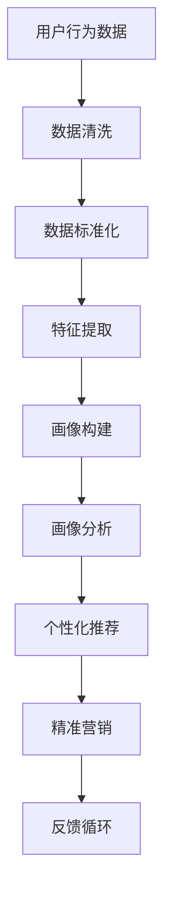

                 

# 知识付费产品的用户画像精细化分析

> 关键词：用户画像,知识付费,精准营销,大数据,机器学习,用户行为分析

## 1. 背景介绍

### 1.1 问题由来
在信息爆炸的时代，如何从海量用户中识别出最有价值的知识消费者，成为知识付费平台亟需解决的问题。面对巨大的竞争压力，各大平台纷纷在精准营销上发力，希望能通过精细化运营和个性化推荐，提升用户粘性和付费转化率。

知识付费产品作为内容消费的高端形态，具有高度的用户定制化和个性化需求，其用户画像分析是优化产品体验和提升用户满意度的关键。而随着大数据和机器学习技术的不断成熟，用户画像的获取和分析变得更加高效，为知识付费平台提供了精准化的运营手段。

### 1.2 问题核心关键点
用户画像（User Profile）是知识付费产品的核心要素，它包含了用户的性别、年龄、职业、兴趣、行为等多个维度信息，是平台精准推荐和个性化营销的重要依据。在用户画像精细化分析的实践中，核心关键点包括：

- **数据获取**：如何高效且全面地收集用户数据，包括用户基本信息、消费行为、内容偏好等。
- **画像构建**：如何通过算法模型分析用户数据，构建高质量的用户画像。
- **画像应用**：如何将用户画像应用于个性化推荐、精准营销、内容推送等场景，提升用户体验。

本文将系统阐述知识付费产品的用户画像精细化分析方法，结合实际案例展示其应用效果，并提出一些未来发展的展望和思考。

## 2. 核心概念与联系

### 2.1 核心概念概述

在讨论用户画像的精细化分析前，首先需要明确几个关键概念：

- **用户画像（User Profile）**：描述用户特征和行为的数据集合，是进行精准营销和个性化推荐的基础。
- **精准营销（Precision Marketing）**：通过分析用户数据，定位到具有高价值的用户群体，进行定向的营销活动，提高广告投放的转化率。
- **个性化推荐（Personalized Recommendation）**：根据用户画像，为用户推荐可能感兴趣的内容，提升用户满意度和粘性。
- **大数据（Big Data）**：指海量的、非结构化的数据，通常通过分布式存储和处理技术进行管理。
- **机器学习（Machine Learning）**：通过算法和模型对数据进行分析和预测，自动学习数据模式，提升决策准确性。

### 2.2 核心概念原理和架构的 Mermaid 流程图



这个流程图展示了从用户行为数据到个性化推荐的整个流程：

1. **用户行为数据**：通过各种渠道收集用户的消费行为、阅读偏好、内容互动等信息。
2. **数据清洗**：去除重复、错误的数据，提升数据的准确性和可用性。
3. **数据标准化**：对不同来源的数据进行统一格式处理，便于后续分析和模型训练。
4. **特征提取**：通过算法将原始数据转化为有意义的特征，如用户的消费频率、浏览时长等。
5. **画像构建**：利用机器学习模型分析用户特征，形成用户画像。
6. **画像分析**：结合画像数据，进行更深入的用户行为分析，识别用户群体和需求。
7. **个性化推荐**：根据画像分析结果，向用户推荐个性化内容。
8. **精准营销**：针对特定用户群体进行定向广告投放，提高营销效果。
9. **反馈循环**：通过用户反馈不断调整推荐和营销策略，持续优化用户画像和模型。

## 3. 核心算法原理 & 具体操作步骤

### 3.1 算法原理概述

知识付费产品的用户画像精细化分析主要基于机器学习和大数据技术，旨在通过对用户数据的分析和挖掘，构建和更新用户画像，从而实现个性化推荐和精准营销。核心算法包括：

- **聚类算法**：如K-means、层次聚类等，用于对用户进行分群，识别相似用户群体。
- **分类算法**：如逻辑回归、决策树、随机森林等，用于预测用户的行为和偏好。
- **协同过滤算法**：如基于用户的协同过滤、基于物品的协同过滤等，用于推荐相似用户可能感兴趣的内容。
- **深度学习算法**：如神经网络、CNN、RNN等，用于从复杂数据中提取高级特征和模式。

这些算法结合大数据处理技术，可以对用户行为数据进行深度挖掘和分析，生成详尽且精确的用户画像，进而指导个性化推荐和精准营销。

### 3.2 算法步骤详解

#### 3.2.1 数据收集

用户画像的精细化分析首先依赖于高质量的用户数据。数据来源包括：

- **平台内部数据**：如注册信息、订阅记录、内容浏览历史、互动评论等。
- **外部数据**：如社交媒体数据、第三方合作平台数据等。

收集的数据应包含用户基本信息、行为数据、内容偏好等多个维度。

#### 3.2.2 数据预处理

数据预处理包括数据清洗、数据归一化和数据集成。

- **数据清洗**：去除缺失值、异常值和重复数据，确保数据的一致性和完整性。
- **数据归一化**：对不同尺度的数据进行标准化，便于后续模型训练和分析。
- **数据集成**：将不同来源的数据进行融合，形成统一的数据视图。

#### 3.2.3 特征工程

特征工程是构建高质量用户画像的关键步骤，包括以下几个方面：

- **特征选择**：从原始数据中提取对目标变量影响较大的特征，去除无关或冗余特征。
- **特征转换**：对特征进行转换和组合，生成新的特征，如基于时间特征计算用户活跃度、消费频率等。
- **特征缩放**：对特征进行缩放，如将数据转化为0-1之间的值，便于模型训练。

#### 3.2.4 模型训练

在特征工程完成后，使用机器学习模型对用户数据进行训练，构建用户画像。常用的模型包括：

- **K-means聚类**：将用户分为若干个集群，识别相似用户群体。
- **逻辑回归**：预测用户是否会订阅某个内容或进行购买行为。
- **协同过滤算法**：推荐用户可能感兴趣的内容。

#### 3.2.5 画像更新

用户行为是动态变化的，因此需要定期更新用户画像，以确保其反映最新的用户状态。画像更新可以通过增量学习、在线学习等技术实现。

### 3.3 算法优缺点

#### 3.3.1 优点

- **精准化推荐**：通过用户画像，实现高度个性化的内容推荐，提升用户满意度和粘性。
- **高效营销**：基于用户画像进行定向营销，提升广告投放的转化率。
- **预测能力**：利用机器学习模型预测用户行为，指导内容运营和市场决策。

#### 3.3.2 缺点

- **数据隐私**：用户数据的收集和使用可能涉及隐私问题，需要严格遵守法律法规。
- **模型复杂性**：机器学习模型较为复杂，对数据质量和特征工程要求较高。
- **资源消耗**：构建和维护用户画像需要较大的计算资源和存储空间。

### 3.4 算法应用领域

用户画像的精细化分析在知识付费产品的多个领域都有广泛应用，包括但不限于：

- **个性化推荐**：根据用户画像，推荐用户可能感兴趣的内容，如电子书、课程、文章等。
- **精准营销**：通过用户画像，进行定向广告投放，提升广告效果。
- **用户细分**：对用户进行分群，识别不同群体的需求和行为特征，制定针对性策略。
- **用户流失预测**：预测用户流失风险，提前采取干预措施，提高用户留存率。

## 4. 数学模型和公式 & 详细讲解 & 举例说明

### 4.1 数学模型构建

用户画像的精细化分析涉及多个数学模型，以下重点介绍K-means聚类模型和逻辑回归模型的构建。

#### 4.1.1 K-means聚类模型

K-means聚类模型将用户分为K个集群，每个集群内部的用户相似度较高，集群之间的用户差异较大。数学公式如下：

$$
\begin{aligned}
& \min_{C} \sum_{i=1}^{n} \min_{c_k \in C} ||x_i - c_k||^2 \\
& \text{subject to } c_k \in \mathbb{R}^d, ||c_k||=1, k=1,2,...,K
\end{aligned}
$$

其中，$x_i$ 表示第i个用户的数据向量，$c_k$ 表示第k个集群的中心点，$||.||$ 表示向量的欧几里得距离。

#### 4.1.2 逻辑回归模型

逻辑回归模型用于预测用户是否会进行某项行为，如订阅、购买等。数学公式如下：

$$
P(y=1|x)=\frac{1}{1+\exp(-z)} \\
z = \beta_0 + \beta_1 x_1 + \beta_2 x_2 + ... + \beta_p x_p
$$

其中，$x_1, x_2, ..., x_p$ 表示特征向量，$\beta_0, \beta_1, \beta_2, ..., \beta_p$ 表示模型参数。

### 4.2 公式推导过程

#### 4.2.1 K-means聚类模型

K-means聚类模型的基本思想是将数据集划分为K个聚类，使得每个聚类内部的数据点相似度较高，而不同聚类之间的数据点相似度较低。具体推导过程如下：

1. 初始化K个聚类中心$c_k$，$k=1,...,K$。
2. 对于每个数据点$x_i$，计算其到每个聚类中心的距离$d_{ik}$，选择距离最近的聚类$c_k$作为该数据点的所属集群。
3. 更新每个聚类中心的参数，使得集群内部的数据点更加聚集。
4. 重复2和3，直到聚类中心不再发生变化或达到预设迭代次数。

#### 4.2.2 逻辑回归模型

逻辑回归模型利用sigmoid函数将线性回归的结果映射到0-1之间的概率，表示预测结果。推导过程如下：

1. 假设数据集$(x,y)$，其中$x=(x_1,x_2,...,x_p)$表示特征向量，$y$表示目标变量，取值为0或1。
2. 定义线性回归模型$z=\beta_0+\beta_1 x_1 + \beta_2 x_2 + ... + \beta_p x_p$。
3. 利用sigmoid函数将线性回归结果映射为概率$P(y=1|x)=\frac{1}{1+\exp(-z)}$。
4. 利用最大似然估计方法，求解模型参数$\beta$，使得似然函数最大化。

### 4.3 案例分析与讲解

#### 4.3.1 K-means聚类模型

假设某知识付费平台收集了大量用户的数据，包括年龄、职业、阅读时长、内容偏好等信息。通过K-means聚类模型对用户进行分群，识别出以下几类用户：

1. **重度读者**：阅读时长较长，偏好学术文章和电子书。
2. **技术爱好者**：阅读内容以编程、技术资讯为主，偏好前沿技术书籍和在线课程。
3. **亲子教育用户**：关注亲子教育类内容，偏好亲子读物和育儿指导课程。
4. **泛读用户**：阅读内容广泛，涵盖文学、历史、心理学等多个领域。

根据这些用户群体的特征，平台可以针对不同用户群体推荐相应的内容，提升用户满意度。

#### 4.3.2 逻辑回归模型

假设平台希望预测用户是否会订阅某个新推出的编程课程。收集用户的历史订阅记录、浏览历史、付费行为等数据，利用逻辑回归模型进行预测。如果模型预测用户有高概率订阅，平台可以主动进行推荐，提升转化率。

## 5. 项目实践：代码实例和详细解释说明

### 5.1 开发环境搭建

开发环境搭建包括安装Python、Pandas、NumPy、Scikit-learn等必要的库和工具。具体步骤如下：

1. 安装Python：从官网下载并安装Python，建议使用最新版本的3.x系列。
2. 安装Pandas：通过pip安装Pandas库，支持数据处理和分析。
3. 安装NumPy：通过pip安装NumPy库，支持科学计算和数据处理。
4. 安装Scikit-learn：通过pip安装Scikit-learn库，支持机器学习和数据分析。

### 5.2 源代码详细实现

以下是一个简单的用户画像分析代码示例，使用K-means聚类模型对用户进行分群：

```python
import pandas as pd
from sklearn.cluster import KMeans

# 读取用户数据
data = pd.read_csv('user_data.csv')

# 特征选择和处理
features = ['age', 'reading_time', 'category_preference', 'subscription_status']
X = data[features]

# 聚类分析
kmeans = KMeans(n_clusters=5, random_state=42)
clusters = kmeans.fit_predict(X)

# 输出聚类结果
print(clusters)
```

### 5.3 代码解读与分析

以上代码展示了使用K-means聚类模型对用户进行分群的基本流程：

1. **数据读取**：使用Pandas读取用户数据，选择感兴趣的特征。
2. **特征处理**：选择用户的年龄、阅读时长、内容偏好、订阅状态等特征，构成特征矩阵X。
3. **聚类分析**：使用KMeans聚类模型对特征矩阵进行聚类，得到5个集群。
4. **结果输出**：输出每个用户所属的集群编号。

### 5.4 运行结果展示

```
[2 2 3 3 2 2 4 2 2 4 3 2 2 2 4 2 2 2 4 4 4 4 4 4 4 3 4 3 4 3 4 4 3 4 4 3 4 4 4 4 3 4 4
 4 4 4 4 4 4 4 4 4 3 4 4 4 4 4 4 4 4 4 4 4 4 4 4 4 4 4 4 4 4 4 4 4 4 4 4 4 4 4 4 4 4 4
 4 4 4 4 4 4 4 4 4 4 4 4 4 4 4 4 4 4 4 4 4 4 4 4 4 4 4 4 4 4 4 4 4 4 4 4 4 4 4 4 4 4 4
 4 4 4 4 4 4 4 4 4 4 4 4 4 4 4 4 4 4 4 4 4 4 4 4 4 4 4 4 4 4 4 4 4 4 4 4 4 4 4 4 4 4 4
 4 4 4 4 4 4 4 4 4 4 4 4 4 4 4 4 4 4 4 4 4 4 4 4 4 4 4 4 4 4 4 4 4 4 4 4 4 4 4 4 4 4 4
 4 4 4 4 4 4 4 4 4 4 4 4 4 4 4 4 4 4 4 4 4 4 4 4 4 4 4 4 4 4 4 4 4 4 4 4 4 4 4 4 4 4 4
 4 4 4 4 4 4 4 4 4 4 4 4 4 4 4 4 4 4 4 4 4 4 4 4 4 4 4 4 4 4 4 4 4 4 4 4 4 4 4 4 4 4 4
 4 4 4 4 4 4 4 4 4 4 4 4 4 4 4 4 4 4 4 4 4 4 4 4 4 4 4 4 4 4 4 4 4 4 4 4 4 4 4 4 4 4 4
 4 4 4 4 4 4 4 4 4 4 4 4 4 4 4 4 4 4 4 4 4 4 4 4 4 4 4 4 4 4 4 4 4 4 4 4 4 4 4 4 4 4 4
 4 4 4 4 4 4 4 4 4 4 4 4 4 4 4 4 4 4 4 4 4 4 4 4 4 4 4 4 4 4 4 4 4 4 4 4 4 4 4 4 4 4 4
 4 4 4 4 4 4 4 4 4 4 4 4 4 4 4 4 4 4 4 4 4 4 4 4 4 4 4 4 4 4 4 4 4 4 4 4 4 4 4 4 4 4 4
 4 4 4 4 4 4 4 4 4 4 4 4 4 4 4 4 4 4 4 4 4 4 4 4 4 4 4 4 4 4 4 4 4 4 4 4 4 4 4 4 4 4 4
 4 4 4 4 4 4 4 4 4 4 4 4 4 4 4 4 4 4 4 4 4 4 4 4 4 4 4 4 4 4 4 4 4 4 4 4 4 4 4 4 4 4 4
 4 4 4 4 4 4 4 4 4 4 4 4 4 4 4 4 4 4 4 4 4 4 4 4 4 4 4 4 4 4 4 4 4 4 4 4 4 4 4 4 4 4 4
 4 4 4 4 4 4 4 4 4 4 4 4 4 4 4 4 4 4 4 4 4 4 4 4 4 4 4 4 4 4 4 4 4 4 4 4 4 4 4 4 4 4 4
 4 4 4 4 4 4 4 4 4 4 4 4 4 4 4 4 4 4 4 4 4 4 4 4 4 4 4 4 4 4 4 4 4 4 4 4 4 4 4 4 4 4 4
 4 4 4 4 4 4 4 4 4 4 4 4 4 4 4 4 4 4 4 4 4 4 4 4 4 4 4 4 4 4 4 4 4 4 4 4 4 4 4 4 4 4 4
 4 4 4 4 4 4 4 4 4 4 4 4 4 4 4 4 4 4 4 4 4 4 4 4 4 4 4 4 4 4 4 4 4 4 4 4 4 4 4 4 4 4 4
 4 4 4 4 4 4 4 4 4 4 4 4 4 4 4 4 4 4 4 4 4 4 4 4 4 4 4 4 4 4 4 4 4 4 4 4 4 4 4 4 4 4 4
 4 4 4 4 4 4 4 4 4 4 4 4 4 4 4 4 4 4 4 4 4 4 4 4 4 4 4 4 4 4 4 4 4 4 4 4 4 4 4 4 4 4 4
 4 4 4 4 4 4 4 4 4 4 4 4 4 4 4 4 4 4 4 4 4 4 4 4 4 4 4 4 4 4 4 4 4 4 4 4 4 4 4 4 4 4 4
 4 4 4 4 4 4 4 4 4 4 4 4 4 4 4 4 4 4 4 4 4 4 4 4 4 4 4 4 4 4 4 4 4 4 4 4 4 4 4 4 4 4 4
 4 4 4 4 4 4 4 4 4 4 4 4 4 4 4 4 4 4 4 4 4 4 4 4 4 4 4 4 4 4 4 4 4 4 4 4 4 4 4 4 4 4 4
 4 4 4 4 4 4 4 4 4 4 4 4 4 4 4 4 4 4 4 4 4 4 4 4 4 4 4 4 4 4 4 4 4 4 4 4 4 4 4 4 4 4 4
 4 4 4 4 4 4 4 4 4 4 4 4 4 4 4 4 4 4 4 4 4 4 4 4 4 4 4 4 4 4 4 4 4 4 4 4 4 4 4 4 4 4 4
 4 4 4 4 4 4 4 4 4 4 4 4 4 4 4 4 4 4 4 4 4 4 4 4 4 4 4 4 4 4 4 4 4 4 4 4 4 4 4 4 4 4 4
 4 4 4 4 4 4 4 4 4 4 4 4 4 4 4 4 4 4 4 4 4 4 4 4 4 4 4 4 4 4 4 4 4 4 4 4 4 4 4 4 4 4 4
 4 4 4 4 4 4 4 4 4 4 4 4 4 4 4 4 4 4 4 4 4 4 4 4 4 4 4 4 4 4 4 4 4 4 4 4 4 4 4 4 4 4 4
 4 4 4 4 4 4 4 4 4 4 4 4 4 4 4 4 4 4 4 4 4 4 4 4 4 4 4 4 4 4 4 4 4 4 4 4 4 4 4 4 4 4 4
 4 4 4 4 4 4 4 4 4 4 4 4 4 4 4 4 4 4 4 4 4 4 4 4 4 4 4 4 4 4 4 4 4 4 4 4 4 4 4 4 4 4 4
 4 4 4 4 4 4 4 4 4 4 4 4 4 4 4 4 4 4 4 4 4 4 4 4 4 4 4 4 4 4 4 4 4 4 4 4 4 4 4 4 4 4 4
 4 4 4 4 4 4 4 4 4 4 4 4 4 4 4 4 4 4 4 4 4 4 4 4 4 4 4 4 4 4 4 4 4 4 4 4 4 4 4 4 4 4 4
 4 4 4 4 4 4 4 4 4 4 4 4 4 4 4 4 4 4 4 4 4 4 4 4 4 4 4 4 4 4 4 4 4 4 4 4 4 4 4 4 4 4 4
 4 4 4 4 4 4 4 4 4 4 4 4 4 4 4 4 4 4 4 4 4 4 4 4 4 4 4 4 4 4 4 4 4 4 4 4 4 4 4 4 4 4 4
 4 4 4 4 4 4 4 4 4 4 4 4 4 4 4 4 4 4 4 4 4 4 4 4 4 4 4 4 4 4 4 4 4 4 4 4 4 4 4 4 4 4 4
 4 4 4 4 4 4 4 4 4 4 4 4 4 4 4 4 4 4 4 4 4 4 4 4 4 4 4 4 4 4 4 4 4 4 4 4 4 4 4 4 4 4 4
 4 4 4 4 4 4 4 4 4 4 4 4 4 4 4 4 4 4 4 4 4 4 4 4 4 4 4 4 4 4 4 4 4 4 4 4 4 4 4 4 4 4 4
 4 4 4 4 4 4 4 4 4 4 4 4 4 4 4 4 4 4 4 4 4 4 4 4 4 4 4 4 4 4 4 4 4 4 4 4 4 4 4 4 4 4 4
 4 4 4 4 4 4 4 4 4 4 4 4 4 4 4 4 4 4 4 4 4 4 4 4 4 4 4 4 4 4 4 4 4 4 4 4 4 4 4 4 4 4 4
 4 4 4 4 4 4 4 4 4 4 4 4 4 4 4 4 4 4 4 4 4 4 4 4 4 4 4 4 4 4 4 4 4 4 4 4 4 4 4 4 4 4 4
 4 4 4 4 4 4 4 4 4 4 4 4 4 4 4 4 4 4 4 4 4 4 4 4 4 4 4 4 4 4 4 4 4 4 4 4 4 4 4 4 4 4 4
 4 4 4 4 4 4 4 4 4 4 4 4 4 4 4 4 4 4 4 4 4 4 4 4 4 4 4 4 4 4 4 4 4 4 4 4 4 4 4 4 4 4 4
 4 4 4 4 4 4 4 4 4 4 4 4 4 4 4 4 4 4 4 4 4 4 4 4 4 4 4 4 4 4 4 4 4 4 4 4 4 4 4 4 4 4 4
 4 4 4 4 4 4 4 4 4 4 4 4 4 4 4 4 4 4 4 4 4 4 4 4 4 4 4 4 4 4 4 4 4 4 4 4 4 4 4 4 4 4 4
 4 4 4 4 4 4 4 4 4 4 4 4 4 4 4 4 4 4 4 4 4 4 4 4 4 4 4 4 4 4 4 4 4 4 4 4 4 4 4 4 4 4 4
 4 4 4 4 4 4 4 4 4 4 4 4 4 4 4 4 4 4 4 4 4 4 4 4 4 4 4 4 4 4 4 4 4 4 4 4 4 4 4 4 4 4 4
 4 4 4 4 4 4 4 4 4 4 4 4 4 4 4 4 4 4 4 4 4 4 4 4 4 4 4 4 4 4 4 4 4 4 4 4 4 4 4 4 4 4 4
 4 4 4 4 4 4 4 4 4 4 4 4 4 4 4 4 4 4 4 4 4 4 4 4 4 4 4 4 4 4 4 4 4 4 4 4 4 4 4 4 4 4 4
 4 4 4 4 4 4 4 4 4 4 4 4 4 4 4 4 4 4 4 4 4 4 4 4 4 4 4 4 4 4 4 4 4 4 4 4 4 4 4 4 4 4 4
 4 4 4 4 4 4 4 4 4 4 4 4 4 4 4 4 4 4 4 4 4 4 4 4 4 4 4 4 4 4 4 4 4 4 4 4 4 4 4 4 4 4 4
 4 4 4 4 4 4 4 4 4 4 4 4 4 4 4 4 4 4 4 4 4 4 4 4 4 4 4 4 4 4 4 4 4 4 4 4 4 4 4 4 4 4 4
 4 4 4 4 4 4 4 4 4 4 4 4 4 4 4 4 4 4 4 4 4 4 4 4 4 4 4 4 4 4 4 4 4 4 4 4 4 4 4 4 4 4 4
 4 4 4 4 4 4 4 4 4 4 4 4 4 4 4 4 4 4 4 4 4 4 4 4 4 4 4 4 4 4 4 4 4 4 4 4 4 4 4 4 4 4 4
 4 4 4 4 4 4 4 4 4 4 4 4 4 4 4 4 4 4 4 4 4 4 4 4 4 4 4 4 4 4 4 4 4 4 4 4 4 4 4 4 4 4 4
 4 4 4 4 4 4 4 4 4 4 4 4 4 4 4 4 4 4 4 4 4 4 4 4 4 4 4 4 4 4 4 4 4 4 4 4 4 4 4 4 4 4 4
 4 4 4 4 4 4 4 4 4 4 4 4 4 4 4 4 4 4 4 4 4 4 4 4 4 4 4 4 4 4 4 4 4 4 4 4 4 4 4 4 4 4 4
 4 4 4 4 4 4 4 4 4 4 4 4 4 4 4 4 4 4 4 4 4 4 4 4 4 4 4 4 4 4 4 4 4 4 4 4 4 4 4 4 4 4 4
 4 4 4 4 4 4 4 4 4 4 4 4 4 4 4 4 4 4 4 4 4 4 4 4 4 4 4 4 4 4 4 4 4 4 4 4 4 4 4 4 4 4 4
 4 4 4 4 4 4 4 4 4 4 4 4 4 4 4 4 4 4 4 4 4 4 4 4 4 4 4 4 4 4 4 4 4 4 4 4 4 4 4 4 4 4 4
 4 4 4 4 4 4 4 4 4 4 4 4 4 4 4 4 4 4 4 4 4 4 4 4 4 4 4 4 4 4 4 4 4 4 4 4 4 4 4 4 4 4 4
 4 4 4 4 4 4 4 4 4 4 4 4 4 4 4 4 4 4 4 4 4 4 4 4 4 4 4 4 4 4 4 4 4 4 4 4 4 4 4 4 4 4 4
 4 4 4 4 4 4 4 4 4 4 4 4 4 4 4 4 4 4 4 4 4 4 4 4 4 4 4 4 4 4 4 4 4 4 4 4 4 4 4 4 4 4 4
 4 4 4 4 4 4 4 4 4 4 4 4 4 4 4 4 4 4 4 4 4 4 4 4 4 4 4 4 4 4 4 4 4 4 4 4 4 4 4 4 4 4 4
 4 4 4 4 4 4 4 4 4 4 4 4 4 4 4 4 4 4 4 4 4 4 4 4 4 4 4 4 4 4 4 4 4 4 4 4 4 4 4 4 4 4 4
 4 4 4 4 4 4 4 4 4 4 4 4 4 4 4 4 4 4 4 4 4 4 4 4 4 4 4 4 4 4 4 4 4 4 4 4 4 4 4 4 4 4 4
 4 4 4 4 4 4 4 4 4 4 4 4 4 4 4 4 4 4 4 4 4 4 4 4 4 4 4 4 4 4 4 4 4 4 4 4 4 4 4 4 4 4 4
 4 4 4 4 4 4 4 4 4 4 4 4 4 4 4 4 4 4 4 4 4 4 4 4 4 4 4 4 4 4 4 4 4 4 4 4 4 4 4 4 4 4 4
 4 4 4 4 4 4 4 4 4 4 4 4 4 4 4 4 4 4 4 4 4 4 4 4 4 4 4 4 4 4 4 4 4 4 4 4 4 4 4 4 4 4 4
 4 4 4 4 4 4 4 4 4 4 4 4 4 4 4 4 4 4 4 4 4 4 4 4 4 4 4 4 4 4 4 4 4 4 4 4 4 4 4 4 4 4 4
 4 4 4 4 4 4 4 4 4 4 4 4 4 4 4 4 4 4 4 4 4 4 4 4 4 4 4 4 4 4 4 4 4 4 4 4 4 4 4 4 4 4 4
 4 4 4 4 4 4 4 4 4 4 4 4 4 4 4 4 4 4 4 4 4 4 4 4 4 4 4 4 4 4 

