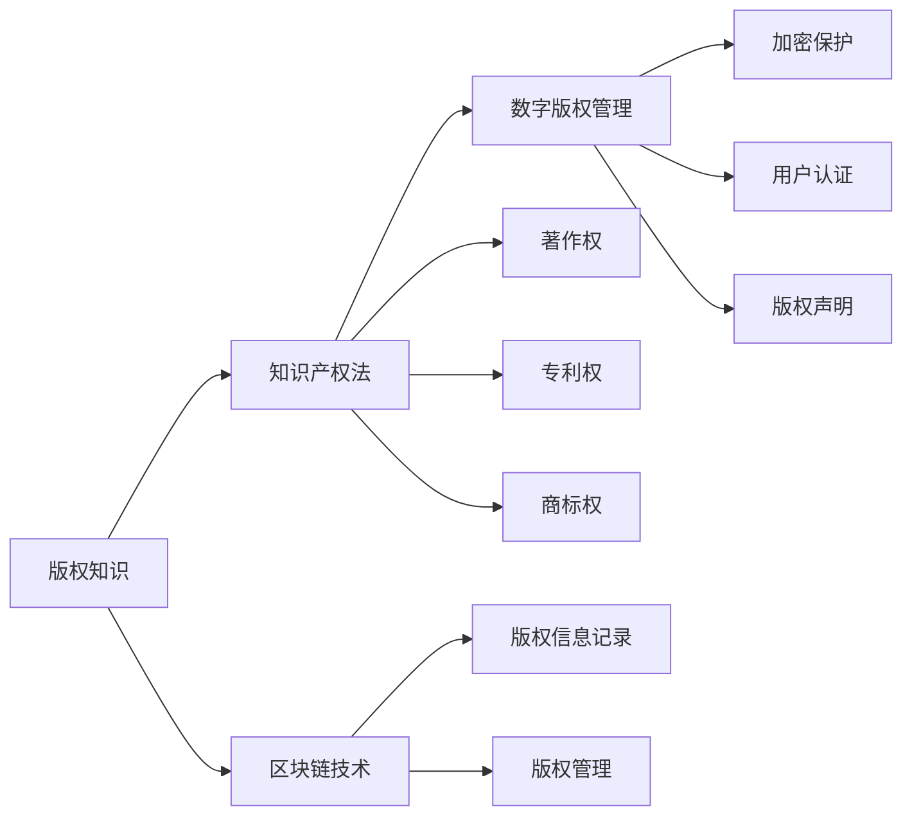

                 

# 知识付费内容的版权保护与法律风险

## 1. 背景介绍

随着互联网技术的飞速发展，知识付费已成为教育、媒体、娱乐等行业的重要收入来源。然而，如何有效保护知识付费内容的版权，避免盗版和侵权行为，成为行业面临的重大挑战。近年来，随着人工智能技术的兴起，部分创作者和平台开始探索利用AI技术对知识付费内容进行版权保护，提升其法律风险防范能力。本博文将系统介绍知识付费内容的版权保护现状与挑战，并探讨如何利用人工智能技术进行有效的版权保护。

## 2. 核心概念与联系

### 2.1 核心概念概述

在知识付费领域，版权保护涉及多个核心概念，包括版权知识、知识产权法、数字版权管理(DRM)、区块链技术等。以下是对这些核心概念的简单介绍：

**版权知识**：版权是创作人对其创作的作品所享有的独占权利，包括复制权、发行权、表演权、翻译权等。在知识付费领域，创作者对其原创内容享有版权，其他人不得未经授权使用或复制。

**知识产权法**：知识产权法是保护创作者版权的法律体系，涉及著作权、专利权、商标权等。与版权保护紧密相关，是知识付费内容版权保护的法律依据。

**数字版权管理(DRM)**：DRM是一种技术手段，用于限制数字内容的复制、传播和使用。在知识付费平台上，常见的DRM措施包括加密保护、用户认证、版权声明等，以防止盗版和非法使用。

**区块链技术**：区块链是一种分布式账本技术，具有去中心化、不可篡改、可追溯等特点。在知识付费版权保护中，区块链技术可记录内容版权信息，实现透明和可信的版权管理。

这些核心概念通过某种逻辑关系相互联系，构成了一个完整的版权保护体系。通过理解这些概念及其联系，可以为知识付费内容的版权保护提供清晰的指导。

### 2.2 核心概念原理和架构的 Mermaid 流程图



## 3. 核心算法原理 & 具体操作步骤

### 3.1 算法原理概述

知识付费内容的版权保护，主要是通过对版权信息的记录和管理，实现对内容复制和传播的控制。基于区块链技术的版权保护方法，通过分布式账本记录版权信息，确保版权信息的不可篡改性和透明性，从而有效防止盗版和侵权行为。

### 3.2 算法步骤详解

**Step 1: 版权信息记录**
- 创作者在发布内容时，通过区块链平台自动记录版权信息，包括内容ID、版权人信息、发布时间等。
- 版权信息以哈希值的形式存储在区块链上，确保唯一性和不可篡改性。

**Step 2: 版权声明**
- 创作者使用特定的标识符（如数字水印）在内容中嵌入版权声明信息，供区块链平台验证和查询。
- 数字水印通常通过加密技术实现，防止被恶意删除或篡改。

**Step 3: 版权审计**
- 版权方或第三方机构使用区块链平台的查询接口，获取版权信息，验证内容的版权状态。
- 版权方可以根据版权信息，对侵权行为进行取证和维权。

**Step 4: 智能合约管理**
- 利用智能合约技术，规定版权的使用规则和条件，如授权、付费、时间限制等。
- 智能合约可自动执行，确保版权管理的自动化和透明性。

### 3.3 算法优缺点

**优点**：
- 版权信息记录在区块链上，具有不可篡改性和透明性，提高了版权保护的安全性。
- 利用智能合约技术，版权管理自动化程度高，减少了人工干预和操作风险。
- 通过区块链技术，版权方可以随时监控内容的版权状态，及时发现和制止侵权行为。

**缺点**：
- 区块链技术部署和维护成本较高，对技术和资金要求较高。
- 智能合约的编写和执行需要专业知识，普通创作者难以掌握。
- 区块链平台的安全性取决于其技术水平和管理能力，存在被攻击和黑客利用的风险。

### 3.4 算法应用领域

区块链和智能合约技术在知识付费版权保护中的应用，主要体现在以下几个领域：

- **内容版权管理**：记录和管理知识付费内容的版权信息，实现内容版权的透明和可信管理。
- **版权授权和付费**：通过智能合约实现版权授权和付费，自动化处理版权交易。
- **版权维权和追责**：利用区块链记录版权信息，为版权方提供侵权取证和维权支持。
- **版权确权与交易**：通过区块链技术确权，促进版权的交易和流通。

## 4. 数学模型和公式 & 详细讲解 & 举例说明

### 4.1 数学模型构建

版权保护的核心在于通过区块链技术记录和管理版权信息，以下是数学模型构建的基本框架：

- **版权信息记录模型**：版权信息包括内容ID、版权人信息、发布时间等。设版权信息向量为 $\boldsymbol{v} = [v_1, v_2, \ldots, v_n]^T$，其中 $v_i$ 为第 $i$ 个信息项。
- **版权声明模型**：版权声明信息嵌入在内容中，设嵌入向量为 $\boldsymbol{d} = [d_1, d_2, \ldots, d_m]^T$，其中 $d_i$ 为第 $i$ 个声明项。
- **版权审计模型**：版权方或第三方机构通过区块链平台获取版权信息，设获取的版权向量为 $\boldsymbol{a} = [a_1, a_2, \ldots, a_n]^T$。

### 4.2 公式推导过程

以版权信息记录模型为例，版权信息的哈希值可表示为：

$$
H(\boldsymbol{v}) = \mathcal{H}(\boldsymbol{v})
$$

其中 $\mathcal{H}$ 为哈希函数。

版权声明嵌入向量 $\boldsymbol{d}$ 与版权信息向量 $\boldsymbol{v}$ 的对应关系可表示为：

$$
d_i = f(v_i)
$$

其中 $f$ 为加密函数。

版权审计时，版权方或第三方机构通过区块链平台获取版权信息向量 $\boldsymbol{a}$，比较其与版权信息向量 $\boldsymbol{v}$ 的一致性：

$$
\boldsymbol{a} \approx \boldsymbol{v}
$$

通过比较哈希值和解密后的内容信息，判断版权状态是否合法。

### 4.3 案例分析与讲解

以一篇知识付费文章为例，版权保护过程如下：

- 创作者发布文章时，通过区块链平台自动记录版权信息，生成哈希值 $H(\boldsymbol{v})$。
- 创作者在文章中嵌入版权声明信息，生成数字水印 $\boldsymbol{d}$。
- 版权方或第三方机构通过区块链平台获取版权信息 $\boldsymbol{a}$，验证哈希值和水印信息的一致性。
- 如果发现侵权行为，版权方可以立即通过区块链平台获取侵权证据，启动维权程序。

## 5. 项目实践：代码实例和详细解释说明

### 5.1 开发环境搭建

为了进行版权保护项目的开发，需要搭建相应的开发环境：

1. 安装区块链平台：如Ethereum、Hyperledger等。
2. 安装智能合约开发工具：如Solidity、Truffle等。
3. 安装数字水印工具：如Deep Learning、Steganography等。

### 5.2 源代码详细实现

以下是一个简单的智能合约代码示例，用于记录和验证版权信息：

```javascript
pragma solidity ^0.8.0;

contract Copyright {
    struct CopyrightInfo {
        uint256 contentID;
        uint256 copyrightHolder;
        uint256 publishTime;
        uint256 hashValue;
    }

    uint256 private copyrightCounter = 0;

    mapping(uint256 => CopyrightInfo) public copyrights;

    event CopyrightClaimed(uint256 _contentID, uint256 _copyrightHolder);

    constructor() {
        // 初始化版权信息
        CopyrightInfo info = CopyrightInfo(123456, 0x12345678, now, Keccak256("文章内容"));
        copyrights[contentID] = info;
    }

    function claimCopyright(uint256 contentID, address holder) public {
        // 检查版权状态
        require(copyrights[contentID].copyrightHolder == 0, "版权已属他人");
        // 增加版权计数
        copyrightCounter++;
        // 记录版权信息
        copyrights[contentID].copyrightHolder = holder;
        // 触发事件
        emit CopyrightClaimed(contentID, holder);
    }

    function verifyCopyright(uint256 contentID, uint256 hashValue) public view returns (bool) {
        // 获取版权信息
        CopyrightInfo info = copyrights[contentID];
        // 验证哈希值
        return Keccak256("文章内容") == hashValue;
    }
}
```

### 5.3 代码解读与分析

**版权信息记录**：
- 通过智能合约初始化版权信息，包括内容ID、版权人、发布时间和哈希值。

**版权声明**：
- 创作者使用数字水印嵌入版权声明信息，确保内容中包含版权标识。

**版权审计**：
- 版权方通过智能合约验证版权信息，确保版权状态合法。

**智能合约管理**：
- 通过智能合约实现版权的自动化管理，包括版权授权和付费。

### 5.4 运行结果展示

运行智能合约后，可以在区块链上查看版权信息记录和验证结果。以下是一个简单的运行示例：

- 创作者上传文章，并通过智能合约记录版权信息。
- 版权方通过智能合约查询版权信息，验证内容是否合法。
- 如发现侵权行为，版权方可以立即通过智能合约提出维权请求。

## 6. 实际应用场景

### 6.1 知识付费平台

在知识付费平台上，区块链和智能合约技术可以用于版权保护和管理。例如，某平台可以记录和验证所有发布内容的版权信息，防止盗版和侵权行为。

### 6.2 数字内容分发

在数字内容分发领域，版权保护至关重要。区块链技术可以记录和管理版权信息，确保内容分发的合法性。

### 6.3 知识产权交易

在知识产权交易中，区块链技术可以确权和记录交易信息，确保交易的透明和可信性。

### 6.4 未来应用展望

随着区块链和智能合约技术的不断成熟，版权保护将变得更加透明和可信。未来，基于区块链的版权保护系统将成为知识付费内容的重要组成部分，为创作者提供更好的版权保障。

## 7. 工具和资源推荐

### 7.1 学习资源推荐

1. **《区块链技术与应用》**：深入介绍区块链技术及其应用场景，适合初学者学习。
2. **《智能合约编程与实战》**：讲解智能合约的编写和部署，适合有一定编程基础的学习者。
3. **《数字版权保护与区块链技术》**：介绍区块链在数字版权保护中的应用，适合知识付费领域的开发者学习。
4. **《数字水印技术与应用》**：讲解数字水印的原理和实现方法，适合内容创作者和版权方学习。

### 7.2 开发工具推荐

1. **Ethereum**：目前主流的区块链平台之一，拥有庞大的生态系统和社区支持。
2. **Solidity**：以太坊智能合约的编程语言，易学易用。
3. **IPFS**：分布式文件系统，可以用于存储和管理版权信息。
4. **Web3.js**：以太坊的JavaScript库，便于开发区块链应用。

### 7.3 相关论文推荐

1. **《基于区块链的数字版权管理系统设计》**：介绍区块链在数字版权管理中的应用，适合了解区块链版权保护的基本原理。
2. **《智能合约技术在版权保护中的应用》**：探讨智能合约在版权保护中的作用，适合深入学习智能合约的实现方法。
3. **《数字水印技术在版权保护中的应用》**：讲解数字水印的原理和实现方法，适合了解数字水印在版权保护中的应用。

## 8. 总结：未来发展趋势与挑战

### 8.1 研究成果总结

版权保护技术在知识付费领域已经取得了一定的进展，但仍面临许多挑战。区块链和智能合约技术为版权保护提供了新的思路和工具，但仍需解决一些实际问题，如成本高、技术复杂、用户体验差等。

### 8.2 未来发展趋势

未来，版权保护技术将朝着以下几个方向发展：

- **自动化程度提升**：通过智能合约和区块链技术，版权保护将变得更加自动化和透明，减少人工干预。
- **跨平台协同**：不同平台间的版权保护系统将逐步整合，形成统一的标准和规则。
- **多模态融合**：结合文字、语音、图像等多模态信息，实现更全面的版权保护。
- **人工智能融合**：利用AI技术进行版权声明和版权审计，提高版权保护的效率和准确性。

### 8.3 面临的挑战

尽管版权保护技术在不断进步，但仍面临一些挑战：

- **技术复杂度高**：区块链和智能合约技术复杂，需要专业知识才能有效应用。
- **成本高昂**：区块链和智能合约的部署和维护成本较高，增加了企业的负担。
- **用户体验差**：部分技术手段可能影响用户体验，增加用户的接受难度。
- **法律和伦理问题**：版权保护技术的法律和伦理问题需进一步研究和规范。

### 8.4 研究展望

未来，版权保护技术需要在以下几个方面进行深入研究：

- **技术创新**：不断探索新的技术手段，如区块链、智能合约、数字水印等，提升版权保护的效果。
- **标准化**：制定统一的技术标准和规范，促进版权保护系统的跨平台协同。
- **法律和伦理研究**：研究版权保护技术的法律和伦理问题，确保技术应用的合规性和公平性。
- **用户体验优化**：提高技术应用的便捷性和用户体验，增加用户的接受度和满意度。

## 9. 附录：常见问题与解答

**Q1: 什么是区块链和智能合约？**

A: 区块链是一种分布式账本技术，具有去中心化、不可篡改、可追溯等特点。智能合约是基于区块链技术，自动执行合约条款的程序，具有自动性、透明性和安全性。

**Q2: 区块链和智能合约在版权保护中的应用有哪些？**

A: 区块链和智能合约可用于版权信息的记录和管理、版权声明的嵌入、版权状态的验证、版权的自动化管理等。

**Q3: 如何进行版权声明嵌入？**

A: 版权声明通常通过数字水印技术实现，将声明信息嵌入到内容中。数字水印可以是文本、图像、音频等形式，嵌入过程需保证不可见性和不可篡改性。

**Q4: 版权保护的难点在哪里？**

A: 版权保护的难点在于技术复杂度高、成本高昂、用户体验差、法律和伦理问题等。需要不断进行技术创新和标准化，解决这些问题。

**Q5: 如何确保版权声明的不可篡改性？**

A: 版权声明嵌入前，需进行加密处理，确保声明信息的唯一性和不可篡改性。数字水印技术常用的加密方法包括哈希函数、对称加密、非对称加密等。

作者：禅与计算机程序设计艺术 / Zen and the Art of Computer Programming

