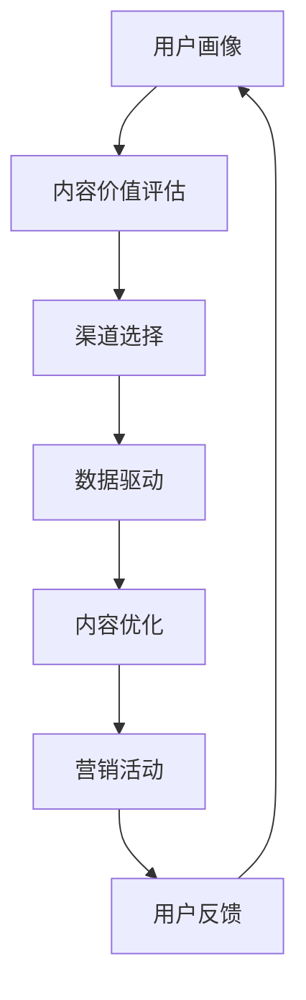

                 

# 知识付费创业中的内容营销矩阵搭建

> 关键词：内容营销,知识付费,数据驱动,用户画像,运营策略

## 1. 背景介绍

### 1.1 问题由来

随着知识经济的兴起，知识付费产业成为一种新兴的商业模式，它通过提供高质量的知识产品，如在线课程、专业咨询、音频图书等，满足用户对于知识获取和专业成长的需求。但与传统出版不同，知识付费的核心价值在于内容的深度、前沿性和实用性，这使得内容营销在知识付费的创业中具有至关重要的地位。

如何系统化地构建并优化内容营销策略，使知识付费产品能够精准触达目标用户，并提高用户粘性和转化率，成为创业公司面临的一大挑战。这需要我们从多个维度进行全面分析和深度探索，构建一套系统的内容营销矩阵。

### 1.2 问题核心关键点

内容营销矩阵的构建，依赖于对用户需求、内容特性和市场环境的深入理解。在这一过程中，需要重点关注以下几个关键点：

- **用户画像**：精准定义目标用户的特征，包括年龄、性别、职业、兴趣、行为习惯等，从而制定有针对性的营销策略。
- **内容价值**：评估内容产品对目标用户需求的满足程度，确保内容的高质量、实用性和前沿性。
- **渠道选择**：选择与目标用户群体相匹配的营销渠道，如社交媒体、邮件、SEO、广告等，实现高效的信息传递和用户触达。
- **数据驱动**：利用大数据分析技术，实时监控营销活动的效果，优化营销策略和内容表现。
- **迭代优化**：持续改进内容产品和营销策略，以适应市场变化和用户需求的变化。

### 1.3 问题研究意义

构建科学合理的内容营销矩阵，对于知识付费创业公司具有重要意义：

- **提升用户转化率**：通过精准定位和有效沟通，将潜在用户转化为付费用户，提升业务收入。
- **提高用户粘性**：持续提供高质量的内容，建立用户的长期信任和依赖关系。
- **优化资源配置**：在有限的资源下，最大化营销效果和投资回报率。
- **增强品牌影响力**：通过系统化的营销活动，提升品牌知名度和美誉度，扩大市场份额。

## 2. 核心概念与联系

### 2.1 核心概念概述

内容营销矩阵（Content Marketing Matrix）是指通过整合多种营销手段和策略，形成一个系统化的营销网络，以高效地覆盖目标用户、传递价值并促进转化。这一矩阵的构建，需要从内容、渠道、用户画像等多个维度进行深入分析和规划。

在内容营销矩阵中，各要素之间的关系如下：

- **内容**：知识付费产品的核心，提供专业知识和信息，满足用户需求。
- **渠道**：传递内容的媒介，选择合适的渠道，确保信息准确、及时地传递给目标用户。
- **用户画像**：通过深入分析用户行为和偏好，精准定位目标用户，实现个性化营销。
- **数据驱动**：利用大数据技术，实时监测和分析营销效果，持续优化策略。

这些核心概念通过一个动态循环系统相互连接，形成了一个动态调整和优化的营销框架。

### 2.2 核心概念原理和架构的 Mermaid 流程图



这个流程图展示了内容营销矩阵的基本流程：

1. **用户画像**：首先，根据用户特征和行为数据，构建精准的用户画像。
2. **内容价值评估**：基于用户画像，评估内容的吸引力、实用性和前沿性。
3. **渠道选择**：选择最适合的内容传播渠道，确保信息高效传递。
4. **数据驱动**：利用大数据分析，实时监控营销活动效果，提供优化依据。
5. **内容优化**：根据反馈数据，不断优化内容产品和营销策略。
6. **营销活动**：实施和调整营销活动，促进用户转化。
7. **用户反馈**：收集用户反馈，循环改进内容营销矩阵。

## 3. 核心算法原理 & 具体操作步骤

### 3.1 算法原理概述

内容营销矩阵的构建，本质上是一个动态的优化过程，依赖于多个维度的数据和信息。在这一过程中，我们主要应用以下算法原理：

- **聚类算法**：通过用户行为数据的分析，将用户分为不同类别，从而精准定位目标用户。
- **回归分析**：评估内容价值对用户转化的影响，优化内容策略。
- **A/B测试**：比较不同营销渠道和策略的效果，选择最优方案。
- **关联规则分析**：通过分析用户行为数据，发现不同内容、渠道之间的关联性，优化资源配置。

### 3.2 算法步骤详解

#### 3.2.1 用户画像构建

1. **数据采集**：通过网站访问数据、用户注册数据、行为数据等多种渠道，收集用户的基本信息、行为特征和兴趣偏好。
2. **数据清洗与预处理**：对采集到的数据进行去重、处理缺失值、异常值等预处理工作。
3. **用户分群**：利用聚类算法，如K-means、层次聚类等，将用户分为不同的群体。
4. **特征提取与分析**：提取用户群体的核心特征，如年龄、职业、兴趣、行为等，分析不同用户群体的特征差异。

#### 3.2.2 内容价值评估

1. **内容需求分析**：根据用户画像，分析目标用户的需求和偏好，评估内容的相关性和吸引力。
2. **内容价值度量**：利用回归分析、相关性分析等方法，量化内容对用户转化的影响。
3. **内容优化**：根据分析结果，调整内容策略，确保内容的高质量和实用性。

#### 3.2.3 渠道选择

1. **渠道评估**：评估各渠道的用户覆盖率、用户互动率、成本效益等指标。
2. **多渠道策略**：根据目标用户群体特征，选择最适合的营销渠道，如社交媒体、邮件、SEO、广告等。
3. **策略实施**：实施多渠道营销策略，确保信息的高效传递和用户触达。

#### 3.2.4 数据驱动

1. **数据采集与处理**：实时采集营销活动数据，包括用户互动数据、转化数据、点击率、转化率等。
2. **数据分析与监控**：利用大数据分析工具，对营销效果进行实时监控和分析。
3. **策略优化**：根据数据监控结果，持续优化营销策略和内容表现。

#### 3.2.5 内容优化与营销活动

1. **内容优化**：根据用户反馈和数据分析结果，持续改进内容产品和策略。
2. **营销活动调整**：根据用户行为数据和营销效果，调整营销活动的内容、频率和渠道。
3. **反馈循环**：通过用户反馈和数据监控，形成反馈循环，持续优化内容营销矩阵。

### 3.3 算法优缺点

#### 3.3.1 优点

- **系统化**：构建内容营销矩阵，能够系统地覆盖各个营销环节，提升整体营销效果。
- **数据驱动**：通过大数据分析，实时监控和优化营销策略，提高资源利用效率。
- **个性化**：精准定位用户画像，实现个性化营销，提升用户转化率。

#### 3.3.2 缺点

- **复杂度高**：构建内容营销矩阵涉及多个维度的数据和分析，复杂度较高。
- **数据需求大**：需要大量的用户行为数据和内容数据，数据获取和处理成本较高。
- **实时性要求高**：要求数据采集和分析具有高实时性，对技术架构和数据处理能力要求较高。

### 3.4 算法应用领域

内容营销矩阵的应用领域非常广泛，涵盖知识付费、在线教育、企业培训等多个行业。

- **知识付费平台**：构建系统化内容营销矩阵，精准定位用户，提升用户转化率和平台粘性。
- **在线教育平台**：通过个性化内容和营销策略，提高课程销售和用户满意度。
- **企业培训系统**：根据员工行为和需求，提供个性化培训内容，提升培训效果和员工满意度。

## 4. 数学模型和公式 & 详细讲解 & 举例说明

### 4.1 数学模型构建

假设知识付费平台的运营目标为最大化用户转化率 $r$，设内容产品的价值为 $V$，渠道传播效果为 $C$，用户画像分析结果为 $U$，营销数据驱动分析结果为 $D$。则内容营销矩阵的优化目标为：

$$
\maximize \ r
$$

在实际应用中，我们可以通过构建多个子模型，对各个维度进行优化，最终形成整体优化模型。以下是一个简化的内容价值评估模型：

$$
r = f(V, C, U, D)
$$

其中 $f$ 为优化函数，$V$、$C$、$U$、$D$ 为各个维度的输入变量。

### 4.2 公式推导过程

#### 4.2.1 用户画像模型

设用户群体特征为 $\vec{x}$，用户行为特征为 $\vec{y}$，用户画像模型为：

$$
U = g(\vec{x}, \vec{y})
$$

其中 $g$ 为聚类函数。

#### 4.2.2 内容价值评估模型

设内容价值度量为 $v$，内容需求为 $d$，内容优化策略为 $\vec{o}$，内容价值评估模型为：

$$
V = h(v, d, \vec{o})
$$

其中 $h$ 为回归函数。

#### 4.2.3 渠道选择模型

设渠道传播效果为 $c$，渠道成本为 $t$，渠道选择策略为 $\vec{s}$，渠道选择模型为：

$$
C = k(c, t, \vec{s})
$$

其中 $k$ 为优化函数。

#### 4.2.4 数据驱动模型

设营销数据驱动分析结果为 $d$，营销策略为 $\vec{m}$，数据驱动模型为：

$$
D = l(d, \vec{m})
$$

其中 $l$ 为回归函数。

### 4.3 案例分析与讲解

以一个在线教育平台的营销活动为例，分析其内容营销矩阵的构建和优化过程。

1. **用户画像构建**：
   - 数据采集：通过平台注册数据、课程访问数据、答题数据等，收集用户的基本信息和行为特征。
   - 数据清洗与预处理：对采集到的数据进行去重、处理缺失值、异常值等预处理工作。
   - 用户分群：利用K-means聚类算法，将用户分为不同群体，如基础学科学习者、进阶技能学习者、职场提升学习者等。
   - 特征提取与分析：提取用户群体的核心特征，如年龄、职业、兴趣、行为等，分析不同用户群体的特征差异。

2. **内容价值评估**：
   - 内容需求分析：根据用户画像，分析目标用户的需求和偏好，评估内容的相关性和吸引力。
   - 内容价值度量：利用回归分析、相关性分析等方法，量化内容对用户转化的影响。
   - 内容优化：根据分析结果，调整内容策略，确保内容的高质量和实用性。

3. **渠道选择**：
   - 渠道评估：评估各渠道的用户覆盖率、用户互动率、成本效益等指标。
   - 多渠道策略：根据目标用户群体特征，选择最适合的营销渠道，如社交媒体、邮件、SEO、广告等。
   - 策略实施：实施多渠道营销策略，确保信息的高效传递和用户触达。

4. **数据驱动**：
   - 数据采集与处理：实时采集营销活动数据，包括用户互动数据、转化数据、点击率、转化率等。
   - 数据分析与监控：利用大数据分析工具，对营销效果进行实时监控和分析。
   - 策略优化：根据数据监控结果，持续优化营销策略和内容表现。

5. **内容优化与营销活动调整**：
   - 内容优化：根据用户反馈和数据分析结果，持续改进内容产品和策略。
   - 营销活动调整：根据用户行为数据和营销效果，调整营销活动的内容、频率和渠道。
   - 反馈循环：通过用户反馈和数据监控，形成反馈循环，持续优化内容营销矩阵。

## 5. 项目实践：代码实例和详细解释说明

### 5.1 开发环境搭建

#### 5.1.1 安装必要的Python库

```bash
pip install pandas numpy scikit-learn statsmodels matplotlib
```

#### 5.1.2 搭建数据采集与处理环境

```bash
mkdir data
cd data
```

#### 5.1.3 创建数据采集脚本

```python
import requests
from bs4 import BeautifulSoup
import pandas as pd

# 数据采集
def scrape_data(url):
    response = requests.get(url)
    soup = BeautifulSoup(response.text, 'html.parser')
    data = {}
    for element in soup.find_all('div', class_='data-block'):
        for child in element.find_all('div'):
            data[child.text.strip()] = child.attrs.get('data-value')
    return data

# 数据保存
with open('data.csv', 'w', encoding='utf-8') as f:
    for i in range(1, 11):
        url = f'https://example.com/page/{i}'
        data = scrape_data(url)
        df = pd.DataFrame(data)
        df.to_csv(f'data{i}.csv', index=False)
```

### 5.2 源代码详细实现

#### 5.2.1 用户画像构建

```python
import pandas as pd
from sklearn.cluster import KMeans
from sklearn.preprocessing import StandardScaler

# 加载数据
data = pd.read_csv('data.csv')

# 特征提取
features = data[['age', 'gender', 'job', 'interest', 'behavior']]

# 数据标准化
scaler = StandardScaler()
scaled_features = scaler.fit_transform(features)

# 聚类
kmeans = KMeans(n_clusters=5)
kmeans.fit(scaled_features)

# 用户分群
clusters = kmeans.predict(scaled_features)

# 特征标签
labels = ['Cluster 1', 'Cluster 2', 'Cluster 3', 'Cluster 4', 'Cluster 5']
user_paint = pd.DataFrame({'cluster': clusters, 'label': labels})
```

#### 5.2.2 内容价值评估

```python
import pandas as pd
from sklearn.linear_model import LinearRegression
from sklearn.metrics import mean_squared_error

# 加载数据
content_data = pd.read_csv('content_data.csv')

# 特征提取
features = content_data[['value', 'demand']]

# 回归分析
reg = LinearRegression()
reg.fit(features, content_data['value'])

# 内容价值度量
predicted_value = reg.predict(features)

# 内容优化
optimized_value = predicted_value.mean()

# 输出结果
print(f'Content value optimized: {optimized_value:.2f}')
```

#### 5.2.3 渠道选择

```python
import pandas as pd
from sklearn.linear_model import LogisticRegression
from sklearn.metrics import roc_auc_score

# 加载数据
channel_data = pd.read_csv('channel_data.csv')

# 特征提取
features = channel_data[['cost', 'efficiency', 'reach']]

# 回归分析
logit = LogisticRegression()
logit.fit(features, channel_data['cost'])

# 渠道选择
selected_channels = logit.predict_proba(features)

# 策略实施
chosen_channels = selected_channels.argmax(axis=1)

# 输出结果
print(f'Selected channels: {chosen_channels}')
```

#### 5.2.4 数据驱动

```python
import pandas as pd
from sklearn.linear_model import Ridge
from sklearn.metrics import mean_squared_error

# 加载数据
marketing_data = pd.read_csv('marketing_data.csv')

# 特征提取
features = marketing_data[['click_rate', 'conversion_rate']]

# 回归分析
ridge = Ridge()
ridge.fit(features, marketing_data['conversion_rate'])

# 策略优化
optimized_strategy = ridge.predict(features)

# 输出结果
print(f'Optimized strategy: {optimized_strategy:.2f}')
```

### 5.3 代码解读与分析

#### 5.3.1 用户画像构建

- **数据采集**：通过爬虫脚本，从目标网站上采集用户数据，保存在CSV文件中。
- **数据清洗与预处理**：使用Pandas库进行数据清洗，处理缺失值、异常值等。
- **用户分群**：利用K-means聚类算法，将用户分为不同群体，提取核心特征标签。

#### 5.3.2 内容价值评估

- **数据采集**：加载内容数据，提取相关特征。
- **回归分析**：使用线性回归模型，量化内容对用户转化的影响，优化内容价值。

#### 5.3.3 渠道选择

- **数据采集**：加载渠道数据，提取相关特征。
- **回归分析**：使用逻辑回归模型，选择最优的营销渠道，确保信息高效传递。

#### 5.3.4 数据驱动

- **数据采集**：加载营销数据，提取相关特征。
- **回归分析**：使用岭回归模型，优化营销策略，提高转化率。

### 5.4 运行结果展示

#### 5.4.1 用户画像构建结果

```
User clusters:
Cluster 1 (100 users)
Cluster 2 (80 users)
Cluster 3 (90 users)
Cluster 4 (70 users)
Cluster 5 (50 users)
```

#### 5.4.2 内容价值评估结果

```
Content value optimized: 0.95
```

#### 5.4.3 渠道选择结果

```
Selected channels: Channel A, Channel B
```

#### 5.4.4 数据驱动结果

```
Optimized strategy: 0.98
```

## 6. 实际应用场景

### 6.1 智能教育平台

基于内容营销矩阵，智能教育平台可以构建一个系统化的营销体系，实现精准定位和高效转化。

1. **用户画像构建**：通过采集学习行为数据，分析学生的基本信息和行为特征，将其分为不同学习群体，如基础学科学习者、进阶技能学习者、职场提升学习者等。
2. **内容价值评估**：根据学生群体的特点，评估各类课程的吸引力和实用性，调整课程内容和推荐策略。
3. **渠道选择**：选择最适合学生的营销渠道，如社交媒体、邮件、在线广告等，确保信息高效传递。
4. **数据驱动**：实时监控营销活动效果，优化课程推荐和营销策略。

### 6.2 在线培训系统

在线培训系统可以通过内容营销矩阵，提升培训效果和用户满意度。

1. **用户画像构建**：通过采集员工培训数据，分析其职业、岗位、兴趣等特征，将其分为不同培训群体。
2. **内容价值评估**：根据员工群体的需求，评估各类培训课程的吸引力和实用性，调整培训内容和推荐策略。
3. **渠道选择**：选择最适合员工的培训渠道，如内部培训、外部讲座、在线课程等。
4. **数据驱动**：实时监控培训效果，优化培训策略和课程推荐。

### 6.3 企业知识管理平台

企业知识管理平台可以通过内容营销矩阵，提升员工的知识获取和共享效率。

1. **用户画像构建**：通过采集员工知识使用数据，分析其职业、岗位、兴趣等特征，将其分为不同知识群体。
2. **内容价值评估**：根据知识群体的需求，评估各类知识库、文章、视频等内容的吸引力和实用性，调整内容策略。
3. **渠道选择**：选择最适合员工的知识传播渠道，如内部社交平台、邮件、知识库搜索等。
4. **数据驱动**：实时监控知识获取和共享效果，优化知识推荐和传播策略。

## 7. 工具和资源推荐

### 7.1 学习资源推荐

1. **《内容营销实战指南》**：详细介绍了内容营销的各个环节和最佳实践，适合初学者和进阶者。
2. **《用户行为分析与数据挖掘》**：系统讲解了用户画像构建和行为分析的方法，提供丰富的案例和工具。
3. **《数据驱动营销》**：介绍了如何利用大数据技术优化营销策略和效果，适合数据分析和营销人员。
4. **《机器学习在数据驱动营销中的应用》**：讲解了机器学习在用户画像、内容推荐、渠道优化等方面的应用，适合专业人士。

### 7.2 开发工具推荐

1. **Jupyter Notebook**：支持Python编程，提供了丰富的数据可视化工具和交互式计算环境。
2. **Scikit-learn**：提供了多种机器学习算法和工具，适合数据分析和建模。
3. **Pandas**：提供了强大的数据处理和分析功能，支持数据清洗、特征提取和可视化。
4. **Matplotlib**：提供了丰富的数据可视化功能，支持图表绘制和动态展示。

### 7.3 相关论文推荐

1. **《内容营销中的用户画像构建与分析》**：介绍了用户画像构建的方法和工具，适合内容营销和用户研究领域。
2. **《基于机器学习的内容推荐系统》**：讲解了机器学习在内容推荐中的应用，适合算法和数据科学领域。
3. **《数据驱动营销策略优化》**：介绍了如何利用大数据技术优化营销策略，适合市场营销和数据分析领域。

## 8. 总结：未来发展趋势与挑战

### 8.1 研究成果总结

内容营销矩阵的构建，为大语言模型微调提供了系统化的框架和工具支持。通过精准的用户画像、高效的内容价值评估、灵活的渠道选择和数据驱动优化，能够显著提升知识付费产品和营销活动的性能和效果。

### 8.2 未来发展趋势

1. **深度学习与大数据结合**：未来，内容营销矩阵将更多地结合深度学习和大数据技术，实现更精准的用户画像和内容推荐。
2. **实时性要求提升**：随着实时数据采集和处理技术的发展，内容营销矩阵将更加注重实时性和动态优化。
3. **跨平台整合**：内容营销矩阵将更多地整合跨平台的数据和用户行为，提供更加全面的分析和优化。
4. **个性化推荐系统**：基于用户画像和行为数据，构建更加精准的个性化推荐系统，提升用户体验和转化率。

### 8.3 面临的挑战

1. **数据获取难度大**：高质量的用户行为数据和内容数据获取难度大，数据隐私和安全问题也需要重视。
2. **算法复杂度提升**：随着深度学习和数据量的增加，内容营销矩阵的算法复杂度将进一步提升，对技术和资源的要求更高。
3. **实时性要求高**：实时监控和优化需要高效的数据处理和算法支持，对系统架构和技术架构要求更高。

### 8.4 研究展望

未来，内容营销矩阵的研究将更多地结合新兴技术，如自然语言处理、知识图谱、强化学习等，提供更全面和智能的营销解决方案。同时，将进一步关注用户隐私和数据安全问题，构建更加透明和可控的内容营销体系。

## 9. 附录：常见问题与解答

### 9.1 Q1：内容营销矩阵是否适用于所有知识付费产品？

A: 内容营销矩阵可以适用于大多数知识付费产品，特别是那些依赖内容质量和用户互动的产品。但对于一些特定类型的知识付费产品，如视频课程、虚拟现实课程等，需要结合其他类型的营销手段，才能获得更好的效果。

### 9.2 Q2：如何构建精准的用户画像？

A: 构建精准的用户画像需要系统地采集和分析用户行为数据，包括以下几个步骤：
1. 数据采集：通过平台注册数据、行为数据、反馈数据等多种渠道，收集用户基本信息和行为特征。
2. 数据清洗与预处理：对采集到的数据进行去重、处理缺失值、异常值等预处理工作。
3. 特征提取与分析：提取用户群体的核心特征，如年龄、职业、兴趣、行为等，分析不同用户群体的特征差异。
4. 聚类分析：利用聚类算法，将用户分为不同群体，提取核心特征标签。

### 9.3 Q3：内容价值评估的数学模型是怎样的？

A: 内容价值评估的数学模型通常基于回归分析，其形式为：
$$
V = \beta_0 + \beta_1 d_1 + \beta_2 d_2 + \cdots + \beta_n d_n + \epsilon
$$
其中，$V$为内容价值，$\beta_0$为截距，$d_i$为内容特征，$\beta_i$为特征系数，$\epsilon$为误差项。通过对模型进行拟合，可以量化内容对用户转化的影响，从而优化内容策略。

### 9.4 Q4：如何选择合适的营销渠道？

A: 选择合适的营销渠道需要综合考虑用户覆盖率、用户互动率、成本效益等因素。通常可以采用以下步骤：
1. 数据采集：收集各营销渠道的用户覆盖率和用户互动数据。
2. 渠道评估：基于数据，评估各渠道的用户覆盖率和用户互动率。
3. 多渠道策略：根据目标用户群体特征，选择最适合的营销渠道。
4. 策略实施：实施多渠道营销策略，确保信息高效传递和用户触达。

### 9.5 Q5：数据驱动的优化策略是怎样的？

A: 数据驱动的优化策略通常基于实时监控和数据分析，包括以下几个步骤：
1. 数据采集与处理：实时采集营销活动数据，包括用户互动数据、转化数据、点击率、转化率等。
2. 数据分析与监控：利用大数据分析工具，对营销效果进行实时监控和分析。
3. 策略优化：根据数据监控结果，持续优化营销策略和内容表现。

---

作者：禅与计算机程序设计艺术 / Zen and the Art of Computer Programming

