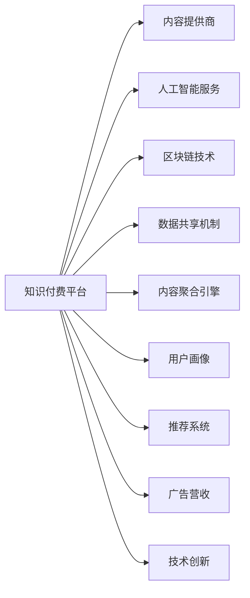

                 

# 知识付费创业中的跨界合作机会

> 关键词：知识付费,跨界合作,人工智能,区块链,数据共享,内容聚合,用户画像,推荐系统,广告营收,技术创新

## 1. 背景介绍

在当今信息爆炸的时代，知识的价值被重新定义。知识付费逐渐成为了一种趋势，无论是传统知识内容创作者，还是新兴的教育科技公司，都在寻求通过知识付费的方式，实现内容的变现。但是，随着市场竞争的加剧，单个知识付费平台想要在激烈的市场竞争中脱颖而出，仅仅依靠自身的资源和能力已经远远不够。跨界合作成为了连接不同领域资源和能力，形成协同效应，共同开拓知识付费市场的有效途径。

## 2. 核心概念与联系

### 2.1 核心概念概述

为了更好地理解知识付费创业中的跨界合作机会，我们先介绍几个关键概念：

- **知识付费**：一种基于互联网的新型知识传播方式，用户通过付费来获取专业知识和技能，如在线课程、电子书、文章、音频视频等。
- **跨界合作**：不同领域的企业或组织通过资源共享、技术合作、市场联动等方式，实现互补和共赢。
- **人工智能**：模拟人类智能过程的技术，包括机器学习、深度学习、自然语言处理等，能够处理大规模、复杂的数据。
- **区块链**：一种去中心化的分布式账本技术，可以实现数据透明、不可篡改、可追溯等特性。
- **数据共享**：不同平台之间通过协议、接口等方式，实现数据的安全、可靠、高效共享。
- **内容聚合**：将不同来源、不同形式的内容进行整合和推荐，为用户提供一站式的学习体验。
- **用户画像**：基于用户的行为和偏好，构建详细的用户特征画像，用于个性化推荐和营销。
- **推荐系统**：通过算法模型，对用户行为进行分析和预测，推荐用户感兴趣的内容。
- **广告营收**：通过用户画像和行为数据分析，精准投放广告，实现流量变现。
- **技术创新**：持续的技术研发和创新，提高产品和服务的竞争力。

这些概念之间相互联系，共同构成了知识付费创业的生态系统。

### 2.2 核心概念原理和架构的 Mermaid 流程图



在这个流程图里，我们通过箭头表示了不同概念之间的联系和互动。知识付费平台利用人工智能服务进行内容推荐，利用区块链技术保障内容版权和用户数据安全，通过数据共享机制与内容提供商和数据服务商进行合作，利用内容聚合引擎和用户画像进行个性化推荐，实现广告营收，并不断进行技术创新以提升服务质量。

## 3. 核心算法原理 & 具体操作步骤

### 3.1 算法原理概述

知识付费平台的核心算法原理主要包括人工智能推荐系统、数据处理与分析、用户行为预测与个性化推荐等。这些算法不仅需要处理大规模数据，还需要在复杂多变的市场环境中不断迭代和优化。

### 3.2 算法步骤详解

以人工智能推荐系统为例，推荐算法的一般步骤包括：

1. **数据收集与预处理**：收集用户行为数据、内容特征数据等，并进行清洗和标准化处理。
2. **特征提取与工程**：通过特征工程技术，提取用户和内容的特征，如用户兴趣标签、内容关键词、分类等。
3. **模型训练与优化**：选择适合的推荐算法模型，如协同过滤、深度学习等，进行训练和优化。
4. **预测与推荐**：基于训练好的模型，对用户行为进行预测，并生成个性化推荐内容。
5. **效果评估与迭代**：对推荐效果进行评估，根据反馈数据调整模型参数，进行迭代优化。

### 3.3 算法优缺点

**优点**：
- **个性化推荐**：能够根据用户偏好和历史行为，提供精准的个性化推荐，提升用户体验和满意度。
- **效率高**：通过算法自动化处理数据，提升推荐效率和效果。
- **适应性强**：能够应对不同类型的数据和复杂的市场环境，具有较强的适应性和扩展性。

**缺点**：
- **数据隐私问题**：需要收集和处理大量用户数据，存在数据隐私和安全的风险。
- **模型复杂度**：算法模型复杂，需要高性能计算资源进行训练和推理。
- **冷启动问题**：新用户或新内容加入时，推荐算法需要一定的训练时间，存在冷启动问题。

### 3.4 算法应用领域

推荐系统广泛应用于电商、社交、新闻、娱乐等各个领域。在知识付费创业中，推荐系统主要用于：

- **内容推荐**：为用户推荐感兴趣的课程、文章、视频等。
- **课程推荐**：根据用户的学习进度和反馈，推荐适合的课程。
- **导师推荐**：根据用户的评价和内容评价，推荐高质量的导师或讲师。

## 4. 数学模型和公式 & 详细讲解 & 举例说明

### 4.1 数学模型构建

推荐系统的主要数学模型包括协同过滤模型、基于内容的推荐模型、深度学习模型等。以协同过滤模型为例，假设用户集为 $U$，物品集为 $I$，用户对物品的评分矩阵为 $R_{ui}$，协同过滤模型的目标是找到用户和物品之间的相似度，从而进行推荐。

### 4.2 公式推导过程

协同过滤模型的基本公式为：

$$
\hat{R}_{ui} = \sum_{v \in N(u)}\alpha_{uv}R_{vi}
$$

其中，$N(u)$ 表示用户 $u$ 的邻居集合，$\alpha_{uv}$ 表示用户 $u$ 和用户 $v$ 之间的相似度系数。

通过协同过滤模型，可以预测用户对未评分物品的评分，从而进行推荐。

### 4.3 案例分析与讲解

以某知识付费平台为例，该平台收集了大量用户对课程的评分数据，并使用协同过滤模型对用户进行推荐。在推荐过程中，平台会根据用户的评分数据，找到与其兴趣相似的用户，并推荐这些用户评分高的课程。通过这种方式，平台能够为用户提供更加个性化和多样化的课程推荐。

## 5. 项目实践：代码实例和详细解释说明

### 5.1 开发环境搭建

在进行知识付费平台推荐系统的开发时，需要搭建一个合适的开发环境。以下是一些建议：

1. **编程语言**：推荐使用Python，因为它拥有丰富的推荐系统库和框架。
2. **数据处理库**：使用Pandas和NumPy进行数据预处理和分析。
3. **机器学习库**：使用Scikit-learn和TensorFlow进行推荐模型的训练和优化。
4. **容器化工具**：使用Docker进行容器化部署，方便在不同环境中快速启动和运行。
5. **监控工具**：使用Prometheus和Grafana进行实时监控和数据分析。

### 5.2 源代码详细实现

以下是一个简单的推荐系统代码示例，用于演示协同过滤模型的基本原理：

```python
import pandas as pd
import numpy as np
from sklearn.metrics.pairwise import cosine_similarity

# 读取评分数据
data = pd.read_csv('ratings.csv')

# 计算用户之间的相似度
similarity = cosine_similarity(data[['user_id']].values, data[['user_id']].values)

# 预测用户未评分的物品评分
predictions = data.groupby('user_id')['item_id'].agg(lambda x: x.tolist()).join(similarity).apply(lambda row: row.dot(row), axis=1).apply(lambda x: x/np.linalg.norm(x))

# 对预测结果进行排名
rankings = predictions.sort_values(ascending=False).tolist()

# 输出前10个推荐物品
for i in range(10):
    item_id = rankings[i]
    item_name = data[data['item_id'] == item_id]['item_name'].values[0]
    print(f"推荐给用户 {i+1} 的物品是 {item_name}")
```

### 5.3 代码解读与分析

上述代码示例展示了协同过滤模型的基本实现步骤。首先，通过Pandas库读取评分数据，并计算用户之间的相似度。然后，使用Scikit-learn库中的cosine_similarity函数计算相似度矩阵。接下来，通过预测用户未评分的物品评分，得到推荐结果。最后，对推荐结果进行排名，并输出前10个推荐物品。

## 6. 实际应用场景

### 6.1 用户画像

通过用户画像，知识付费平台能够更精准地了解用户需求和行为，从而提供更加个性化的推荐和服务。用户画像可以包括用户的年龄、性别、职业、兴趣爱好、学习进度、评分记录等信息。

### 6.2 内容聚合

内容聚合是将不同来源、不同形式的内容进行整合和推荐，为用户提供一站式的学习体验。知识付费平台可以通过爬虫技术收集外部网站的内容，并进行分类、标注、整合。通过内容聚合引擎，平台能够将不同来源的内容进行关联和推荐，提升内容的多样性和丰富度。

### 6.3 广告营收

通过用户画像和行为数据分析，知识付费平台能够实现精准的广告投放，提升平台的广告营收。平台可以根据用户画像，推送与用户兴趣相关的广告，并利用推荐算法进行定向推送，提高广告的转化率和效果。

## 7. 工具和资源推荐

### 7.1 学习资源推荐

为了帮助开发者系统掌握知识付费平台的推荐系统开发，这里推荐一些优质的学习资源：

1. **《推荐系统实战》书籍**：深入浅出地介绍了推荐系统的理论和实践，包括协同过滤、深度学习等主流算法。
2. **Coursera《推荐系统》课程**：由斯坦福大学开设的课程，系统讲解了推荐系统的基础和进阶内容。
3. **Kaggle推荐系统竞赛**：通过实际数据和问题，实践推荐算法的开发和优化。
4. **YouTube推荐系统视频**：由Google工程师讲解的YouTube推荐系统原理和实践。
5. **Pinterest推荐系统博客**：Pinterest的工程师分享了推荐系统开发和优化的经验和心得。

### 7.2 开发工具推荐

为了提高开发效率和系统性能，以下是一些推荐的知识付费平台推荐系统开发工具：

1. **Apache Spark**：用于大规模数据处理和分析的分布式计算框架。
2. **Apache Flink**：基于流式计算的实时数据处理框架。
3. **Apache Kafka**：高吞吐量的消息队列系统，用于数据流量的高效处理。
4. **Apache Hadoop**：用于分布式存储和处理大数据的平台。
5. **TensorBoard**：用于监控和调试机器学习模型的可视化工具。

### 7.3 相关论文推荐

知识付费平台推荐系统涉及大量的算法研究和创新。以下是几篇奠基性的相关论文，推荐阅读：

1. **《推荐系统的最新进展》**：介绍了推荐系统的最新研究进展和算法创新。
2. **《深度学习在推荐系统中的应用》**：深入探讨了深度学习算法在推荐系统中的应用。
3. **《协同过滤推荐系统的研究》**：系统讲解了协同过滤推荐算法的原理和实现。
4. **《内容推荐算法》**：介绍了基于内容的推荐算法的基本原理和应用场景。

## 8. 总结：未来发展趋势与挑战

### 8.1 总结

本文对知识付费平台推荐系统的核心概念和算法原理进行了详细讲解，并给出了项目实践的代码实例。通过本文的系统梳理，可以看到，推荐系统在知识付费平台中扮演了重要的角色，能够提升用户体验、增加平台粘性、实现商业变现。未来，随着技术的不断发展，推荐系统将朝着更加个性化、多样化、智能化的方向发展。

### 8.2 未来发展趋势

展望未来，知识付费平台的推荐系统将呈现以下几个发展趋势：

1. **多模态推荐**：结合文本、图像、音频等多模态数据，提升推荐系统的效果和丰富度。
2. **深度学习推荐**：利用深度神经网络模型，提高推荐系统的准确性和鲁棒性。
3. **实时推荐**：结合流式计算和实时数据处理，实现动态推荐和即时反馈。
4. **社交推荐**：结合用户社交网络和社交关系，进行更加个性化和社交化的推荐。
5. **多用户推荐**：结合多个用户的数据和行为，实现更全面和精准的推荐。

### 8.3 面临的挑战

尽管推荐系统在知识付费平台中取得了显著效果，但仍面临一些挑战：

1. **数据隐私和安全**：用户数据的收集和使用需要严格遵守隐私保护法规，防止数据泄露和滥用。
2. **冷启动问题**：新用户和新内容的推荐需要一定的训练时间，存在冷启动问题。
3. **算法公平性**：推荐算法需要避免算法偏见和歧视，确保公平性和公正性。
4. **算法鲁棒性**：推荐算法需要具备较强的鲁棒性和适应性，避免在面对异常数据或市场变化时出现较大波动。
5. **系统稳定性**：推荐系统的稳定性和可靠性需要不断优化和提升，避免因系统故障导致服务中断。

### 8.4 研究展望

为了解决上述挑战，未来的研究需要在以下几个方面进行突破：

1. **隐私保护技术**：研究隐私保护算法和加密技术，确保用户数据的安全和隐私。
2. **冷启动策略**：研究新的冷启动算法和技术，快速推荐新用户和新内容。
3. **公平推荐算法**：研究公平推荐算法，避免算法偏见和歧视，确保推荐结果的公平性和公正性。
4. **鲁棒推荐模型**：研究鲁棒推荐模型，增强推荐算法的稳定性和适应性。
5. **实时推荐系统**：研究实时推荐系统架构和算法，实现动态推荐和即时反馈。

## 9. 附录：常见问题与解答

**Q1: 推荐系统为什么需要处理大规模数据？**

A: 推荐系统需要处理大规模数据是因为推荐算法通常需要计算用户和物品之间的相似度，而用户和物品的数量通常都是巨大的。因此，推荐系统需要处理和分析大规模数据，才能得出准确的推荐结果。

**Q2: 推荐系统如何处理冷启动问题？**

A: 推荐系统处理冷启动问题的方法包括：
1. 基于用户历史行为的推荐：虽然新用户没有评分记录，但可以通过分析用户的历史行为，预测其兴趣和偏好。
2. 基于物品属性的推荐：对于新物品，可以通过分析物品的属性和特征，预测用户可能感兴趣的内容。
3. 基于相似用户推荐的推荐：对于新用户，可以通过分析与其兴趣相似的用户，进行推荐。

**Q3: 推荐系统如何平衡个性化和多样性？**

A: 推荐系统可以通过以下方法平衡个性化和多样性：
1. 推荐多样性模块：在推荐结果中，加入多样性物品，增加用户选择的多样性。
2. 设定多样性阈值：设定多样性阈值，确保推荐结果中一定包含一定数量的多样化物品。
3. 动态调整推荐策略：根据用户反馈和行为，动态调整推荐策略，平衡个性化和多样性。

**Q4: 推荐系统如何保证推荐结果的准确性？**

A: 推荐系统保证推荐结果的准确性的方法包括：
1. 数据预处理：对数据进行清洗、归一化和特征工程，提高数据的准确性和可靠性。
2. 模型选择和优化：选择适合的推荐算法模型，并进行优化和迭代。
3. 实时监控和评估：对推荐系统进行实时监控和评估，及时发现和解决推荐误差。

**Q5: 推荐系统如何避免算法偏见？**

A: 推荐系统避免算法偏见的方法包括：
1. 数据多样性：确保数据集的多样性和代表性，避免数据偏差。
2. 模型公平性：设计公平推荐算法，确保不同用户和物品之间的公平性。
3. 用户反馈：利用用户反馈和投诉，及时发现和纠正偏见。

总之，知识付费平台的推荐系统需要通过跨界合作、技术创新和不断优化，实现更加个性化、多样化、智能化的推荐，为用户带来更好的学习体验和商业价值。

