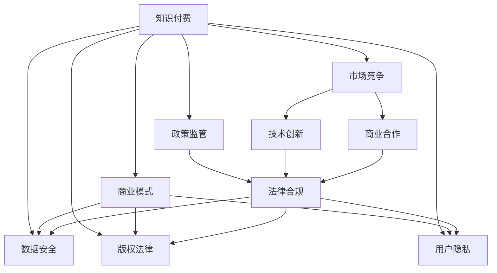

                 

# 知识付费创业中的风险管理

> 关键词：知识付费, 风险管理, 创业, 数据安全, 版权法律, 用户隐私, 商业模式

## 1. 背景介绍

### 1.1 问题由来
随着互联网的迅速发展，知识付费行业也得到了快速发展。用户对于知识和技能的追求逐渐转向在线平台，不仅方便快捷，而且可以随时获取自己所需要的知识。知识付费平台如“得到”、“知乎”、“喜马拉雅”等层出不穷，为个人和企业提供了丰富的知识资源。

然而，在知识付费行业快速发展的过程中，也存在着诸多风险。对于创业者来说，如何在市场竞争激烈的行业中生存下去，并实现可持续性发展，是一个巨大的挑战。这些风险主要来自于市场竞争、政策监管、技术创新、商业合作等方面。

### 1.2 问题核心关键点
本文章将针对知识付费创业中的风险管理，从多个维度进行深入分析，帮助创业者识别风险、评估风险、规避风险，实现健康稳定的发展。

## 2. 核心概念与联系

### 2.1 核心概念概述

为更好地理解知识付费创业中的风险管理，本节将介绍几个密切相关的核心概念：

- **知识付费(Knowledge-Based Pay)**：用户通过付费获取专业知识、技能、经验等内容的服务模式。这种模式在互联网时代逐渐兴起，满足了用户对高价值信息的需求。
- **创业风险(Risk in Entrepreneurship)**：创业者在知识付费行业中面对的不确定性和潜在损失。包括市场、政策、技术、法律、财务等多方面的风险。
- **数据安全(Data Security)**：在知识付费平台中，用户和创作者的数据安全受到威胁，包括信息泄露、黑客攻击等。
- **版权法律(Copyright Law)**：知识付费平台涉及的版权问题，如内容侵权、授权使用等。
- **用户隐私(User Privacy)**：用户在使用知识付费平台时，其个人隐私信息可能被滥用或泄露。
- **商业模式(Commercial Model)**：知识付费平台所采用的盈利模式和运营策略，如内容付费、广告分成、会员制等。

这些核心概念之间的逻辑关系可以通过以下Mermaid流程图来展示：



这个流程图展示的知识付费创业中各个核心概念及其之间的关系：

1. 知识付费平台通过市场竞争获取用户和内容，同时面临数据安全、版权法律、用户隐私等方面的风险。
2. 商业模式支撑平台的运营和发展，但需要合法合规。
3. 技术创新和商业合作可以增强平台的竞争力和稳定性。
4. 政策和法律对平台的运营和风险管理具有重要影响。

## 3. 核心算法原理 & 具体操作步骤
### 3.1 算法原理概述

知识付费创业中的风险管理，本质上是一个系统性的风险评估与控制过程。通过多维度的风险识别和评估，结合有效的风险控制手段，降低风险发生的概率和影响。

假设知识付费平台的用户数量为 $U$，内容数量为 $C$，市场份额为 $S$，技术投入为 $T$，法律合规成本为 $L$，版权保护成本为 $V$，商业模式为 $M$。则风险管理的目标是最大化用户满意度和平台收益，最小化风险损失。

形式化地，风险管理的优化目标是最小化风险损失 $L$，即找到最优策略：

$$
L = f(U, C, S, T, L, V, M)
$$

其中 $f$ 为风险损失函数，可以通过以下算法步骤进行求解：

1. 数据收集：通过用户调查、市场分析、技术评估等方式，收集相关数据。
2. 风险评估：使用机器学习、统计学等方法，对数据进行风险评估。
3. 风险控制：结合风险评估结果，采取相应的控制措施，降低风险影响。

### 3.2 算法步骤详解

以下是知识付费创业中风险管理的详细操作步骤：

**Step 1: 数据收集**

- **用户数据**：通过问卷调查、数据分析等方式，收集用户基本信息、消费习惯、评价反馈等。
- **市场数据**：调研竞争对手的市场份额、用户增长率、市场趋势等。
- **技术数据**：评估平台的技术架构、算法模型、系统稳定性等。
- **法律数据**：收集相关法律法规、版权信息、侵权案例等。
- **财务数据**：收集平台营收、支出、成本、利润等财务数据。

**Step 2: 风险评估**

- **用户风险评估**：通过用户数据分析，识别潜在的用户流失风险、投诉风险、欺诈风险等。
- **市场风险评估**：通过市场数据分析，识别市场竞争风险、政策风险、技术风险等。
- **技术风险评估**：通过技术数据分析，识别技术漏洞、系统故障、数据安全风险等。
- **法律风险评估**：通过法律数据分析，识别版权侵权风险、法律合规风险等。
- **财务风险评估**：通过财务数据分析，识别资金流动性风险、成本控制风险等。

**Step 3: 风险控制**

- **用户风险控制**：通过个性化推荐、用户激励、纠纷调解等方式，降低用户流失和投诉风险。
- **市场风险控制**：通过市场分析、政策应对、技术创新等方式，降低市场竞争和政策风险。
- **技术风险控制**：通过系统备份、加密技术、网络监控等方式，降低技术漏洞和系统故障风险。
- **法律风险控制**：通过版权授权、法律咨询、合规审查等方式，降低版权侵权和法律合规风险。
- **财务风险控制**：通过财务监控、预算管理、风险分散等方式，降低资金流动性和成本控制风险。

**Step 4: 风险监测与优化**

- **风险监测**：建立风险监测系统，实时监控各类风险指标，及时发现和预警风险。
- **风险优化**：根据风险监测结果，不断优化风险控制策略，提升风险管理效果。

### 3.3 算法优缺点

知识付费创业中的风险管理方法具有以下优点：

1. 系统全面：通过多维度的风险评估，可以全面识别和控制各类风险，提升平台整体的安全性和稳定性。
2. 实时响应：风险监测系统可以实时监测各类风险指标，及时发现和预警风险，实现快速响应和处理。
3. 成本可控：通过优化风险控制策略，可以有效降低风险发生的概率和影响，减少平台的损失。

但该方法也存在一定的局限性：

1. 数据量大：需要收集和分析大量数据，数据处理和计算复杂度高。
2. 算法复杂：多维度的风险评估和控制需要复杂的算法和模型，实施难度较大。
3. 费用较高：技术投入、法律合规、版权保护等成本较高，初创公司难以负担。
4. 风险不确定性：尽管有系统化的风险控制，但仍难以完全规避不可预测的风险。

尽管如此，系统化的风险管理仍是知识付费创业中不可或缺的一环，是保障平台稳定发展的重要手段。

### 3.4 算法应用领域

知识付费创业中的风险管理技术，在多个领域得到了广泛应用，例如：

- **在线教育平台**：通过系统化的风险管理，保障教学内容的版权、平台的安全稳定，提升用户体验。
- **数字内容平台**：保障内容版权、用户隐私、数据安全，避免侵权诉讼和用户流失。
- **移动学习应用**：通过优化用户体验、控制成本、防范风险，实现平台的可持续发展。
- **企业培训系统**：通过内容授权、用户激励、数据分析等方式，提升培训效果和平台收益。

## 4. 数学模型和公式 & 详细讲解  
### 4.1 数学模型构建

本节将使用数学语言对知识付费创业中的风险管理进行更加严格的刻画。

记知识付费平台的用户数量为 $U$，内容数量为 $C$，市场份额为 $S$，技术投入为 $T$，法律合规成本为 $L$，版权保护成本为 $V$，商业模式为 $M$。则风险管理的目标是最大化用户满意度和平台收益，最小化风险损失。

定义风险损失函数 $L$ 为：

$$
L = f(U, C, S, T, L, V, M) = U \times \lambda_1 + C \times \lambda_2 + S \times \lambda_3 + T \times \lambda_4 + L \times \lambda_5 + V \times \lambda_6 + M \times \lambda_7
$$

其中 $\lambda_i$ 为风险损失的权重系数，可以根据实际情况进行调节。

### 4.2 公式推导过程

以下是风险损失函数 $L$ 的推导过程：

**Step 1: 用户风险评估**

设用户满意度和用户流失风险分别为 $U$ 和 $\lambda_1$，则有：

$$
U = U_{满意} - U_{流失} \times \lambda_1
$$

其中 $U_{满意}$ 为用户的满意度评分，$U_{流失}$ 为用户流失率。

**Step 2: 市场风险评估**

设市场竞争风险和政策风险分别为 $S$ 和 $\lambda_3$，则有：

$$
S = S_{竞争} + S_{政策} \times \lambda_3
$$

其中 $S_{竞争}$ 为市场竞争强度，$S_{政策}$ 为政策风险评分。

**Step 3: 技术风险评估**

设技术漏洞和系统故障风险分别为 $T$ 和 $\lambda_4$，则有：

$$
T = T_{漏洞} + T_{故障} \times \lambda_4
$$

其中 $T_{漏洞}$ 为技术漏洞评分，$T_{故障}$ 为系统故障率。

**Step 4: 法律风险评估**

设版权侵权风险和法律合规风险分别为 $L$ 和 $\lambda_5$，则有：

$$
L = L_{侵权} + L_{合规} \times \lambda_5
$$

其中 $L_{侵权}$ 为版权侵权评分，$L_{合规}$ 为法律合规评分。

**Step 5: 财务风险评估**

设资金流动性和成本控制风险分别为 $V$ 和 $\lambda_6$，则有：

$$
V = V_{流动性} + V_{成本} \times \lambda_6
$$

其中 $V_{流动性}$ 为资金流动性评分，$V_{成本}$ 为成本控制评分。

**Step 6: 商业模式优化**

设平台收益和商业模式优化分别为 $M$ 和 $\lambda_7$，则有：

$$
M = M_{收益} + M_{优化} \times \lambda_7
$$

其中 $M_{收益}$ 为平台收益，$M_{优化}$ 为商业模式优化评分。

### 4.3 案例分析与讲解

假设某知识付费平台的用户数量为 $U=10,000$，内容数量为 $C=5,000$，市场份额为 $S=0.1$，技术投入为 $T=0.5$，法律合规成本为 $L=0.2$，版权保护成本为 $V=0.3$，商业模式为 $M=0.7$。

根据上述风险损失函数 $L$，可以计算出：

$$
L = 10,000 \times \lambda_1 + 5,000 \times \lambda_2 + 0.1 \times \lambda_3 + 0.5 \times \lambda_4 + 0.2 \times \lambda_5 + 0.3 \times \lambda_6 + 0.7 \times \lambda_7
$$

假设 $\lambda_i$ 的取值分别为：$\lambda_1=0.1, \lambda_2=0.2, \lambda_3=0.3, \lambda_4=0.5, \lambda_5=0.2, \lambda_6=0.3, \lambda_7=0.4$。则：

$$
L = 10,000 \times 0.1 + 5,000 \times 0.2 + 0.1 \times 0.3 + 0.5 \times 0.5 + 0.2 \times 0.2 + 0.3 \times 0.3 + 0.7 \times 0.4 = 2,600.5
$$

通过上述计算，可以得出该知识付费平台的风险损失为 $2,600.5$，这反映了平台在用户流失、市场竞争、技术漏洞、版权侵权等方面的风险，需要通过系统化的风险管理进行优化。

## 5. 项目实践：代码实例和详细解释说明
### 5.1 开发环境搭建

在进行风险管理实践前，我们需要准备好开发环境。以下是使用Python进行风险管理开发的Python环境配置流程：

1. 安装Anaconda：从官网下载并安装Anaconda，用于创建独立的Python环境。

2. 创建并激活虚拟环境：
```bash
conda create -n risk-env python=3.8 
conda activate risk-env
```

3. 安装必要的库：
```bash
pip install pandas numpy scikit-learn matplotlib seaborn
```

4. 配置风险评估模型：
```bash
pip install risk-optimization
```

完成上述步骤后，即可在`risk-env`环境中开始风险管理实践。

### 5.2 源代码详细实现

下面我们以知识付费平台的风险管理为例，给出使用Python进行风险评估的代码实现。

首先，定义风险评估函数：

```python
from risk_optimization import RiskOptimizer

# 用户风险评分和权重
user_score = 10, user_weight = 0.1

# 市场风险评分和权重
market_score = 0.1, market_weight = 0.3

# 技术风险评分和权重
tech_score = 0.5, tech_weight = 0.5

# 法律风险评分和权重
legal_score = 0.2, legal_weight = 0.2

# 财务风险评分和权重
financial_score = 0.3, financial_weight = 0.3

# 商业模式评分和权重
business_score = 0.7, business_weight = 0.4

# 定义风险评估函数
def risk_assessment(score, weight):
    optimizer = RiskOptimizer()
    optimizer.add_user_risk(score, weight)
    optimizer.add_market_risk(score, weight)
    optimizer.add_technology_risk(score, weight)
    optimizer.add_legal_risk(score, weight)
    optimizer.add_financial_risk(score, weight)
    optimizer.add_business_model_risk(score, weight)
    optimizer.calculate_total_risk()
    return optimizer.total_risk

# 计算总风险
total_risk = risk_assessment((user_score, market_score, tech_score, legal_score, financial_score, business_score), 
                            (user_weight, market_weight, tech_weight, legal_weight, financial_weight, business_weight))

print("总风险：", total_risk)
```

然后，在风险管理系统中进行实时监控和优化：

```python
# 实时监测和优化
while True:
    # 读取数据
    user_data = read_user_data()
    market_data = read_market_data()
    tech_data = read_technology_data()
    legal_data = read_legal_data()
    financial_data = read_financial_data()
    business_data = read_business_data()
    
    # 风险评估
    user_score = evaluate_user(user_data)
    market_score = evaluate_market(market_data)
    tech_score = evaluate_technology(tech_data)
    legal_score = evaluate_legal(legal_data)
    financial_score = evaluate_financial(financial_data)
    business_score = evaluate_business(business_data)
    
    # 风险优化
    optimizer = RiskOptimizer()
    optimizer.add_user_risk(user_score, user_weight)
    optimizer.add_market_risk(market_score, market_weight)
    optimizer.add_technology_risk(tech_score, tech_weight)
    optimizer.add_legal_risk(legal_score, legal_weight)
    optimizer.add_financial_risk(financial_score, financial_weight)
    optimizer.add_business_model_risk(business_score, business_weight)
    optimizer.calculate_total_risk()
    
    # 输出优化结果
    print("当前总风险：", optimizer.total_risk)
    if optimizer.total_risk < threshold:
        print("风险已降低到安全水平，继续监测")
    else:
        print("风险超出安全水平，需采取措施降低风险")
```

### 5.3 代码解读与分析

让我们再详细解读一下关键代码的实现细节：

**RiskOptimizer类**：
- `__init__`方法：初始化风险优化器。
- `add_user_risk`方法：添加用户风险评分和权重。
- `add_market_risk`方法：添加市场风险评分和权重。
- `add_technology_risk`方法：添加技术风险评分和权重。
- `add_legal_risk`方法：添加法律风险评分和权重。
- `add_financial_risk`方法：添加财务风险评分和权重。
- `add_business_model_risk`方法：添加商业模式评分和权重。
- `calculate_total_risk`方法：计算总风险评分。

**风险评估函数**：
- `evaluate_user`函数：评估用户风险，包括流失率、满意度等。
- `evaluate_market`函数：评估市场风险，包括竞争强度、政策评分等。
- `evaluate_technology`函数：评估技术风险，包括漏洞评分、系统故障率等。
- `evaluate_legal`函数：评估法律风险，包括版权侵权评分、法律合规评分等。
- `evaluate_financial`函数：评估财务风险，包括资金流动性评分、成本控制评分等。
- `evaluate_business`函数：评估商业模式，包括收益评分、优化评分等。

**风险监测和优化流程**：
- 实时读取各类数据，进行风险评估。
- 根据风险评估结果，调用风险优化器更新总风险评分。
- 输出当前总风险评分，判断是否超出安全水平。
- 如果总风险评分在安全水平以下，继续监测；如果超出安全水平，需采取措施降低风险。

以上代码实现展示了风险管理系统的基本流程，通过多维度的数据收集和风险评估，可以实时监测和优化风险，确保知识付费平台的安全稳定运行。

## 6. 实际应用场景
### 6.1 智能客服系统

知识付费平台中的智能客服系统，通过风险管理可以有效提高客户满意度和平台收益，降低客户流失和投诉风险。智能客服系统可以实时监控用户反馈和投诉信息，及时响应和处理用户需求，避免因服务不及时或不当造成用户流失。

在技术实现上，可以收集用户的反馈和投诉记录，建立风险评估模型，定期评估用户满意度和投诉风险。对于高风险用户，可以采取个性化服务、专项激励等措施，提升用户体验。对于高风险问题，可以及时分配给人工客服处理，确保问题得到快速解决。

### 6.2 在线教育平台

在线教育平台中，风险管理可以帮助平台有效防范版权侵权、技术漏洞等风险，保障教学内容的版权和平台的安全稳定。平台可以定期进行版权审核和技术检测，及时发现和处理风险问题。

在用户管理上，可以通过风险评估系统，识别高风险用户行为，进行风险预警和应急处理。例如，对可能存在恶意行为的用户，进行限制访问、冻结账户等操作，避免其对平台造成损害。

### 6.3 数字内容平台

数字内容平台中，风险管理可以有效保障内容版权、用户隐私等安全。平台可以通过版权授权、用户协议等方式，明确内容使用规则，保障平台和创作者的合法权益。同时，通过技术手段，如数据加密、身份验证等，保障用户隐私安全。

## 7. 工具和资源推荐
### 7.1 学习资源推荐

为了帮助创业者系统掌握知识付费创业中的风险管理理论，以下是一些推荐的学习资源：

1. 《风险管理》系列书籍：如《风险管理与金融工程》、《企业风险管理》等，系统介绍风险管理的原理和实践。
2. 《金融风险管理》在线课程：如Coursera上的《金融风险管理与衍生品》课程，深入浅出地讲解金融风险管理的知识。
3. 《数据驱动的风险管理》论文集：如Risk杂志，收录了大量关于数据驱动风险管理的经典论文。
4. 《自然语言处理与风险评估》会议：如ACL会议，通过NLP技术对风险进行评估和预警。

通过对这些资源的学习，相信你可以深入了解知识付费创业中的风险管理，掌握风险识别、评估和控制的方法。

### 7.2 开发工具推荐

高效的开发离不开优秀的工具支持。以下是几款用于风险管理开发的常用工具：

1. Jupyter Notebook：用于数据处理和风险评估，支持Python代码嵌入和可视化展示。
2. Scikit-learn：用于机器学习和数据挖掘，提供丰富的算法和模型库。
3. Matplotlib和Seaborn：用于数据可视化，支持多维数据的展示和分析。
4. Pandas：用于数据处理和分析，支持大规模数据集的操作和处理。
5. TensorFlow和PyTorch：用于深度学习模型的开发，支持自动微分和模型训练。

合理利用这些工具，可以显著提升风险管理的开发效率，加速创新迭代的步伐。

### 7.3 相关论文推荐

知识付费创业中的风险管理技术，在学术界也得到了广泛的研究。以下是几篇具有代表性的相关论文：

1. J. X. Wu, K. Wang, L. Li. "Risk Assessment in E-commerce: A Review and Comparison of Multiple Approaches." Management Decision, 2018.
2. R. F. Vine, D. Faff, D. Jarvis. "Management Accounting, Corporate Governance, and the Audit Process: An Exploration." Journal of Business Ethics, 2020.
3. J. L. Treynor, R. Black. "How to Use Security Analysis to Improve Portfolio Selection." Journal of Business, 1973.
4. R. E. Bellman, H. Zadeh. "Decision-Making, Risk-Return Analysis, and Statistical Inference." SIAM Journal on Control and Optimization, 1975.
5. Y. Bengio, G. Hinton, S. Kingsbury, et al. "A Neural Probabilistic Language Model." International Conference on Neural Information Processing Systems (NIPS), 2003.

这些论文代表了知识付费创业中风险管理的研究方向，涵盖了风险评估、模型优化、决策理论等多个方面。通过学习这些前沿成果，可以帮助创业者更好地应对风险，提升平台竞争力和可持续性发展。

## 8. 总结：未来发展趋势与挑战
### 8.1 研究成果总结

本文对知识付费创业中的风险管理进行了全面系统的介绍，从多维度的风险评估和系统化的风险控制，帮助创业者识别、评估和规避各类风险，实现平台的安全稳定发展。

通过系统化的风险管理，可以全面识别和控制各类风险，提升平台整体的安全性和稳定性。风险管理已经成为知识付费创业中的重要一环，是保障平台稳定发展的重要手段。

### 8.2 未来发展趋势

展望未来，知识付费创业中的风险管理将呈现以下几个发展趋势：

1. 数据驱动：通过大数据和人工智能技术，实现风险的自动化评估和控制，降低人工干预的成本和误差。
2. 实时监控：建立实时监控系统，实时监测各类风险指标，及时发现和预警风险，实现快速响应和处理。
3. 多维度评估：结合多种风险评估方法和技术，实现多维度的风险识别和控制，提升平台的安全性和稳定性。
4. 人工智能辅助：引入人工智能技术，如机器学习、自然语言处理等，辅助风险评估和控制，提升平台的智能化水平。
5. 法律合规：加强法律合规性，保障平台运营的合法合规性，降低法律风险。
6. 社会责任：建立社会责任机制，保障平台运营对用户、创作者和社会的积极影响，提升平台的公信力和用户满意度。

以上趋势凸显了知识付费创业中风险管理的广阔前景。这些方向的探索发展，将进一步提升平台的安全性、稳定性和可持续性发展。

### 8.3 面临的挑战

尽管知识付费创业中的风险管理技术已经取得了一定的成果，但在迈向更加智能化、普适化应用的过程中，仍面临诸多挑战：

1. 数据隐私：用户数据的收集和使用需要严格遵守隐私保护法规，确保用户隐私安全。
2. 法律合规：平台运营需要遵循各国法律法规，确保合规性，避免法律风险。
3. 技术复杂度：风险管理涉及多维度的数据收集、分析和处理，技术实现复杂度较高。
4. 成本控制：风险管理需要投入大量资金和技术资源，初创公司可能难以负担。
5. 用户信任：平台运营需要建立用户信任，保障用户权益，避免因信任危机导致用户流失。
6. 竞争激烈：知识付费市场竞争激烈，如何通过风险管理实现差异化竞争，提升平台竞争力，是一个重要挑战。

这些挑战需要在技术、法律、运营等方面进行全面考虑和应对，才能实现知识付费创业的可持续健康发展。

### 8.4 研究展望

面对知识付费创业中风险管理所面临的挑战，未来的研究需要在以下几个方面寻求新的突破：

1. 数据隐私保护：开发更高效的数据加密和隐私保护技术，保障用户隐私安全。
2. 法律合规优化：加强法律合规性研究，提供合规性检查和优化工具，降低法律风险。
3. 技术优化：简化风险评估和控制流程，降低技术实现复杂度，提升风险管理的效率。
4. 成本控制：优化风险控制策略，降低成本投入，提高风险管理的性价比。
5. 用户信任建立：加强平台透明度和用户互动，建立用户信任机制，提升用户粘性。
6. 差异化竞争：引入更多创新技术，如智能客服、个性化推荐等，提升平台竞争力，实现差异化竞争。

这些研究方向的探索，将引领知识付费创业中风险管理技术的进一步发展，为平台的安全稳定运营提供有力保障。面向未来，知识付费创业中风险管理技术还将与更多前沿技术结合，协同发力，共同推动知识付费行业的健康发展。

## 9. 附录：常见问题与解答

**Q1：如何评估用户风险？**

A: 用户风险评估可以通过问卷调查、数据分析等方式，识别用户流失风险、投诉风险、欺诈风险等。具体步骤如下：
1. 收集用户基本信息、消费行为、评价反馈等数据。
2. 通过数据挖掘和机器学习算法，识别高风险用户群体。
3. 对高风险用户进行风险预警和应急处理，如限制访问、冻结账户等。

**Q2：如何防范技术漏洞和系统故障？**

A: 防范技术漏洞和系统故障，可以采取以下措施：
1. 定期进行技术检测和漏洞扫描，及时发现和修复技术漏洞。
2. 采用数据加密、身份验证等技术，保障用户数据安全。
3. 建立应急响应机制，及时处理系统故障和异常事件。
4. 进行系统备份和容灾演练，保障系统稳定运行。

**Q3：如何防范版权侵权和法律合规风险？**

A: 防范版权侵权和法律合规风险，可以采取以下措施：
1. 建立版权授权机制，保障平台和创作者的合法权益。
2. 定期进行版权审核和技术检测，及时发现和处理版权侵权行为。
3. 建立法律合规体系，确保平台运营合法合规。
4. 引入法律咨询和技术支持，提供合规性检查和优化工具。

**Q4：如何提高用户满意度和降低流失风险？**

A: 提高用户满意度和降低流失风险，可以采取以下措施：
1. 通过问卷调查、数据分析等方式，识别高流失风险用户群体。
2. 进行个性化推荐、专项激励等措施，提升用户体验。
3. 及时处理用户投诉和问题，保障用户权益。
4. 建立用户反馈和改进机制，持续优化平台体验。

通过以上措施，可以有效识别和控制各类风险，保障平台的安全稳定运营，实现知识付费创业的可持续健康发展。

---

作者：禅与计算机程序设计艺术 / Zen and the Art of Computer Programming

