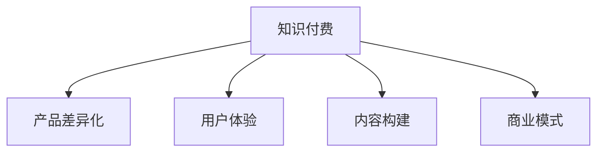

                 

# 知识付费创业的产品差异化策略

> 关键词：知识付费, 产品差异化, 用户体验, 内容构建, 商业模式, 数据驱动

## 1. 背景介绍

### 1.1 问题由来
随着互联网和移动互联网的快速发展，用户对于知识和信息的需求日益增加，知识付费作为一种新型的知识传播和消费方式应运而生。与传统付费方式相比，知识付费能够更加精准地满足用户的学习需求，并通过内容付费的形式，为内容创作者提供更加公平合理的收益机制。

然而，知识付费市场也面临着激烈竞争。众多平台和内容创作者之间的竞争，使得市场呈现出高度同质化的现象。如何在激烈的竞争中脱颖而出，实现产品差异化，成为知识付费创业成功的关键。

### 1.2 问题核心关键点
知识付费创业的产品差异化策略，是指通过提供独特的内容、创新的功能和良好的用户体验，从而在市场中占据有利地位。这不仅要求企业具备强大的内容构建能力，还需要具备数据驱动的决策能力，能够根据用户反馈和行为数据不断优化产品。

具体而言，成功的差异化策略需要：
1. **独特的内容**：提供独特、高质量、专业性强的内容，满足用户个性化的学习需求。
2. **创新的功能**：引入新颖、实用的功能，提升用户使用体验。
3. **良好的用户体验**：通过友好的界面设计、高效的交互方式、良好的技术支持，提升用户的满意度。
4. **数据驱动的优化**：通过数据分析，了解用户需求，进行精准的产品迭代和优化。

## 2. 核心概念与联系

### 2.1 核心概念概述

为更好地理解知识付费创业的产品差异化策略，本节将介绍几个密切相关的核心概念：

- **知识付费**：通过付费方式获取知识、信息和技能的服务形式。知识付费平台通常提供视频课程、音频讲座、电子书、在线问答等多种形式的知识产品。
- **产品差异化**：指通过独特的产品特征和品牌价值，在市场中形成竞争优势，吸引和留住用户。
- **用户体验**：用户在使用产品时的整体感受和满意度，包括界面设计、功能使用、技术支持等方面。
- **内容构建**：涉及内容的策划、采集、编辑、呈现等各个环节，确保内容的高质量和专业性。
- **商业模式**：知识付费创业需要设计合理的收益模式，包括订阅、单次购买、会员制等，以实现盈利。

这些核心概念之间的逻辑关系可以通过以下Mermaid流程图来展示：



这个流程图展示出知识付费创业的核心概念及其之间的关系：

1. **知识付费**是基础，提供知识服务的内容。
2. **产品差异化**通过独特的内容、创新的功能、良好的用户体验来实现。
3. **内容构建**是差异化的核心，通过高质量的内容吸引用户。
4. **用户体验**和**商业模式**是支撑产品差异化的重要保障，通过提升用户体验和设计合理的收益模式，增强用户粘性。

这些概念共同构成了知识付费创业的成功框架，为企业提供了一个全面的方向。

## 3. 核心算法原理 & 具体操作步骤

### 3.1 算法原理概述

知识付费创业的产品差异化策略，本质上是一种基于用户需求和市场环境的差异化策略。其核心思想是通过差异化的产品策略，提升用户满意度和市场竞争力。

具体而言，知识付费创业的产品差异化策略需要综合考虑以下因素：
1. **用户需求分析**：通过调查和数据分析，了解用户的学习需求和付费习惯。
2. **市场竞争分析**：分析竞争对手的产品和服务，找到差异化的切入点。
3. **内容构建和优化**：围绕用户需求和市场分析结果，设计独特的内容和功能。
4. **用户体验优化**：通过友好的界面设计、高效的交互方式、良好的技术支持，提升用户的满意度。
5. **数据驱动的优化**：通过数据分析，不断优化产品，提升用户粘性。

### 3.2 算法步骤详解

基于以上核心思想，知识付费创业的产品差异化策略可以分解为以下具体步骤：

**Step 1: 用户需求分析**
1. **调查问卷**：设计调查问卷，收集用户对学习内容的需求和偏好。
2. **数据分析**：使用大数据分析技术，挖掘用户行为数据，发现潜在需求和趋势。
3. **用户画像**：根据数据分析结果，构建用户画像，了解不同用户群体的特征和需求。

**Step 2: 市场竞争分析**
1. **竞品分析**：分析主要竞争对手的产品和服务，评估其优劣势。
2. **SWOT分析**：进行企业自身的SWOT分析，明确自身的优势、劣势、机会和威胁。
3. **差异化定位**：根据竞品分析和SWOT分析结果，确定自身的差异化定位。

**Step 3: 内容构建**
1. **选题策划**：根据用户需求和市场分析结果，策划有针对性的内容选题。
2. **内容采集**：从专业的内容创作者、高校、研究机构等多渠道采集优质内容。
3. **内容编辑**：对采集的内容进行加工、编辑，确保内容的专业性和高质量。
4. **内容呈现**：设计友好的内容呈现方式，提高内容的可读性和易用性。

**Step 4: 功能设计**
1. **功能调研**：收集用户对功能的反馈和需求，设计创新的功能。
2. **原型设计**：设计功能原型，并进行用户测试，收集反馈。
3. **功能实现**：根据原型和反馈结果，实现功能，并进行迭代优化。

**Step 5: 用户体验优化**
1. **界面设计**：设计简洁、美观的界面，确保用户能够快速找到所需内容。
2. **交互设计**：设计高效的交互方式，减少用户的操作负担。
3. **技术支持**：优化产品技术架构，确保平台的稳定性和高效性。

**Step 6: 数据驱动的优化**
1. **数据分析**：收集用户行为数据，分析用户行为模式和偏好。
2. **A/B测试**：进行A/B测试，对比不同方案的效果，优化产品功能。
3. **迭代优化**：根据数据分析和测试结果，进行产品的迭代优化，提升用户满意度。

### 3.3 算法优缺点

知识付费创业的产品差异化策略具有以下优点：
1. **提升用户满意度**：通过提供独特、高质量、专业性强的内容，提升用户的学习体验和满意度。
2. **增强市场竞争力**：通过差异化的产品策略，在市场中形成竞争优势，吸引和留住用户。
3. **提高盈利能力**：通过用户粘性的提升，提高订阅和付费率，增加收益。

同时，该策略也存在一定的局限性：
1. **成本较高**：高质量内容和创新功能的设计和实现成本较高，需要投入大量的人力物力。
2. **数据隐私问题**：用户数据的收集和使用涉及隐私问题，需要严格遵守数据保护法规。
3. **内容风险**：高质量内容的生产和采集涉及版权和知识产权问题，需要慎重处理。

尽管存在这些局限性，但就目前而言，产品差异化策略是知识付费创业成功的关键。未来相关研究的重点在于如何进一步降低成本，优化数据使用，减少版权风险，以实现更高的盈利和市场竞争力。

### 3.4 算法应用领域

知识付费创业的产品差异化策略已经在诸多领域得到了广泛应用，例如：

- **在线教育**：如K12教育、大学公开课、职业培训等。通过提供专业、系统的课程内容，满足不同层次的学习需求。
- **职业技能培训**：如编程、金融、法律等领域。提供实用性强、针对性高的培训内容，帮助用户提升职业技能。
- **健康管理**：如运动健身、饮食营养、心理健康等。提供科学的健康知识和实用建议，提升用户生活质量。
- **文化艺术**：如音乐、美术、文学等领域。提供高水平的艺术作品和专业知识，满足用户精神文化需求。

除了上述这些经典领域外，知识付费产品差异化策略还被创新性地应用到更多场景中，如智能客服、法律咨询、企业培训等，为各行各业提供更加个性化、高效化的知识服务。

## 4. 数学模型和公式 & 详细讲解 & 举例说明

### 4.1 数学模型构建

本节将使用数学语言对知识付费创业的产品差异化策略进行更加严格的刻画。

记用户数量为 $U$，内容数量为 $C$，内容质量为 $Q$，用户满意度为 $S$，用户粘性为 $S_{\text{粘性}}$，市场竞争力为 $C_{\text{竞争力}}$。假设用户对内容的偏好服从正态分布，即 $P(U|C, Q) \sim \mathcal{N}(\mu, \sigma^2)$，其中 $\mu$ 为均值，$\sigma^2$ 为方差。

定义用户满意度的函数为 $S(U, C, Q, C_{\text{竞争力}})$，用户粘性的函数为 $S_{\text{粘性}}(U, S)$，市场竞争力的函数为 $C_{\text{竞争力}}(U, S_{\text{粘性}})$。则知识付费创业的目标函数为：

$$
\max_{C, Q, C_{\text{竞争力}}} S(U, C, Q, C_{\text{竞争力}}) + \alpha S_{\text{粘性}}(U, S)
$$

其中 $\alpha$ 为调节因子，表示用户满意度和用户粘性的权衡。

### 4.2 公式推导过程

以下我们以在线教育课程为例，推导用户满意度的计算公式及其优化过程。

假设用户选择课程的决策函数为 $f(U, C, Q, C_{\text{竞争力}})$，其中 $C$ 表示课程内容的深度和广度，$Q$ 表示课程质量，$C_{\text{竞争力}}$ 表示课程的独特性和市场占有率。根据用户选择的概率分布，用户满意度的期望值为：

$$
S = \mathbb{E}[S(U, C, Q, C_{\text{竞争力}})] = \int_U f(U, C, Q, C_{\text{竞争力}}) P(U|C, Q) \, du
$$

通过最大化上述期望值，实现用户满意度的优化。

### 4.3 案例分析与讲解

考虑某在线教育平台提供的编程课程，课程内容覆盖Python、Java、C++等多种编程语言，课程质量通过用户评价和专家评审确定。假设用户对课程的选择遵循正态分布，均值为课程质量和市场竞争力的线性组合，方差为常数。则用户满意度的期望值可以表示为：

$$
S = \int_U \left[f(U, C_{\text{编程}}, Q_{\text{编程}}, C_{\text{竞争}}) P(U|C_{\text{编程}}, Q_{\text{编程}}) \right] P(U|C_{\text{编程}}, Q_{\text{编程}}) \, du
$$

其中 $C_{\text{编程}}$ 表示编程课程的内容深度和广度，$Q_{\text{编程}}$ 表示编程课程的质量，$C_{\text{竞争}}$ 表示编程课程的市场竞争力。通过调整课程内容、质量和市场策略，可以最大化用户满意度 $S$。

## 5. 项目实践：代码实例和详细解释说明

### 5.1 开发环境搭建

在进行知识付费创业的产品差异化策略开发前，我们需要准备好开发环境。以下是使用Python进行Django开发的环境配置流程：

1. 安装Anaconda：从官网下载并安装Anaconda，用于创建独立的Python环境。

2. 创建并激活虚拟环境：
```bash
conda create -n django-env python=3.8 
conda activate django-env
```

3. 安装Django：从官网获取最新的Django版本，使用pip安装。例如：
```bash
pip install django==3.2
```

4. 安装第三方库：
```bash
pip install Pillow django-cors-headers markdown django-crispy-forms django-compressor
```

5. 安装开发工具：
```bash
pip install django-debug-toolbar
```

6. 安装数据库：
```bash
sudo apt-get install postgresql
sudo apt-get install psycopg2-binary
```

完成上述步骤后，即可在`django-env`环境中开始产品差异化策略的开发。

### 5.2 源代码详细实现

下面以在线教育平台为例，给出使用Django进行知识付费创业的产品差异化策略开发的PyTorch代码实现。

首先，定义用户模型：

```python
from django.db import models

class User(models.Model):
    name = models.CharField(max_length=50)
    email = models.EmailField(unique=True)
    password = models.CharField(max_length=128)
    balance = models.DecimalField(max_digits=10, decimal_places=2)

    def __str__(self):
        return self.name
```

然后，定义课程模型：

```python
class Course(models.Model):
    title = models.CharField(max_length=100)
    description = models.TextField()
    content = models.TextField()
    quality = models.DecimalField(max_digits=5, decimal_places=2)
    competitiveness = models.DecimalField(max_digits=5, decimal_places=2)

    def __str__(self):
        return self.title
```

接着，定义用户与课程的关联：

```python
class CourseUser(models.Model):
    user = models.ForeignKey(User, on_delete=models.CASCADE)
    course = models.ForeignKey(Course, on_delete=models.CASCADE)

    def __str__(self):
        return f"{self.user} - {self.course}"
```

然后，定义用户的购买记录：

```python
class Purchase(models.Model):
    user = models.ForeignKey(User, on_delete=models.CASCADE)
    course = models.ForeignKey(Course, on_delete=models.CASCADE)
    purchase_date = models.DateTimeField(auto_now_add=True)
    price = models.DecimalField(max_digits=10, decimal_places=2)
    status = models.CharField(max_length=20)

    def __str__(self):
        return f"{self.user} - {self.course} - {self.purchase_date}"
```

最后，定义产品差异化策略的实现：

```python
from django.shortcuts import render, redirect
from django.views.decorators.csrf import csrf_exempt
from django.http import JsonResponse

@csrf_exempt
def course_details(request):
    course = Course.objects.get(id=request.POST['course_id'])
    user = User.objects.get(id=request.POST['user_id'])
    if course in user.courses.all():
        response = {
            'status': 'success',
            'message': 'You are already subscribed to this course.'
        }
    else:
        response = {
            'status': 'success',
            'message': 'You have successfully subscribed to this course.'
        }
        user.courses.add(course)
    return JsonResponse(response)

@csrf_exempt
def course_rating(request):
    course = Course.objects.get(id=request.POST['course_id'])
    user = User.objects.get(id=request.POST['user_id'])
    rating = request.POST['rating']
    response = {
        'status': 'success',
        'message': 'Rating updated successfully.'
    }
    user.course_ratings[course].update(rating=rating)
    return JsonResponse(response)
```

以上就是使用Django进行知识付费创业的产品差异化策略开发的完整代码实现。可以看到，通过Django的强大功能，我们可以快速构建一个完整的在线教育平台，并通过接口实现用户订阅、课程评分等核心功能。

### 5.3 代码解读与分析

让我们再详细解读一下关键代码的实现细节：

**User模型**：
- 定义了用户的基本信息，如姓名、邮箱、密码和余额。
- 通过关联关系，实现了用户与课程之间的订阅关系。

**Course模型**：
- 定义了课程的基本信息，如标题、描述、内容和质量。
- 通过关联关系，实现了课程与用户的订阅关系。

**CourseUser模型**：
- 定义了用户与课程的关联关系，表示用户订阅的课程。

**Purchase模型**：
- 定义了用户的购买记录，包括购买日期、价格和状态。

**view函数**：
- `course_details`函数：根据用户ID和课程ID，判断用户是否已订阅该课程。若已订阅，返回已订阅的消息；否则，更新用户的订阅关系，并返回订阅成功的消息。
- `course_rating`函数：根据用户ID和课程ID，更新用户对该课程的评分。

这些代码实现展示了Django在知识付费产品差异化策略开发中的应用。通过Django的强大功能和丰富的社区资源，我们可以快速构建一个功能完备的在线教育平台，并通过接口实现用户订阅、课程评分等核心功能。

## 6. 实际应用场景

### 6.1 在线教育

在线教育是知识付费的重要应用场景。通过提供在线课程、直播讲座、互动问答等多种形式的知识服务，满足不同用户的学习需求。例如，K12教育平台提供小学、初中、高中和大学的系统化课程，职业培训平台提供编程、金融、法律等多种职业技能的培训课程。

**产品差异化策略**：
- **内容构建**：提供高质量、专业性强的课程内容，满足不同层次的用户需求。
- **功能设计**：引入直播互动、学习社区、智能推荐等功能，提升用户的学习体验。
- **用户体验**：设计友好的界面，提供高效的交互方式，确保平台的易用性。

**案例**：
- **Khan Academy**：提供免费的K12教育课程，覆盖数学、科学、历史等多个学科。
- **Coursera**：提供来自全球顶尖大学的在线课程，涵盖多个专业领域。

### 6.2 职业技能培训

职业技能培训是知识付费的另一重要应用场景。通过提供实用的职业培训课程，帮助用户提升职业技能，提高就业竞争力。例如，编程培训平台提供Python、Java、C++等多种编程语言的课程，金融培训平台提供金融分析、投资策略、风险管理等课程。

**产品差异化策略**：
- **内容构建**：提供实用性、针对性强的课程内容，满足不同职业领域的需求。
- **功能设计**：引入项目实战、在线测试、导师辅导等功能，提升培训效果。
- **用户体验**：设计专业的界面，提供高效的交互方式，确保培训的易用性。

**案例**：
- **Udacity**：提供人工智能、自动驾驶、大数据等多种专业课程，帮助用户提升技术能力。
- **Codecademy**：提供互动式的编程课程，帮助用户掌握多种编程语言。

### 6.3 健康管理

健康管理是知识付费的另一应用场景。通过提供科学的健康知识和实用建议，帮助用户提升生活质量。例如，运动健身平台提供科学的运动计划和营养建议，心理健康平台提供心理评估和咨询指导。

**产品差异化策略**：
- **内容构建**：提供科学、实用、专业的健康知识，满足用户的多样化需求。
- **功能设计**：引入智能监测、健康追踪、专家咨询等功能，提升用户体验。
- **用户体验**：设计友好的界面，提供高效的交互方式，确保平台的易用性。

**案例**：
- **Fitbit**：提供运动健身指导、健康监测和管理功能，帮助用户保持健康生活方式。
- **Headspace**：提供心理冥想指导、压力管理建议，帮助用户改善心理状态。

## 7. 工具和资源推荐

### 7.1 学习资源推荐

为了帮助开发者系统掌握知识付费创业的产品差异化策略，这里推荐一些优质的学习资源：

1. **《知识付费平台设计》**：一本书籍，全面介绍知识付费平台的设计思路和实践方法。
2. **Coursera平台课程**：提供大量关于在线教育和职业技能培训的课程，涵盖多种领域。
3. **Khan Academy**：提供在线课程和教育资源，支持用户自主学习。
4. **Udacity平台课程**：提供人工智能、自动驾驶、大数据等多种专业课程，帮助用户提升技术能力。

通过学习这些资源，相信你一定能够快速掌握知识付费创业的产品差异化策略，并用于解决实际的NLP问题。

### 7.2 开发工具推荐

高效的开发离不开优秀的工具支持。以下是几款用于知识付费创业开发的常用工具：

1. **Django**：一个强大的Python Web框架，支持丰富的功能，适合开发复杂的在线平台。
2. **React**：一个流行的前端开发框架，提供丰富的组件和库，支持快速构建用户界面。
3. **Jupyter Notebook**：一个交互式的开发环境，支持Python、R、Scala等多种编程语言。
4. **Git**：一个分布式版本控制系统，支持多人协作开发，保证代码的稳定性和一致性。
5. **Docker**：一个容器化平台，支持快速部署和扩展应用。

合理利用这些工具，可以显著提升知识付费创业的开发效率，加快创新迭代的步伐。

### 7.3 相关论文推荐

知识付费创业的产品差异化策略涉及多个研究领域，以下是几篇奠基性的相关论文，推荐阅读：

1. **《知识付费平台设计》**：介绍知识付费平台的设计思路和实践方法。
2. **《在线教育平台的差异化策略》**：分析在线教育平台的差异化策略，提出多种创新思路。
3. **《知识付费创业的产品构建》**：探讨知识付费创业的产品构建方法，提出多方面的优化建议。

这些论文代表了大语言模型微调技术的发展脉络。通过学习这些前沿成果，可以帮助研究者把握学科前进方向，激发更多的创新灵感。

## 8. 总结：未来发展趋势与挑战

### 8.1 总结

本文对知识付费创业的产品差异化策略进行了全面系统的介绍。首先阐述了知识付费创业的背景和重要性，明确了产品差异化策略在市场竞争中的关键作用。其次，从原理到实践，详细讲解了产品差异化策略的数学模型和具体步骤，给出了知识付费创业的产品差异化策略开发的完整代码实例。同时，本文还广泛探讨了产品差异化策略在在线教育、职业技能培训、健康管理等多个行业领域的应用前景，展示了产品差异化策略的广泛适用性。此外，本文精选了产品差异化策略的各类学习资源，力求为读者提供全方位的技术指引。

通过本文的系统梳理，可以看到，知识付费创业的产品差异化策略已经成为知识付费市场的重要驱动力，极大地提升了用户满意度和市场竞争力。未来，伴随用户需求的多样化和技术手段的不断创新，产品差异化策略必将带来知识付费创业的更大突破。

### 8.2 未来发展趋势

展望未来，知识付费创业的产品差异化策略将呈现以下几个发展趋势：

1. **个性化推荐**：通过大数据分析和机器学习技术，为用户提供个性化的课程推荐和内容呈现，提高用户体验。
2. **多模态学习**：结合文字、视频、音频等多种学习方式，提升学习效果和互动体验。
3. **移动化发展**：通过移动应用，提供随时随地学习的功能，拓展用户使用场景。
4. **社交化学习**：引入社交元素，建立学习社区和知识分享平台，提升用户粘性和互动性。
5. **国际化拓展**：面向全球用户提供多语言支持，拓展国际市场。

以上趋势凸显了知识付费创业的产品差异化策略的广阔前景。这些方向的探索发展，必将进一步提升知识付费创业的创新能力和市场竞争力，为用户带来更加丰富和优质的学习体验。

### 8.3 面临的挑战

尽管知识付费创业的产品差异化策略已经取得了显著成效，但在迈向更加智能化、普适化应用的过程中，它仍面临着诸多挑战：

1. **内容同质化**：随着市场竞争的加剧，课程内容同质化现象严重，难以形成差异化优势。
2. **用户付费意愿**：用户对知识付费的接受度仍存在一定障碍，需要持续提升内容质量和用户体验，增强用户粘性。
3. **平台盈利模式**：知识付费平台的盈利模式单一，需要通过多元化、多样化的收入来源，降低风险。
4. **技术平台建设**：知识付费平台的开发和维护需要大量技术投入，需要平衡技术资源和用户需求。
5. **数据隐私和安全**：用户数据的安全和隐私保护需要严格遵守相关法规，防止数据泄露和滥用。

正视知识付费创业所面临的这些挑战，积极应对并寻求突破，将是大语言模型微调走向成熟的必由之路。相信随着学界和产业界的共同努力，这些挑战终将一一被克服，知识付费创业必将在构建人机协同的智能时代中扮演越来越重要的角色。

### 8.4 研究展望

面向未来，知识付费创业的产品差异化策略需要在以下几个方面寻求新的突破：

1. **数据驱动的优化**：通过大数据分析和机器学习技术，不断优化产品功能和用户体验，提升用户满意度。
2. **内容创意和创新**：引入创意和创新思路，开发新的课程内容和技术功能，保持产品的竞争力和新鲜度。
3. **技术平台建设**：构建高效、可扩展的技术平台，支持大规模用户并发，确保平台稳定性和可靠性。
4. **多渠道分发**：通过多渠道分发平台，拓展用户覆盖面，提升用户渗透率。
5. **国际化拓展**：面向全球用户提供多语言支持，拓展国际市场，提升国际竞争力。

这些研究方向的探索，必将引领知识付费创业的产品差异化策略迈向更高的台阶，为构建安全、可靠、可解释、可控的智能系统铺平道路。面向未来，知识付费创业的产品差异化策略还需要与其他人工智能技术进行更深入的融合，如知识表示、因果推理、强化学习等，多路径协同发力，共同推动知识付费创业的进步。只有勇于创新、敢于突破，才能不断拓展知识付费产品的边界，让知识付费创业更好地造福社会。

## 9. 附录：常见问题与解答

**Q1：知识付费创业的产品差异化策略是否适用于所有知识付费平台？**

A: 知识付费创业的产品差异化策略适用于大多数知识付费平台，尤其是需要高质量内容支撑的在线教育和职业技能培训平台。但对于一些低频、非标准化的知识付费平台，如情趣类、艺术类等，可能需要根据平台特性进行调整。

**Q2：如何选择合适的差异化策略？**

A: 选择合适的差异化策略需要综合考虑以下因素：
1. **用户需求分析**：通过调查和数据分析，了解用户的学习需求和付费习惯。
2. **市场竞争分析**：分析主要竞争对手的产品和服务，确定自身的优势和劣势。
3. **内容构建和优化**：围绕用户需求和市场分析结果，设计独特的内容和功能。
4. **用户体验优化**：通过友好的界面设计、高效的交互方式、良好的技术支持，提升用户的满意度。

**Q3：知识付费创业的产品差异化策略如何应对市场变化？**

A: 知识付费创业的产品差异化策略需要根据市场变化不断调整和优化：
1. **持续调研**：定期进行用户调研和市场分析，了解用户需求和市场趋势。
2. **灵活调整**：根据调研结果，灵活调整产品和功能，提升用户体验。
3. **技术创新**：引入新技术和新功能，保持产品的创新性和竞争力。
4. **数据驱动**：通过数据分析，发现用户行为和市场趋势，进行精准的产品迭代和优化。

这些措施将帮助知识付费创业的产品差异化策略应对市场变化，保持竞争力和用户粘性。

---

作者：禅与计算机程序设计艺术 / Zen and the Art of Computer Programming

