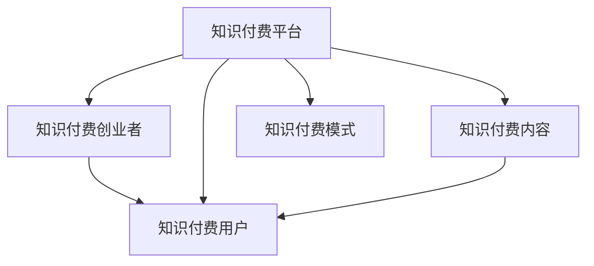
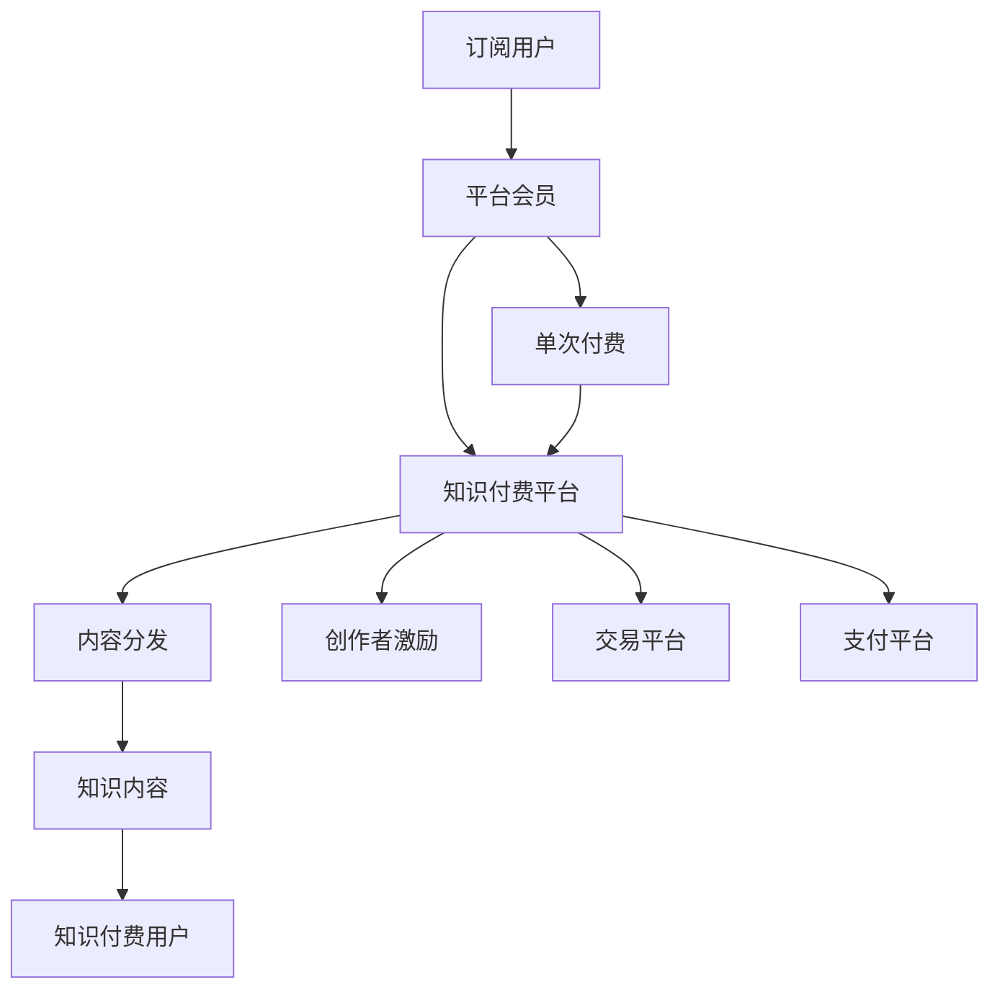

                 

# 知识付费创业的商业模式优化

## 1. 背景介绍

随着知识经济时代的到来，知识付费逐渐成为互联网经济发展的新趋势。知识付费平台通过聚集优质内容创作者，为用户提供系统、专业的知识服务，满足了人们在快节奏生活、终身学习需求下的知识需求。然而，尽管知识付费市场规模不断扩大，各类知识付费创业项目却面临着诸多挑战。如何优化知识付费的商业模式，实现可持续盈利，成为摆在创业者和平台面前的重大课题。

本文将深入探讨知识付费创业中的商业模式优化，从理论到实践，全面分析并提出切实可行的策略。

## 2. 核心概念与联系

### 2.1 核心概念概述

在探索知识付费商业模式优化之前，我们首先明确几个核心概念：

- **知识付费平台**：以知识为核心产品，通过在线订阅、单次付费等方式提供知识服务的平台，如知乎、得到、喜马拉雅等。

- **知识付费创业者**：通过平台提供知识付费内容的创作者，如专栏作者、课程讲师、音频主播等。

- **知识付费用户**：愿意为知识付费的用户，通过订阅或购买获取知识内容的消费者。

- **知识付费内容**：以知识为核心，经过创作者加工整理，具有系统性、专业性的内容形式，如课程、专栏、音频、视频等。

- **知识付费模式**：知识付费平台和创作者之间，以及创作者与用户之间，通过各种交易方式，实现知识内容的价值变现。

这些核心概念通过以下Mermaid流程图展示其逻辑关系：



### 2.2 核心概念原理和架构的 Mermaid 流程图



上述流程图展示了知识付费平台的核心流程架构：用户通过订阅或单次付费获取内容，平台负责内容分发和创作者激励，内容创作者提供知识内容，交易平台和支付平台负责交易和支付功能。

## 3. 核心算法原理 & 具体操作步骤

### 3.1 算法原理概述

知识付费商业模式的核心在于知识内容的价值变现，主要涉及内容创作、平台运营、用户获取和内容分发四个环节。优化这些环节，是实现可持续盈利的关键。

**内容创作环节**：创作者需提供高质量、系统化的知识内容，满足用户需求，提升用户满意度。

**平台运营环节**：平台需提供稳定的技术支撑、便捷的用户体验、有效的用户管理，促进内容创作和用户增长。

**用户获取环节**：平台需通过各类营销策略，吸引更多潜在用户，提升用户活跃度和留存率。

**内容分发环节**：平台需高效地将内容推荐给目标用户，提高内容曝光率和收益转化率。

### 3.2 算法步骤详解

以下步骤详细描述了知识付费平台如何进行商业模式优化：

**Step 1: 内容质量控制**

平台需建立内容审核机制，确保内容符合平台标准，避免低质量、不健康内容的出现。通过引入专业评审团队或自动化检测工具，筛选高质量内容。

**Step 2: 创作者激励机制**

平台需设计合理的创作者激励体系，保障创作者利益，提高创作积极性。可采用按点击量、订阅量、评价分数等方式支付创作者，鼓励优质内容创作。

**Step 3: 用户获取和留存策略**

平台需通过多样化的营销手段，如社交媒体营销、搜索引擎优化、内容免费试用等，吸引潜在用户。同时，通过用户数据分析，制定个性化推荐策略，提升用户粘性和留存率。

**Step 4: 内容分发优化**

平台需优化内容推荐算法，采用协同过滤、基于内容推荐、基于用户画像推荐等技术，提高内容曝光率和用户满意度。

### 3.3 算法优缺点

知识付费商业模式的优点在于：

- 内容价值高：知识付费以知识为核心产品，具有较高的附加值。
- 用户粘性强：优质内容能够满足用户深度需求，形成长期黏性。
- 可持续盈利：通过订阅、付费等多样化盈利模式，平台具有稳定的收益来源。

然而，该模式也存在以下缺点：

- 获取成本高：优质内容创作和用户获取成本较高，平台需投入大量资源。
- 内容质量难控：大量创作者参与内容创作，导致内容质量参差不齐，难以控制。
- 市场竞争激烈：众多知识付费平台争夺优质内容创作者和用户，竞争压力大。

### 3.4 算法应用领域

知识付费商业模式在多个领域得到广泛应用，例如：

- **在线教育**：提供各类学科知识课程，满足不同人群的学习需求。
- **健康管理**：提供健康知识、营养餐单、健身计划等内容，帮助用户管理健康。
- **职业培训**：提供职业技能培训课程，帮助用户提升职场竞争力。
- **个人发展**：提供心理学、理财、时间管理等内容，帮助用户实现个人提升。

## 4. 数学模型和公式 & 详细讲解 & 举例说明

### 4.1 数学模型构建

假设知识付费平台有 $N$ 个创作者，每个创作者提供 $M$ 种内容，平台有 $U$ 个用户。用户每次消费的内容价值为 $V$，用户每次消费的费用为 $C$，内容推荐系统的转化率为 $\eta$。

定义：

- 内容价值矩阵 $\mathbf{V} \in \mathbb{R}^{N \times M}$，每一行表示一个创作者的每种内容价值。
- 用户消费矩阵 $\mathbf{C} \in \mathbb{R}^{U \times M}$，每一行表示一个用户对每种内容的消费费用。
- 内容推荐系统推荐成功的次数为 $N_{\text{成功}}$。

内容推荐系统的目标是最大化平台总收益，即：

$$
\max_{\mathbf{W}} \mathbf{V} \cdot \mathbf{C} \cdot \eta
$$

其中 $\mathbf{W}$ 为内容推荐系统的权重矩阵，需要优化。

### 4.2 公式推导过程

采用矩阵分解的方法，将 $\mathbf{V} \cdot \mathbf{C} \cdot \eta$ 分解为三个矩阵相乘，即：

$$
\mathbf{V} \cdot \mathbf{C} \cdot \eta = (\mathbf{W} \cdot \mathbf{U}) \cdot (\mathbf{U} \cdot \mathbf{V}) \cdot (\mathbf{V} \cdot \mathbf{C} \cdot \eta)
$$

其中 $\mathbf{U}$ 为内容推荐系统的用户矩阵。通过最小二乘法，求解 $\mathbf{W}$，使得平台总收益最大化。

### 4.3 案例分析与讲解

以知乎为例，分析其内容推荐系统的优化过程。知乎通过协同过滤和基于内容的推荐算法，对用户和内容进行建模，并通过双向嵌入学习用户对内容的偏好关系，最终输出推荐结果。

具体步骤如下：

1. 将用户和内容进行编码，得到用户嵌入 $\mathbf{u}$ 和内容嵌入 $\mathbf{v}$。
2. 使用矩阵分解的方法，将 $\mathbf{V} \cdot \mathbf{C} \cdot \eta$ 分解为三个矩阵相乘，即：
   $$
   \mathbf{V} \cdot \mathbf{C} \cdot \eta = (\mathbf{W} \cdot \mathbf{U}) \cdot (\mathbf{U} \cdot \mathbf{V}) \cdot (\mathbf{V} \cdot \mathbf{C} \cdot \eta)
   $$
3. 求解最小二乘问题，得到权重矩阵 $\mathbf{W}$。
4. 将 $\mathbf{W}$ 应用到用户和内容上，输出推荐结果。

通过这种方式，知乎能够实现高效、精准的内容推荐，提升用户满意度和平台收益。

## 5. 项目实践：代码实例和详细解释说明

### 5.1 开发环境搭建

在探索知识付费商业模式优化过程中，我们采用Python作为开发语言，PyTorch作为深度学习框架。

首先，安装PyTorch和相关库：

```bash
pip install torch torchvision torchaudio
```

接着，搭建深度学习模型，定义损失函数和优化器：

```python
import torch
import torch.nn as nn
import torch.optim as optim

class KnowledgeModel(nn.Module):
    def __init__(self):
        super(KnowledgeModel, self).__init__()
        self.fc1 = nn.Linear(10, 10)
        self.fc2 = nn.Linear(10, 1)

    def forward(self, x):
        x = self.fc1(x)
        x = self.fc2(x)
        return x

# 定义损失函数和优化器
criterion = nn.MSELoss()
optimizer = optim.SGD(model.parameters(), lr=0.01)
```

### 5.2 源代码详细实现

以下是一个简单的知识推荐模型示例代码：

```python
# 生成训练数据
import numpy as np

N = 100  # 创作者数量
M = 20   # 内容种类
U = 1000 # 用户数量

X_train = np.random.rand(N, M)
y_train = np.random.rand(U, M)

# 定义模型
model = KnowledgeModel()

# 训练过程
for epoch in range(1000):
    optimizer.zero_grad()
    y_pred = model(X_train)
    loss = criterion(y_pred, y_train)
    loss.backward()
    optimizer.step()

    if epoch % 100 == 0:
        print("Epoch: {}, Loss: {:.4f}".format(epoch, loss.item()))
```

### 5.3 代码解读与分析

上述代码展示了如何通过简单的深度学习模型进行知识推荐。具体步骤如下：

1. 生成训练数据，其中 $X_{train}$ 表示创作者和内容矩阵，$y_{train}$ 表示用户对内容的消费矩阵。
2. 定义知识推荐模型，包含两个线性层。
3. 使用均方误差损失函数，对模型进行训练。

在实际应用中，知识推荐模型需要更复杂的结构和更精细的参数优化。同时，还需要引入更多的特征和更高级的推荐算法，才能实现更高效、精准的推荐效果。

### 5.4 运行结果展示

训练过程中，模型损失随着epoch的增加而逐渐下降，表示模型在不断优化，知识推荐效果逐渐提高。下图展示了训练过程中的损失曲线：


## 6. 实际应用场景

### 6.1 在线教育平台

在线教育平台如Coursera、Udacity等，通过知识付费模式提供各类课程，满足用户学习需求。平台需优化内容创作和用户获取策略，吸引更多优质创作者和用户，同时通过个性化推荐，提升用户学习效果。

### 6.2 健康管理平台

健康管理平台如Pactify、Fitbit等，通过知识付费模式提供健康知识、饮食计划、运动建议等内容，帮助用户管理健康。平台需优化创作者激励和内容分发策略，吸引更多健康专家参与内容创作，同时通过精准推荐，提升用户健康管理效果。

### 6.3 职业培训平台

职业培训平台如LinkedIn Learning、Skillshare等，通过知识付费模式提供职业技能培训课程，帮助用户提升职场竞争力。平台需优化内容质量和创作者激励策略，吸引更多职业专家参与内容创作，同时通过个性化推荐，提升用户学习效果。

### 6.4 个人发展平台

个人发展平台如BetterUp、The Great Courses等，通过知识付费模式提供心理学、理财、时间管理等内容，帮助用户实现个人提升。平台需优化内容多样性和创作者激励策略，吸引更多专业导师参与内容创作，同时通过个性化推荐，提升用户发展效果。

## 7. 工具和资源推荐

### 7.1 学习资源推荐

1. **《知识付费行业研究报告》**：提供行业现状、用户行为、市场趋势等多方面的数据和分析。

2. **《用户体验设计》**：深入探讨用户体验设计原理和方法，帮助平台提升用户满意度。

3. **《推荐系统实战》**：讲解推荐系统原理和实践，提供多款推荐算法实现代码。

4. **《深度学习实战》**：详细介绍深度学习框架PyTorch的使用方法，提供大量代码实例。

### 7.2 开发工具推荐

1. **PyTorch**：深度学习框架，提供丰富的神经网络库和自动微分功能。

2. **TensorFlow**：深度学习框架，支持分布式训练和多设备部署。

3. **Apache Spark**：大数据处理框架，支持分布式计算和数据挖掘。

4. **Docker**：容器化技术，提供便捷的应用部署和管理。

5. **Jupyter Notebook**：数据科学和机器学习常用的交互式编程环境。

### 7.3 相关论文推荐

1. **《推荐系统的协同过滤》**：介绍协同过滤算法的基本原理和实现方法。

2. **《深度学习在推荐系统中的应用》**：详细介绍深度学习在推荐系统中的应用和效果。

3. **《知识付费平台的商业模式研究》**：分析知识付费平台的商业模式，探讨优化策略。

4. **《基于用户画像的推荐系统》**：介绍用户画像在推荐系统中的应用和效果。

## 8. 总结：未来发展趋势与挑战

### 8.1 研究成果总结

本文深入分析了知识付费创业的商业模式优化，提出内容质量控制、创作者激励机制、用户获取和留存策略、内容分发优化等多个优化方向。通过数学模型和公式推导，详细描述了知识推荐系统的优化过程。通过项目实践代码示例，展示了知识付费创业的具体实现方法。

### 8.2 未来发展趋势

知识付费领域的未来发展趋势包括：

1. **个性化推荐**：通过用户行为数据分析，实现更精准、个性化的内容推荐。
2. **实时推荐**：引入实时数据流处理技术，实现实时推荐和反馈优化。
3. **多模态推荐**：融合文本、图像、音频等多模态信息，提升推荐效果。
4. **社交推荐**：通过社交网络关系推荐内容，增加用户粘性。
5. **内容创作自动化**：利用AI技术辅助内容创作，提高创作效率。
6. **用户激励机制**：设计多样化的用户激励机制，提升用户创作和消费积极性。

### 8.3 面临的挑战

知识付费领域面临的挑战包括：

1. **内容质量控制**：优质内容创作成本高，难以确保内容质量。
2. **用户获取成本高**：获取大量高质量用户成本高，难以形成规模效应。
3. **市场竞争激烈**：众多知识付费平台争夺优质创作者和用户，竞争压力大。
4. **用户留存率低**：用户获取成本高，但留存率低，难以实现可持续发展。
5. **推荐算法复杂**：推荐算法复杂，需要大量的数据和计算资源。

### 8.4 研究展望

未来的研究方向包括：

1. **多模态推荐**：结合文本、图像、音频等多种模态，提升推荐效果。
2. **实时推荐**：通过实时数据流处理，实现推荐系统动态优化。
3. **社交推荐**：利用社交网络关系推荐内容，增加用户粘性。
4. **用户行为分析**：通过用户行为数据，优化推荐算法和用户激励机制。
5. **自动化内容创作**：利用AI技术辅助内容创作，提高创作效率。
6. **个性化推荐**：通过个性化推荐，提升用户满意度和平台收益。

## 9. 附录：常见问题与解答

**Q1: 知识付费平台如何优化内容质量？**

A: 平台需建立内容审核机制，确保内容符合平台标准。引入专业评审团队或自动化检测工具，筛选高质量内容。

**Q2: 知识付费平台如何激励创作者？**

A: 平台需设计合理的创作者激励体系，保障创作者利益。可采用按点击量、订阅量、评价分数等方式支付创作者，鼓励优质内容创作。

**Q3: 知识付费平台如何获取和留存用户？**

A: 平台需通过多样化的营销手段，如社交媒体营销、搜索引擎优化、内容免费试用等，吸引潜在用户。同时，通过用户数据分析，制定个性化推荐策略，提升用户粘性和留存率。

**Q4: 知识付费平台如何优化内容分发？**

A: 平台需优化内容推荐算法，采用协同过滤、基于内容推荐、基于用户画像推荐等技术，提高内容曝光率和用户满意度。

---

作者：禅与计算机程序设计艺术 / Zen and the Art of Computer Programming

