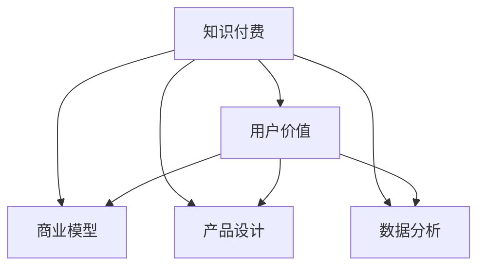

                 

# 知识付费创业的用户价值最大化策略

> 关键词：知识付费, 用户价值, 商业模型, 产品设计, 数据分析

## 1. 背景介绍

### 1.1 问题由来
随着移动互联网的普及和人们知识需求的不断增长，知识付费市场正迎来迅猛发展。根据艾媒咨询数据，2021年我国知识付费市场规模已达331.5亿元，预计到2023年将突破700亿元。然而，在蓬勃的市场背后，也暴露出用户留存低、重复购买率低、变现能力弱等一系列问题。这迫使知识付费创业企业不得不思考如何更好地实现用户价值最大化，构建起可持续发展的商业模式。

### 1.2 问题核心关键点
本文旨在探讨知识付费创业企业如何通过优化商业模型、改进产品设计、加强数据分析等手段，最大化用户价值，打造持久盈利的商业生态。具体问题点包括：

1. **用户需求分析**：深入了解目标用户需求，制定产品路线图。
2. **商业模型设计**：设计可行的盈利模式，实现商业模式可持续。
3. **产品功能实现**：实现核心产品功能，提高用户体验。
4. **用户行为分析**：通过数据分析洞察用户行为，优化产品策略。
5. **收益管理策略**：制定合理的收益管理策略，提升变现能力。

### 1.3 问题研究意义
在知识付费领域，实现用户价值最大化不仅是企业利润增长的关键，更是提升用户体验、构建良好品牌形象的重要途径。通过系统的研究和实践，本研究将为知识付费创业者提供有益的指导，助力其打造出具有竞争力的商业模式。

## 2. 核心概念与联系

### 2.1 核心概念概述

为更好地理解知识付费创业的用户价值最大化策略，本节将介绍几个核心概念及其联系：

- **知识付费（Knowledge Subscription）**：指用户为获取特定知识和信息而支付费用的商业模式。知识付费平台通过内容付费、订阅服务等方式实现盈利。

- **用户价值（User Value）**：指用户从产品或服务中获得的满意度和收益，通常包括使用价值、情感价值和经济价值等。

- **商业模型（Business Model）**：指企业如何创造价值、传递价值和获取价值的方法，包括价值主张、客户关系、收入来源、成本结构等要素。

- **产品设计（Product Design）**：指产品从构思到上市的过程，包括用户研究、需求分析、原型设计、测试优化等环节。

- **数据分析（Data Analysis）**：指使用统计、数据挖掘等技术，从数据中提取信息，洞察用户行为和需求，以指导产品改进和业务决策。

这些核心概念之间的逻辑关系可以通过以下Mermaid流程图来展示：



这个流程图展示的知识付费核心概念及其之间的关系：

1. 知识付费通过向用户提供知识和信息，满足用户需求，获取用户价值。
2. 商业模型定义了企业如何创造和传递用户价值，并从中获取回报。
3. 产品设计用于实现商业模型，并满足用户需求。
4. 数据分析用于洞察用户行为和需求，指导产品设计和商业模型优化。

这些概念共同构成了知识付费创业的用户价值最大化策略框架，使得企业能够更好地实现用户价值最大化。

## 3. 核心算法原理 & 具体操作步骤
### 3.1 算法原理概述

知识付费创业用户价值最大化策略的核心在于通过合理的商业模型、卓越的产品设计和深入的数据分析，最大化用户价值。具体来说，算法原理包括以下几个步骤：

1. **用户需求分析**：通过调查问卷、用户访谈等方式，深入了解用户需求和痛点。
2. **商业模型设计**：根据用户需求，设计可行的盈利模式，包括付费订阅、内容销售、增值服务等。
3. **产品功能实现**：结合用户需求和商业模型，实现核心产品功能，如内容创作、知识分享、互动交流等。
4. **用户行为分析**：使用数据挖掘和机器学习技术，分析用户行为数据，识别用户偏好和流失原因。
5. **收益管理策略**：基于用户行为分析结果，制定合理的收益管理策略，如价格优化、套餐组合、个性化推荐等。

### 3.2 算法步骤详解

**Step 1: 用户需求分析**
- 设计调查问卷和用户访谈，收集用户对内容、功能、价格等方面的需求和意见。
- 分析问卷和访谈结果，提炼用户共性需求和个性化需求。
- 将需求转化为产品路线图，指导后续产品设计和功能开发。

**Step 2: 商业模型设计**
- 根据用户需求，设计盈利模式。例如，可以选择单次购买、月度订阅、年度订阅等。
- 根据不同模式，制定相应的定价策略和收益分配方案。
- 结合市场需求和竞争环境，选择适合的营销渠道和推广方式。

**Step 3: 产品功能实现**
- 根据产品路线图，设计产品原型并进行用户测试。
- 根据用户反馈不断迭代优化产品功能，提高用户满意度。
- 实现核心功能，如内容管理、用户交互、数据分析等。

**Step 4: 用户行为分析**
- 收集和整理用户行为数据，包括登录频率、内容浏览、消费记录等。
- 使用数据挖掘技术，识别用户行为模式和流失原因。
- 应用机器学习算法，预测用户行为和趋势，指导产品改进和运营策略。

**Step 5: 收益管理策略**
- 根据用户行为分析结果，制定价格优化策略，平衡用户需求和商业收益。
- 设计个性化推荐系统，提高用户留存率和重复购买率。
- 制定灵活的订阅套餐，满足不同用户的需求。

### 3.3 算法优缺点

知识付费创业用户价值最大化策略的优点包括：

1. **满足用户需求**：通过深入用户需求分析，确保产品功能符合用户期望。
2. **提升用户体验**：通过优化产品设计和功能实现，提升用户满意度和黏性。
3. **精细化运营**：通过数据分析指导产品改进和运营策略，实现精细化运营。
4. **最大化收益**：通过合理的收益管理策略，提升变现能力和盈利水平。

缺点包括：

1. **数据隐私风险**：用户行为数据的收集和分析可能涉及隐私问题，需要严格的隐私保护措施。
2. **产品开发成本高**：高质量的产品设计和功能实现需要较高的人力和时间投入。
3. **市场竞争激烈**：知识付费领域竞争激烈，新进入者面临较高的市场门槛。
4. **用户流失风险**：用户需求和行为变化快速，需要不断调整策略以应对。

尽管存在这些缺点，但整体而言，用户价值最大化策略仍是知识付费创业企业实现可持续发展的关键路径。

### 3.4 算法应用领域

知识付费创业用户价值最大化策略在知识付费、在线教育、职业培训等多个领域具有广泛的应用前景：

- **知识付费平台**：如喜马拉雅、得到、网易云课堂等，通过优化产品设计、提升用户体验，最大化用户价值，实现持续盈利。
- **在线教育**：如Coursera、edX、Udemy等，通过内容质量、学习体验、社交互动等多方面优化，提升用户粘性和付费意愿。
- **职业培训**：如LinkedIn Learning、Udacity等，通过精准匹配用户需求、提供高质量课程，提高用户满意度和就业竞争力。

## 4. 数学模型和公式 & 详细讲解 & 举例说明
### 4.1 数学模型构建

为了更好地指导知识付费创业用户价值最大化策略的实践，本文将使用数学语言对其进行更严格的描述。

设知识付费平台的总用户数为 $U$，付费用户数为 $P$，付费用户的平均消费金额为 $A$。则平台的总收益 $R$ 可以表示为：

$$
R = P \times A
$$

设平台的总运营成本为 $C$，包括内容创作成本、技术开发成本、市场营销成本等。则平台的净利润 $P$ 可以表示为：

$$
P = R - C
$$

### 4.2 公式推导过程

以下我们将推导用户增长模型和用户流失模型，用于指导收益管理和运营策略。

**用户增长模型**：

设用户增长率为 $g$，平台初始用户数为 $U_0$，则 $t$ 时刻的用户数为：

$$
U(t) = U_0 \times (1+g)^t
$$

用户增长模型描述了用户数量随时间变化的规律，可用于预测未来用户规模和增长速度。

**用户流失模型**：

设用户流失率为 $l$，平台初始用户数为 $U_0$，则 $t$ 时刻的付费用户数为：

$$
P(t) = P_0 \times (1-l)^t
$$

其中 $P_0$ 为初始付费用户数。用户流失模型描述了用户流失随时间变化的规律，可用于预测未来付费用户数和流失速度。

### 4.3 案例分析与讲解

假设某知识付费平台初始用户数为10万，用户增长率为20%，初始付费用户数为5000，用户流失率为5%，每次新用户的平均消费金额为100元。根据上述模型，计算平台在不同时间点的收益和成本：

- 1个月后，用户数 $U(1)=10 \times (1+0.2)^1 = 12$ 万，付费用户数 $P(1)=5000 \times (1-0.05)^1 = 4750$，总收益 $R=4750 \times 100=475000$ 元，总成本 $C=100000+50000=150000$ 元，净利润 $P=475000-150000=325000$ 元。
- 3个月后，用户数 $U(3)=12 \times (1+0.2)^3 \approx 15.84$ 万，付费用户数 $P(3)=4750 \times (1-0.05)^3 \approx 4400$，总收益 $R=4400 \times 100 \approx 440000$ 元，总成本 $C=150000+100000=250000$ 元，净利润 $P=440000-250000=190000$ 元。

通过以上计算，可以看出平台用户增长和收益的变化规律，为制定科学的用户价值最大化策略提供依据。

## 5. 项目实践：代码实例和详细解释说明
### 5.1 开发环境搭建

在进行知识付费创业用户价值最大化策略的实践时，首先需要准备开发环境。以下是使用Python进行Django开发的环境配置流程：

1. 安装Anaconda：从官网下载并安装Anaconda，用于创建独立的Python环境。

2. 创建并激活虚拟环境：
```bash
conda create -n django-env python=3.8 
conda activate django-env
```

3. 安装Django：
```bash
pip install django
```

4. 安装所需库：
```bash
pip install django-rest-framework psycopg2-binary gunicorn
```

5. 创建和运行数据库：
```bash
psql -U postgres -d django_db
```

完成上述步骤后，即可在`django-env`环境中开始知识付费创业用户价值最大化策略的实践。

### 5.2 源代码详细实现

下面我们以知识付费平台的用户增长和流失预测为例，给出使用Django开发的Python代码实现。

首先，定义用户增长和流失预测的模型类：

```python
from django.db import models

class UserGrowth(models.Model):
    user_id = models.IntegerField(primary_key=True)
    growth_rate = models.FloatField()

    def __str__(self):
        return f"User ID: {self.user_id}, Growth Rate: {self.growth_rate}"

class UserChurn(models.Model):
    user_id = models.IntegerField(primary_key=True)
    churn_rate = models.FloatField()

    def __str__(self):
        return f"User ID: {self.user_id}, Churn Rate: {self.churn_rate}"
```

然后，定义模型视图和视图函数：

```python
from django.shortcuts import render
from .models import UserGrowth, UserChurn

def user_growth_view(request):
    growth_rate = 0.2
    user_ids = [1, 2, 3, 4, 5]
    growth_data = []
    for user_id in user_ids:
        growth = UserGrowth.objects.filter(user_id=user_id).first() or UserGrowth(user_id=user_id, growth_rate=growth_rate)
        growth_data.append(growth.growth_rate)
    return render(request, 'user_growth.html', {'growth_rate': growth_rate, 'growth_data': growth_data})

def user_churn_view(request):
    churn_rate = 0.05
    initial_users = 10000
    initial_churned = 1000
    churn_data = []
    for user_id in range(1, initial_users+1):
        churn = UserChurn.objects.filter(user_id=user_id).first() or UserChurn(user_id=user_id, churn_rate=churn_rate)
        if user_id in initial_churned:
            churned = True
        else:
            churned = churn.churn_rate < 1
        churn_data.append(churned)
    return render(request, 'user_churn.html', {'churn_rate': churn_rate, 'churn_data': churn_data})
```

最后，启动Django项目并运行相关视图：

```bash
python manage.py runserver
```

在浏览器中访问`http://127.0.0.1:8000/user_growth/`和`http://127.0.0.1:8000/user_churn/`，查看用户增长和流失的预测结果。

### 5.3 代码解读与分析

让我们再详细解读一下关键代码的实现细节：

**UserGrowth和UserChurn模型**：
- `UserGrowth`模型用于存储用户增长率，包含`user_id`和`growth_rate`两个字段。
- `UserChurn`模型用于存储用户流失率，包含`user_id`和`churn_rate`两个字段。

**user_growth_view和user_churn_view视图**：
- `user_growth_view`视图用于预测用户增长数据，使用`UserGrowth`模型和增长率。
- `user_churn_view`视图用于预测用户流失数据，使用`UserChurn`模型和流失率。

**用户增长和流失预测**：
- 通过收集和存储历史用户增长和流失数据，使用模型预测未来数据。
- 在Django中，通过定义模型和视图，将预测数据呈现给前端界面。

可以看到，通过Django实现的代码，我们能够方便地进行用户增长和流失预测，为知识付费平台的运营决策提供数据支持。

## 6. 实际应用场景
### 6.1 智能推荐系统

知识付费平台可以利用智能推荐系统，根据用户行为数据，向其推荐相关内容，提升用户粘性和付费意愿。

**推荐模型**：
- 使用协同过滤、内容推荐、混合推荐等算法，构建推荐系统。
- 根据用户历史浏览记录、评分数据、个性化标签等特征，预测用户可能感兴趣的内容。
- 将推荐结果通过UI展示给用户，吸引用户继续使用平台。

**推荐策略**：
- 动态调整推荐算法参数，优化推荐效果。
- 引入互动评分和反馈机制，实时更新推荐模型。
- 设计A/B测试，验证推荐效果，不断迭代优化。

### 6.2 用户留存和流失管理

知识付费平台需要对用户留存和流失进行科学管理，以提升用户价值。

**用户留存策略**：
- 定期推送优质内容，增强用户黏性。
- 提供社区互动功能，如评论、讨论等，增强用户参与感。
- 设计会员体系，提供专属福利和权益，提高用户忠诚度。

**用户流失预警**：
- 监测用户行为变化，如登录频率下降、互动减少等，预警潜在流失用户。
- 分析流失原因，如内容质量、价格问题、用户体验等，及时改进。
- 设计挽留活动，如折扣、赠品等，挽回流失用户。

### 6.3 内容创作与分发

知识付费平台的内容创作与分发是其核心竞争力之一。

**内容创作平台**：
- 提供内容创作工具，如文本编辑器、音频录制工具等，便于用户创作内容。
- 设计内容审核机制，确保内容质量和合规性。
- 引入用户评价和反馈机制，提升内容质量和用户体验。

**内容分发策略**：
- 优化内容分发算法，确保优质内容被用户发现。
- 利用社交网络，分享优质内容，提升内容传播效果。
- 引入话题标签和分类机制，让用户方便浏览和搜索内容。

### 6.4 未来应用展望

随着知识付费市场的发展和技术的进步，知识付费创业用户价值最大化策略将呈现更多应用场景：

- **跨平台运营**：知识付费平台可以拓展到更多平台，如移动应用、社交媒体、智能音箱等，为用户提供更便捷的体验。
- **数据驱动决策**：利用大数据和人工智能技术，对用户行为和市场趋势进行深入分析，制定科学决策。
- **个性化服务**：通过个性化推荐、智能客服等技术，提升用户满意度和平台粘性。
- **新业务拓展**：探索知识付费与教育培训、职业发展、娱乐等领域的融合，拓展业务范围。

总之，知识付费创业用户价值最大化策略是一个系统性的工程，需要从产品设计、运营管理、数据驱动等多个方面协同发力，才能实现用户价值的最大化。

## 7. 工具和资源推荐
### 7.1 学习资源推荐

为了帮助知识付费创业者系统掌握用户价值最大化策略的理论基础和实践技巧，这里推荐一些优质的学习资源：

1. **《用户价值最大化：数据分析与业务策略》（《User Value Maximization: Data Analytics and Business Strategies》）**：这是一本系统介绍用户价值最大化策略的书籍，涵盖用户需求分析、产品设计、数据分析、商业模型等多个方面的内容。

2. **《知识付费与用户行为分析》（《Knowledge Subscription and User Behavior Analysis》）**：这是一篇介绍知识付费领域用户行为分析的综述性论文，对知识付费平台的运营和优化提供了有价值的参考。

3. **《知识付费平台运营指南》（《Knowledge Subscription Platform Operation Guide》）**：这是一本实用的运营指南，详细介绍了知识付费平台的搭建、运营和优化策略，适合创业者和运营管理者阅读。

4. **Coursera《用户行为分析》课程**：由斯坦福大学教授授课，深入浅出地讲解用户行为分析的方法和应用。

5. **Udacity《商业分析》课程**：由知名商业分析师授课，涵盖商业模型设计、用户增长管理等多个方面，适合创业者系统学习。

通过这些学习资源，相信知识付费创业者能够系统掌握用户价值最大化策略的理论基础和实践技巧，为平台的成功运营提供有力支持。

### 7.2 开发工具推荐

高效的开发离不开优秀的工具支持。以下是几款用于知识付费创业用户价值最大化策略开发的常用工具：

1. **Django**：一个流行的Python Web框架，适合快速开发和维护复杂的Web应用。

2. **Flask**：一个轻量级的Python Web框架，适合小规模、高灵活性的应用。

3. **SQLAlchemy**：一个Python SQL工具包，提供ORM、SQL表达式、数据迁移等功能。

4. **Pandas**：一个强大的Python数据分析库，支持数据清洗、转换、可视化等操作。

5. **NumPy**：一个Python数值计算库，提供高效的数值计算和矩阵运算功能。

6. **TensorFlow**：一个流行的深度学习框架，支持构建和训练各种深度学习模型。

7. **PyTorch**：另一个流行的深度学习框架，提供灵活的动态图计算和高效的模型训练功能。

8. **Matplotlib**：一个Python数据可视化库，支持绘制各种类型的图表和可视化效果。

合理利用这些工具，可以显著提升知识付费创业用户价值最大化策略的开发效率，加快创新迭代的步伐。

### 7.3 相关论文推荐

知识付费创业用户价值最大化策略的研究源于学界的持续研究。以下是几篇奠基性的相关论文，推荐阅读：

1. **《知识付费平台的用户价值分析与优化》（《User Value Analysis and Optimization in Knowledge Subscription Platforms》）**：分析知识付费平台的用户价值来源，提出优化策略。

2. **《知识付费平台的运营策略与用户行为分析》（《Operation Strategies and User Behavior Analysis of Knowledge Subscription Platforms》）**：介绍知识付费平台的运营策略，提出用户行为分析方法。

3. **《知识付费平台的内容推荐算法研究》（《Research on Content Recommendation Algorithm in Knowledge Subscription Platforms》）**：分析知识付费平台的内容推荐算法，提出优化建议。

4. **《知识付费平台的收益管理策略》（《Revenue Management Strategies in Knowledge Subscription Platforms》）**：介绍知识付费平台的收益管理策略，提出优化方案。

5. **《知识付费平台的用户留存管理》（《User Retention Management in Knowledge Subscription Platforms》）**：分析知识付费平台的用户留存管理，提出改进建议。

这些论文代表了大数据和人工智能在知识付费领域的研究方向，为知识付费创业者的实践提供有益的指导。

## 8. 总结：未来发展趋势与挑战
### 8.1 总结

本文对知识付费创业用户价值最大化策略进行了全面系统的介绍。首先阐述了知识付费领域的发展背景和用户价值最大化的重要性，明确了用户价值最大化策略在提升用户体验、构建盈利模式方面的独特价值。其次，从原理到实践，详细讲解了用户需求分析、商业模型设计、产品功能实现、用户行为分析、收益管理策略等关键步骤，给出了知识付费创业用户价值最大化策略的完整代码实例。同时，本文还广泛探讨了智能推荐、用户留存和流失管理、内容创作与分发等多个实际应用场景，展示了知识付费创业用户价值最大化策略的广泛应用前景。此外，本文精选了知识付费创业用户价值最大化策略的学习资源，力求为知识付费创业者提供全方位的技术指引。

通过本文的系统梳理，可以看到，知识付费创业用户价值最大化策略是一个系统性的工程，需要从用户需求分析、商业模型设计、产品功能实现、用户行为分析、收益管理策略等多个方面协同发力，才能实现用户价值的最大化。知识付费平台只有不断优化这些关键环节，才能在激烈的市场竞争中脱颖而出，打造出具有竞争力的商业模式。

### 8.2 未来发展趋势

展望未来，知识付费创业用户价值最大化策略将呈现以下几个发展趋势：

1. **数据驱动决策**：随着大数据和人工智能技术的发展，知识付费平台将更加依赖数据分析指导决策，实现精细化运营和科学管理。
2. **个性化服务**：通过个性化推荐、智能客服等技术，提升用户体验和平台粘性，增强用户价值。
3. **跨平台运营**：拓展到更多平台，提供更便捷的用户体验，扩大用户基础。
4. **新业务拓展**：探索知识付费与教育培训、职业发展、娱乐等领域的融合，拓展业务范围。
5. **人工智能应用**：引入人工智能技术，提升内容推荐、用户行为分析等能力，提升平台竞争力。

以上趋势凸显了知识付费创业用户价值最大化策略的广阔前景。这些方向的探索发展，必将进一步提升知识付费平台的性能和用户价值，为知识付费创业者带来新的发展机遇。

### 8.3 面临的挑战

尽管知识付费创业用户价值最大化策略已经取得了显著成效，但在实现用户价值最大化的过程中，仍面临诸多挑战：

1. **市场竞争激烈**：知识付费领域竞争激烈，新进入者面临较高的市场门槛。如何通过差异化策略和创新技术突破竞争瓶颈，是知识付费创业者需要解决的难题。
2. **用户需求多变**：用户需求和行为变化快速，如何及时调整策略以应对，是知识付费创业者需要不断探索的方向。
3. **内容质量保证**：高质量的内容是知识付费平台的核心竞争力，如何保证内容质量，吸引和留住用户，是知识付费创业者需要持续投入的领域。
4. **用户体验提升**：提升用户体验，增强用户黏性，是知识付费平台提升用户价值的关键。如何通过技术手段和运营策略提升用户体验，是知识付费创业者需要不断优化的问题。
5. **数据隐私和安全**：用户行为数据的收集和分析涉及隐私问题，如何确保数据安全和隐私保护，是知识付费创业者需要严格遵守的法规要求。

正视这些挑战，积极应对并寻求突破，将是大数据和人工智能在知识付费领域实现可持续发展的关键。相信通过学界和产业界的共同努力，这些挑战终将一一被克服，知识付费创业用户价值最大化策略必将在构建人机协同的智能时代中扮演越来越重要的角色。

### 8.4 研究展望

面向未来，知识付费创业用户价值最大化策略的研究需要在以下几个方面寻求新的突破：

1. **个性化推荐算法**：开发更加高效和精准的个性化推荐算法，提升推荐效果和用户满意度。
2. **用户行为分析技术**：引入先进的数据挖掘和机器学习技术，深入分析用户行为和需求，指导产品改进和运营策略。
3. **内容创作支持**：设计更加便捷和高效的内容创作工具和平台，降低内容创作门槛，提升内容质量。
4. **用户体验优化**：引入界面设计、交互设计等技术，提升用户交互体验，增强用户黏性。
5. **数据分析与可视化**：开发更加便捷和高效的数据分析和可视化工具，支持知识付费创业者的决策支持。

这些研究方向的探索，必将引领知识付费创业用户价值最大化策略迈向更高的台阶，为知识付费创业者带来新的技术突破和商业机遇。只有勇于创新、敢于突破，才能不断拓展知识付费平台的用户价值边界，为构建人机协同的智能时代提供有力支撑。

## 9. 附录：常见问题与解答

**Q1：知识付费平台的商业模式有哪些？**

A: 知识付费平台的商业模式主要包括：
1. **付费订阅**：用户按月或按年支付订阅费用，获取平台所有内容。
2. **单次购买**：用户按需购买特定内容，获取一次使用权。
3. **课程销售**：通过销售课程，获取一次性收益。
4. **增值服务**：提供高级会员、专家答疑等增值服务，获取额外收益。

**Q2：如何提高知识付费平台的用户粘性？**

A: 提高知识付费平台的用户粘性，需要从以下几个方面进行优化：
1. **优质内容**：提供高质量、高价值的内容，满足用户需求。
2. **个性化推荐**：根据用户兴趣和行为，提供个性化内容推荐，提升用户体验。
3. **社区互动**：建立用户社区，促进用户交流和互动，增强用户参与感。
4. **用户激励**：设计会员体系、积分体系等，激励用户积极使用平台。
5. **持续改进**：定期收集用户反馈，不断优化内容和功能，提升用户满意度。

**Q3：知识付费平台的运营难点有哪些？**

A: 知识付费平台的运营难点主要包括：
1. **内容质量控制**：保证内容高质量和合规性，避免劣质内容和违规内容。
2. **用户需求把握**：及时了解用户需求变化，调整内容策略和推荐算法。
3. **用户留存管理**：监测用户行为变化，及时预警和干预，挽回流失用户。
4. **收益管理**：制定合理的定价策略和套餐组合，提升变现能力。
5. **市场竞争**：面对激烈的市场竞争，制定差异化策略和创新技术，突破竞争瓶颈。

**Q4：如何提升知识付费平台的内容质量？**

A: 提升知识付费平台的内容质量，需要从以下几个方面进行优化：
1. **内容创作平台**：提供便捷和高效的内容创作工具，降低内容创作门槛。
2. **内容审核机制**：建立严格的内容审核机制，确保内容质量和合规性。
3. **用户评价机制**：引入用户评价和反馈机制，提升内容质量和用户体验。
4. **内容迭代优化**：定期收集用户反馈，不断优化内容策略和推荐算法，提升内容质量。
5. **专业内容制作**：引入专业内容制作团队，提升内容的专业性和权威性。

**Q5：知识付费平台的收益管理策略有哪些？**

A: 知识付费平台的收益管理策略主要包括：
1. **动态定价策略**：根据市场需求和用户行为，动态调整定价策略，提升收益。
2. **套餐组合设计**：设计多样化的套餐组合，满足不同用户需求，提升变现能力。
3. **个性化推荐**：根据用户兴趣和行为，提供个性化推荐，提升用户留存率和重复购买率。
4. **用户行为分析**：通过数据分析，识别高价值用户和潜在流失用户，制定针对性的运营策略。
5. **营销推广**：通过多渠道营销推广，吸引新用户，提升平台流量和用户数量。

这些问题的解答，为知识付费创业者提供了宝贵的指导和建议，帮助其优化运营策略，提升用户价值最大化。

---

作者：禅与计算机程序设计艺术 / Zen and the Art of Computer Programming

