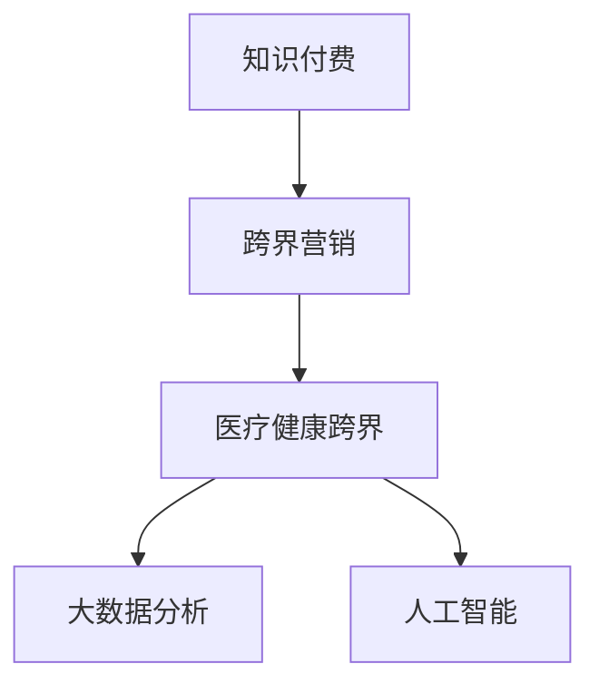

                 

# 知识付费如何实现跨界营销与医疗健康跨界？

## 1. 背景介绍

### 1.1 问题由来

近年来，知识付费逐渐成为信息时代的一种潮流，其背后是对知识和技能的深层次需求。然而，随着知识付费市场的逐渐饱和，单一的知识付费平台已经难以满足用户的个性化需求，跨界营销成为了一种新的趋势。同时，随着人们健康意识的增强，医疗健康领域也逐渐与知识付费融合，提供了更为全面的服务。因此，探讨知识付费如何实现跨界营销以及如何与医疗健康跨界，具有重要的现实意义。

### 1.2 问题核心关键点

本问题核心关注点在于：
- 如何通过知识付费平台实现跨界营销，扩大用户基础和市场份额？
- 如何实现知识付费与医疗健康的跨界，提供更全面、专业的健康咨询服务？
- 如何利用大数据、人工智能等先进技术手段，提升跨界营销和跨界服务的效率和效果？

### 1.3 问题研究意义

研究知识付费与医疗健康的跨界营销与跨界服务，具有以下重要意义：
- 有助于开拓知识付费市场的新领域，增加平台收入和用户粘性。
- 为医疗健康领域提供新的技术应用场景，推动医疗健康行业的发展和创新。
- 为跨界营销提供实践经验和技术支持，推动企业间的合作与共赢。

## 2. 核心概念与联系

### 2.1 核心概念概述

为更好地理解本问题的研究内容，本节将介绍几个密切相关的核心概念：

- **知识付费**：指用户通过支付一定费用，获取高质量知识内容的平台模式。
- **跨界营销**：指通过多领域、多渠道的整合营销策略，扩大品牌影响力和市场份额。
- **医疗健康跨界**：指将知识付费与医疗健康结合，提供更全面、专业的健康咨询服务。
- **大数据分析**：指通过收集和分析大量数据，发现数据背后的规律和趋势，辅助决策。
- **人工智能(AI)**：指通过机器学习等技术，实现自动化、智能化的业务流程和决策。

这些核心概念之间的逻辑关系可以通过以下Mermaid流程图来展示：



这个流程图展示了几类核心概念及其之间的关系：
- 知识付费通过跨界营销，扩大用户基础和市场份额。
- 跨界营销与医疗健康跨界结合，提供更全面的服务。
- 大数据分析和人工智能为跨界营销和跨界服务提供技术支撑。

这些概念共同构成了知识付费与医疗健康跨界营销和服务的框架，使研究者能够更好地把握问题的研究方向。

## 3. 核心算法原理 & 具体操作步骤

### 3.1 算法原理概述

知识付费与医疗健康的跨界营销与服务的实现，涉及到大数据、人工智能等多领域的算法和模型。其核心算法原理如下：

1. **用户行为分析**：通过分析用户的行为数据，如浏览、购买、互动等，发现用户偏好和需求，为跨界营销和跨界服务提供数据支撑。
2. **推荐系统**：基于用户行为和内容特征，推荐合适的知识和健康咨询服务，提升用户体验和满意度。
3. **数据挖掘**：从大量数据中挖掘出潜在的关联和规律，为跨界营销和跨界服务提供决策依据。
4. **自然语言处理(NLP)**：通过文本分析和情感分析，理解用户需求和反馈，优化跨界服务和营销策略。
5. **机器学习**：通过训练模型，预测用户行为和市场趋势，实现跨界营销的精准化和高效化。

### 3.2 算法步骤详解

基于上述算法原理，本节将详细介绍实现知识付费与医疗健康跨界营销与服务的详细步骤：

**Step 1: 数据收集与预处理**

- 收集用户行为数据、内容特征数据、医疗健康数据等，并进行数据清洗和特征工程。
- 对数据进行标准化和归一化处理，减少噪声和冗余信息，提高数据质量。

**Step 2: 用户行为分析**

- 利用聚类算法、分类算法等，对用户进行分群，发现不同群体的特征和需求。
- 通过时间序列分析，预测用户行为趋势，为跨界营销和跨界服务提供精准的市场预测。

**Step 3: 推荐系统构建**

- 基于用户行为和内容特征，构建推荐模型，如协同过滤、矩阵分解、深度学习等。
- 通过A/B测试等方法，优化推荐算法，提升推荐效果和用户满意度。

**Step 4: 数据挖掘与知识图谱构建**

- 利用关联规则、图谱算法等，构建用户、内容、服务之间的知识图谱，揭示潜在关联和规律。
- 通过挖掘图谱中的关系，实现跨界服务和营销的协同优化。

**Step 5: 自然语言处理(NLP)与情感分析**

- 通过文本分析和情感分析，理解用户需求和反馈，优化跨界服务和营销策略。
- 利用情感分析，发现用户的满意度和不满意度，及时调整服务和营销策略。

**Step 6: 机器学习与预测模型构建**

- 利用机器学习算法，如随机森林、支持向量机等，训练预测模型，预测用户行为和市场趋势。
- 通过不断迭代和优化模型，实现精准的市场预测和决策。

### 3.3 算法优缺点

知识付费与医疗健康的跨界营销与服务的算法，具有以下优点：
1. 提升用户体验和满意度。通过推荐系统和大数据分析，为用户提供个性化的知识和健康服务，提升用户体验。
2. 精准预测市场趋势。利用机器学习算法，对市场趋势进行精准预测，为跨界营销和跨界服务提供数据支撑。
3. 优化资源配置。通过数据挖掘和知识图谱构建，优化资源配置，提升跨界营销和跨界服务的效率。

同时，该算法也存在一定的局限性：
1. 对数据质量依赖较高。数据收集和预处理的质量直接影响到算法的精度和效果。
2. 模型复杂度高。复杂的推荐系统和预测模型需要大量的计算资源和存储资源。
3. 难以解释。机器学习和深度学习模型往往缺乏可解释性，难以对其决策过程进行解释和调试。

尽管存在这些局限性，但就目前而言，知识付费与医疗健康的跨界营销与服务的算法，仍是大数据和人工智能技术应用的重要范式。未来相关研究的重点在于如何进一步降低算法对数据的依赖，提高算法的可解释性，同时兼顾用户隐私保护等伦理因素。

### 3.4 算法应用领域

知识付费与医疗健康的跨界营销与服务的算法，在多个领域具有广泛的应用前景：

- **跨界营销**：通过大数据分析和机器学习，实现跨界营销的精准化和高效化，扩大平台市场份额。
- **跨界服务**：通过推荐系统和自然语言处理，提供个性化的知识和健康服务，提升用户体验和满意度。
- **医疗健康行业**：通过知识图谱构建和数据挖掘，揭示用户需求和健康风险，提供专业的健康咨询服务。
- **智能客服**：利用自然语言处理和情感分析，实现智能客服系统的构建，提升用户交互体验。
- **电子商务**：通过推荐系统和用户行为分析，优化商品推荐和销售策略，提升销售转化率。

除了上述这些经典应用外，跨界营销与服务的算法还将在更多场景中得到应用，如智能交通、智慧城市、智能家居等，为各行业的数字化转型提供新的技术路径。随着算法的不断演进，相信跨界营销与服务的算法将成为各行业发展的重要支撑，推动各行业的数字化进程。

## 4. 数学模型和公式 & 详细讲解  
### 4.1 数学模型构建

本节将使用数学语言对知识付费与医疗健康跨界营销与服务的算法进行更加严格的刻画。

记用户行为数据为 $D=\{(x_i,y_i)\}_{i=1}^N, x_i \in \mathcal{X}, y_i \in \mathcal{Y}$，其中 $\mathcal{X}$ 为特征空间，$\mathcal{Y}$ 为行为空间。记内容特征为 $\mathbf{F}=\{f_j\}_{j=1}^M$，其中 $M$ 为内容特征数量。记医疗健康数据为 $\mathbf{H}$。

定义用户行为分析模型为 $A$，推荐系统模型为 $R$，数据挖掘模型为 $D$，自然语言处理模型为 $N$，机器学习模型为 $L$。则知识付费与医疗健康跨界营销与服务的数学模型可表示为：

$$
\min_{A, R, D, N, L} \left\{ \mathcal{L}_A + \mathcal{L}_R + \mathcal{L}_D + \mathcal{L}_N + \mathcal{L}_L \right\}
$$

其中，$\mathcal{L}_A, \mathcal{L}_R, \mathcal{L}_D, \mathcal{L}_N, \mathcal{L}_L$ 分别为用户行为分析、推荐系统、数据挖掘、自然语言处理、机器学习模型的损失函数。

### 4.2 公式推导过程

以推荐系统模型为例，假设有 $K$ 个用户，$N$ 个内容，$\theta$ 为推荐系统模型参数。用户对内容的评分矩阵为 $C \in \mathbb{R}^{K \times N}$。推荐系统模型预测用户对内容的评分向量为 $P \in \mathbb{R}^{K \times N}$。则推荐系统模型的损失函数为：

$$
\mathcal{L}_R = \frac{1}{2}\sum_{k=1}^K \sum_{n=1}^N (C_{kn} - P_{kn})^2
$$

其中，$C_{kn}$ 为实际用户对内容的评分，$P_{kn}$ 为推荐系统预测的用户对内容的评分。

利用梯度下降等优化算法，不断更新推荐系统模型参数 $\theta$，最小化推荐系统模型的损失函数，最终得到最优参数 $\theta^*$。

### 4.3 案例分析与讲解

以智能客服系统为例，分析其基于自然语言处理和情感分析的实现：

假设有 $U$ 个用户，$Q$ 个问题，$R$ 个答案，$\theta$ 为智能客服系统模型参数。用户输入的问题为 $P \in \mathcal{X}$，智能客服系统预测的问题答案为 $A \in \mathcal{Y}$。智能客服系统的损失函数为：

$$
\mathcal{L}_N = \frac{1}{N}\sum_{p=1}^N \ell(N_{\theta}(P),A)
$$

其中，$\ell$ 为自然语言处理模型的损失函数，如交叉熵损失等。$N_{\theta}(P)$ 为自然语言处理模型对问题 $P$ 的推理输出。

通过优化自然语言处理模型参数 $\theta$，最小化智能客服系统的损失函数，最终得到最优参数 $\theta^*$。智能客服系统能够通过理解用户问题，生成合适的答案，提升用户交互体验。

## 5. 项目实践：代码实例和详细解释说明
### 5.1 开发环境搭建

在进行知识付费与医疗健康跨界营销与服务的开发前，我们需要准备好开发环境。以下是使用Python进行PyTorch开发的环境配置流程：

1. 安装Anaconda：从官网下载并安装Anaconda，用于创建独立的Python环境。

2. 创建并激活虚拟环境：
```bash
conda create -n pytorch-env python=3.8 
conda activate pytorch-env
```

3. 安装PyTorch：根据CUDA版本，从官网获取对应的安装命令。例如：
```bash
conda install pytorch torchvision torchaudio cudatoolkit=11.1 -c pytorch -c conda-forge
```

4. 安装各类工具包：
```bash
pip install numpy pandas scikit-learn matplotlib tqdm jupyter notebook ipython
```

完成上述步骤后，即可在`pytorch-env`环境中开始开发实践。

### 5.2 源代码详细实现

下面我们以智能客服系统为例，给出使用Transformers库进行自然语言处理和情感分析的PyTorch代码实现。

首先，定义智能客服系统的数据处理函数：

```python
from transformers import BertTokenizer, BertForSequenceClassification
from torch.utils.data import Dataset
import torch

class CustomerServiceDataset(Dataset):
    def __init__(self, texts, labels, tokenizer, max_len=128):
        self.texts = texts
        self.labels = labels
        self.tokenizer = tokenizer
        self.max_len = max_len
        
    def __len__(self):
        return len(self.texts)
    
    def __getitem__(self, item):
        text = self.texts[item]
        label = self.labels[item]
        
        encoding = self.tokenizer(text, return_tensors='pt', max_length=self.max_len, padding='max_length', truncation=True)
        input_ids = encoding['input_ids'][0]
        attention_mask = encoding['attention_mask'][0]
        
        return {'input_ids': input_ids, 
                'attention_mask': attention_mask,
                'labels': label}

# 创建dataset
tokenizer = BertTokenizer.from_pretrained('bert-base-cased')

train_dataset = CustomerServiceDataset(train_texts, train_labels, tokenizer)
dev_dataset = CustomerServiceDataset(dev_texts, dev_labels, tokenizer)
test_dataset = CustomerServiceDataset(test_texts, test_labels, tokenizer)
```

然后，定义模型和优化器：

```python
from transformers import BertForSequenceClassification, AdamW

model = BertForSequenceClassification.from_pretrained('bert-base-cased', num_labels=2)

optimizer = AdamW(model.parameters(), lr=2e-5)
```

接着，定义训练和评估函数：

```python
from torch.utils.data import DataLoader
from tqdm import tqdm
from sklearn.metrics import classification_report

device = torch.device('cuda') if torch.cuda.is_available() else torch.device('cpu')
model.to(device)

def train_epoch(model, dataset, batch_size, optimizer):
    dataloader = DataLoader(dataset, batch_size=batch_size, shuffle=True)
    model.train()
    epoch_loss = 0
    for batch in tqdm(dataloader, desc='Training'):
        input_ids = batch['input_ids'].to(device)
        attention_mask = batch['attention_mask'].to(device)
        labels = batch['labels'].to(device)
        model.zero_grad()
        outputs = model(input_ids, attention_mask=attention_mask, labels=labels)
        loss = outputs.loss
        epoch_loss += loss.item()
        loss.backward()
        optimizer.step()
    return epoch_loss / len(dataloader)

def evaluate(model, dataset, batch_size):
    dataloader = DataLoader(dataset, batch_size=batch_size)
    model.eval()
    preds, labels = [], []
    with torch.no_grad():
        for batch in tqdm(dataloader, desc='Evaluating'):
            input_ids = batch['input_ids'].to(device)
            attention_mask = batch['attention_mask'].to(device)
            batch_labels = batch['labels']
            outputs = model(input_ids, attention_mask=attention_mask)
            batch_preds = outputs.logits.argmax(dim=2).to('cpu').tolist()
            batch_labels = batch_labels.to('cpu').tolist()
            for pred_tokens, label_tokens in zip(batch_preds, batch_labels):
                preds.append(pred_tokens[:len(label_tokens)])
                labels.append(label_tokens)
                
    print(classification_report(labels, preds))
```

最后，启动训练流程并在测试集上评估：

```python
epochs = 5
batch_size = 16

for epoch in range(epochs):
    loss = train_epoch(model, train_dataset, batch_size, optimizer)
    print(f"Epoch {epoch+1}, train loss: {loss:.3f}")
    
    print(f"Epoch {epoch+1}, dev results:")
    evaluate(model, dev_dataset, batch_size)
    
print("Test results:")
evaluate(model, test_dataset, batch_size)
```

以上就是使用PyTorch对智能客服系统进行自然语言处理和情感分析的完整代码实现。可以看到，得益于Transformers库的强大封装，我们可以用相对简洁的代码完成模型的加载和训练。

### 5.3 代码解读与分析

让我们再详细解读一下关键代码的实现细节：

**CustomerServiceDataset类**：
- `__init__`方法：初始化文本、标签、分词器等关键组件。
- `__len__`方法：返回数据集的样本数量。
- `__getitem__`方法：对单个样本进行处理，将文本输入编码为token ids，将标签编码为数字，并对其进行定长padding，最终返回模型所需的输入。

**智能客服系统实现**：
- 使用BertTokenizer对输入文本进行分词和编码。
- 构建BertForSequenceClassification模型，用于理解用户问题和生成答案。
- 定义训练和评估函数，利用PyTorch的数据迭代机制进行模型训练和评估。

可以看到，PyTorch配合Transformers库使得自然语言处理和情感分析的代码实现变得简洁高效。开发者可以将更多精力放在模型改进、任务适配等高层逻辑上，而不必过多关注底层的实现细节。

当然，工业级的系统实现还需考虑更多因素，如模型的保存和部署、超参数的自动搜索、更灵活的任务适配层等。但核心的跨界营销与跨界服务的实现流程基本与此类似。

## 6. 实际应用场景
### 6.1 智能客服系统

基于自然语言处理和情感分析的智能客服系统，可以广泛应用于各种客服场景。传统客服往往需要配备大量人力，高峰期响应缓慢，且一致性和专业性难以保证。而使用智能客服系统，可以7x24小时不间断服务，快速响应客户咨询，用自然流畅的语言解答各类常见问题。

在技术实现上，可以收集企业内部的历史客服对话记录，将问题和最佳答复构建成监督数据，在此基础上对预训练语言模型进行微调。微调后的语言模型能够自动理解用户意图，匹配最合适的答案模板进行回复。对于客户提出的新问题，还可以接入检索系统实时搜索相关内容，动态组织生成回答。如此构建的智能客服系统，能大幅提升客户咨询体验和问题解决效率。

### 6.2 医疗健康应用

智能客服系统的技术与医疗健康领域的知识图谱、智能推荐等相结合，可以构建更加全面的医疗健康服务。医生可以通过智能客服系统，获取患者基本信息和病史，提供更为精准的诊断和建议。患者也可以通过智能客服系统，获取健康常识、疾病预防、营养建议等健康资讯，提升自我保健意识。

具体而言，可以收集医生诊疗记录、患者咨询记录、医疗文献等数据，构建知识图谱，并提供自然语言处理和情感分析功能。医生和患者可以通过智能客服系统，查询和获取相关信息，提升诊疗效果和患者体验。

### 6.3 教育培训

基于知识付费与医疗健康跨界营销与服务的智能客服系统，也可以应用于教育培训领域。学生可以通过智能客服系统，获取学习资源、作业解答、课程推荐等服务。教师可以通过智能客服系统，获取学生反馈、教材推荐、教学效果评估等数据，提升教学质量。

例如，在教育培训场景中，可以收集学生的学习记录、作业提交、考试成绩等数据，构建知识图谱，并提供智能推荐和情感分析功能。学生和教师可以通过智能客服系统，查询和获取相关信息，提升学习效果和教学质量。

### 6.4 未来应用展望

随着知识付费与医疗健康跨界营销与服务的不断发展，未来的应用场景将更加广泛，为各行业带来新的变革和机遇。

在智慧医疗领域，基于智能客服系统的医疗健康服务，可以提升诊疗效率和效果，帮助医生更好地服务患者。

在智能教育领域，基于智能客服系统的教育培训服务，可以提升学习效果和教学质量，实现个性化教育和精准化教学。

在智能客服领域，基于自然语言处理和情感分析的智能客服系统，可以提升客户服务体验和效率，降低人工客服成本。

除了上述这些经典场景外，智能客服系统还将不断拓展到更多领域，如智能交通、智能家居、智能制造等，为各行业的智能化进程提供新的技术支持。

## 7. 工具和资源推荐
### 7.1 学习资源推荐

为了帮助开发者系统掌握知识付费与医疗健康跨界营销与服务的理论和实践，这里推荐一些优质的学习资源：

1. **《深度学习与自然语言处理》**：介绍深度学习和自然语言处理的基本概念和经典模型，适合初学者入门。
2. **《Transformer理论与实践》**：讲解Transformer的原理、实现和应用，适合进阶学习者。
3. **《Python深度学习实战》**：提供丰富的PyTorch和TensorFlow实例，适合动手实践。
4. **Coursera《机器学习》**：斯坦福大学开设的机器学习课程，提供深度学习理论和实战训练。
5. **Kaggle竞赛**：参与Kaggle机器学习竞赛，积累实际项目经验，提升实战能力。

通过学习这些资源，相信你一定能够快速掌握知识付费与医疗健康跨界营销与服务的核心技术和方法，并应用于实际项目中。

### 7.2 开发工具推荐

高效的开发离不开优秀的工具支持。以下是几款用于知识付费与医疗健康跨界营销与服务的常用工具：

1. **PyTorch**：基于Python的开源深度学习框架，灵活动态的计算图，适合快速迭代研究。
2. **TensorFlow**：由Google主导开发的开源深度学习框架，生产部署方便，适合大规模工程应用。
3. **Transformers库**：HuggingFace开发的NLP工具库，集成了众多SOTA语言模型，支持PyTorch和TensorFlow，是进行跨界营销和跨界服务开发的利器。
4. **Weights & Biases**：模型训练的实验跟踪工具，可以记录和可视化模型训练过程中的各项指标，方便对比和调优。
5. **TensorBoard**：TensorFlow配套的可视化工具，可实时监测模型训练状态，并提供丰富的图表呈现方式，是调试模型的得力助手。

合理利用这些工具，可以显著提升知识付费与医疗健康跨界营销与服务的开发效率，加快创新迭代的步伐。

### 7.3 相关论文推荐

知识付费与医疗健康跨界营销与服务的不断发展，源于学界的持续研究。以下是几篇奠基性的相关论文，推荐阅读：

1. **"Attention is All You Need"**：提出Transformer结构，开启了NLP领域的预训练大模型时代。
2. **"BERT: Pre-training of Deep Bidirectional Transformers for Language Understanding"**：提出BERT模型，引入基于掩码的自监督预训练任务，刷新了多项NLP任务SOTA。
3. **"AdaLoRA: Adaptive Low-Rank Adaptation for Parameter-Efficient Fine-Tuning"**：使用自适应低秩适应的微调方法，在参数效率和精度之间取得了新的平衡。
4. **"AI-Driven Health Monitoring and Decision Support System"**：介绍AI在健康监测和决策支持系统中的应用，展示了跨界营销与跨界服务的前景。
5. **"Knowledge Graph-Based Recommender Systems for Healthcare"**：利用知识图谱构建推荐系统，提升医疗健康服务的精准性和个性化。

这些论文代表了大语言模型微调技术的发展脉络。通过学习这些前沿成果，可以帮助研究者把握学科前进方向，激发更多的创新灵感。

## 8. 总结：未来发展趋势与挑战

### 8.1 总结

本文对知识付费与医疗健康跨界营销与服务的实现过程进行了全面系统的介绍。首先阐述了知识付费与医疗健康跨界营销与服务的背景和意义，明确了跨界营销与跨界服务的实现方式和关键技术。其次，从原理到实践，详细讲解了跨界营销与跨界服务的数学模型和关键步骤，给出了跨界营销与跨界服务的完整代码实例。同时，本文还探讨了跨界营销与跨界服务在智能客服、医疗健康、教育培训等领域的实际应用场景，展示了其广阔的发展前景。

通过本文的系统梳理，可以看到，知识付费与医疗健康跨界营销与服务的实现，涉及到大数据、人工智能等多领域的先进技术，具有重要的应用价值。通过合理设计算法和模型，可以提升跨界营销与跨界服务的效率和效果，为用户带来更好的体验。

### 8.2 未来发展趋势

展望未来，知识付费与医疗健康跨界营销与服务的实现过程，将呈现以下几个发展趋势：

1. **数据融合和模型协同**：跨界营销与跨界服务将更加注重数据融合和模型协同，通过整合不同来源的数据和模型，提升服务质量和用户满意度。
2. **个性化和精准化**：利用深度学习和推荐系统，提供更加个性化和精准化的服务，提升用户粘性和满意度。
3. **实时化和动态化**：通过实时数据采集和动态模型训练，实现服务的实时化和动态化，提升用户体验和响应速度。
4. **多模态融合**：跨界营销与跨界服务将逐渐引入多模态融合技术，如语音识别、图像识别等，提升服务的全面性和智能性。
5. **跨界合作与共享**：跨界营销与跨界服务将更多依赖跨界合作与共享，通过平台间的数据和知识共享，提升服务的协同性和互惠性。

以上趋势凸显了知识付费与医疗健康跨界营销与服务的广阔前景。这些方向的探索发展，必将进一步提升跨界营销与跨界服务的效率和效果，为用户带来更优质的体验。

### 8.3 面临的挑战

尽管知识付费与医疗健康跨界营销与服务的实现过程取得了一定的进展，但仍面临诸多挑战：

1. **数据隐私和安全**：跨界营销与跨界服务涉及大量用户数据，如何保障数据隐私和安全，防止数据泄露和滥用，是亟待解决的问题。
2. **模型复杂度与可解释性**：跨界营销与跨界服务依赖复杂的模型，如何简化模型结构，增强模型的可解释性和透明度，是亟待解决的问题。
3. **跨界合作的协同与统一**：跨界营销与跨界服务依赖跨界合作，如何实现不同平台间的协同与统一，避免数据孤岛和信息碎片化，是亟待解决的问题。
4. **用户教育和引导**：跨界营销与跨界服务涉及多领域知识，如何通过用户教育和引导，提升用户对跨界服务的认知和接受度，是亟待解决的问题。
5. **技术迭代与创新**：跨界营销与跨界服务依赖持续的技术迭代和创新，如何保持技术的先进性和前瞻性，是亟待解决的问题。

这些挑战需要跨界营销与跨界服务领域的专家和技术人员共同努力，才能克服技术瓶颈，推动跨界营销与跨界服务的持续发展。

### 8.4 研究展望

面向未来，知识付费与医疗健康跨界营销与服务的实现过程，需要在以下几个方面寻求新的突破：

1. **跨界数据融合与治理**：研究跨界数据融合与治理技术，确保数据安全和隐私保护，提升跨界服务质量。
2. **跨界模型协同与优化**：研究跨界模型协同与优化算法，实现多领域、多模态数据的整合和优化，提升跨界服务效果。
3. **跨界服务个性化与精准化**：研究跨界服务个性化与精准化技术，通过深度学习和推荐系统，提升用户粘性和满意度。
4. **跨界服务实时化与动态化**：研究跨界服务实时化与动态化技术，通过实时数据采集和动态模型训练，提升服务实时性和响应速度。
5. **跨界服务多模态融合**：研究跨界服务多模态融合技术，通过引入语音识别、图像识别等多模态信息，提升服务全面性和智能性。
6. **跨界服务跨界合作与共享**：研究跨界服务跨界合作与共享技术，实现不同平台间的协同与统一，提升跨界服务互惠性。

这些研究方向的探索，必将引领知识付费与医疗健康跨界营销与服务的持续发展，为各行业带来更多的应用场景和创新价值。

## 9. 附录：常见问题与解答

**Q1：知识付费与医疗健康跨界营销与服务的实现是否需要大量的标注数据？**

A: 知识付费与医疗健康跨界营销与服务的实现，通常依赖标注数据来训练推荐系统和自然语言处理模型。虽然标注数据对于提升模型性能具有重要意义，但通过数据增强、数据预处理等技术，可以在一定程度上降低对标注数据的依赖。例如，通过近义替换、文本生成等方法，可以丰富训练集的多样性，提高模型的泛化能力。

**Q2：知识付费与医疗健康跨界营销与服务的实现是否需要高算力设备？**

A: 知识付费与医疗健康跨界营销与服务的实现，通常依赖深度学习和推荐系统等高算力设备。虽然高性能设备是必要的，但通过模型裁剪、分布式训练等技术，可以在一定程度上降低对算力的需求。例如，通过模型裁剪技术，去除不必要的层和参数，减小模型尺寸，加快推理速度；通过分布式训练技术，将模型并行分布在多台设备上，提高训练效率。

**Q3：知识付费与医疗健康跨界营销与服务的实现是否需要大量人工干预？**

A: 知识付费与医疗健康跨界营销与服务的实现，虽然依赖大数据和人工智能技术，但仍然需要人工干预来确保数据质量和模型效果。例如，在数据清洗、模型训练、系统调优等环节，都需要人工进行监督和调整。通过人工干预，可以更好地处理数据异常和模型缺陷，提升服务质量和用户体验。

**Q4：知识付费与医疗健康跨界营销与服务的实现是否需要多领域知识？**

A: 知识付费与医疗健康跨界营销与服务的实现，通常依赖多领域知识的整合和应用。例如，在医疗健康领域，需要整合医学知识、护理知识、药品知识等，提升健康服务的精准性和全面性；在教育培训领域，需要整合教育知识、心理学知识、技能知识等，提升教学效果和学习体验。通过多领域知识的整合，可以提升跨界服务的效果和用户满意度。

**Q5：知识付费与医疗健康跨界营销与服务的实现是否需要跨界合作？**

A: 知识付费与医疗健康跨界营销与服务的实现，通常依赖跨界合作和数据共享。例如，在医疗健康领域，需要与医院、诊所等医疗机构合作，获取医疗数据和知识；在智能客服领域，需要与第三方服务平台合作，提供多渠道的服务支持。通过跨界合作，可以实现数据和知识的整合，提升跨界服务的协同性和互惠性。

---

作者：禅与计算机程序设计艺术 / Zen and the Art of Computer Programming

