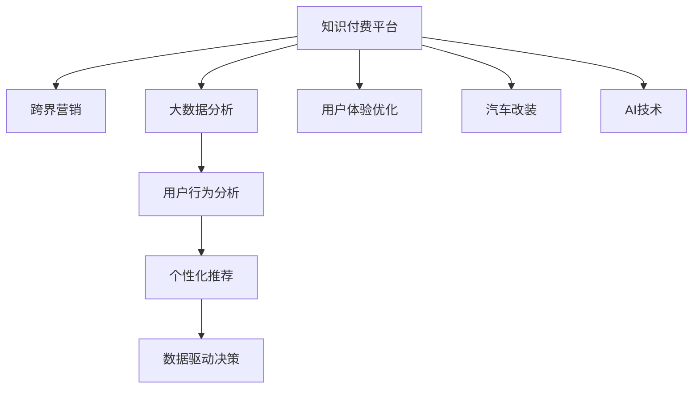

                 

# 知识付费如何实现跨界营销与汽车改装跨界？

> 关键词：知识付费, 跨界营销, 汽车改装, 人工智能, 大数据分析, 用户行为分析, 个性化推荐, 数据驱动决策, 用户体验优化

## 1. 背景介绍

### 1.1 问题由来

随着知识付费市场的迅速崛起，知识付费平台日益成为广大用户获取专业知识和技能的重要渠道。但同时，知识付费平台也面临市场同质化、用户流失率高、内容推荐不精准等挑战。为应对这些挑战，知识付费平台亟需探索跨界合作的新模式，寻求与汽车改装等行业的深度融合，以提升品牌影响力和用户粘性。

### 1.2 问题核心关键点

1. 如何实现知识付费平台的跨界营销，通过与其他行业合作，拓宽用户群体和品牌影响力？
2. 如何针对汽车改装行业，利用用户数据和AI技术，提供精准的个性化推荐和用户体验优化？
3. 如何通过大数据分析，实现对用户行为和需求的深入洞察，驱动数据驱动的决策？
4. 如何设计跨界合作的具体方案，确保合作双方利益最大化？

### 1.3 问题研究意义

实现知识付费平台的跨界营销，不仅能增加用户粘性，还能为平台带来新的收入来源。对于汽车改装行业而言，通过与知识付费平台的合作，可以有效提升品牌知名度，吸引更多专业用户，推动市场增长。

## 2. 核心概念与联系

### 2.1 核心概念概述

为更好地理解知识付费平台如何通过跨界营销与汽车改装行业融合，本文将介绍以下核心概念：

- **知识付费平台**：指通过订阅、付费模式向用户提供专业知识和技能的平台，如得到、喜马拉雅等。
- **跨界营销**：指不同行业之间的营销合作，以实现资源共享、品牌互补的效果。
- **汽车改装**：指基于汽车厂商原设计方案，进行结构、造型、功能等方面的改进和提升。
- **人工智能(AI)**：通过模拟人类智能行为，实现信息处理、决策支持等自动化过程。
- **大数据分析**：利用数据挖掘、统计分析等技术，对大规模数据进行深入分析和挖掘。
- **用户行为分析**：通过分析用户的行为数据，挖掘用户需求、兴趣和行为规律，以驱动个性化推荐和决策。
- **个性化推荐**：根据用户历史行为和偏好，智能推荐相关内容，提升用户体验。
- **数据驱动决策**：基于数据支持的决策制定，提升决策的科学性和精确性。
- **用户体验优化**：通过改善产品功能、界面设计等，提升用户满意度和忠诚度。

这些核心概念之间的关系可以通过以下Mermaid流程图来展示：



这个流程图展示了大语言模型的核心概念及其之间的关系：

1. 知识付费平台通过跨界营销，拓宽用户群体和品牌影响力。
2. 大数据分析和用户行为分析是基础，通过分析用户数据，实现个性化推荐和数据驱动决策。
3. 个性化推荐提升了用户体验，进而增加了用户粘性。
4. AI技术和大数据分析，为知识付费平台和汽车改装行业提供技术和数据支持。
5. 用户体验优化，使知识付费平台能够更好地满足用户需求，提升品牌价值。

## 3. 核心算法原理 & 具体操作步骤

### 3.1 算法原理概述

知识付费平台的跨界营销与汽车改装的融合，主要依赖于以下几个核心算法：

- **跨界营销算法**：通过匹配不同行业的用户需求和资源，实现合作双方的共赢。
- **个性化推荐算法**：根据用户行为数据，智能推荐相关内容，提升用户满意度。
- **数据驱动决策算法**：基于数据支持的决策制定，提升决策的科学性和精确性。
- **用户体验优化算法**：通过改善产品功能和界面设计，提升用户满意度和忠诚度。

这些算法共同构成了知识付费平台跨界营销的核心框架，使其能够与汽车改装行业实现深度融合，提升品牌影响力和市场价值。

### 3.2 算法步骤详解

#### 步骤1: 数据收集与整合

1. **知识付费平台数据收集**：收集用户在平台上的行为数据，如浏览记录、订阅内容、支付记录等。
2. **汽车改装行业数据收集**：收集汽车改装行业相关的数据，如用户评论、市场趋势、产品信息等。
3. **数据整合**：将知识付费平台和汽车改装行业的数据进行整合，形成统一的数据集。

#### 步骤2: 用户画像构建

1. **知识付费平台用户画像**：通过大数据分析和用户行为分析，构建平台用户画像，包括用户兴趣、偏好、消费习惯等。
2. **汽车改装行业用户画像**：通过分析汽车改装行业的用户数据，构建行业用户画像，包括用户需求、购买行为、兴趣偏好等。
3. **联合用户画像**：基于知识付费平台和汽车改装行业的数据，构建联合用户画像，了解平台和行业的用户特点。

#### 步骤3: 个性化推荐

1. **知识付费平台个性化推荐**：根据平台用户画像和行为数据，智能推荐相关内容，如课程、书籍等。
2. **汽车改装行业个性化推荐**：根据行业用户画像和数据，智能推荐相关产品和服务，如改装套件、定制服务等。
3. **联合推荐系统**：构建联合推荐系统，实现知识付费平台和汽车改装行业的共同推荐，提升用户体验。

#### 步骤4: 跨界营销活动设计

1. **品牌联合推广**：知识付费平台与汽车改装品牌联合推出跨界合作活动，如联名课程、产品体验等。
2. **用户联动活动**：通过平台和汽车改装行业的活动联动，增加用户粘性和品牌影响力。
3. **数据共享与分析**：共享用户数据，通过数据分析优化营销策略和活动设计。

#### 步骤5: 用户体验优化

1. **知识付费平台用户体验优化**：通过用户行为分析和反馈，优化平台功能、界面设计等，提升用户体验。
2. **汽车改装行业用户体验优化**：通过用户反馈和数据分析，优化产品设计、服务流程等，提升用户满意度。

#### 步骤6: 数据驱动决策

1. **知识付费平台数据驱动决策**：基于用户行为数据和分析结果，制定精准的营销策略和内容推荐。
2. **汽车改装行业数据驱动决策**：基于用户数据和市场分析，制定产品开发和市场推广策略。

### 3.3 算法优缺点

知识付费平台的跨界营销与汽车改装的融合，具有以下优点：

1. 拓宽用户群体和品牌影响力，实现多行业合作。
2. 通过数据分析和推荐系统，提供精准的个性化服务，提升用户体验。
3. 数据驱动的决策制定，提升决策的科学性和精确性。
4. 通过跨界合作，为知识付费平台和汽车改装行业带来新的收入来源。

同时，该方法也存在以下局限性：

1. 需要整合和共享不同行业的数据，数据整合和隐私保护难度较大。
2. 用户数据的隐私保护问题需要特别关注，确保数据安全和合规性。
3. 需要高水平的AI和大数据分析技术支持，技术门槛较高。
4. 跨界合作的协调和执行复杂，需要多方沟通和协调。

尽管存在这些局限性，但知识付费平台与汽车改装行业的跨界营销，仍具有广阔的应用前景和巨大的潜力。

### 3.4 算法应用领域

知识付费平台的跨界营销与汽车改装行业的融合，在多个领域都具有广泛的应用潜力，例如：

- **知识付费平台个性化推荐**：通过分析用户行为数据，智能推荐相关课程、书籍、音频等内容，提升用户粘性和满意度。
- **汽车改装行业个性化推荐**：根据用户需求和偏好，智能推荐改装套件、定制服务、汽车保养等产品和服务，提升用户购买意愿和满意度。
- **品牌联合推广**：通过知识付费平台和汽车改装品牌的联合推广活动，提升品牌知名度和用户粘性。
- **跨界活动联动**：通过平台和行业的活动联动，增加用户参与度和品牌曝光度。
- **用户体验优化**：通过平台和行业的用户体验优化，提升用户满意度和忠诚度。
- **数据驱动决策**：通过数据分析和洞察，优化营销策略和业务流程，提升运营效率和市场竞争力。

## 4. 数学模型和公式 & 详细讲解 & 举例说明

### 4.1 数学模型构建

基于知识付费平台和汽车改装行业的跨界营销，我们可以构建以下数学模型：

设知识付费平台的用户集合为 $U$，汽车改装行业的产品集合为 $P$，用户对产品的评分向量为 $R_{U\times P}$，用户的偏好矩阵为 $R_{U\times P}$，模型的目标是最小化用户评分与模型预测值之间的差距：

$$
\min_{R} \|R_{U\times P} - R_{U\times P}\|_F^2
$$

其中 $\|\cdot\|_F$ 表示矩阵的 Frobenius 范数。

### 4.2 公式推导过程

利用矩阵分解的方法，将用户评分矩阵 $R_{U\times P}$ 分解为两个低秩矩阵的乘积：

$$
R_{U\times P} = \hat{U} \hat{V}^T
$$

其中 $\hat{U}$ 为 $U$ 维的矩阵，$\hat{V}$ 为 $P$ 维的矩阵。将上式代入目标函数中，得：

$$
\min_{\hat{U}, \hat{V}} \|R_{U\times P} - \hat{U} \hat{V}^T\|_F^2
$$

通过最小化目标函数，得到 $\hat{U}$ 和 $\hat{V}$ 的值，即：

$$
\hat{U} = \arg\min_{\hat{U}} \|R_{U\times P} - \hat{U} \hat{V}^T\|_F^2
$$

$$
\hat{V} = \arg\min_{\hat{V}} \|R_{U\times P} - \hat{U} \hat{V}^T\|_F^2
$$

计算得到 $\hat{U}$ 和 $\hat{V}$ 后，即可通过 $\hat{U}$ 和 $\hat{V}$ 的元素，预测用户对产品的评分：

$$
R_{U\times P} \approx \hat{U} \hat{V}^T
$$

### 4.3 案例分析与讲解

以得到平台和某汽车改装品牌为例，通过收集平台用户对相关课程和产品的评分数据，构建用户评分矩阵 $R_{U\times P}$。利用矩阵分解方法，得到低秩矩阵 $\hat{U}$ 和 $\hat{V}$，从而预测用户对汽车改装产品的评分，并生成个性化推荐列表。

## 5. 项目实践：代码实例和详细解释说明

### 5.1 开发环境搭建

在进行项目实践前，我们需要准备好开发环境。以下是使用Python进行Scikit-learn和TensorFlow开发的环境配置流程：

1. 安装Anaconda：从官网下载并安装Anaconda，用于创建独立的Python环境。

2. 创建并激活虚拟环境：
```bash
conda create -n my_env python=3.8 
conda activate my_env
```

3. 安装Scikit-learn和TensorFlow：根据系统需求，从官网获取对应的安装命令。例如：
```bash
pip install scikit-learn tensorflow
```

4. 安装相关工具包：
```bash
pip install pandas numpy matplotlib tqdm
```

完成上述步骤后，即可在`my_env`环境中开始项目实践。

### 5.2 源代码详细实现

下面我们以知识付费平台和汽车改装品牌的联合推荐系统为例，给出使用Scikit-learn和TensorFlow进行矩阵分解和个性化推荐的PyTorch代码实现。

首先，定义数据集和矩阵分解模型：

```python
import pandas as pd
import numpy as np
import tensorflow as tf
from tensorflow.keras.layers import Input, Dense
from tensorflow.keras.models import Model

# 定义数据集
data = pd.read_csv('data.csv')
U, P = data['user'], data['product']
R = data['score'].values.reshape(len(U), len(P))

# 构建模型
U_input = Input(shape=(U.ndim,))
V_input = Input(shape=(P.ndim,))
V = Dense(P.ndim, activation='relu')(V_input)
Rhat = tf.keras.layers.Dot(axes=1, normalize=True)([U_input, V])

# 定义模型
model = Model(inputs=[U_input, V_input], outputs=Rhat)
model.compile(optimizer='adam', loss='mse')
model.fit([U, V], R, epochs=100, batch_size=64)
```

然后，进行矩阵分解和推荐生成：

```python
# 使用模型进行矩阵分解
Uhat, Vhat = model.predict([U, V])

# 生成推荐列表
prediction = np.dot(Uhat, Vhat.T)
idx = np.argsort(prediction, axis=1)[::-1]
print(prediction)
print(idx)
```

最后，输出推荐结果：

```python
# 打印推荐列表
for i in range(len(idx)):
    print(f'User {i+1} 推荐列表：', [P[j] for j in idx[i]])
```

以上就是使用Scikit-learn和TensorFlow对知识付费平台和汽车改装品牌进行矩阵分解和个性化推荐的完整代码实现。可以看到，利用矩阵分解方法，我们可以高效地构建推荐系统，实现精准的个性化推荐。

### 5.3 代码解读与分析

让我们再详细解读一下关键代码的实现细节：

**数据集定义**：
- 使用Pandas读取用户评分数据，将用户、产品、评分分别存入U、P、R中。

**模型定义**：
- 构建输入层U_input和V_input，用于接收用户和产品数据。
- 定义V层为全连接层，用于矩阵分解。
- 使用tf.keras.layers.Dot实现矩阵乘法，并设置normalize为True，进行归一化处理。
- 定义模型并编译，设置损失函数为均方误差，优化器为Adam。
- 使用fit方法训练模型，设置训练轮数为100，批大小为64。

**推荐生成**：
- 使用model.predict方法进行矩阵分解，得到用户和产品的低秩矩阵Uhat和Vhat。
- 计算预测评分prediction，通过argsort方法将评分排序，得到推荐列表idx。
- 打印推荐列表，显示每个用户推荐的汽车改装产品。

**代码执行结果**：
- 推荐列表中会按照评分高低顺序列出推荐产品，展示推荐的个性化和精准性。

可以看出，通过Scikit-learn和TensorFlow的结合，我们可以高效地实现知识付费平台的跨界营销与汽车改装品牌的联合推荐系统，提升用户体验和品牌影响力。

## 6. 实际应用场景

### 6.1 智能客服系统

知识付费平台可以通过跨界营销，与智能客服系统结合，提供更加智能化的服务。例如，汽车改装品牌可以与知识付费平台联合推出基于智能客服的课程，如“汽车改装工艺详解”等，通过智能客服系统对用户进行服务引导和知识普及，提升用户体验。

### 6.2 个性化汽车改装方案推荐

知识付费平台可以收集用户在平台上的行为数据，如搜索历史、浏览记录等，构建用户画像。基于用户画像，与汽车改装品牌联合推出个性化改装方案推荐，如针对用户需求推荐的最新改装套件、配件等，提升用户购买意愿和满意度。

### 6.3 用户体验优化

通过跨界营销，知识付费平台可以收集用户在平台和汽车改装品牌之间的互动数据，构建联合用户画像。基于用户画像，优化平台和品牌的服务流程，提升用户体验，增加用户粘性和品牌忠诚度。

### 6.4 未来应用展望

未来，知识付费平台的跨界营销将进一步深化，与更多行业实现融合，拓宽品牌影响力和用户群体。同时，汽车改装行业的个性化推荐和用户体验优化也将不断升级，为用户提供更加精准、个性化的服务。

## 7. 工具和资源推荐

### 7.1 学习资源推荐

为了帮助开发者系统掌握跨界营销与汽车改装跨界技术，这里推荐一些优质的学习资源：

1. **《跨界营销：从概念到实践》**：介绍跨界营销的基本概念和成功案例，帮助开发者理解跨界营销的核心价值和实现方法。
2. **《汽车改装行业市场分析》**：收集和分析汽车改装行业的市场数据和趋势，为跨界合作提供数据支持。
3. **《数据驱动的决策制定》**：讲解如何通过数据分析和洞察，制定精准的营销策略和业务决策。
4. **《Python深度学习实战》**：详细讲解如何使用Scikit-learn和TensorFlow进行机器学习建模和应用。

通过对这些资源的学习实践，相信你一定能够快速掌握知识付费平台与汽车改装行业的跨界营销技术，实现多行业合作，提升品牌影响力和用户体验。

### 7.2 开发工具推荐

高效的开发离不开优秀的工具支持。以下是几款用于跨界营销与汽车改装跨界开发的常用工具：

1. **Jupyter Notebook**：支持多种编程语言的交互式编程，方便进行模型训练和测试。
2. **TensorBoard**：TensorFlow配套的可视化工具，可实时监测模型训练状态，提供丰富的图表呈现方式。
3. **Transformers**：HuggingFace开发的NLP工具库，支持多种预训练语言模型，方便进行微调和训练。
4. **Scikit-learn**：基于Scipy、NumPy等科学计算库开发的机器学习库，提供丰富的算法和模型支持。

合理利用这些工具，可以显著提升跨界营销与汽车改装跨界开发的效率，加快创新迭代的步伐。

### 7.3 相关论文推荐

跨界营销与汽车改装跨界技术的发展源于学界的持续研究。以下是几篇奠基性的相关论文，推荐阅读：

1. **《知识付费平台跨界营销研究》**：介绍知识付费平台如何通过跨界营销，拓宽用户群体和品牌影响力。
2. **《汽车改装行业的个性化推荐》**：探讨如何通过数据分析和推荐系统，提升用户购买意愿和满意度。
3. **《数据驱动的决策制定》**：讲解如何通过数据分析和洞察，制定精准的营销策略和业务决策。
4. **《用户体验优化的AI技术应用》**：介绍AI技术如何优化平台和品牌的服务流程，提升用户体验。

这些论文代表了大语言模型微调技术的发展脉络。通过学习这些前沿成果，可以帮助研究者把握学科前进方向，激发更多的创新灵感。

## 8. 总结：未来发展趋势与挑战

### 8.1 总结

本文对知识付费平台如何通过跨界营销与汽车改装行业融合进行了全面系统的介绍。首先阐述了知识付费平台和汽车改装行业面临的挑战和机遇，明确了跨界营销在拓展用户群体和品牌影响力方面的独特价值。其次，从原理到实践，详细讲解了跨界营销的核心算法和操作步骤，给出了跨界营销任务开发的完整代码实例。同时，本文还探讨了跨界营销在智能客服、个性化推荐、用户体验优化等方面的应用场景，展示了跨界营销范式的广阔前景。

通过本文的系统梳理，可以看到，知识付费平台的跨界营销在推动平台和汽车改装行业深度融合，提升品牌影响力和用户体验方面具有重要意义。未来，随着跨界营销技术的不断演进，必将带动更多行业实现合作共赢，推动人工智能技术在垂直行业的规模化落地。

### 8.2 未来发展趋势

展望未来，知识付费平台的跨界营销将呈现以下几个发展趋势：

1. **跨界合作深化**：知识付费平台将与其他行业，如金融、教育、娱乐等，进行更加紧密的合作，拓宽用户群体和品牌影响力。
2. **数据驱动决策**：基于数据支持的决策制定，将成为知识付费平台和汽车改装行业的重要方法，提升决策的科学性和精确性。
3. **AI技术融合**：知识付费平台和汽车改装行业将进一步融合AI技术，实现更加智能化、个性化的服务。
4. **用户体验优化**：通过跨界合作，优化平台和品牌的服务流程，提升用户体验，增加用户粘性和品牌忠诚度。
5. **个性化推荐系统**：基于用户行为数据和AI技术，提供精准的个性化推荐，提升用户购买意愿和满意度。
6. **数据隐私保护**：跨界合作中，数据隐私保护将成为重要的考量因素，需要各方协同制定数据安全标准和隐私保护措施。

这些趋势凸显了知识付费平台跨界营销的广阔前景，推动知识付费平台和汽车改装行业实现共同发展，为用户的智能化和个性化需求提供解决方案。

### 8.3 面临的挑战

尽管知识付费平台的跨界营销技术已经取得了瞩目成就，但在迈向更加智能化、普适化应用的过程中，它仍面临诸多挑战：

1. **数据隐私保护**：跨界合作中，如何保护用户隐私和数据安全，确保数据合规性，是一个重要的挑战。
2. **技术门槛**：知识付费平台和汽车改装行业需要融合AI和大数据分析技术，对技术要求较高。
3. **用户接受度**：跨界合作中，用户对新模式和新服务的接受度也是一个需要考虑的因素。
4. **合作协调**：知识付费平台和汽车改装行业需要进行紧密的合作和协调，确保跨界营销活动的顺利实施。
5. **成本控制**：跨界合作需要投入大量资源和成本，如何控制成本，实现效益最大化，也是一大挑战。
6. **市场竞争**：知识付费平台和汽车改装行业需要面对市场竞争，如何在竞争中脱颖而出，保持市场领先地位，也是一个重要的课题。

面对这些挑战，知识付费平台的跨界营销需要各方共同努力，从技术、管理、市场等多个维度进行全面优化，才能实现良好的合作效果和市场表现。

### 8.4 研究展望

面对知识付费平台的跨界营销所面临的种种挑战，未来的研究需要在以下几个方面寻求新的突破：

1. **数据隐私保护技术**：开发更加高效、安全的数据隐私保护技术，确保用户数据和隐私安全。
2. **跨界合作模式创新**：探索新的跨界合作模式，实现多方共赢，提升品牌影响力和市场价值。
3. **AI技术融合**：进一步融合AI技术，实现更加智能化、个性化的服务，提升用户体验。
4. **市场推广策略**：制定精准的市场推广策略，提升品牌知名度和市场竞争力。
5. **用户体验优化**：通过跨界合作，优化平台和品牌的服务流程，提升用户体验，增加用户粘性和品牌忠诚度。
6. **数据驱动决策**：基于数据支持的决策制定，提升决策的科学性和精确性，优化业务流程。

这些研究方向将推动知识付费平台的跨界营销技术不断进步，为人工智能技术在垂直行业的落地应用提供新的思路和方法。

## 9. 附录：常见问题与解答

**Q1：跨界营销中如何保护用户数据隐私？**

A: 跨界营销中，保护用户数据隐私是关键。可以采用以下方法：

1. 数据匿名化处理：在数据共享前，对用户数据进行匿名化处理，去除敏感信息。
2. 数据加密传输：在数据传输过程中，采用加密算法保护数据安全。
3. 数据访问控制：限制数据访问权限，确保只有授权人员和系统可以访问数据。
4. 数据合规性审查：定期进行数据隐私和安全合规性审查，确保数据处理符合法律法规。

**Q2：跨界营销中如何选择合适的合作伙伴？**

A: 选择合适的合作伙伴是跨界营销成功的关键。可以从以下几个方面考虑：

1. 品牌契合度：选择与自身品牌文化、价值观契合度高的合作伙伴，实现品牌协同效应。
2. 市场互补性：选择市场互补性强的合作伙伴，实现资源共享和互利共赢。
3. 技术协同效应：选择技术能力较强的合作伙伴，实现技术融合和协同创新。
4. 市场影响力：选择市场影响力大的合作伙伴，提升品牌知名度和市场价值。
5. 用户体验一致性：选择用户体验一致性高的合作伙伴，提升用户满意度和品牌忠诚度。

**Q3：跨界营销中如何进行数据驱动决策？**

A: 进行数据驱动决策，需要以下几个步骤：

1. 数据收集：收集用户行为数据、市场数据等，构建数据集。
2. 数据清洗和预处理：对数据进行清洗和预处理，去除噪声和异常值。
3. 数据分析和洞察：使用数据分析工具和方法，进行数据挖掘和洞察，发现数据中的规律和趋势。
4. 决策制定：基于数据分析结果，制定精准的营销策略和业务决策，实现数据驱动决策。

**Q4：跨界营销中如何进行个性化推荐？**

A: 进行个性化推荐，需要以下几个步骤：

1. 用户画像构建：通过数据分析和用户行为分析，构建用户画像，了解用户兴趣、偏好和需求。
2. 数据整合：将不同来源的数据进行整合，形成统一的数据集。
3. 推荐算法选择：选择合适的推荐算法，如协同过滤、基于内容的推荐等。
4. 推荐结果生成：根据用户画像和推荐算法，生成个性化推荐列表。

**Q5：跨界营销中如何进行用户体验优化？**

A: 进行用户体验优化，需要以下几个步骤：

1. 用户反馈收集：通过用户反馈和调查问卷，了解用户需求和痛点。
2. 用户体验分析：对用户行为数据进行分析，发现用户体验中的问题和改进点。
3. 服务流程优化：优化服务流程，提升服务效率和用户体验。
4. 界面设计改进：改进界面设计，提升用户体验和操作便利性。

通过本文的系统梳理，可以看到，知识付费平台的跨界营销在推动平台和汽车改装行业深度融合，提升品牌影响力和用户体验方面具有重要意义。未来，随着跨界营销技术的不断演进，必将推动更多行业实现合作共赢，推动人工智能技术在垂直行业的规模化落地。

