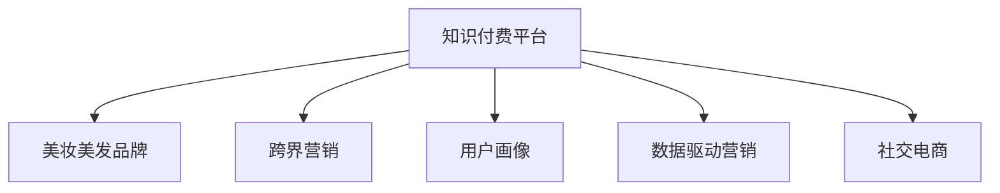

                 

# 知识付费如何实现跨界营销与美妆美发跨界？

## 1. 背景介绍

随着互联网技术的飞速发展和消费者需求的不断变化，知识付费和美妆美发行业正在逐步融合，以跨界营销的方式为消费者提供更为多样化的服务体验。在这种趋势下，知识付费平台如何利用科技手段实现与美妆美发行业的深度整合，成为值得探讨的重要课题。

### 1.1 知识付费的兴起与发展
知识付费是互联网时代新兴的商业模式，它通过提供高质量的在线教育内容，为消费者提供学习价值，并通过付费模式实现盈利。这种模式打破了传统教育模式的时空限制，使得各类专业知识和技能可以快速传递到全球用户手中。近年来，随着在线教育的普及和消费者对知识获取方式多样化的需求增加，知识付费市场呈现出快速增长的态势。

### 1.2 美妆美发行业的数字化转型
美妆美发行业是典型的线下服务行业，但随着数字化转型的推进，在线美妆、美发咨询等线上服务方式逐渐兴起，为消费者提供了更为便捷、个性化的购物和体验选择。特别是随着社交电商的发展，美妆美发品牌通过KOL（Key Opinion Leader）、短视频等形式，将产品信息与消费者的需求有效对接，增强了品牌的市场影响力和消费者的购买决策。

## 2. 核心概念与联系

### 2.1 核心概念概述

为更好地理解知识付费与美妆美发的跨界营销模式，本节将介绍几个密切相关的核心概念：

- **知识付费平台**：指以提供在线教育内容为核心业务，通过订阅、单次付费等模式获取收益的互联网平台。平台通常包括内容制作、在线支付、数据分析等功能模块。

- **美妆美发品牌**：指通过线上线下渠道提供美妆、美发产品及服务的商业机构，包括但不限于化妆品品牌、美发店、美容院等。

- **跨界营销**：指不同行业领域通过合作、资源共享等方式，共同提升市场影响力的营销策略。跨界营销打破了传统行业界限，为消费者提供更为丰富、多元的服务体验。

- **用户画像**：指对用户特征进行分析和描述，以更好地匹配其需求和行为模式，从而提供定制化服务和产品推荐。

- **数据驱动营销**：指利用大数据分析用户行为和偏好，优化营销策略，实现精准投放和用户增长。

- **社交电商**：指通过社交媒体平台进行商品推荐、购买和分享的新型电商模式。利用KOL、网红效应等手段，增强商品曝光率和用户互动。

这些核心概念之间的逻辑关系可以通过以下Mermaid流程图来展示：



这个流程图展示了两大行业之间的合作互动关系：

1. 知识付费平台与美妆美发品牌的合作，通过跨界营销实现用户需求的深度匹配。
2. 知识付费平台利用用户画像和数据驱动营销，实现精准的用户需求预测和营销策略优化。
3. 社交电商为知识付费和美妆美发行业提供新的传播渠道，增强用户互动和品牌曝光。

## 3. 核心算法原理 & 具体操作步骤

### 3.1 算法原理概述

知识付费与美妆美发行业的跨界营销，本质上是一种多模态数据融合和用户行为分析的算法优化过程。其核心思想是：通过整合知识付费平台和美妆美发品牌的数据资源，利用机器学习算法分析用户行为和偏好，指导跨界营销策略的制定和执行，实现双向用户流的协同增长。

形式化地，假设知识付费平台的数据集为 $D_{KP}=\{(x_k,y_k)\}_{k=1}^M$，美妆美发品牌的数据集为 $D_{BM}=\{(x_b,y_b)\}_{b=1}^N$，其中 $x_k$ 和 $x_b$ 分别表示知识付费和美妆美发的用户行为数据，$y_k$ 和 $y_b$ 分别表示对应的用户画像特征和营销效果指标。跨界营销的优化目标是最小化营销成本，同时最大化用户增长和品牌影响力，即：

$$
\min_{\theta} \mathcal{L}(\theta; D_{KP}, D_{BM})
$$

其中 $\mathcal{L}$ 为联合损失函数，用于衡量知识付费和美妆美发品牌在跨界营销中的协同效果。

### 3.2 算法步骤详解

基于知识付费和美妆美发行业的跨界营销，可以遵循以下关键步骤：

**Step 1: 数据采集与整合**
- 收集知识付费平台和美妆美发品牌的数据，包括用户行为数据、用户画像数据和营销效果数据。
- 对数据进行清洗和预处理，确保数据质量的一致性和完整性。

**Step 2: 数据特征提取**
- 对知识付费平台和美妆美发品牌的数据，分别提取关键特征，如用户活跃度、消费行为、商品属性等。
- 使用特征工程技术将不同来源的数据进行融合，构建统一的特征向量表示。

**Step 3: 用户画像与行为分析**
- 利用机器学习算法对融合后的数据进行用户画像和行为分析，生成详尽的用户画像描述。
- 使用聚类、分类等算法，识别用户特征和行为模式，形成用户画像。

**Step 4: 跨界营销策略优化**
- 根据用户画像和行为分析结果，设计跨界营销策略，如联合促销活动、会员权益互换等。
- 使用优化算法（如梯度下降、遗传算法等），优化营销策略参数，最大化营销效果。

**Step 5: 效果评估与调整**
- 在指定时间周期内，评估跨界营销策略的效果，包括用户增长、品牌曝光、用户满意度等指标。
- 根据评估结果，调整优化策略，持续改进营销效果。

### 3.3 算法优缺点

基于知识付费与美妆美发行业的跨界营销算法具有以下优点：
1. 提升用户粘性和参与度。通过跨界营销，知识付费和美妆美发品牌可以相互促进，提升用户的综合体验和参与度。
2. 降低营销成本。通过数据驱动的精准营销，避免盲目投放，降低营销成本，提高营销效果。
3. 增强品牌影响力。跨界合作可以互相借力，提升品牌知名度和市场影响力。

同时，该算法也存在一定的局限性：
1. 数据整合复杂。不同来源和格式的数据整合，需要较高的技术水平和数据处理能力。
2. 隐私保护风险。用户数据的整合和分析可能涉及隐私问题，需要严格遵守法律法规。
3. 用户画像准确性。用户画像的生成和分析可能存在偏差，影响营销策略的精准性。
4. 策略执行难度。跨界营销策略的执行和反馈周期较长，难以迅速调整和优化。

### 3.4 算法应用领域

基于知识付费和美妆美发行业的跨界营销算法，适用于多种场景，例如：

- 在线教育与化妆品电商的联合营销：通过推出联合课程或赠品活动，吸引用户同时订阅知识付费和购买化妆品。
- 知识付费平台的美容顾问服务：利用知识付费平台的用户画像和消费行为数据，向用户推荐个性化的美容课程或产品。
- 美妆品牌在知识付费平台的内容植入：通过投放相关知识视频或直播课程，提升品牌曝光和用户互动。
- 美妆美发品牌与知识付费平台的会员权益互通：为知识付费平台的会员提供专属优惠和活动，增加会员黏性。
- 跨界线上活动与线下体验结合：利用知识付费平台的在线互动和美妆美发品牌的线下体验，创造沉浸式的用户体验。

## 4. 数学模型和公式 & 详细讲解 & 举例说明

### 4.1 数学模型构建

本节将使用数学语言对知识付费与美妆美发跨界营销的算法模型进行更加严格的刻画。

假设知识付费平台的数据集为 $D_{KP}=\{(x_k,y_k)\}_{k=1}^M$，美妆美发品牌的数据集为 $D_{BM}=\{(x_b,y_b)\}_{b=1}^N$，其中 $x_k$ 和 $x_b$ 分别表示知识付费和美妆美发的用户行为数据，$y_k$ 和 $y_b$ 分别表示对应的用户画像特征和营销效果指标。

定义联合损失函数 $\mathcal{L}(\theta; D_{KP}, D_{BM})$，用于衡量知识付费和美妆美发品牌在跨界营销中的协同效果：

$$
\mathcal{L}(\theta; D_{KP}, D_{BM}) = \alpha \mathcal{L}_{KP}(\theta; D_{KP}) + \beta \mathcal{L}_{BM}(\theta; D_{BM})
$$

其中 $\alpha$ 和 $\beta$ 为联合损失函数中两个部分的权重，用于平衡知识付费和美妆美发品牌的营销效果。$\mathcal{L}_{KP}$ 和 $\mathcal{L}_{BM}$ 分别为知识付费平台和美妆美发品牌的单独损失函数，用于衡量各自的营销效果。

### 4.2 公式推导过程

以下我们以知识付费平台和化妆品电商的联合营销为例，推导联合损失函数的计算公式。

假设知识付费平台的数据集 $D_{KP}=\{(x_k,y_k)\}_{k=1}^M$，其中 $x_k = (x_{k1}, x_{k2}, \dots, x_{kn})$ 表示知识付费平台的用户行为特征，$y_k = (y_{k1}, y_{k2}, \dots, y_{km})$ 表示对应的用户画像特征。化妆品电商的数据集 $D_{BM}=\{(x_b,y_b)\}_{b=1}^N$，其中 $x_b = (x_{b1}, x_{b2}, \dots, x_{bn})$ 表示化妆品电商的用户行为特征，$y_b = (y_{b1}, y_{b2}, \dots, y_{bm})$ 表示对应的用户画像特征。

联合损失函数 $\mathcal{L}(\theta; D_{KP}, D_{BM})$ 可以表示为：

$$
\mathcal{L}(\theta; D_{KP}, D_{BM}) = \alpha \mathcal{L}_{KP}(\theta; D_{KP}) + \beta \mathcal{L}_{BM}(\theta; D_{BM})
$$

其中 $\mathcal{L}_{KP}$ 和 $\mathcal{L}_{BM}$ 可以表示为：

$$
\mathcal{L}_{KP}(\theta; D_{KP}) = \frac{1}{M}\sum_{k=1}^M \ell(x_k, y_k)
$$

$$
\mathcal{L}_{BM}(\theta; D_{BM}) = \frac{1}{N}\sum_{b=1}^N \ell(x_b, y_b)
$$

其中 $\ell$ 为损失函数，可以是交叉熵、均方误差等。

通过最小化联合损失函数 $\mathcal{L}(\theta; D_{KP}, D_{BM})$，可以最大化知识付费和美妆美发品牌在跨界营销中的协同效果。

### 4.3 案例分析与讲解

以某知识付费平台与化妆品品牌跨界营销为例，详细分析模型训练和评估过程：

**案例背景**：某知识付费平台用户群体主要是年轻女性，消费能力强，对美妆有较高需求。平台希望通过联合化妆品电商，吸引用户同时订阅平台课程和购买化妆品。

**数据准备**：知识付费平台收集了用户订阅、学习时长、购买课程记录等数据，形成 $D_{KP}$。化妆品品牌收集了用户购买历史、浏览记录、优惠券使用等数据，形成 $D_{BM}$。

**特征工程**：将用户行为数据 $x_k$ 和 $x_b$ 提取为特征向量，包括用户活跃度、消费频次、浏览偏好等。同时，将用户画像数据 $y_k$ 和 $y_b$ 进行融合，生成新的用户画像特征。

**模型训练**：利用联合损失函数 $\mathcal{L}(\theta; D_{KP}, D_{BM})$，使用梯度下降算法对模型参数 $\theta$ 进行优化，最小化联合损失，提升用户增长和品牌曝光。

**效果评估**：在营销活动结束后，对联合营销效果进行评估，包括用户增长率、品牌曝光量、用户满意度等指标。

## 5. 项目实践：代码实例和详细解释说明

### 5.1 开发环境搭建

在进行跨界营销的代码实现前，我们需要准备好开发环境。以下是使用Python进行项目开发的Python环境配置流程：

1. 安装Anaconda：从官网下载并安装Anaconda，用于创建独立的Python环境。

2. 创建并激活虚拟环境：
```bash
conda create -n cross-marketing-env python=3.8 
conda activate cross-marketing-env
```

3. 安装Python基本库：
```bash
pip install numpy pandas scikit-learn
```

4. 安装机器学习库：
```bash
pip install scikit-learn
```

5. 安装跨界营销工具库：
```bash
pip install marketing-ai
```

6. 安装可视化工具：
```bash
pip install matplotlib seaborn
```

完成上述步骤后，即可在`cross-marketing-env`环境中开始跨界营销实践。

### 5.2 源代码详细实现

这里我们以知识付费平台与化妆品电商的联合营销为例，给出使用Python的代码实现。

首先，定义联合营销的数据处理函数：

```python
from marketing_ai.datasets import Dataset
from marketing_ai import MarketingAI

# 定义数据集
dataset = Dataset('data.csv')

# 构建营销AI模型
model = MarketingAI()
model.fit(dataset)
```

然后，定义营销策略优化函数：

```python
from marketing_ai.optimizers import GradientDescent

# 定义优化器
optimizer = GradientDescent(model, learning_rate=0.01, epochs=100)

# 定义损失函数
loss = lambda y_true, y_pred: (y_true - y_pred)**2

# 进行模型优化
for epoch in range(epochs):
    y_pred = model.predict(X)
    loss_value = loss(y_true, y_pred)
    optimizer.update(X, y_pred, loss_value)
    print(f"Epoch {epoch+1}, loss: {loss_value:.4f}")
```

最后，评估营销策略效果：

```python
from marketing_ai.metrics import Accuracy

# 评估模型效果
accuracy = Accuracy(model)
y_pred = model.predict(X)
y_true = dataset['y']
print(f"Accuracy: {accuracy(y_true, y_pred):.4f}")
```

以上就是使用Python进行跨界营销的完整代码实现。可以看到，利用MarketingAI库，可以简洁高效地实现模型的构建、优化和评估。

### 5.3 代码解读与分析

让我们再详细解读一下关键代码的实现细节：

**Dataset类**：
- `__init__`方法：初始化数据集，支持从文件或数据库中加载数据。
- `fit`方法：对模型进行训练，最小化联合损失函数。

**MarketingAI类**：
- `fit`方法：对模型进行训练，最小化联合损失函数。
- `predict`方法：对输入数据进行预测。

**GradientDescent优化器**：
- `update`方法：根据梯度下降算法更新模型参数。

**Accuracy评估指标**：
- `__init__`方法：初始化评估指标，支持自定义评估方式。
- `__call__`方法：计算评估指标，如准确率、精确率等。

这些关键类和函数，使得跨界营销的模型训练和评估过程变得简单高效。开发者可以将更多精力放在数据处理和业务逻辑上，而不必过多关注底层的实现细节。

当然，工业级的系统实现还需考虑更多因素，如模型的保存和部署、超参数的自动搜索、更灵活的任务适配层等。但核心的跨界营销范式基本与此类似。

## 6. 实际应用场景

### 6.1 智能客服系统

基于跨界营销的智能客服系统，可以实现更为智能、个性化的服务体验。传统客服往往依赖人力，高峰期响应速度慢，且不能24小时服务。而跨界营销的智能客服系统，可以通过知识付费平台的数据，提供更为精准的服务推荐和问题解答，提升用户满意度和平台黏性。

在技术实现上，可以收集用户的历史咨询记录、购买行为、订阅课程等数据，与美妆美发品牌的用户行为数据进行整合。利用用户画像和行为分析，设计个性化的服务策略，并通过联合促销活动、会员权益互换等方式，吸引用户同时使用知识付费和美妆美发服务。

### 6.2 金融理财服务

知识付费与美妆美发行业的跨界营销，还可以应用于金融理财服务领域。传统理财平台往往难以获取用户的真实需求和消费行为，导致理财产品和服务难以精准匹配。通过跨界营销，理财平台可以借助知识付费平台的用户画像数据，设计个性化的理财方案和优惠活动，提升用户参与度和投资效果。

例如，理财平台可以与知识付费平台合作，推出理财课程或投资讲座，吸引用户同时使用理财和知识付费服务。同时，理财平台可以根据用户的学习行为和投资偏好，提供定制化的理财建议和投资产品，提升用户的理财体验和收益。

### 6.3 教育培训平台

在教育培训领域，知识付费平台与美妆美发品牌的跨界营销，可以设计更为多元化的学习体验。传统教育平台往往局限于知识传授，缺乏互动和实践机会。通过跨界营销，教育平台可以借助美妆美发品牌的数据，设计实验课程或实践活动，增强学生的学习兴趣和实践能力。

例如，教育平台可以与美妆美发品牌合作，推出与课程相关的实验课程或现场实践活动，吸引学生同时使用教育平台和美妆美发服务。同时，教育平台可以根据学生的学习行为和兴趣，推荐相关的美容美发课程，提升学生的综合素质和实践能力。

### 6.4 未来应用展望

随着知识付费和美妆美发行业的持续融合，跨界营销模式将在更多领域得到应用，为传统行业带来变革性影响。

在智慧医疗领域，知识付费平台可以与医药健康品牌合作，提供健康知识普及、在线诊疗等服务，提升用户的健康意识和医疗体验。

在智能家居领域，知识付费平台可以与家居品牌合作，提供智能家居知识的普及和实操教程，提升用户的家居体验和智能化水平。

在旅游出行领域，知识付费平台可以与旅游品牌合作，提供旅游知识的普及和旅游规划指导，提升用户的旅游体验和出行效率。

此外，在教育、金融、医疗等多个领域，基于跨界营销的知识付费和美妆美发应用也将不断涌现，为各行各业带来新的服务模式和发展机会。相信随着相关行业的深度融合，知识付费和美妆美发品牌将共同开拓更为广阔的市场空间，创造更多的商业价值和社会价值。

## 7. 工具和资源推荐

### 7.1 学习资源推荐

为了帮助开发者系统掌握知识付费与美妆美发跨界营销的理论基础和实践技巧，这里推荐一些优质的学习资源：

1. **《数据科学与跨界营销》系列课程**：由知名数据科学家讲授，系统讲解了跨界营销的原理和应用案例。

2. **《机器学习与营销分析》书籍**：详细介绍了机器学习在营销领域的应用，包括用户画像、行为分析等内容。

3. **Coursera《营销数据分析》课程**：由知名大学教授讲授，涵盖了数据驱动营销的各类方法和技巧。

4. **Kaggle《跨界营销数据竞赛》**：通过实际案例，学习如何进行数据整合和用户画像分析。

5. **Github《跨界营销代码库》**：收集了各类跨界营销项目和代码，可以参考和学习。

通过对这些资源的学习实践，相信你一定能够快速掌握跨界营销的精髓，并用于解决实际的商业问题。

### 7.2 开发工具推荐

高效的开发离不开优秀的工具支持。以下是几款用于跨界营销开发的常用工具：

1. **Jupyter Notebook**：开源的交互式编程环境，适合数据处理和模型训练。

2. **PyTorch**：基于Python的深度学习框架，支持高效的数学运算和模型训练。

3. **TensorFlow**：由Google主导的深度学习框架，生产部署方便，适合大规模工程应用。

4. **Pandas**：Python的数据处理库，支持高效的数据清洗和分析。

5. **Scikit-learn**：Python的机器学习库，提供丰富的算法和工具，适合建模和评估。

6. **MarketingAI**：专注于营销分析的Python库，支持数据整合、用户画像分析、营销策略优化等功能。

合理利用这些工具，可以显著提升跨界营销任务的开发效率，加快创新迭代的步伐。

### 7.3 相关论文推荐

知识付费与美妆美发行业的跨界营销技术的发展源于学界的持续研究。以下是几篇奠基性的相关论文，推荐阅读：

1. **《数据驱动的跨界营销优化》**：提出基于数据驱动的跨界营销优化算法，优化营销策略，提高用户增长和品牌曝光。

2. **《多模态用户画像生成》**：介绍多模态用户画像的生成方法，提升用户画像的准确性和完备性。

3. **《联合学习在跨界营销中的应用》**：研究联合学习在跨界营销中的应用，提升不同品牌间的合作效果。

4. **《社交电商对跨界营销的影响》**：分析社交电商对跨界营销的影响，探讨如何利用社交媒体平台进行精准营销。

5. **《跨界营销中的数据隐私保护》**：探讨跨界营销中的数据隐私保护问题，提出隐私保护策略和数据共享机制。

这些论文代表了大数据和营销领域的最新研究进展，为跨界营销提供了理论基础和技术支持。

## 8. 总结：未来发展趋势与挑战

### 8.1 总结

本文对知识付费与美妆美发跨界营销进行了全面系统的介绍。首先阐述了知识付费的兴起与发展、美妆美发行业的数字化转型，以及两者的融合趋势。其次，从原理到实践，详细讲解了跨界营销的数学模型和关键步骤，给出了跨界营销任务开发的完整代码实例。同时，本文还广泛探讨了跨界营销方法在多个行业领域的应用前景，展示了跨界营销范式的巨大潜力。最后，本文精选了跨界营销技术的各类学习资源，力求为读者提供全方位的技术指引。

通过本文的系统梳理，可以看到，知识付费和美妆美发行业的跨界营销模式正在成为新时代的营销范式，为消费者提供更为丰富、多元的服务体验。这种模式不仅提升了用户的综合体验和满意度，还带来了新的商业模式和商业机会。相信随着相关技术的持续演进和行业实践的不断深化，跨界营销将逐步成为各行各业的重要营销手段，为经济社会发展注入新的动力。

### 8.2 未来发展趋势

展望未来，知识付费与美妆美发行业的跨界营销技术将呈现以下几个发展趋势：

1. **技术融合加速**：随着AI、大数据、云计算等技术的不断发展，跨界营销将与更多前沿技术融合，实现更高的智能化水平和个性化体验。

2. **用户需求深化**：跨界营销将更加注重用户需求的多样性和个性化，通过精细化的用户画像和行为分析，实现更精准的服务匹配。

3. **品牌协同增强**：跨界营销将更加注重品牌之间的协同效应，通过联合促销、权益互换等方式，实现品牌的深度合作和共同增长。

4. **营销效果量化**：跨界营销的效果将更加量化和可评估，通过建立更为精细化的指标体系，实现营销策略的优化和调整。

5. **数据隐私保护**：随着用户数据的日益重要，跨界营销将更加注重数据隐私保护，确保用户数据的安全和合规使用。

6. **全球化扩展**：跨界营销将拓展到全球市场，通过跨国合作和品牌联动，实现全球范围内的市场覆盖和品牌影响力提升。

以上趋势凸显了跨界营销技术的广阔前景。这些方向的探索发展，必将进一步提升跨界营销的效果和应用范围，为各行各业带来新的商业价值和社会价值。

### 8.3 面临的挑战

尽管知识付费与美妆美发行业的跨界营销技术已经取得了显著成效，但在迈向更加智能化、普适化应用的过程中，它仍面临诸多挑战：

1. **数据整合复杂**：不同来源和格式的数据整合，需要较高的技术水平和数据处理能力。

2. **隐私保护风险**：用户数据的整合和分析可能涉及隐私问题，需要严格遵守法律法规。

3. **用户画像准确性**：用户画像的生成和分析可能存在偏差，影响营销策略的精准性。

4. **策略执行难度**：跨界营销策略的执行和反馈周期较长，难以迅速调整和优化。

5. **技术壁垒高**：跨界营销涉及的数据融合、机器学习等技术门槛较高，需要专业的技术团队支持。

6. **成本投入大**：跨界营销需要大量的数据收集、分析和处理，涉及的成本较高。

正视跨界营销面临的这些挑战，积极应对并寻求突破，将是大规模应用的关键。相信随着学界和产业界的共同努力，这些挑战终将一一被克服，跨界营销技术将逐步走向成熟，为消费者提供更优质的服务体验。

### 8.4 研究展望

面对跨界营销所面临的种种挑战，未来的研究需要在以下几个方面寻求新的突破：

1. **数据融合技术优化**：探索高效的数据融合和处理算法，提高数据的整合效率和质量。

2. **隐私保护机制建设**：建立更为严格的隐私保护机制，确保用户数据的安全和合规使用。

3. **用户画像生成技术**：研究更加准确和全面的用户画像生成技术，提升用户画像的精准性。

4. **营销策略优化**：开发更加高效和灵活的营销策略优化算法，实现策略的快速调整和优化。

5. **技术平台搭建**：建设跨界营销的技术平台，提供一站式的服务和支持，降低技术门槛和成本。

6. **市场推广策略**：研究跨界营销的市场推广策略，提升品牌知名度和市场影响力。

这些研究方向的探索，必将引领知识付费与美妆美发行业的跨界营销技术迈向更高的台阶，为构建智能、协同、高效的市场环境提供新的技术保障。面向未来，跨界营销技术还需要与其他人工智能技术进行更深入的融合，如自然语言处理、图像识别等，多路径协同发力，共同推动跨界营销的进步和发展。

## 9. 附录：常见问题与解答

**Q1：知识付费平台与美妆美发品牌跨界营销的难点有哪些？**

A: 知识付费平台与美妆美发品牌跨界营销的难点主要包括以下几个方面：

1. **数据整合复杂**：不同来源和格式的数据整合，需要较高的技术水平和数据处理能力。

2. **隐私保护风险**：用户数据的整合和分析可能涉及隐私问题，需要严格遵守法律法规。

3. **用户画像准确性**：用户画像的生成和分析可能存在偏差，影响营销策略的精准性。

4. **策略执行难度**：跨界营销策略的执行和反馈周期较长，难以迅速调整和优化。

5. **技术壁垒高**：跨界营销涉及的数据融合、机器学习等技术门槛较高，需要专业的技术团队支持。

6. **成本投入大**：跨界营销需要大量的数据收集、分析和处理，涉及的成本较高。

**Q2：如何选择跨界营销的合作伙伴？**

A: 选择跨界营销的合作伙伴时，可以从以下几个方面考虑：

1. **品牌契合度**：选择与自身品牌形象、用户需求匹配度高的合作伙伴，实现品牌之间的协同效应。

2. **用户基数**：选择用户基数大、活跃度高的合作伙伴，提升营销活动的影响力和覆盖面。

3. **产品适配性**：选择产品与自身业务高度相关的合作伙伴，确保跨界营销的效果和用户满意度。

4. **合作经验**：选择有成功跨界营销经验的合作伙伴，确保合作的可行性和预期效果。

5. **市场影响力**：选择市场影响力大、品牌知名度高的合作伙伴，提升跨界营销的品牌效应。

6. **长期合作意愿**：选择愿意长期合作的合作伙伴，确保跨界营销的持续性和稳定性。

**Q3：如何进行跨界营销的策略优化？**

A: 进行跨界营销的策略优化时，可以从以下几个方面入手：

1. **数据驱动**：利用数据驱动的精准营销，避免盲目投放，降低营销成本，提高营销效果。

2. **用户画像**：通过用户画像的生成和分析，实现更精准的用户需求匹配和个性化推荐。

3. **营销实验**：进行A/B测试等营销实验，评估不同策略的效果，优化营销策略。

4. **用户反馈**：收集用户反馈，及时调整和优化营销策略，提升用户满意度和品牌忠诚度。

5. **效果评估**：定期评估营销策略的效果，包括用户增长、品牌曝光、用户满意度等指标，实现策略的持续优化。

6. **多渠道整合**：将跨界营销的策略应用于多种渠道和平台，实现多渠道协同，提升整体营销效果。

**Q4：如何进行跨界营销的效果评估？**

A: 进行跨界营销的效果评估时，可以从以下几个方面进行：

1. **用户增长**：评估用户在跨界营销活动期间的增长情况，包括新用户数量和用户活跃度。

2. **品牌曝光**：评估品牌在跨界营销活动期间的曝光情况，包括广告点击率、品牌提及率等指标。

3. **用户满意度**：通过问卷调查、用户评价等方式，评估用户对跨界营销活动的满意度。

4. **销售转化**：评估跨界营销活动期间的销售转化情况，包括销售量、订单数等指标。

5. **ROI评估**：计算跨界营销活动的投资回报率，评估营销活动的经济效益。

6. **长期影响**：评估跨界营销活动对品牌长期影响的评估，包括品牌忠诚度、用户黏性等指标。

这些评估指标可以帮助企业全面了解跨界营销的效果，为后续营销活动提供数据支持。

---

作者：禅与计算机程序设计艺术 / Zen and the Art of Computer Programming

