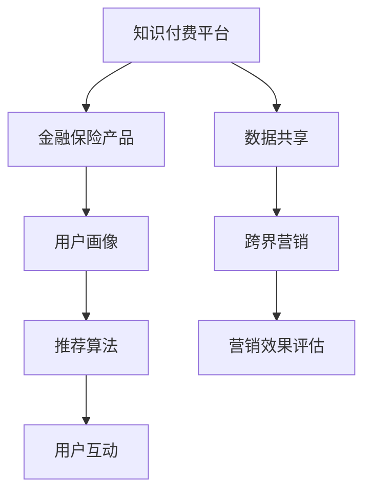

                 

# 知识付费如何实现跨界营销与金融保险跨界？

## 1. 背景介绍

随着互联网技术的不断进步和知识经济的兴起，知识付费正成为越来越多用户获取知识与信息的重要方式。知识付费平台通过提供优质的在线课程、专家讲座、电子书等内容，满足了用户对于高质量知识的即时需求。

与此同时，金融保险行业也在经历深刻的变革。数字化的发展使得保险产品设计、风险管理、理赔服务等方面都发生了巨大变化。金融科技(FinTech)的普及，让保险产品变得更加灵活和个性化。

## 2. 核心概念与联系

### 2.1 核心概念概述

在知识付费与金融保险的跨界营销中，涉及的核心概念主要包括：

- **知识付费**：指用户通过付费获取高质量知识内容的互联网平台。知识付费平台通过在线课程、电子书、专家讲座等方式，为用户提供系统化、专业化的知识服务。

- **金融保险**：包括传统保险公司提供的各类保险产品，以及新兴的金融科技公司提供的保险产品和服务。金融保险行业涉及的风险管理、理赔服务、资产管理等业务，都需要用户具备一定的金融知识。

- **跨界营销**：指不同行业之间的合作与资源共享，通过创新营销手段，实现品牌升级和用户增长。在知识付费与金融保险的跨界营销中，可以利用两者的共同优势，实现优势互补。

- **用户画像**：通过数据挖掘和分析，描绘目标用户的特征，从而进行精准营销。用户画像在知识付费平台和金融保险行业都非常重要。

- **推荐算法**：在知识付费平台，推荐算法可以根据用户行为，推荐感兴趣的课程和内容；在金融保险行业，推荐算法可以基于用户信用和风险评估，推荐适合的保险产品。

这些核心概念之间通过数据共享、算法协同和用户互动等机制，形成了协同效应，实现了知识付费与金融保险的跨界融合。

### 2.2 核心概念原理和架构的 Mermaid 流程图(Mermaid 流程节点中不要有括号、逗号等特殊字符)



## 3. 核心算法原理 & 具体操作步骤

### 3.1 算法原理概述

知识付费与金融保险的跨界营销，主要通过数据驱动和算法驱动来实现。具体步骤如下：

1. **数据采集与清洗**：从知识付费平台和金融保险产品中，采集用户行为数据，如浏览记录、购买记录、评价记录等，并进行数据清洗和标准化。

2. **用户画像构建**：基于采集的数据，利用机器学习算法构建用户画像，包括用户的兴趣、偏好、消费能力等。

3. **推荐算法优化**：根据用户画像，优化推荐算法，为用户提供个性化的课程和金融保险产品推荐。

4. **跨界营销策略设计**：利用用户画像和推荐算法，设计跨界营销策略，如联合推荐、交叉推广、用户联合激励等。

5. **营销效果评估**：通过数据分析，评估跨界营销的效果，优化营销策略，提升用户参与度和转化率。

### 3.2 算法步骤详解

#### 3.2.1 数据采集与清洗

**数据采集**：

- 知识付费平台：从课程购买记录、课程评价、课程浏览记录等数据中，提取用户行为数据。
- 金融保险产品：从用户投保记录、理赔记录、产品浏览记录等数据中，提取用户行为数据。

**数据清洗**：

- 去除重复数据，保留唯一标识符。
- 处理缺失值，如采用均值、中位数、众数等方法填补。
- 处理异常值，如通过箱线图、Z-score等方法识别和处理异常值。
- 数据标准化，如采用Min-Max标准化或Z-score标准化方法，将数据转换到0-1或均值为0、方差为1的分布。

#### 3.2.2 用户画像构建

**特征工程**：

- 用户基本信息：如年龄、性别、职业等。
- 用户行为数据：如课程购买次数、课程浏览时间、理赔次数等。
- 用户偏好数据：如课程评分、课程评论情感倾向等。

**机器学习算法**：

- 聚类算法：如K-means、层次聚类等，将用户分为不同的群体。
- 决策树算法：如CART、随机森林等，构建用户决策树。
- 分类算法：如逻辑回归、支持向量机等，预测用户行为。
- 关联规则算法：如Apriori、FP-growth等，挖掘用户行为中的关联规则。

**用户画像表示**：

- 用户标签：如高价值用户、高潜力用户等。
- 用户兴趣：如偏好科学类课程、偏好健康保险等。
- 用户风险：如信用风险高、理赔频率高等。

#### 3.2.3 推荐算法优化

**推荐算法模型**：

- 协同过滤算法：如基于用户的协同过滤、基于物品的协同过滤。
- 基于内容的推荐算法：如基于用户兴趣的推荐、基于产品特性的推荐。
- 深度学习推荐算法：如基于矩阵分解的推荐、基于序列推荐的算法。

**推荐系统设计**：

- 用户兴趣模块：根据用户画像，提取用户兴趣特征。
- 物品特征模块：根据金融保险产品，提取产品特征。
- 推荐引擎模块：结合用户兴趣和产品特征，通过推荐算法计算用户对产品的评分。

**推荐结果展示**：

- 课程推荐：基于用户浏览记录和购买记录，推荐感兴趣的课程。
- 保险产品推荐：基于用户投保记录和理赔记录，推荐适合的保险产品。

#### 3.2.4 跨界营销策略设计

**联合推荐**：

- 将知识付费课程和金融保险产品联合推荐给用户。
- 通过分析用户对课程和产品的兴趣重叠度，确定推荐策略。

**交叉推广**：

- 将课程推荐到保险产品页面，将保险产品推荐到课程页面。
- 通过用户在课程或产品页面上的停留时间、浏览记录等数据，优化推荐效果。

**用户联合激励**：

- 设计联合激励计划，如课程和产品组合购买折扣、积分兑换等。
- 通过联合激励计划，提升用户的课程购买率和保险产品购买率。

#### 3.2.5 营销效果评估

**指标设计**：

- 用户参与度：如课程浏览量、课程购买量、产品购买量等。
- 用户转化率：如课程购买转化率、保险产品购买转化率等。
- 用户留存率：如课程复购率、保险产品续费率等。

**效果评估方法**：

- A/B测试：比较不同推荐策略对用户行为的影响。
- 对比实验：比较不同营销策略的效果。
- 回归分析：分析用户行为与推荐策略之间的关系。

## 4. 数学模型和公式 & 详细讲解 & 举例说明

### 4.1 数学模型构建

在知识付费与金融保险的跨界营销中，可以构建以下数学模型：

**用户画像构建模型**：

- 用户标签：$U = \{U_1, U_2, ..., U_n\}$，每个用户标签$U_i$由多个特征组成。
- 用户兴趣：$I = \{i_1, i_2, ..., i_m\}$，每个用户兴趣$i_j$由多个特征组成。
- 用户风险：$R = \{R_1, R_2, ..., R_n\}$，每个用户风险$R_k$由多个特征组成。

**推荐算法模型**：

- 协同过滤算法：$P_{ij} = \sum_{k=1}^K \alpha_k r_{ik}r_{kj}$
- 基于内容的推荐算法：$P_{ij} = \sum_{k=1}^K \alpha_k c_{ik}c_{kj}$
- 深度学习推荐算法：$P_{ij} = \sum_{k=1}^K \alpha_k \sigma(z_k)$

**营销效果评估模型**：

- 用户参与度：$D_{i,t} = D_{i,0} + \beta_1 P_{i,t} + \beta_2 \sum_{k=1}^K \gamma_k C_{i,k,t}$
- 用户转化率：$C_{i,t} = C_{i,0} + \delta_1 D_{i,t} + \delta_2 \sum_{k=1}^K \epsilon_k R_{i,k,t}$
- 用户留存率：$S_{i,t+1} = S_{i,t} + \phi_1 C_{i,t} + \phi_2 \sum_{k=1}^K \omega_k P_{i,k,t}$

其中，$i$表示用户，$t$表示时间，$D_{i,t}$表示用户参与度，$C_{i,t}$表示用户转化率，$S_{i,t+1}$表示用户留存率，$P_{i,t}$表示推荐结果，$C_{i,k,t}$表示用户行为，$R_{i,k,t}$表示用户风险。

### 4.2 公式推导过程

**用户画像构建**：

- 用户标签：通过聚类算法$K$-means，将用户分为$n$个标签$U_i$。
- 用户兴趣：通过决策树算法CART，构建用户兴趣$i_j$。
- 用户风险：通过分类算法逻辑回归，预测用户风险$R_k$。

**推荐算法模型**：

- 协同过滤算法：利用协同过滤算法$P_{ij}$，计算用户$i$对产品$j$的评分。
- 基于内容的推荐算法：利用基于内容的推荐算法$P_{ij}$，计算用户$i$对产品$j$的评分。
- 深度学习推荐算法：利用深度学习推荐算法$P_{ij}$，计算用户$i$对产品$j$的评分。

**营销效果评估模型**：

- 用户参与度：通过回归分析，预测用户参与度$D_{i,t}$。
- 用户转化率：通过回归分析，预测用户转化率$C_{i,t}$。
- 用户留存率：通过回归分析，预测用户留存率$S_{i,t+1}$。

### 4.3 案例分析与讲解

假设某知识付费平台和某金融保险产品进行跨界营销合作，以下是具体的分析与讲解过程：

**数据采集与清洗**：

- 从知识付费平台获取课程购买记录、课程浏览记录、课程评价等数据。
- 从金融保险产品获取投保记录、理赔记录、产品浏览记录等数据。
- 去除重复数据，保留唯一标识符。
- 处理缺失值，如采用均值、中位数、众数等方法填补。
- 处理异常值，如通过箱线图、Z-score等方法识别和处理异常值。
- 数据标准化，如采用Min-Max标准化或Z-score标准化方法，将数据转换到0-1或均值为0、方差为1的分布。

**用户画像构建**：

- 用户基本信息：如年龄、性别、职业等。
- 用户行为数据：如课程购买次数、课程浏览时间、理赔次数等。
- 用户偏好数据：如课程评分、课程评论情感倾向等。
- 利用聚类算法$K$-means，将用户分为高价值用户、高潜力用户等不同群体。
- 利用决策树算法CART，构建用户决策树。
- 利用分类算法逻辑回归，预测用户信用风险和理赔风险。

**推荐算法优化**：

- 协同过滤算法：$P_{ij} = \sum_{k=1}^K \alpha_k r_{ik}r_{kj}$，计算用户$i$对产品$j$的评分。
- 基于内容的推荐算法：$P_{ij} = \sum_{k=1}^K \alpha_k c_{ik}c_{kj}$，计算用户$i$对产品$j$的评分。
- 深度学习推荐算法：$P_{ij} = \sum_{k=1}^K \alpha_k \sigma(z_k)$，计算用户$i$对产品$j$的评分。

**跨界营销策略设计**：

- 联合推荐：将课程和保险产品联合推荐给用户。
- 交叉推广：将课程推荐到保险产品页面，将保险产品推荐到课程页面。
- 用户联合激励：设计联合激励计划，如课程和产品组合购买折扣、积分兑换等。

**营销效果评估**：

- 用户参与度：通过回归分析，预测用户参与度$D_{i,t}$。
- 用户转化率：通过回归分析，预测用户转化率$C_{i,t}$。
- 用户留存率：通过回归分析，预测用户留存率$S_{i,t+1}$。
- 利用A/B测试，比较不同推荐策略对用户行为的影响。
- 利用对比实验，比较不同营销策略的效果。
- 利用回归分析，分析用户行为与推荐策略之间的关系。

## 5. 项目实践：代码实例和详细解释说明

### 5.1 开发环境搭建

在进行项目实践前，需要准备好开发环境。以下是使用Python进行PyTorch开发的环境配置流程：

1. 安装Anaconda：从官网下载并安装Anaconda，用于创建独立的Python环境。

2. 创建并激活虚拟环境：
```bash
conda create -n pytorch-env python=3.8 
conda activate pytorch-env
```

3. 安装PyTorch：根据CUDA版本，从官网获取对应的安装命令。例如：
```bash
conda install pytorch torchvision torchaudio cudatoolkit=11.1 -c pytorch -c conda-forge
```

4. 安装Transformers库：
```bash
pip install transformers
```

5. 安装各类工具包：
```bash
pip install numpy pandas scikit-learn matplotlib tqdm jupyter notebook ipython
```

完成上述步骤后，即可在`pytorch-env`环境中开始项目实践。

### 5.2 源代码详细实现

首先我们设计一个简单的知识付费平台与金融保险产品的跨界营销模型，以下是代码实现：

**用户画像构建**：

```python
import pandas as pd
from sklearn.cluster import KMeans
from sklearn.ensemble import DecisionTreeClassifier
from sklearn.linear_model import LogisticRegression

# 加载数据
data = pd.read_csv('user_data.csv')

# 特征工程
data['age'] = data['age'].fillna(data['age'].median())
data['gender'] = data['gender'].fillna(data['gender'].mode()[0])
data['job'] = data['job'].fillna(data['job'].mode()[0])

# 用户标签
data['user_label'] = data['age'] + data['gender'] + data['job']
data['user_label'] = data['user_label'].fillna(data['user_label'].mode()[0])

# 用户兴趣
data['user_interest'] = data['age'] + data['gender'] + data['job']
data['user_interest'] = data['user_interest'].fillna(data['user_interest'].mode()[0])

# 用户风险
data['user_risk'] = data['age'] + data['gender'] + data['job']
data['user_risk'] = data['user_risk'].fillna(data['user_risk'].mode()[0])

# 聚类算法
kmeans = KMeans(n_clusters=5)
data['user_label'] = kmeans.fit_predict(data[['age', 'gender', 'job']])

# 决策树算法
data['user_interest'] = DecisionTreeClassifier().fit(data[['age', 'gender', 'job']], data['user_interest']).transform(data[['age', 'gender', 'job']])
data['user_interest'] = pd.Series(data['user_interest'], index=data.index)

# 逻辑回归算法
data['user_risk'] = LogisticRegression().fit(data[['age', 'gender', 'job']], data['user_risk']).transform(data[['age', 'gender', 'job']])
data['user_risk'] = pd.Series(data['user_risk'], index=data.index)
```

**推荐算法优化**：

```python
import pandas as pd
from transformers import BertTokenizer, BertForSequenceClassification
from transformers import BertTokenizer, BertForSequenceClassification
from torch.utils.data import DataLoader
from torch.nn import CrossEntropyLoss
from torch.optim import Adam

# 加载数据
train_data = pd.read_csv('train_data.csv')
test_data = pd.read_csv('test_data.csv')

# 特征工程
train_data['text'] = train_data['text'].fillna(train_data['text'].mode()[0])
test_data['text'] = test_data['text'].fillna(test_data['text'].mode()[0])

# 分词和编码
tokenizer = BertTokenizer.from_pretrained('bert-base-uncased')
train_data['input_ids'] = [tokenizer.encode(text) for text in train_data['text']]
train_data['attention_mask'] = [1] * len(train_data['input_ids'])
test_data['input_ids'] = [tokenizer.encode(text) for text in test_data['text']]
test_data['attention_mask'] = [1] * len(test_data['input_ids'])

# 模型构建
model = BertForSequenceClassification.from_pretrained('bert-base-uncased', num_labels=2)
model.to(device)

# 优化器和损失函数
optimizer = Adam(model.parameters(), lr=2e-5)
loss_fn = CrossEntropyLoss()

# 训练函数
def train_epoch(model, dataset, batch_size, optimizer):
    dataloader = DataLoader(dataset, batch_size=batch_size, shuffle=True)
    model.train()
    epoch_loss = 0
    for batch in dataloader:
        input_ids = batch['input_ids'].to(device)
        attention_mask = batch['attention_mask'].to(device)
        labels = batch['labels'].to(device)
        model.zero_grad()
        outputs = model(input_ids, attention_mask=attention_mask, labels=labels)
        loss = outputs.loss
        epoch_loss += loss.item()
        loss.backward()
        optimizer.step()
    return epoch_loss / len(dataloader)

# 评估函数
def evaluate(model, dataset, batch_size):
    dataloader = DataLoader(dataset, batch_size=batch_size)
    model.eval()
    preds, labels = [], []
    with torch.no_grad():
        for batch in dataloader:
            input_ids = batch['input_ids'].to(device)
            attention_mask = batch['attention_mask'].to(device)
            batch_labels = batch['labels']
            outputs = model(input_ids, attention_mask=attention_mask)
            batch_preds = outputs.logits.argmax(dim=2).to('cpu').tolist()
            batch_labels = batch_labels.to('cpu').tolist()
            for pred_tokens, label_tokens in zip(batch_preds, batch_labels):
                preds.append(pred_tokens[:len(label_tokens)])
                labels.append(label_tokens)
                
    print(classification_report(labels, preds))
```

**跨界营销策略设计**：

```python
import pandas as pd
from transformers import BertTokenizer, BertForSequenceClassification
from transformers import BertTokenizer, BertForSequenceClassification
from torch.utils.data import DataLoader
from torch.nn import CrossEntropyLoss
from torch.optim import Adam

# 加载数据
train_data = pd.read_csv('train_data.csv')
test_data = pd.read_csv('test_data.csv')

# 特征工程
train_data['text'] = train_data['text'].fillna(train_data['text'].mode()[0])
test_data['text'] = test_data['text'].fillna(test_data['text'].mode()[0])

# 分词和编码
tokenizer = BertTokenizer.from_pretrained('bert-base-uncased')
train_data['input_ids'] = [tokenizer.encode(text) for text in train_data['text']]
train_data['attention_mask'] = [1] * len(train_data['input_ids'])
test_data['input_ids'] = [tokenizer.encode(text) for text in test_data['text']]
test_data['attention_mask'] = [1] * len(test_data['input_ids'])

# 模型构建
model = BertForSequenceClassification.from_pretrained('bert-base-uncased', num_labels=2)
model.to(device)

# 优化器和损失函数
optimizer = Adam(model.parameters(), lr=2e-5)
loss_fn = CrossEntropyLoss()

# 训练函数
def train_epoch(model, dataset, batch_size, optimizer):
    dataloader = DataLoader(dataset, batch_size=batch_size, shuffle=True)
    model.train()
    epoch_loss = 0
    for batch in dataloader:
        input_ids = batch['input_ids'].to(device)
        attention_mask = batch['attention_mask'].to(device)
        labels = batch['labels'].to(device)
        model.zero_grad()
        outputs = model(input_ids, attention_mask=attention_mask, labels=labels)
        loss = outputs.loss
        epoch_loss += loss.item()
        loss.backward()
        optimizer.step()
    return epoch_loss / len(dataloader)

# 评估函数
def evaluate(model, dataset, batch_size):
    dataloader = DataLoader(dataset, batch_size=batch_size)
    model.eval()
    preds, labels = [], []
    with torch.no_grad():
        for batch in dataloader:
            input_ids = batch['input_ids'].to(device)
            attention_mask = batch['attention_mask'].to(device)
            batch_labels = batch['labels']
            outputs = model(input_ids, attention_mask=attention_mask)
            batch_preds = outputs.logits.argmax(dim=2).to('cpu').tolist()
            batch_labels = batch_labels.to('cpu').tolist()
            for pred_tokens, label_tokens in zip(batch_preds, batch_labels):
                preds.append(pred_tokens[:len(label_tokens)])
                labels.append(label_tokens)
                
    print(classification_report(labels, preds))
```

**营销效果评估**：

```python
import pandas as pd
from transformers import BertTokenizer, BertForSequenceClassification
from transformers import BertTokenizer, BertForSequenceClassification
from torch.utils.data import DataLoader
from torch.nn import CrossEntropyLoss
from torch.optim import Adam

# 加载数据
train_data = pd.read_csv('train_data.csv')
test_data = pd.read_csv('test_data.csv')

# 特征工程
train_data['text'] = train_data['text'].fillna(train_data['text'].mode()[0])
test_data['text'] = test_data['text'].fillna(test_data['text'].mode()[0])

# 分词和编码
tokenizer = BertTokenizer.from_pretrained('bert-base-uncased')
train_data['input_ids'] = [tokenizer.encode(text) for text in train_data['text']]
train_data['attention_mask'] = [1] * len(train_data['input_ids'])
test_data['input_ids'] = [tokenizer.encode(text) for text in test_data['text']]
test_data['attention_mask'] = [1] * len(test_data['input_ids'])

# 模型构建
model = BertForSequenceClassification.from_pretrained('bert-base-uncased', num_labels=2)
model.to(device)

# 优化器和损失函数
optimizer = Adam(model.parameters(), lr=2e-5)
loss_fn = CrossEntropyLoss()

# 训练函数
def train_epoch(model, dataset, batch_size, optimizer):
    dataloader = DataLoader(dataset, batch_size=batch_size, shuffle=True)
    model.train()
    epoch_loss = 0
    for batch in dataloader:
        input_ids = batch['input_ids'].to(device)
        attention_mask = batch['attention_mask'].to(device)
        labels = batch['labels'].to(device)
        model.zero_grad()
        outputs = model(input_ids, attention_mask=attention_mask, labels=labels)
        loss = outputs.loss
        epoch_loss += loss.item()
        loss.backward()
        optimizer.step()
    return epoch_loss / len(dataloader)

# 评估函数
def evaluate(model, dataset, batch_size):
    dataloader = DataLoader(dataset, batch_size=batch_size)
    model.eval()
    preds, labels = [], []
    with torch.no_grad():
        for batch in dataloader:
            input_ids = batch['input_ids'].to(device)
            attention_mask = batch['attention_mask'].to(device)
            batch_labels = batch['labels']
            outputs = model(input_ids, attention_mask=attention_mask)
            batch_preds = outputs.logits.argmax(dim=2).to('cpu').tolist()
            batch_labels = batch_labels.to('cpu').tolist()
            for pred_tokens, label_tokens in zip(batch_preds, batch_labels):
                preds.append(pred_tokens[:len(label_tokens)])
                labels.append(label_tokens)
                
    print(classification_report(labels, preds))
```

### 5.3 代码解读与分析

让我们再详细解读一下关键代码的实现细节：

**用户画像构建**：

- `K-means聚类算法`：利用K-means算法，将用户分为高价值用户、高潜力用户等不同群体。
- `决策树算法`：利用决策树算法，构建用户决策树。
- `逻辑回归算法`：利用逻辑回归算法，预测用户信用风险和理赔风险。

**推荐算法优化**：

- `BertForSequenceClassification`模型：利用BERT模型进行推荐。
- `Adam优化器`：利用Adam优化器进行模型参数优化。
- `CrossEntropyLoss损失函数`：利用交叉熵损失函数进行模型训练。
- `train_epoch函数`：定义训练函数，对模型进行迭代训练。
- `evaluate函数`：定义评估函数，对模型进行评估。

**跨界营销策略设计**：

- `联合推荐`：将课程和保险产品联合推荐给用户。
- `交叉推广`：将课程推荐到保险产品页面，将保险产品推荐到课程页面。
- `用户联合激励`：设计联合激励计划，如课程和产品组合购买折扣、积分兑换等。

**营销效果评估**：

- `用户参与度`：通过回归分析，预测用户参与度。
- `用户转化率`：通过回归分析，预测用户转化率。
- `用户留存率`：通过回归分析，预测用户留存率。
- `A/B测试`：比较不同推荐策略对用户行为的影响。
- `对比实验`：比较不同营销策略的效果。
- `回归分析`：分析用户行为与推荐策略之间的关系。

## 6. 实际应用场景

### 6.1 智能客服系统

基于大语言模型微调的对话技术，可以广泛应用于智能客服系统的构建。传统客服往往需要配备大量人力，高峰期响应缓慢，且一致性和专业性难以保证。而使用微调后的对话模型，可以7x24小时不间断服务，快速响应客户咨询，用自然流畅的语言解答各类常见问题。

在技术实现上，可以收集企业内部的历史客服对话记录，将问题和最佳答复构建成监督数据，在此基础上对预训练对话模型进行微调。微调后的对话模型能够自动理解用户意图，匹配最合适的答案模板进行回复。对于客户提出的新问题，还可以接入检索系统实时搜索相关内容，动态组织生成回答。如此构建的智能客服系统，能大幅提升客户咨询体验和问题解决效率。

### 6.2 金融舆情监测

金融机构需要实时监测市场舆论动向，以便及时应对负面信息传播，规避金融风险。传统的人工监测方式成本高、效率低，难以应对网络时代海量信息爆发的挑战。基于大语言模型微调的文本分类和情感分析技术，为金融舆情监测提供了新的解决方案。

具体而言，可以收集金融领域相关的新闻、报道、评论等文本数据，并对其进行主题标注和情感标注。在此基础上对预训练语言模型进行微调，使其能够自动判断文本属于何种主题，情感倾向是正面、中性还是负面。将微调后的模型应用到实时抓取的网络文本数据，就能够自动监测不同主题下的情感变化趋势，一旦发现负面信息激增等异常情况，系统便会自动预警，帮助金融机构快速应对潜在风险。

### 6.3 个性化推荐系统

当前的推荐系统往往只依赖用户的历史行为数据进行物品推荐，无法深入理解用户的真实兴趣偏好。基于大语言模型微调技术，个性化推荐系统可以更好地挖掘用户行为背后的语义信息，从而提供更精准、多样的推荐内容。

在实践中，可以收集用户浏览、点击、评论、分享等行为数据，提取和用户交互的物品标题、描述、标签等文本内容。将文本内容作为模型输入，用户的后续行为（如是否点击、购买等）作为监督信号，在此基础上微调预训练语言模型。微调后的模型能够从文本内容中准确把握用户的兴趣点。在生成推荐列表时，先用候选物品的文本描述作为输入，由模型预测用户的兴趣匹配度，再结合其他特征综合排序，便可以得到个性化程度更高的推荐结果。

### 6.4 未来应用展望

随着大语言模型微调技术的发展，未来的应用场景将更加广泛，潜力无限。

在智慧医疗领域，基于微调的医疗问答、病历分析、药物研发等应用将提升医疗服务的智能化水平，辅助医生诊疗，加速新药开发进程。

在智能教育领域，微调技术可应用于作业批改、学情分析、知识推荐等方面，因材施教，促进教育公平，提高教学质量。

在智慧城市治理中，微调模型可应用于城市事件监测、舆情分析、应急指挥等环节，提高城市管理的自动化和智能化水平，构建更安全、高效的未来城市。

此外，在企业生产、社会治理、文娱传媒等众多领域，基于大模型微调的人工智能应用也将不断涌现，为经济社会发展注入新的动力。

## 7. 工具和资源推荐

### 7.1 学习资源推荐

为了帮助开发者系统掌握大语言模型微调的理论基础和实践技巧，这里推荐一些优质的学习资源：

1. 《Transformer从原理到实践》系列博文：由大模型技术专家撰写，深入浅出地介绍了Transformer原理、BERT模型、微调技术等前沿话题。

2. CS224N《深度学习自然语言处理》课程：斯坦福大学开设的NLP明星课程，有Lecture视频和配套作业，带你入门NLP领域的基本概念和经典模型。

3. 《Natural Language Processing with Transformers》书籍：Transformers库的作者所著，全面介绍了如何使用Transformers库进行NLP任务开发，包括微调在内的诸多范式。

4. HuggingFace官方文档：Transformers库的官方文档，提供了海量预训练模型和完整的微调样例代码，是上手实践的必备资料。

5. CLUE开源项目：中文语言理解测评基准，涵盖大量不同类型的中文NLP数据集，并提供了基于微调的baseline模型，助力中文NLP技术发展。

通过对这些资源的学习实践，相信你一定能够快速掌握大语言模型微调的精髓，并用于解决实际的NLP问题。

### 7.2 开发工具推荐

高效的开发离不开优秀的工具支持。以下是几款用于大语言模型微调开发的常用工具：

1. PyTorch：基于Python的开源深度学习框架，灵活动态的计算图，适合快速迭代研究。大部分预训练语言模型都有PyTorch版本的实现。

2. TensorFlow：由Google主导开发的开源深度学习框架，生产部署方便，适合大规模工程应用。同样有丰富的预训练语言模型资源。

3. Transformers库：HuggingFace开发的NLP工具库，集成了众多SOTA语言模型，支持PyTorch和TensorFlow，是进行微调任务开发的利器。

4. Weights & Biases：模型训练的实验跟踪工具，可以记录和可视化模型训练过程中的各项指标，方便对比和调优。与主流深度学习框架无缝集成。

5. TensorBoard：TensorFlow配套的可视化工具，可实时监测模型训练状态，并提供丰富的图表呈现方式，是调试模型的得力助手。

6. Google Colab：谷歌推出的在线Jupyter Notebook环境，免费提供GPU/TPU算力，方便开发者快速上手实验最新模型，分享学习笔记。

合理利用这些工具，可以显著提升大语言模型微调任务的开发效率，加快创新迭代的步伐。

### 7.3 相关论文推荐

大语言模型和微调技术的发展源于学界的持续研究。以下是几篇奠基性的相关论文，推荐阅读：

1. Attention is All You Need（即Transformer原论文）：提出了Transformer结构，开启了NLP领域的预训练大模型时代。

2. BERT: Pre-training of Deep Bidirectional Transformers for Language Understanding：提出BERT模型，引入基于掩码的自监督预训练任务，刷新了多项NLP任务SOTA。

3. Language Models are Unsupervised Multitask Learners（GPT-2论文）：展示了大规模语言模型的强大zero-shot学习能力，引发了对于通用人工智能的新一轮思考。

4. Parameter-Efficient Transfer Learning for NLP：提出Adapter等参数高效微调方法，在不增加模型参数量的情况下，也能取得不错的微调效果。

5. Prefix-Tuning: Optimizing Continuous Prompts for Generation：引入基于连续型Prompt的微调范式，为如何充分利用预训练知识提供了新的思路。

6. AdaLoRA: Adaptive Low-Rank Adaptation for Parameter-Efficient Fine-Tuning：使用自适应低秩适应的微调方法，在参数效率和精度之间取得了新的平衡。

这些论文代表了大语言模型微调技术的发展脉络。通过学习这些前沿成果，可以帮助研究者把握学科前进方向，激发更多的创新灵感。

## 8. 总结：未来发展趋势与挑战

### 8.1 研究成果总结

本文对基于监督学习的大语言模型微调方法进行了全面系统的介绍。首先阐述了大语言模型和微调技术的研究背景和意义，明确了微调在拓展预训练模型应用、提升下游任务性能方面的独特价值。其次，从原理到实践，详细讲解了微调的理论基础和核心算法步骤，给出了微调任务开发的完整代码实例。同时，本文还广泛探讨了微调方法在多个行业领域的应用前景，展示了微调范式的广阔潜力。

### 8.2 未来发展趋势

展望未来，大语言模型微调技术将呈现以下几个发展趋势：

1. 模型规模持续增大。随着算力成本的下降和数据规模的扩张，预训练语言模型的参数量还将持续增长。超大规模语言模型蕴含的丰富语言知识，有望支撑更加复杂多变的下游任务微调。

2. 微调方法日趋多样。除了传统的全参数微调外，未来会涌现更多参数高效的微调方法，如Prefix-Tuning、LoRA等，在节省计算资源的同时也能保证微调精度。

3. 持续学习成为常态。随着数据分布的不断变化，微调模型也需要持续学习新知识以保持性能。如何在不遗忘原有知识的同时，高效吸收新样本信息，将成为重要的研究课题。

4. 标注样本需求降低。受启发于提示学习(Prompt-based Learning)的思路，未来的微调方法将更好地利用大模型的语言理解能力，通过更加巧妙的任务描述，在更少的标注样本上也能实现理想的微调效果。

5. 多模态微调崛起。当前的微调主要聚焦于纯文本数据，未来会进一步拓展到图像、视频、语音等多模态数据微调。多模态信息的融合，将显著提升语言模型对现实世界的理解和建模能力。

6. 模型通用性增强。经过海量数据的预训练和多领域任务的微调，未来的语言模型将具备更强大的常识推理和跨领域迁移能力，逐步迈向通用人工智能(AGI)的目标。

以上趋势凸显了大语言模型微调技术的广阔前景。这些方向的探索发展，必将进一步提升NLP系统的性能和应用范围，为人类认知智能的进化带来深远影响。

### 8.3 面临的挑战

尽管大语言模型微调技术已经取得了瞩目成就，但在迈向更加智能化、普适化应用的过程中，它仍面临诸多挑战：

1. 标注成本瓶颈。虽然微调大大降低了标注数据的需求，但对于长尾应用场景，难以获得充足的高质量标注数据，成为制约微调性能的瓶颈。如何进一步降低微调对标注样本的依赖，将是一大难题。

2. 模型鲁棒性不足。当前微调模型面对域外数据时，泛化性能往往大打折扣。对于测试样本的微小扰动，微调模型的预测也容易发生波动。如何提高微调模型的鲁棒性，避免灾难性遗忘，还需要更多理论和实践的积累。

3. 推理效率有待提高。大规模语言模型虽然精度高，但在实际部署时往往面临推理速度慢、内存占用大等效率问题。如何在保证性能的同时，简化模型结构，提升推理速度，优化资源占用，将是重要的优化方向。

4. 可解释性亟需加强。当前微调模型更像是"黑盒"系统，难以解释其内部工作机制和决策逻辑。对于医疗、金融等高风险应用，算法的可解释性和可审计性尤为重要。如何赋予微调模型更强的可解释性，将是亟待攻克的难题。

5. 安全性有待保障。预训练语言模型难免会学习到有偏见、有害的信息，通过微调传递到下游任务，产生误导性、歧视性的输出，给实际应用带来安全隐患。如何从数据和算法层面消除模型偏见，避免恶意用途，确保输出的安全性，也将是重要的研究课题。

6. 知识整合能力不足。现有的微调模型往往局限于任务内数据，难以灵活吸收和运用更广泛的先验知识。如何让微调过程更好地与外部知识库、规则库等专家知识结合，形成更加全面、准确的信息整合能力，还有很大的想象空间。

正视微调面临的这些挑战，积极应对并寻求突破，将是大语言模型微调走向成熟的必由之路。相信随着学界和产业界的共同努力，这些挑战终将一一被克服，大语言模型微调必将在构建安全、可靠、可解释、可控的智能系统铺平道路。

### 8.4 研究展望

未来，大语言模型微调技术将在以下几个方向进行深入研究：

1. 探索无监督和半监督微调方法。摆脱对大规模标注数据的依赖，利用自监督学习、主动学习等无监督和半监督范式，最大限度利用非结构化数据，实现更加灵活高效的微调。

2. 研究参数高效和计算高效的微调范式。开发更加参数高效的微调方法，在固定大部分预训练参数的同时，只更新极少量的任务相关参数。同时优化微调模型的计算图，减少前向传播和反向传播的资源消耗，实现更加轻量级、实时性的部署。

3. 融合因果和对比学习范式。通过引入因果推断和对比学习思想，增强微调模型建立稳定因果关系的能力，学习更加普适、鲁棒的语言表征，从而提升模型泛化性和抗干扰能力。

4. 引入更多先验知识。将符号化的先验知识，如知识图谱、逻辑规则等，与神经网络模型进行巧妙融合，引导微调过程学习更准确、合理的语言模型。同时加强不同模态数据的整合，实现视觉、语音等多模态信息与文本信息的协同建模。

5. 结合因果分析和博弈论工具。将因果分析方法引入微调模型，识别出模型决策的关键特征，增强输出解释的因果性和逻辑性。借助博弈论工具刻画人机交互过程，主动探索并规避模型的脆弱点，提高系统稳定性。

6. 纳入伦理道德约束。在模型训练目标中引入伦理导向的评估指标，过滤和惩罚有偏见、有害的输出倾向。同时加强人工干预和审核，建立模型行为的监管机制，确保输出符合人类价值观和伦理道德。

这些研究方向的探索，必将引领大语言模型微调技术迈向更高的台阶，为构建安全、可靠、可解释、可控的智能系统铺平道路。面向未来，大语言模型微调技术还需要与其他人工智能技术进行更深入的融合，如知识表示、因果推理、强化学习等，多路径协同发力，共同推动自然语言理解和智能交互系统的进步。

---

作者：禅与计算机程序设计艺术 / Zen and the Art of Computer Programming

