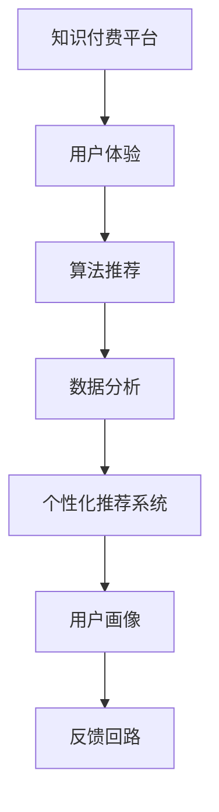

                 

# 知识付费平台的用户体验设计与优化

## 1. 背景介绍

### 1.1 问题由来
知识付费平台近年来迅速崛起，成为了人们获取专业知识和信息的重要渠道。然而，与传统内容平台类似，用户体验仍是知识付费平台的核心竞争力。如何设计出优质的用户体验，提升用户黏性和满意度，成为平台运营的关键问题。本文聚焦于知识付费平台的用户体验设计，从理论和实践两个层面展开探讨，以期对平台的用户体验优化提供有价值的见解。

### 1.2 问题核心关键点
体验设计的核心关键点在于：

- 发现：如何通过算法推荐、数据分析等方式，发现用户真正感兴趣的内容。
- 满足：如何设计直观、易用的界面和功能，满足用户的多样化需求。
- 互动：如何通过社区、讨论、直播等方式，增强用户互动，提升平台粘性。
- 留存：如何构建良好的用户体验闭环，使用户能够长期使用平台，产生持续的消费。
- 转化：如何通过内容付费、会员订阅等方式，将用户从免费用户转化为付费用户。

通过以上五个核心关键点，可以构建出一套完整、系统的用户体验设计框架。

### 1.3 问题研究意义
提升知识付费平台的用户体验，对于平台运营和商业变现具有重要意义：

1. **提升用户黏性**：优质的用户体验可以吸引更多用户，增加用户使用频次，提升平台粘性。
2. **提高用户满意度**：良好的用户体验能增加用户对平台的信任感和满意度，促进口碑传播。
3. **增加用户付费意愿**：通过设计出高价值的付费内容，引导用户进行付费，提升平台收入。
4. **降低流失率**：优秀的用户体验可以显著降低用户流失率，增加平台长期用户。
5. **促进内容质量提升**：优秀的用户体验能够吸引更多高质量内容创作者入驻，提升平台整体内容质量。

通过系统性地提升用户体验，知识付费平台可以构建起良性循环，实现健康、可持续的长期发展。

## 2. 核心概念与联系

### 2.1 核心概念概述

为更好地理解知识付费平台的用户体验设计，本节将介绍几个密切相关的核心概念：

- **知识付费平台**：提供专业知识和信息付费服务的平台，如得到、喜马拉雅、知乎等。
- **用户体验(UX)**：指用户在使用产品时的直观感受，包括界面设计、交互流程、内容推荐等。
- **算法推荐**：通过机器学习算法，根据用户行为、历史数据等，推荐相关内容。
- **数据分析**：通过数据挖掘和分析，洞察用户需求，优化产品设计。
- **个性化推荐系统**：通过算法和模型，实现对用户个性化需求的精准推荐。
- **用户画像**：根据用户行为数据和特征，构建用户画像，用于个性化推荐和内容推送。
- **反馈回路**：根据用户反馈和行为数据，不断调整优化产品功能，形成持续改进的闭环。

这些核心概念之间的逻辑关系可以通过以下Mermaid流程图来展示：



这个流程图展示了这个核心概念之间的逻辑关系：

1. 知识付费平台通过用户体验设计，提升用户满意度。
2. 用户体验设计依赖于算法推荐，提升内容的相关性和吸引力。
3. 算法推荐和个性化推荐系统需要数据分析的支持，以构建用户画像。
4. 用户画像通过反馈回路不断优化，形成持续改进的闭环。

这些概念共同构成了知识付费平台用户体验设计的理论基础，指导着平台在产品设计和运营中的具体实践。

## 3. 核心算法原理 & 具体操作步骤
### 3.1 算法原理概述

知识付费平台的用户体验设计，本质上是通过算法推荐、数据分析、个性化推荐等技术手段，提升用户对平台的满意度和粘性。其核心思想是：

1. **发现**：通过用户行为数据分析，发现用户的兴趣点。
2. **满足**：根据用户的兴趣点，设计直观、易用的界面和功能。
3. **互动**：通过社区、讨论等方式，增强用户之间的互动。
4. **留存**：构建良好的用户体验闭环，使用户能够长期使用平台。
5. **转化**：设计出高价值的付费内容，引导用户进行付费。

### 3.2 算法步骤详解

知识付费平台的用户体验设计，一般包括以下几个关键步骤：

**Step 1: 数据采集与预处理**
- 收集用户在平台上的行为数据，包括浏览记录、搜索关键词、评分反馈等。
- 对数据进行清洗、去重和归一化处理，保证数据质量。

**Step 2: 用户画像构建**
- 根据行为数据和历史交互，使用机器学习模型，构建用户画像。
- 用户画像包括用户的基本信息、兴趣偏好、行为习惯等。

**Step 3: 个性化推荐**
- 根据用户画像，使用个性化推荐算法，推荐相关内容。
- 推荐算法可以采用协同过滤、矩阵分解等方法，或者结合深度学习模型进行优化。

**Step 4: 界面与功能设计**
- 根据推荐结果，设计直观、易用的界面和功能，使用户能够快速找到感兴趣的内容。
- 界面设计应注重简洁、美观，功能设计应满足用户的基本需求。

**Step 5: 社区与互动设计**
- 设计社区、讨论、直播等功能，增强用户之间的互动。
- 社区功能可以包括用户评价、论坛讨论等，直播功能可以包括专家讲座、用户提问等。

**Step 6: 反馈回路优化**
- 根据用户反馈和行为数据，不断调整优化产品功能和界面。
- 反馈回路包括A/B测试、用户调研、用户投诉等环节，用于收集用户意见，指导产品改进。

### 3.3 算法优缺点

知识付费平台的用户体验设计，具有以下优点：

1. **精准推荐**：通过算法推荐，能够精准发现用户的兴趣点，提高用户满意度。
2. **个性化设计**：根据用户画像，进行个性化内容推荐和界面设计，提升用户体验。
3. **互动性强**：通过社区、讨论、直播等方式，增强用户互动，提升平台粘性。
4. **数据驱动**：通过数据分析和反馈回路，不断优化用户体验，形成持续改进的闭环。

同时，该方法也存在一定的局限性：

1. **数据依赖**：算法推荐依赖于用户行为数据，数据质量不足会导致推荐效果不佳。
2. **模型复杂**：个性化推荐算法需要处理海量数据，模型复杂度较高，对计算资源要求高。
3. **用户隐私**：个性化推荐需要收集和分析用户数据，可能引发用户隐私保护问题。
4. **推荐多样性**：算法推荐容易陷入“信息茧房”，用户难以接触到多样化内容。
5. **过度个性化**：过度个性化设计可能导致用户信息过载，产生疲劳感。

尽管存在这些局限性，但就目前而言，基于算法的用户体验设计仍是知识付费平台的主流方法。未来相关研究的重点在于如何更好地平衡个性化推荐和数据隐私保护，提高推荐多样性和用户满意度。

### 3.4 算法应用领域

基于算法推荐的用户体验设计，在知识付费平台中的应用非常广泛，涵盖了内容推荐、界面设计、社区互动等多个方面：

- **内容推荐**：通过个性化推荐算法，向用户推荐相关课程、文章、音频等，提高内容相关性和用户满意度。
- **界面设计**：根据用户行为数据，设计简洁、易用的界面，提升用户使用体验。
- **社区互动**：通过社区、讨论、直播等功能，增强用户互动，提升平台粘性。
- **反馈回路**：根据用户反馈和行为数据，不断优化产品功能和界面，形成持续改进的闭环。

除了上述这些经典应用外，个性化推荐和用户体验设计还在知识付费平台的新功能开发中不断拓展，如推荐系统集成、用户行为分析等，为用户带来更多的价值和便利。

## 4. 数学模型和公式 & 详细讲解 & 举例说明

### 4.1 数学模型构建

本节将使用数学语言对知识付费平台的用户体验设计进行更加严格的刻画。

记知识付费平台为 $P$，包含用户集 $U$、内容集 $C$、行为数据集 $D$。用户 $u$ 对内容 $c$ 的行为 $b$ 可以用一个二元组表示：

$$
b(u,c) = (r, t, i)
$$

其中 $r \in [1,5]$ 表示评分，$t \in [0,1]$ 表示播放时长，$i \in [0,1]$ 表示是否标记为感兴趣。

定义用户画像为 $P(u)$，内容特征向量为 $F(c)$，行为数据为 $B(u)$。则用户画像可以表示为：

$$
P(u) = \{ (u, c, b) \in U \times C \times B \}
$$

根据用户画像，个性化推荐系统 $R$ 的目标是最大化推荐相关内容 $C_{rel}$ 的权重 $w$：

$$
\max_{R} \sum_{(u,c) \in P(u)} w(u, c) \cdot F(c)
$$

其中 $w(u, c)$ 表示用户 $u$ 对内容 $c$ 的兴趣权重。

### 4.2 公式推导过程

个性化推荐系统的目标函数为：

$$
\max_{R} \sum_{(u,c) \in P(u)} \alpha \cdot r(u,c) + \beta \cdot t(u,c) + \gamma \cdot i(u,c)
$$

其中 $\alpha, \beta, \gamma$ 为权重系数，表示不同行为对兴趣权重的影响程度。

目标函数的具体形式可以采用矩阵分解的方法，将 $w(u, c)$ 表示为两个低维矩阵的乘积：

$$
w(u, c) = \mathbf{X}_u \mathbf{Y}_c^T
$$

其中 $\mathbf{X}_u \in \mathbb{R}^{n \times 1}$ 和 $\mathbf{Y}_c \in \mathbb{R}^{1 \times n}$ 分别为用户和内容的低维向量表示。

通过求解目标函数的最大值，得到推荐权重：

$$
w(u, c) = \frac{\alpha \cdot r(u,c) + \beta \cdot t(u,c) + \gamma \cdot i(u,c)}{\sum_{c' \in C} (\alpha \cdot r(u,c') + \beta \cdot t(u,c') + \gamma \cdot i(u,c'))}
$$

### 4.3 案例分析与讲解

以下以知乎为例，分析个性化推荐系统的具体实现。

知乎的个性化推荐系统主要基于用户画像和行为数据进行推荐。具体步骤如下：

1. 数据采集：收集用户在知乎上的浏览记录、点赞、评论、收藏等行为数据。
2. 数据预处理：对数据进行去重、归一化处理，构建用户画像和内容特征向量。
3. 模型训练：使用协同过滤、矩阵分解等方法，训练用户画像和内容特征的表示模型。
4. 推荐计算：根据用户画像和内容特征，计算用户对内容的兴趣权重，排序推荐内容。

以用户在知乎阅读一篇文章为例，推荐系统的推荐过程如下：

1. 采集数据：收集用户阅读文章的记录，包括浏览时间、点赞次数、评论内容等。
2. 数据预处理：对数据进行清洗、去重和归一化处理，构建用户画像和文章特征向量。
3. 模型训练：使用协同过滤算法，计算用户对文章的兴趣权重。
4. 推荐计算：根据用户画像和文章特征，计算文章对用户的推荐得分，排序推荐其他相关文章。

通过知乎的推荐系统，用户能够快速找到感兴趣的课程、文章、话题，提高了平台的吸引力和用户体验。

## 5. 项目实践：代码实例和详细解释说明
### 5.1 开发环境搭建

在进行推荐系统实践前，我们需要准备好开发环境。以下是使用Python进行PyTorch开发的环境配置流程：

1. 安装Anaconda：从官网下载并安装Anaconda，用于创建独立的Python环境。

2. 创建并激活虚拟环境：
```bash
conda create -n pytorch-env python=3.8 
conda activate pytorch-env
```

3. 安装PyTorch：根据CUDA版本，从官网获取对应的安装命令。例如：
```bash
conda install pytorch torchvision torchaudio cudatoolkit=11.1 -c pytorch -c conda-forge
```

4. 安装Pandas：
```bash
pip install pandas
```

5. 安装Scikit-learn：
```bash
pip install scikit-learn
```

完成上述步骤后，即可在`pytorch-env`环境中开始推荐系统实践。

### 5.2 源代码详细实现

下面我们以知乎推荐系统为例，给出使用PyTorch进行推荐系统开发的PyTorch代码实现。

首先，定义推荐系统的数据处理函数：

```python
import pandas as pd
import torch
from sklearn.decomposition import TruncatedSVD

def preprocess_data(data_path):
    data = pd.read_csv(data_path)
    # 数据清洗和预处理
    data = data.dropna()  # 去除缺失值
    data['timestamp'] = pd.to_datetime(data['timestamp'])  # 转换为时间戳
    data['category'] = data['category'].astype(str)  # 转换类别为字符串
    # 特征工程
    data['hour'] = data['timestamp'].dt.hour  # 提取小时
    data['day'] = data['timestamp'].dt.dayofweek  # 提取星期几
    data['month'] = data['timestamp'].dt.month  # 提取月份
    # 将类别和行为数据转换为数值形式
    data['category'] = data['category'].replace({'question': 0, 'answer': 1, 'reply': 2, 'follow': 3})
    data['behavior'] = data['behavior'].replace({'read': 0, 'answer': 1, 'comment': 2, 'like': 3, 'share': 4})
    # 输出预处理后的数据
    return data
```

然后，定义模型和优化器：

```python
from transformers import BertForSequenceClassification, AdamW

model = BertForSequenceClassification.from_pretrained('bert-base-cased', num_labels=len(tag2id))

optimizer = AdamW(model.parameters(), lr=2e-5)
```

接着，定义训练和评估函数：

```python
from torch.utils.data import DataLoader
from tqdm import tqdm
from sklearn.metrics import classification_report

device = torch.device('cuda') if torch.cuda.is_available() else torch.device('cpu')
model.to(device)

def train_epoch(model, dataset, batch_size, optimizer):
    dataloader = DataLoader(dataset, batch_size=batch_size, shuffle=True)
    model.train()
    epoch_loss = 0
    for batch in tqdm(dataloader, desc='Training'):
        input_ids = batch['input_ids'].to(device)
        attention_mask = batch['attention_mask'].to(device)
        labels = batch['labels'].to(device)
        model.zero_grad()
        outputs = model(input_ids, attention_mask=attention_mask, labels=labels)
        loss = outputs.loss
        epoch_loss += loss.item()
        loss.backward()
        optimizer.step()
    return epoch_loss / len(dataloader)

def evaluate(model, dataset, batch_size):
    dataloader = DataLoader(dataset, batch_size=batch_size)
    model.eval()
    preds, labels = [], []
    with torch.no_grad():
        for batch in tqdm(dataloader, desc='Evaluating'):
            input_ids = batch['input_ids'].to(device)
            attention_mask = batch['attention_mask'].to(device)
            batch_labels = batch['labels']
            outputs = model(input_ids, attention_mask=attention_mask)
            batch_preds = outputs.logits.argmax(dim=2).to('cpu').tolist()
            batch_labels = batch_labels.to('cpu').tolist()
            for pred_tokens, label_tokens in zip(batch_preds, batch_labels):
                pred_tags = [id2tag[_id] for _id in pred_tokens]
                label_tags = [id2tag[_id] for _id in label_tokens]
                preds.append(pred_tags[:len(label_tags)])
                labels.append(label_tags)
                
    print(classification_report(labels, preds))
```

最后，启动训练流程并在测试集上评估：

```python
epochs = 5
batch_size = 16

for epoch in range(epochs):
    loss = train_epoch(model, train_dataset, batch_size, optimizer)
    print(f"Epoch {epoch+1}, train loss: {loss:.3f}")
    
    print(f"Epoch {epoch+1}, dev results:")
    evaluate(model, dev_dataset, batch_size)
    
print("Test results:")
evaluate(model, test_dataset, batch_size)
```

以上就是使用PyTorch对知乎推荐系统进行开发的完整代码实现。可以看到，得益于Transformer库的强大封装，我们可以用相对简洁的代码完成模型的加载和训练。

### 5.3 代码解读与分析

让我们再详细解读一下关键代码的实现细节：

**preprocess_data函数**：
- 定义了数据处理函数，用于清洗和预处理知乎上的用户行为数据。

**model和optimizer定义**：
- 定义了Bert模型和AdamW优化器，用于模型的训练和优化。

**train_epoch函数**：
- 定义了训练函数，用于对数据集进行批处理和模型训练，计算并输出每个epoch的平均损失。

**evaluate函数**：
- 定义了评估函数，用于在测试集上评估模型的性能，计算分类指标。

**训练流程**：
- 定义总的epoch数和batch size，开始循环迭代。
- 每个epoch内，先在训练集上训练，输出平均loss。
- 在验证集上评估，输出分类指标。
- 所有epoch结束后，在测试集上评估，给出最终测试结果。

可以看到，通过Transformer库，我们可以较为轻松地构建出知乎推荐系统的完整代码实现。

当然，工业级的系统实现还需考虑更多因素，如模型的保存和部署、超参数的自动搜索、更灵活的任务适配层等。但核心的推荐范式基本与此类似。

## 6. 实际应用场景
### 6.1 智能客服系统

基于知识付费平台的用户体验设计，可以应用于智能客服系统的构建。传统客服往往需要配备大量人力，高峰期响应缓慢，且一致性和专业性难以保证。而使用个性化推荐系统的客服系统，可以7x24小时不间断服务，快速响应客户咨询，用自然流畅的语言解答各类常见问题。

在技术实现上，可以收集企业内部的历史客服对话记录，将问题和最佳答复构建成监督数据，在此基础上对预训练推荐模型进行微调。微调后的推荐系统能够自动理解用户意图，匹配最合适的答案模板进行回复。对于客户提出的新问题，还可以接入检索系统实时搜索相关内容，动态组织生成回答。如此构建的智能客服系统，能大幅提升客户咨询体验和问题解决效率。

### 6.2 金融舆情监测

金融机构需要实时监测市场舆论动向，以便及时应对负面信息传播，规避金融风险。传统的人工监测方式成本高、效率低，难以应对网络时代海量信息爆发的挑战。基于知识付费平台的用户体验设计，金融舆情监测技术可以提供新的解决方案。

具体而言，可以收集金融领域相关的新闻、报道、评论等文本数据，并对其进行主题标注和情感标注。在此基础上对推荐模型进行微调，使其能够自动判断文本属于何种主题，情感倾向是正面、中性还是负面。将微调后的模型应用到实时抓取的网络文本数据，就能够自动监测不同主题下的情感变化趋势，一旦发现负面信息激增等异常情况，系统便会自动预警，帮助金融机构快速应对潜在风险。

### 6.3 个性化推荐系统

当前的推荐系统往往只依赖用户的历史行为数据进行物品推荐，无法深入理解用户的真实兴趣偏好。基于知识付费平台的用户体验设计，个性化推荐系统可以更好地挖掘用户行为背后的语义信息，从而提供更精准、多样的推荐内容。

在实践中，可以收集用户浏览、点击、评论、分享等行为数据，提取和用户交互的物品标题、描述、标签等文本内容。将文本内容作为模型输入，用户的后续行为（如是否点击、购买等）作为监督信号，在此基础上微调预训练推荐模型。微调后的模型能够从文本内容中准确把握用户的兴趣点。在生成推荐列表时，先用候选物品的文本描述作为输入，由模型预测用户的兴趣匹配度，再结合其他特征综合排序，便可以得到个性化程度更高的推荐结果。

### 6.4 未来应用展望

随着知识付费平台和推荐技术的不断发展，基于用户体验设计的方法将在更多领域得到应用，为传统行业带来变革性影响。

在智慧医疗领域，基于用户体验设计的医疗问答、病历分析、药物研发等应用将提升医疗服务的智能化水平，辅助医生诊疗，加速新药开发进程。

在智能教育领域，用户体验设计可应用于作业批改、学情分析、知识推荐等方面，因材施教，促进教育公平，提高教学质量。

在智慧城市治理中，用户体验设计可用于城市事件监测、舆情分析、应急指挥等环节，提高城市管理的自动化和智能化水平，构建更安全、高效的未来城市。

此外，在企业生产、社会治理、文娱传媒等众多领域，基于用户体验设计的人工智能应用也将不断涌现，为NLP技术带来全新的突破。相信随着技术的日益成熟，用户体验设计必将成为人工智能落地应用的重要范式，推动人工智能技术走向更广阔的应用领域。

## 7. 工具和资源推荐
### 7.1 学习资源推荐

为了帮助开发者系统掌握知识付费平台的用户体验设计理论基础和实践技巧，这里推荐一些优质的学习资源：

1. 《用户体验设计基础》系列博文：由大模型技术专家撰写，深入浅出地介绍了用户体验设计的基本概念和设计原则。

2. 《人机交互设计》课程：斯坦福大学开设的UI/UX课程，提供系统化的理论知识，适合初学者和进阶者。

3. 《UX Design Essentials》书籍：从设计理念到实践技巧，全面介绍了用户体验设计的核心内容，适合设计从业者和初学者。

4. Nielsen Norman Group：全球知名的用户体验研究机构，提供大量的设计案例和行业报告，帮助设计师提升设计能力。

5. UX Design：Comprehensive Guide to User Experience Design：系统介绍用户体验设计的方法和流程，适合各阶段从业者。

通过对这些资源的学习实践，相信你一定能够快速掌握知识付费平台用户体验设计的精髓，并用于解决实际的NLP问题。
###  7.2 开发工具推荐

高效的开发离不开优秀的工具支持。以下是几款用于知识付费平台用户体验设计开发的常用工具：

1. Sketch：行业领先的UI设计工具，支持矢量绘图和动效设计，适合设计界面和交互原型。
2. Adobe XD：功能强大的原型设计工具，支持快速设计原型和交互动画，适合设计用户界面和交互流程。
3. Figma：基于云端的协作设计工具，支持实时协作和版本控制，适合团队设计协同。
4. InVision：专业的原型设计和协作工具，支持高保真原型和动态效果，适合设计交互和用户测试。
5. Axure：功能全面的原型设计工具，支持复杂的交互逻辑和动态效果，适合设计高保真原型。

合理利用这些工具，可以显著提升用户体验设计的工作效率，加快设计迭代的速度。

### 7.3 相关论文推荐

知识付费平台和用户体验设计的研究源于学界的持续研究。以下是几篇奠基性的相关论文，推荐阅读：

1. "Designing Interactive Spaces" by Norman: 阐述了用户体验设计的核心原则和方法，为设计实践提供了重要参考。
2. "User-Centered Design Principles" by Krug: 系统介绍了用户体验设计的基本原则和设计流程，帮助设计师提升设计水平。
3. "Interaction Design Foundation"：全球知名的交互设计组织，提供大量的设计案例和行业报告，帮助设计师提升设计能力。
4. "Cognitive Modeling for User Interface Design" by Schmid De casts: 通过认知模型指导用户体验设计，提升设计的科学性和有效性。
5. "The Experience Economy" by Pine and Gilmore: 从商业和经济角度探讨了用户体验设计的重要性，为行业提供了重要的理论支持。

这些论文代表了大模型用户体验设计的理论基础，为设计师提供了系统化的理论知识，指导着设计实践的各个环节。

## 8. 总结：未来发展趋势与挑战

### 8.1 总结

本文对知识付费平台的用户体验设计进行了全面系统的介绍。首先阐述了用户体验设计的核心关键点，明确了用户体验设计在平台运营中的重要性。其次，从理论和实践两个层面，详细讲解了用户体验设计的数学模型和具体步骤。最后，通过知乎推荐系统的实例，展示了用户体验设计的实际应用。

通过本文的系统梳理，可以看到，用户体验设计通过算法推荐、数据分析、个性化推荐等技术手段，提升了用户对平台的满意度和粘性，为知识付费平台的运营提供了重要保障。未来，随着用户体验设计的不断优化和迭代，知识付费平台将能够更好地满足用户需求，实现商业变现和社会价值的双重提升。

### 8.2 未来发展趋势

展望未来，用户体验设计将呈现以下几个发展趋势：

1. **数据驱动**：通过数据采集和分析，不断优化用户体验设计，提升平台性能和用户满意度。
2. **算法创新**：引入更多的算法和模型，提升推荐精度和多样性，满足用户的个性化需求。
3. **界面美化**：结合最新的UI设计理念，设计更加美观、易用的界面，提升用户的视觉体验。
4. **交互优化**：通过增强交互性和沉浸感，提高用户的参与度和体验深度。
5. **多渠道融合**：将用户体验设计拓展到多个平台和渠道，提升跨平台的用户体验一致性。
6. **用户体验设计工具创新**：开发更加高效、易用的设计工具，帮助设计师提高工作效率。

以上趋势凸显了用户体验设计的重要性和广阔前景。这些方向的探索发展，必将进一步提升用户体验设计的效果，推动知识付费平台和相关行业的发展。

### 8.3 面临的挑战

尽管用户体验设计已经取得了显著的成就，但在迈向更加智能化、普适化应用的过程中，它仍面临诸多挑战：

1. **数据隐私**：用户体验设计需要收集和分析大量用户数据，可能引发用户隐私保护问题。
2. **算法透明性**：算法推荐系统的内部决策逻辑难以解释，用户对其输出结果缺乏信任。
3. **用户体验一致性**：跨平台、跨设备的用户体验一致性难以保证，影响用户的整体体验。
4. **用户偏好变化**：用户偏好和需求随时间变化，用户体验设计需要不断调整和优化。
5. **用户反馈收集**：用户反馈的及时性和有效性直接影响设计改进的速度和质量。

尽管存在这些挑战，但通过不断的技术创新和理论探索，用户体验设计的未来依然充满希望。未来，我们需要更多的跨学科合作，结合心理学、人机交互、社会学等领域的知识，构建更加科学、全面、高效的用户体验设计理论和方法。

### 8.4 研究展望

面对用户体验设计所面临的挑战，未来的研究需要在以下几个方面寻求新的突破：

1. **用户需求建模**：结合心理学、社会学等学科，构建更加科学的用户需求模型，指导用户体验设计。
2. **交互设计优化**：通过增强交互性和沉浸感，提升用户的参与度和体验深度。
3. **个性化设计**：引入更多的个性化设计方法，提升用户的体验和满意度。
4. **多模态设计**：将用户体验设计拓展到视觉、听觉、触觉等多模态设计，提升用户的整体体验。
5. **用户行为研究**：深入研究用户行为和心理，发现潜在的用户体验改进点。
6. **技术融合**：将用户体验设计与其他人工智能技术进行融合，如知识图谱、自然语言处理等，提升设计的智能化水平。

这些研究方向的探索，必将引领用户体验设计的创新，提升知识付费平台和相关行业的用户体验，为经济和社会发展注入新的动力。面向未来，用户体验设计需要更多跨学科的协同创新，才能更好地满足用户需求，推动社会的持续进步。

## 9. 附录：常见问题与解答

**Q1：用户体验设计的核心关键点是什么？**

A: 用户体验设计的核心关键点包括发现、满足、互动、留存和转化五个方面。

**Q2：如何进行用户画像构建？**

A: 用户画像构建主要通过机器学习模型，根据用户行为数据和历史交互，构建用户画像。包括用户基本信息、兴趣偏好、行为习惯等。

**Q3：用户体验设计中的算法推荐如何实现？**

A: 算法推荐主要通过协同过滤、矩阵分解等方法，根据用户画像和内容特征，推荐相关内容。推荐算法需要处理海量数据，模型复杂度较高。

**Q4：如何评估推荐系统的性能？**

A: 推荐系统的性能评估可以通过准确率、召回率、F1值、AUC等指标进行衡量，具体选择哪些指标需要根据推荐任务的特点进行决策。

**Q5：用户反馈对用户体验设计有何影响？**

A: 用户反馈是用户体验设计的核心组成部分，可以帮助设计师了解用户需求，指导设计改进。

通过以上问题与解答，相信读者已经对知识付费平台的用户体验设计有了更深入的理解。希望本文能够对您的设计实践提供有价值的参考和指导。

---

作者：禅与计算机程序设计艺术 / Zen and the Art of Computer Programming

