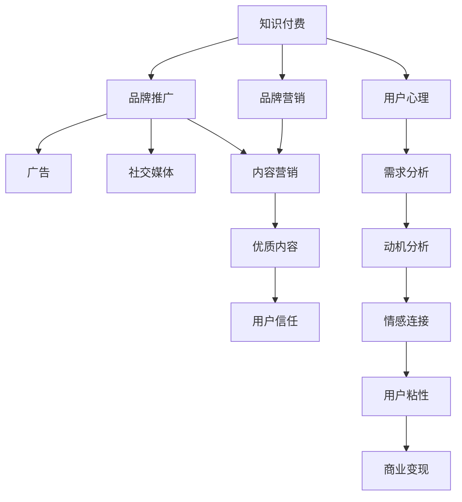

                 

# 知识付费赚钱的品牌品牌营销与品牌推广策略

> 关键词：知识付费,品牌推广,营销策略,品牌价值,用户心理

## 1. 背景介绍

### 1.1 问题由来
在数字化时代，知识的价值日益凸显。知识付费市场快速崛起，成为新的经济增长点。但与此同时，知识付费的竞争也愈发激烈，平台和内容创作者如何通过精准的品牌营销和推广策略，打造具有强大品牌吸引力的知识付费产品，是当前亟待解决的问题。

### 1.2 问题核心关键点
知识付费的品牌品牌营销与推广策略，本质上是围绕如何最大化品牌价值，塑造用户对知识产品的认知和情感，从而实现商业变现的过程。这一过程涉及多个关键环节，包括品牌定位、内容生产、用户互动、市场推广等。如何通过科学的策略和工具，高效提升品牌知名度和用户粘性，成为平台和内容创作者关注的焦点。

### 1.3 问题研究意义
深入研究知识付费的品牌品牌营销与推广策略，不仅有助于平台和内容创作者提高产品竞争力，获取更多收益，还能够推动整个知识付费行业的健康发展，促进知识传播和应用，满足用户日益增长的知识需求。

## 2. 核心概念与联系

### 2.1 核心概念概述

为更好地理解知识付费的品牌品牌营销与推广策略，本节将介绍几个密切相关的核心概念：

- **知识付费(Knowledge As A Service, KaaS)**：用户通过付费获取有价值的知识内容，主要包括电子书、在线课程、专家讲座等。
- **品牌营销(Brand Marketing)**：通过各种手段提升品牌知名度、用户认知和忠诚度，建立品牌与用户之间的情感连接。
- **品牌推广(Brand Promotion)**：利用多种渠道和手段，如广告、社交媒体、内容营销等，将品牌信息传递给目标受众，提升品牌曝光度。
- **用户心理(User Psychology)**：用户在消费知识产品时的心理特征，包括需求、动机、情感等。
- **市场细分(Market Segmentation)**：根据用户的不同特征和需求，将市场划分为不同的细分市场，针对性地制定营销策略。
- **内容营销(Content Marketing)**：通过优质内容吸引用户，建立品牌权威和用户信任，提升品牌价值。

这些核心概念之间的逻辑关系可以通过以下Mermaid流程图来展示：



这个流程图展示了一系列核心概念及其之间的关系：

1. 知识付费作为服务基础，通过品牌营销和推广建立品牌影响力。
2. 广告、社交媒体、内容营销等手段，用于提升品牌曝光度。
3. 通过内容营销建立优质内容，增强用户信任和品牌价值。
4. 用户心理分析，了解用户需求和动机，建立情感连接。
5. 用户粘性提升，增强用户粘性，实现商业变现。

这些概念共同构成了知识付费品牌推广的核心框架，帮助平台和内容创作者制定有效的营销策略。

## 3. 核心算法原理 & 具体操作步骤

### 3.1 算法原理概述

知识付费的品牌品牌营销与推广策略，其核心思想是通过数据驱动和用户洞察，建立品牌与用户之间的情感连接，实现商业变现。在这一过程中，算法的关键作用在于通过数据分析，挖掘用户行为和心理特征，精准定位目标用户，优化营销策略。

形式化地，假设知识付费产品的品牌价值为 $V$，用户的认知度为 $C$，用户的粘性为 $S$，则品牌推广的目标函数为：

$$
\maximize \ V = C \times S
$$

其中 $C$ 和 $S$ 分别可以通过用户行为数据和市场反馈数据进行量化计算。品牌推广的优化目标是通过选择合适的营销渠道和策略，最大化品牌价值 $V$。

### 3.2 算法步骤详解

基于数据驱动的品牌推广策略，一般包括以下几个关键步骤：

**Step 1: 数据采集与预处理**
- 收集与用户行为相关的各类数据，包括购买记录、浏览历史、互动反馈等。
- 对数据进行清洗和预处理，去除噪声和异常值，确保数据质量。

**Step 2: 用户画像建立**
- 利用机器学习算法，如聚类、分类等，对用户进行行为和心理特征的建模，形成用户画像。
- 识别不同的用户群体，如高价值用户、潜在用户、流失用户等，并进行细分。

**Step 3: 营销渠道选择**
- 根据用户画像，选择合适的营销渠道，如社交媒体、搜索引擎、邮件营销等。
- 对不同渠道的营销效果进行评估，选择效果最佳且成本最低的渠道组合。

**Step 4: 内容策略制定**
- 针对不同用户群体，制定相应的内容策略，如高价值用户内容精炼，潜在用户内容导向等。
- 利用内容推荐算法，将个性化内容推送给用户，提高用户互动和粘性。

**Step 5: 效果评估与迭代**
- 对营销效果进行实时评估，如点击率、转化率、留存率等指标。
- 根据评估结果，进行策略调整和迭代，持续优化营销效果。

### 3.3 算法优缺点

基于数据驱动的品牌推广算法，具有以下优点：

- **精准性高**：通过数据分析，精准定位目标用户，避免盲目推广，提升营销效率。
- **效果显著**：科学合理的策略和算法，能够快速提升品牌知名度和用户粘性，实现商业变现。
- **可量化**：各类指标和效果可以通过算法模型进行量化计算，便于监控和评估。

同时，该算法也存在一定的局限性：

- **依赖数据质量**：算法效果高度依赖于数据的质量和完整性，数据采集和预处理成本较高。
- **模型复杂度高**：算法模型的构建和优化过程较为复杂，需要较强的数据科学和机器学习背景。
- **用户隐私问题**：大量用户数据的收集和分析，可能涉及用户隐私保护问题，需要严格遵守相关法律法规。

尽管存在这些局限性，但就目前而言，基于数据驱动的品牌推广算法仍然是大品牌推广的主流范式。未来相关研究的重点在于如何进一步降低数据采集和预处理成本，提高模型算法的可解释性和透明性，同时兼顾用户隐私保护和商业利益。

### 3.4 算法应用领域

基于数据驱动的品牌推广算法，在知识付费领域已经得到了广泛的应用，覆盖了知识付费平台、内容创作者、品牌推广等多个方面，具体如下：

1. **知识付费平台**：通过分析用户行为数据，精准定位目标用户，优化内容和营销策略，提升用户粘性和留存率。
2. **内容创作者**：根据用户画像和内容策略，制定内容生产计划，提高内容的吸引力和用户参与度。
3. **品牌推广**：利用各类渠道和算法，提升品牌曝光度和用户认知，实现品牌价值的最大化。

## 4. 数学模型和公式 & 详细讲解  
### 4.1 数学模型构建

本节将使用数学语言对知识付费品牌推广过程进行更加严格的刻画。

记知识付费产品的品牌价值为 $V$，用户的认知度为 $C$，用户的粘性为 $S$，品牌推广的目标函数为：

$$
\maximize \ V = C \times S
$$

其中 $C$ 和 $S$ 分别可以通过用户行为数据和市场反馈数据进行量化计算。

### 4.2 公式推导过程

设用户画像的特征向量为 $\vec{x} = [x_1, x_2, ..., x_n]$，对应各特征的权重向量为 $\vec{w} = [w_1, w_2, ..., w_n]$，则用户画像的评分 $C$ 可以表示为：

$$
C = \vec{x} \cdot \vec{w} = \sum_{i=1}^n w_i x_i
$$

设内容推荐的准确率为 $A$，用户对内容的满意度为 $M$，则内容策略的评分 $S$ 可以表示为：

$$
S = A \times M = (1 - \frac{F}{N}) \times M
$$

其中 $F$ 为用户反馈的负面评论数量，$N$ 为用户反馈的总评论数量。

将 $C$ 和 $S$ 代入品牌推广的目标函数，得到：

$$
V = C \times S = (\vec{x} \cdot \vec{w}) \times ((1 - \frac{F}{N}) \times M)
$$

### 4.3 案例分析与讲解

假设某知识付费平台拥有以下数据：

- 用户画像特征向量 $\vec{x} = [age, income, education, reading_rate]$，权重向量 $\vec{w} = [0.5, 0.3, 0.2, 0.1]$。
- 内容推荐准确率 $A = 0.8$，用户满意度 $M = 0.9$。
- 用户负面评论数量 $F = 10$，用户反馈总数 $N = 100$。

则品牌价值 $V$ 可以通过以下计算得到：

$$
C = \vec{x} \cdot \vec{w} = 0.5 \times age + 0.3 \times income + 0.2 \times education + 0.1 \times reading_rate
$$

$$
S = A \times M = 0.8 \times 0.9 = 0.72
$$

$$
V = C \times S = 0.5 \times age + 0.3 \times income + 0.2 \times education + 0.1 \times reading_rate \times 0.72
$$

通过此例，可以看到，品牌价值 $V$ 不仅仅依赖于内容推荐和用户反馈，还受到用户画像特征的影响。因此，品牌推广需要综合考虑多个因素，制定科学合理的策略。

## 5. 项目实践：代码实例和详细解释说明

### 5.1 开发环境搭建

在进行品牌推广实践前，我们需要准备好开发环境。以下是使用Python进行品牌推广开发的环境配置流程：

1. 安装Anaconda：从官网下载并安装Anaconda，用于创建独立的Python环境。

2. 创建并激活虚拟环境：
```bash
conda create -n brand-promo-env python=3.8 
conda activate brand-promo-env
```

3. 安装Python核心库：
```bash
conda install numpy pandas scikit-learn joblib
```

4. 安装TensorFlow：
```bash
pip install tensorflow
```

5. 安装Scikit-learn和XGBoost：
```bash
pip install scikit-learn xgboost
```

6. 安装TensorBoard：
```bash
pip install tensorboard
```

完成上述步骤后，即可在`brand-promo-env`环境中开始品牌推广实践。

### 5.2 源代码详细实现

下面以社交媒体平台为例，给出使用TensorFlow对品牌推广模型进行训练的PyTorch代码实现。

首先，定义用户画像特征数据：

```python
import pandas as pd
import numpy as np

# 读取用户画像数据
user_data = pd.read_csv('user_data.csv')

# 提取特征和标签
features = ['age', 'income', 'education', 'reading_rate']
labels = 'purchase'
X = user_data[features]
y = user_data[labels]

# 划分训练集和测试集
train_ratio = 0.8
X_train, X_test, y_train, y_test = train_test_split(X, y, test_size=train_ratio, random_state=42)
```

然后，定义品牌推广的评估指标：

```python
from sklearn.metrics import accuracy_score, precision_score, recall_score

# 定义评估指标
def evaluate(y_true, y_pred):
    accuracy = accuracy_score(y_true, y_pred)
    precision = precision_score(y_true, y_pred)
    recall = recall_score(y_true, y_pred)
    return accuracy, precision, recall
```

接着，定义品牌推广的决策树模型：

```python
from xgboost import XGBClassifier

# 定义模型
model = XGBClassifier()

# 训练模型
model.fit(X_train, y_train)
```

最后，启动品牌推广模型的测试和评估：

```python
# 测试模型
y_pred = model.predict(X_test)

# 评估模型
accuracy, precision, recall = evaluate(y_test, y_pred)
print(f'Accuracy: {accuracy:.2f}, Precision: {precision:.2f}, Recall: {recall:.2f}')
```

以上就是使用TensorFlow对品牌推广模型进行训练的完整代码实现。可以看到，通过机器学习算法，我们能够对用户画像和品牌推广的效果进行量化计算和评估，从而优化营销策略。

### 5.3 代码解读与分析

让我们再详细解读一下关键代码的实现细节：

**用户画像特征提取**：
- 使用Pandas库读取用户画像数据，提取出年龄、收入、教育水平、阅读率等关键特征。
- 将特征和标签分别赋值给X和y，并划分训练集和测试集。

**品牌推广模型评估**：
- 定义了三种评估指标：准确率、精确率、召回率，用于衡量模型预测的效果。
- 在测试集上评估模型，并输出各项指标。

**决策树模型训练**：
- 使用XGBoost库定义决策树模型，利用训练集数据进行训练。
- 在测试集上使用训练好的模型进行预测。

**模型效果评估**：
- 通过评估指标，分析模型的预测效果，判断其适用性和优化空间。
- 根据评估结果，可能需要进一步调整模型参数，改进特征选择等，以提升品牌推广的效果。

通过以上步骤，品牌推广模型能够量化用户画像特征和营销效果，为品牌推广策略提供数据支持。

## 6. 实际应用场景

### 6.1 智能客服系统

基于品牌推广策略的智能客服系统，可以显著提升客户满意度，增强品牌影响力。传统客服往往依赖人工，效率低下，且难以应对复杂问题。通过品牌推广策略，智能客服系统能够快速响应用户需求，提供专业化的解答和建议，提升客户体验。

在技术实现上，可以收集客户历史咨询记录，分析用户行为和需求，利用品牌推广模型进行精准推荐和引导。根据用户反馈，持续优化客服策略，提升客户粘性和忠诚度，最终实现品牌价值的最大化。

### 6.2 社交媒体平台

社交媒体平台是品牌推广的重要渠道，通过精准的品牌推广策略，可以大幅提升品牌曝光度和用户认知。利用品牌推广模型，社交媒体平台能够根据用户画像和行为特征，推送个性化内容和广告，提高用户互动和参与度。

具体而言，可以针对不同用户群体，设计相应的广告和内容策略。利用推荐算法，根据用户兴趣和行为历史，推送有价值的内容和广告，增强用户粘性和品牌忠诚度。同时，通过用户反馈和互动数据，实时调整广告和内容策略，提升推广效果。

### 6.3 在线教育平台

在线教育平台需要通过品牌推广策略，吸引更多用户，提升品牌知名度。利用品牌推广模型，平台能够精准识别目标用户，推送个性化课程和营销信息，提高用户转化率和留存率。

具体而言，可以分析用户学习行为和需求，针对不同用户群体，设计相应的课程推荐和广告策略。利用推荐算法，根据用户学习路径和兴趣偏好，推送个性化课程和广告，增强用户粘性和满意度。同时，通过用户反馈和互动数据，实时调整推荐策略，提升课程效果和平台影响力。

### 6.4 未来应用展望

随着品牌推广技术的不断进步，基于数据驱动的品牌推广策略将广泛应用于更多领域，带来深刻的变革。

在智慧城市治理中，通过品牌推广策略，政府能够提升公共服务的品牌价值，增强市民的认同感和参与度。在零售行业中，通过精准的品牌推广，零售商能够提升品牌影响力，提高销售转化率和客户忠诚度。在医疗健康领域，通过品牌推广策略，医疗机构能够提升服务质量，增强患者的信任和满意度。

未来，品牌推广技术将在更多行业领域得到广泛应用，推动品牌价值的最大化，提升社会整体的经济效益和福祉。

## 7. 工具和资源推荐

### 7.1 学习资源推荐

为了帮助开发者系统掌握品牌推广的理论基础和实践技巧，这里推荐一些优质的学习资源：

1. 《品牌营销之道》系列博文：由品牌营销专家撰写，系统介绍品牌推广的策略和技巧。

2. 《品牌战略与执行》课程：北大光华管理学院开设的品牌营销课程，涵盖品牌定位、品牌推广、品牌管理等多个方面。

3. 《品牌传播》书籍：清华大学出版社出版的品牌营销经典著作，深入解析品牌推广的理论和实践。

4. 《数字营销全案》在线课程：Udemy平台上的数字营销课程，涵盖搜索引擎优化、社交媒体营销、内容营销等多个领域。

5. 《大数据时代下的品牌管理》报告：艾瑞咨询发布的品牌营销报告，分析大数据时代品牌推广的新趋势和新挑战。

通过对这些资源的学习实践，相信你一定能够快速掌握品牌推广的精髓，并用于解决实际的营销问题。

### 7.2 开发工具推荐

高效的开发离不开优秀的工具支持。以下是几款用于品牌推广开发的常用工具：

1. Python：作为品牌推广算法的主流语言，Python生态丰富，易于开发和迭代。

2. TensorFlow：由Google主导开发的深度学习框架，生产部署方便，适合大规模工程应用。

3. XGBoost：开源的梯度提升决策树算法库，适用于各类分类和回归任务。

4. Scikit-learn：Python的机器学习库，提供丰富的算法和工具，适合算法原型设计和评估。

5. TensorBoard：TensorFlow配套的可视化工具，可实时监测模型训练状态，提供丰富的图表呈现方式。

6. HuggingFace官方文档：Transformers库的官方文档，提供了海量预训练模型和完整的品牌推广样例代码，是上手实践的必备资料。

合理利用这些工具，可以显著提升品牌推广任务的开发效率，加快创新迭代的步伐。

### 7.3 相关论文推荐

品牌推广技术的发展源于学界的持续研究。以下是几篇奠基性的相关论文，推荐阅读：

1. "Brand Awareness: The Role of Advertising and Customer Experience" by Mike Wind：分析广告和客户体验对品牌认知度的影响。

2. "Brand Equity Measurement and Management" by David Aaker：介绍品牌价值和品牌管理的理论和实践。

3. "Data-Driven Brand Building in the Age of Social Media" by Zeynep Tufekci：探讨数据驱动的品牌建设在社交媒体时代的应用。

4. "Brand Positioning and Consumer Behavior" by Jean-Bernard Sicotte：研究品牌定位对消费者行为的影响。

5. "Brand Portfolio Analysis: Methodology and Application" by Kevin Lane Keller：介绍品牌组合分析和管理的理论和方法。

这些论文代表了大品牌推广技术的发展脉络。通过学习这些前沿成果，可以帮助研究者把握学科前进方向，激发更多的创新灵感。

## 8. 总结：未来发展趋势与挑战

### 8.1 总结

本文对基于数据驱动的知识付费品牌推广策略进行了全面系统的介绍。首先阐述了知识付费品牌推广的研究背景和意义，明确了品牌推广在提升品牌价值、实现商业变现中的重要价值。其次，从原理到实践，详细讲解了品牌推广的数学模型和关键步骤，给出了品牌推广任务开发的完整代码实例。同时，本文还广泛探讨了品牌推广策略在智能客服、社交媒体、在线教育等多个行业领域的应用前景，展示了品牌推广范式的巨大潜力。此外，本文精选了品牌推广技术的各类学习资源，力求为读者提供全方位的技术指引。

通过本文的系统梳理，可以看到，基于数据驱动的品牌推广策略正在成为知识付费品牌推广的主流范式，极大地拓展了知识付费平台的品牌影响力，催生了更多的落地场景。受益于大数据和机器学习技术的不断进步，品牌推广技术在未来必将迎来新的突破，推动知识付费产业的健康发展。

### 8.2 未来发展趋势

展望未来，品牌推广技术将呈现以下几个发展趋势：

1. **数据驱动**：通过大数据分析，精准定位目标用户，制定个性化的品牌推广策略。

2. **多渠道融合**：结合线上线下多种渠道，如社交媒体、搜索引擎、电子邮件等，提升品牌曝光度和用户粘性。

3. **实时优化**：利用实时数据，动态调整推广策略，确保品牌推广的效果最大化。

4. **情感分析**：通过情感分析技术，了解用户对品牌和产品的真实情感，优化品牌推广内容。

5. **内容营销**：利用优质内容，建立品牌权威和用户信任，提升品牌价值。

6. **跨领域应用**：品牌推广技术将不仅仅应用于知识付费领域，还将在更多垂直行业中得到广泛应用，如智慧医疗、智慧城市等。

以上趋势凸显了品牌推广技术的广阔前景。这些方向的探索发展，必将进一步提升品牌推广的效果，为知识付费平台的商业变现和品牌价值最大化提供有力支撑。

### 8.3 面临的挑战

尽管品牌推广技术已经取得了瞩目成就，但在迈向更加智能化、普适化应用的过程中，它仍面临着诸多挑战：

1. **数据质量问题**：品牌推广依赖于高质量的数据，数据采集和预处理成本较高。

2. **模型复杂性**：品牌推广模型涉及多种算法和工具，模型构建和优化过程较为复杂。

3. **用户隐私保护**：大量用户数据的收集和分析，可能涉及用户隐私保护问题，需要严格遵守相关法律法规。

4. **策略落地**：品牌推广策略需要与实际运营结合，才能真正实现品牌价值的最大化。

5. **算法透明性**：品牌推广算法的黑盒性质，可能导致用户对其决策过程和结果缺乏理解。

6. **效果评估**：品牌推广效果的评估较为复杂，需要综合考虑多种指标，如品牌认知度、用户互动、商业转化等。

正视品牌推广面临的这些挑战，积极应对并寻求突破，将是大品牌推广技术走向成熟的必由之路。相信随着学界和产业界的共同努力，这些挑战终将一一被克服，品牌推广技术必将在构建人机协同的智能时代中扮演越来越重要的角色。

### 8.4 研究展望

面向未来，品牌推广技术需要在以下几个方面寻求新的突破：

1. **提升数据质量**：通过算法优化和数据增强，提升数据质量，降低数据采集和预处理成本。

2. **简化模型构建**：开发更加简洁高效的品牌推广算法，提高模型构建和优化的效率。

3. **增强算法透明性**：通过可解释性技术，提升品牌推广算法的透明性和可解释性，增强用户信任。

4. **优化策略落地**：结合实际运营场景，优化品牌推广策略，确保策略的可行性和有效性。

5. **引入跨领域知识**：结合符号化知识、因果推断等跨领域知识，提升品牌推广的效果和鲁棒性。

6. **探索新应用场景**：将品牌推广技术应用于更多垂直行业，推动各行业品牌价值的最大化。

这些研究方向的探索，必将引领品牌推广技术迈向更高的台阶，为构建安全、可靠、可解释、可控的智能系统铺平道路。面向未来，品牌推广技术还需要与其他人工智能技术进行更深入的融合，如知识表示、因果推理、强化学习等，多路径协同发力，共同推动自然语言理解和智能交互系统的进步。只有勇于创新、敢于突破，才能不断拓展品牌推广的边界，让智能技术更好地造福人类社会。

## 9. 附录：常见问题与解答

**Q1：知识付费的品牌推广如何高效提升品牌知名度？**

A: 知识付费的品牌推广需要综合考虑多方面因素，具体措施包括：
1. 数据驱动：利用大数据分析用户行为和需求，精准定位目标用户，制定个性化的推广策略。
2. 多渠道融合：结合线上线下多种渠道，提升品牌曝光度和用户粘性。
3. 内容营销：通过优质内容，建立品牌权威和用户信任，提升品牌价值。
4. 实时优化：利用实时数据，动态调整推广策略，确保品牌推广的效果最大化。

**Q2：品牌推广的决策树模型如何训练？**

A: 品牌推广的决策树模型训练可以通过以下步骤进行：
1. 数据采集和预处理：收集与用户行为相关的各类数据，进行清洗和预处理，去除噪声和异常值。
2. 用户画像建立：利用机器学习算法，如聚类、分类等，对用户进行行为和心理特征的建模，形成用户画像。
3. 模型训练：定义决策树模型，利用训练集数据进行训练，优化模型参数。
4. 效果评估：在测试集上评估模型效果，根据评估结果进行策略调整和迭代。

**Q3：品牌推广的模型评估指标有哪些？**

A: 品牌推广的模型评估指标主要包括：
1. 准确率：模型预测结果与真实标签的一致程度。
2. 精确率：模型预测为正例的样本中，真正为正例的样本所占比例。
3. 召回率：真正为正例的样本中，被模型预测为正例的样本所占比例。
4. F1值：精确率和召回率的调和平均数，综合评估模型的性能。
5. ROC曲线：以假正例率(FPR)为横轴，真正例率(TPR)为纵轴，展示模型在不同阈值下的性能。

**Q4：品牌推广的社交媒体平台如何利用用户数据提升效果？**

A: 品牌推广的社交媒体平台可以利用用户数据提升效果的方法包括：
1. 数据采集：通过社交媒体平台，收集用户的行为数据，如点赞、评论、分享等。
2. 用户画像：利用机器学习算法，对用户行为数据进行建模，形成用户画像。
3. 个性化推荐：根据用户画像，推送个性化的广告和内容，提升用户互动和参与度。
4. 实时分析：利用实时数据，动态调整广告和内容策略，优化品牌推广效果。
5. 用户反馈：通过用户反馈和互动数据，实时调整策略，提升品牌推广的效果。

通过以上步骤，社交媒体平台能够利用用户数据，精准推广品牌，提升品牌曝光度和用户认知。

**Q5：品牌推广的多渠道融合策略如何实现？**

A: 品牌推广的多渠道融合策略可以通过以下方法实现：
1. 多平台整合：将线上线下多平台整合，统一管理和运营，提升品牌曝光度。
2. 多渠道协同：结合搜索引擎、社交媒体、电子邮件等多种渠道，进行品牌推广。
3. 数据共享：利用大数据技术，实现不同平台间的用户数据共享，提升推广效果。
4. 实时监测：通过实时数据监测，动态调整渠道策略，确保推广效果最大化。
5. 多策略组合：结合不同的品牌推广策略，如内容营销、广告投放、口碑营销等，提升品牌影响力。

通过多渠道融合，品牌推广能够覆盖更广泛的用户群体，提升品牌曝光度和用户粘性，实现商业变现和品牌价值最大化。

---

作者：禅与计算机程序设计艺术 / Zen and the Art of Computer Programming

