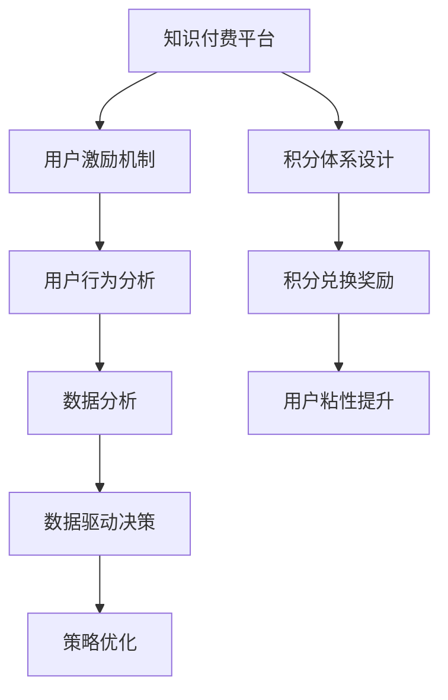

                 

# 知识付费赚钱的用户激励机制与积分体系设计

> 关键词：知识付费, 用户激励机制, 积分体系设计, 用户行为分析, 电子商务, 社区运营

## 1. 背景介绍

在互联网迅速发展的今天，知识付费成为一种全新的商业模式，这种模式通过提供优质内容，让消费者为信息支付费用，以实现内容和知识的高效传播与转化。然而，知识付费平台在运营过程中也面临着用户流失、内容质量参差不齐等问题。如何通过有效的用户激励机制和积分体系设计，提升用户粘性，保持平台的长期稳定运营，是一个亟需解决的挑战。

### 1.1 知识付费平台的现状与挑战

知识付费平台的主要挑战包括：
- **用户留存率低**：用户转化和留存问题困扰着大多数知识付费平台。用户流失率较高，导致平台难以形成稳定的用户群体。
- **内容质量不一**：尽管平台提供大量内容，但用户评价和付费意愿往往参差不齐，优质内容难以脱颖而出。
- **付费转化率低**：许多平台对用户的付费转化率并不高，用户对付费内容的认可度不足，购买意愿不高。
- **用户交互不足**：许多平台缺乏有效的用户互动机制，难以吸引用户长期使用和参与。

为解决上述问题，需要设计一套完善的激励机制和积分体系，有效引导用户行为，提升用户满意度和粘性，增加平台的收入。

## 2. 核心概念与联系

### 2.1 核心概念概述

在知识付费平台上，用户激励机制和积分体系设计涉及多个关键概念：

- **知识付费**：提供知识、技能、信息等内容，让用户为其付费的一种商业模式。
- **用户激励机制**：通过特定的激励手段，如奖励、积分、等级等，激发用户参与和付费。
- **积分体系**：基于用户行为设定的积分系统，用于衡量用户贡献和价值，同时通过积分兑换奖励，提升用户参与度。
- **用户行为分析**：通过数据分析技术，了解用户行为特征和需求，以优化激励机制和积分设计。
- **电子商务**：知识付费平台本质上是一种电子商务形式，通过销售内容获得收益。
- **社区运营**：通过营造积极、互动的社区氛围，增加用户粘性，提升平台价值。

### 2.2 核心概念原理和架构的 Mermaid 流程图



这个流程图展示了各个概念之间的联系：知识付费平台通过用户激励机制和积分体系设计，结合用户行为分析，实现电子商务和社区运营，最终提升用户粘性和平台收益。

## 3. 核心算法原理 & 具体操作步骤

### 3.1 算法原理概述

知识付费平台的用户激励机制和积分体系设计，基于以下算法原理：

1. **强化学习**：通过奖励和惩罚机制，不断调整用户行为，使其逐渐形成良好的付费习惯。
2. **行为分析**：利用机器学习算法分析用户行为数据，预测用户需求和行为，优化激励策略。
3. **积分设计**：基于用户贡献和价值设定积分，通过积分兑换奖励，增强用户参与度。
4. **动态调整**：根据用户反馈和行为数据，动态调整激励策略和积分体系，适应用户变化需求。

### 3.2 算法步骤详解

#### 3.2.1 用户行为数据收集

首先，需要收集和整理用户行为数据，包括用户访问时长、付费金额、阅读内容、分享互动等。使用数据分析工具（如Google Analytics、Mixpanel）进行数据收集和整理。

#### 3.2.2 用户行为分析

利用机器学习算法（如分类算法、聚类算法、回归算法）分析用户行为数据，提取用户特征和行为模式。建立用户行为预测模型，预测用户下一步行为。

#### 3.2.3 用户分类与画像

根据用户行为特征和需求，对用户进行分类，建立用户画像。不同用户群体采取不同的激励策略和积分设计。

#### 3.2.4 设计用户激励机制

根据用户分类和画像，设计不同激励机制，如：
- **奖励积分**：根据用户付费和阅读行为，给予积分奖励。
- **等级系统**：设定不同等级，用户根据行为获得等级提升，享受特权。
- **优惠券和折扣**：通过优惠券和折扣吸引用户付费。
- **知识竞赛**：设置知识竞赛，激励用户参与并分享知识。

#### 3.2.5 积分体系设计

基于用户分类和画像，设计积分体系，设定积分获取、使用和兑换规则。积分可兑换多种奖励，如课程、会员、折扣等。

#### 3.2.6 激励策略调整

根据用户反馈和行为数据，动态调整激励策略和积分设计，确保策略的可行性和有效性。

### 3.3 算法优缺点

#### 3.3.1 优点

1. **提升用户留存率**：通过有效激励和积分兑换，增强用户粘性，提升用户留存率。
2. **增加内容付费意愿**：激励机制和积分设计，提升用户对付费内容的认可度，增加付费意愿。
3. **优化用户行为**：通过行为分析，优化激励策略，引导用户形成良好的付费习惯。
4. **增加平台收益**：通过提高用户付费转化率和粘性，增加平台的收入。

#### 3.3.2 缺点

1. **激励策略设计复杂**：设计有效的激励策略和积分体系，需要大量的数据分析和实验。
2. **数据隐私问题**：收集和分析用户行为数据，可能涉及用户隐私问题，需严格遵守数据保护法规。
3. **成本高昂**：实施有效的激励机制和积分体系，需要投入大量资源和成本。

### 3.4 算法应用领域

用户激励机制和积分体系设计在以下领域有广泛应用：

1. **教育培训**：在线教育平台通过积分和奖励机制，激励学生参与课程学习。
2. **电子商务**：电商平台通过积分和优惠券，提高用户购买意愿和复购率。
3. **社交媒体**：社交媒体平台通过积分和等级系统，增强用户互动和粘性。
4. **企业培训**：企业通过积分和奖励机制，激励员工参与培训和提升技能。
5. **社区运营**：社区平台通过积分和等级系统，增加用户互动和平台活跃度。

## 4. 数学模型和公式 & 详细讲解 & 举例说明

### 4.1 数学模型构建

在知识付费平台上，用户激励机制和积分体系设计涉及以下数学模型：

1. **用户行为数据模型**：
   - 设用户行为数据为 $X$，用户行为特征为 $f(X)$。

2. **用户行为预测模型**：
   - 设用户行为预测模型为 $P(y|X)$，其中 $y$ 为用户下一步行为。

3. **用户激励策略模型**：
   - 设用户激励策略为 $S(X)$，其中 $S$ 包括积分获取、等级提升等策略。

4. **积分兑换模型**：
   - 设积分兑换奖励为 $E$，积分兑换规则为 $E(X)$。

### 4.2 公式推导过程

#### 4.2.1 用户行为数据模型

设用户行为数据为 $X=\{x_1, x_2, \cdots, x_n\}$，其中 $x_i$ 为用户行为记录。假设用户行为特征为 $f(X)=\{\text{访问时长}, \text{付费金额}, \cdots\}$。

#### 4.2.2 用户行为预测模型

利用分类算法（如Logistic回归、决策树等），建立用户行为预测模型：

$$
P(y|X) = \frac{\exp(\beta^Tf(X))}{1+\exp(\beta^Tf(X))}
$$

其中，$\beta$ 为模型参数。

#### 4.2.3 用户激励策略模型

用户激励策略模型基于用户行为预测模型和积分设计规则，设定积分获取和等级提升规则：

$$
S(X) = \begin{cases}
\text{积分获取}, & \text{若用户行为满足积分规则} \\
\text{等级提升}, & \text{若用户行为满足等级规则}
\end{cases}
$$

#### 4.2.4 积分兑换模型

积分兑换模型基于积分体系设计，设定积分兑换规则：

$$
E(X) = \begin{cases}
\text{课程兑换}, & \text{若用户积分达到课程兑换门槛} \\
\text{会员兑换}, & \text{若用户积分达到会员兑换门槛} \\
\text{折扣兑换}, & \text{若用户积分达到折扣兑换门槛}
\end{cases}
$$

### 4.3 案例分析与讲解

假设某在线教育平台用户行为数据如下：
- 用户访问时长 $X_1=500$ 分钟
- 付费金额 $X_2=100$ 元
- 阅读课程数量 $X_3=5$ 门

根据上述数据，利用分类算法得到用户行为预测模型：

$$
P(y|X) = \frac{\exp(0.5X_1 + 0.3X_2 - 0.1X_3)}{1+\exp(0.5X_1 + 0.3X_2 - 0.1X_3)}
$$

假设平台设定积分获取规则：每阅读一门课程获得 10 分积分，每付费 100 元获得 50 分积分。根据用户行为预测模型，预测用户下一步行为：

- 若用户访问时长达到 1000 分钟，付费金额达到 200 元，阅读课程数量达到 10 门，则获得积分：

$$
S(X) = 10 \times 5 + 50 \times 2 = 110 \text{ 分}
$$

根据积分兑换模型，用户可用积分兑换课程或会员等奖励：

- 若用户积分达到 1000 分，则可兑换一门课程；若积分达到 5000 分，则可兑换会员资格。

### 4.4 实际应用

在实际应用中，用户激励机制和积分体系设计需结合平台的具体业务需求，设计有效的策略。例如：

- **内容付费激励**：根据用户阅读和付费行为，给予积分奖励，提升付费意愿。
- **学习竞赛激励**：设置学习竞赛活动，鼓励用户分享知识和参与讨论，获得积分和奖励。
- **社区互动激励**：通过评论、点赞、分享等行为，给予积分奖励，增加社区活跃度。

## 5. 项目实践：代码实例和详细解释说明

### 5.1 开发环境搭建

在搭建开发环境前，需确保以下软件环境已安装：
- Python 3.7+
- PyTorch
- TensorFlow
- scikit-learn
- Pandas
- NumPy
- Flask

### 5.2 源代码详细实现

以下是基于Python的激励机制和积分体系设计的源代码实现，包括用户行为数据收集、行为分析、激励策略设计、积分体系设计等模块：

```python
import pandas as pd
import numpy as np
from sklearn.model_selection import train_test_split
from sklearn.linear_model import LogisticRegression
from flask import Flask, request, jsonify

# 数据收集和处理
def collect_user_data():
    # 从数据库或API获取用户行为数据
    # 例如：访问时长、付费金额、阅读课程数量等
    pass

# 用户行为分析
def analyze_user_behavior():
    # 利用机器学习算法分析用户行为数据
    # 例如：分类算法、聚类算法、回归算法
    pass

# 用户分类与画像
def user_classification():
    # 根据用户行为特征，对用户进行分类和画像
    # 例如：高价值用户、活跃用户、新用户等
    pass

# 设计用户激励机制
def design_incentive_system():
    # 设计不同的激励机制，例如积分、等级、优惠券等
    pass

# 设计积分体系
def design积分体系():
    # 设定积分获取、使用和兑换规则
    # 例如：阅读课程、付费金额、会员资格等
    pass

# 激励策略调整
def adjust_incentive_strategy():
    # 根据用户反馈和行为数据，动态调整激励策略和积分设计
    pass

# 激励机制API实现
app = Flask(__name__)

@app.route('/incentive', methods=['POST'])
def incentive_system():
    # 接收用户数据
    user_data = request.json
    
    # 分析用户行为
    behavior_analysis = analyze_user_behavior(user_data)
    
    # 设计激励策略
    incentive_strategy = design_incentive_system(behavior_analysis)
    
    # 设计积分体系
    积分体系 = design积分体系(incentive_strategy)
    
    # 返回激励策略和积分体系
    return jsonify(incentive_strategy, 积分体系)

if __name__ == '__main__':
    app.run(debug=True)
```

### 5.3 代码解读与分析

**代码实现流程**：
1. **数据收集**：通过API或数据库获取用户行为数据。
2. **行为分析**：利用机器学习算法分析用户行为数据，提取用户特征和行为模式。
3. **用户分类**：根据用户行为特征，对用户进行分类和画像。
4. **激励策略设计**：设计不同的激励策略，如积分、等级、优惠券等。
5. **积分体系设计**：设定积分获取、使用和兑换规则。
6. **激励策略调整**：根据用户反馈和行为数据，动态调整激励策略和积分设计。
7. **API实现**：实现激励机制API，根据用户数据返回激励策略和积分体系。

**代码功能**：
- **用户数据收集**：从API或数据库获取用户行为数据。
- **行为分析**：利用分类算法（如Logistic回归）分析用户行为数据。
- **用户分类与画像**：根据用户行为特征，对用户进行分类和画像。
- **激励策略设计**：设计积分和等级系统，激励用户参与和付费。
- **积分体系设计**：设定积分获取、使用和兑换规则。
- **激励策略调整**：根据用户反馈和行为数据，动态调整激励策略。
- **API实现**：实现激励机制API，根据用户数据返回激励策略和积分体系。

**代码输出**：
- **激励策略**：返回用户激励策略，如积分、等级、优惠券等。
- **积分体系**：返回积分获取、使用和兑换规则。

### 5.4 运行结果展示

通过以上代码实现，用户行为数据可以自动分析和处理，激励策略和积分体系可以动态调整和输出。

## 6. 实际应用场景

### 6.1 教育培训平台

在教育培训平台上，用户激励机制和积分体系设计可以激励学生参与课程学习，提高学习效率和成果。例如：
- **阅读激励**：设定每阅读一定时间的课程获得积分，激励学生学习。
- **讨论激励**：设定每参与一定次数的讨论获得积分，鼓励学生互动。
- **成果展示**：将学习成果和积分奖励相结合，提升学生学习动力。

### 6.2 电子商务平台

在电子商务平台上，用户激励机制和积分体系设计可以提升用户购买意愿和复购率。例如：
- **优惠券激励**：设定每消费一定金额获得优惠券，激励用户再次购买。
- **积分兑换**：设定积分可兑换折扣、会员资格等，吸引用户持续消费。
- **评价激励**：设定每进行一定次数的评价获得积分，鼓励用户反馈产品。

### 6.3 社交媒体平台

在社交媒体平台上，用户激励机制和积分体系设计可以增强用户互动和粘性。例如：
- **点赞激励**：设定每点赞一定次数获得积分，鼓励用户互动。
- **分享激励**：设定每分享一定次数获得积分，增加内容传播。
- **社区互动**：通过积分系统建立社区活跃度，增加用户粘性。

### 6.4 企业培训平台

在企业培训平台上，用户激励机制和积分体系设计可以激励员工参与培训和提升技能。例如：
- **课程学习激励**：设定每学习一定时间的课程获得积分，激励员工学习。
- **考试激励**：设定每次考试通过获得积分，鼓励员工提升技能。
- **证书奖励**：设定完成培训获得证书和积分奖励，提升员工培训积极性。

### 6.5 未来应用展望

未来，随着技术的发展，知识付费平台的激励机制和积分体系设计将更加智能化和个性化。例如：
- **智能推荐**：根据用户行为和偏好，智能推荐课程和学习内容，提升用户学习效果。
- **个性化激励**：根据用户画像和行为，设计个性化激励策略，提高用户满意度。
- **跨平台联动**：将多个平台的激励机制和积分体系联动，提升用户整体体验。

## 7. 工具和资源推荐

### 7.1 学习资源推荐

为帮助开发者系统掌握激励机制和积分体系设计的理论基础和实践技巧，推荐以下学习资源：
1. **《用户行为分析与设计》**：深入浅出地介绍了用户行为分析的方法和工具。
2. **《激励机制设计与实践》**：详细讲解了各种激励机制的设计和应用。
3. **《机器学习实战》**：介绍了机器学习在用户行为分析中的应用。
4. **《数据分析与数据可视化》**：介绍了数据分析和数据可视化的基础知识和方法。
5. **《Python数据分析与挖掘》**：讲解了Python在数据分析和挖掘中的应用。

### 7.2 开发工具推荐

为提高开发效率，推荐以下开发工具：
1. **PyTorch**：基于Python的开源深度学习框架，灵活动态的计算图。
2. **TensorFlow**：由Google主导的深度学习框架，生产部署方便。
3. **Flask**：轻量级的Web框架，简单易用的API实现。
4. **Jupyter Notebook**：交互式的数据分析和代码调试工具。
5. **GitHub**：代码托管平台，方便版本控制和协作开发。

### 7.3 相关论文推荐

激励机制和积分体系设计的相关论文推荐：
1. **《用户行为分析与建模》**：介绍了用户行为分析和建模的方法。
2. **《激励机制设计与优化》**：详细讲解了各种激励机制的设计和优化方法。
3. **《机器学习在用户行为预测中的应用》**：介绍了机器学习在用户行为预测中的应用。
4. **《用户激励机制的理论与实践》**：深入探讨了用户激励机制的理论基础和实践方法。
5. **《积分体系设计与管理》**：介绍了积分体系设计与管理的理论和实践。

## 8. 总结：未来发展趋势与挑战

### 8.1 研究成果总结

本文对知识付费平台的用户激励机制和积分体系设计进行了系统介绍，通过强化学习、行为分析、积分设计等方法，有效提升用户留存率和付费转化率。通过激励机制和积分体系设计，实现电子商务和社区运营，提升平台收益和用户满意度。

### 8.2 未来发展趋势

未来，知识付费平台的用户激励机制和积分体系设计将更加智能化和个性化，主要趋势包括：
1. **智能化推荐**：利用人工智能技术，智能推荐课程和学习内容，提升用户学习效果。
2. **个性化激励**：根据用户画像和行为，设计个性化激励策略，提高用户满意度。
3. **跨平台联动**：将多个平台的激励机制和积分体系联动，提升用户整体体验。
4. **数据驱动决策**：通过数据分析和机器学习，优化激励策略和积分设计，提升平台收益。

### 8.3 面临的挑战

尽管用户激励机制和积分体系设计在知识付费平台已取得一定成果，但仍面临以下挑战：
1. **激励策略设计复杂**：设计有效的激励策略和积分体系，需要大量的数据分析和实验。
2. **数据隐私问题**：收集和分析用户行为数据，可能涉及用户隐私问题，需严格遵守数据保护法规。
3. **成本高昂**：实施有效的激励机制和积分体系，需要投入大量资源和成本。

### 8.4 研究展望

未来，需要继续在以下几个方面进行深入研究：
1. **跨领域应用**：将用户激励机制和积分体系设计应用于更多领域，如医疗、金融等。
2. **数据隐私保护**：研究如何保护用户隐私，同时进行有效数据分析和行为预测。
3. **激励策略优化**：研究如何优化激励策略，提高用户满意度和平台收益。
4. **智能化管理**：研究如何利用人工智能技术，实现智能化激励机制和积分体系设计。

## 9. 附录：常见问题与解答

### 9.1 常见问题

**Q1: 用户激励机制和积分体系设计是否适用于所有知识付费平台？**

A: 用户激励机制和积分体系设计具有广泛适用性，但不同平台应根据自身业务特点进行优化调整。

**Q2: 如何设计有效的用户激励策略？**

A: 设计有效的用户激励策略需要结合平台的具体业务需求，结合行为分析，设计个性化激励措施。

**Q3: 如何设计积分体系？**

A: 设计积分体系需设定积分获取、使用和兑换规则，确保积分体系的可操作性和用户粘性。

**Q4: 如何动态调整激励策略和积分设计？**

A: 根据用户反馈和行为数据，动态调整激励策略和积分设计，确保策略的可行性和有效性。

### 9.2 问题解答

**A1:** 用户激励机制和积分体系设计具有广泛适用性，但不同平台应根据自身业务特点进行优化调整。

**A2:** 设计有效的用户激励策略需要结合平台的具体业务需求，结合行为分析，设计个性化激励措施。

**A3:** 设计积分体系需设定积分获取、使用和兑换规则，确保积分体系的可操作性和用户粘性。

**A4:** 根据用户反馈和行为数据，动态调整激励策略和积分设计，确保策略的可行性和有效性。

---

作者：禅与计算机程序设计艺术 / Zen and the Art of Computer Programming

