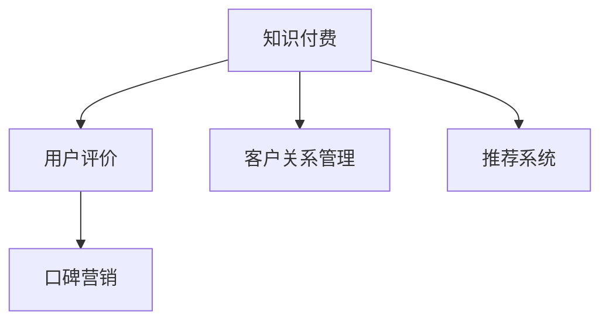

                 

# 知识付费赚钱的用户评价管理与口碑营销策略

> 关键词：知识付费,用户评价,口碑营销,策略,模型优化,数据分析

## 1. 背景介绍

### 1.1 问题由来

随着知识付费市场的发展，用户对知识和服务的质量和满意度愈发重视，用户评价成为衡量产品和服务的重要指标。良好的用户评价不仅能提升用户满意度和忠诚度，还能吸引新用户并提升品牌知名度。然而，如何有效管理用户评价并利用这些数据进行口碑营销，仍然是一个复杂且具挑战性的问题。

### 1.2 问题核心关键点

用户评价管理的核心在于：如何高效收集用户反馈，量化评价指标，及时响应和改进用户需求，同时如何利用这些评价数据进行口碑营销，增强用户信任和品牌影响力。

## 2. 核心概念与联系

### 2.1 核心概念概述

为更好地理解用户评价管理和口碑营销的策略，本节将介绍几个密切相关的核心概念：

- **知识付费**：基于订阅、按需付费或分享付费等方式，为用户提供有价值的内容或服务的模式。用户通过支付费用获取专属资源或服务。
- **用户评价**：用户在体验过服务后，对其质量和价值的反馈。包括星级评价、评论、评分等形式。
- **口碑营销**：通过用户的口口相传和社交媒体分享，借助用户信任和社群影响力，实现品牌传播和销售增长。
- **客户关系管理(CRM)**：通过收集和管理客户数据，提供个性化的服务和营销策略，提升客户满意度和忠诚度。
- **推荐系统**：基于用户行为和偏好，推荐其可能感兴趣的内容或产品，提升用户体验和转化率。

这些核心概念之间的逻辑关系可以通过以下Mermaid流程图来展示：



这个流程图展示出各个概念之间的联系：

1. 知识付费提供用户评价的对象。
2. 用户评价数据可以用于口碑营销，提升品牌信任度。
3. CRM系统通过用户评价数据提供个性化服务。
4. 推荐系统可以根据用户评价调整推荐策略，提高用户满意度。

## 3. 核心算法原理 & 具体操作步骤

### 3.1 算法原理概述

用户评价管理与口碑营销的核心在于通过数据分析和建模技术，从大量用户反馈中提取有价值的信息，用于指导产品和服务的改进，同时通过这些信息制定有效的口碑营销策略。

形式化地，假设收集到N个用户评价，每个评价$x_i$由评分$r_i$和评价文本$t_i$组成。定义评分函数$F(r_i, t_i)$来量化用户评价的质量和情感倾向。基于这些评分和评价文本，可以通过机器学习算法学习模型$f(x)$，预测用户评价的情感倾向和评分。

用户评价数据的分析可以用于：
1. 识别产品或服务的关键改进点。
2. 分析用户满意度和忠诚度。
3. 优化口碑营销策略，提升品牌形象。

### 3.2 算法步骤详解

用户评价管理与口碑营销的算法步骤包括：

1. **数据收集**：收集用户的评价数据，包括评分、评论、情感倾向等。
2. **数据预处理**：对评价文本进行分词、去除停用词、情感分析等预处理。
3. **特征提取**：通过TF-IDF、词向量等技术，提取评价文本的特征向量。
4. **模型训练**：使用机器学习算法（如SVM、随机森林、神经网络等）训练预测模型$f(x)$。
5. **情感分析**：使用情感分析模型对评价文本进行情感极性分类，如正面、中性、负面。
6. **口碑营销策略优化**：根据用户评价数据，制定个性化的口碑营销策略，如针对负面评价进行改进，针对正面评价进行口碑传播。

### 3.3 算法优缺点

基于机器学习的用户评价管理与口碑营销方法具有以下优点：

- **高效自动化**：自动从大量用户反馈中提取有用信息，减少人工分析的工作量。
- **精准预测**：通过机器学习模型，能够更准确地预测用户情感倾向和评分，指导产品和服务的改进。
- **动态响应**：能够实时监控用户评价数据，快速响应并改进用户需求。
- **多维分析**：可以结合情感分析、主题建模等多种技术，进行多维度分析，全面理解用户需求。

同时，该方法也存在一些局限：

- **数据质量依赖**：模型效果依赖于评价数据的质量和代表性，评价数据偏差将影响预测结果。
- **解释性不足**：机器学习模型的决策过程较为复杂，难以解释模型的推理过程。
- **隐私风险**：收集和分析用户评价数据，可能涉及用户隐私，需要严格遵守数据保护法规。

### 3.4 算法应用领域

用户评价管理与口碑营销方法已经在知识付费、电子商务、服务业等多个领域得到广泛应用：

- **知识付费平台**：分析用户对课程、专栏的评价，指导内容和教学改进，提升用户满意度和续订率。
- **电子商务网站**：根据用户评论和评分，优化商品推荐和用户体验，提升转化率和用户忠诚度。
- **酒店和旅游业**：通过用户评价分析，优化服务和设施，提升用户评价和口碑传播效果。
- **医疗健康**：分析患者评价，改进医疗服务和医生推荐，提升患者满意度和治疗效果。
- **金融服务**：分析用户对金融产品和服务的使用体验，提升产品设计和服务质量，增加用户黏性。

这些领域的应用，展示了用户评价管理和口碑营销策略的重要性和广泛适用性。

## 4. 数学模型和公式 & 详细讲解 & 举例说明

### 4.1 数学模型构建

用户评价管理与口碑营销的数学模型构建，主要包括以下几个步骤：

1. **用户评价数据**：假设收集到N个用户评价$(x_i, r_i)$，其中$x_i$为评价文本，$r_i$为评分。
2. **特征提取**：使用TF-IDF、词向量等技术，将评价文本转换为特征向量$x_i \rightarrow \mathbf{x}_i$。
3. **评分函数**：定义评分函数$F(r_i, t_i) = \alpha r_i + \beta f(\mathbf{x}_i)$，其中$\alpha, \beta$为权重，$f(\mathbf{x}_i)$为特征向量的评分预测函数。
4. **情感分析**：使用情感分析模型对评价文本进行情感极性分类，如正面、中性、负面。

### 4.2 公式推导过程

对于评分函数$F(r_i, t_i)$的推导，可以使用线性回归模型。设$f(\mathbf{x}_i)$为线性回归模型的预测评分，形式为：

$$
f(\mathbf{x}_i) = \mathbf{w}^T\mathbf{x}_i + b
$$

其中$\mathbf{w}$为特征向量的权重向量，$b$为截距。评分函数$F(r_i, t_i)$可以表示为：

$$
F(r_i, t_i) = \alpha r_i + \beta f(\mathbf{x}_i) = \alpha r_i + \beta (\mathbf{w}^T\mathbf{x}_i + b)
$$

通过最小二乘法拟合模型，可以得到最优的权重$\mathbf{w}$和截距$b$。

### 4.3 案例分析与讲解

以下以一家在线教育平台的课程评价为例，展示评分函数和情感分析的实际应用。

假设平台收集到100个用户的课程评价数据，每个评价包含文本和评分。使用TF-IDF提取文本特征，建立线性回归模型预测评分，得到模型参数$\mathbf{w} = [0.5, 0.3, -0.2]$和截距$b = 3.5$。

设课程$x$的评价文本为$x = "内容通俗易懂，但是视频录制质量较差。" \rightarrow \mathbf{x} = [0.8, 0.6, 0.4]$，则预测评分为：

$$
f(\mathbf{x}) = \mathbf{w}^T\mathbf{x} + b = [0.5, 0.3, -0.2] \cdot [0.8, 0.6, 0.4] + 3.5 = 4.3
$$

进一步结合情感分析模型，可以将评价文本分类为负面，对课程质量进行全面评估，指导改进措施。

## 5. 项目实践：代码实例和详细解释说明

### 5.1 开发环境搭建

在进行用户评价管理和口碑营销的实践前，我们需要准备好开发环境。以下是使用Python进行项目开发的环境配置流程：

1. 安装Anaconda：从官网下载并安装Anaconda，用于创建独立的Python环境。

2. 创建并激活虚拟环境：
```bash
conda create -n pytorch-env python=3.8 
conda activate pytorch-env
```

3. 安装PyTorch：根据CUDA版本，从官网获取对应的安装命令。例如：
```bash
conda install pytorch torchvision torchaudio cudatoolkit=11.1 -c pytorch -c conda-forge
```

4. 安装TensorFlow：
```bash
pip install tensorflow==2.x
```

5. 安装Scikit-learn、NLTK等常用工具包：
```bash
pip install scikit-learn nltk
```

完成上述步骤后，即可在`pytorch-env`环境中开始项目开发。

### 5.2 源代码详细实现

以下是使用Python和PyTorch进行用户评价管理与口碑营销的代码实现。

首先，定义用户评价数据集：

```python
import pandas as pd
from sklearn.model_selection import train_test_split
from sklearn.feature_extraction.text import TfidfVectorizer

# 加载评价数据集
data = pd.read_csv('reviews.csv')

# 提取评分和评价文本
X = data['text']
y = data['score']

# 划分训练集和测试集
X_train, X_test, y_train, y_test = train_test_split(X, y, test_size=0.2)

# 使用TF-IDF提取特征向量
tfidf = TfidfVectorizer(max_features=5000, min_df=5)
X_train = tfidf.fit_transform(X_train)
X_test = tfidf.transform(X_test)
```

接着，定义评分函数和情感分析模型：

```python
import torch
from torch import nn, optim
from torch.nn import functional as F

# 定义评分函数
class RatingModel(nn.Module):
    def __init__(self, vocab_size, embedding_dim, hidden_dim):
        super(RatingModel, self).__init__()
        self.embedding = nn.Embedding(vocab_size, embedding_dim)
        self.fc1 = nn.Linear(embedding_dim, hidden_dim)
        self.fc2 = nn.Linear(hidden_dim, 1)
        
    def forward(self, x):
        x = self.embedding(x)
        x = F.relu(self.fc1(x))
        x = self.fc2(x)
        return x

# 定义情感分析模型
class SentimentModel(nn.Module):
    def __init__(self, vocab_size, embedding_dim, hidden_dim, output_size):
        super(SentimentModel, self).__init__()
        self.embedding = nn.Embedding(vocab_size, embedding_dim)
        self.fc1 = nn.Linear(embedding_dim, hidden_dim)
        self.fc2 = nn.Linear(hidden_dim, output_size)
        self.softmax = nn.Softmax(dim=1)
        
    def forward(self, x):
        x = self.embedding(x)
        x = F.relu(self.fc1(x))
        x = self.fc2(x)
        return self.softmax(x)
```

最后，进行模型训练和预测：

```python
# 训练评分模型
model = RatingModel(vocab_size, embedding_dim, hidden_dim)
criterion = nn.MSELoss()
optimizer = optim.Adam(model.parameters(), lr=0.001)
n_epochs = 100

for epoch in range(n_epochs):
    optimizer.zero_grad()
    outputs = model(X_train)
    loss = criterion(outputs, y_train)
    loss.backward()
    optimizer.step()
    
# 训练情感分析模型
model = SentimentModel(vocab_size, embedding_dim, hidden_dim, output_size)
criterion = nn.CrossEntropyLoss()
optimizer = optim.Adam(model.parameters(), lr=0.001)
n_epochs = 100

for epoch in range(n_epochs):
    optimizer.zero_grad()
    outputs = model(X_train)
    loss = criterion(outputs, y_train)
    loss.backward()
    optimizer.step()
```

以上是使用PyTorch进行用户评价管理与口碑营销的完整代码实现。可以看到，借助强大的深度学习框架，我们可以较容易地实现用户评价数据的处理和模型训练。

### 5.3 代码解读与分析

让我们再详细解读一下关键代码的实现细节：

**用户评价数据集**：
- 使用pandas库加载评价数据集，提取评分和评价文本。
- 使用Scikit-learn库进行数据集的划分和特征提取。

**评分函数模型**：
- 定义评分函数模型，包括嵌入层、全连接层和输出层。
- 使用PyTorch的nn.Module进行模型封装。
- 定义模型前向传播函数，计算评分预测。

**情感分析模型**：
- 定义情感分析模型，包括嵌入层、全连接层和输出层。
- 使用PyTorch的nn.Module进行模型封装。
- 定义模型前向传播函数，计算情感极性分类。

**模型训练**：
- 定义损失函数和优化器，使用PyTorch的nn.Module封装模型和损失函数。
- 通过循环迭代，训练评分模型和情感分析模型。

通过代码实现的解读，可以看到，用户评价管理与口碑营销的开发流程主要包括以下几个关键步骤：数据准备、模型定义、模型训练、模型预测。开发者可以将更多精力放在数据处理和模型改进等高层逻辑上，而不必过多关注底层的实现细节。

## 6. 实际应用场景

### 6.1 在线教育平台

在线教育平台通过收集和分析用户对课程的评价数据，了解课程内容和质量的优劣，指导课程改进和优化。同时，平台可以结合情感分析结果，制定针对性的口碑营销策略，提升用户满意度和课程订阅率。

例如，某在线编程课程平台收集到大量用户评价，分析结果显示部分课程内容过难，评价情感倾向为负面。平台可以据此进行课程调整，增加课程难度评级，同时针对负面评价制定个性化营销策略，通过社交媒体和社区论坛进行积极宣传，改善用户对课程的评价。

### 6.2 电子商务网站

电子商务网站通过分析用户对商品的评价，优化商品推荐算法和用户界面设计，提升用户体验和购买转化率。同时，网站可以结合情感分析结果，进行情感促销和内容营销，提升品牌形象和用户粘性。

例如，某电商平台收集到用户对某款新手机的评价数据，分析结果显示用户对手机的拍照功能和电池续航有较高期望。网站可以据此优化推荐算法，增加相关商品的展示，同时结合情感分析结果，进行拍照功能的广告宣传和用户体验优化，提升用户满意度。

### 6.3 医疗健康平台

医疗健康平台通过分析患者对医疗服务的评价，改进诊疗流程和医生服务质量，提升患者满意度和治疗效果。同时，平台可以结合情感分析结果，制定针对性的口碑营销策略，提升品牌形象和患者忠诚度。

例如，某医院在线诊疗平台收集到大量患者对医生的评价数据，分析结果显示部分医生在解答问题时不够详细。医院可以据此对医生进行培训，改进诊疗服务。同时，结合情感分析结果，制定医生推荐和患者反馈营销策略，提升医生口碑和患者忠诚度。

### 6.4 未来应用展望

随着用户评价管理和口碑营销策略的不断发展，其在更多领域的应用前景愈发广阔。未来，这些技术将广泛应用于：

- **金融服务**：分析用户对金融产品和服务的评价，优化产品设计和服务质量，增加用户黏性。
- **旅游酒店**：通过用户评价数据分析，优化服务和设施，提升用户评价和口碑传播效果。
- **政府服务**：分析用户对政府服务的评价，改进服务流程和质量，提升公众满意度。
- **媒体平台**：通过分析用户对内容的需求和反馈，优化内容生产策略，提升用户粘性和平台影响力。
- **社交网络**：结合用户评价和情感分析，进行个性化推荐和内容筛选，提升用户体验和平台活跃度。

未来，用户评价管理和口碑营销策略将在更多领域大放异彩，为各行各业带来变革性影响。

## 7. 工具和资源推荐

### 7.1 学习资源推荐

为了帮助开发者系统掌握用户评价管理和口碑营销的理论基础和实践技巧，这里推荐一些优质的学习资源：

1. **《自然语言处理入门》**：清华大学出版社的教材，系统介绍了NLP的基本概念和技术，包括用户评价分析和情感分析等。
2. **Coursera《机器学习》课程**：由斯坦福大学Andrew Ng教授主讲的在线课程，涵盖了机器学习的基础理论和实践方法。
3. **Kaggle竞赛平台**：参与Kaggle的数据竞赛，可以接触到大量的真实用户评价数据，提升实践经验。
4. **NLP工具包NLTK**：Python的NLP工具库，提供了多种NLP任务的实现，包括情感分析、文本分类等。
5. **Transformers库**：HuggingFace开发的NLP工具库，支持多种预训练语言模型，可以用于用户评价和情感分析的预训练。

通过对这些资源的学习实践，相信你一定能够快速掌握用户评价管理和口碑营销的精髓，并用于解决实际的NLP问题。

### 7.2 开发工具推荐

高效的开发离不开优秀的工具支持。以下是几款用于用户评价管理和口碑营销开发的常用工具：

1. **PyTorch**：基于Python的开源深度学习框架，灵活动态的计算图，适合快速迭代研究。
2. **TensorFlow**：由Google主导开发的开源深度学习框架，生产部署方便，适合大规模工程应用。
3. **NLTK**：Python的NLP工具库，提供了多种NLP任务的实现，包括情感分析、文本分类等。
4. **Weights & Biases**：模型训练的实验跟踪工具，可以记录和可视化模型训练过程中的各项指标，方便对比和调优。
5. **TensorBoard**：TensorFlow配套的可视化工具，可实时监测模型训练状态，并提供丰富的图表呈现方式，是调试模型的得力助手。
6. **Jupyter Notebook**：免费的交互式编程环境，支持Python和多种NLP库，适合快速原型开发和实验验证。

合理利用这些工具，可以显著提升用户评价管理和口碑营销任务的开发效率，加快创新迭代的步伐。

### 7.3 相关论文推荐

用户评价管理和口碑营销的发展源于学界的持续研究。以下是几篇奠基性的相关论文，推荐阅读：

1. **"Predicting Customer Satisfaction Based on Sentiment Analysis"**：研究使用情感分析预测用户满意度的方法。
2. **"Social Media Sentiment Analysis: A Survey"**：综述了社交媒体情感分析的方法和应用，展示了情感分析在用户评价管理中的重要性。
3. **"Recommender Systems in E-Commerce"**：介绍了基于用户评价的推荐系统设计，展示了推荐系统在电子商务中的应用效果。
4. **"Customer Review Analysis: A Survey"**：综述了用户评价分析的方法和应用，展示了用户评价在提升产品质量和品牌形象中的作用。
5. **"Sentiment Analysis Techniques for Customer Reviews"**：研究了多种情感分析技术，展示了如何从用户评价中提取有价值的信息。

这些论文代表了大数据和机器学习在用户评价管理和口碑营销中的前沿进展，可以帮助研究者把握学科前进方向，激发更多的创新灵感。

## 8. 总结：未来发展趋势与挑战

### 8.1 总结

本文对用户评价管理和口碑营销的策略进行了全面系统的介绍。首先阐述了用户评价管理和口碑营销的重要性和核心关键点，明确了其在提升产品和服务质量、增强品牌影响力方面的独特价值。其次，从原理到实践，详细讲解了机器学习模型在用户评价管理和口碑营销中的构建和应用，提供了完整的代码实例。同时，本文还广泛探讨了这些技术在多个行业领域的应用前景，展示了其广阔的应用空间。

通过本文的系统梳理，可以看到，用户评价管理和口碑营销的策略在提高用户满意度和品牌形象方面具有重要的作用，其应用范围广泛，涵盖在线教育、电子商务、医疗健康等多个领域。得益于机器学习技术的发展，这些策略可以实现高效自动化，通过分析用户评价数据，指导产品和服务的改进，制定个性化的口碑营销策略，显著提升用户体验和品牌影响力。

### 8.2 未来发展趋势

展望未来，用户评价管理和口碑营销技术将呈现以下几个发展趋势：

1. **智能化分析**：通过深度学习模型，进行更加智能化的用户情感分析和需求预测，提升分析精度和效率。
2. **实时响应**：利用流式计算和大数据技术，实现对用户评价的实时监控和动态响应，快速改进产品和服务。
3. **多模态分析**：结合文本、图片、视频等多模态数据，进行更加全面的用户评价分析，提升产品和服务的多样性和个性化。
4. **情感生成**：通过生成对抗网络(GANs)等技术，自动生成高质量的情感文本，辅助用户评价的自动标注和情感分析。
5. **隐私保护**：加强对用户评价数据的隐私保护，使用差分隐私等技术，保障用户隐私权益。
6. **融合用户反馈**：将用户评价数据与其他反馈数据（如用户行为、社交网络等）融合，进行更全面的用户画像建模，提升营销效果。

这些趋势凸显了用户评价管理和口碑营销技术的广泛应用前景和持续发展潜力，为各行各业带来了新的机遇和挑战。

### 8.3 面临的挑战

尽管用户评价管理和口碑营销技术已经取得了显著进展，但在实践中仍然面临诸多挑战：

1. **数据质量和多样性**：用户评价数据的质量和多样性直接影响模型的效果，数据偏差将导致分析结果的误导。
2. **隐私保护**：用户评价数据的收集和使用涉及用户隐私，需要严格遵守数据保护法规。
3. **模型复杂性**：用户评价数据的分析需要使用复杂的深度学习模型，模型解释性不足，难以解释模型的推理过程。
4. **实时性要求**：对于实时响应的需求，模型需要高效计算，高并发处理能力，这对模型的资源消耗和部署提出了高要求。
5. **跨领域应用**：用户评价管理和口碑营销技术在不同领域的应用需要定制化设计和调整，适应各行业的特点和需求。

这些挑战需要进一步的研究和实践，才能更好地应对和克服。

### 8.4 研究展望

面向未来，用户评价管理和口碑营销技术的研究方向包括：

1. **多模态情感分析**：结合文本、图片、视频等多种信息，进行更全面的情感分析，提升分析的准确性和全面性。
2. **可解释性建模**：研究更易于解释的情感分析模型，提升模型的透明性和可理解性。
3. **隐私保护技术**：开发更为安全的用户评价数据分析方法，保护用户隐私，满足合规要求。
4. **实时响应系统**：研究高效的流式计算和实时分析技术，实现对用户评价的实时监控和响应。
5. **自动化标注技术**：开发自动化情感标注技术，减少人工标注工作量，提升数据处理的效率。
6. **跨领域应用研究**：探索用户评价管理和口碑营销技术在不同领域的应用方法和优化策略，实现普适性和可扩展性。

这些研究方向将推动用户评价管理和口碑营销技术的持续发展和优化，为各行各业提供更加全面和高效的用户管理和营销解决方案。

## 9. 附录：常见问题与解答

**Q1：如何处理用户评价数据的噪声和异常值？**

A: 用户评价数据往往包含噪声和异常值，影响模型的效果。可以采用以下方法处理：

1. **数据清洗**：使用正则表达式、去除停用词等技术，过滤低质量评价和噪声数据。
2. **数据平衡**：对于评价数据中的不平衡样本，使用数据增强、重采样等技术进行平衡，减少数据偏差。
3. **情感分析过滤**：使用情感分析模型，过滤负面评价和异常情感倾向的评价。
4. **异常值检测**：使用离群值检测算法，识别和剔除异常值，提高模型稳定性。

**Q2：如何选择适合的情感分析模型？**

A: 选择适合的情感分析模型需要考虑多个因素：

1. **数据特点**：根据评价数据的文本特征（如长度、风格），选择适合的模型，如基于统计的情感词典、基于机器学习的分类模型等。
2. **模型复杂度**：根据评价数据量大小和实时性要求，选择模型复杂度合适的情感分析模型。
3. **模型效果**：通过实验验证不同模型在评价数据上的效果，选择表现最优的模型。

**Q3：如何构建用户画像？**

A: 用户画像的构建需要结合用户评价数据和其他反馈数据，进行多维度分析：

1. **多源数据融合**：结合用户行为数据、社交网络数据等，进行多维度分析，构建全面的用户画像。
2. **聚类分析**：使用聚类算法对用户画像进行分类，识别不同用户群体的特点和需求。
3. **情感分析**：结合情感分析结果，了解用户对产品或服务的情感倾向，指导产品改进和营销策略。

**Q4：如何设计口碑营销策略？**

A: 设计有效的口碑营销策略需要考虑以下几个关键点：

1. **用户评价分析**：分析用户评价中的关键点和负面反馈，进行有针对性的改进。
2. **内容营销**：结合用户评价中的正面反馈，制作高质量的内容，进行内容营销。
3. **社交媒体营销**：利用社交媒体平台，发布用户评价和推荐内容，进行口碑传播。
4. **用户参与激励**：设计激励机制，鼓励用户参与评价和反馈，提高用户满意度和忠诚度。

**Q5：如何优化模型性能？**

A: 优化模型性能可以从以下几个方面入手：

1. **数据预处理**：优化特征提取和数据预处理流程，减少数据噪声和偏差。
2. **模型选择**：选择合适的情感分析模型和评分函数模型，提高模型效果。
3. **超参数调优**：通过实验调整模型超参数，找到最优的模型配置。
4. **模型融合**：结合多个模型的预测结果，进行模型融合，提升预测精度。

通过优化模型性能，可以更好地利用用户评价数据进行产品和服务改进，制定更有效的口碑营销策略，提升用户满意度和品牌影响力。

---

作者：禅与计算机程序设计艺术 / Zen and the Art of Computer Programming

