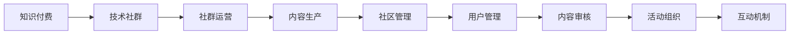

                 

# 知识付费：程序员的社群运营实操

> 关键词：知识付费, 社群运营, 程序员, 技术传播, 社区管理, 内容生产

## 1. 背景介绍

### 1.1 问题由来

随着互联网技术的发展，知识付费模式在全球范围内逐渐兴起。中国作为全球最大的互联网市场，知识付费市场也呈现出快速增长的态势。特别是在技术领域，程序员作为技术创新和转型的中坚力量，对高质量技术内容的消费需求愈发强烈。

当前，程序员获取技术知识的渠道多种多样，包括在线课程、博客、技术论坛、社群等。虽然在线课程和博客信息量大、覆盖面广，但大多内容质量参差不齐，而且难以实时互动。技术论坛虽然有较强的社区互动性，但内容多以技术交流为主，缺乏系统性，且易受低质量内容干扰。相比之下，基于技术社群的知识付费模式以其个性化、系统化、实时互动等特点，逐渐成为程序员获取技术知识的重要途径。

### 1.2 问题核心关键点

尽管技术社群的知识付费模式具有诸多优势，但其实际运营面临诸多挑战。如何构建一个高效的社群，吸纳并管理好大量技术型用户，持续产出高质量内容，是社群运营过程中需重点关注的问题。本文章将从知识付费模式的视角，重点讨论程序员社群运营的实操方法，旨在帮助社群运营者制定科学有效的运营策略，提升社群价值。

### 1.3 问题研究意义

对程序员社群运营的研究具有重要意义：

1. **提升技术传播效率**：社群运营者通过精细化运营，可以提升技术知识的传播效率，实现知识的高效共享。
2. **优化社区体验**：良好的社群运营能提升社区用户的满意度和留存率，促使用户积极参与社区活动。
3. **促进知识转化**：高质量的内容和及时的互动，有助于技术知识的快速转化和应用。
4. **激发创新活力**：通过知识分享和交流，激发用户的技术创新思维和实践能力。
5. **增强社群粘性**：优化社群管理，增强用户粘性，构建长期稳定的技术学习平台。

## 2. 核心概念与联系

### 2.1 核心概念概述

为了更好地理解程序员社群运营的实操方法，本节将介绍几个核心概念及其之间的关系：

- **知识付费**：指消费者为获取有价值的知识内容，向知识提供者支付费用的模式。知识付费强调知识内容的系统性和高价值，以提升用户的学习效果。

- **技术社群**：由技术爱好者、开发者、工程师等技术相关人士组成的线上或线下社区，其核心在于技术交流、分享和创新。

- **社群运营**：指对技术社群的组织、管理和维护，旨在提升社群价值，增强用户粘性，实现知识高效传播和转化。

- **内容生产**：指在技术社群中，高质量技术内容的创作和传播，涉及技术文章、代码分享、项目案例、问题解答等。

- **社区管理**：包括用户管理、内容审核、活动组织、互动机制等，是社群运营的基础和核心。

这些核心概念通过适当的运营策略，可构建一个高效的知识付费技术社群，促使用户积极参与技术交流和知识传播。

### 2.2 核心概念原理和架构的 Mermaid 流程图(Mermaid 流程节点中不要有括号、逗号等特殊字符)



这个流程图展示了知识付费、技术社群、社群运营、内容生产、社区管理、用户管理、内容审核、活动组织和互动机制之间的逻辑关系。通过合理的流程设计和策略实施，知识付费模式可以更高效地促进技术知识的学习和传播。

## 3. 核心算法原理 & 具体操作步骤

### 3.1 算法原理概述

技术社群运营的算法原理主要包括以下几个关键方面：

1. **内容推荐算法**：通过分析用户行为和偏好，智能推荐用户感兴趣的技术内容。
2. **用户行为分析**：通过大数据分析技术，挖掘用户行为模式，指导运营策略的制定和调整。
3. **互动效果优化**：通过算法优化互动机制，提升社区用户的参与度和满意度。
4. **内容质量评估**：通过机器学习技术，实时评估内容质量，保证知识付费内容的优质性和权威性。
5. **用户粘性提升**：通过用户画像分析和个性化推荐，增强用户粘性，促进持续参与。

### 3.2 算法步骤详解

以下是技术社群运营的具体操作步骤：

**Step 1: 构建社群架构**

- **角色划分**：明确社群管理员、内容贡献者、技术支持者、社区用户等各类角色的职责和权利。
- **规章制度**：制定社群规则，包括用户行为规范、内容发布标准、互动行为准则等。

**Step 2: 用户招募与管理**

- **用户画像分析**：通过问卷调查、行为分析等方式，了解用户的基本情况、技术水平、兴趣偏好等，建立用户画像。
- **用户分类与细分**：根据用户画像，进行用户分类和细分，制定针对性运营策略。
- **用户管理工具**：选择合适的用户管理工具，如用户管理系统、积分系统、权限管理等。

**Step 3: 内容生产与传播**

- **内容激励机制**：制定内容激励政策，鼓励技术贡献者积极产出高质量内容。
- **内容质量评估**：建立内容审核机制，确保内容质量。
- **内容传播策略**：制定内容传播策略，选择合适的传播渠道和时间节点。

**Step 4: 互动机制设计**

- **互动激励**：设计互动激励机制，如积分、排名、勋章等，提升用户参与度。
- **互动监控**：实时监控互动情况，及时处理用户问题。
- **反馈收集**：通过问卷调查、用户反馈等方式，收集用户对互动机制的意见和建议。

**Step 5: 运营效果评估与优化**

- **效果评估指标**：建立社群运营效果评估指标，如用户留存率、内容质量、互动频次等。
- **数据分析与洞察**：通过数据分析工具，深入洞察用户行为和社群运营效果。
- **策略优化**：根据分析结果，优化运营策略，提升社群价值。

### 3.3 算法优缺点

技术社群运营的算法具有以下优点：

1. **高效推荐**：智能推荐算法可以快速精准推荐用户感兴趣的技术内容，提高知识传播效率。
2. **数据驱动**：通过大数据分析，可以实时调整运营策略，确保运营效果的最大化。
3. **互动优化**：互动机制的设计和优化，能提升用户参与度，增强社群活力。

同时，该算法也存在一些局限性：

1. **技术门槛高**：涉及算法设计、数据处理、模型训练等技术环节，对运营者技术要求较高。
2. **数据隐私问题**：大数据分析需收集大量用户数据，可能存在隐私泄露的风险。
3. **内容质量不稳定**：依赖内容贡献者的产出，内容质量可能存在波动。
4. **运营成本高**：数据收集、算法模型训练、系统维护等成本较高。

### 3.4 算法应用领域

技术社群运营的算法广泛应用于多个领域：

- **在线教育平台**：通过智能推荐和互动机制，提升课程学习效果，增强用户粘性。
- **开源社区**：管理社区代码提交、问题解答等，优化社区互动。
- **企业技术交流群**：管理知识分享、项目讨论等，提升技术传播效率。
- **技术论坛和博客**：优化内容推荐，增强用户互动，提升平台价值。

## 4. 数学模型和公式 & 详细讲解 & 举例说明（备注：数学公式请使用latex格式，latex嵌入文中独立段落使用 $$，段落内使用 $)
### 4.1 数学模型构建

本节将使用数学语言对技术社群运营的算法模型进行描述。

**推荐算法模型**：

假设用户集合为 $U$，内容集合为 $C$，用户对内容的评分向量为 $R_{U\times C}$，内容对用户的评分向量为 $R_{C\times U}$，用户-内容评分矩阵为 $R$。推荐系统目标是最小化预测评分与实际评分之间的误差，即：

$$
\min_{\theta} \frac{1}{2} \sum_{(i,j) \in U \times C} \left(r_{i,j} - \hat{r}_{i,j} \right)^2
$$

其中 $\theta$ 为模型参数，$\hat{r}_{i,j}$ 为预测评分。

**用户行为分析模型**：

假设用户 $u$ 对内容 $c$ 的行为序列为 $A_u = \{a_1, a_2, \ldots, a_t\}$，其中 $a_t$ 表示第 $t$ 次行为，$b_t$ 表示行为类型（如阅读、点赞、评论等），则行为序列的概率分布为：

$$
P(A_u|U) = \frac{1}{Z} \exp \left( \sum_{t=1}^T \log P(b_t|a_t, u) \right)
$$

其中 $Z$ 为归一化因子。

**内容质量评估模型**：

假设内容 $c$ 的质量向量为 $Q_c = (q_1, q_2, \ldots, q_n)$，其中 $q_i$ 表示第 $i$ 个质量指标的评分，$P(Q_c)$ 表示内容质量的分布，则内容质量的概率分布为：

$$
P(Q_c|C) = \frac{1}{Z} \exp \left( \sum_{i=1}^n \log P(q_i|c) \right)
$$

其中 $Z$ 为归一化因子。

### 4.2 公式推导过程

以下我们以推荐算法模型为例，推导预测评分 $\hat{r}_{i,j}$ 的计算公式。

假设推荐模型采用协同过滤算法，利用用户-内容评分矩阵 $R$ 和内容特征向量 $F_c$，通过线性回归模型计算预测评分：

$$
\hat{r}_{i,j} = b + \sum_k r_{i,k} f_{j,k}
$$

其中 $b$ 为截距，$f_{j,k}$ 为内容特征对用户评分的权重，通过训练得到。

**用户行为分析模型**：

假设用户行为序列 $A_u$ 的概率分布满足马尔可夫链，则根据贝叶斯定理，有：

$$
P(A_u|U) = \frac{P(A_u, A_{u-1}, \ldots, A_1|U)}{P(A_{u-1}, \ldots, A_1|U)}
$$

通过迭代求解，可以实时预测用户的行为序列。

**内容质量评估模型**：

假设内容质量向量 $Q_c$ 的概率分布为高斯分布，则内容质量的密度函数为：

$$
P(Q_c|C) = \frac{1}{\sqrt{2\pi\sigma^2}} \exp \left( -\frac{\sum_{i=1}^n (q_i - \mu)^2}{2\sigma^2} \right)
$$

其中 $\mu$ 为内容质量的均值，$\sigma^2$ 为方差。

### 4.3 案例分析与讲解

下面我们以一个具体的案例，说明如何利用推荐算法模型进行技术社群的智能推荐。

**案例背景**：某技术社群拥有大量技术内容，内容发布形式包括文章、视频、代码片段等。用户可以关注特定内容发布者，并对其内容进行评论、点赞、分享等互动行为。

**推荐算法模型应用**：

1. **用户画像分析**：通过问卷调查和行为分析，收集用户的基本信息、技术水平、关注领域等，建立用户画像。
2. **内容特征提取**：对内容进行特征提取，包括关键词、发布时间、作者背景等。
3. **模型训练**：利用历史用户行为和内容特征，训练推荐模型，生成预测评分。
4. **推荐结果展示**：根据用户画像和预测评分，智能推荐用户感兴趣的内容，实时更新推荐结果。

例如，某用户甲关注了多个Java技术专家，其行为序列为阅读Java相关文章、点赞Java代码片段、评论Java开源项目等。通过行为分析模型预测其下次行为为阅读或关注新的Java内容，推荐算法根据用户画像和历史评分，推荐其可能感兴趣的新内容，如Python文章、C++开源项目等，实现精准推荐。

## 5. 项目实践：代码实例和详细解释说明
### 5.1 开发环境搭建

在进行技术社群运营的算法实践前，我们需要准备好开发环境。以下是使用Python进行开发的环境配置流程：

1. 安装Anaconda：从官网下载并安装Anaconda，用于创建独立的Python环境。

2. 创建并激活虚拟环境：
```bash
conda create -n pytech-env python=3.8 
conda activate pytech-env
```

3. 安装必要的Python包：
```bash
pip install numpy pandas scikit-learn scipy matplotlib seaborn nltk
```

4. 安装机器学习库和工具：
```bash
pip install scikit-learn pytorch torchvision torchaudio huggingface transformers
```

5. 安装社区管理工具：
```bash
pip install django markdown django-allauth django-crispy-forms django-slim
```

完成上述步骤后，即可在`pytech-env`环境中开始开发。

### 5.2 源代码详细实现

下面我们以一个简单的技术社群为例，给出使用Python和Django进行社群运营的代码实现。

**用户管理**：

```python
# users/models.py
from django.db import models
from django.contrib.auth.models import AbstractUser

class User(AbstractUser):
    def __str__(self):
        return self.username
```

**内容管理**：

```python
# content/models.py
from django.db import models
from users.models import User

class Content(models.Model):
    title = models.CharField(max_length=255)
    content = models.TextField()
    author = models.ForeignKey(User, on_delete=models.CASCADE)
    created_at = models.DateTimeField(auto_now_add=True)
    updated_at = models.DateTimeField(auto_now=True)

    def __str__(self):
        return self.title
```

**推荐算法模型**：

```python
# recommendation/models.py
from django.db import models
from content.models import Content

class Recommendation(models.Model):
    user = models.ForeignKey(User, on_delete=models.CASCADE)
    content = models.ForeignKey(Content, on_delete=models.CASCADE)
    rating = models.FloatField()

    def __str__(self):
        return f"{self.user} rated {self.content} with {self.rating}"
```

**推荐算法实现**：

```python
# recommendation/views.py
from django.shortcuts import render
from django.views import View
from recommendation.models import Recommendation
from sklearn.neighbors import NearestNeighbors

class RecommendationView(View):
    def get(self, request, user_id):
        user = User.objects.get(id=user_id)
        user_contents = Content.objects.filter(author=user)
        similar_contents = self._find_similar_contents(user_contents)
        recommendations = self._find_recommendations(similar_contents)
        return render(request, 'recommendation.html', {'user': user, 'recommendations': recommendations})

    def _find_similar_contents(self, contents):
        # 计算内容向量，使用欧式距离计算相似度
        content_vectors = []
        for content in contents:
            content_vectors.append(self._content_to_vector(content.content))
        similarity_matrix = self._calculate_similarity(content_vectors)
        similar_indices = self._find_nearest_neighbors(similarity_matrix, k=5)
        return [contents[i] for i in similar_indices]

    def _find_recommendations(self, similar_contents):
        # 根据相似内容生成推荐列表
        recommendations = []
        for content in similar_contents:
            recommendations.append((content, self._calculate_user_score(content.author, content)))
        recommendations.sort(key=lambda x: x[1], reverse=True)
        return [r[0] for r in recommendations]

    def _calculate_similarity(self, vectors):
        # 计算欧式距离
        return np.linalg.norm(vectors)

    def _calculate_nearest_neighbors(self, matrix, k):
        # 计算最近邻
        return np.argsort(matrix, axis=1)[:, :k]

    def _content_to_vector(self, content):
        # 将文本内容转化为向量
        return np.array(content.split())

    def _calculate_user_score(self, user, content):
        # 计算用户对内容的评分
        recommendation = Recommendation.objects.filter(user=user, content=content).first()
        if not recommendation:
            return 0
        return recommendation.rating
```

**社区活动管理**：

```python
# community/views.py
from django.shortcuts import render
from django.views import View
from community.models import Event

class EventView(View):
    def get(self, request, event_id):
        event = Event.objects.get(id=event_id)
        return render(request, 'event.html', {'event': event})
```

**互动激励机制**：

```python
# community/models.py
from django.db import models
from users.models import User

class Activity(models.Model):
    user = models.ForeignKey(User, on_delete=models.CASCADE)
    content = models.ForeignKey(Content, on_delete=models.CASCADE)
    action = models.CharField(max_length=255)
    timestamp = models.DateTimeField(auto_now_add=True)

    def __str__(self):
        return f"{self.user} {self.action} {self.content} at {self.timestamp}"
```

**互动效果优化**：

```python
# community/views.py
from django.shortcuts import render
from django.views import View
from community.models import Activity

class ActivityView(View):
    def get(self, request, content_id):
        content = Content.objects.get(id=content_id)
        activities = Activity.objects.filter(content=content).order_by('timestamp')
        return render(request, 'activity.html', {'content': content, 'activities': activities})
```

### 5.3 代码解读与分析

让我们再详细解读一下关键代码的实现细节：

**User模型**：

- `User`模型继承自`AbstractUser`模型，自定义了用户名字段。

**Content模型**：

- `Content`模型定义了内容标题、正文、作者、创建时间、更新时间等字段。

**Recommendation模型**：

- `Recommendation`模型定义了用户、内容、评分等字段，用于存储推荐数据。

**推荐算法实现**：

- `RecommendationView`类实现了推荐算法的功能，通过用户行为数据和内容相似度，推荐用户可能感兴趣的新内容。
- `_find_similar_contents`方法通过计算欧式距离，找出与用户行为相似的内容。
- `_find_recommendations`方法根据相似内容生成推荐列表。
- `_calculate_similarity`方法计算欧式距离。
- `_calculate_nearest_neighbors`方法计算最近邻。
- `_content_to_vector`方法将文本内容转化为向量。
- `_calculate_user_score`方法计算用户对内容的评分。

**社区活动管理**：

- `Event`模型定义了活动信息，用于管理社区活动。
- `EventView`类实现了活动展示功能，展示具体活动的详细信息。

**互动激励机制**：

- `Activity`模型定义了用户互动信息，记录用户在内容上的互动行为。
- `ActivityView`类实现了活动展示功能，展示具体内容的互动情况。

## 6. 实际应用场景

### 6.1 技术社群运营

技术社群运营是一个多方面、综合性的过程，包括以下几个关键环节：

**用户招募与管理**：

- **用户画像分析**：通过问卷调查、行为分析等方式，了解用户的基本情况、技术水平、兴趣偏好等，建立用户画像。
- **用户管理工具**：选择合适的用户管理工具，如用户管理系统、积分系统、权限管理等。
- **用户激励机制**：设计用户激励政策，如积分、排名、勋章等，增强用户粘性。

**内容生产与传播**：

- **内容激励机制**：制定内容激励政策，鼓励技术贡献者积极产出高质量内容。
- **内容质量评估**：建立内容审核机制，确保内容质量。
- **内容传播策略**：选择合适的传播渠道和时间节点，提升内容传播效果。

**互动机制设计**：

- **互动激励**：设计互动激励机制，如积分、排名、勋章等，提升用户参与度。
- **互动监控**：实时监控互动情况，及时处理用户问题。
- **反馈收集**：通过问卷调查、用户反馈等方式，收集用户对互动机制的意见和建议。

### 6.2 未来应用展望

技术社群运营的未来发展趋势主要包括：

1. **智能化推荐**：通过大数据和人工智能技术，实现更加精准的内容推荐，提升用户满意度和留存率。
2. **个性化运营**：通过用户画像分析，实现个性化运营，提升社群价值。
3. **社区生态建设**：构建完整的社区生态，包括内容创作、知识传播、互动交流等，形成良性循环。
4. **多模态融合**：将文字、图片、视频等多模态内容进行深度融合，提升内容表达力和传播效果。
5. **知识共享平台**：构建开放的知识共享平台，实现技术知识的高效传播和交流。
6. **社区治理机制**：建立科学的社区治理机制，保障社群健康有序发展。

## 7. 工具和资源推荐
### 7.1 学习资源推荐

为了帮助开发者系统掌握技术社群运营的理论基础和实践技巧，这里推荐一些优质的学习资源：

1. **《社区运营实战指南》**：系统讲解了社区运营的各个环节，包括用户管理、内容生产、互动机制等，适合新手入门。
2. **《NLP与知识图谱》**：详细介绍了自然语言处理和知识图谱在社群运营中的应用，包括推荐算法、情感分析、实体识别等。
3. **《人工智能与社区建设》**：深入探讨了人工智能技术在社区建设中的应用，如智能推荐、个性化运营等。
4. **《社区运营与用户管理》**：讲解了社区运营中用户管理的各个方面，包括用户画像、用户激励、社区治理等。
5. **《社区运营的挑战与机遇》**：分析了社区运营面临的挑战，提出了未来发展的方向和策略。

### 7.2 开发工具推荐

高效的开发离不开优秀的工具支持。以下是几款用于技术社群运营开发的常用工具：

1. **Python**：简单易用、生态丰富，是社区运营开发的首选语言。
2. **Django**：强大的Web框架，适合快速搭建社区管理后台。
3. **MySQL**：稳定的关系型数据库，适合存储社区数据。
4. **Redis**：高效的数据缓存系统，适合提升社区数据访问效率。
5. **Fluentd**：灵活的日志收集和处理系统，适合监控社区互动情况。
6. **Grafana**：开源的数据可视化工具，适合监控社区运营效果。

### 7.3 相关论文推荐

技术社群运营的研究涉及多个领域，以下是几篇奠基性的相关论文，推荐阅读：

1. **《基于机器学习的社区推荐算法》**：介绍了机器学习在社区推荐中的应用，包括协同过滤、深度学习等算法。
2. **《社区运营行为分析与优化》**：分析了社区运营中的用户行为模式，提出了优化策略。
3. **《技术社群的互动机制设计》**：讨论了社区互动机制的设计和优化，包括激励机制、互动监控等。
4. **《知识图谱在社群运营中的应用》**：介绍了知识图谱在技术社群中的深度融合应用，如知识共享、内容推荐等。
5. **《人工智能与社区治理》**：探讨了人工智能技术在社区治理中的应用，包括智能推荐、用户画像等。

## 8. 总结：未来发展趋势与挑战

### 8.1 总结

本文对技术社群运营的研究进行了全面系统的介绍。通过详细分析技术社群运营的核心概念和算法原理，提供了实际应用的代码实现，帮助开发者系统掌握技术社群运营的理论基础和实践技巧。技术社群运营是一个多方面、综合性的过程，涉及用户管理、内容生产、互动机制等多个环节。通过科学的运营策略和工具支持，技术社群可以实现高质量技术内容的产出和高效传播，构建一个高效的知识付费技术平台。

### 8.2 未来发展趋势

展望未来，技术社群运营的发展趋势主要包括：

1. **智能化推荐**：通过大数据和人工智能技术，实现更加精准的内容推荐，提升用户满意度和留存率。
2. **个性化运营**：通过用户画像分析，实现个性化运营，提升社群价值。
3. **社区生态建设**：构建完整的社区生态，包括内容创作、知识传播、互动交流等，形成良性循环。
4. **多模态融合**：将文字、图片、视频等多模态内容进行深度融合，提升内容表达力和传播效果。
5. **知识共享平台**：构建开放的知识共享平台，实现技术知识的高效传播和交流。
6. **社区治理机制**：建立科学的社区治理机制，保障社群健康有序发展。

### 8.3 面临的挑战

尽管技术社群运营具有广阔的发展前景，但在实际运营中仍面临诸多挑战：

1. **技术门槛高**：涉及大数据、人工智能等多个技术领域，对运营者技术要求较高。
2. **数据隐私问题**：收集大量用户数据，可能存在隐私泄露的风险。
3. **内容质量不稳定**：依赖内容贡献者的产出，内容质量可能存在波动。
4. **运营成本高**：数据收集、算法模型训练、系统维护等成本较高。
5. **社区活跃度不足**：如何保持社群活跃度，吸引更多用户参与，是运营的重要挑战。
6. **用户行为复杂**：用户行为模式复杂多样，如何精准把握用户需求，是运营的重要课题。

### 8.4 研究展望

未来，技术社群运营的研究方向可能包括以下几个方面：

1. **跨模态技术融合**：将文字、图片、视频等多模态内容进行深度融合，提升内容表达力和传播效果。
2. **多领域知识图谱**：构建多领域知识图谱，实现更全面、精准的内容推荐。
3. **深度学习在社区运营中的应用**：利用深度学习技术，实现更加智能化的推荐和互动。
4. **社区治理机制优化**：优化社区治理机制，构建健康、有序的社区环境。
5. **用户画像与行为分析**：深入分析用户画像和行为模式，提升运营策略的精准度。
6. **社区知识共享与传播**：构建开放的知识共享平台，实现技术知识的高效传播和交流。

总之，技术社群运营是一个复杂而有趣的研究领域，具有广阔的应用前景和研究价值。通过深入研究和不断创新，我们相信技术社群运营必将为技术知识的传播和交流带来新的突破，构建一个高效、有价值的知识付费平台。

## 9. 附录：常见问题与解答

**Q1：如何选择合适的内容推荐算法？**

A: 选择合适的内容推荐算法需要考虑以下几个因素：
1. **数据量和特征**：如果数据量和特征较少，可以选用简单的协同过滤算法；如果数据量和特征较多，可以考虑深度学习等复杂算法。
2. **模型复杂度**：简单算法模型易于理解和实现，复杂算法模型更准确但计算成本高。
3. **实时性要求**：实时性要求高的场景，需选择计算效率高的算法。
4. **效果评估**：通过实验评估算法效果，选择最合适的算法。

**Q2：如何构建用户画像？**

A: 构建用户画像通常涉及以下步骤：
1. **问卷调查**：设计问卷，收集用户基本信息、技术水平、兴趣偏好等。
2. **行为分析**：通过分析用户行为数据，挖掘用户行为模式。
3. **画像模型**：选择合适的模型，如K-means、PCA等，构建用户画像。
4. **画像更新**：定期更新用户画像，保持画像的实时性和准确性。

**Q3：如何选择合适的内容传播渠道？**

A: 选择合适的内容传播渠道需要考虑以下几个因素：
1. **目标用户**：根据目标用户特点，选择合适的传播渠道，如社交媒体、技术论坛、博客等。
2. **传播效果**：通过实验评估不同渠道的传播效果，选择最合适的渠道。
3. **传播成本**：评估不同渠道的传播成本，选择性价比高的渠道。
4. **传播频率**：根据内容特点，选择合理的传播频率，保持用户对内容的关注。

**Q4：如何设计互动激励机制？**

A: 设计互动激励机制需要考虑以下几个因素：
1. **激励方式**：选择合适的激励方式，如积分、排名、勋章等。
2. **激励强度**：根据用户行为，设计合理的激励强度，避免过度激励或激励不足。
3. **激励公平性**：确保激励机制的公平性，避免不公平现象。
4. **激励效果**：通过实验评估互动激励机制的效果，不断优化激励策略。

**Q5：如何提高社区活跃度？**

A: 提高社区活跃度需要从多个方面入手：
1. **内容质量**：保证高质量的内容产出，吸引用户关注和参与。
2. **互动机制**：设计合理的互动机制，增强用户参与度。
3. **用户管理**：通过用户管理工具，维护社区秩序，提升用户体验。
4. **活动组织**：组织各类社区活动，增强用户粘性。
5. **激励政策**：制定合理的内容激励政策，鼓励用户积极参与。

---

作者：禅与计算机程序设计艺术 / Zen and the Art of Computer Programming

