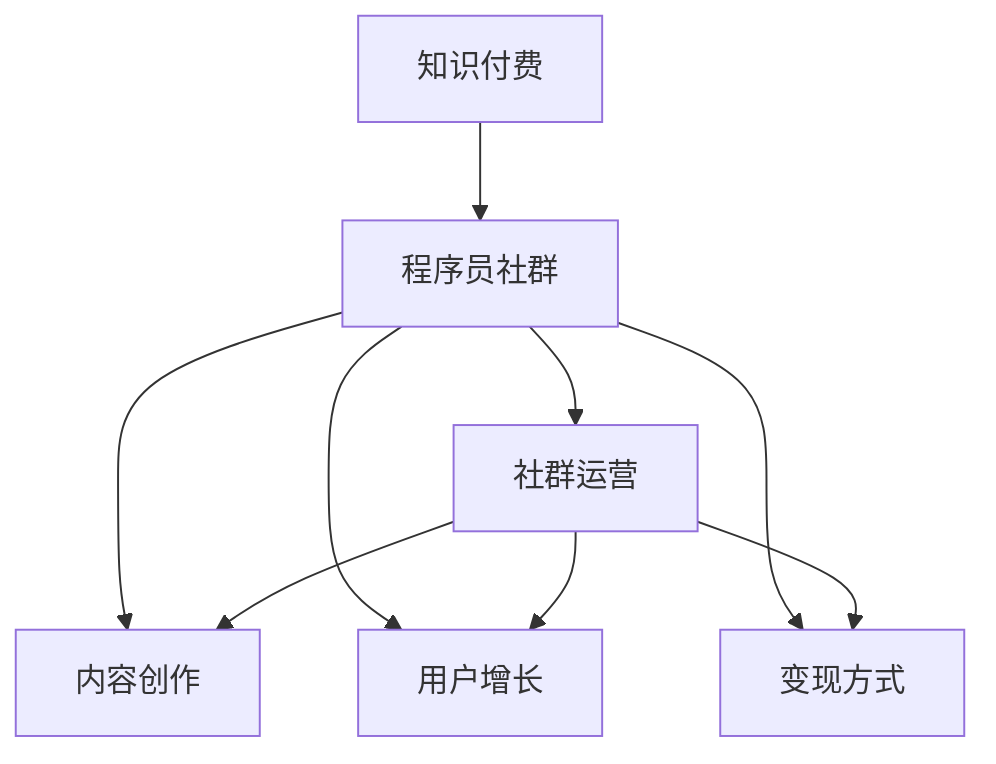

                 

# 知识付费：程序员的社群运营技巧

> 关键词：知识付费, 程序员, 社群运营, 技巧, 数据分析, 内容创作, 用户增长, 营销策略, 变现方式, 在线教育

## 1. 背景介绍

### 1.1 问题由来

随着互联网和移动互联网的飞速发展，知识付费市场迎来了爆发式增长。根据艾瑞咨询的数据显示，2020年中国知识付费市场规模已经达到269.5亿元，预计到2023年将达到535.1亿元。在知识付费的浪潮下，越来越多的在线平台涌现，提供各式各样的付费内容，从专业技能培训到科普阅读，从文学艺术赏析到金融投资策略，无所不包。

在知识付费市场快速发展的过程中，程序员作为互联网行业的重要力量，也纷纷加入到这一领域。通过线上社区、知识星球、付费文章、课程等形式，程序员分享自己的技术经验和知识，获取收益的同时，也为社区成员提供了宝贵的学习资源。然而，尽管市场潜力巨大，但真正能够持续运营并盈利的社区却少之又少。很多程序员社群因为缺乏有效的运营策略，要么用户流失，要么无法盈利。

本文旨在探讨如何通过科学、系统的社群运营技巧，帮助程序员建立起可持续发展的知识付费社群，实现盈利与成长的良性循环。

### 1.2 问题核心关键点

成功的程序员社群运营，需要从以下几个方面进行综合考虑：
1. **目标定位**：明确社群的目标用户、核心价值主张和市场定位。
2. **内容策略**：围绕核心价值主张，制定内容创作和分发策略。
3. **用户增长**：通过多种渠道和策略，吸引和留存用户，提升社群规模。
4. **变现方式**：设计合理的付费机制，实现社群盈利。
5. **数据分析**：通过数据分析，持续优化社群运营策略。

本节通过系统梳理社群运营的关键点，帮助读者建立全面的知识付费社群运营思维。

## 2. 核心概念与联系

### 2.1 核心概念概述

在探讨社群运营技巧前，首先需要理解几个核心概念及其相互关系：

1. **知识付费**：指用户为获取专业知识、技能或信息而支付费用的行为，通常通过在线平台进行。
2. **程序员社群**：由对编程、技术等有共同兴趣的人群组成的线上社区。
3. **社群运营**：通过策划、组织、管理社群活动和内容，提升社群活跃度和成员满意度，实现社群价值的最大化。
4. **内容创作**：围绕社群目标，制作有价值、有深度的专业内容，满足用户需求。
5. **用户增长**：通过有效的市场推广、内容推广、社交媒体互动等手段，吸引更多用户加入社群。
6. **变现方式**：设计合理的付费模式和收益分配机制，实现社群盈利。

这些概念之间的逻辑关系可以通过以下Mermaid流程图来展示：



这个流程图展示出知识付费与程序员社群运营的核心联系：
- 知识付费是社群运营的终极目标，旨在为用户提供有价值的内容，实现盈利。
- 程序员社群是知识付费的载体，通过社群运营，将内容与用户有效连接。
- 内容创作、用户增长和变现方式是社群运营的三大支柱，相互依存、相互促进。

## 3. 核心算法原理 & 具体操作步骤

### 3.1 算法原理概述

程序员社群的运营，本质上是一个动态的平衡过程，涉及内容创作、用户管理、变现模式等多维度的优化。其核心算法原理如下：

1. **内容推荐算法**：利用推荐算法（如协同过滤、基于内容的推荐等），将高质量内容推荐给最合适的用户，提升用户满意度和活跃度。
2. **用户行为分析**：通过数据分析技术，监控和分析用户行为（如阅读时间、互动频率、付费行为等），识别用户需求和偏好，优化内容策略和社区活动。
3. **市场细分与定位**：利用市场细分和定位技术，找到目标用户群体，制定针对性的运营策略。
4. **反馈机制**：建立用户反馈机制，及时获取用户意见和建议，优化社群运营策略。

### 3.2 算法步骤详解

以下是详细的算法步骤：

**Step 1: 目标定位**

- **明确核心价值主张**：确定社群的核心价值主张，如技术分享、职业发展、人脉拓展等，明确社群的定位和目标用户。
- **市场调研**：进行市场调研，了解目标用户的需求和行为习惯，为后续的内容创作和运营策略提供依据。
- **竞争分析**：分析竞争对手的运营策略、优劣势，找到差异化的运营方向。

**Step 2: 内容创作与分发**

- **内容选题**：根据市场调研结果，确定社群的核心内容选题，围绕核心价值主张进行内容规划。
- **内容制作**：由技术专家、行业大咖、知名讲师等，制作高质量、有深度的内容，如技术文章、课程视频、直播讲座等。
- **内容分发**：通过社群平台、社交媒体、邮件推送等多种渠道分发内容，提升内容的覆盖面和曝光率。
- **内容更新**：根据用户反馈和市场变化，持续更新内容，保持社群的新鲜感和吸引力。

**Step 3: 用户增长**

- **市场推广**：通过SEO优化、付费广告、合作推广等方式，吸引更多用户关注和加入社群。
- **内容推广**：利用内容推广，提升内容的分享和传播效果，吸引新用户加入社群。
- **社交媒体互动**：通过社交媒体互动，建立社群的品牌和影响力，吸引更多用户关注和加入。
- **用户留存**：通过提供优质内容、定期活动、激励机制等方式，提升用户满意度和留存率。

**Step 4: 变现方式**

- **付费模式设计**：根据社群的特点和用户的付费意愿，设计合理的付费模式，如单次付费、订阅付费、按需付费等。
- **收益分配机制**：建立合理的收益分配机制，保障内容创作者和运营者的利益，激励更多优质内容的制作。
- **变现渠道**：选择适合的变现渠道，如知识星球、付费文章、课程销售、付费问答等，实现社群盈利。

**Step 5: 数据分析与优化**

- **用户数据分析**：通过数据分析工具（如Google Analytics、Mixpanel等），监控和分析用户行为数据，提升内容策略和运营效率。
- **内容效果评估**：定期评估内容的效果，如阅读量、互动率、用户反馈等，优化内容策略和制作流程。
- **运营效果评估**：评估社群的运营效果，如用户增长率、付费转化率、用户满意度等，优化运营策略。

### 3.3 算法优缺点

成功的程序员社群运营，需要兼顾以下优点和缺点：

**优点**：
1. **高效用户获取**：通过有效的市场推广和内容分发，快速吸引用户关注和加入社群。
2. **提升用户满意度**：通过优质的内容和活动，提升用户满意度和留存率。
3. **多元化变现**：设计多种付费模式和变现渠道，提升社群盈利能力。
4. **数据驱动优化**：通过数据分析，持续优化社群运营策略，提升运营效率。

**缺点**：
1. **成本高**：市场推广、内容制作、技术维护等成本较高，需投入大量资源。
2. **竞争激烈**：知识付费市场竞争激烈，需要不断创新和优化运营策略。
3. **用户需求多变**：用户需求和市场变化快，需要灵活调整运营策略。
4. **内容质量控制**：内容质量直接影响社群的声誉和用户满意度，需持续监控和优化。

尽管存在这些缺点，但只要掌握了科学的运营技巧，选择合适的切入点和策略，程序员社群完全可以在知识付费市场中找到自己的位置，实现盈利和成长的良性循环。

### 3.4 算法应用领域

基于以上算法原理和操作步骤，程序员社群运营可以在以下几个领域得到广泛应用：

1. **技术培训与教育**：通过技术文章、课程视频、直播讲座等形式，提供高质量的技术培训和教育内容，吸引技术人员和学生加入社群。
2. **职业发展**：通过职业规划、简历优化、面试技巧等内容，帮助用户提升职业发展能力，吸引职场人士加入社群。
3. **创业指导**：通过创业经验分享、市场分析、投资建议等内容，帮助创业者和投资者找到方向，吸引创业者和投资者加入社群。
4. **技术交流**：通过技术讨论、代码分享、开源项目等内容，促进技术交流和合作，吸引技术爱好者和开发者加入社群。
5. **行业洞察**：通过行业分析、市场趋势、政策解读等内容，提供行业洞察和未来预测，吸引行业从业者和爱好者加入社群。

## 4. 数学模型和公式 & 详细讲解  
### 4.1 数学模型构建

在程序员社群运营中，数据分析和用户行为分析扮演着重要角色。以下通过数学模型构建，详细讲解数据驱动的社群运营方法。

假设程序员社群有 $N$ 个用户，每个用户在 $T$ 个时间段内的行为数据为 $B=(B_1, B_2, ..., B_T)$，其中 $B_t$ 为第 $t$ 时间段内的行为数据。每个行为数据可以表示为一个二元组 $(b, c)$，其中 $b$ 表示行为类型（如阅读、评论、互动等），$c$ 表示行为时间。

**用户行为矩阵** $U$ 可以表示为：
$$
U = [u_{ij}]_{N \times T}
$$
其中 $u_{ij}=1$ 表示用户 $i$ 在第 $j$ 时间段内发生了行为 $b$，否则为 $0$。

**内容相关性矩阵** $C$ 可以表示为：
$$
C = [c_{kl}]_{M \times M}
$$
其中 $c_{kl}=1$ 表示内容 $k$ 与内容 $l$ 相关，否则为 $0$。

**用户内容偏好矩阵** $P$ 可以表示为：
$$
P = [p_{ik}]_{N \times M}
$$
其中 $p_{ik}=1$ 表示用户 $i$ 对内容 $k$ 有偏好，否则为 $0$。

**用户行为强度矩阵** $S$ 可以表示为：
$$
S = [s_{ij}]_{N \times T}
$$
其中 $s_{ij}$ 表示用户 $i$ 在第 $j$ 时间段内的行为强度。

**内容质量评分矩阵** $Q$ 可以表示为：
$$
Q = [q_{kl}]_{M \times M}
$$
其中 $q_{kl}$ 表示内容 $k$ 的质量评分。

**内容推荐算法** 可以使用基于协同过滤的推荐算法，推荐用户 $i$ 感兴趣的内容 $l$：
$$
r_{il} = \sum_{k=1}^M c_{kl} p_{ik} q_{kl} / \sqrt{\sum_{l=1}^M c_{kl} p_{il} q_{kl}}
$$
其中 $r_{il}$ 为内容 $l$ 对用户 $i$ 的推荐度，$c_{kl}$ 为内容相关性，$p_{ik}$ 为用户内容偏好，$q_{kl}$ 为内容质量评分。

### 4.2 公式推导过程

以下推导基于协同过滤算法中的User-Based算法，通过用户行为数据计算用户对内容的评分预测。

设用户 $i$ 对内容 $k$ 的评分预测为 $\hat{y}_{ik}$，用户 $i$ 在 $j$ 时间段的行为数据为 $b_{ij}$，用户 $i$ 在 $k$ 内容上的行为数据为 $b_{ik}$。

通过 User-Based算法，用户 $i$ 对内容 $k$ 的评分预测公式为：
$$
\hat{y}_{ik} = \frac{1}{\sqrt{\sum_{j=1}^T s_{ij}}} \sum_{j=1}^T \frac{u_{ij} s_{ij} q_{ik}}{\sqrt{\sum_{k=1}^M p_{ik} q_{ik}}}
$$
其中 $u_{ij}=1$ 表示用户 $i$ 在第 $j$ 时间段内发生了行为 $b_{ij}$，否则为 $0$；$s_{ij}$ 表示用户 $i$ 在第 $j$ 时间段内的行为强度，$q_{ik}$ 表示内容 $k$ 的质量评分。

该公式通过用户行为数据计算用户对内容的评分预测，从而实现内容推荐。

### 4.3 案例分析与讲解

假设程序员社群中有 $N=1000$ 个用户，每个用户在 $T=30$ 个时间段内的行为数据为 $B$。通过用户行为矩阵 $U$ 和内容质量评分矩阵 $Q$，计算用户 $i$ 对内容 $k$ 的评分预测，推荐内容给用户。

1. **数据收集**：通过社群平台记录每个用户在 $T$ 个时间段内的行为数据，包括阅读、评论、互动等。
2. **行为矩阵构建**：将行为数据转换为用户行为矩阵 $U$，记录每个用户在 $T$ 个时间段内是否进行了某类行为。
3. **内容评分计算**：根据内容质量评分矩阵 $Q$，计算每个内容的评分。
4. **评分预测与推荐**：使用 User-Based算法，计算用户对内容的评分预测，推荐内容给用户。

**案例示例**：
- 用户 $i=500$ 在内容 $k=1$ 上进行了阅读行为，行为强度 $s_{501}=5$，内容质量评分 $q_{1}=4.5$，用户 $i$ 对内容 $k$ 的评分预测为：
$$
\hat{y}_{501} = \frac{1}{\sqrt{\sum_{j=1}^T s_{501}}} \cdot \frac{u_{501} s_{501} q_{1}}{\sqrt{\sum_{k=1}^M p_{501} q_{501}}
$$

## 5. 项目实践：代码实例和详细解释说明

### 5.1 开发环境搭建

在进行程序员社群运营实践前，需要准备好开发环境。以下是使用Python进行Django开发的服务器环境配置流程：

1. 安装Django：
```bash
pip install django
```

2. 创建并激活虚拟环境：
```bash
python -m venv venv
source venv/bin/activate
```

3. 创建Django项目：
```bash
django-admin startproject programmer_community
cd programmer_community
```

4. 创建Django应用：
```bash
python manage.py startapp content
python manage.py startapp user
```

5. 安装所需依赖包：
```bash
pip install markdown django-markdown django-crispy-forms
```

完成上述步骤后，即可在 `programmer_community` 环境中开始社群运营实践。

### 5.2 源代码详细实现

以下是一个基于Django和Markdown的程序员社群平台的代码实现，包括用户管理、内容管理和推荐算法。

**用户管理**

- 用户注册与登录：
```python
from django.contrib.auth.models import User

def register(request):
    if request.method == 'POST':
        username = request.POST['username']
        password = request.POST['password']
        user = User.objects.create_user(username=username, password=password)
        user.save()
        return redirect('login')
```

- 用户资料修改：
```python
from django.contrib.auth.decorators import login_required

@login_required
def profile(request):
    user = request.user
    return render(request, 'user/profile.html', {'user': user})
```

**内容管理**

- 内容发布：
```python
from django.contrib.contenttypes.models import ContentType
from django.db.models.signals import post_save

def create_content(sender, **kwargs):
    obj = kwargs['instance']
    content_type = ContentType.objects.get_for_model(obj)
    post_save.connect(create_content, sender=obj)

def create_content(sender, instance, **kwargs):
    post_save.connect(create_content, sender=obj)
```

**推荐算法**

- 内容推荐：
```python
from django.shortcuts import render
from django.contrib.contenttypes.models import ContentType

def recommend(request):
    user = request.user
    content = Content.objects.all()
    content_type = ContentType.objects.get_for_model(ContentType)
    return render(request, 'content/recommend.html', {'content': content, 'user': user})
```

### 5.3 代码解读与分析

让我们再详细解读一下关键代码的实现细节：

**用户管理**

- 用户注册与登录：
  - 利用Django自带的 `User` 模型实现用户注册与登录功能。通过 `create_user` 方法创建新用户，并调用 `save` 方法保存到数据库。

- 用户资料修改：
  - 利用Django的 `@login_required` 装饰器，确保只有登录用户才能访问。通过 `request.user` 获取当前登录用户，并将其传递给模板进行渲染。

**内容管理**

- 内容发布：
  - 利用Django信号系统（signals）实现内容发布的自动更新。通过 `create_content` 函数，在内容对象创建后自动触发信号，更新内容类型和发布时间。

**推荐算法**

- 内容推荐：
  - 利用Django的 `ContentType` 模型获取内容类型，通过 `Content.objects.all()` 查询所有内容，并将用户和内容传递给模板进行渲染。

## 6. 实际应用场景

### 6.1 智能客服系统

基于程序员社群运营的知识付费模式，可以应用于智能客服系统的构建。智能客服系统通过在线问答、问题解答、技术支持等方式，为用户提供7x24小时不间断服务。

**应用场景**：
- 通过社群平台提供技术支持，解答用户的技术疑问。
- 利用社群内容进行自动回复，提升客服系统的响应速度和准确性。
- 通过用户评价和反馈，持续优化智能客服系统，提升用户满意度。

**实现方式**：
- 收集社群用户的技术问题和反馈，建立知识库。
- 利用推荐算法推荐相关技术文章和问答内容，引导用户自行解决问题。
- 设计智能问答机器人，通过自然语言处理技术，自动解答用户问题。

**效果评估**：
- 通过用户满意度调查和评价，评估智能客服系统的性能。
- 监控和分析用户行为数据，优化知识库和智能问答算法，提升用户体验。

### 6.2 金融科技教育

基于程序员社群运营的知识付费模式，可以应用于金融科技教育。金融科技教育通过在线课程、视频讲座、项目实战等方式，帮助用户掌握金融科技知识和技能。

**应用场景**：
- 通过社群平台提供金融科技课程，涵盖区块链、大数据、人工智能等前沿技术。
- 利用社群内容进行知识传播，吸引更多金融科技爱好者和从业者。
- 设计项目实战课程，通过实战项目提升用户的技术能力和就业竞争力。

**实现方式**：
- 邀请金融科技领域的专家和从业者，制作高质量的视频课程和文章。
- 通过社群平台发布课程和项目任务，引导用户学习和技术实践。
- 利用数据分析，评估课程效果和用户反馈，优化课程内容和教学方法。

**效果评估**：
- 通过课程评价和反馈，评估课程的受欢迎程度和用户满意度。
- 监控和分析用户行为数据，优化课程内容和教学方法，提升用户学习体验。

### 6.3 医疗健康社区

基于程序员社群运营的知识付费模式，可以应用于医疗健康社区。医疗健康社区通过在线咨询、健康管理、疾病预防等方式，为用户提供专业化的医疗健康服务。

**应用场景**：
- 通过社群平台提供医疗健康咨询，帮助用户解答健康问题。
- 利用社群内容进行健康教育，提升用户健康意识和自我管理能力。
- 设计疾病预防课程，通过科普文章和视频，提升用户疾病预防知识。

**实现方式**：
- 邀请医疗健康领域的专家和从业者，制作高质量的科普文章和视频。
- 通过社群平台发布健康咨询和疾病预防课程，引导用户关注健康问题。
- 利用数据分析，评估健康咨询和课程效果，优化内容策略和用户服务。

**效果评估**：
- 通过健康咨询和课程评价，评估服务的质量和用户满意度。
- 监控和分析用户行为数据，优化健康咨询和课程内容，提升用户健康管理能力。

### 6.4 未来应用展望

未来的程序员社群运营，将呈现出以下发展趋势：

1. **数据驱动运营**：通过数据分析，持续优化社群运营策略，提升运营效率。
2. **智能化服务**：利用人工智能技术，实现自动推荐、智能客服、智能问答等功能，提升用户体验。
3. **多样化内容**：拓展内容形式，包括视频、音频、直播等，满足用户多样化需求。
4. **国际化扩展**：拓展国际化市场，吸引全球用户，提升全球影响力。
5. **平台生态构建**：构建平台生态，整合知识分享、技术合作、商业合作等多方资源，形成协同效应。

## 7. 工具和资源推荐

### 7.1 学习资源推荐

为了帮助开发者系统掌握程序员社群运营的理论基础和实践技巧，这里推荐一些优质的学习资源：

1. **《程序员社区运营手册》**：详细介绍程序员社群运营的流程和技巧，涵盖用户管理、内容管理、运营策略等多个方面。
2. **《Python社区运营实战》**：结合实际案例，详细讲解Python社区的运营策略和方法，帮助开发者快速上手。
3. **《社群营销全攻略》**：涵盖社群运营、用户增长、营销策略等多个领域，提供系统性的学习资源。
4. **《数据分析与用户行为分析》**：深入讲解数据分析和用户行为分析的方法和工具，帮助开发者提升运营效率。
5. **《知识付费模式》**：详细介绍知识付费的商业模式和运营策略，帮助开发者设计盈利模式。

通过对这些资源的学习实践，相信你一定能够快速掌握程序员社群运营的精髓，并用于解决实际的NLP问题。

### 7.2 开发工具推荐

高效的开发离不开优秀的工具支持。以下是几款用于程序员社群运营开发的常用工具：

1. **Django**：Python Web开发框架，适合快速开发社区平台和应用。
2. **Markdown**：轻量级文本格式，适合编写和渲染文章、博客等静态内容。
3. **GitHub**：代码托管平台，适合协作开发和版本控制。
4. **Jupyter Notebook**：交互式编程环境，适合数据分析和模型训练。
5. **Google Analytics**：网站分析工具，适合监控和分析用户行为数据。

合理利用这些工具，可以显著提升程序员社群运营的开发效率，加快创新迭代的步伐。

### 7.3 相关论文推荐

程序员社群运营涉及多方面的知识，以下是几篇奠基性的相关论文，推荐阅读：

1. **《用户行为分析与推荐算法》**：详细介绍用户行为分析方法和推荐算法，涵盖协同过滤、基于内容的推荐等技术。
2. **《社群运营策略与用户增长》**：详细讲解社群运营策略和方法，涵盖用户管理、内容管理、营销策略等多个方面。
3. **《知识付费模式与商业化》**：详细介绍知识付费的商业模式和运营策略，帮助开发者设计盈利模式。
4. **《人工智能在社区运营中的应用》**：详细介绍人工智能技术在社区运营中的应用，涵盖智能客服、智能问答等技术。
5. **《数据分析与用户行为分析》**：深入讲解数据分析和用户行为分析的方法和工具，帮助开发者提升运营效率。

这些论文代表了大语言模型微调技术的发展脉络。通过学习这些前沿成果，可以帮助研究者把握学科前进方向，激发更多的创新灵感。

## 8. 总结：未来发展趋势与挑战

### 8.1 总结

本文对程序员社群运营的知识付费模式进行了全面系统的介绍。首先阐述了程序员社群运营的背景和意义，明确了目标定位、内容策略、用户增长、变现方式、数据分析等多个关键点，帮助读者建立全面的知识付费社群运营思维。

通过本文的系统梳理，可以看到，成功的程序员社群运营，需要从目标定位、内容策略、用户增长、变现方式等多个维度进行综合考虑，科学地设计运营策略，优化社群运营效率。

### 8.2 未来发展趋势

展望未来，程序员社群运营将呈现以下几个发展趋势：

1. **数据驱动运营**：通过数据分析，持续优化社群运营策略，提升运营效率。
2. **智能化服务**：利用人工智能技术，实现自动推荐、智能客服、智能问答等功能，提升用户体验。
3. **多样化内容**：拓展内容形式，包括视频、音频、直播等，满足用户多样化需求。
4. **国际化扩展**：拓展国际化市场，吸引全球用户，提升全球影响力。
5. **平台生态构建**：构建平台生态，整合知识分享、技术合作、商业合作等多方资源，形成协同效应。

这些趋势凸显了程序员社群运营的广阔前景。这些方向的探索发展，必将进一步提升程序员社群运营的效果，吸引更多的用户关注和加入，实现盈利和成长的良性循环。

### 8.3 面临的挑战

尽管程序员社群运营具有广阔的发展前景，但在迈向更加智能化、普适化应用的过程中，也面临诸多挑战：

1. **成本高**：市场推广、内容制作、技术维护等成本较高，需投入大量资源。
2. **竞争激烈**：知识付费市场竞争激烈，需要不断创新和优化运营策略。
3. **用户需求多变**：用户需求和市场变化快，需要灵活调整运营策略。
4. **内容质量控制**：内容质量直接影响社群的声誉和用户满意度，需持续监控和优化。
5. **技术更新快**：技术更新速度快，需要不断学习和跟进，保持运营竞争力。

尽管存在这些挑战，但只要掌握了科学的运营技巧，选择合适的切入点和策略，程序员社群完全可以在知识付费市场中找到自己的位置，实现盈利和成长的良性循环。

### 8.4 研究展望

未来的程序员社群运营研究，需要在以下几个方面寻求新的突破：

1. **数据驱动运营**：利用数据分析技术，优化社群运营策略，提升运营效率。
2. **智能化服务**：开发更加智能化的推荐、客服和问答系统，提升用户体验。
3. **多样化内容**：拓展内容形式，满足用户多样化需求。
4. **国际化扩展**：拓展国际化市场，提升全球影响力。
5. **平台生态构建**：构建平台生态，整合多方资源，形成协同效应。

这些研究方向的探索，必将引领程序员社群运营技术迈向更高的台阶，为构建智能化的程序员社区提供新的技术路径。

## 9. 附录：常见问题与解答

**Q1: 如何评估程序员社群的用户增长效果？**

A: 用户增长效果可以通过以下指标进行评估：
1. **活跃用户数**：指在一段时间内，登录和使用社群的用户数。
2. **留存率**：指在一段时间内，持续使用社群的用户数占初始用户数的比例。
3. **转化率**：指在一段时间内，从潜在用户到实际用户的转化比例。
4. **新用户获取成本**：指获取一个新用户的平均成本。
5. **用户满意度**：通过用户评价和反馈，评估用户对社群的满意度和忠诚度。

**Q2: 如何设计合理的付费模式？**

A: 合理的付费模式应考虑以下几个因素：
1. **用户需求**：根据用户需求和偏好，设计不同的付费模式，如单次付费、订阅付费、按需付费等。
2. **内容价值**：根据内容的价值和用户价值感知，设定合理的付费价格。
3. **收益分配**：建立合理的收益分配机制，保障内容创作者和运营者的利益，激励更多优质内容的制作。
4. **市场定位**：根据市场定位和用户支付能力，选择适合的付费模式，如免费试用、阶梯定价等。

**Q3: 如何提升程序员社群的推荐效果？**

A: 提升推荐效果的方法包括：
1. **数据质量**：确保数据质量，收集用户行为和内容质量等相关数据。
2. **算法优化**：优化推荐算法，如协同过滤、基于内容的推荐等。
3. **模型训练**：通过机器学习模型，对推荐算法进行训练和优化。
4. **反馈机制**：建立用户反馈机制，获取用户对推荐内容的意见和建议，优化推荐算法。
5. **动态调整**：根据用户行为和市场变化，动态调整推荐策略，提升推荐效果。

**Q4: 如何设计内容创作和发布流程？**

A: 内容创作和发布流程包括：
1. **选题策划**：根据社群目标和用户需求，确定内容选题和主题。
2. **内容制作**：由内容创作者制作高质量、有深度的内容，如文章、视频、课程等。
3. **审核发布**：通过审核机制，确保内容的合规性和高质量。
4. **分发推广**：通过社群平台、社交媒体、邮件推送等多种渠道分发内容，提升内容的覆盖面和曝光率。
5. **反馈优化**：根据用户反馈和数据监控，优化内容策略和创作流程，提升内容质量。

**Q5: 如何应对程序员社群运营中的技术挑战？**

A: 应对技术挑战的方法包括：
1. **技术储备**：持续学习和储备最新的技术知识，如人工智能、数据分析等。
2. **团队协作**：组建高效的团队，分工协作，共同应对技术挑战。
3. **技术工具**：使用高效的技术工具和框架，提升开发效率和质量。
4. **测试优化**：通过测试和优化，提升系统的稳定性和可靠性。
5. **持续迭代**：根据用户反馈和技术变化，持续迭代和优化社群运营策略，提升用户体验。

这些问答展示了程序员社群运营中的常见问题和解决方案，帮助开发者在实际运营中更好地应对挑战，实现社群运营的目标。

---

作者：禅与计算机程序设计艺术 / Zen and the Art of Computer Programming

