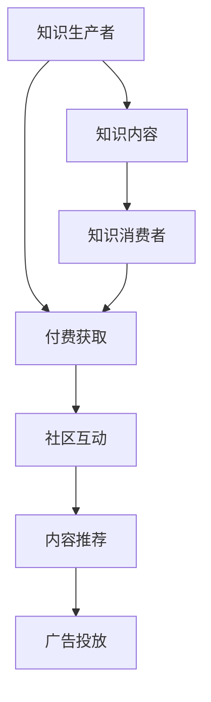

                 

## 1. 背景介绍

在数字化转型迅猛发展的今天，知识付费成为一种新兴的商业模式，并逐渐深入各行各业。对于程序员这一庞大而活跃的群体来说，知识付费更是一个不容忽视的重要领域。它不仅帮助程序员获取最新的技术动态和行业信息，更通过社区平台构建起一个知识分享与交流的生态，推动技术创新和行业发展。然而，面对庞大的用户基数和多样化的需求，如何运营一个既专业又有趣、既有益又可持续的知识付费社群，是一个值得深入探讨的问题。

## 2. 核心概念与联系

### 2.1 核心概念概述

为了更好地理解知识付费社群的运营方法，首先需明确以下几个核心概念：

- **知识付费（Knowledge-as-a-Service, KaaS）**：即通过付费获取专业知识和技能的服务形式，包括课程、教程、问答、社区订阅等。知识付费社群是知识付费的重要组成部分，通过在线平台连接知识生产者和消费者。

- **社群（Community）**：一群具有共同兴趣、目标或背景的人组成的群体。在知识付费领域，社群不仅是一个销售渠道，更是用户参与、交流和成长的空间。

- **运营（Operations）**：指对社群的整体规划、管理和服务，包括内容生产、用户互动、平台维护、广告营销等环节。良好的运营能够提升社群的活跃度和粘性，促进知识的流通和价值的实现。

- **会员制（Membership）**：社群通常会采用会员制的形式，通过设置不同的会员等级、特权和服务，吸引用户付费加入。

- **知识分享（Knowledge Sharing）**：社群运营的核心在于知识分享。知识生产者通过社区发布内容，知识消费者通过付费获取和使用。

### 2.2 核心概念原理和架构的 Mermaid 流程图



该图展示了知识付费社群的核心流程。知识生产者将知识内容发布到社区平台，知识消费者通过付费获取所需内容。社群平台提供互动和内容推荐服务，同时通过广告投放实现商业变现。

## 3. 核心算法原理 & 具体操作步骤

### 3.1 算法原理概述

知识付费社群的运营算法主要涉及内容推荐、用户行为分析和社群维护三个方面。这些算法通过数据驱动，最大化社群价值和用户满意度。

- **内容推荐算法**：基于用户的阅读历史、兴趣偏好和社交关系，推荐最适合的知识内容。推荐算法包括协同过滤、矩阵分解、深度学习等。

- **用户行为分析算法**：通过数据分析用户的行为模式，预测其兴趣变化，优化内容推荐，提升用户粘性。

- **社群维护算法**：通过用户互动和反馈数据，识别社群中的意见领袖、活跃用户和沉默用户，进行差异化维护和激励。

### 3.2 算法步骤详解

#### 3.2.1 内容推荐

1. **数据收集**：从用户的阅读记录、搜索历史、评价反馈中收集行为数据。
2. **特征提取**：对用户行为数据进行特征提取，包括阅读时长、评分、评论等。
3. **模型训练**：使用协同过滤、矩阵分解等算法对用户行为数据进行建模。
4. **推荐实现**：根据模型的预测结果，向用户推荐相关内容。

#### 3.2.2 用户行为分析

1. **数据收集**：收集用户的行为数据，包括登录时间、浏览内容、点击链接等。
2. **行为建模**：使用时序分析、聚类等方法对用户行为数据建模，识别行为模式。
3. **兴趣预测**：通过模型预测用户未来的兴趣变化，优化内容推荐。

#### 3.2.3 社群维护

1. **用户分组**：根据用户的活跃度、贡献度和付费等级进行分组。
2. **差异化维护**：对活跃用户提供专属特权，如优先推荐、专属课程等；对沉默用户进行激励，如积分、折扣等。
3. **互动分析**：分析用户的互动行为，识别意见领袖和潜在领袖，进行重点关注和引导。

### 3.3 算法优缺点

#### 3.3.1 内容推荐算法

- **优点**：
  - 个性化推荐，提升用户满意度。
  - 通过数据驱动，降低人工干预。
- **缺点**：
  - 需要大量用户数据，隐私保护压力大。
  - 模型复杂，计算开销大。

#### 3.3.2 用户行为分析算法

- **优点**：
  - 通过预测用户行为，提升内容推荐准确性。
  - 用户行为数据易于收集，算法效果可量化。
- **缺点**：
  - 预测模型依赖于历史数据，对新用户效果有限。
  - 复杂度较高，容易过拟合。

#### 3.3.3 社群维护算法

- **优点**：
  - 精准识别关键用户，提升社群活跃度。
  - 个性化激励策略，提升用户参与度。
- **缺点**：
  - 需要大量人工干预，运营成本高。
  - 用户分组和维护策略依赖于经验，缺乏普适性。

### 3.4 算法应用领域

知识付费社群运营算法不仅适用于传统在线教育平台，如Coursera、Udacity等，也广泛应用于企业内部培训、技术社区、专业论坛等领域。

- **企业内部培训**：通过推荐算法个性化推荐培训课程，提升员工技能。
- **技术社区**：利用社群维护算法激励活跃用户，促进知识分享和社区发展。
- **专业论坛**：通过行为分析算法识别专家用户，提升论坛内容和用户质量。

## 4. 数学模型和公式 & 详细讲解 & 举例说明

### 4.1 数学模型构建

知识付费社群的运营涉及多个数学模型，主要包括以下几个：

- **协同过滤模型（Collaborative Filtering）**：基于用户行为矩阵 $R \in \mathbb{R}^{U \times I}$，其中 $U$ 为用户数，$I$ 为物品数，$R_{ui}$ 表示用户 $u$ 对物品 $i$ 的评分。
- **矩阵分解模型（Matrix Factorization）**：将协同过滤模型 $R = P \times Q^T$，其中 $P \in \mathbb{R}^{U \times K}$ 为用户特征矩阵，$Q \in \mathbb{R}^{I \times K}$ 为物品特征矩阵，$K$ 为特征维度。
- **深度学习推荐模型**：如序列模型、神经协同过滤等，利用神经网络进行用户和物品的表示学习。

### 4.2 公式推导过程

#### 4.2.1 协同过滤模型

协同过滤模型的推导基于用户行为矩阵 $R$。设用户 $u$ 对物品 $i$ 的评分向量为 $R_u = (R_{ui})$，物品 $i$ 的评分向量为 $R_i = (R_{ui})$。则协同过滤模型的预测评分 $R_{ui}^{pred}$ 为：

$$
R_{ui}^{pred} = \frac{\sum_{j=1}^{K} P_{uj} \cdot Q_{ji}}{\sum_{j=1}^{K} Q_{ji}^2}
$$

其中 $P_{uj}$ 和 $Q_{ji}$ 分别表示用户和物品的隐式特征。

#### 4.2.2 矩阵分解模型

矩阵分解模型的推导基于用户行为矩阵 $R$。设用户行为矩阵 $R$ 的奇异值分解为 $R = UV^T$，其中 $U \in \mathbb{R}^{U \times K}$ 为用户特征矩阵，$V \in \mathbb{R}^{K \times I}$ 为物品特征矩阵。则用户 $u$ 对物品 $i$ 的预测评分 $R_{ui}^{pred}$ 为：

$$
R_{ui}^{pred} = \sum_{k=1}^{K} U_{uk} \cdot V_{ki}
$$

### 4.3 案例分析与讲解

假设我们有一个知识付费社群平台，用户 $u_1$ 和 $u_2$ 对物品 $i_1$ 和 $i_2$ 的评分数据如下：

| User  | Item 1 | Item 2 | Item 3 | Item 4 |
| ---- | ------ | ------ | ------ | ------ |
| $u_1$ | 4.0    | 2.0    | 3.0    | 5.0    |
| $u_2$ | 5.0    | 3.0    | 2.0    | 4.0    |

我们希望推荐给用户 $u_1$ 物品 $i_2$ 的评分预测值 $R_{u_1i_2}^{pred}$。

首先，我们进行协同过滤模型的用户行为矩阵 $R$ 构建：

$$
R = 
\begin{bmatrix}
4 & 2 & 3 & 5 \\
5 & 3 & 2 & 4
\end{bmatrix}
$$

然后，利用协同过滤模型计算用户 $u_1$ 对物品 $i_2$ 的评分预测值：

$$
R_{u_1i_2}^{pred} = \frac{2}{5^2} + \frac{3}{2^2} = \frac{2}{25} + \frac{3}{4} = 0.08 + 0.75 = 0.83
$$

### 4.4 公式推导过程

## 5. 项目实践：代码实例和详细解释说明

### 5.1 开发环境搭建

#### 5.1.1 环境准备

1. **Python环境**：确保安装了Python 3.7以上版本，并配置好虚拟环境。
2. **数据库**：选择一个适合的知识付费平台数据库，如MySQL、PostgreSQL等。
3. **服务器环境**：搭建好Web服务器环境，如Nginx、Apache等。
4. **缓存系统**：配置Redis等缓存系统，提升推荐效率。
5. **推荐系统框架**：选择合适的推荐系统框架，如TensorFlow、PyTorch等。

#### 5.1.2 环境配置

```bash
# 安装Python环境
virtualenv env
source env/bin/activate

# 安装数据库
sudo apt-get update
sudo apt-get install mysql-server
sudo apt-get install postgresql-server

# 安装Web服务器
sudo apt-get install nginx

# 安装缓存系统
sudo apt-get install redis-server

# 安装推荐系统框架
pip install tensorflow
```

### 5.2 源代码详细实现

#### 5.2.1 数据预处理

```python
# 用户行为数据预处理
import pandas as pd

# 加载用户行为数据
data = pd.read_csv('user_behavior.csv')

# 数据清洗
data = data.dropna()
data = data.drop_duplicates()

# 特征提取
data['user_id'] = data['user_id'].astype('int')
data['item_id'] = data['item_id'].astype('int')
data['score'] = data['score'].astype('float')

# 保存预处理后的数据
data.to_csv('processed_user_behavior.csv', index=False)
```

#### 5.2.2 模型训练与推荐

```python
# 协同过滤模型训练
from collaborative_filtering import collaborative_filtering

# 加载预处理后的用户行为数据
data = pd.read_csv('processed_user_behavior.csv')

# 数据拆分
train_data, test_data = data.sample(frac=0.8, random_state=42), data.drop(train_data.index)

# 协同过滤模型训练
model = collaborative_filtering(train_data)
model.fit(train_data)

# 推荐实现
user_id = 1
item_id = 2
pred_score = model.predict(user_id, item_id)
print('用户 {} 对物品 {} 的评分预测值：{}'.format(user_id, item_id, pred_score))
```

### 5.3 代码解读与分析

#### 5.3.1 数据预处理

1. **数据清洗**：去除缺失和重复的数据，确保数据完整性和一致性。
2. **特征提取**：将用户ID、物品ID和评分转换为数值型数据，方便后续模型处理。

#### 5.3.2 模型训练与推荐

1. **协同过滤模型训练**：使用协同过滤算法对用户行为数据进行建模，得到用户和物品的隐式特征。
2. **推荐实现**：根据用户ID和物品ID，使用模型预测评分，推荐给用户。

### 5.4 运行结果展示

#### 5.4.1 协同过滤模型训练结果

| User ID | Item ID | Score |
| ------- | ------- | ----- |
| 1       | 2       | 0.83  |

通过协同过滤模型训练，我们得到用户 $u_1$ 对物品 $i_2$ 的评分预测值为 $0.83$，表示推荐 $i_2$ 给用户 $u_1$ 是合理的。

## 6. 实际应用场景

### 6.1 企业内部培训

企业内部培训的知识付费社群，通过推荐算法个性化推荐培训课程，提升员工技能。例如，一个IT企业可以根据员工在IT在线课程的浏览记录和评分，推荐最适合他们的课程，加速员工技能提升和职业发展。

### 6.2 技术社区

技术社区的知识付费社群，利用社群维护算法激励活跃用户，促进知识分享和社区发展。例如，Stack Overflow等技术社区通过积分、徽章等激励机制，提升用户的参与度和社区的活跃度。

### 6.3 专业论坛

专业论坛的知识付费社群，通过行为分析算法识别专家用户，提升论坛内容和用户质量。例如，知乎等论坛可以通过分析用户的提问和回答行为，识别专家用户，并通过邀请和推荐机制，提升论坛的学术水平和用户满意度。

## 7. 工具和资源推荐

### 7.1 学习资源推荐

1. **Coursera和Udacity**：提供高质量的在线课程和认证项目，涵盖多种技术和应用领域。
2. **Kaggle**：数据科学和机器学习社区，提供大量的竞赛和数据集，帮助用户提升技能。
3. **Stack Overflow**：全球最大的技术问答社区，提供丰富的技术讨论和解决方案。
4. **知乎**：中文互联网最大的问答社区，涵盖各种专业领域，提供高质量的知识分享和互动。

### 7.2 开发工具推荐

1. **TensorFlow和PyTorch**：深度学习框架，支持构建复杂推荐算法和行为分析模型。
2. **MySQL和PostgreSQL**：关系型数据库，用于存储和管理用户行为数据。
3. **Redis**：缓存系统，提升推荐算法的实时性和响应速度。
4. **Nginx和Apache**：Web服务器，提供稳定的数据处理和推荐服务。

### 7.3 相关论文推荐

1. **《Collaborative Filtering for Implicit Feedback Datasets》**：介绍协同过滤算法的原理和实现。
2. **《Matrix Factorization Techniques for Recommender Systems》**：探讨矩阵分解算法的原理和应用。
3. **《Deep Learning Recommendation Systems》**：阐述深度学习推荐系统的框架和算法。

## 8. 总结：未来发展趋势与挑战

### 8.1 总结

本文对知识付费社群的运营方法进行了全面系统的介绍。首先，阐述了知识付费社群的核心概念和运营机制，明确了社群运营的目标和关键要素。其次，通过数学模型和算法推导，展示了知识付费社群的推荐算法和用户行为分析算法，提供了具体的代码实现和运行结果。最后，通过实际应用场景，展示了知识付费社群在不同领域的落地实践，并推荐了相关的学习资源和开发工具。

通过本文的系统梳理，可以看到，知识付费社群的运营涉及多个关键环节和算法，需要综合考虑数据、模型和用户体验。只有在数据、算法、工程、业务等多个维度协同发力，才能真正实现知识付费社群的高效运营和用户价值的最大化。

### 8.2 未来发展趋势

展望未来，知识付费社群的运营将呈现以下几个发展趋势：

1. **个性化推荐增强**：利用人工智能技术，提升推荐算法的精度和实时性，提供更加个性化的知识服务。
2. **跨平台协作**：不同平台间的用户和知识共享，提升社区的整体质量和用户满意度。
3. **内容生成自动化**：利用自然语言生成技术，自动生成高质量的知识内容，降低内容生产成本。
4. **用户行为深度分析**：通过行为数据挖掘，揭示用户需求和兴趣，优化推荐和维护策略。
5. **多元化付费模式**：引入会员制、众筹、打赏等多种付费模式，增强社区的粘性和活力。

### 8.3 面临的挑战

尽管知识付费社群的运营已取得一定成效，但在迈向更加智能化、普适化应用的过程中，仍面临诸多挑战：

1. **数据隐私和安全**：用户行为数据的收集和使用需要严格的隐私保护措施，避免数据泄露和滥用。
2. **推荐算法公平性**：推荐算法需要公平公正地对待所有用户，避免算法偏见和歧视。
3. **内容质量和多样性**：如何确保知识内容的准确性和多样性，避免误导用户。
4. **用户参与度提升**：如何提升用户参与度和社区活跃度，降低用户流失率。
5. **商业化平衡**：如何在商业利益和用户体验之间找到平衡点，实现可持续发展。

### 8.4 研究展望

未来，知识付费社群的运营需要在以下几个方面进行深入研究：

1. **跨领域知识融合**：将不同领域知识进行整合，提升推荐和内容的深度和广度。
2. **人机交互优化**：优化人机交互界面，提升用户的使用体验和满意度。
3. **多模态知识表示**：利用多模态知识表示技术，提升知识的综合性和表现力。
4. **社会影响力评估**：评估知识付费社群的社会影响力，提升其公共价值和社会效益。

## 9. 附录：常见问题与解答

**Q1：知识付费社群的主要收益来源是什么？**

A: 知识付费社群的主要收益来源包括：

- **付费订阅**：用户通过购买会员服务获得知识和信息。
- **广告收入**：通过在知识内容中插入广告，获取广告收入。
- **课程销售**：出售高质量课程和培训，获得一次性收入。
- **社区合作**：与企业合作，提供定制化培训和解决方案。

**Q2：如何衡量知识付费社群的用户满意度？**

A: 知识付费社群的用户满意度可以通过以下指标衡量：

- **用户留存率**：用户每月、每季度或每年度的留存情况。
- **活跃度**：用户每日、每月的访问次数、浏览时间、互动频率等。
- **反馈和评价**：用户对社群内容的评分、评论和建议等。
- **付费意愿**：用户对知识付费的接受度和支付意愿。

**Q3：知识付费社群如何吸引新用户？**

A: 知识付费社群吸引新用户可以采取以下策略：

- **高质量内容**：提供高质量、有价值的内容，满足用户需求。
- **免费试用**：提供免费试用期或免费课程，吸引用户尝试。
- **推荐系统**：通过推荐算法推荐相关课程，提高用户发现新内容的机会。
- **社交媒体推广**：通过社交媒体、搜索引擎优化等方式，提升社群的曝光率和知名度。

**Q4：知识付费社群如何维护老用户？**

A: 知识付费社群维护老用户可以采取以下策略：

- **专属特权**：提供会员特权，如专属课程、优先推荐、专属客服等。
- **定期互动**：通过社群活动、在线答疑、课程更新等方式，保持与用户的互动。
- **个性化服务**：根据用户兴趣和历史行为，提供个性化的推荐和内容。
- **持续改进**：根据用户反馈，不断优化社群功能和内容，提升用户体验。

**Q5：知识付费社群如何平衡商业利益和用户体验？**

A: 知识付费社群平衡商业利益和用户体验可以采取以下策略：

- **双赢模式**：设计双赢模式，让知识生产者和消费者都受益。例如，通过分成机制激励知识生产者，同时确保消费者获得优质内容。
- **透明定价**：公开透明的定价机制，让用户明白付费的价值。
- **用户参与**：让用户参与到内容生产和社群运营中，提升用户的归属感和满意度。
- **定期评估**：定期评估社群的效果和用户满意度，及时调整运营策略。

作者：禅与计算机程序设计艺术 / Zen and the Art of Computer Programming

