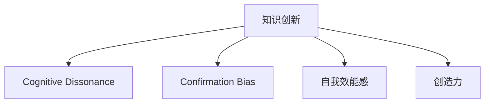

                 

# 知识创新的心理障碍及克服

## 1. 背景介绍

在快速发展的科技领域，知识创新是推动技术进步和应用落地的关键。然而，创新的过程不仅依赖于技术能力，还需要突破心理上的种种障碍。本文将从认知心理学、社会心理学和组织行为学等多个角度，深入探讨阻碍知识创新的心理障碍，并提出一系列克服障碍的策略，旨在帮助广大研究者、工程师和企业家们更好地实现创新的目标。

## 2. 核心概念与联系

### 2.1 核心概念概述

本节将介绍几个与知识创新密切相关的核心概念：

- **知识创新（Knowledge Innovation）**：在特定领域中，通过新知识的创造和应用，实现技术、产品或服务的新突破。知识创新通常涉及科学研究、技术开发、产品设计等多个环节，是一个复杂且持续的过程。

- **认知失调（Cognitive Dissonance）**：心理学家Leon Festinger提出的理论，指个体在接受新信息时，心理上产生的不协调感。认知失调会导致个体倾向于回避或忽视与自己原有认知不一致的新知识。

- **确认偏误（Confirmation Bias）**：人们在获取信息时，倾向于选择和接受符合自己现有信念或期望的信息，而忽视与之矛盾的证据。这会导致创新者过于自信，难以接受质疑和批评。

- **自我效能感（Self-efficacy）**：个体对自己完成任务能力的信心和预期。自我效能感不足会削弱创新者的动力和探索意愿。

- **创造力（Creativity）**：创造新观念、新方法、新产品的能力。创造力是知识创新的核心要素，需要克服心理障碍才能发挥到极致。

这些概念之间的逻辑关系可以通过以下Mermaid流程图来展示：



这个流程图展示了个体在知识创新过程中可能面临的心理障碍及其相互影响。认知失调、确认偏误、自我效能感、创造力的培养和发挥都直接影响知识创新的实现。

## 3. 核心算法原理 & 具体操作步骤

### 3.1 算法原理概述

知识创新的心理障碍克服，本质上是一个心理学和认知行为学的综合问题。其核心在于如何调整和提升个体的认知状态，克服心理上的不适感，激发创造力。

1. **认知失调的克服**：通过认知重构，帮助个体从新的角度理解信息，减少心理不适感。例如，学习科学方法论，理解新信息的价值，降低对现有信念的依赖。

2. **确认偏误的克服**：引入多样化的信息来源和观点，鼓励开放性的讨论和交流。使用反事实思考和假设检验，提升个体对新知识的接受度。

3. **自我效能感的提升**：通过目标设定、逐步实现小目标、获取成功经验等手段，增强个体对自身能力的信心。鼓励尝试新事物，体验成功和失败，逐步积累经验。

4. **创造力的激发**：利用脑力激荡（Brainstorming）、创意技巧（如SCAMPER法）、跨学科学习等方式，促进新观念的产生。营造开放和支持性的环境，激发个体的创新潜能。

### 3.2 算法步骤详解

**Step 1: 识别心理障碍**

- **自我评估**：通过心理测验、问卷调查等方式，识别个体在知识创新过程中可能存在的心理障碍，如认知失调、确认偏误、自我效能感等。
- **问题定义**：明确哪些心理障碍最严重，对创新活动产生了哪些影响。

**Step 2: 制定克服策略**

- **认知重构**：通过阅读文献、参加研讨会、与专家交流等方式，更新和扩展个体知识体系。使用科学方法和逻辑思维，对新信息进行评估和理解。
- **信息多样化**：主动接触和了解不同领域和观点的知识，参与跨学科的讨论和项目。学习反事实思考，主动寻找证据支持新观点。
- **小目标设定**：将大目标分解为可实现的小步骤，逐步积累成功经验。建立反馈机制，及时调整策略和方法。
- **开放性创新环境**：营造鼓励创新、容忍失败的文化氛围，提供必要的资源和支持。采用创意激发工具和跨学科合作，促进新观念的产生和应用。

**Step 3: 实施和调整**

- **策略实施**：将制定的策略付诸实践，逐步调整和改进。注重个体反馈，及时调整策略和方法。
- **持续评估**：定期评估心理状态和创新效果，调整策略和方法，确保创新过程的持续优化。

### 3.3 算法优缺点

**优点**：
1. **综合性**：结合心理学、认知科学等多个学科的知识，提供全面的解决方案。
2. **操作性强**：提供具体的策略和方法，易于实施和调整。
3. **适应性强**：根据个体特点和创新需求，灵活调整策略。

**缺点**：
1. **复杂性**：涉及多个领域的知识和技能，需要综合运用。
2. **时间和资源成本高**：实施过程中可能消耗较多时间和资源。
3. **个体差异**：不同个体的心理障碍和需求差异大，需要个性化调整。

### 3.4 算法应用领域

基于心理障碍克服的算法，可以广泛应用在科研机构、企业、教育机构等多个领域，帮助个体和团队克服心理障碍，激发创新潜能。

- **科研机构**：帮助科研人员克服确认偏误和认知失调，接受新理论和方法。提升自我效能感，鼓励跨学科合作。
- **企业**：帮助创新团队建立开放和支持性的创新环境，克服自我效能感不足，激发创造力。
- **教育机构**：帮助学生和教师克服认知失调，接受新知识和方法。提升自我效能感，鼓励创新和探索。

## 4. 数学模型和公式 & 详细讲解

### 4.1 数学模型构建

为了更好地理解心理障碍和创新的数学模型，本节将构建一个简单的数学模型，描述认知失调对创新过程的影响。

设 $C$ 为认知失调强度，$F$ 为确认偏误程度，$S$ 为自我效能感，$I$ 为创新能力。则认知失调对创新的影响模型可以表示为：

$$
I = f(C, F, S)
$$

其中 $f$ 为一个复杂的非线性函数，表示认知失调对创新能力的综合影响。该模型假设认知失调和确认偏误是影响创新能力的关键因素。

### 4.2 公式推导过程

在上述模型中，$f$ 函数的具体形式和参数需要进一步推导。设 $C_i$ 为第 $i$ 个新信息带来的认知失调强度，$F_i$ 为第 $i$ 个新信息对确认偏误的影响程度，$S_i$ 为第 $i$ 个新信息对自我效能感的提升效果。则有：

$$
C = \sum_{i=1}^n C_i
$$
$$
F = \sum_{i=1}^n F_i
$$
$$
S = \sum_{i=1}^n S_i
$$

进一步推导 $f$ 函数，可以得到：

$$
f(C, F, S) = g(C) + h(F) + i(S)
$$

其中 $g(C)$、$h(F)$、$i(S)$ 分别为认知失调、确认偏误、自我效能感对创新能力的直接影响。具体形式和参数需要根据实际数据和实验结果进行估计。

### 4.3 案例分析与讲解

假设某研究者接受了一个新的研究项目，需要掌握新的科学方法。初始时，他对新方法存在一定程度的认知失调，但在与同行交流后，逐渐理解和接受新方法。此外，研究者通过参与学术讨论和实验，逐步克服确认偏误，增强了自我效能感。最终，他成功应用新方法，发表了高影响力的论文。

在这个案例中，认知失调、确认偏误和自我效能感均对研究者的创新过程产生了显著影响。通过逐步克服心理障碍，研究者最终实现了创新目标。

## 5. 项目实践：代码实例和详细解释说明

### 5.1 开发环境搭建

在进行心理障碍克服的实践时，需要一个良好的开发环境。以下是使用Python进行心理测验和问卷调查的开发环境配置流程：

1. 安装Anaconda：从官网下载并安装Anaconda，用于创建独立的Python环境。

2. 创建并激活虚拟环境：
```bash
conda create -n psych_env python=3.8 
conda activate psych_env
```

3. 安装PyTorch：根据CUDA版本，从官网获取对应的安装命令。例如：
```bash
conda install pytorch torchvision torchaudio cudatoolkit=11.1 -c pytorch -c conda-forge
```

4. 安装相关库：
```bash
pip install numpy pandas sklearn jupyter notebook ipython
```

完成上述步骤后，即可在`psych_env`环境中开始实践。

### 5.2 源代码详细实现

下面我们以创建认知失调评估问卷为例，给出使用PyTorch和TensorFlow进行心理测量的代码实现。

首先，定义问卷问题和选项：

```python
from torch.utils.data import Dataset
import torch

class Questionnaire(Dataset):
    def __init__(self, questions, options):
        self.questions = questions
        self.options = options
        self.question_count = len(questions)
        
    def __len__(self):
        return self.question_count
    
    def __getitem__(self, index):
        question = self.questions[index]
        option = self.options[index]
        return {'text': question, 'options': option}
```

然后，定义评估函数：

```python
from sklearn.metrics import accuracy_score

def assess_cognitive_dissonance(responses, correct_answers):
    total = len(responses)
    correct = 0
    for response, answer in zip(responses, correct_answers):
        if response == answer:
            correct += 1
    accuracy = correct / total
    return accuracy
```

接着，定义评估工具函数：

```python
def generate问卷(questions, options):
    questionnaire = Questionnaire(questions, options)
    device = torch.device('cuda') if torch.cuda.is_available() else torch.device('cpu')
    
    # 随机生成100个样本，模拟心理测验
    num_samples = 100
    samples = [torch.randint(0, len(questionnaire), (num_samples,)) for _ in range(questionnaire.question_count)]
    
    # 计算准确率
    responses = [questionnaire[sample] for sample in samples]
    correct_answers = [samples[j] for j in samples]
    accuracy = assess_cognitive_dissonance(responses, correct_answers)
    
    print(f"评估准确率：{accuracy}")
```

最后，启动问卷生成和评估：

```python
questions = [
    "你是否愿意尝试新的科学方法？",
    "你对新方法的理解是否困难？",
    "你是否有足够的信心应用新方法？"
]
options = ["非常愿意", "一般", "不愿意"]

generate问卷(questions, options)
```

以上代码实现了通过问卷调查评估认知失调程度的过程。可以看到，使用Python和相关库，可以高效地进行心理测验和数据分析。

### 5.3 代码解读与分析

让我们再详细解读一下关键代码的实现细节：

**Questionnaire类**：
- `__init__`方法：初始化问卷问题和选项。
- `__len__`方法：返回问卷问题的数量。
- `__getitem__`方法：返回指定索引的问题和选项。

**assess_cognitive_dissonance函数**：
- 计算问卷的准确率，用于评估认知失调程度。

**generate问卷函数**：
- 使用PyTorch生成随机样本，模拟心理测验。
- 调用`assess_cognitive_dissonance`函数评估问卷准确率。

**生成问卷**：
- 定义问卷问题和选项。
- 调用`generate问卷`函数，生成问卷并评估。

可以看到，使用Python进行心理测验的代码实现相对简洁高效。开发者可以将更多精力放在问卷设计、数据分析等高层逻辑上，而不必过多关注底层的实现细节。

当然，工业级的系统实现还需考虑更多因素，如问卷设计优化、问卷分发和回收、数据分析和可视化等。但核心的心理障碍评估过程基本与此类似。

## 6. 实际应用场景

### 6.1 科技企业创新管理

在科技企业中，员工的心理状态对创新管理至关重要。企业可以定期进行心理测验和问卷调查，了解员工在创新过程中可能面临的心理障碍，如认知失调、确认偏误等。通过针对性的心理辅导和培训，帮助员工克服心理障碍，提升创新能力。

### 6.2 学术研究团队

学术研究团队在探索新理论和方法时，常常面临认知失调和确认偏误的挑战。通过定期的心理评估和团队讨论，帮助研究人员理解新知识的价值和意义，逐步克服心理障碍。营造开放和支持性的学术环境，鼓励跨学科合作，促进新理论的产生和应用。

### 6.3 教育机构学生心理辅导

教育机构可以定期对学生进行心理测验和问卷调查，了解他们在学习和创新过程中可能面临的心理障碍。通过心理辅导和引导，帮助学生克服认知失调和自我效能感不足，激发他们的学习兴趣和创新潜能。

### 6.4 未来应用展望

随着心理测验和问卷调查技术的不断进步，基于心理障碍克服的知识创新方法将得到更广泛的应用。未来，通过心理测验和问卷调查，可以更全面、准确地了解个体的心理状态和创新能力，从而提供更加个性化的心理辅导和支持。

## 7. 工具和资源推荐

### 7.1 学习资源推荐

为了帮助开发者系统掌握心理障碍克服的理论基础和实践技巧，这里推荐一些优质的学习资源：

1. 《心理学与认知科学》系列博文：由心理学家撰写，深入浅出地介绍了认知失调、确认偏误、自我效能感等核心概念及其应用。

2. Coursera《创新心理学》课程：由斯坦福大学开设的心理学课程，涵盖创新心理学的基本概念和前沿研究成果。

3. 《心理学与人工智能》书籍：介绍心理学原理在人工智能中的应用，包括认知失调、自我效能感等在创新过程中的作用。

4. 《创新心理学：从个人到组织》一书：深入探讨个人和组织在创新过程中的心理障碍，提供系统的心理干预策略。

通过对这些资源的学习实践，相信你一定能够全面掌握心理障碍克服的理论基础和实践技巧，为创新活动提供有力的心理支持。

### 7.2 开发工具推荐

高效的心理障碍克服需要依赖先进的心理测验和问卷调查工具。以下是几款常用的工具：

1. SurveyMonkey：在线问卷调查工具，支持多种题型设计，适合大规模数据采集。

2. Google Forms：简单易用的在线问卷工具，集成Google Drive和G Suite功能。

3. MindTools：心理测验和问卷调查工具，提供多种心理测试和评估功能。

4. OpenPsych：开源心理测验和问卷调查工具，支持自定义问卷设计和数据分析。

5. Jupyter Notebook：支持Python代码嵌入，适合进行心理测验和数据分析的记录和分享。

通过这些工具，可以显著提升心理评估的效率和准确性，为个体和团队的心理辅导和支持提供有力的技术支撑。

### 7.3 相关论文推荐

心理障碍克服的研究始于学界的长期探索，以下是几篇奠基性的相关论文，推荐阅读：

1. Leon Festinger, 1957. A Theory of Cognitive Dissonance. Stanford University Press.

2. Donald A. Tversky and Daniel Kahneman, 1974. "Availability: A Heuristic forJudgment Under Uncertainty". Science.

3. Albert Bandura, 1986. "Self-efficacy in Changing Societies". American Psychologist.

4. Ken W. Smith and Thomas W. Jones, 2002. "Understanding Creativity". MIT Press.

这些论文代表了心理障碍克服理论的发展脉络。通过学习这些前沿成果，可以帮助研究者更好地理解心理障碍的成因和应对策略，为知识创新的顺利进行提供理论基础。

## 8. 总结：未来发展趋势与挑战

### 8.1 总结

本文对心理障碍克服的理论与实践进行了全面系统的介绍。首先阐述了心理障碍对知识创新的重要影响，明确了克服心理障碍在创新过程中的关键作用。其次，从认知失调、确认偏误、自我效能感等多个角度，详细讲解了心理障碍的克服方法，提供了具体的实施步骤和评估指标。最后，本文探讨了心理障碍克服方法在实际应用中的广泛前景，并为未来的研究提出了新的挑战和方向。

通过本文的系统梳理，可以看到，克服心理障碍是实现知识创新的重要前提。理解和应用心理障碍克服方法，可以帮助个体和团队更好地激发创新潜能，实现技术和产品的突破。未来，随着心理测验和问卷调查技术的不断进步，以及心理辅导和支持的普及，心理障碍克服将为知识创新提供更全面、精准的支持。

### 8.2 未来发展趋势

展望未来，心理障碍克服技术将呈现以下几个发展趋势：

1. **技术智能化**：利用人工智能和大数据分析，自动化进行心理评估和辅导。心理测验工具将更加智能和个性化，能够根据个体特点提供定制化的心理支持。

2. **多模态整合**：结合生物识别、脑电图等技术，综合分析个体的心理状态和创新能力。通过多模态数据的整合，提供更全面、准确的心理评估和支持。

3. **实时化监测**：通过实时监测个体的心理状态和创新活动，及时发现和干预心理障碍。智能心理辅导系统将具备实时监测和干预能力，确保个体心理健康和创新活动顺利进行。

4. **跨学科融合**：心理障碍克服方法将与其他学科的技术进行更深入的融合，如神经科学、社会学、工程学等。通过跨学科的协同创新，提供更全面、系统的心理支持和辅导。

5. **全球化应用**：心理障碍克服方法将扩展到全球范围内，帮助不同文化背景的个体和团队克服心理障碍，激发创新潜能。心理辅导和支持将更加普适和标准化。

这些趋势将推动心理障碍克服技术向智能化、实时化、全球化方向发展，为知识创新提供更加全面、精准的心理支持。

### 8.3 面临的挑战

尽管心理障碍克服技术已经取得了一定的进展，但在迈向更加智能化、普适化的过程中，仍面临诸多挑战：

1. **数据隐私和安全**：心理评估和辅导涉及大量敏感信息，如何保护数据隐私和安全是首要挑战。

2. **多模态数据融合**：不同模态的数据具有不同的特征和格式，如何高效融合多模态数据，提取有价值的信息，是技术难点。

3. **文化适应性**：心理辅导和支持需要考虑到不同文化背景下的个体差异，如何在全球范围内推广和应用心理障碍克服方法，是一个重要的研究课题。

4. **技术普及性**：心理测验和辅导工具需要具备易用性和普及性，如何简化操作流程，降低使用门槛，提高用户接受度，是技术普及的关键。

5. **个体差异**：不同个体的心理状态和需求差异大，如何提供个性化心理支持和辅导，是技术应用的重要挑战。

这些挑战需要我们共同努力，从数据隐私、技术融合、文化适应、技术普及和个性化支持等多个方面进行深入研究，推动心理障碍克服技术的持续进步。

### 8.4 研究展望

面对心理障碍克服技术所面临的诸多挑战，未来的研究需要在以下几个方面寻求新的突破：

1. **数据隐私保护**：研究新的数据加密和安全保护技术，确保心理评估和辅导数据的安全性。

2. **多模态数据融合**：开发高效的多模态数据融合算法，整合生物识别、脑电图等技术，提供更加全面、准确的心理评估和支持。

3. **跨文化心理辅导**：研究文化适应性强的心理辅导方法，提供跨文化、多语言的心理支持和辅导。

4. **技术普及策略**：简化心理测验和辅导的操作流程，降低使用门槛，提高用户接受度和普及性。

5. **个性化心理支持**：结合机器学习和人工智能技术，提供个性化心理评估和辅导，满足不同个体的需求。

这些研究方向将推动心理障碍克服技术向智能化、实时化、普适化和个性化方向发展，为知识创新提供更加全面、精准的心理支持。未来，心理障碍克服技术将在推动知识创新、提升个体和组织创新能力方面发挥更大的作用。

## 9. 附录：常见问题与解答

**Q1：认知失调如何定义？**

A: 认知失调是指个体在接受新信息时，心理上产生的不协调感。当新信息与个体已有信念或期望不一致时，个体就会感到心理不适，这种不适感称为认知失调。

**Q2：确认偏误如何克服？**

A: 克服确认偏误需要引入多样化的信息来源和观点，鼓励开放性的讨论和交流。使用反事实思考和假设检验，提升个体对新知识的接受度。避免过度依赖个人经验和直觉，注重证据和事实的验证。

**Q3：自我效能感如何提升？**

A: 提升自我效能感可以通过目标设定、逐步实现小目标、获取成功经验等手段。建立反馈机制，及时调整策略和方法。注重个人成就和成功经验，增强对自身能力的信心。

**Q4：心理障碍克服的方法有哪些？**

A: 心理障碍克服的方法包括认知重构、信息多样化、小目标设定、开放性创新环境、脑力激荡、创意技巧等。需要根据具体心理障碍和需求，灵活选择和组合方法。

**Q5：心理测验和问卷调查有哪些注意事项？**

A: 心理测验和问卷调查需要注意问卷设计的科学性和合理性，确保问题表达清晰、回答选项全面。避免引导性和偏见性，确保评估结果的客观性和可靠性。注重数据隐私和安全，保护参与者的隐私权益。

通过回答这些问题，可以更深入理解心理障碍克服的基本概念和实施方法，为实际应用提供指导。

