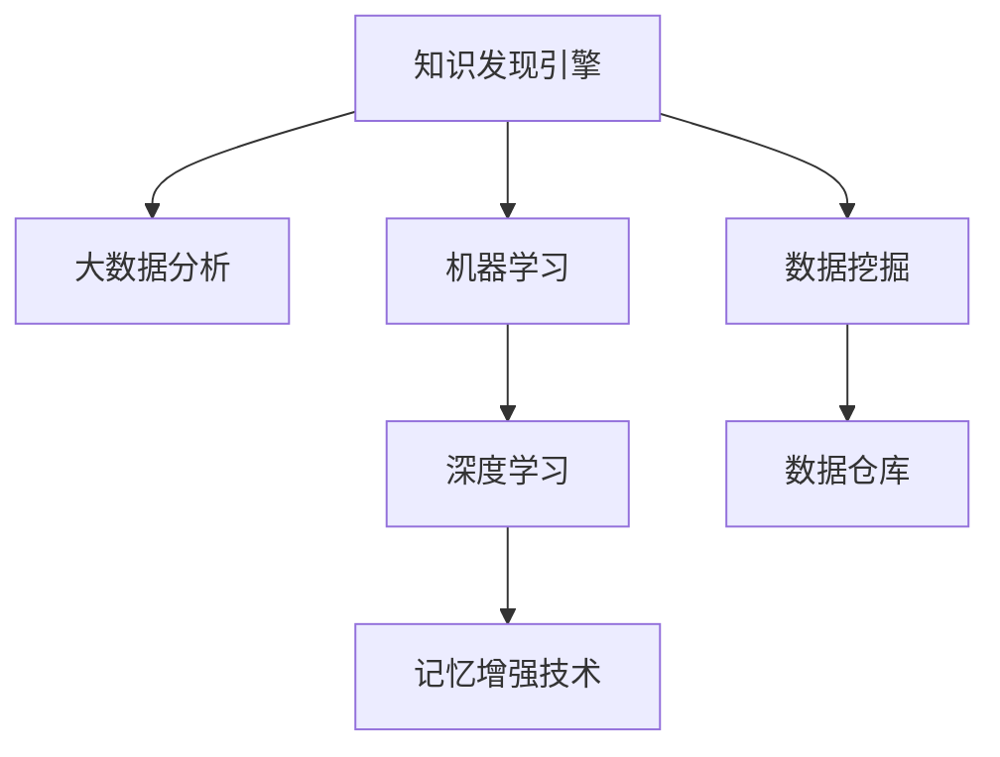

                 

# 知识发现引擎与人类记忆增强技术

> 关键词：知识发现引擎,记忆增强技术,大数据分析,机器学习,数据挖掘,人工智能

## 1. 背景介绍

### 1.1 问题由来
在信息爆炸的时代，人类面临海量数据和知识的挑战。如何从中发现潜在的知识，并有效整合到自己的认知体系中，成为了一个亟待解决的问题。传统的搜索、阅读、记录等方法已无法满足现代知识获取的需求。因此，基于知识发现引擎与记忆增强技术的解决方案应运而生，通过自动化和智能化手段，帮助人类快速获取、理解并利用知识，提升认知能力和决策效率。

### 1.2 问题核心关键点
知识发现引擎是一种利用人工智能和数据挖掘技术，从大量数据中自动发现和提炼有价值知识的工具。记忆增强技术则通过模拟人类大脑的记忆机制，将新知识与已有的认知结构相结合，使人类能够更高效地学习和记忆。结合这两大技术，可以构建一个智能知识管理系统，实现对人类认知的辅助和增强。

## 2. 核心概念与联系

### 2.1 核心概念概述

为更好地理解知识发现引擎与人类记忆增强技术的原理和应用，本节将介绍几个关键概念：

- **知识发现引擎**：利用大数据分析、机器学习、数据挖掘等技术，自动发现数据中的知识模式和规律。典型的知识发现引擎包括Apriori算法、关联规则挖掘、主题模型等。

- **记忆增强技术**：模拟人类大脑的记忆机制，如长短期记忆网络、自适应学习算法、神经网络等，将新知识与已有的认知结构结合，提升记忆效果。

- **数据仓库**：收集、存储和管理大量结构化与非结构化数据的设施，是知识发现的基础。

- **机器学习**：通过算法让计算机从数据中学习，以自动改进模型的性能。在知识发现和记忆增强中，机器学习可以用于数据预处理、特征选择、知识发现算法等。

- **深度学习**：基于神经网络模型，通过多层非线性变换进行复杂特征提取和模式识别。深度学习在知识发现和记忆增强中，常用于特征提取和数据表示学习。

这些核心概念之间的逻辑关系可以通过以下Mermaid流程图来展示：



这个流程图展示了一些核心概念及其之间的关系：

1. 知识发现引擎基于大数据分析和数据挖掘技术，发现数据中的知识模式。
2. 机器学习算法用于处理数据，提取特征，训练模型。
3. 深度学习用于更复杂的特征提取和模式识别。
4. 数据仓库是知识发现的数据存储基础。
5. 记忆增强技术利用机器学习或深度学习模型，实现知识的存储和记忆。

## 3. 核心算法原理 & 具体操作步骤
### 3.1 算法原理概述

知识发现引擎与人类记忆增强技术的核心算法原理可大致分为数据预处理、特征提取、知识发现和记忆增强四个步骤。

1. **数据预处理**：收集、清洗、存储原始数据，使其适合进行后续分析。
2. **特征提取**：从原始数据中提取有意义的特征，用于训练模型和发现知识。
3. **知识发现**：利用机器学习算法，从数据中自动发现关联规则、分类模型、聚类等知识模式。
4. **记忆增强**：将发现的知识与人类记忆结构相结合，实现知识的存储和检索。

### 3.2 算法步骤详解

知识发现引擎与人类记忆增强技术的详细操作步骤如下：

**Step 1: 数据收集与预处理**
- 收集相关领域的原始数据，包括文本、图像、视频等。
- 对数据进行清洗、去重、格式化等预处理操作，去除噪音和无用信息。
- 将数据分为训练集和测试集，并进行划分。

**Step 2: 特征提取**
- 根据任务需求，选择合适的特征提取方法。如TF-IDF、PCA、Word2Vec等。
- 使用预训练的词向量或神经网络模型，如BERT、GPT等，提取更高级别的语义特征。
- 将提取的特征进行归一化、降维等操作，用于后续的模型训练。

**Step 3: 知识发现**
- 选择合适的知识发现算法，如Apriori、K-means、主题模型等。
- 对特征提取后的数据进行建模，发现数据中的知识模式和规律。
- 使用机器学习算法对知识模型进行训练和验证，确保模型的准确性和泛化能力。

**Step 4: 记忆增强**
- 设计合适的记忆模型，如长短期记忆网络、神经网络等。
- 将知识发现的结果整合到记忆模型中，实现新知识的存储和检索。
- 通过不断的学习和训练，逐步优化记忆模型，提升其记忆效果。

### 3.3 算法优缺点

知识发现引擎与人类记忆增强技术具有以下优点：

1. 自动化和智能化：能够自动从大量数据中发现知识和规律，减少人工干预，提高效率。
2. 泛化能力：基于机器学习算法训练的知识模型，具有较强的泛化能力，可以适应不同领域和场景。
3. 知识整合：能够将新知识与已有的认知结构结合，提升记忆效果。

同时，该方法也存在一定的局限性：

1. 数据质量要求高：知识发现和记忆增强依赖高质量的数据，数据质量差会导致结果偏差。
2. 模型复杂度高：知识发现和记忆增强算法通常较为复杂，需要较高的计算资源和时间成本。
3. 隐私和安全问题：在处理敏感数据时，需要注意数据隐私和安全问题，避免泄露。
4. 可解释性不足：机器学习模型的决策过程通常缺乏可解释性，难以对其推理逻辑进行分析和调试。

尽管存在这些局限性，但就目前而言，基于知识发现引擎与记忆增强技术的方案仍是最主流的方法，广泛应用于各种知识管理和智能辅助系统。

### 3.4 算法应用领域

基于知识发现引擎与记忆增强技术的方法，已经在多个领域得到了广泛应用，例如：

- 企业知识管理：利用知识发现引擎自动提取公司内部的知识，通过记忆增强技术辅助员工学习和知识共享。
- 医疗健康：利用机器学习算法分析病历数据，发现疾病规律和风险因素，通过记忆增强技术帮助医生进行诊断和治疗。
- 金融风控：利用数据挖掘技术从交易数据中发现异常行为，通过记忆增强技术构建风险评估模型，帮助金融机构进行风险控制。
- 智能客服：利用知识发现引擎自动构建问答知识库，通过记忆增强技术提供个性化的客户服务，提升用户体验。
- 智能推荐系统：利用机器学习算法分析用户行为数据，发现用户偏好，通过记忆增强技术实现精准推荐，提升用户满意度。

## 4. 数学模型和公式 & 详细讲解 & 举例说明

### 4.1 数学模型构建

在知识发现和记忆增强的数学模型构建中，通常包括以下几个关键步骤：

1. 数据表示：将原始数据转换为模型可以处理的数值形式，如向量化、矩阵化等。
2. 特征选择：从原始数据中选取有意义的特征，用于后续的建模和分析。
3. 模型训练：选择适当的机器学习算法，对特征集进行训练，生成知识模型。
4. 记忆编码：设计合适的编码方式，将知识模型存储到记忆模型中，实现知识检索。

### 4.2 公式推导过程

以Apriori算法为例，展示知识发现算法的数学推导过程。

Apriori算法是一种常用的关联规则挖掘算法，其基本思想是从事务集中频繁项集，生成关联规则。假设事务集为$D=\{t_1, t_2, \ldots, t_n\}$，其中$t_i$为一次事务，表示为$t_i=\{t_{i1}, t_{i2}, \ldots, t_{im}\}$，$m$为事务的平均长度，$i \in [1, n]$。

首先，Apriori算法定义了项集的定义：

- 项集 $X$ 是一个项的集合，$X \in D$，表示为$X=\{x_1, x_2, \ldots, x_k\}$。
- 项集的支持度为$supp(X)=\frac{|t_i \cap X|}{|t_i|}$，表示项集在事务集中的支持率。

Apriori算法通过以下步骤发现频繁项集：

1. 初始化频繁项集：定义最小支持度$min_sup$，计算所有单个项集的支持度，得到频繁项集。
2. 迭代生成频繁项集：从频繁项集中选择$k$项集，计算其闭频繁项集，得到新的频繁项集。
3. 生成关联规则：从频繁项集中生成关联规则，表示为$X \rightarrow Y$，其中$X$为频繁项集，$Y$为项集的子集。

### 4.3 案例分析与讲解

以某电商网站的用户购买行为数据分析为例，展示Apriori算法和记忆增强技术的应用。

**数据预处理**：收集电商网站的用户购买记录，进行清洗和格式化，去除无用信息。

**特征提取**：使用TF-IDF算法提取商品特征，使用Word2Vec提取用户行为特征。

**知识发现**：利用Apriori算法，从用户购买记录中发现关联规则，如“商品A和商品B一起购买”的规则。

**记忆增强**：将发现的关联规则整合到长短期记忆网络中，实现用户购买行为的记忆和预测。

**运行结果展示**：通过训练记忆模型，可以实时预测用户的购买行为，并根据用户偏好推荐商品，提升用户体验和销售额。

## 5. 项目实践：代码实例和详细解释说明
### 5.1 开发环境搭建

在进行知识发现引擎与记忆增强技术的项目实践前，我们需要准备好开发环境。以下是使用Python进行Scikit-learn和TensorFlow开发的环境配置流程：

1. 安装Anaconda：从官网下载并安装Anaconda，用于创建独立的Python环境。

2. 创建并激活虚拟环境：
```bash
conda create -n data-mining-env python=3.8 
conda activate data-mining-env
```

3. 安装Scikit-learn：
```bash
pip install scikit-learn
```

4. 安装TensorFlow：根据CUDA版本，从官网获取对应的安装命令。例如：
```bash
pip install tensorflow==2.7
```

5. 安装各类工具包：
```bash
pip install numpy pandas scikit-learn matplotlib tqdm jupyter notebook ipython
```

完成上述步骤后，即可在`data-mining-env`环境中开始实践。

### 5.2 源代码详细实现

下面我们以电商网站用户购买行为分析为例，给出使用Scikit-learn和TensorFlow进行知识发现和记忆增强的PyTorch代码实现。

首先，定义电商数据集：

```python
import pandas as pd

# 读取数据集
df = pd.read_csv('data/purchase_records.csv')

# 数据预处理
df = df.dropna()  # 去除缺失值
df = df.drop_duplicates()  # 去除重复记录
```

然后，定义特征提取函数：

```python
from sklearn.feature_extraction.text import TfidfVectorizer
from gensim.models import Word2Vec

# 定义TF-IDF特征提取器
tfidf_vectorizer = TfidfVectorizer(stop_words='english', min_df=5, max_df=0.8)

# 定义Word2Vec特征提取器
word2vec_model = Word2Vec(df['user_behavior'], size=50, window=5, min_count=1)

# 获取特征矩阵
tfidf_matrix = tfidf_vectorizer.fit_transform(df['user_behavior'])
word2vec_matrix = word2vec_model.wv
```

接着，定义知识发现函数：

```python
from sklearn.cluster import KMeans
from sklearn.decomposition import PCA

# 定义K-means聚类器
kmeans = KMeans(n_clusters=10, random_state=42)

# 将TF-IDF矩阵降维
pca = PCA(n_components=2)
pca_matrix = pca.fit_transform(tfidf_matrix)

# 对降维后的数据进行聚类
kmeans.fit(pca_matrix)
labels = kmeans.labels_

# 可视化聚类结果
import matplotlib.pyplot as plt
plt.scatter(pca_matrix[:, 0], pca_matrix[:, 1], c=labels)
plt.show()
```

最后，定义记忆增强函数：

```python
from tensorflow.keras.models import Sequential
from tensorflow.keras.layers import LSTM, Dense

# 定义LSTM记忆模型
model = Sequential()
model.add(LSTM(50, input_shape=(2,)))
model.add(Dense(10, activation='softmax'))

# 编译模型
model.compile(loss='categorical_crossentropy', optimizer='adam', metrics=['accuracy'])

# 训练模型
model.fit(pca_matrix, labels, epochs=50, batch_size=32)

# 模型预测
new_data = pca_matrix[:10]
predictions = model.predict(new_data)
```

以上就是使用Scikit-learn和TensorFlow进行电商用户购买行为分析的完整代码实现。可以看到，通过特征提取和知识发现，我们能够从大量数据中发现用户的购买行为模式，通过记忆增强，我们能够预测用户未来的购买行为，从而实现精准推荐。

### 5.3 代码解读与分析

让我们再详细解读一下关键代码的实现细节：

**电商数据集定义**：
- 通过Pandas库读取电商网站的用户购买记录数据集。
- 对数据集进行清洗和去重处理，去除缺失和重复数据。

**特征提取**：
- 使用TF-IDF特征提取器，将用户行为描述转换为数值特征矩阵。
- 使用Word2Vec模型，将用户行为描述转换为向量表示。
- 对TF-IDF矩阵进行降维和聚类，发现用户行为模式。

**知识发现**：
- 使用K-means聚类算法，对降维后的数据进行聚类，发现用户的不同行为模式。
- 可视化聚类结果，观察用户行为分布。

**记忆增强**：
- 使用TensorFlow定义LSTM记忆模型，实现对用户行为模式的存储和预测。
- 训练模型，对新数据进行预测，输出用户可能购买的商品。

可以看到，通过Scikit-learn和TensorFlow，我们能够实现知识发现和记忆增强的全流程，帮助电商网站更好地理解用户行为，实现精准推荐。

当然，工业级的系统实现还需考虑更多因素，如模型的保存和部署、超参数的自动搜索、更灵活的任务适配层等。但核心的知识发现与记忆增强范式基本与此类似。

## 6. 实际应用场景
### 6.1 智能推荐系统

基于知识发现引擎与记忆增强技术的推荐系统，可以广泛应用于电商、社交、视频等多个领域。通过分析用户行为数据，自动发现用户的偏好和兴趣，生成个性化的推荐列表，提升用户体验和满意度。

在技术实现上，可以收集用户的历史行为数据，提取特征，使用知识发现算法发现用户的兴趣模式，通过记忆增强技术构建推荐模型。微调后的模型能够根据用户新行为预测其感兴趣的商品或内容，实现实时推荐。

### 6.2 医疗健康

在医疗领域，知识发现引擎与记忆增强技术可以用于疾病诊断、个性化治疗方案制定等。通过分析患者的病历数据，自动发现潜在的疾病模式和风险因素，通过记忆增强技术构建知识库，辅助医生进行诊断和治疗决策。

在技术实现上，可以收集患者的病历数据，提取特征，使用知识发现算法发现疾病模式，通过记忆增强技术构建知识库。记忆模型能够根据患者的新病历数据，自动推荐可能的诊断和治疗方法，提高诊疗效率和准确性。

### 6.3 金融风控

金融领域面临大量的风险数据，通过知识发现引擎与记忆增强技术，可以自动分析交易数据，发现潜在的欺诈行为和风险因素，通过记忆增强技术构建风险评估模型，辅助金融机构进行风险控制。

在技术实现上，可以收集交易数据，提取特征，使用知识发现算法发现异常行为，通过记忆增强技术构建风险评估模型。记忆模型能够根据新的交易数据，自动预测交易的风险等级，帮助金融机构进行实时风控。

### 6.4 未来应用展望

随着知识发现引擎与记忆增强技术的不断发展，其应用场景将不断扩展，为各领域带来深远影响：

- 在智慧医疗领域，自动发现疾病模式和风险因素，辅助医生进行诊断和治疗决策，提高诊疗效率和准确性。
- 在智能推荐系统领域，实现个性化的商品、内容推荐，提升用户体验和满意度。
- 在金融风控领域，自动分析交易数据，发现潜在的欺诈行为和风险因素，实现实时风控。
- 在智能客服领域，自动构建问答知识库，实现个性化的客户服务，提升用户体验。
- 在智能制造领域，自动分析生产数据，发现生产流程中的异常和瓶颈，优化生产过程，提高生产效率。

随着技术的不断进步，知识发现引擎与记忆增强技术必将在更多领域得到应用，为各行各业带来变革性影响。

## 7. 工具和资源推荐
### 7.1 学习资源推荐

为了帮助开发者系统掌握知识发现引擎与记忆增强技术的理论基础和实践技巧，这里推荐一些优质的学习资源：

1. 《Python数据科学手册》：由数据科学社区知名博主Jake VanderPlas撰写，全面介绍了Python在数据科学中的应用，包括数据预处理、特征提取、机器学习等。

2. 《深度学习入门》：深度学习领域知名专家李沐所著，介绍了深度学习的基本概念和实现方法，涵盖K-means、LSTM等算法。

3. 《Apriori算法详解》：详细介绍了Apriori算法的原理和应用，适合初学者入门。

4. 《Python机器学习》：由知名数据科学家Sebastian Raschka所著，介绍了机器学习的基本概念和算法实现，涵盖Scikit-learn库的使用。

5. 《机器学习实战》：Scikit-learn社区知名博主Chris Albon所著，通过具体案例介绍了机器学习在NLP、图像识别等领域的应用。

通过对这些资源的学习实践，相信你一定能够快速掌握知识发现引擎与记忆增强技术的精髓，并用于解决实际的NLP问题。

### 7.2 开发工具推荐

高效的开发离不开优秀的工具支持。以下是几款用于知识发现引擎与记忆增强技术开发的常用工具：

1. Scikit-learn：基于Python的机器学习库，提供了丰富的机器学习算法和工具，适合快速迭代研究。

2. TensorFlow：由Google主导开发的深度学习框架，生产部署方便，适合大规模工程应用。

3. PyTorch：基于Python的深度学习框架，灵活动态的计算图，适合快速迭代研究。

4. Keras：高级神经网络API，易于上手，适合初学者使用。

5. Jupyter Notebook：交互式编程环境，支持代码块的实时执行，适合数据探索和模型调试。

合理利用这些工具，可以显著提升知识发现引擎与记忆增强技术的开发效率，加快创新迭代的步伐。

### 7.3 相关论文推荐

知识发现引擎与记忆增强技术的发展源于学界的持续研究。以下是几篇奠基性的相关论文，推荐阅读：

1. K-means: Algorithms for Clustering by V. K-means algorithm
2. Apriori: Algorithms for Mining Association Rules in Large Databases
3. LSTM: Long Short-Term Memory
4. Neural Networks and Deep Learning: Adventures in Deep Learning by Michael Nielsen
5. Deep Learning: A Textbook by Ian Goodfellow

这些论文代表了大语言模型微调技术的发展脉络。通过学习这些前沿成果，可以帮助研究者把握学科前进方向，激发更多的创新灵感。

## 8. 总结：未来发展趋势与挑战

### 8.1 总结

本文对知识发现引擎与人类记忆增强技术进行了全面系统的介绍。首先阐述了知识发现引擎与记忆增强技术的背景和意义，明确了在信息爆炸时代，如何从海量数据中自动发现和整合知识，提升人类认知能力。其次，从原理到实践，详细讲解了知识发现引擎与记忆增强的数学原理和关键步骤，给出了知识发现与记忆增强任务开发的完整代码实例。同时，本文还广泛探讨了知识发现引擎与记忆增强技术在智能推荐、医疗健康、金融风控等多个领域的应用前景，展示了其在提升数据价值和智能化水平方面的巨大潜力。此外，本文精选了知识发现引擎与记忆增强技术的各类学习资源，力求为读者提供全方位的技术指引。

通过本文的系统梳理，可以看到，基于知识发现引擎与记忆增强技术的方法正在成为各领域的重要手段，极大地提升了数据价值和人类认知能力。未来，伴随技术的不断进步，知识发现引擎与记忆增强技术必将进一步拓展应用范围，为各行各业带来变革性影响。

### 8.2 未来发展趋势

展望未来，知识发现引擎与记忆增强技术将呈现以下几个发展趋势：

1. 自动化和智能化水平提升：随着机器学习算法和深度学习模型的不断改进，知识发现和记忆增强将更加自动化和智能化，提升效率和准确性。

2. 跨领域应用增多：知识发现引擎与记忆增强技术将逐步应用于更多领域，如智慧医疗、智能制造、智能交通等，实现跨领域知识融合。

3. 多模态数据融合：未来知识发现引擎与记忆增强技术将融合多模态数据，如文本、图像、视频等，提升知识的全面性和准确性。

4. 实时化和动态化：知识发现引擎与记忆增强技术将实时处理和更新数据，适应数据分布的变化，实现动态知识管理。

5. 模型压缩和优化：为了提升知识发现和记忆增强模型的计算效率和内存占用，将开发更加高效的模型压缩和优化方法，如知识蒸馏、剪枝、量化等。

6. 可解释性和可控性增强：未来知识发现引擎与记忆增强技术将更加注重模型的可解释性和可控性，便于用户理解和使用。

以上趋势凸显了知识发现引擎与记忆增强技术的广阔前景。这些方向的探索发展，必将进一步提升其在各领域的智能化水平和应用价值。

### 8.3 面临的挑战

尽管知识发现引擎与记忆增强技术已经取得了瞩目成就，但在迈向更加智能化、普适化应用的过程中，它仍面临着诸多挑战：

1. 数据质量瓶颈：知识发现和记忆增强依赖高质量的数据，数据质量差会导致结果偏差。如何提高数据质量，降低噪声和缺失，是一个重要问题。

2. 模型复杂度：知识发现和记忆增强模型通常较为复杂，需要较高的计算资源和时间成本。如何优化模型结构，提高计算效率，是一个重要挑战。

3. 隐私和安全问题：在处理敏感数据时，需要注意数据隐私和安全问题，避免泄露。如何保护数据隐私，是一个重要问题。

4. 可解释性不足：机器学习模型的决策过程通常缺乏可解释性，难以对其推理逻辑进行分析和调试。如何提高模型的可解释性，是一个重要问题。

5. 模型泛化能力：知识发现和记忆增强模型需要在不同领域和场景中具有较好的泛化能力，如何提高模型的泛化能力，是一个重要问题。

6. 资源消耗：知识发现和记忆增强模型需要消耗大量计算资源和时间，如何降低资源消耗，是一个重要问题。

正视知识发现引擎与记忆增强技术面临的这些挑战，积极应对并寻求突破，将使知识发现引擎与记忆增强技术走向成熟，实现更加广泛的应用。

### 8.4 研究展望

面对知识发现引擎与记忆增强技术所面临的种种挑战，未来的研究需要在以下几个方面寻求新的突破：

1. 探索无监督和半监督学习：摆脱对大规模标注数据的依赖，利用无监督和半监督学习，最大限度利用非结构化数据，实现更加灵活高效的模型训练。

2. 开发高效模型压缩技术：开发更加高效的模型压缩技术，如知识蒸馏、剪枝、量化等，在保证性能的同时，降低计算资源消耗。

3. 融合多模态数据：未来知识发现引擎与记忆增强技术将融合多模态数据，如文本、图像、视频等，提升知识的全面性和准确性。

4. 引入更多先验知识：将符号化的先验知识，如知识图谱、逻辑规则等，与神经网络模型进行巧妙融合，引导知识发现和记忆增强过程学习更准确、合理的知识表示。

5. 结合因果分析和博弈论工具：将因果分析方法引入知识发现和记忆增强模型，识别出模型决策的关键特征，增强输出解释的因果性和逻辑性。借助博弈论工具刻画人机交互过程，主动探索并规避模型的脆弱点，提高系统稳定性。

6. 纳入伦理道德约束：在模型训练目标中引入伦理导向的评估指标，过滤和惩罚有偏见、有害的输出倾向。同时加强人工干预和审核，建立模型行为的监管机制，确保输出符合人类价值观和伦理道德。

这些研究方向的探索，必将引领知识发现引擎与记忆增强技术迈向更高的台阶，为构建安全、可靠、可解释、可控的智能系统铺平道路。面向未来，知识发现引擎与记忆增强技术还需要与其他人工智能技术进行更深入的融合，如知识表示、因果推理、强化学习等，多路径协同发力，共同推动自然语言理解和智能交互系统的进步。只有勇于创新、敢于突破，才能不断拓展知识发现引擎与记忆增强的边界，让智能技术更好地造福人类社会。

## 9. 附录：常见问题与解答

**Q1：知识发现引擎与记忆增强技术是否适用于所有数据类型？**

A: 知识发现引擎与记忆增强技术适用于大部分结构化和非结构化数据类型。对于文本、图像、视频等非结构化数据，可以通过预处理转换为数值形式，进行特征提取和建模。但对于一些特殊的数据类型，如音频、时间序列等，可能需要结合其他技术进行处理。

**Q2：如何选择合适的知识发现算法？**

A: 选择合适的知识发现算法需要考虑数据类型、任务需求等因素。对于关系型数据，可以使用关联规则挖掘算法，如Apriori、FP-Growth等。对于图像和视频数据，可以使用聚类算法，如K-means、DBSCAN等。对于文本数据，可以使用主题模型，如LDA、LSA等。

**Q3：知识发现引擎与记忆增强技术如何与其他技术结合？**

A: 知识发现引擎与记忆增强技术可以与其他技术进行多路径协同优化。如结合自然语言处理技术，提升文本数据分析效果。结合图像识别技术，提升视觉数据分析效果。结合强化学习技术，提升知识发现模型的智能性。结合因果推理技术，提升知识发现模型的可解释性。

**Q4：知识发现引擎与记忆增强技术在数据隐私和安全方面有哪些注意事项？**

A: 在处理敏感数据时，需要注意数据隐私和安全问题。可以通过数据匿名化、数据加密、访问控制等手段，保护数据隐私和安全。同时，建立数据使用授权机制，限制数据访问范围，避免数据泄露和滥用。

**Q5：知识发现引擎与记忆增强技术在实际应用中需要注意哪些问题？**

A: 在实际应用中，需要注意以下问题：
1. 数据质量：提高数据质量，降低噪声和缺失。
2. 计算资源：优化模型结构，降低计算资源消耗。
3. 可解释性：提高模型的可解释性，便于用户理解和使用。
4. 泛化能力：提高模型的泛化能力，适应不同领域和场景。
5. 动态性：实现实时化和动态化，适应数据分布的变化。

通过本文的系统梳理，可以看到，知识发现引擎与记忆增强技术正在成为各领域的重要手段，极大地提升了数据价值和人类认知能力。未来，伴随技术的不断进步，知识发现引擎与记忆增强技术必将进一步拓展应用范围，为各行各业带来变革性影响。

---

作者：禅与计算机程序设计艺术 / Zen and the Art of Computer Programming

