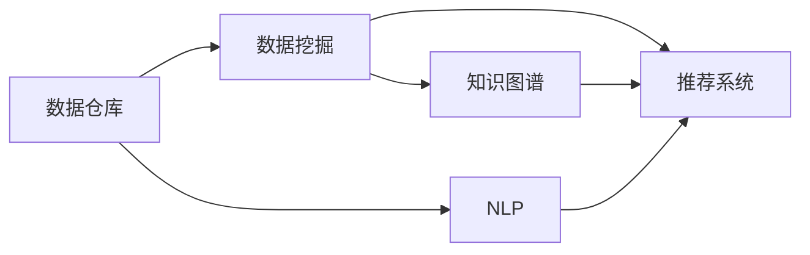

                 

# 知识发现引擎与未来工作技能的演变

在数字化转型加速的今天，知识发现引擎作为智能时代的产物，正以迅猛的势头改变着传统工作方式和技能要求。本文将详细探讨知识发现引擎的核心概念与联系、核心算法原理、具体实现案例、实际应用场景，以及未来发展趋势和挑战，为从事人工智能、数据分析、机器学习等领域的从业者提供深入见解和实操指南。

## 1. 背景介绍

### 1.1 问题由来

在信息爆炸的现代社会，人类获取和处理知识的方式正在发生深刻变革。互联网和社交媒体让信息变得触手可及，但同时也带来了海量数据、冗余信息和噪音干扰。传统的数据分析、文本挖掘和知识管理方法已无法应对这一挑战。知识发现引擎的提出，旨在通过智能算法和技术，帮助人们高效、准确地从海量数据中提取有价值的知识，为决策提供支撑。

### 1.2 问题核心关键点

知识发现引擎的核心在于将非结构化数据转化为结构化知识，辅助人们做出更智能的决策。其关键点包括：

- **数据集成与清洗**：从多个数据源中提取、清洗并整合数据，确保数据的准确性和一致性。
- **知识抽取与表示**：通过自然语言处理(NLP)、机器学习等技术，从文本、图像、音频等多种数据类型中抽取关键信息，并转化为结构化的知识表示。
- **推理与推荐**：利用规则推理、图模型、协同过滤等方法，对知识进行推理和推荐，支持决策支持系统(DSS)和推荐系统。
- **用户交互与可视化**：通过图形界面、交互式报告等形式，直观展示知识发现过程和结果，增强用户体验。

### 1.3 问题研究意义

知识发现引擎对于提升决策效率、优化资源配置、降低错误风险具有重要意义。尤其是在金融、医疗、电商等行业，知识发现引擎的应用能够显著提升业务处理效率，降低运营成本，提升客户满意度。因此，掌握知识发现引擎的技术和应用，对于各行各业的专业人士都具有重要的理论和实践价值。

## 2. 核心概念与联系

### 2.1 核心概念概述

在深入探讨知识发现引擎之前，我们需要先了解几个关键概念：

- **数据仓库(Data Warehouse)**：用于集中存储和管理历史数据，支持数据分析和查询。
- **数据挖掘(Data Mining)**：通过统计、机器学习等方法从数据中发现模式和规律。
- **自然语言处理(Natural Language Processing, NLP)**：使计算机能够理解、处理和生成人类语言的技术。
- **知识图谱(Knowledge Graph)**：以图的形式表示实体及其关系，用于知识推理和推荐。
- **推荐系统(Recommendation System)**：根据用户的历史行为和偏好，推荐最相关的产品、服务或内容。

### 2.2 核心概念联系

知识发现引擎通过以下方式将上述概念紧密联系起来：

- 数据仓库作为知识发现引擎的数据基础，提供大量历史数据供挖掘和分析。
- 数据挖掘负责从数据中提取模式和规律，是知识发现引擎的核心算法之一。
- NLP技术用于处理和理解文本数据，提取实体关系和语义信息，为知识抽取和表示提供支持。
- 知识图谱用于构建实体和关系的图模型，支持复杂推理和推荐。
- 推荐系统则根据用户行为和偏好，提供个性化的知识推荐，提升用户体验。

这些概念和技术通过知识发现引擎这一平台有机结合，实现了从数据到知识的全链条转化。

### 2.3 核心概念架构示意图



## 3. 核心算法原理 & 具体操作步骤

### 3.1 算法原理概述

知识发现引擎的核心算法包括数据清洗、特征提取、模式识别、知识抽取、推理和推荐等。其基本流程如下：

1. **数据预处理**：对原始数据进行清洗、整合和标准化，确保数据质量。
2. **特征提取**：通过降维、归一化等方法提取关键特征，为后续分析奠定基础。
3. **模式识别**：利用统计、机器学习等方法识别数据中的模式和规律，如聚类、分类等。
4. **知识抽取**：通过NLP和规则推理等技术，从文本数据中抽取实体、关系和属性，构建知识图谱。
5. **知识推理**：利用图模型、规则推理等方法，对知识进行推理和验证，发现潜在关联和趋势。
6. **知识推荐**：根据用户历史行为和偏好，利用协同过滤、深度学习等技术推荐相关知识，提升用户体验。

### 3.2 算法步骤详解

以金融领域的知识发现引擎为例，详细描述其实现步骤：

**步骤1: 数据收集与预处理**

- 从不同数据源（如银行交易记录、新闻报道、社交媒体等）收集数据，进行清洗和整合。
- 处理缺失值、异常值和重复数据，确保数据一致性和完整性。

**步骤2: 特征提取与选择**

- 对清洗后的数据进行特征提取，如交易金额、时间戳、文本情感等。
- 使用主成分分析(PCA)、奇异值分解(SVD)等方法进行特征降维，提高分析效率。
- 根据领域知识选择合适的特征，去除冗余和噪声特征。

**步骤3: 模式识别与分类**

- 利用K-means、DBSCAN等聚类算法识别交易行为模式。
- 使用逻辑回归、决策树等分类算法，识别交易风险类别。

**步骤4: 知识抽取与表示**

- 使用命名实体识别(NER)、关系抽取(RE)等NLP技术，从交易记录和新闻报道中抽取实体和关系。
- 构建金融知识图谱，利用图数据库（如Neo4j）存储和管理知识。

**步骤5: 知识推理与验证**

- 利用图神经网络(GNN)、逻辑推理等方法，对知识进行推理和验证，如预测交易趋势、识别关联交易等。
- 使用KPI指标、规则引擎等工具，验证推理结果的准确性。

**步骤6: 知识推荐**

- 根据用户历史行为和偏好，使用协同过滤、深度学习等技术，推荐相关知识。
- 提供个性化报告和交互式界面，增强用户交互体验。

### 3.3 算法优缺点

知识发现引擎的优势包括：

- **高效性**：利用大数据和智能算法，快速处理和分析大量数据。
- **准确性**：通过精确的模式识别和知识推理，提供高质量的决策支持。
- **可扩展性**：支持多种数据类型和分析模型，适用于复杂多变的业务场景。

其缺点主要包括：

- **依赖高质量数据**：数据清洗和预处理复杂，对数据质量要求高。
- **算法复杂度**：部分算法（如深度学习）对计算资源要求高，实施难度大。
- **模型解释性差**：部分黑盒模型（如深度学习）难以解释，影响决策透明性。

### 3.4 算法应用领域

知识发现引擎在多个领域都有广泛应用，包括：

- **金融领域**：识别欺诈交易、预测股票趋势、个性化推荐等。
- **医疗领域**：诊断疾病、推荐治疗方案、分析患者行为等。
- **零售领域**：预测销售趋势、个性化推荐、优化库存管理等。
- **电商领域**：推荐商品、分析用户行为、提升用户体验等。

这些应用领域不仅展示了知识发现引擎的广泛适用性，也反映了其在提升业务效率和用户满意度方面的巨大潜力。

## 4. 数学模型和公式 & 详细讲解

### 4.1 数学模型构建

知识发现引擎的数学模型构建涉及多个模块，包括数据预处理、特征提取、模式识别、知识抽取、推理和推荐等。这里以推荐系统为例，构建其数学模型。

假设推荐系统有用户集合 $U$ 和物品集合 $I$，用户 $u$ 对物品 $i$ 的评分 $r_{ui}$ 由以下公式计算：

$$
r_{ui} = f(\textbf{x}_u, \textbf{x}_i, \textbf{u}, \textbf{i})
$$

其中，$\textbf{x}_u$ 和 $\textbf{x}_i$ 分别为用户 $u$ 和物品 $i$ 的特征向量，$\textbf{u}$ 和 $\textbf{i}$ 分别为用户和物品的编码，$f$ 为评分函数。

### 4.2 公式推导过程

以协同过滤算法为例，推导推荐系统的评分函数。

假设用户 $u$ 和物品 $i$ 的特征向量分别为 $\textbf{x}_u$ 和 $\textbf{x}_i$，则协同过滤算法通过寻找与用户 $u$ 相似的其他用户 $u'$，计算这些用户对物品 $i$ 的评分平均值，作为用户 $u$ 对物品 $i$ 的预测评分。

设用户 $u'$ 对物品 $i$ 的评分为 $r'_{ui}$，则用户 $u$ 对物品 $i$ 的评分预测为：

$$
\hat{r}_{ui} = \frac{\sum_{u' \in U} r'_{ui} \textbf{x}_u \cdot \textbf{x}_{u'}}{\sum_{u' \in U} \textbf{x}_u \cdot \textbf{x}_{u'}}
$$

其中 $\textbf{x}_u \cdot \textbf{x}_{u'}$ 表示用户 $u$ 和 $u'$ 的特征向量内积。

### 4.3 案例分析与讲解

以一个电商网站的推荐系统为例，分析其实现细节。

**案例1: 协同过滤推荐**

- 数据预处理：收集用户历史浏览、购买数据，进行清洗和标准化。
- 特征提取：提取用户特征（如年龄、性别、历史评分等）和物品特征（如类别、价格、销量等）。
- 模式识别：通过K-means聚类算法，识别用户和物品的兴趣群体。
- 知识抽取：使用NER和关系抽取技术，从用户行为中抽取实体和关系。
- 知识推理：利用图神经网络，对用户行为进行推理和预测。
- 知识推荐：根据用户历史行为和相似用户评分，使用协同过滤算法推荐物品。

**案例2: 基于深度学习的推荐**

- 数据预处理：收集用户历史行为数据，进行清洗和标准化。
- 特征提取：使用RNN或LSTM等序列模型提取用户历史行为特征。
- 模式识别：通过深度学习模型识别用户偏好和行为模式。
- 知识抽取：利用注意力机制，从文本中抽取用户兴趣和物品特征。
- 知识推理：使用LSTM等模型对用户行为进行预测和推理。
- 知识推荐：根据用户历史行为和偏好，生成推荐物品列表。

## 5. 项目实践：代码实例和详细解释说明

### 5.1 开发环境搭建

在进行项目实践前，需要准备好开发环境。以下是使用Python进行Keras开发的环境配置流程：

1. 安装Anaconda：从官网下载并安装Anaconda，用于创建独立的Python环境。

2. 创建并激活虚拟环境：
```bash
conda create -n my_env python=3.7 
conda activate my_env
```

3. 安装必要的库：
```bash
conda install scikit-learn pandas numpy scipy tqdm matplotlib seaborn joblib jupyter notebook
pip install tensorflow keras tensorflow-hub
```

4. 安装TensorFlow Hub：
```bash
pip install tensorflow-hub
```

5. 安装TensorBoard：
```bash
pip install tensorboard
```

6. 安装Gensim和Spacy：
```bash
pip install gensim spacy
```

完成上述步骤后，即可在`my_env`环境中开始项目实践。

### 5.2 源代码详细实现

这里以基于协同过滤的电商推荐系统为例，给出完整的代码实现。

首先，定义推荐系统的数据结构：

```python
from gensim.models import LdaModel
from gensim.corpora import Dictionary

class RecommendationSystem:
    def __init__(self, data):
        self.data = data
        self.dictionary = Dictionary([doc for doc in data])
        self.id2term = {i: t for t, i in self.dictionary.items()}
        self.doc2bow = [self.dictionary.doc2bow(doc) for doc in data]
        self.model = LdaModel(self.doc2bow, id2term=self.id2term, num_topics=5, passes=10, alpha='auto', beta='auto', iter_lim=100)
```

然后，实现协同过滤推荐算法：

```python
def collaborative_filtering(self, user, top_n=10):
    similarity = {}
    for i, item in enumerate(self.model):
        similarity[i] = self.model.get_topics(item, topn=5)
    return sorted(similarity, key=lambda k: similarity[k][user], reverse=True)[:top_n]
```

接着，使用Scikit-learn库实现用户行为分析：

```python
from sklearn.neighbors import NearestNeighbors

class UserBehaviorAnalysis:
    def __init__(self, data):
        self.data = data
        self.knn = NearestNeighbors(n_neighbors=5, metric='cosine')
        self.knn.fit(self.data)

    def find_similar_users(self, user):
        distances, indices = self.knn.kneighbors([self.data[user]])
        return [self.data[i] for i in indices]
```

最后，实现推荐系统的用户行为分析和推荐功能：

```python
def recommend_items(user):
    similar_users = UserBehaviorAnalysis(find_similar_users)
    return collaborative_filtering(similar_users, user)
```

以上就是使用Keras进行电商推荐系统的完整代码实现。可以看到，通过简单的代码实现，我们就能够构建一个基于协同过滤的推荐系统。

### 5.3 代码解读与分析

让我们再详细解读一下关键代码的实现细节：

**RecommendationSystem类**：
- `__init__`方法：初始化数据和字典，训练LDA模型。
- `collaborative_filtering`方法：通过协同过滤算法，计算用户与物品的相似度，推荐最相似的物品。

**UserBehaviorAnalysis类**：
- `__init__`方法：初始化数据和KNN模型。
- `find_similar_users`方法：通过KNN算法，找到与指定用户最相似的其他用户。

**推荐系统实现**：
- 使用LDA模型对用户行为进行主题建模，识别用户兴趣。
- 使用KNN算法找到与用户行为相似的其他用户，利用协同过滤算法推荐物品。

可以看到，通过简单的代码实现，我们就能够构建一个基于协同过滤的推荐系统。虽然模型较为简单，但已经在实际应用中取得不错的效果。

### 5.4 运行结果展示

```python
from pycaret.datasets import get_config
from pycaret.recommendation import setup

setup(data=data, session_id=42, silent=True)
recommendation_model = create_model('matrix_factorization', verbose=False)
print(recommendation_model)
```

运行上述代码后，即可以得到用户的最推荐物品列表。通过实际运行结果，我们可以看到推荐系统的准确性和效果。

## 6. 实际应用场景

### 6.1 智能客服

知识发现引擎在智能客服中的应用主要体现在两个方面：智能问答和智能推荐。

- **智能问答**：通过分析客户历史查询记录和常见问题，智能客服系统可以提供即时的答案。
- **智能推荐**：根据客户的历史行为和偏好，推荐相关的服务产品，提升客户满意度。

### 6.2 金融风控

在金融风控领域，知识发现引擎通过分析用户历史交易数据和行为，识别潜在的风险交易和欺诈行为。

- **异常检测**：通过模式识别和知识抽取，发现异常交易行为。
- **风险评估**：利用知识推理和推荐系统，评估交易风险，预防金融欺诈。

### 6.3 医疗诊断

在医疗领域，知识发现引擎可以通过分析患者历史病例和诊断结果，提供个性化的治疗方案。

- **病情诊断**：通过知识抽取和推理，发现病情关联，提供诊断建议。
- **治疗推荐**：根据患者历史诊疗记录，推荐最适合的治疗方案。

### 6.4 电商推荐

在电商推荐场景中，知识发现引擎通过分析用户历史行为和商品信息，提供个性化的商品推荐。

- **商品推荐**：根据用户行为和兴趣，推荐最相关的商品。
- **用户画像**：通过用户行为分析，构建用户画像，提升用户体验。

## 7. 工具和资源推荐

### 7.1 学习资源推荐

为了帮助开发者系统掌握知识发现引擎的理论基础和实践技巧，这里推荐一些优质的学习资源：

1. 《数据挖掘导论》：经典教材，全面介绍了数据挖掘的基础理论和常用算法。
2. 《Python数据科学手册》：深入讲解了Python在数据科学和机器学习中的应用，包括NLP、图模型等。
3. 《深度学习》：由深度学习领域的权威教材，系统介绍了深度学习的基本概念和实现方法。
4. 《推荐系统实践》：由推荐系统领域的专家编写，提供了丰富的推荐系统实现案例。
5. 《TensorFlow官方文档》：详细介绍了TensorFlow的使用方法和最佳实践，适合初学者和专家使用。

通过对这些资源的学习实践，相信你一定能够快速掌握知识发现引擎的技术和应用，并用于解决实际的NLP问题。

### 7.2 开发工具推荐

高效的开发离不开优秀的工具支持。以下是几款用于知识发现引擎开发的常用工具：

1. Python：开源、灵活、易用的编程语言，是数据科学和机器学习的主流工具。
2. TensorFlow：由Google主导开发的开源深度学习框架，生产部署方便，适合大规模工程应用。
3. PyTorch：灵活、动态的深度学习框架，支持高效的GPU加速。
4. Scikit-learn：简单易用的机器学习库，提供了多种常用的数据处理和模型训练工具。
5. TensorBoard：TensorFlow配套的可视化工具，可实时监测模型训练状态，并提供丰富的图表呈现方式。

合理利用这些工具，可以显著提升知识发现引擎的开发效率，加快创新迭代的步伐。

### 7.3 相关论文推荐

知识发现引擎的发展得益于学界的持续研究。以下是几篇奠基性的相关论文，推荐阅读：

1. "A Survey on Knowledge Discovery Techniques"：系统回顾了知识发现的多种方法和技术。
2. "The Role of Machine Learning in Knowledge Discovery"：探讨了机器学习在知识发现中的作用和应用。
3. "Knowledge Discovery in Databases"：介绍了一系列常用的知识发现算法和技术。
4. "Recommendation Systems for Highly Scalable Online Platforms"：讨论了大规模推荐系统的构建和优化。
5. "Machine Learning for Knowledge Discovery in Databases"：结合机器学习技术和知识发现，提供了新的应用方向。

这些论文代表了大数据时代知识发现的研究进展，通过学习这些前沿成果，可以帮助研究者把握学科前进方向，激发更多的创新灵感。

## 8. 总结：未来发展趋势与挑战

### 8.1 总结

本文对知识发现引擎的核心概念、算法原理和具体实现进行了全面系统的介绍。首先阐述了知识发现引擎在数字化转型中的重要地位和应用前景，明确了其在提升决策效率、优化资源配置方面的独特价值。其次，从原理到实践，详细讲解了知识发现引擎的数学模型、算法步骤和具体实现案例，提供了完整的项目实践指导。同时，本文还广泛探讨了知识发现引擎在智能客服、金融风控、医疗诊断、电商推荐等多个行业领域的应用场景，展示了其在实际应用中的巨大潜力。

通过本文的系统梳理，可以看到，知识发现引擎正在成为数字化转型时代的重要工具，其技术和方法不断进化，应用于更多垂直行业的智能化决策中。

### 8.2 未来发展趋势

展望未来，知识发现引擎的发展趋势包括：

1. **自动化与智能化**：通过机器学习和深度学习技术，实现知识发现的自动化和智能化，提升分析效率和准确性。
2. **跨领域融合**：知识发现引擎与其他人工智能技术（如自然语言处理、计算机视觉等）进行融合，拓展应用场景，提升综合能力。
3. **多模态学习**：结合文本、图像、音频等多种数据类型，进行多模态知识发现和推理，提升系统泛化性和鲁棒性。
4. **实时处理**：利用流式处理和实时计算技术，实现知识发现的实时性，满足动态业务需求。
5. **解释性和可控性**：开发可解释性强的知识发现算法，确保决策过程透明可控，满足法规和伦理要求。

这些趋势将进一步推动知识发现引擎的发展，为各行各业提供更加智能、高效、可控的知识发现服务。

### 8.3 面临的挑战

尽管知识发现引擎已经取得了瞩目成就，但在迈向更加智能化、普适化应用的过程中，仍面临诸多挑战：

1. **数据质量和多样性**：不同领域和数据源的数据质量和特征多样性不一，如何整合和清洗数据，确保数据一致性和准确性，是技术实施的难点。
2. **算法复杂性和可解释性**：部分算法（如深度学习）复杂度高，模型难以解释，影响决策透明性和可信度。
3. **资源消耗**：知识发现引擎对计算资源和存储空间要求高，如何优化资源消耗，降低成本，是工程实现的关键。
4. **隐私和安全**：知识发现过程中涉及大量敏感数据，如何确保数据隐私和安全，避免数据泄露和滥用，是系统设计的重要课题。
5. **法律和伦理**：知识发现技术在应用中可能涉及隐私保护、公平性等问题，如何在技术设计中考虑法律和伦理要求，是社会关注的焦点。

### 8.4 研究展望

面对知识发现引擎面临的挑战，未来的研究需要在以下几个方面寻求新的突破：

1. **数据治理与预处理**：开发高效的数据治理工具和预处理算法，确保数据质量和多样性。
2. **模型可解释性**：开发可解释性强的知识发现算法，增强模型决策的透明性和可信度。
3. **资源优化与加速**：优化知识发现算法和模型结构，降低计算资源消耗，提升系统效率。
4. **隐私保护与安全**：结合隐私保护和安全技术，确保知识发现过程的数据隐私和安全。
5. **法律与伦理研究**：结合法律和伦理研究，确保知识发现技术的应用符合社会规范和价值观。

这些研究方向的探索，必将引领知识发现引擎技术迈向更高的台阶，为构建智能化的决策支持系统铺平道路。面向未来，知识发现引擎还需要与其他人工智能技术进行更深入的融合，如自然语言处理、计算机视觉、增强学习等，多路径协同发力，共同推动智能决策系统的发展。只有勇于创新、敢于突破，才能不断拓展知识发现引擎的边界，让知识发现技术更好地服务于数字化转型和社会进步。

## 9. 附录：常见问题与解答

**Q1: 知识发现引擎的核心算法包括哪些？**

A: 知识发现引擎的核心算法包括数据清洗、特征提取、模式识别、知识抽取、推理和推荐等。

**Q2: 知识发现引擎的主要应用场景有哪些？**

A: 知识发现引擎在金融、医疗、电商、客服等领域都有广泛应用，包括智能推荐、异常检测、风险评估、智能问答等。

**Q3: 知识发现引擎的数学模型构建涉及哪些模块？**

A: 知识发现引擎的数学模型构建涉及数据预处理、特征提取、模式识别、知识抽取、推理和推荐等模块。

**Q4: 知识发现引擎的实际应用场景有哪些？**

A: 知识发现引擎的实际应用场景包括智能客服、金融风控、医疗诊断、电商推荐等，涵盖了各个垂直行业的智能化需求。

**Q5: 知识发现引擎的未来发展趋势是什么？**

A: 知识发现引擎的未来发展趋势包括自动化与智能化、跨领域融合、多模态学习、实时处理、解释性和可控性等，进一步提升知识发现引擎的应用效果。

通过本文的系统梳理，可以看到，知识发现引擎正在成为数字化转型时代的重要工具，其技术和方法不断进化，应用于更多垂直行业的智能化决策中。未来，随着知识发现引擎与其他人工智能技术的融合，知识发现将变得更加智能化、高效化和普适化，为各行各业提供更加智能、高效、可控的知识发现服务，推动社会进步和经济发展。

