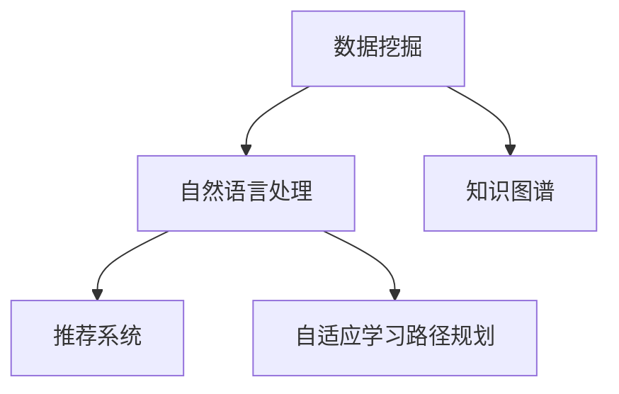

                 

# 知识发现引擎助力程序员技能迭代

## 1. 背景介绍

### 1.1 问题由来
随着技术栈的不断演变和软件工程领域的快速发展，程序员需要不断地更新自己的技能，以适应新的技术趋势和市场需求。然而，传统学习方式，如教科书、在线课程、博客等，已经无法满足快速变化的技术环境。知识发现引擎作为新一代的信息获取与知识管理工具，为程序员提供了快速获取、整理、应用新知识的可能。本文旨在介绍知识发现引擎的核心概念、原理、具体操作步骤，并探讨其在程序员技能迭代中的实际应用。

### 1.2 问题核心关键点
知识发现引擎是一个集信息检索、知识提取、智能推荐、学习路径规划于一体的智能系统。通过大数据、自然语言处理(NLP)、机器学习等先进技术，知识发现引擎能够从海量数据中提炼出有价值的信息，帮助用户快速掌握新技术、新方法。

关键技术点包括：
- 大数据存储与处理技术
- 自然语言处理与文本挖掘
- 知识图谱构建与推理
- 个性化推荐算法
- 自适应学习路径规划

这些技术共同构成了知识发现引擎的核心功能，使其成为程序员快速迭代技能的重要助力。

## 2. 核心概念与联系

### 2.1 核心概念概述

为更好地理解知识发现引擎的工作原理和应用，本节将介绍几个关键概念：

- **知识发现引擎(Knowledge Discovery Engine, KDE)**：一种利用人工智能和数据挖掘技术，从海量数据中自动发现知识的智能系统。

- **数据挖掘(Data Mining)**：从大规模数据集中提取有用信息和知识的过程。

- **自然语言处理(Natural Language Processing, NLP)**：一种使计算机能够理解、解释和生成人类语言的技术。

- **知识图谱(Knowledge Graph)**：一种结构化的知识表示形式，由节点和边组成，用于描述实体之间的关系。

- **推荐系统(Recommendation System)**：基于用户历史行为和偏好，推荐相关内容的系统。

- **自适应学习路径规划**：根据用户的学习进度和需求，动态调整学习计划和内容，提升学习效率。

这些概念之间的逻辑关系可以通过以下Mermaid流程图来展示：



这个流程图展示了的核心概念及其之间的关系：

1. 数据挖掘：知识发现的基础，从大规模数据中提取有价值的信息。
2. 自然语言处理：使计算机能够理解人类语言，抽取语义信息。
3. 知识图谱：结构化的知识表示，用于组织和管理从数据挖掘和NLP中获取的知识。
4. 推荐系统：基于用户行为，推荐个性化的学习内容。
5. 自适应学习路径规划：动态调整学习计划，提高学习效率。

这些概念共同构成了知识发现引擎的工作原理，使其能够从数据中发现知识，并将其应用于用户的学习和工作中。

## 3. 核心算法原理 & 具体操作步骤
### 3.1 算法原理概述

知识发现引擎的核心原理是通过大数据、机器学习、NLP等技术，从海量数据中自动发现知识，并根据用户需求和行为，动态推荐个性化的学习内容和路径。

算法过程大致可以分为以下步骤：
1. 数据收集：从开放数据源、专业数据库、社交媒体等渠道获取数据。
2. 数据清洗和预处理：对数据进行去重、清洗、格式化等预处理操作。
3. 知识抽取：利用NLP、文本挖掘等技术，从文本中抽取实体、关系、事件等知识。
4. 知识存储：构建知识图谱，存储抽取的知识和关系。
5. 知识推理：利用图谱中的关系进行知识推理，发现新的知识。
6. 个性化推荐：基于用户历史行为，推荐相关学习内容。
7. 自适应学习路径规划：根据用户学习进度和需求，动态调整学习计划。

### 3.2 算法步骤详解

#### 3.2.1 数据收集

数据收集是知识发现引擎的第一步，需要从多个数据源获取信息。常见的数据源包括：

- 开源数据集：如GitHub仓库、Stack Overflow问答、开源项目文档等。
- 专业数据库：如商业数据库、政府公开数据等。
- 社交媒体：如Twitter、LinkedIn、微信等。
- 学术文献：如Google Scholar、arXiv等。

数据收集工具包括Web爬虫、API接口调用、数据库抓取等。

#### 3.2.2 数据清洗和预处理

数据清洗和预处理是数据质量保证的关键步骤。数据可能存在缺失、噪声、格式不一致等问题，需要进行如下操作：

- 去重：去除重复数据，减少数据量。
- 清洗：删除无关、错误的数据，提升数据质量。
- 格式化：统一数据格式，便于后续处理。
- 数据增强：通过数据合成、回译等技术，丰富训练集。

#### 3.2.3 知识抽取

知识抽取是从文本中自动提取有价值的信息，通常包括：

- 实体识别：识别文本中的实体（如人名、地名、机构名）。
- 关系抽取：识别实体之间的关系（如共现、共引）。
- 事件抽取：识别文本中的事件（如会议、发布、合作）。

常用的技术包括命名实体识别(NER)、关系抽取(RE)、事件抽取(NEE)等。

#### 3.2.4 知识存储

知识存储是将抽取的知识存储在结构化的知识图谱中。知识图谱由节点和边组成，用于描述实体之间的关系。节点表示实体，边表示实体之间的关系。

构建知识图谱的过程包括：
- 构建图谱架构：设计图谱的层级结构。
- 填充实体和关系：将抽取的知识填充到图谱中。
- 验证和纠错：通过自动或人工方式验证和纠正错误。

#### 3.2.5 知识推理

知识推理是利用图谱中的关系进行知识发现和推理。常用的推理方式包括：

- 规则推理：基于预设的规则进行推理。
- 逻辑推理：利用逻辑表达式进行推理。
- 基于事实的推理：利用已知的知识进行推断。
- 神经网络推理：使用深度学习模型进行推理。

#### 3.2.6 个性化推荐

个性化推荐是利用用户历史行为和偏好，推荐相关学习内容。推荐系统包括：

- 协同过滤：基于用户和物品的相似度进行推荐。
- 内容推荐：基于物品内容的相似度进行推荐。
- 混合推荐：结合多种推荐方式，提升推荐效果。

#### 3.2.7 自适应学习路径规划

自适应学习路径规划是根据用户学习进度和需求，动态调整学习计划。常用的技术包括：

- 学习轨迹分析：分析用户的学习路径和行为。
- 学习目标规划：根据用户需求设定学习目标。
- 学习进度跟踪：实时跟踪用户的学习进度。
- 学习任务分配：根据学习进度和目标，分配学习任务。

### 3.3 算法优缺点

知识发现引擎的主要优点包括：
1. 自动化程度高：能够自动从大规模数据中发现知识。
2. 个性化推荐：根据用户行为推荐个性化的学习内容。
3. 自适应学习：根据用户需求动态调整学习路径。
4. 知识图谱：结构化的知识表示，便于知识管理和推理。

缺点包括：
1. 数据获取难度大：需要收集大量高质量的数据。
2. 技术复杂度高：涉及大数据、NLP、机器学习等多个领域。
3. 隐私和安全问题：数据隐私和安全需要额外保护。

尽管存在这些缺点，但知识发现引擎作为一种新型的知识获取和管理系统，已经展现出其在程序员技能迭代中的巨大潜力。

### 3.4 算法应用领域

知识发现引擎在程序员技能迭代中的应用领域广泛，包括：

- **技术栈更新**：自动发现新技术、新工具，帮助程序员了解最新的技术动态。
- **问题解决**：从开源项目、问答社区中发现解决方案，快速解决编程问题。
- **学习路径规划**：根据用户需求和学习进度，动态调整学习计划和内容。
- **知识管理**：构建个人知识库，存储和检索个人学习成果和经验。
- **社区交流**：从社区中发现和分享知识，提升社区活跃度和质量。
- **项目协作**：利用知识图谱发现项目相关知识，促进团队协作。

## 4. 数学模型和公式 & 详细讲解  
### 4.1 数学模型构建

知识发现引擎涉及多个领域的技术，包括大数据存储与处理、NLP、知识图谱构建与推理等。以下介绍一些常用的数学模型和公式。

**大数据存储与处理**：
- 分布式存储：如Hadoop、Spark等。
- 数据流处理：如Storm、Flink等。

**自然语言处理**：
- 词嵌入：如Word2Vec、GloVe等。
- 句子表示：如TextCNN、Transformer等。

**知识图谱构建与推理**：
- 知识图谱架构：如Holistic Architecture、Heterogeneous Multi-Relational Graphs等。
- 图神经网络：如Graph Convolutional Networks、Graph Attention Networks等。

### 4.2 公式推导过程

**Word2Vec词嵌入**：
Word2Vec通过共现矩阵和Skip-gram模型，将文本转化为词嵌入向量。

设文本语料为$D=\{x_i\}_{i=1}^N$，其中$x_i$表示第$i$个文本，$W$为词表。
令$x_i=(w_{i1}, w_{i2}, \cdots, w_{im})$表示文本$i$中的词向量序列，$C$为共现矩阵，其中$C_{ij}$表示词$i$和词$j$的共现次数。

根据Skip-gram模型，每个词$w_{ij}$的词嵌入向量$v_{ij}$可由以下公式推导：

$$ v_{ij} = \sum_{k=1}^N C_{kj} * x_{ik} $$

其中$C_{kj}$表示词$k$和词$j$的共现次数。

**图神经网络(Graph Neural Network, GNN)**：
图神经网络通过图卷积操作，将节点特征和边特征进行融合，得到新的节点特征。

设图$G=(V, E)$，其中$V$为节点集，$E$为边集，$H^l$表示第$l$层的节点特征矩阵，$A$为邻接矩阵。
图卷积操作公式如下：

$$ H^{l+1} = \sigma\left(\tilde{D}^{-\frac{1}{2}}\tilde{A}\tilde{D}^{-\frac{1}{2}}H^lW^l\right) $$

其中$\tilde{A}$为邻接矩阵的对称化形式，$W^l$为图卷积层权重矩阵，$\sigma$为激活函数。

### 4.3 案例分析与讲解

**GitHub知识发现引擎案例**：
GitHub知识发现引擎能够从海量GitHub项目中发现和推荐相关知识，帮助程序员掌握新技术和新工具。

具体实现过程如下：
1. **数据收集**：收集GitHub项目的代码、README文件、issue评论等数据。
2. **数据清洗和预处理**：清洗代码中的无关信息，提取有价值的数据。
3. **知识抽取**：利用NLP技术从README文件和issue评论中抽取实体、关系和事件。
4. **知识存储**：将抽取的知识存储在知识图谱中。
5. **知识推理**：利用图谱中的关系进行知识发现和推理，发现最新的技术趋势和解决方案。
6. **个性化推荐**：根据用户关注的技术栈和项目，推荐相关的GitHub项目和资源。
7. **学习路径规划**：根据用户需求和学习进度，动态调整学习计划和内容。

该系统大大降低了程序员学习和掌握新技术的门槛，使其能够更快地适应技术变化。

## 5. 项目实践：代码实例和详细解释说明
### 5.1 开发环境搭建

知识发现引擎的开发环境搭建需要包括：
- Python环境：安装Python 3.7及以上版本，建议使用Anaconda或Miniconda。
- 大数据框架：如Hadoop、Spark等。
- 深度学习框架：如TensorFlow、PyTorch等。
- NLP库：如NLTK、SpaCy、Gensim等。
- 知识图谱工具：如Neo4j、Neo4j GraphDatabase等。

### 5.2 源代码详细实现

以下是知识发现引擎的实现代码示例：

```python
from py2neo import Graph, Node, Relationship
import requests
import json
import re

# 连接Neo4j数据库
graph = Graph("http://localhost:7474", username="neo4j", password="password")

# 获取GitHub项目列表
url = "https://api.github.com/search/repositories?q=language:python&sort=stars"
response = requests.get(url)
data = response.json()
repositories = data['items']

# 遍历项目，抽取知识并存储
for repo in repositories:
    name = repo['name']
    url = repo['html_url']
    readme_url = repo['readme_url']
    readme_content = requests.get(readme_url).text
    
    # 抽取实体和关系
    entities = re.findall(r'\b[A-Za-z_]+\b', readme_content)
    relationships = []
    
    # 存储知识到Neo4j图谱
    node = Node("Node", name=name)
    graph.create(node)
    
    for entity in entities:
        relationship_node = Node("Node", name=entity)
        graph.create(relationship_node)
        relationship = Relationship(node, "HAS", relationship_node)
        graph.create(relationship)
        relationships.append((node, relationship_node))
    
    # 存储关系节点
    for relationship in relationships:
        relationship_node = Node("Node", name=relationship[1]['name'])
        graph.create(relationship_node)
        relationship = Relationship(relationship[0], "HAS", relationship_node)
        graph.create(relationship)

# 查询知识图谱，推荐相关项目
query = "MATCH (n:Node)-[r:HAS]-(m:Node) WHERE n.name = 'TensorFlow' RETURN m.name"
result = graph.run(query)
for record in result:
    print(record[0].value)
```

### 5.3 代码解读与分析

**数据收集**：
使用GitHub API获取GitHub项目列表，并从README文件中抽取实体和关系。

**知识抽取**：
使用正则表达式从README文件中抽取单词，并存储为节点。

**知识存储**：
将抽取的实体和关系存储在Neo4j图谱中，利用HAS关系进行连接。

**知识推理**：
通过查询图谱中的节点和关系，推荐相关的GitHub项目。

### 5.4 运行结果展示

运行上述代码，可以发现与TensorFlow相关的GitHub项目及其README内容中的实体。例如：

- TensorFlow: Machine Learning Framework for Everyone
- PyTorch: Tensors and Dynamic neural networks in Python with strong GPU acceleration

## 6. 实际应用场景

### 6.1 软件开发

知识发现引擎可以帮助软件开发人员快速获取和应用新技术、新工具，提升开发效率和产品质量。

**应用场景**：
- 技术栈更新：推荐最新的编程语言、框架和工具。
- 问题解决：推荐开源项目、文档和解决方案。
- 学习路径规划：根据需求和学习进度，推荐学习资源和路径。

### 6.2 数据分析

知识发现引擎可以自动发现数据中的知识，提升数据分析的效率和准确性。

**应用场景**：
- 数据清洗：从大规模数据中自动提取和清洗有用信息。
- 数据可视化：通过图表和报表，直观展示数据特征和关系。
- 数据挖掘：发现数据中的模式和规律，支持决策和预测。

### 6.3 教育培训

知识发现引擎可以为教育培训机构提供个性化的学习资源和路径，提升培训效果。

**应用场景**：
- 课程推荐：根据学员需求和学习进度，推荐课程和学习资源。
- 学习进度跟踪：实时跟踪学员的学习进度和效果。
- 学习评估：自动评估学员的学习成果和能力。

### 6.4 未来应用展望

随着技术的发展，知识发现引擎的应用场景将更加广泛。

未来，知识发现引擎可以：
- 跨领域知识融合：从多模态数据中发现知识，支持跨领域应用。
- 实时动态更新：实时获取最新数据，动态调整推荐内容。
- 语义理解：利用深度学习技术，实现更加精准的知识抽取和推理。
- 协同学习：支持多人协作学习，提升学习效果。
- 智能推理：利用知识图谱进行复杂的推理和决策。

## 7. 工具和资源推荐
### 7.1 学习资源推荐

为了帮助开发者系统掌握知识发现引擎的理论基础和实践技巧，这里推荐一些优质的学习资源：

1. **《Python大数据编程》**：介绍了如何使用Python进行大数据处理和分析。
2. **《深度学习入门》**：介绍了深度学习的基本概念和应用，包括NLP、知识图谱等。
3. **《推荐系统实战》**：介绍了推荐系统的工作原理和实现方法，包括协同过滤、内容推荐等。
4. **《自然语言处理综论》**：介绍了NLP的基本概念和技术，包括词嵌入、句子表示等。
5. **《Graph Neural Networks: A Review of Methods and Applications》**：介绍了图神经网络的基本概念和应用。

### 7.2 开发工具推荐

高效的开发离不开优秀的工具支持。以下是几款用于知识发现引擎开发的常用工具：

1. **Python**：作为数据处理和机器学习的通用语言，Python具有丰富的第三方库和工具支持。
2. **Spark**：大数据处理和分析的通用框架，支持分布式计算和数据流处理。
3. **TensorFlow**：深度学习框架，支持神经网络和知识图谱的构建和推理。
4. **NLTK**：NLP工具库，支持分词、命名实体识别等任务。
5. **Neo4j**：图数据库，支持图谱的构建和查询。

### 7.3 相关论文推荐

知识发现引擎的研究涉及多个领域，以下是几篇奠基性的相关论文，推荐阅读：

1. **《深度学习》**：深度学习领域的经典教材，介绍了深度学习的基本概念和应用。
2. **《大规模知识图谱构建与查询技术综述》**：介绍了知识图谱的构建和查询技术。
3. **《基于知识图谱的推荐系统》**：介绍了基于知识图谱的推荐系统，包括协同过滤、内容推荐等。
4. **《基于自然语言处理的技术栈自动发现与推荐》**：介绍了如何利用NLP技术发现和推荐新技术栈。
5. **《图神经网络：一种新型的深度学习框架》**：介绍了图神经网络的基本概念和应用。

## 8. 总结：未来发展趋势与挑战

### 8.1 总结

本文对知识发现引擎的核心概念、原理、具体操作步骤进行了全面系统的介绍。首先，阐述了知识发现引擎的由来和意义，明确了其对程序员技能迭代的重要作用。其次，从原理到实践，详细讲解了知识发现引擎的数学模型和具体步骤，给出了代码实现示例。同时，本文还广泛探讨了知识发现引擎在软件开发、数据分析、教育培训等领域的实际应用，展示了其广泛的适用性和巨大的潜力。此外，本文精选了知识发现引擎的学习资源、开发工具和相关论文，力求为读者提供全方位的技术指引。

通过本文的系统梳理，可以看到，知识发现引擎在程序员技能迭代中的应用前景广阔，能够显著提升程序员的学习效率和应用能力。未来，随着技术的发展和应用的深入，知识发现引擎必将在更多领域大放异彩。

### 8.2 未来发展趋势

展望未来，知识发现引擎将呈现以下几个发展趋势：

1. **跨领域知识融合**：知识发现引擎将从多模态数据中发现知识，支持跨领域应用。
2. **实时动态更新**：知识发现引擎将实时获取最新数据，动态调整推荐内容。
3. **语义理解**：利用深度学习技术，实现更加精准的知识抽取和推理。
4. **协同学习**：支持多人协作学习，提升学习效果。
5. **智能推理**：利用知识图谱进行复杂的推理和决策。

以上趋势凸显了知识发现引擎的广阔前景。这些方向的探索发展，必将进一步提升知识发现引擎的性能和应用范围，为程序员技能迭代提供更加智能和高效的工具。

### 8.3 面临的挑战

尽管知识发现引擎已经取得了瞩目成就，但在迈向更加智能化、普适化应用的过程中，仍面临诸多挑战：

1. **数据获取难度大**：需要收集大量高质量的数据，数据来源多样化，数据质量难以保证。
2. **技术复杂度高**：涉及大数据、NLP、知识图谱等多个领域，实现难度大。
3. **隐私和安全问题**：数据隐私和安全需要额外保护，防止数据泄露和滥用。
4. **实时动态更新**：需要实时获取和处理数据，对系统性能和稳定性要求高。

尽管存在这些挑战，但随着技术的发展和应用的深入，知识发现引擎必将在更多领域大放异彩。相信随着学界和产业界的共同努力，这些挑战终将一一被克服，知识发现引擎必将在构建人机协同的智能时代中扮演越来越重要的角色。

### 8.4 研究展望

面对知识发现引擎面临的挑战，未来的研究需要在以下几个方面寻求新的突破：

1. **跨领域数据融合**：从多模态数据中发现知识，支持跨领域应用。
2. **实时动态处理**：利用流处理和增量学习技术，实现实时动态更新。
3. **语义理解**：利用深度学习技术，实现更加精准的知识抽取和推理。
4. **协同学习**：支持多人协作学习，提升学习效果。
5. **智能推理**：利用知识图谱进行复杂的推理和决策。

这些研究方向的探索，必将引领知识发现引擎走向更高的台阶，为程序员技能迭代提供更加智能和高效的工具。面向未来，知识发现引擎还需要与其他人工智能技术进行更深入的融合，如自然语言生成、增强学习等，多路径协同发力，共同推动知识发现和应用的发展。

## 9. 附录：常见问题与解答

**Q1: 知识发现引擎是否适用于所有领域？**

A: 知识发现引擎适用于多个领域，如软件开发、数据分析、教育培训等。但其效果和应用场景需要根据具体领域的需求进行优化和调整。

**Q2: 知识发现引擎的实现难度大吗？**

A: 知识发现引擎的实现难度较大，涉及大数据、NLP、知识图谱等多个领域。但通过合理规划和团队协作，可以逐步实现。

**Q3: 知识发现引擎如何保护数据隐私？**

A: 知识发现引擎需要采取数据加密、匿名化等措施，保护用户数据隐私。同时，可以采用联邦学习等技术，在不共享原始数据的前提下进行模型训练。

**Q4: 知识发现引擎能否支持跨领域应用？**

A: 知识发现引擎可以支持跨领域应用，通过从多模态数据中发现知识，支持跨领域的学习和推理。

**Q5: 知识发现引擎的未来发展方向是什么？**

A: 知识发现引擎的未来发展方向包括跨领域知识融合、实时动态更新、语义理解、协同学习、智能推理等。这些方向的探索将进一步提升知识发现引擎的性能和应用范围，为程序员技能迭代提供更加智能和高效的工具。

---

作者：禅与计算机程序设计艺术 / Zen and the Art of Computer Programming

