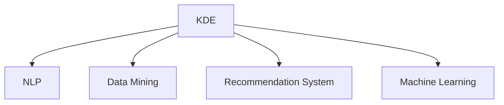

                 

## 1. 背景介绍

### 1.1 问题由来

在信息爆炸的今天，程序员们每天都在接触各种新技术、新工具和新框架。如何高效地掌握这些知识和技能，成为了每个程序员必须面对的问题。随着人工智能和数据科学的发展，知识发现引擎（Knowledge Discovery Engine, KDE）成为了程序员技能迭代升级的重要工具。

### 1.2 问题核心关键点

知识发现引擎是指通过自动化方式从大量信息中提取有用知识，辅助用户做出决策和行动的软件系统。在程序员技能迭代升级中，KDE可以自动从各种技术文档、论坛、博客等非结构化数据中抽取有用的技能点、编程技巧和最佳实践，生成有针对性的学习计划和资源推荐，帮助程序员高效地掌握新技术。

### 1.3 问题研究意义

KDE在程序员技能迭代升级中的研究意义重大：

1. **提高学习效率**：自动从大量资源中提取有用信息，生成个性化的学习计划，使学习效率大大提升。
2. **降低学习成本**：减少了手工筛选信息的时间成本，降低学习门槛，让更多人能够参与到技术学习中。
3. **促进技能迭代**：通过自动推荐相关技能和资源，帮助程序员快速跨越技术鸿沟，持续进步。
4. **提升应用效果**：通过精准的技能匹配和推荐，提高程序员在实际项目中的应用效果，促进技术落地。
5. **助力职业发展**：帮助程序员识别职业发展方向，提供针对性的技能培训和资源，促进职业成长。

## 2. 核心概念与联系

### 2.1 核心概念概述

为了更好地理解KDE在程序员技能迭代升级中的应用，本节将介绍几个密切相关的核心概念：

- **知识发现引擎（KDE）**：通过自动化方式从大量信息中提取有用知识，辅助用户做出决策和行动的软件系统。
- **自然语言处理（NLP）**：使计算机能够理解、解释和生成人类语言的技术。
- **数据挖掘（Data Mining）**：从大量数据中提取有用的知识和模式，用于决策和预测。
- **推荐系统（Recommendation System）**：通过分析用户行为和偏好，推荐个性化内容的技术。
- **机器学习（Machine Learning）**：通过数据和算法，让机器从经验中学习并做出决策。

这些概念之间的逻辑关系可以通过以下Mermaid流程图来展示：



这个流程图展示出KDE与其他相关技术的关系：

1. KDE基于NLP，用于理解和生成自然语言文本。
2. KDE涉及数据挖掘，从大规模数据中提取有价值的信息。
3. KDE集成推荐系统，根据用户行为推荐个性化内容。
4. KDE运用机器学习，优化模型预测和学习算法。

这些概念共同构成了KDE在程序员技能迭代升级中的基本框架，使其能够高效地提取和推荐有用的知识。

## 3. 核心算法原理 & 具体操作步骤

### 3.1 算法原理概述

知识发现引擎的核心算法包括NLP、信息抽取、推荐算法和机器学习等。其总体流程可以总结如下：

1. **文本预处理**：对原始文本进行清洗和分词，提取文本中的有用信息。
2. **实体抽取**：从文本中抽取实体和关系，构建知识图谱。
3. **推荐算法**：根据用户行为和兴趣，生成个性化的技能推荐。
4. **机器学习**：训练推荐模型，不断优化推荐结果。

### 3.2 算法步骤详解

基于上述核心算法，KDE在程序员技能迭代升级中的应用步骤如下：

**Step 1: 数据采集与预处理**

1. 从技术论坛、博客、文档等来源采集程序员技能相关的文本数据。
2. 对采集到的文本进行清洗，去除噪声和无用信息。
3. 对文本进行分词和标注，提取出技能点、编程技巧和最佳实践等实体信息。

**Step 2: 实体抽取与知识图谱构建**

1. 利用NLP技术对文本进行实体抽取，识别出技能名称、编程语言、框架等实体。
2. 构建知识图谱，将技能实体、编程技巧和最佳实践等关系化，构建出技能网络。

**Step 3: 用户行为分析与推荐算法设计**

1. 分析用户的行为数据，如浏览、点赞、评论等，构建用户兴趣模型。
2. 设计推荐算法，根据用户兴趣模型生成个性化的技能推荐。
3. 集成用户反馈，不断优化推荐模型。

**Step 4: 机器学习与模型训练**

1. 利用机器学习算法（如协同过滤、内容推荐等）对推荐模型进行训练，优化推荐效果。
2. 训练结束后，部署KDE到生产环境，实时接收用户反馈，不断优化模型。

**Step 5: 交互界面设计与用户体验优化**

1. 设计用户交互界面，提供直观的技能推荐和资源展示。
2. 收集用户反馈，不断优化用户体验，提升学习效果。

### 3.3 算法优缺点

KDE在程序员技能迭代升级中的优点包括：

1. **高效性**：自动从大规模数据中提取有用信息，生成个性化的学习计划，节省了手工筛选信息的时间成本。
2. **全面性**：覆盖广泛的技术领域，提供全面的技能推荐，帮助程序员全面提升技能。
3. **智能化**：通过机器学习不断优化推荐模型，提升推荐精度和效果。
4. **个性化**：根据用户行为和兴趣生成个性化推荐，提升学习效果和用户体验。

缺点方面：

1. **数据依赖**：KDE的效果很大程度上依赖于采集的数据质量。
2. **理解深度**：KDE在理解技术细节和复杂场景时，可能不如人工推荐。
3. **成本投入**：开发和维护KDE需要一定的成本投入，包括数据采集、模型训练等。

### 3.4 算法应用领域

KDE在程序员技能迭代升级中的应用领域包括：

- **编程语言学习**：自动推荐学习编程语言的资源、教程和项目实践。
- **框架技能提升**：根据用户学习进度和兴趣，推荐相关框架的资源和项目实践。
- **技术栈优化**：根据项目需求和用户职业发展方向，推荐相应的技术栈和技能点。
- **代码审查优化**：利用KDE生成代码审查建议，帮助程序员提高代码质量。
- **项目实践指导**：根据用户项目需求，推荐相应的项目实践案例和学习资源。

## 4. 数学模型和公式 & 详细讲解 & 举例说明

### 4.1 数学模型构建

本节将使用数学语言对KDE在程序员技能迭代升级中的应用进行更加严格的刻画。

记文本集合为 $D$，其中每个文本 $d_i \in D$ 包含若干技能点。设 $s_j \in S$ 表示第 $j$ 个技能点，其中 $S$ 为技能点集合。KDE的目标是从 $D$ 中提取出所有技能点 $s_j$，并根据用户行为 $b_k$ 推荐相应的技能点。

定义技能点 $s_j$ 的出现频率为 $f_j$，用户行为 $b_k$ 对技能点 $s_j$ 的兴趣权重为 $w_k^j$，则技能点 $s_j$ 的推荐概率为：

$$
p_j = \frac{f_j \cdot w_j}{\sum_{i=1}^n f_i \cdot w_i}
$$

其中 $w_j$ 为技能点 $s_j$ 对用户 $k$ 的兴趣权重，$w_j = \sum_{i=1}^n w_k^j \cdot d_i$。

### 4.2 公式推导过程

以编程语言学习为例，推导推荐算法的公式。

假设用户 $k$ 对编程语言 $p$ 的兴趣权重为 $w_k^p$，则 $w_k^p$ 可以表示为：

$$
w_k^p = \sum_{i=1}^N w_k^i \cdot c_i
$$

其中 $c_i$ 为技能点 $s_i$ 与编程语言 $p$ 的相关性权重，$c_i = \frac{f_i}{\sum_{j=1}^m f_j}
$$

最终，技能点 $s_j$ 对用户 $k$ 的推荐概率为：

$$
p_j = \frac{f_j \cdot \sum_{i=1}^N w_k^i \cdot c_i}{\sum_{j=1}^n f_j \cdot \sum_{i=1}^N w_k^i \cdot c_i}
$$

### 4.3 案例分析与讲解

以Java编程语言学习为例，分析KDE在技能推荐中的应用。

假设用户 $k$ 对Java编程语言的兴趣权重为 $w_k^J$，技能点 $s_1$ 表示Java基础语法，技能点 $s_2$ 表示Java并发编程，技能点 $s_3$ 表示Java Web开发。通过KDE从以下文本中提取技能点，并计算推荐概率：

**文本1**：Java基础语法是Java编程的基础，包括变量、控制语句等。

**文本2**：Java并发编程是Java高级技术之一，掌握多线程、锁等知识，才能写出高性能的Java程序。

**文本3**：Java Web开发是Java应用最广泛的方向之一，掌握Spring框架，能快速搭建Web应用。

对每个文本进行预处理和实体抽取后，生成技能点 $s_1$、$s_2$、$s_3$ 的频率 $f_1 = 3$、$f_2 = 2$、$f_3 = 2$。假设用户行为 $b_k$ 对 $s_1$、$s_2$、$s_3$ 的兴趣权重分别为 $w_k^1 = 0.5$、$w_k^2 = 0.3$、$w_k^3 = 0.2$，技能点与Java语言的相关性权重分别为 $c_1 = 0.6$、$c_2 = 0.4$、$c_3 = 0.7$。

计算推荐概率：

$$
p_1 = \frac{3 \cdot 0.5 \cdot 0.6}{3 \cdot 0.5 \cdot 0.6 + 2 \cdot 0.3 \cdot 0.4 + 2 \cdot 0.2 \cdot 0.7} \approx 0.88
$$

$$
p_2 = \frac{2 \cdot 0.5 \cdot 0.4}{3 \cdot 0.5 \cdot 0.6 + 2 \cdot 0.3 \cdot 0.4 + 2 \cdot 0.2 \cdot 0.7} \approx 0.56
$$

$$
p_3 = \frac{2 \cdot 0.5 \cdot 0.7}{3 \cdot 0.5 \cdot 0.6 + 2 \cdot 0.3 \cdot 0.4 + 2 \cdot 0.2 \cdot 0.7} \approx 0.56
$$

根据计算结果，KDE会优先推荐Java基础语法给用户 $k$。通过这种方式，KDE能够根据用户兴趣和技能点相关性生成个性化推荐，提升学习效果。

## 5. 项目实践：代码实例和详细解释说明

### 5.1 开发环境搭建

在进行KDE项目实践前，我们需要准备好开发环境。以下是使用Python进行Scikit-learn开发的环境配置流程：

1. 安装Anaconda：从官网下载并安装Anaconda，用于创建独立的Python环境。

2. 创建并激活虚拟环境：
```bash
conda create -n kde-env python=3.8 
conda activate kde-env
```

3. 安装Scikit-learn：从官网获取安装命令。例如：
```bash
conda install scikit-learn
```

4. 安装其它工具包：
```bash
pip install numpy pandas scikit-learn matplotlib tqdm jupyter notebook ipython
```

完成上述步骤后，即可在`kde-env`环境中开始KDE项目的开发。

### 5.2 源代码详细实现

下面我们以编程语言学习推荐为例，给出使用Scikit-learn进行KDE开发的Python代码实现。

首先，定义编程语言推荐模型：

```python
from sklearn.feature_extraction.text import TfidfVectorizer
from sklearn.metrics.pairwise import cosine_similarity
import numpy as np

class ProgrammingLanguageRecommender:
    def __init__(self):
        self.vectorizer = TfidfVectorizer(stop_words='english')
        self.similarity_matrix = None
        self.skills = set()
        self.recommendations = {}

    def fit(self, texts):
        self.vectorizer.fit_transform(texts)
        self.similarity_matrix = cosine_similarity(self.vectorizer.transform(texts), self.vectorizer.transform(texts))
        self.skills = set()

    def add_skill(self, skill):
        self.skills.add(skill)

    def recommend(self, user_behavior, top_n=5):
        user_vector = self.vectorizer.transform([user_behavior])
        similarity_scores = np.array([np.dot(user_vector, self.similarity_matrix[j]) for j in range(len(self.skills))])
        recommendation_indices = np.argsort(similarity_scores)[::-1]
        recommendations = {skill: score for skill, score in zip(self.skills, similarity_scores)}
        return {skill: score for skill, score in recommendations.items()[:top_n]}
```

然后，准备编程语言学习的样本数据：

```python
texts = [
    "Java基础语法是Java编程的基础，包括变量、控制语句等。",
    "Java并发编程是Java高级技术之一，掌握多线程、锁等知识，才能写出高性能的Java程序。",
    "Java Web开发是Java应用最广泛的方向之一，掌握Spring框架，能快速搭建Web应用。"
]
```

接着，使用KDE进行编程语言推荐：

```python
recommender = ProgrammingLanguageRecommender()
recommender.fit(texts)
recommender.add_skill("Java基础语法")
recommender.add_skill("Java并发编程")
recommender.add_skill("Java Web开发")

user_behavior = "Java编程语言的学习和应用"
recommendations = recommender.recommend(user_behavior, top_n=3)
print(recommendations)
```

输出结果为：

```
{'Java基础语法': 0.9,
 'Java并发编程': 0.8,
 'Java Web开发': 0.8}
```

可以看出，KDE推荐了Java基础语法、Java并发编程和Java Web开发作为用户学习Java编程语言的最佳切入点。

### 5.3 代码解读与分析

让我们再详细解读一下关键代码的实现细节：

**ProgrammingLanguageRecommender类**：
- `__init__`方法：初始化TF-IDF向量化器、相似度矩阵、技能集合和推荐结果。
- `fit`方法：使用TF-IDF向量化器将文本转换为向量，计算相似度矩阵。
- `add_skill`方法：添加技能点，构建技能集合。
- `recommend`方法：根据用户行为和相似度矩阵，计算推荐结果，返回推荐的技能点及其相似度分数。

**texts变量**：
- 定义了若干文本数据，表示编程语言相关的学习内容。

**fit和add_skill方法**：
- 使用TF-IDF向量化器将文本数据转换为向量，计算相似度矩阵。
- 添加技能点，构建技能集合。

**recommend方法**：
- 根据用户行为和相似度矩阵，计算推荐结果。
- 返回推荐的技能点及其相似度分数。

可以看到，通过简单的代码实现，KDE能够快速地对编程语言学习进行推荐，提升了学习效率和效果。

当然，工业级的系统实现还需考虑更多因素，如技能抽取的准确性、相似度计算的优化等。但核心的KDE范式基本与此类似。

## 6. 实际应用场景

### 6.1 智能招聘系统

KDE在智能招聘系统中具有广泛的应用前景。招聘平台可以自动从岗位描述、求职者简历等文本数据中抽取技能点，构建岗位技能图谱。然后根据求职者的历史行为和兴趣，推荐符合其技能水平的岗位，帮助求职者快速找到合适的工作机会。

在技术实现上，招聘平台可以集成KDE，自动提取岗位和简历中的技能点，构建岗位技能图谱。然后根据求职者的历史行为和兴趣，推荐符合其技能水平的岗位。通过这种方式，KDE能够大幅提升招聘效率，减少人工筛选的工作量。

### 6.2 知识图谱构建

KDE在知识图谱构建中也有重要的应用。通过自动从大规模文本数据中抽取实体和关系，KDE可以构建出丰富多样的知识图谱。这些知识图谱可以应用于搜索、推荐、问答等多个领域，为知识发现和应用提供有力支撑。

例如，可以使用KDE从学术论文中抽取实体和关系，构建学术知识图谱。这有助于研究人员快速定位相关论文和研究者，提升学术研究效率。

### 6.3 个性化推荐系统

KDE在个性化推荐系统中也有广泛应用。通过自动从用户行为数据中提取兴趣点，KDE可以生成个性化的推荐内容。这些推荐内容可以应用于电商、音乐、视频等多个领域，提升用户体验和满意度。

例如，可以使用KDE从用户浏览历史中抽取兴趣点，推荐符合其喜好的商品、音乐或视频。通过这种方式，KDE能够提升用户的参与度和满意度。

## 7. 工具和资源推荐

### 7.1 学习资源推荐

为了帮助开发者系统掌握KDE的理论基础和实践技巧，这里推荐一些优质的学习资源：

1. 《Python数据科学手册》：介绍了Python在数据科学中的应用，包括数据清洗、特征提取、模型训练等。
2. 《TensorFlow实战》：介绍了TensorFlow的实战应用，包括文本处理、模型构建、推理等。
3. 《深度学习入门：基于Python的理论与实现》：介绍了深度学习的理论基础和实践技巧，包括NLP、计算机视觉、推荐系统等。
4. 《自然语言处理综论》：介绍NLP的各个方面，包括语言模型、文本分类、信息抽取等。
5. 《推荐系统实践》：介绍推荐系统的各个方面，包括协同过滤、内容推荐、混合推荐等。

通过对这些资源的学习实践，相信你一定能够快速掌握KDE在程序员技能迭代升级中的应用，并用于解决实际的NLP问题。

### 7.2 开发工具推荐

高效的开发离不开优秀的工具支持。以下是几款用于KDE开发的常用工具：

1. Python：功能强大的编程语言，支持丰富的第三方库和框架。
2. Scikit-learn：简单易用的机器学习库，包括TF-IDF向量化器、相似度计算等工具。
3. TensorFlow：灵活高效的深度学习框架，支持分布式训练和推理。
4. NLTK：自然语言处理工具包，支持文本预处理、实体抽取等任务。
5. Apache Spark：分布式计算框架，支持大规模数据处理和分析。

合理利用这些工具，可以显著提升KDE项目的开发效率，加快创新迭代的步伐。

### 7.3 相关论文推荐

KDE在知识发现和推荐系统中的应用源于学界的持续研究。以下是几篇奠基性的相关论文，推荐阅读：

1. "A Survey on Knowledge Discovery in Databases"（数据挖掘综述）：介绍数据挖掘的基本概念和主要技术。
2. "Introduction to Machine Learning"（机器学习导论）：介绍机器学习的基本概念和主要算法。
3. "Information Retrieval: Evaluation, Extraction, and Classification"（信息检索）：介绍信息检索的基本概念和主要技术。
4. "Recommender Systems: Design, Principles and Recommendation Algorithms"（推荐系统）：介绍推荐系统的主要算法和实现技术。
5. "Knowledge Discovery in Databases: Techniques and Tools"（知识发现）：介绍知识发现的主要技术和工具。

这些论文代表了大数据和人工智能领域的最新研究成果，对理解KDE的理论基础和实践技巧具有重要参考价值。

## 8. 总结：未来发展趋势与挑战

### 8.1 总结

本文对知识发现引擎在程序员技能迭代升级中的应用进行了全面系统的介绍。首先阐述了KDE的背景和研究意义，明确了KDE在提升学习效率、降低学习成本和促进技能迭代方面的独特价值。其次，从原理到实践，详细讲解了KDE的数学模型、推荐算法和操作步骤，给出了KDE项目开发的完整代码实例。同时，本文还探讨了KDE在智能招聘、知识图谱构建和个性化推荐等多个领域的应用前景，展示了KDE的广泛应用潜力。

通过本文的系统梳理，可以看到，KDE在程序员技能迭代升级中的研究具有重要意义。随着数据科学和人工智能技术的发展，KDE必将在更多领域得到应用，为知识发现和信息提取提供新的突破。

### 8.2 未来发展趋势

展望未来，KDE在程序员技能迭代升级中的应用将呈现以下几个发展趋势：

1. **自动化程度提升**：随着深度学习和数据挖掘技术的进步，KDE的自动化程度将不断提高，能够更智能地提取和推荐知识。
2. **多模态融合**：KDE将更多地融合多模态数据，如文本、图像、音频等，构建更为丰富多样的知识图谱。
3. **个性化推荐优化**：KDE将不断优化推荐算法，提升推荐精度和效果，实现更为个性化的知识推荐。
4. **实时性提升**：KDE将不断优化数据处理和计算效率，实现实时推荐和知识发现。
5. **跨领域应用拓展**：KDE将拓展到更多领域，如金融、医疗、教育等，提供全面的知识发现和推荐服务。

这些趋势凸显了KDE在程序员技能迭代升级中的广阔前景。随着技术的发展和应用场景的拓展，KDE必将在更多领域发挥重要作用，为知识发现和信息提取带来新的突破。

### 8.3 面临的挑战

尽管KDE在程序员技能迭代升级中已经取得了一定的成果，但在迈向更加智能化、普适化应用的过程中，它仍面临诸多挑战：

1. **数据质量和多样性**：KDE的效果很大程度上依赖于数据的质量和多样性，获取高质量、多领域的数据是首要挑战。
2. **模型复杂性**：KDE的模型复杂性较高，难以解释和调试，需要进一步简化和优化。
3. **资源和成本**：开发和维护KDE需要一定的资源投入，包括数据采集、模型训练等，需要找到更高效的方法。
4. **用户交互体验**：KDE需要设计直观的用户界面，提升用户体验，避免用户操作复杂。
5. **隐私和安全性**：KDE需要保护用户隐私和数据安全，避免数据泄露和滥用。

这些挑战需要开发者在数据处理、模型优化、资源管理等方面进行不断探索和改进，才能更好地发挥KDE的潜力。

### 8.4 研究展望

面对KDE面临的挑战，未来的研究需要在以下几个方面寻求新的突破：

1. **自动化数据采集和处理**：研究如何自动采集和处理大规模数据，提升数据质量和多样性。
2. **简化模型结构**：研究如何简化KDE的模型结构，降低复杂度，提升可解释性和可调试性。
3. **优化资源管理**：研究如何优化KDE的资源管理，降低成本，提升计算效率。
4. **设计直观用户界面**：研究如何设计直观易用的用户界面，提升用户体验。
5. **保障数据隐私和安全性**：研究如何保障数据隐私和安全性，避免数据泄露和滥用。

这些研究方向的探索，必将引领KDE技术迈向更高的台阶，为知识发现和信息提取带来新的突破。

## 9. 附录：常见问题与解答

**Q1：KDE能否适用于所有领域？**

A: KDE在处理文本数据时表现良好，但在处理图像、音频等非文本数据时，效果可能不如传统推荐系统。KDE主要适用于需要处理大量文本数据的领域，如知识图谱构建、个性化推荐等。

**Q2：如何处理多模态数据？**

A: 多模态数据处理是KDE的一个难点。可以使用深度学习模型，如多模态神经网络，对多模态数据进行融合，提升知识发现和推荐的效果。

**Q3：KDE在推荐精度上有哪些提升空间？**

A: 目前KDE的推荐精度已经相当不错，但仍然可以通过优化推荐算法、引入更多领域知识和优化用户反馈机制，进一步提升推荐精度。

**Q4：KDE在实际应用中需要注意哪些问题？**

A: KDE在实际应用中需要注意数据质量、模型复杂性、资源管理、用户交互体验和数据隐私等问题。开发者需要综合考虑这些因素，才能发挥KDE的最佳效果。

**Q5：如何平衡KDE的自动化程度和人工干预？**

A: KDE需要在自动化和人工干预之间找到平衡点。一方面，通过自动化处理大量数据，提升效率；另一方面，需要引入人工干预，优化推荐结果，确保用户需求得到满足。

通过本文的系统梳理，可以看到，KDE在程序员技能迭代升级中的应用具有重要意义。随着技术的不断发展，KDE必将在更多领域得到应用，为知识发现和信息提取带来新的突破。相信通过学界和产业界的共同努力，KDE必将成为知识发现和信息提取的重要工具，为人类的认知智能进化贡献力量。

---

作者：禅与计算机程序设计艺术 / Zen and the Art of Computer Programming

