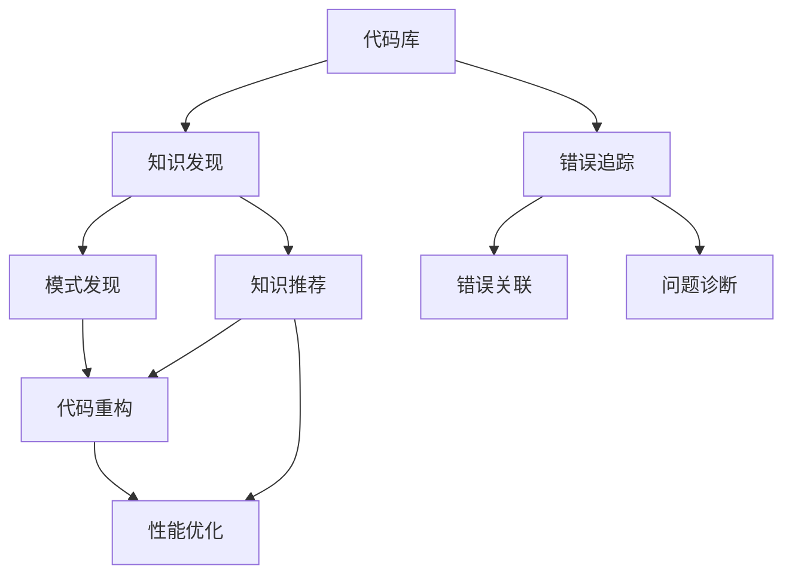

                 

# 知识发现引擎助力程序员突破技术瓶颈

## 1. 背景介绍

### 1.1 问题由来
随着软件项目的规模日益增大，复杂度不断提高，程序员在开发过程中面临诸多技术瓶颈，如代码重构困难、性能调优难度大、错误追踪困难等。传统的基于经验和直觉的编程方式已经难以应对现代软件的复杂性。因此，亟需一种能够自动发现知识、提供智能建议的工具，以辅助程序员更高效、更可靠地进行软件开发。

### 1.2 问题核心关键点
知识发现引擎（Knowledge Discovery Engine, KDE）正是一种能够自动识别、归纳、推荐软件知识的工具。它通过分析代码、注释、问题报告等开发文档，自动发现代码中的模式、规律、漏洞等信息，生成智能建议，帮助程序员突破技术瓶颈，提升软件开发效率和代码质量。

## 2. 核心概念与联系

### 2.1 核心概念概述

为更好地理解知识发现引擎的工作原理和优化方向，本节将介绍几个关键概念：

- 知识发现引擎（KDE）：基于统计学习、自然语言处理等技术，自动分析代码和开发文档，提取有价值的知识模式和规律。
- 模式发现（Pattern Discovery）：从代码中识别出常见编程模式、架构模式、错误模式等。
- 知识推荐（Knowledge Recommendation）：根据模式发现结果，推荐与特定问题相关的代码片段、最佳实践、解决方案等。
- 代码重构（Code Refactoring）：基于模式发现和知识推荐，自动生成代码重构建议，提升代码的可读性和可维护性。
- 性能优化（Performance Optimization）：自动分析代码性能瓶颈，生成优化建议，提升软件性能。
- 错误追踪（Error Tracking）：通过分析日志和问题报告，自动关联错误信息，生成问题诊断报告。

这些核心概念之间的逻辑关系可以通过以下Mermaid流程图来展示：



这个流程图展示了一个典型的知识发现引擎工作流程：

1. 从代码库中提取代码和注释。
2. 应用统计学习、自然语言处理等技术，发现代码中的模式和规律。
3. 根据模式发现结果，生成代码重构和优化建议。
4. 应用错误追踪技术，关联错误信息，生成问题诊断报告。

这些核心概念共同构成了知识发现引擎的技术框架，使其能够在各种场景下辅助程序员高效地进行软件开发。

## 3. 核心算法原理 & 具体操作步骤
### 3.1 算法原理概述

知识发现引擎的工作原理可以简单概括为：

1. **数据收集与预处理**：从代码库、注释、日志等文本中提取有用的数据。
2. **特征提取与表示**：将提取出的数据转换成适合机器学习的特征向量，如词袋模型、TF-IDF向量等。
3. **模式发现与归纳**：应用统计学习算法，如关联规则学习、分类算法等，自动发现代码中的模式和规律。
4. **知识推荐与优化**：根据模式发现结果，推荐与特定问题相关的代码片段、最佳实践、解决方案等。
5. **错误追踪与诊断**：通过分析日志和问题报告，关联错误信息，生成问题诊断报告。

### 3.2 算法步骤详解

以下是一个简单的知识发现引擎的工作流程，以代码重构为例：

1. **数据收集**：从代码库中提取待重构的代码片段，收集注释、问题报告等信息。

2. **特征提取**：使用词袋模型、TF-IDF向量等方法，将代码片段和注释转换成特征向量。

3. **模式发现**：应用分类算法（如朴素贝叶斯、支持向量机等），自动发现代码中的常见模式。例如，识别出冗余代码、复杂的控制流等。

4. **知识推荐**：根据模式发现结果，推荐与特定问题相关的代码片段、最佳实践、解决方案等。例如，对于冗余代码，推荐合并代码片段、移除冗余变量等。

5. **代码重构**：将推荐的代码片段应用到待重构代码中，完成代码重构。例如，根据推荐结果，自动生成代码重构建议，帮助程序员完成重构。

6. **效果评估**：评估代码重构后的代码质量，如可读性、可维护性等。

### 3.3 算法优缺点

知识发现引擎具有以下优点：
1. **自动发现知识**：能够自动识别和归纳代码中的模式、规律和漏洞，减少人工查找的工作量。
2. **生成智能建议**：根据模式发现结果，自动生成智能建议，辅助程序员进行代码重构和优化。
3. **提高开发效率**：通过自动发现问题并生成解决方案，帮助程序员快速定位和解决问题，提升开发效率。
4. **提升代码质量**：根据模式发现结果，自动生成代码重构建议，提升代码的可读性和可维护性。

同时，知识发现引擎也存在一些局限性：
1. **依赖数据质量**：依赖高质量的代码库和注释，如果数据质量不高，模式发现和知识推荐效果会大打折扣。
2. **缺乏领域知识**：由于缺少领域专家的知识指导，有时生成的建议不够精准，需要人工审核。
3. **模型复杂度高**：需要应用复杂的机器学习算法，计算和存储成本较高。
4. **难以解释**：自动生成的建议缺乏解释性，可能难以让人理解。

尽管存在这些局限性，但知识发现引擎作为辅助程序员的工具，已经展示了其在提升软件开发效率和代码质量方面的巨大潜力。

### 3.4 算法应用领域

知识发现引擎已经广泛应用于软件开发过程的多个环节，具体包括：

- **代码重构**：自动生成代码重构建议，提升代码可读性和可维护性。
- **性能优化**：自动分析代码性能瓶颈，生成优化建议，提升软件性能。
- **错误追踪**：通过分析日志和问题报告，自动关联错误信息，生成问题诊断报告。
- **知识推荐**：根据模式发现结果，推荐与特定问题相关的代码片段、最佳实践、解决方案等。
- **文档生成**：自动生成代码文档和注释，提升代码可理解性。

除了上述这些常见应用外，知识发现引擎还在自动化测试、代码审查、版本控制等方面发挥着重要作用，为软件开发过程带来了革命性的变革。

## 4. 数学模型和公式 & 详细讲解 & 举例说明
### 4.1 数学模型构建

知识发现引擎的核心数学模型是统计学习模型。以代码重构为例，我们可以使用朴素贝叶斯分类器来识别出冗余代码模式。

假设我们的特征向量为 $x=(x_1, x_2, ..., x_n)$，其中 $x_i$ 表示第 $i$ 个特征的值。我们希望找到一个分类器 $f(x)$，使得 $f(x)$ 能够预测 $x$ 是否为冗余代码。

### 4.2 公式推导过程

朴素贝叶斯分类器的推导过程如下：

设 $y$ 为冗余代码标签，取值为 $0$（非冗余）或 $1$（冗余）。我们假设 $x$ 和 $y$ 是条件独立的，即 $p(x_1, x_2, ..., x_n | y) = p(x_1 | y) p(x_2 | y) ... p(x_n | y)$。

根据贝叶斯定理，可以得到：

$$
p(y | x) = \frac{p(y) p(x | y)}{p(x)}
$$

其中 $p(y)$ 为 $y$ 的先验概率，$p(x)$ 为 $x$ 的先验概率。在实践中，我们通常假设 $p(y)$ 和 $p(x)$ 是已知的，因此我们只需要计算 $p(x | y)$ 即可。

### 4.3 案例分析与讲解

假设我们有一个包含 100 个特征的代码片段，使用朴素贝叶斯分类器进行冗余代码识别。我们首先训练模型，然后使用模型对新的代码片段进行分类。

在训练阶段，我们收集了一些已知的冗余代码和非冗余代码的特征向量，以及它们对应的标签。然后，我们将这些特征向量作为输入，使用朴素贝叶斯分类器进行训练。

在测试阶段，我们收集一个新的代码片段的特征向量 $x$，使用训练好的模型 $f(x)$ 进行预测，得到 $y$ 的值。如果 $y=1$，则说明该代码片段是冗余代码，需要进行重构。

## 5. 项目实践：代码实例和详细解释说明
### 5.1 开发环境搭建

在进行知识发现引擎的开发前，我们需要准备好开发环境。以下是使用Python进行知识发现引擎开发的环境配置流程：

1. 安装Python：从官网下载并安装Python，建议在3.7及以上版本。

2. 安装相关库：安装必要的库，如NumPy、pandas、scikit-learn等。

3. 准备数据集：收集并准备训练集和测试集，将代码片段和注释转换成特征向量。

### 5.2 源代码详细实现

以下是一个简单的知识发现引擎的代码实现，以代码重构为例：

```python
import numpy as np
from sklearn.naive_bayes import MultinomialNB

# 特征提取函数，将代码片段和注释转换成特征向量
def extract_features(code, comments):
    # 实现特征提取算法，如TF-IDF、词袋模型等
    features = []
    # 将提取的特征添加到features列表中
    features.append(...)
    return features

# 训练数据集
train_data = [(...), (...)]

# 测试数据集
test_data = [(...), (...)]

# 训练模型
model = MultinomialNB()
model.fit([train_data[0] for _, train_data in train_data], [train_data[1] for _, train_data in train_data])

# 测试模型
test_preds = []
for test_data in test_data:
    features = extract_features(test_data[0], test_data[1])
    test_preds.append(model.predict([features])[0])
```

### 5.3 代码解读与分析

让我们再详细解读一下关键代码的实现细节：

**extract_features函数**：
- `extract_features`方法：实现特征提取算法，将代码片段和注释转换成特征向量。

**train_data和test_data变量**：
- `train_data`变量：包含训练集的数据，每个元素包含代码片段和对应的注释。
- `test_data`变量：包含测试集的数据，每个元素包含代码片段和对应的注释。

**MultinomialNB模型**：
- `MultinomialNB`类：实现朴素贝叶斯分类器，用于训练和测试模型。

**模型训练与测试**：
- `model.fit`方法：训练模型，将训练集特征和标签作为输入。
- `model.predict`方法：测试模型，将测试集特征作为输入，输出预测标签。

## 6. 实际应用场景
### 6.1 智能代码生成

知识发现引擎可以自动分析代码库中的模式，生成智能代码片段，辅助程序员快速编写代码。例如，当程序员需要实现一个常见的算法时，知识发现引擎可以自动提供已有的代码片段和最佳实践，减少代码编写时间。

### 6.2 自动化测试

知识发现引擎可以自动分析代码库中的测试用例，发现潜在的测试漏洞，生成测试用例和断言，提升软件测试覆盖率。例如，对于某个函数的测试用例，知识发现引擎可以自动分析函数参数和返回值，生成测试用例和断言。

### 6.3 代码审查

知识发现引擎可以自动分析代码库中的代码片段，发现代码中的问题，生成代码审查建议，提升代码质量。例如，对于某个代码片段，知识发现引擎可以自动分析代码结构和注释，生成代码审查建议。

### 6.4 未来应用展望

未来，知识发现引擎将在软件开发过程中发挥更加重要的作用，具体包括：

- **更精准的模式识别**：通过引入更多先验知识，如领域专家知识、行业规范等，提升模式识别的准确性。
- **更智能的知识推荐**：结合因果分析和博弈论工具，生成更合理、可解释的知识推荐。
- **更高效的性能优化**：引入更多先验知识，如硬件架构、内存管理等，提升性能优化的效果。
- **更全面的错误追踪**：结合更多先验知识，如日志格式、错误信息等，提升错误追踪的准确性。
- **更多样化的应用场景**：除了代码重构、性能优化、错误追踪等，知识发现引擎还可以应用于自动测试、代码审查、版本控制等方面。

随着知识发现引擎技术的不断发展，相信其在软件开发过程中的作用将越来越大，为软件开发过程带来革命性的变革。

## 7. 工具和资源推荐
### 7.1 学习资源推荐

为了帮助开发者系统掌握知识发现引擎的理论基础和实践技巧，这里推荐一些优质的学习资源：

1. 《Python机器学习》（第二版）：适合初学者的机器学习入门书籍，详细介绍了各种机器学习算法和应用。
2. 《深度学习》（Goodfellow et al.）：深度学习领域的经典教材，介绍了深度学习的基本原理和应用。
3. 《自然语言处理综论》：NLP领域的经典教材，介绍了自然语言处理的基本概念和应用。
4. Kaggle：一个机器学习竞赛平台，可以参与各类机器学习比赛，提升实战能力。
5. GitHub：一个代码托管平台，可以查找和贡献开源项目，提升代码编写和协作能力。

通过对这些资源的学习实践，相信你一定能够快速掌握知识发现引擎的精髓，并用于解决实际的开发问题。

### 7.2 开发工具推荐

高效的开发离不开优秀的工具支持。以下是几款用于知识发现引擎开发的常用工具：

1. Python：一种高效、灵活的编程语言，广泛应用于机器学习和自然语言处理等领域。

2. NumPy：一个用于科学计算的Python库，提供了高效的数组操作和数学运算功能。

3. pandas：一个数据分析库，提供了强大的数据处理和分析功能。

4. scikit-learn：一个机器学习库，提供了各种机器学习算法和模型。

5. TensorFlow：由Google主导开发的开源深度学习框架，生产部署方便，适合大规模工程应用。

6. PyTorch：基于Python的开源深度学习框架，灵活动态的计算图，适合快速迭代研究。

合理利用这些工具，可以显著提升知识发现引擎的开发效率，加快创新迭代的步伐。

### 7.3 相关论文推荐

知识发现引擎的发展源于学界的持续研究。以下是几篇奠基性的相关论文，推荐阅读：

1. "A Statistical Framework for KDD"（Domingos et al.）：提出了基于统计学习的数据挖掘框架，为知识发现引擎奠定了基础。
2. "Pattern Mining in Data Streams"（Tam et al.）：介绍了基于模式发现的数据挖掘方法，为知识发现引擎提供了理论支持。
3. "Knowledge Discovery in Databases: An Overview"（Livnat et al.）：综述了知识发现引擎的研究现状，介绍了各种知识发现方法和应用。
4. "Mining Sequential Patterns over Databases with Multilayered Stochastic Nearest Neighbor Rule Induction"（Xu et al.）：介绍了基于序列模式发现的数据挖掘方法，为知识发现引擎提供了技术支撑。
5. "A Generalized Model of Multimedia Databases: Mining Association Rules for Multi-Aspect Data"（Li et al.）：介绍了多模态数据挖掘方法，为知识发现引擎提供了新的思路。

这些论文代表了大语言模型微调技术的发展脉络。通过学习这些前沿成果，可以帮助研究者把握学科前进方向，激发更多的创新灵感。

## 8. 总结：未来发展趋势与挑战

### 8.1 总结

本文对知识发现引擎的工作原理和优化方向进行了全面系统的介绍。首先阐述了知识发现引擎的研究背景和意义，明确了知识发现引擎在软件开发过程中的重要价值。其次，从原理到实践，详细讲解了知识发现引擎的数学模型和操作步骤，给出了知识发现引擎的完整代码实例。同时，本文还广泛探讨了知识发现引擎在软件开发过程中的多种应用场景，展示了知识发现引擎的广泛潜力。此外，本文精选了知识发现引擎的学习资源，力求为读者提供全方位的技术指引。

通过本文的系统梳理，可以看到，知识发现引擎作为辅助程序员的工具，已经在软件开发过程中展示了其巨大的优势和潜力。未来，伴随知识发现引擎技术的不断发展，相信其在软件开发过程中的作用将越来越大，为软件开发过程带来革命性的变革。

### 8.2 未来发展趋势

展望未来，知识发现引擎将呈现以下几个发展趋势：

1. **更加精准的模式识别**：通过引入更多先验知识，如领域专家知识、行业规范等，提升模式识别的准确性。
2. **更智能的知识推荐**：结合因果分析和博弈论工具，生成更合理、可解释的知识推荐。
3. **更高效的性能优化**：引入更多先验知识，如硬件架构、内存管理等，提升性能优化的效果。
4. **更全面的错误追踪**：结合更多先验知识，如日志格式、错误信息等，提升错误追踪的准确性。
5. **更多样化的应用场景**：除了代码重构、性能优化、错误追踪等，知识发现引擎还可以应用于自动测试、代码审查、版本控制等方面。

这些趋势凸显了知识发现引擎的广泛应用前景，相信随着技术的发展，知识发现引擎必将在软件开发过程中发挥越来越重要的作用。

### 8.3 面临的挑战

尽管知识发现引擎已经取得了一定的进展，但在迈向更加智能化、普适化应用的过程中，仍面临诸多挑战：

1. **依赖数据质量**：依赖高质量的代码库和注释，如果数据质量不高，模式发现和知识推荐效果会大打折扣。
2. **缺乏领域知识**：由于缺少领域专家的知识指导，有时生成的建议不够精准，需要人工审核。
3. **模型复杂度高**：需要应用复杂的机器学习算法，计算和存储成本较高。
4. **难以解释**：自动生成的建议缺乏解释性，可能难以让人理解。

尽管存在这些挑战，但知识发现引擎作为辅助程序员的工具，已经展示了其在提升软件开发效率和代码质量方面的巨大潜力。相信随着学界和产业界的共同努力，这些挑战终将一一被克服，知识发现引擎必将在软件开发过程中发挥更加重要的作用。

### 8.4 研究展望

面对知识发现引擎所面临的种种挑战，未来的研究需要在以下几个方面寻求新的突破：

1. **探索无监督和半监督知识发现方法**：摆脱对大规模标注数据的依赖，利用自监督学习、主动学习等无监督和半监督范式，最大限度利用非结构化数据，实现更加灵活高效的发现。
2. **研究知识发现的计算效率**：开发更加高效的计算方法和数据结构，减少计算和存储成本。
3. **引入更多先验知识**：将符号化的先验知识，如知识图谱、逻辑规则等，与知识发现引擎进行巧妙融合，引导发现过程学习更准确、合理的知识。
4. **结合因果分析和博弈论工具**：将因果分析方法引入知识发现引擎，识别出模型决策的关键特征，增强输出的因果性和逻辑性。

这些研究方向的探索，必将引领知识发现引擎技术迈向更高的台阶，为软件开发过程带来革命性的变革。面向未来，知识发现引擎还需要与其他人工智能技术进行更深入的融合，如知识表示、因果推理、强化学习等，多路径协同发力，共同推动软件开发过程的进步。只有勇于创新、敢于突破，才能不断拓展知识发现引擎的边界，让智能技术更好地服务于软件开发过程。

## 9. 附录：常见问题与解答

**Q1：知识发现引擎是否适用于所有软件开发场景？**

A: 知识发现引擎适用于多种软件开发场景，包括代码重构、性能优化、错误追踪、代码审查、自动测试等。但对于一些特定领域的开发，如医学、法律等，由于缺少相应的先验知识，生成的建议可能不够精准，需要人工审核。

**Q2：如何选择合适的特征向量表示方法？**

A: 特征向量表示方法的选择应根据具体的应用场景和数据特点来决定。常见的特征向量表示方法包括TF-IDF、词袋模型、词嵌入等。一般来说，TF-IDF适合文本数据，词袋模型适合分类任务，词嵌入适合序列数据。

**Q3：知识发现引擎生成的建议是否需要人工审核？**

A: 知识发现引擎生成的建议通常需要人工审核。这是因为知识发现引擎的生成过程缺乏领域专家的知识指导，生成的建议可能不够精准。通过人工审核，可以确保生成的建议符合实际需求，提升知识发现引擎的可靠性和实用性。

**Q4：知识发现引擎在代码重构过程中应注意哪些问题？**

A: 在代码重构过程中，知识发现引擎生成的建议需要结合实际代码结构和业务需求进行评估。生成的建议可能存在过度重构、引入新问题等风险，需要仔细评估和验证。此外，生成的建议可能无法满足特定的业务需求，需要结合领域专家的知识进行适当调整。

**Q5：知识发现引擎如何保持数据的新鲜度？**

A: 知识发现引擎的数据通常是静态的，需要定期更新和维护。为了保持数据的新鲜度，需要定期收集新的代码片段和注释，进行重新训练和测试。此外，需要建立数据清洗和预处理机制，确保数据的质量和一致性。

总之，知识发现引擎作为辅助程序员的工具，已经在软件开发过程中展示了其巨大的优势和潜力。未来，伴随知识发现引擎技术的不断发展，相信其在软件开发过程中的作用将越来越大，为软件开发过程带来革命性的变革。通过不断探索和创新，知识发现引擎必将在软件开发过程中发挥更加重要的作用。

