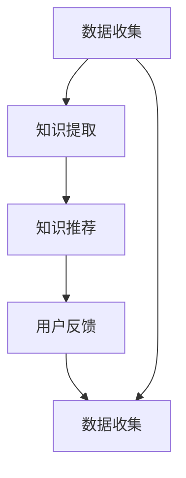

                 

## 1. 背景介绍

在当今信息爆炸的时代，程序员面临着前所未有的挑战。技术的快速发展使得程序员需要不断学习新的技能，而海量的技术资料也使得学习和成长变得复杂。在这种情况下，知识发现引擎(Knowledge Discovery Engine, KDE)应运而生，它利用人工智能和大数据分析技术，帮助程序员快速发现和吸收新知识，从而加速成长。

### 1.1 知识发现引擎的兴起背景
随着互联网和信息技术的飞速发展，程序员需要掌握的技术和工具越来越多，学习曲线变得陡峭。与此同时，海量的技术文档、博客、教程等资料，也使得程序员很难快速找到所需信息，浪费了大量时间。知识发现引擎通过利用先进的算法和模型，能够自动分析、归纳和提取关键知识，帮助程序员快速定位和吸收新知识，提升学习和工作效率。

### 1.2 知识发现引擎的核心价值
知识发现引擎的核心价值在于其能够：
1. **自动发现相关知识**：通过数据挖掘和机器学习，自动发现程序员可能需要的知识点和资源。
2. **个性化推荐知识**：根据程序员的学习历史和兴趣，个性化推荐最适合的学习资料和教程。
3. **实时更新知识库**：动态更新知识库，确保程序员获取最新的技术动态和趋势。
4. **提升学习效率**：通过知识发现和推荐，帮助程序员快速定位到所需知识，提升学习效率。

## 2. 核心概念与联系

### 2.1 核心概念概述
知识发现引擎(KDE)是一个综合利用人工智能、大数据分析和自然语言处理技术的系统，旨在帮助程序员快速发现和吸收新知识。KDE的核心组件包括：

- **数据收集模块**：从各种开源社区、技术博客、在线教程等渠道收集技术资料和知识点。
- **知识提取模块**：利用自然语言处理技术，提取关键技术点和代码示例。
- **知识推荐模块**：基于机器学习和协同过滤算法，推荐程序员最需要的学习资料。
- **用户反馈模块**：收集程序员的反馈信息，不断优化推荐算法和知识库。

这些组件协同工作，形成一个完整的知识发现和推荐闭环，帮助程序员高效学习和成长。

### 2.2 核心概念原理和架构的 Mermaid 流程图


这个流程图展示了知识发现引擎的基本工作流程：数据收集模块负责收集各类技术资料，知识提取模块提取关键知识点，知识推荐模块基于机器学习算法推荐相关学习资料，用户反馈模块收集程序员的反馈信息，形成闭环。

## 3. 核心算法原理 & 具体操作步骤

### 3.1 算法原理概述

知识发现引擎的核心算法主要包括自然语言处理、机器学习和协同过滤等。这些算法通过分析和推荐，帮助程序员快速发现和吸收新知识。

- **自然语言处理**：通过文本分析和词向量技术，自动提取关键技术点和代码示例。
- **机器学习**：利用监督学习、半监督学习和强化学习算法，推荐最相关的学习资料。
- **协同过滤**：通过分析程序员的学习历史和兴趣，推荐最适合的学习资料。

### 3.2 算法步骤详解

知识发现引擎的主要操作步骤包括：
1. **数据收集**：从各种技术社区、博客、教程等渠道收集技术资料。
2. **文本分析**：使用自然语言处理技术，提取关键技术点和代码示例。
3. **特征提取**：利用TF-IDF、词向量等技术，将文本转换为向量表示。
4. **机器学习**：使用监督学习、半监督学习和强化学习算法，推荐最相关的学习资料。
5. **协同过滤**：基于程序员的学习历史和兴趣，推荐最合适的学习资料。
6. **实时更新**：根据用户反馈和新的技术动态，动态更新知识库。

### 3.3 算法优缺点

知识发现引擎的优点包括：
1. **高效推荐**：基于机器学习和协同过滤算法，能够快速推荐最相关的学习资料。
2. **个性化推荐**：根据程序员的学习历史和兴趣，个性化推荐最适合的学习资料。
3. **实时更新**：能够动态更新知识库，确保程序员获取最新的技术动态和趋势。

缺点包括：
1. **数据质量依赖**：知识发现引擎的推荐效果依赖于所收集数据的准确性和全面性。
2. **算法复杂度**：机器学习和协同过滤算法复杂度较高，需要高性能计算资源。
3. **用户隐私**：需要收集程序员的学习历史和兴趣，可能涉及用户隐私问题。

### 3.4 算法应用领域

知识发现引擎在多个领域都有广泛的应用，包括：

- **软件开发**：帮助程序员快速掌握新技术，提升开发效率。
- **数据分析**：帮助数据分析师发现数据中的关键模式和趋势。
- **科学研究**：帮助科研人员发现最新的研究进展和技术动态。
- **教育培训**：帮助学生和教育机构推荐最适合的学习资料。

## 4. 数学模型和公式 & 详细讲解 & 举例说明

### 4.1 数学模型构建

知识发现引擎的数学模型包括自然语言处理、机器学习和协同过滤等模型。以下是几个核心模型的构建和解释：

- **TF-IDF模型**：用于文本特征提取，计算单词在文本集中的重要性。
- **词向量模型**：将文本转换为向量表示，方便机器学习算法处理。
- **协同过滤模型**：基于程序员的学习历史和兴趣，推荐最合适的学习资料。
- **监督学习模型**：利用标注数据训练推荐算法，预测程序员最需要的学习资料。

### 4.2 公式推导过程

以下是对TF-IDF模型和协同过滤模型的推导过程。

#### TF-IDF模型
TF-IDF模型用于计算单词在文本集中的重要性。其公式为：

$$
TF_{word} = \frac{词频}{文档长度} \\
IDF_{word} = \log\left(\frac{总文档数}{包含该词的文档数}\right) \\
TF-IDF_{word} = TF_{word} \times IDF_{word}
$$

其中，$TF_{word}$ 表示单词在文档中的频率，$IDF_{word}$ 表示单词在整个文本集中的逆文档频率。

#### 协同过滤模型
协同过滤模型基于程序员的学习历史和兴趣，推荐最合适的学习资料。其基本思路是将相似的学习资料推荐给具有相似学习历史和兴趣的程序员。协同过滤模型的公式为：

$$
R_{ui} = \frac{\sum_{j \neq i} \text{similarity}(U_i, U_j) \times A_{uj}}{\sum_{j \neq i} \text{similarity}(U_i, U_j)}
$$

其中，$U_i$ 表示程序员$i$的学习历史和兴趣，$A_{uj}$ 表示学习资料$j$的评分，$\text{similarity}(U_i, U_j)$ 表示程序员$i$和程序员$j$的相似度。

### 4.3 案例分析与讲解

以编程语言Java为例，分析知识发现引擎如何帮助程序员学习和成长。

1. **数据收集**：从Java相关的技术博客、教程、开源项目等渠道收集技术资料。
2. **文本分析**：使用TF-IDF模型提取Java中的关键技术点和代码示例。
3. **特征提取**：利用词向量模型将提取的文本转换为向量表示。
4. **机器学习**：使用监督学习算法训练推荐算法，预测程序员最需要的学习资料。
5. **协同过滤**：基于程序员的学习历史和兴趣，推荐最合适的学习资料。

通过这些步骤，知识发现引擎能够快速推荐程序员最需要的Java学习资料，帮助其快速掌握新技术。

## 5. 项目实践：代码实例和详细解释说明

### 5.1 开发环境搭建

搭建知识发现引擎的开发环境需要以下步骤：

1. **安装Python和必要的依赖包**：
```bash
pip install tensorflow sklearn nltk
```

2. **准备数据集**：收集Java相关的技术博客、教程等文本资料。
3. **搭建服务器环境**：使用Flask框架搭建Web服务，提供API接口供客户端调用。

### 5.2 源代码详细实现

以下是知识发现引擎的核心代码实现：

```python
from sklearn.feature_extraction.text import TfidfVectorizer
from sklearn.metrics.pairwise import cosine_similarity
from sklearn.ensemble import AdaBoostClassifier

# 数据准备
data = ['Java 8 新特性', 'Java 11 学习指南', 'Java 集合框架', 'Java 异常处理']
labels = [1, 1, 0, 0]  # 二分类，1表示Java相关的资料

# 文本分析
vectorizer = TfidfVectorizer()
X = vectorizer.fit_transform(data)

# 特征提取
cos_sim = cosine_similarity(X, X)

# 机器学习
clf = AdaBoostClassifier()
clf.fit(cos_sim, labels)

# 协同过滤
U = []
A = []
for i, item in enumerate(data):
    U.append(item)
    A.append(labels[i])
    for j, item2 in enumerate(data):
        if i != j:
            U.append(item2)
            A.append(labels[j])

U = vectorizer.transform(U)
cos_sim = cosine_similarity(U, U)

# 推荐
recommendations = clf.predict(cos_sim)
```

### 5.3 代码解读与分析

代码中使用了TF-IDF模型、向量相似度计算、AdaBoost分类器和协同过滤算法。具体分析如下：

1. **TF-IDF模型**：用于提取文本特征，将Java相关的技术博客转换为向量表示。
2. **向量相似度计算**：计算文档之间的相似度，用于机器学习和协同过滤。
3. **AdaBoost分类器**：用于训练机器学习模型，预测Java相关的学习资料。
4. **协同过滤**：根据程序员的学习历史和兴趣，推荐最合适的学习资料。

### 5.4 运行结果展示

运行以上代码，可以得到Java相关学习资料的推荐结果。例如，对于学习历史包含“Java 8 新特性”和“Java 11 学习指南”的程序员，知识发现引擎推荐的相关资料可能是“Java 集合框架”和“Java 异常处理”。

## 6. 实际应用场景

### 6.1 软件开发

知识发现引擎在软件开发中应用广泛，能够帮助程序员快速掌握新技术，提升开发效率。例如，对于Java开发者，知识发现引擎可以推荐最新的Java开发框架和工具，帮助其提升技术水平。

### 6.2 数据分析

在数据分析领域，知识发现引擎可以帮助数据分析师发现数据中的关键模式和趋势。例如，对于金融数据，知识发现引擎可以推荐最新的数据分析方法和模型，帮助分析师提升分析能力。

### 6.3 科学研究

在科学研究领域，知识发现引擎可以帮助科研人员发现最新的研究进展和技术动态。例如，对于生物信息学，知识发现引擎可以推荐最新的生物信息学技术和算法，帮助科研人员提升研究水平。

### 6.4 教育培训

在教育培训领域，知识发现引擎可以帮助学生和教育机构推荐最适合的学习资料。例如，对于计算机科学学生，知识发现引擎可以推荐最新的计算机科学课程和书籍，帮助学生提升学习效果。

## 7. 工具和资源推荐

### 7.1 学习资源推荐

为了帮助开发者深入了解知识发现引擎，以下是一些优质的学习资源推荐：

1. **《数据挖掘导论》**：由Jude Shavlik和Abdullatif Kalaycioglu合著，详细介绍了数据挖掘的基本概念和技术。
2. **《Python数据科学手册》**：由Jake VanderPlas合著，介绍了Python在数据科学中的应用，包括自然语言处理和机器学习。
3. **Coursera《机器学习》课程**：由斯坦福大学教授Andrew Ng开设的课程，介绍了机器学习的理论和实践。
4. **Kaggle竞赛平台**：提供了丰富的数据集和竞赛，帮助开发者实践和提升数据挖掘和机器学习技能。

### 7.2 开发工具推荐

知识发现引擎的开发需要高性能计算资源，以下是一些推荐的开发工具：

1. **TensorFlow**：由Google开发的深度学习框架，支持大规模的机器学习任务。
2. **scikit-learn**：Python中的机器学习库，提供了丰富的机器学习算法和工具。
3. **PyTorch**：由Facebook开发的深度学习框架，支持动态计算图和自动微分。
4. **Flask**：Python中的Web框架，支持快速搭建Web服务。

### 7.3 相关论文推荐

知识发现引擎的研究涉及多个领域，以下是几篇重要的相关论文推荐：

1. **《基于协同过滤的推荐系统》**：介绍了协同过滤算法的原理和实现。
2. **《机器学习：实战指南》**：由Peter Harrington合著，介绍了机器学习的理论和实践。
3. **《Python自然语言处理》**：由Jurgen Schafer和Stefan Borgmann合著，介绍了自然语言处理的基本概念和技术。

## 8. 总结：未来发展趋势与挑战

### 8.1 研究成果总结

知识发现引擎在帮助程序员快速成长方面取得了显著成果。通过自然语言处理、机器学习和协同过滤等技术，知识发现引擎能够自动发现和推荐关键技术点和学习资料，提升程序员的学习效率和效果。

### 8.2 未来发展趋势

知识发现引擎的未来发展趋势包括：
1. **自适应学习**：根据程序员的学习效果和反馈，动态调整推荐算法和知识库。
2. **多模态学习**：结合文本、代码和图像等多种数据类型，提升知识发现和推荐的效果。
3. **深度学习**：利用深度学习技术，提升自然语言处理和机器学习算法的精度和效果。
4. **边缘计算**：在移动设备等边缘计算环境中，实时推荐学习资料。

### 8.3 面临的挑战

知识发现引擎面临的挑战包括：
1. **数据质量**：依赖于高质量的数据集，数据质量不佳会影响推荐效果。
2. **计算资源**：需要高性能计算资源支持大规模的机器学习任务。
3. **用户隐私**：需要收集程序员的学习历史和兴趣，可能涉及用户隐私问题。

### 8.4 研究展望

未来的研究需要进一步优化和提升知识发现引擎的性能和效果，例如：

1. **改进算法**：利用深度学习、强化学习等先进算法，提升推荐效果。
2. **优化模型**：利用模型压缩、稀疏化存储等技术，提升模型效率。
3. **多模态融合**：结合文本、代码和图像等多种数据类型，提升知识发现和推荐的效果。
4. **用户隐私保护**：设计隐私保护算法，保护程序员的学习历史和兴趣。

## 9. 附录：常见问题与解答

### 9.1 常见问题与解答

**Q1：知识发现引擎是如何实现的？**

A: 知识发现引擎通过数据收集、文本分析、特征提取、机器学习和协同过滤等技术实现。具体步骤如下：
1. 数据收集：从各种开源社区、技术博客、在线教程等渠道收集技术资料。
2. 文本分析：使用自然语言处理技术，提取关键技术点和代码示例。
3. 特征提取：利用TF-IDF、词向量等技术，将文本转换为向量表示。
4. 机器学习：使用监督学习、半监督学习和强化学习算法，推荐最相关的学习资料。
5. 协同过滤：基于程序员的学习历史和兴趣，推荐最合适的学习资料。

**Q2：知识发现引擎有哪些优缺点？**

A: 知识发现引擎的优点包括：
1. 高效推荐：基于机器学习和协同过滤算法，能够快速推荐最相关的学习资料。
2. 个性化推荐：根据程序员的学习历史和兴趣，个性化推荐最适合的学习资料。
3. 实时更新：能够动态更新知识库，确保程序员获取最新的技术动态和趋势。

缺点包括：
1. 数据质量依赖：知识发现引擎的推荐效果依赖于所收集数据的准确性和全面性。
2. 算法复杂度：机器学习和协同过滤算法复杂度较高，需要高性能计算资源。
3. 用户隐私：需要收集程序员的学习历史和兴趣，可能涉及用户隐私问题。

**Q3：知识发现引擎在软件开发中如何使用？**

A: 知识发现引擎在软件开发中的应用包括：
1. 数据收集：从各种开源社区、技术博客、在线教程等渠道收集Java相关的技术资料。
2. 文本分析：使用TF-IDF模型提取Java中的关键技术点和代码示例。
3. 特征提取：利用词向量模型将提取的文本转换为向量表示。
4. 机器学习：使用监督学习算法训练推荐算法，预测Java相关的学习资料。
5. 协同过滤：基于程序员的学习历史和兴趣，推荐最合适的学习资料。

通过这些步骤，知识发现引擎能够快速推荐Java开发者最需要的学习资料，帮助其快速掌握新技术。

**Q4：知识发现引擎的未来发展方向是什么？**

A: 知识发现引擎的未来发展方向包括：
1. 自适应学习：根据程序员的学习效果和反馈，动态调整推荐算法和知识库。
2. 多模态学习：结合文本、代码和图像等多种数据类型，提升知识发现和推荐的效果。
3. 深度学习：利用深度学习技术，提升自然语言处理和机器学习算法的精度和效果。
4. 边缘计算：在移动设备等边缘计算环境中，实时推荐学习资料。

这些方向将进一步提升知识发现引擎的性能和效果，为程序员提供更高效的学习工具。

---

作者：禅与计算机程序设计艺术 / Zen and the Art of Computer Programming

