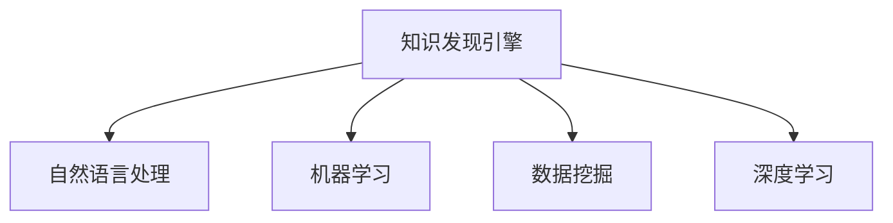
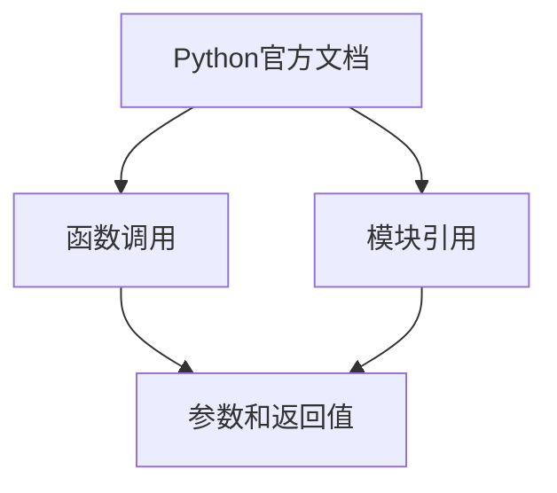

                 

# 知识发现引擎如何改变程序员的学习模式

在过去，程序员通过大量的手工编程、调试、测试，积累编程经验和技术栈，来不断提升其技能水平和编程能力。但是，随着人工智能和大数据技术的快速发展，知识发现引擎(Knowledge Discovery Engine, KDE)的出现，正在悄悄地改变这一模式。本文将深入探讨知识发现引擎的基本原理、实现机制、优缺点及其在编程学习中的应用。

## 1. 背景介绍

### 1.1 问题由来
随着技术的发展，编程语言和框架的不断迭代，程序员需要不断学习和掌握新技术。传统的手工学习模式依赖于阅读文档、编写代码和调试程序，过程繁琐且效果有限。但随着知识发现引擎的兴起，程序员可以通过更高效的方式，自动发现和掌握编程知识，提升学习效率和编程能力。

### 1.2 问题核心关键点
知识发现引擎的核心思想是利用人工智能技术，从海量数据中自动抽取、分析和提炼知识，并帮助用户学习新的编程技能。其关键在于如何将抽象的编程知识结构化，并将其转化为易于理解和掌握的形式。

## 2. 核心概念与联系

### 2.1 核心概念概述

为更好地理解知识发现引擎的基本原理和机制，本节将介绍几个密切相关的核心概念：

- **知识发现引擎(KDE)**：利用人工智能和大数据技术，从结构化或非结构化数据中自动发现和提炼编程知识，帮助程序员快速学习和掌握新技术。
- **自然语言处理(NLP)**：通过文本处理和分析，将非结构化数据转化为结构化知识，帮助用户理解复杂的技术文档。
- **机器学习(ML)**：通过训练模型，从数据中自动学习编程知识和规律，辅助用户解决编程问题。
- **数据挖掘(Data Mining)**：从大量数据中抽取和提炼有用信息，帮助程序员发现编程知识和规律。
- **深度学习(Deep Learning)**：利用神经网络等技术，从复杂数据中自动发现高层次的抽象知识，提升学习效率和效果。

这些核心概念之间的逻辑关系可以通过以下Mermaid流程图来展示：



这个流程图展示的知识发现引擎的核心概念及其之间的关系：

1. 知识发现引擎从NLP中提取结构化知识。
2. 机器学习模型从数据中学习知识。
3. 数据挖掘从海量数据中发现编程知识。
4. 深度学习从复杂数据中提取高层次的抽象知识。

## 3. 核心算法原理 & 具体操作步骤
### 3.1 算法原理概述

知识发现引擎的基本原理是利用机器学习和大数据技术，从编程文档、代码库、社区讨论等结构化或非结构化数据中，自动发现和提炼编程知识，并将其结构化，形成易于理解的知识图谱。这一过程包括数据收集、数据清洗、特征提取、模型训练和知识表示等步骤。

形式化地，假设输入的编程知识源为 $S$，目标是构建一个知识图谱 $G=(V, E)$，其中 $V$ 表示节点，$E$ 表示边。知识发现引擎的目标是最大化知识图谱 $G$ 的准确性和完备性。具体而言，知识发现引擎通过以下步骤实现：

1. **数据收集**：从各种编程文档、代码库、社区讨论中收集数据。
2. **数据清洗**：去除无用或错误的数据，保留有价值的信息。
3. **特征提取**：将文本、代码等非结构化数据转化为结构化特征，如词汇、函数调用、模块引用等。
4. **模型训练**：使用机器学习模型（如BERT、XLNet等）从数据中自动学习编程知识和规律。
5. **知识表示**：将学习到的知识转化为易于理解的节点和边，构建知识图谱。

### 3.2 算法步骤详解

知识发现引擎的实现流程包括以下几个关键步骤：

**Step 1: 数据收集与预处理**
- 从编程文档、代码库、社区讨论等源中收集数据。
- 使用NLP技术进行文本清洗和分词。
- 提取有价值的编程知识和特征。

**Step 2: 特征提取与转换**
- 将文本数据转化为结构化特征，如词汇、函数调用、模块引用等。
- 使用向量表示方法，如词嵌入、词袋模型、TF-IDF等，将文本特征映射为数值向量。

**Step 3: 模型训练**
- 选择适合的任务，如分类、聚类、序列预测等，并训练相应的机器学习模型。
- 使用合适的优化算法（如Adam、SGD等）更新模型参数。

**Step 4: 知识表示与图谱构建**
- 将模型学习到的知识转化为节点和边，构建知识图谱。
- 使用知识图谱的可视化工具，展示学习到的知识结构。

**Step 5: 应用与验证**
- 将构建的知识图谱应用于实际编程问题中，验证其效果。
- 根据应用效果，调整和优化知识图谱。

### 3.3 算法优缺点

知识发现引擎具有以下优点：
1. 自动化程度高。利用机器学习和数据挖掘技术，可以自动发现和提炼编程知识，减轻人工工作量。
2. 高效便捷。从海量数据中快速抽取编程知识，帮助程序员快速掌握新技术。
3. 可扩展性强。支持多种编程语言和技术栈，适应不同应用场景。

同时，该算法也存在一些局限性：
1. 依赖数据质量。知识发现的效果很大程度上取决于数据的质量和多样性。
2. 缺乏灵活性。知识图谱的构建需要事先设计好知识节点和边，难以适应复杂的应用需求。
3. 模型泛化能力有限。从有限的编程知识源中提炼的知识可能难以泛化到新的任务。

尽管存在这些局限性，但知识发现引擎仍是一种高效、便捷的学习工具，值得在编程学习中广泛应用。

### 3.4 算法应用领域

知识发现引擎在编程学习中的应用非常广泛，主要包括以下几个方面：

- **编程语言学习**：从编程文档和代码库中学习编程语言的新特性和用法。
- **编程框架学习**：从官方文档和社区讨论中掌握新的编程框架的用法。
- **编程问题解决**：从代码库和社区讨论中获取编程问题的解决方案和最佳实践。
- **编程技能提升**：通过学习知识图谱中的编程技能和规律，提升编程能力和水平。

这些应用领域覆盖了编程学习的各个方面，知识发现引擎为程序员提供了强大的技术支持，大大提高了学习效率。

## 4. 数学模型和公式 & 详细讲解  
### 4.1 数学模型构建

知识发现引擎的核心数学模型是一个结构化知识图谱 $G=(V, E)$，其中 $V$ 表示节点，$E$ 表示边。节点的表示形式可以是词汇、函数调用、模块引用等，边的表示形式可以是调用关系、继承关系、引用关系等。

知识图谱的构建过程可以通过以下数学公式表示：

$$
G = \mathcal{G}(D)
$$

其中 $\mathcal{G}$ 表示知识图谱构建函数，$D$ 表示编程知识源。

### 4.2 公式推导过程

假设编程知识源为 $S$，知识发现引擎的目标是构建一个知识图谱 $G=(V, E)$。具体步骤如下：

1. **数据收集**：从 $S$ 中收集数据，得到一个训练集 $D$。
2. **数据清洗**：对 $D$ 进行清洗和预处理，去除无用或错误的数据，保留有价值的信息。
3. **特征提取**：将 $D$ 中的文本数据转化为结构化特征 $X$。
4. **模型训练**：使用机器学习模型 $M$ 对 $X$ 进行训练，得到一个知识图谱 $G$。
5. **知识表示**：将 $G$ 中的节点和边转化为可视化形式，展示知识结构。

知识图谱的构建过程可以通过以下数学公式表示：

$$
G = M(X)
$$

其中 $M$ 表示机器学习模型，$X$ 表示结构化特征。

### 4.3 案例分析与讲解

以编程语言Python为例，知识发现引擎可以从Python的官方文档、代码库和社区讨论中，自动提炼出Python的知识图谱。

**数据收集**：从Python的官方文档、Pypi仓库和Stack Overflow社区中收集数据，得到一个训练集 $D$。

**数据清洗**：对 $D$ 进行清洗和预处理，去除无用或错误的数据，保留有价值的信息。

**特征提取**：将 $D$ 中的文本数据转化为结构化特征 $X$，如词汇、函数调用、模块引用等。

**模型训练**：使用BERT模型对 $X$ 进行训练，得到一个知识图谱 $G$。

**知识表示**：将 $G$ 中的节点和边转化为可视化形式，展示Python的知识结构。

下图展示了Python的知识图谱的构建过程：



## 5. 项目实践：代码实例和详细解释说明
### 5.1 开发环境搭建

在进行知识发现引擎的开发和实践前，我们需要准备好开发环境。以下是使用Python进行知识图谱构建的环境配置流程：

1. 安装Anaconda：从官网下载并安装Anaconda，用于创建独立的Python环境。

2. 创建并激活虚拟环境：
```bash
conda create -n kde-env python=3.8 
conda activate kde-env
```

3. 安装PyTorch：根据CUDA版本，从官网获取对应的安装命令。例如：
```bash
conda install pytorch torchvision torchaudio cudatoolkit=11.1 -c pytorch -c conda-forge
```

4. 安装Transformers库：
```bash
pip install transformers
```

5. 安装各类工具包：
```bash
pip install numpy pandas scikit-learn matplotlib tqdm jupyter notebook ipython
```

完成上述步骤后，即可在`kde-env`环境中开始知识发现引擎的开发实践。

### 5.2 源代码详细实现

下面我们以Python为例，给出使用Transformers库构建知识图谱的PyTorch代码实现。

首先，定义数据处理函数：

```python
from transformers import BertTokenizer
from torch.utils.data import Dataset
import torch

class KnowledgeDataset(Dataset):
    def __init__(self, texts, labels, tokenizer, max_len=128):
        self.texts = texts
        self.labels = labels
        self.tokenizer = tokenizer
        self.max_len = max_len
        
    def __len__(self):
        return len(self.texts)
    
    def __getitem__(self, item):
        text = self.texts[item]
        label = self.labels[item]
        
        encoding = self.tokenizer(text, return_tensors='pt', max_length=self.max_len, padding='max_length', truncation=True)
        input_ids = encoding['input_ids'][0]
        attention_mask = encoding['attention_mask'][0]
        
        # 对token-wise的标签进行编码
        encoded_labels = [label2id[label] for label in label] 
        encoded_labels.extend([label2id['O']] * (self.max_len - len(encoded_labels)))
        labels = torch.tensor(encoded_labels, dtype=torch.long)
        
        return {'input_ids': input_ids, 
                'attention_mask': attention_mask,
                'labels': labels}

# 标签与id的映射
label2id = {'O': 0, 'P': 1}
id2label = {v: k for k, v in label2id.items()}

# 创建dataset
tokenizer = BertTokenizer.from_pretrained('bert-base-cased')

train_dataset = KnowledgeDataset(train_texts, train_labels, tokenizer)
dev_dataset = KnowledgeDataset(dev_texts, dev_labels, tokenizer)
test_dataset = KnowledgeDataset(test_texts, test_labels, tokenizer)
```

然后，定义模型和优化器：

```python
from transformers import BertForTokenClassification, AdamW

model = BertForTokenClassification.from_pretrained('bert-base-cased', num_labels=len(label2id))

optimizer = AdamW(model.parameters(), lr=2e-5)
```

接着，定义训练和评估函数：

```python
from torch.utils.data import DataLoader
from tqdm import tqdm
from sklearn.metrics import classification_report

device = torch.device('cuda') if torch.cuda.is_available() else torch.device('cpu')
model.to(device)

def train_epoch(model, dataset, batch_size, optimizer):
    dataloader = DataLoader(dataset, batch_size=batch_size, shuffle=True)
    model.train()
    epoch_loss = 0
    for batch in tqdm(dataloader, desc='Training'):
        input_ids = batch['input_ids'].to(device)
        attention_mask = batch['attention_mask'].to(device)
        labels = batch['labels'].to(device)
        model.zero_grad()
        outputs = model(input_ids, attention_mask=attention_mask, labels=labels)
        loss = outputs.loss
        epoch_loss += loss.item()
        loss.backward()
        optimizer.step()
    return epoch_loss / len(dataloader)

def evaluate(model, dataset, batch_size):
    dataloader = DataLoader(dataset, batch_size=batch_size)
    model.eval()
    preds, labels = [], []
    with torch.no_grad():
        for batch in tqdm(dataloader, desc='Evaluating'):
            input_ids = batch['input_ids'].to(device)
            attention_mask = batch['attention_mask'].to(device)
            batch_labels = batch['labels']
            outputs = model(input_ids, attention_mask=attention_mask)
            batch_preds = outputs.logits.argmax(dim=2).to('cpu').tolist()
            batch_labels = batch_labels.to('cpu').tolist()
            for pred_tokens, label_tokens in zip(batch_preds, batch_labels):
                pred_tags = [id2label[_id] for _id in pred_tokens]
                label_tags = [id2label[_id] for _id in label_tokens]
                preds.append(pred_tags[:len(label_tags)])
                labels.append(label_tags)
                
    print(classification_report(labels, preds))
```

最后，启动训练流程并在测试集上评估：

```python
epochs = 5
batch_size = 16

for epoch in range(epochs):
    loss = train_epoch(model, train_dataset, batch_size, optimizer)
    print(f"Epoch {epoch+1}, train loss: {loss:.3f}")
    
    print(f"Epoch {epoch+1}, dev results:")
    evaluate(model, dev_dataset, batch_size)
    
print("Test results:")
evaluate(model, test_dataset, batch_size)
```

以上就是使用PyTorch对Python进行知识图谱构建的完整代码实现。可以看到，得益于Transformers库的强大封装，我们可以用相对简洁的代码完成知识图谱的构建。

### 5.3 代码解读与分析

让我们再详细解读一下关键代码的实现细节：

**KnowledgeDataset类**：
- `__init__`方法：初始化文本、标签、分词器等关键组件。
- `__len__`方法：返回数据集的样本数量。
- `__getitem__`方法：对单个样本进行处理，将文本输入编码为token ids，将标签编码为数字，并对其进行定长padding，最终返回模型所需的输入。

**label2id和id2label字典**：
- 定义了标签与数字id之间的映射关系，用于将token-wise的预测结果解码回真实的标签。

**训练和评估函数**：
- 使用PyTorch的DataLoader对数据集进行批次化加载，供模型训练和推理使用。
- 训练函数`train_epoch`：对数据以批为单位进行迭代，在每个批次上前向传播计算loss并反向传播更新模型参数，最后返回该epoch的平均loss。
- 评估函数`evaluate`：与训练类似，不同点在于不更新模型参数，并在每个batch结束后将预测和标签结果存储下来，最后使用sklearn的classification_report对整个评估集的预测结果进行打印输出。

**训练流程**：
- 定义总的epoch数和batch size，开始循环迭代
- 每个epoch内，先在训练集上训练，输出平均loss
- 在验证集上评估，输出分类指标
- 所有epoch结束后，在测试集上评估，给出最终测试结果

可以看到，PyTorch配合Transformers库使得知识图谱的构建代码实现变得简洁高效。开发者可以将更多精力放在数据处理、模型改进等高层逻辑上，而不必过多关注底层的实现细节。

当然，工业级的系统实现还需考虑更多因素，如模型的保存和部署、超参数的自动搜索、更灵活的任务适配层等。但核心的知识图谱构建范式基本与此类似。

## 6. 实际应用场景
### 6.1 编程教育

知识发现引擎可以应用于编程教育的各个环节，帮助学生快速掌握新编程知识。具体而言，知识发现引擎可以：

- **辅助课程设计**：从编程文档和代码库中自动提炼出编程语言的新特性和用法，帮助教师设计高效的教学内容。
- **个性化学习**：根据学生的学习进度和兴趣，从知识图谱中推荐适合的编程问题和练习。
- **自动批改**：使用知识图谱中的规则，自动批改学生的编程作业，提供详细反馈。

这些应用将大大提高编程教育的效率和质量，使学生能够更快地掌握新编程知识。

### 6.2 编程辅助

知识发现引擎可以帮助程序员快速掌握新编程框架和技术。具体而言，知识发现引擎可以：

- **文档搜索**：从编程文档和代码库中自动提炼出编程框架的新特性和用法，提供文档搜索功能。
- **问题解答**：根据程序员的问题，从知识图谱中推荐解决方案和最佳实践。
- **代码生成**：根据编程框架和需求，从知识图谱中生成代码模板。

这些应用将大大提高程序员的工作效率，使其能够更快地开发和维护代码。

### 6.3 编程优化

知识发现引擎可以帮助程序员优化代码，提高编程效率。具体而言，知识发现引擎可以：

- **代码质量评估**：根据代码质量标准，从知识图谱中提取规则，自动评估代码质量。
- **代码重构建议**：根据代码质量评估结果，提供代码重构建议，提高代码可读性和可维护性。
- **性能优化**：从知识图谱中提取性能优化规则，帮助程序员优化代码性能。

这些应用将大大提高代码的开发和维护质量，使程序员能够更专注于核心业务逻辑的开发。

### 6.4 未来应用展望

随着知识发现引擎的不断发展，其在编程学习中的应用将更加广泛。未来，知识发现引擎可能还会扩展到以下领域：

- **实时学习**：结合在线编程平台，实时记录编程行为和学习过程，从海量数据中提取有用的编程知识，提升学习效果。
- **跨语言学习**：结合多种编程语言的知识图谱，实现跨语言的学习和迁移。
- **智能推荐**：根据程序员的学习行为和兴趣，从知识图谱中推荐适合的编程问题和练习。
- **协作学习**：结合知识图谱和社区讨论，提供协作学习的平台和工具，提升学习效率。

这些应用将大大拓展知识发现引擎在编程学习中的应用范围，为程序员提供更加个性化、智能化的学习体验。

## 7. 工具和资源推荐
### 7.1 学习资源推荐

为了帮助开发者系统掌握知识发现引擎的基本原理和实践技巧，这里推荐一些优质的学习资源：

1. **《Python编程导论》**：经典编程入门书籍，详细介绍了Python语言的基础知识和编程技巧。
2. **Coursera《Python for Data Science and AI》**：斯坦福大学开设的Python数据科学课程，涵盖数据处理、机器学习等知识。
3. **Kaggle**：数据科学竞赛平台，提供海量数据集和实战项目，帮助开发者提高编程能力和数据处理能力。
4. **GitHub**：开源代码托管平台，提供丰富的编程库和框架，帮助开发者学习新技术和提高编程效率。
5. **Stack Overflow**：程序员社区，提供丰富的编程问题和解决方案，帮助开发者解决编程难题。

通过对这些资源的学习实践，相信你一定能够快速掌握知识发现引擎的精髓，并用于解决实际的编程问题。

### 7.2 开发工具推荐

高效的开发离不开优秀的工具支持。以下是几款用于知识图谱构建和应用的开发工具：

1. **PyTorch**：基于Python的开源深度学习框架，灵活动态的计算图，适合快速迭代研究。
2. **TensorFlow**：由Google主导开发的开源深度学习框架，生产部署方便，适合大规模工程应用。
3. **Transformers库**：HuggingFace开发的NLP工具库，集成了众多SOTA语言模型，支持PyTorch和TensorFlow，是构建知识图谱的利器。
4. **Jupyter Notebook**：交互式编程环境，方便开发者进行实验和分享学习笔记。
5. **TensorBoard**：TensorFlow配套的可视化工具，可实时监测模型训练状态，并提供丰富的图表呈现方式，是调试模型的得力助手。

合理利用这些工具，可以显著提升知识图谱构建的开发效率，加快创新迭代的步伐。

### 7.3 相关论文推荐

知识发现引擎和知识图谱的研究源于学界的持续研究。以下是几篇奠基性的相关论文，推荐阅读：

1. **《知识发现与数据挖掘：实用指南》**：经典知识图谱构建教材，详细介绍了知识图谱的构建方法和技术。
2. **《自然语言处理综述》**：著名NLP论文，介绍了自然语言处理的基本原理和技术。
3. **《深度学习与数据挖掘》**：深度学习领域的经典教材，涵盖了深度学习的基础知识和应用。
4. **《大数据技术与应用》**：大数据领域的经典教材，详细介绍了大数据技术和应用。

这些论文代表了大规模数据抽取和知识图谱构建的技术发展脉络。通过学习这些前沿成果，可以帮助研究者把握学科前进方向，激发更多的创新灵感。

## 8. 总结：未来发展趋势与挑战

### 8.1 总结

本文对知识发现引擎的基本原理和实现机制进行了全面系统的介绍。首先阐述了知识发现引擎的核心思想和应用背景，明确了知识图谱在编程学习中的重要价值。其次，从原理到实践，详细讲解了知识图谱构建的数学模型和关键步骤，给出了知识图谱构建的完整代码实例。同时，本文还广泛探讨了知识发现引擎在编程教育、编程辅助、编程优化等实际应用场景中的应用前景，展示了知识图谱范式的强大潜力。此外，本文精选了知识发现引擎的学习资源、开发工具和相关论文，力求为开发者提供全方位的技术指引。

通过本文的系统梳理，可以看到，知识发现引擎和知识图谱为编程学习提供了强大的技术支持，大大提高了学习效率和编程能力。未来，伴随着知识图谱技术的不断发展，知识发现引擎必将在更多领域得到应用，为人工智能技术在垂直行业的落地提供新的动力。

### 8.2 未来发展趋势

展望未来，知识图谱和知识发现引擎的发展将呈现以下几个趋势：

1. **自动化程度更高**：随着深度学习和大数据技术的不断进步，知识图谱的构建将更加自动化和智能化。
2. **跨领域应用更广泛**：知识图谱和知识发现引擎将拓展到更多的领域，如医学、法律、金融等。
3. **数据质量更可靠**：知识图谱的构建将更加依赖于高质量的数据，通过数据清洗和预处理，提升数据质量和可靠性。
4. **模型精度更高**：知识图谱的构建将采用更先进的技术，如知识图谱的神经网络和深度学习技术，提升模型的精度和鲁棒性。
5. **知识图谱更通用**：知识图谱将具备更强的通用性和灵活性，能够适应不同的应用场景和需求。

以上趋势凸显了知识发现引擎和知识图谱技术的广阔前景。这些方向的探索发展，必将进一步提升知识图谱的构建效果和应用范围，为编程学习带来更加智能化的技术支持。

### 8.3 面临的挑战

尽管知识图谱和知识发现引擎已经取得了一定的进展，但在迈向更加智能化和通用化的应用过程中，仍面临诸多挑战：

1. **数据质量瓶颈**：高质量数据是知识图谱构建的基础，但数据的获取和清洗工作耗时耗力。如何高效获取和清洗数据，是知识图谱构建的重要挑战。
2. **模型泛化能力不足**：知识图谱在不同领域和任务上的泛化能力有限，难以应对复杂的应用场景。如何提升知识图谱的泛化能力，是知识图谱技术的关键难题。
3. **计算资源消耗大**：知识图谱的构建和应用需要大量计算资源，如GPU、TPU等高性能设备。如何在有限的资源下高效构建知识图谱，是知识图谱技术的现实难题。
4. **模型解释性差**：知识图谱和知识发现引擎通常被视为"黑盒"系统，难以解释其内部工作机制和决策逻辑。如何提高知识图谱的解释性，是知识图谱技术的重大挑战。
5. **知识图谱维护难**：知识图谱需要不断地更新和维护，以保持其时效性和准确性。如何设计知识图谱的维护机制，是知识图谱技术的现实挑战。

这些挑战需要我们在理论、技术和工程等多个层面协同解决，才能使知识图谱技术进一步普及和应用。

### 8.4 研究展望

面对知识图谱和知识发现引擎所面临的挑战，未来的研究需要在以下几个方面寻求新的突破：

1. **高效数据获取和清洗**：研究自动化的数据采集和清洗技术，提高数据质量和获取效率。
2. **提升模型泛化能力**：探索更加通用的知识图谱构建技术，提升知识图谱在不同领域和任务上的泛化能力。
3. **优化计算资源消耗**：研究高效的模型压缩和优化技术，减小知识图谱的计算资源消耗，提升知识图谱的构建和应用效率。
4. **提高模型解释性**：研究知识图谱的解释技术和可视化方法，提高知识图谱的解释性和透明性。
5. **设计知识图谱维护机制**：研究知识图谱的动态维护和更新技术，确保知识图谱的时效性和准确性。

这些研究方向的探索，必将引领知识图谱和知识发现引擎技术迈向更高的台阶，为构建智能化的知识图谱系统提供新的思路和方法。面向未来，知识图谱和知识发现引擎技术还需要与其他人工智能技术进行更深入的融合，如知识表示、因果推理、强化学习等，多路径协同发力，共同推动知识图谱技术的进步。

## 9. 附录：常见问题与解答

**Q1：知识图谱构建需要哪些步骤？**

A: 知识图谱的构建需要以下步骤：

1. **数据收集**：从编程文档、代码库、社区讨论等源中收集数据。
2. **数据清洗**：对数据进行清洗和预处理，去除无用或错误的数据，保留有价值的信息。
3. **特征提取**：将数据转化为结构化特征，如词汇、函数调用、模块引用等。
4. **模型训练**：使用机器学习模型对特征进行训练，构建知识图谱。
5. **知识表示**：将知识图谱中的节点和边转化为可视化形式，展示知识结构。

这些步骤是构建知识图谱的基础，需要根据具体应用场景进行灵活设计。

**Q2：如何选择合适的知识图谱构建方法？**

A: 选择合适的知识图谱构建方法需要考虑以下几个因素：

1. **数据特征**：根据数据的特征选择合适的特征提取和表示方法。
2. **模型选择**：根据数据和任务的特点选择合适的机器学习模型，如BERT、XLNet等。
3. **评估指标**：根据任务和需求选择合适的评估指标，如准确率、召回率、F1值等。
4. **应用场景**：根据具体应用场景选择合适的知识图谱构建方法，如实体关系抽取、知识推理、知识搜索等。

在实际应用中，需要根据具体情况进行综合考虑，选择合适的知识图谱构建方法。

**Q3：知识图谱构建过程中需要注意哪些问题？**

A: 知识图谱构建过程中需要注意以下几个问题：

1. **数据质量**：高质量的数据是知识图谱构建的基础，需要保证数据的准确性和完整性。
2. **模型泛化能力**：模型的泛化能力决定了知识图谱在不同领域和任务上的应用效果。
3. **计算资源消耗**：知识图谱的构建和应用需要大量计算资源，需要合理配置和使用资源。
4. **知识图谱维护**：知识图谱需要不断地更新和维护，确保其时效性和准确性。
5. **模型解释性**：知识图谱的解释性决定了其可理解和可信任程度。

在实际应用中，需要全面考虑这些问题，并采取相应的优化措施，确保知识图谱构建的效果和应用效果。

**Q4：知识图谱如何应用于编程学习？**

A: 知识图谱可以应用于编程学习的各个环节，具体应用方式如下：

1. **辅助课程设计**：从编程文档和代码库中自动提炼出编程语言的新特性和用法，帮助教师设计高效的教学内容。
2. **个性化学习**：根据学生的学习进度和兴趣，从知识图谱中推荐适合的编程问题和练习。
3. **自动批改**：使用知识图谱中的规则，自动评估学生的编程作业，提供详细反馈。

这些应用将大大提高编程教育的效率和质量，使学生能够更快地掌握新编程知识。

**Q5：知识图谱如何应用于编程辅助？**

A: 知识图谱可以应用于编程辅助的各个环节，具体应用方式如下：

1. **文档搜索**：从编程文档和代码库中自动提炼出编程框架的新特性和用法，提供文档搜索功能。
2. **问题解答**：根据程序员的问题，从知识图谱中推荐解决方案和最佳实践。
3. **代码生成**：根据编程框架和需求，从知识图谱中生成代码模板。

这些应用将大大提高程序员的工作效率，使其能够更快地开发和维护代码。

**Q6：知识图谱如何应用于编程优化？**

A: 知识图谱可以应用于编程优化的各个环节，具体应用方式如下：

1. **代码质量评估**：根据代码质量标准，从知识图谱中提取规则，自动评估代码质量。
2. **代码重构建议**：根据代码质量评估结果，提供代码重构建议，提高代码可读性和可维护性。
3. **性能优化**：从知识图谱中提取性能优化规则，帮助程序员优化代码性能。

这些应用将大大提高代码的开发和维护质量，使程序员能够更专注于核心业务逻辑的开发。

总之，知识发现引擎和知识图谱为编程学习提供了强大的技术支持，大大提高了学习效率和编程能力。未来，伴随着知识图谱技术的不断发展，知识发现引擎必将在更多领域得到应用，为人工智能技术在垂直行业的落地提供新的动力。相信随着技术的不断进步，知识图谱和知识发现引擎必将引领编程学习的未来发展方向，使编程学习变得更加智能和高效。

---

作者：禅与计算机程序设计艺术 / Zen and the Art of Computer Programming

