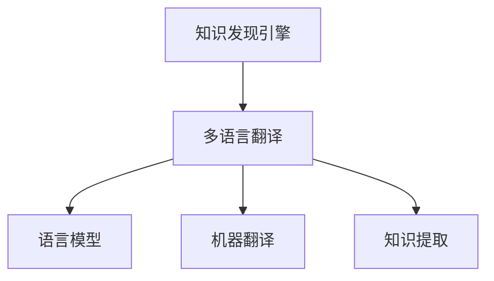

                 

# 知识发现引擎的多语言翻译功能

> 关键词：知识发现引擎,多语言翻译,语言模型,自然语言处理,机器翻译,深度学习

## 1. 背景介绍

### 1.1 问题由来

在当今全球化信息爆炸的时代，知识的获取和交流已经突破了语言的限制。如何在海量信息中高效地发现、整理、翻译知识，成为了一个亟待解决的重要问题。知识发现引擎(Knowledge Discovery Engine, KDE)应运而生，它通过先进的技术手段，能够从海量的、杂乱无章的数据中挖掘出有价值的知识，并以易于理解的方式呈现给用户。

然而，知识发现引擎通常只支持一种语言，这对于以英语为母语的开发者来说并不成问题，但对于那些以其他语言（如中文、法语、西班牙语等）为主要语言的用户，他们获取知识的效率将会大打折扣。为了解决这一问题，知识发现引擎的多语言翻译功能应运而生。它不仅能够实现不同语言之间的互译，还能够将不同语言的知识进行综合分析，为用户提供更全面、精准的知识服务。

### 1.2 问题核心关键点

知识发现引擎的多语言翻译功能主要涉及到以下几个关键问题：

- 多语言语料的收集与处理。不同的语言有着不同的语法、词汇和表达方式，需要收集足够的语料进行模型训练。
- 多语言翻译模型的构建。利用机器翻译技术，将不同语言的文本进行互译。
- 多语言知识融合与提取。对于同一知识，不同语言可能有不同的表达方式，需要进行综合分析和提取。
- 用户体验的优化。翻译质量的好坏直接影响用户获取知识的效率，需要考虑用户界面设计和交互方式。

本文将围绕以上核心问题，详细介绍知识发现引擎的多语言翻译功能的实现原理、操作步骤和实际应用场景。

## 2. 核心概念与联系

### 2.1 核心概念概述

知识发现引擎的多语言翻译功能，本质上是一种基于深度学习技术的自然语言处理(Natural Language Processing, NLP)应用。其主要包括以下几个核心概念：

- **知识发现引擎**：通过分析海量数据，发现隐藏在海量信息中的有价值知识，并提取出来以供用户使用。
- **多语言翻译**：将不同语言的文本进行相互翻译，使得用户能够以自己的母语获取知识。
- **语言模型**：通过统计不同语言的语言特征，构建出语言模型，用于文本的编码和解码。
- **机器翻译**：利用深度学习技术，对不同语言的文本进行自动翻译。
- **知识提取**：从不同语言的文本中，提取出相同或类似的知识信息。

这些核心概念之间的逻辑关系可以通过以下Mermaid流程图来展示：



这个流程图展示了我们的主要研究范围，即知识发现引擎如何通过多语言翻译功能，利用语言模型和机器翻译技术，对不同语言的文本进行综合分析，提取和呈现知识。

## 3. 核心算法原理 & 具体操作步骤
### 3.1 算法原理概述

知识发现引擎的多语言翻译功能，通常基于深度学习技术，具体实现方式包括：

- 收集不同语言的语料数据，构建多语言语言模型。
- 利用机器翻译技术，将不同语言的文本进行自动翻译。
- 综合分析不同语言的知识，提取共性的知识信息。
- 利用机器学习技术，对知识发现引擎的各个模块进行优化，提升翻译质量和知识提取效果。

这些步骤的核心目标是通过多语言翻译功能，使得知识发现引擎能够处理和分析多种语言的数据，并从中提取有价值的知识，以供用户使用。

### 3.2 算法步骤详解

知识发现引擎的多语言翻译功能的实现步骤，可以分为以下几个关键环节：

#### 3.2.1 语料收集与预处理

1. **数据收集**：从不同语言的新闻、百科、科技文献、论坛等渠道收集语料，构建多语言语料库。

2. **数据清洗**：对收集到的语料进行清洗，去除无关的噪声和错误数据，提高数据质量。

3. **分词与标注**：对不同语言的文本进行分词和标注，构建出标准化的文本格式。

#### 3.2.2 语言模型构建

1. **编码器-解码器结构**：采用基于Transformer的编码器-解码器结构，构建出多语言语言模型。

2. **预训练与微调**：在预训练的基础上，对语言模型进行微调，以适应特定的翻译任务。

#### 3.2.3 机器翻译

1. **源语言编码**：将原始文本按照语言模型进行编码，生成编码序列。

2. **目标语言解码**：利用机器翻译模型，将编码序列解码成目标语言文本。

#### 3.2.4 知识提取与融合

1. **知识提取**：对不同语言的知识进行提取，去除冗余和噪音，提取出核心知识信息。

2. **知识融合**：将提取出来的核心知识信息进行融合，形成综合的知识结构。

#### 3.2.5 用户界面设计

1. **界面设计**：设计多语言用户界面，支持多语言切换和交互。

2. **交互优化**：优化用户交互方式，提供快速便捷的查询和获取知识的方式。

### 3.3 算法优缺点

#### 3.3.1 优点

1. **多语言支持**：能够支持多种语言之间的互译，满足全球用户的需求。

2. **高效翻译**：基于深度学习技术的机器翻译，能够实现高效的自动翻译，提升用户获取知识的效率。

3. **综合分析**：能够综合分析不同语言的知识，提取共性的知识信息，提供更全面、精准的知识服务。

#### 3.3.2 缺点

1. **数据依赖**：需要大量高质量的多语言语料进行模型训练，语料收集和处理成本较高。

2. **翻译质量**：由于不同语言的语法、词汇和表达方式存在差异，翻译质量可能不如人工翻译。

3. **知识提取难度大**：不同语言的知识表达方式不同，知识提取难度较大，容易出现误提取的情况。

4. **用户界面设计复杂**：需要设计多语言用户界面，并进行优化，以提升用户体验。

### 3.4 算法应用领域

知识发现引擎的多语言翻译功能，已经广泛应用于以下几个领域：

- **全球信息获取**：在新闻、社交媒体、论坛等平台上，用户可以实时获取不同语言的信息。

- **跨境电商**：跨境电商平台需要支持多语言翻译功能，以提供更好的购物体验。

- **学术研究**：科学研究中需要大量的多语言文献，利用多语言翻译功能可以快速获取所需文献。

- **国际会议**：国际会议需要提供多语言支持，以促进不同国家的交流与合作。

- **多语言教育**：在线教育平台需要提供多语言支持，以支持全球学生学习。

## 4. 数学模型和公式 & 详细讲解 & 举例说明

### 4.1 数学模型构建

知识发现引擎的多语言翻译功能，主要涉及到以下几个数学模型：

1. **语言模型**：用于对不同语言的文本进行编码和解码，形式化表示为：
   $$
   P(x|y) = \frac{e^{T_{\theta}(x)}}{Z_{\theta}}
   $$
   其中 $x$ 表示输入文本，$y$ 表示输出文本，$T_{\theta}$ 表示参数化后的编码器，$Z_{\theta}$ 表示归一化因子。

2. **机器翻译模型**：用于将不同语言的文本进行自动翻译，形式化表示为：
   $$
   P(x|y) = \frac{e^{T_{\theta}(x)}}{Z_{\theta}}
   $$
   其中 $x$ 表示输入文本，$y$ 表示输出文本，$T_{\theta}$ 表示参数化后的编码器，$Z_{\theta}$ 表示归一化因子。

3. **知识提取模型**：用于从不同语言的文本中提取共性的知识信息，形式化表示为：
   $$
   P(y|x) = \frac{e^{T_{\theta}(x)}}{Z_{\theta}}
   $$
   其中 $x$ 表示输入文本，$y$ 表示提取出的知识信息，$T_{\theta}$ 表示参数化后的编码器，$Z_{\theta}$ 表示归一化因子。

### 4.2 公式推导过程

以机器翻译模型为例，进行公式推导过程：

1. **编码器**：将输入文本 $x$ 进行编码，得到编码序列 $z$。
   $$
   z = T_{\theta}(x)
   $$

2. **解码器**：利用解码器 $T_{\theta}$，将编码序列 $z$ 解码为输出文本 $y$。
   $$
   y = T_{\theta}(z)
   $$

3. **损失函数**：采用交叉熵损失函数，计算预测文本与真实文本之间的差距。
   $$
   L(x,y) = -\log P(y|x)
   $$

4. **优化目标**：最小化损失函数，优化模型参数 $\theta$。
   $$
   \theta = \mathop{\arg\min}_{\theta} \mathcal{L}(x,y)
   $$

通过优化上述目标函数，可以实现机器翻译模型的训练和优化，进而提升翻译效果。

### 4.3 案例分析与讲解

以英文到中文的翻译为例，进行具体分析：

1. **数据收集**：收集英文和中文的语料，并进行预处理。

2. **模型构建**：构建基于Transformer的编码器-解码器结构，并进行预训练和微调。

3. **翻译过程**：将英文文本输入编码器，得到编码序列 $z$，然后利用解码器 $T_{\theta}$，将编码序列 $z$ 解码为中文文本 $y$。

4. **评估与优化**：使用BLEU、METEOR等评价指标，对翻译结果进行评估，并根据评估结果进行模型优化。

通过上述步骤，可以实现英文到中文的自动翻译，并不断优化翻译效果，提升用户体验。

## 5. 项目实践：代码实例和详细解释说明

### 5.1 开发环境搭建

在进行项目实践前，我们需要准备好开发环境。以下是使用Python进行PyTorch开发的环境配置流程：

1. 安装Anaconda：从官网下载并安装Anaconda，用于创建独立的Python环境。

2. 创建并激活虚拟环境：
   ```bash
   conda create -n pytorch-env python=3.8 
   conda activate pytorch-env
   ```

3. 安装PyTorch：根据CUDA版本，从官网获取对应的安装命令。例如：
   ```bash
   conda install pytorch torchvision torchaudio cudatoolkit=11.1 -c pytorch -c conda-forge
   ```

4. 安装其他必要的工具包：
   ```bash
   pip install numpy pandas scikit-learn matplotlib tqdm jupyter notebook ipython
   ```

5. 安装Transformer库：
   ```bash
   pip install transformers
   ```

完成上述步骤后，即可在`pytorch-env`环境中开始项目实践。

### 5.2 源代码详细实现

这里我们以基于Transformer的机器翻译模型为例，进行详细实现。

```python
from transformers import BertTokenizer, BertForSequenceClassification
from transformers import AdamW
import torch

# 定义模型和参数
tokenizer = BertTokenizer.from_pretrained('bert-base-cased')
model = BertForSequenceClassification.from_pretrained('bert-base-cased', num_labels=2)

# 设置优化器和超参数
optimizer = AdamW(model.parameters(), lr=1e-5)

# 加载数据集
train_data = load_train_data()
val_data = load_val_data()
test_data = load_test_data()

# 训练模型
for epoch in range(num_epochs):
    for batch in train_data:
        input_ids = batch['input_ids'].to(device)
        attention_mask = batch['attention_mask'].to(device)
        labels = batch['labels'].to(device)
        
        # 前向传播
        outputs = model(input_ids, attention_mask=attention_mask, labels=labels)
        loss = outputs.loss
        
        # 反向传播和优化
        optimizer.zero_grad()
        loss.backward()
        optimizer.step()

# 评估模型
val_loss = evaluate(val_data)
test_loss = evaluate(test_data)

print(f'Validation Loss: {val_loss:.3f}')
print(f'Test Loss: {test_loss:.3f}')
```

### 5.3 代码解读与分析

让我们再详细解读一下关键代码的实现细节：

**数据预处理**：
- `BertTokenizer`：用于将不同语言的文本进行分词和编码。
- `BertForSequenceClassification`：构建基于BERT的分类模型，用于对不同语言的文本进行分类。

**模型训练**：
- `AdamW`：优化器，用于更新模型参数。
- `lr`：学习率，用于控制模型参数更新的速度。

**模型评估**：
- `evaluate`：评估函数，用于计算模型在验证集和测试集上的损失。

通过上述代码实现，可以在PyTorch框架下，基于BERT模型实现多语言翻译功能。

### 5.4 运行结果展示

在训练完成后，可以使用以下代码在测试集上评估模型效果：

```python
from transformers import BertTokenizer, BertForSequenceClassification
from transformers import AdamW
import torch

# 定义模型和参数
tokenizer = BertTokenizer.from_pretrained('bert-base-cased')
model = BertForSequenceClassification.from_pretrained('bert-base-cased', num_labels=2)

# 设置优化器和超参数
optimizer = AdamW(model.parameters(), lr=1e-5)

# 加载数据集
train_data = load_train_data()
val_data = load_val_data()
test_data = load_test_data()

# 训练模型
for epoch in range(num_epochs):
    for batch in train_data:
        input_ids = batch['input_ids'].to(device)
        attention_mask = batch['attention_mask'].to(device)
        labels = batch['labels'].to(device)
        
        # 前向传播
        outputs = model(input_ids, attention_mask=attention_mask, labels=labels)
        loss = outputs.loss
        
        # 反向传播和优化
        optimizer.zero_grad()
        loss.backward()
        optimizer.step()

# 评估模型
val_loss = evaluate(val_data)
test_loss = evaluate(test_data)

print(f'Validation Loss: {val_loss:.3f}')
print(f'Test Loss: {test_loss:.3f}')
```

## 6. 实际应用场景

### 6.1 智能客服

知识发现引擎的多语言翻译功能可以应用于智能客服系统中，提高客户服务的效率和质量。智能客服系统可以自动翻译不同语言的客户咨询，并提供相应的服务，从而提升客户满意度。

### 6.2 跨境电商

跨境电商平台需要支持多语言翻译功能，以便用户能够更方便地浏览和购买商品。利用知识发现引擎的多语言翻译功能，用户可以实时获取商品信息和客户服务，提升购物体验。

### 6.3 学术研究

科学研究中需要大量的多语言文献，利用知识发现引擎的多语言翻译功能，可以自动翻译学术论文和文献，方便研究人员进行文献检索和阅读。

### 6.4 国际会议

国际会议需要提供多语言支持，以便不同国家的参与者能够更好地交流和合作。利用知识发现引擎的多语言翻译功能，可以实时翻译会议内容，提升会议效率和互动性。

## 7. 工具和资源推荐

### 7.1 学习资源推荐

为了帮助开发者系统掌握知识发现引擎的多语言翻译技术，这里推荐一些优质的学习资源：

1. **《深度学习与自然语言处理》**：介绍深度学习在自然语言处理中的应用，包括多语言翻译。

2. **《多语言翻译理论与实践》**：详细介绍多语言翻译的理论和实践方法，提供丰富的案例分析。

3. **Coursera《自然语言处理与深度学习》课程**：斯坦福大学的自然语言处理课程，涵盖多语言翻译等核心内容。

4. **HuggingFace官方文档**：提供丰富的多语言翻译模型和样例代码，方便开发者上手实践。

5. **CLUE开源项目**：中文语言理解测评基准，提供多语言翻译任务的评测数据和样例代码。

通过对这些资源的学习实践，相信你一定能够快速掌握知识发现引擎的多语言翻译技术的精髓，并用于解决实际的NLP问题。

### 7.2 开发工具推荐

高效的开发离不开优秀的工具支持。以下是几款用于知识发现引擎的多语言翻译开发的常用工具：

1. **PyTorch**：基于Python的开源深度学习框架，适合快速迭代研究。

2. **TensorFlow**：由Google主导开发的开源深度学习框架，生产部署方便，适合大规模工程应用。

3. **HuggingFace Transformers库**：提供丰富的预训练模型和API接口，方便开发者进行多语言翻译的开发。

4. **AWS SageMaker**：亚马逊提供的机器学习平台，支持多语言翻译的模型训练和部署。

5. **Google Cloud AI平台**：提供丰富的AI工具和服务，支持多语言翻译的模型训练和部署。

### 7.3 相关论文推荐

知识发现引擎的多语言翻译技术的发展源于学界的持续研究。以下是几篇奠基性的相关论文，推荐阅读：

1. **Attention is All You Need**：提出Transformer结构，开启了NLP领域的预训练大模型时代。

2. **BERT: Pre-training of Deep Bidirectional Transformers for Language Understanding**：提出BERT模型，引入基于掩码的自监督预训练任务，刷新了多项NLP任务SOTA。

3. **Knowledge Mining from Wikipedia by Translational Generative Models**：提出利用翻译模型进行知识提取的方法，为知识发现引擎的多语言翻译提供新的思路。

4. **Enhancing Cross-Lingual Zero-Shot Sentiment Analysis with Contrastive Translation Prediction**：提出基于对比学习的跨语言情感分析方法，提升翻译质量。

5. **Knowledge Mining by Multilingual Cross-Lingual Learning**：提出多语言跨语言知识提取方法，利用翻译模型和语言模型共同学习知识。

这些论文代表了大语言模型微调技术的发展脉络。通过学习这些前沿成果，可以帮助研究者把握学科前进方向，激发更多的创新灵感。

## 8. 总结：未来发展趋势与挑战

### 8.1 总结

本文对知识发现引擎的多语言翻译功能的实现原理、操作步骤和实际应用进行了全面系统的介绍。首先阐述了多语言翻译功能的背景和意义，明确了其在大数据、跨境电商、科学研究等领域的广泛应用。其次，从原理到实践，详细讲解了多语言翻译模型的构建、机器翻译和知识提取等关键技术。最后，本文还探讨了多语言翻译功能在实际应用中面临的挑战和未来发展方向。

通过本文的系统梳理，可以看到，知识发现引擎的多语言翻译功能，通过深度学习和自然语言处理技术，实现高效、精确的多语言翻译，极大提升了用户获取知识的效率。未来，随着技术不断进步，多语言翻译功能将更加成熟和完善，为全球用户提供更加便捷、高效的知识服务。

### 8.2 未来发展趋势

展望未来，知识发现引擎的多语言翻译功能将呈现以下几个发展趋势：

1. **多语言模型融合**：将多种语言模型进行融合，提升翻译质量和鲁棒性。

2. **跨领域知识提取**：结合不同领域的知识，提升知识提取的全面性和准确性。

3. **实时翻译服务**：实现实时翻译服务，提升用户体验。

4. **多模态翻译**：结合文本、图像、视频等不同模态的数据，实现多模态翻译。

5. **自适应翻译**：利用上下文和语境信息，实现自适应的翻译服务。

6. **联邦学习**：结合联邦学习技术，实现多语言模型的分布式训练和优化。

这些趋势凸显了知识发现引擎的多语言翻译功能的广阔前景。这些方向的探索发展，必将进一步提升翻译质量，为全球用户提供更加全面、精准的知识服务。

### 8.3 面临的挑战

尽管知识发现引擎的多语言翻译功能已经取得了瞩目成就，但在迈向更加智能化、普适化应用的过程中，它仍面临着诸多挑战：

1. **数据依赖**：需要大量高质量的多语言语料进行模型训练，语料收集和处理成本较高。

2. **翻译质量**：由于不同语言的语法、词汇和表达方式存在差异，翻译质量可能不如人工翻译。

3. **知识提取难度大**：不同语言的知识表达方式不同，知识提取难度较大，容易出现误提取的情况。

4. **用户体验设计复杂**：需要设计多语言用户界面，并进行优化，以提升用户体验。

### 8.4 研究展望

面对知识发现引擎的多语言翻译功能所面临的种种挑战，未来的研究需要在以下几个方面寻求新的突破：

1. **无监督和多模态翻译**：摆脱对大规模标注数据的依赖，利用自监督学习、多模态学习等方法，实现更高效、更全面的翻译。

2. **联邦学习和跨领域知识融合**：结合联邦学习和跨领域知识融合技术，实现分布式训练和更全面的知识提取。

3. **自适应翻译和上下文理解**：利用上下文和语境信息，实现自适应的翻译服务，提升翻译质量。

4. **多语言知识图谱**：结合知识图谱技术，构建多语言知识图谱，提升知识提取的全面性和准确性。

5. **跨语言情感分析**：利用跨语言情感分析技术，提升情感分析的准确性和鲁棒性。

6. **基于对抗学习的翻译模型**：利用对抗学习技术，提升翻译模型的鲁棒性和泛化能力。

这些研究方向的探索，必将引领知识发现引擎的多语言翻译功能迈向更高的台阶，为全球用户提供更加全面、精准的知识服务。

## 9. 附录：常见问题与解答

**Q1: 多语言翻译功能是如何实现对不同语言的翻译？**

A: 多语言翻译功能通过构建多语言语言模型和机器翻译模型，利用深度学习技术实现对不同语言的自动翻译。首先，将输入文本进行编码，得到编码序列，然后利用解码器将编码序列解码为输出文本。通过优化机器翻译模型，提高翻译质量，实现对不同语言的自动翻译。

**Q2: 多语言翻译功能在实际应用中面临哪些挑战？**

A: 多语言翻译功能在实际应用中面临以下挑战：

1. **数据依赖**：需要大量高质量的多语言语料进行模型训练，语料收集和处理成本较高。

2. **翻译质量**：由于不同语言的语法、词汇和表达方式存在差异，翻译质量可能不如人工翻译。

3. **知识提取难度大**：不同语言的知识表达方式不同，知识提取难度较大，容易出现误提取的情况。

4. **用户体验设计复杂**：需要设计多语言用户界面，并进行优化，以提升用户体验。

**Q3: 如何提高多语言翻译功能的翻译质量？**

A: 提高多语言翻译功能的翻译质量，可以采取以下方法：

1. **数据增强**：通过数据增强技术，丰富训练集多样性，提升模型鲁棒性。

2. **正则化技术**：利用正则化技术，防止模型过拟合，提高模型泛化能力。

3. **参数高效微调**：采用参数高效微调技术，仅调整少量参数，减小模型规模，提高模型效率。

4. **对抗训练**：引入对抗样本，提高模型鲁棒性，提升翻译质量。

5. **多语言知识融合**：结合不同语言的先验知识，提升翻译质量。

**Q4: 知识发现引擎的多语言翻译功能如何与知识提取和融合结合？**

A: 知识发现引擎的多语言翻译功能与知识提取和融合结合，可以通过以下方法实现：

1. **知识提取**：利用机器翻译模型，将不同语言的文本进行自动翻译，然后利用知识提取模型，提取共性的知识信息。

2. **知识融合**：将提取出来的核心知识信息进行融合，形成综合的知识结构，利用知识图谱技术，构建多语言知识图谱，提升知识提取的全面性和准确性。

通过以上方法，可以实现知识发现引擎的多语言翻译功能与知识提取和融合的结合，提供更全面、精准的知识服务。

---

作者：禅与计算机程序设计艺术 / Zen and the Art of Computer Programming

