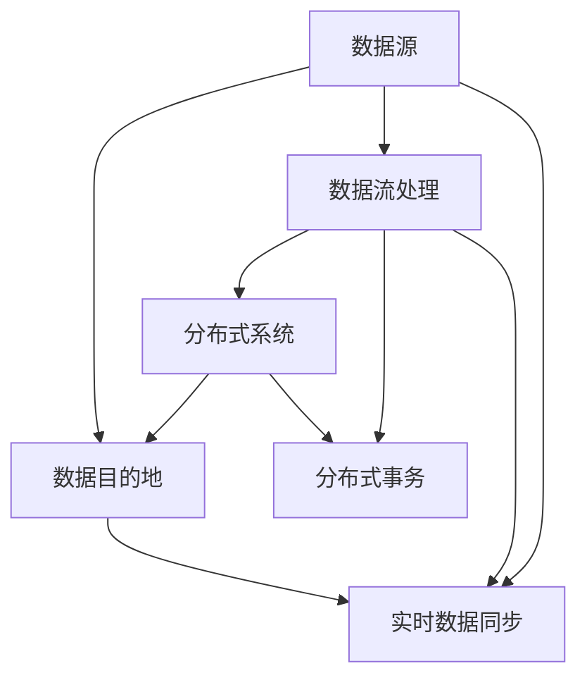

                 

# 知识发现引擎的实时数据同步技术

## 1. 背景介绍

在当今数据驱动的时代，知识发现引擎（Knowledge Discovery Engine, KDE）以其强大的数据分析和知识挖掘能力，成为了企业信息化建设的重要工具。然而，知识发现引擎的数据同步技术，是其性能和可靠性的重要保障。传统的批处理数据同步方法无法满足实时数据的需求，因此，实时数据同步技术成为了知识发现引擎的核心竞争力之一。本文将详细介绍实时数据同步技术的原理、实现流程和应用场景，并展望未来的发展趋势。

## 2. 核心概念与联系

### 2.1 核心概念概述

- **知识发现引擎（KDE）**：利用数据仓库、在线分析处理、数据挖掘和统计学习等技术，从企业的大量数据中提取出有价值的信息和知识。
- **实时数据同步（Real-time Data Synchronization）**：在数据源和数据目的地之间实现数据的实时更新和同步，保证数据的一致性和实时性。
- **分布式系统（Distributed System）**：由多个自治计算节点组成的系统，用于支持大规模、高性能的数据处理和存储。
- **分布式事务（Distributed Transaction）**：在多个节点之间进行协同处理的事务，确保数据同步的一致性和可靠性。
- **数据流处理（Data Streaming Processing）**：对数据流进行实时处理和分析，支持实时数据同步。

### 2.2 核心概念原理和架构的 Mermaid 流程图



这个流程图展示了数据从数据源到数据目的地的流动过程，其中分布式系统和实时数据同步是关键环节。数据源可以是实时监控系统、日志系统等，数据目的地可以是数据仓库、数据湖等。分布式事务和实时数据同步保证了数据的一致性和实时性。

## 3. 核心算法原理 & 具体操作步骤

### 3.1 算法原理概述

实时数据同步的核心算法原理是使用分布式系统和数据流处理技术，将数据源和数据目的地之间建立实时同步通道。数据源可以是实时数据流、日志流等，数据目的地可以是数据仓库、数据湖等。数据流处理系统对数据流进行实时处理和分析，并通过分布式系统将数据同步到目的地。

### 3.2 算法步骤详解

1. **数据采集**：从数据源采集实时数据，如日志、监控数据等。
2. **数据流处理**：使用分布式系统对数据流进行处理和分析，如实时聚合、过滤、计算等。
3. **分布式事务**：在多个节点之间进行协同处理，确保数据一致性。
4. **实时数据同步**：将处理后的数据同步到数据目的地，如数据仓库、数据湖等。

### 3.3 算法优缺点

#### 优点：

- **实时性高**：可以实时更新数据，提高数据的时效性。
- **可扩展性强**：分布式系统可以处理大规模数据，支持高并发处理。
- **容错性强**：分布式系统和分布式事务可以保证数据同步的一致性和可靠性。

#### 缺点：

- **复杂度高**：实现实时数据同步需要高水平的技术和工具支持。
- **资源消耗大**：需要高性能的硬件和软件资源，如高性能计算集群、分布式存储等。
- **延迟可能存在**：由于实时数据同步需要处理和传输大量的数据，可能会存在一定的延迟。

### 3.4 算法应用领域

实时数据同步技术广泛应用于以下领域：

- **实时监控**：实时监控系统需要及时获取数据，以便进行实时分析和预警。
- **金融交易**：金融交易系统需要实时同步数据，以便进行实时分析和决策。
- **大数据分析**：大数据分析系统需要实时处理和分析大量数据，以便进行实时预测和决策。
- **物联网**：物联网设备需要实时同步数据，以便进行实时控制和分析。

## 4. 数学模型和公式 & 详细讲解 & 举例说明

### 4.1 数学模型构建

设 $D$ 为数据源，$D'$ 为数据目的地，$S$ 为数据流处理系统，$T$ 为分布式系统，$A$ 为分布式事务，$C$ 为实时数据同步模块。则实时数据同步的数学模型为：

$$
D \rightarrow S \rightarrow T \rightarrow A \rightarrow C \rightarrow D'
$$

其中，$D$ 和 $D'$ 分别表示数据源和数据目的地，$S$ 表示数据流处理系统，$T$ 表示分布式系统，$A$ 表示分布式事务，$C$ 表示实时数据同步模块。

### 4.2 公式推导过程

假设数据源每秒产生 $n$ 个数据，数据流处理系统的处理速度为 $v$，分布式系统的传输速度为 $t$，数据同步模块的同步速度为 $c$，则数据同步的延迟时间为：

$$
\Delta T = \frac{n}{v} + \frac{v}{t} + \frac{t}{c}
$$

### 4.3 案例分析与讲解

以金融交易系统的实时数据同步为例，分析其实现过程。

1. **数据采集**：从金融交易系统的日志系统中采集每秒产生的交易数据。
2. **数据流处理**：使用分布式系统对交易数据进行实时处理，如实时聚合、过滤等。
3. **分布式事务**：在多个节点之间进行协同处理，确保交易数据的一致性。
4. **实时数据同步**：将处理后的交易数据同步到数据仓库中，以便进行实时分析和决策。

## 5. 项目实践：代码实例和详细解释说明

### 5.1 开发环境搭建

1. **安装分布式系统**：使用Apache Kafka、Apache Storm、Apache Flink等分布式系统搭建实时数据处理平台。
2. **安装实时数据同步工具**：使用Apache Flume、Apache Kafka Connect、Apache Spark等工具实现实时数据同步。
3. **部署环境**：使用Hadoop、Kubernetes等平台部署实时数据同步系统。

### 5.2 源代码详细实现

以下是使用Apache Kafka和Apache Spark实现实时数据同步的Python代码示例：

```python
from kafka import KafkaConsumer
from kafka import KafkaProducer
from pyspark.sql import SparkSession

# 创建Kafka消费者
consumer = KafkaConsumer('topic', bootstrap_servers=['localhost:9092'])

# 创建Kafka生产者
producer = KafkaProducer(bootstrap_servers=['localhost:9092'])

# 创建SparkSession
spark = SparkSession.builder.appName('real-time-synchronization').getOrCreate()

# 从Kafka中读取数据
data = consumer.poll(timeout_ms=100)

# 对数据进行处理和分析
processed_data = process_data(data)

# 将处理后的数据同步到Kafka
producer.send('topic', processed_data)

# 关闭Kafka消费者和生产者
consumer.close()
producer.close()

# 停止SparkSession
spark.stop()
```

### 5.3 代码解读与分析

- **Kafka消费者和生产者**：Kafka是一个高吞吐量的分布式消息系统，可以高效地处理大规模数据流。
- **SparkSession**：Apache Spark是一个高性能的大数据处理引擎，可以处理大规模数据集和数据流。
- **数据处理和分析**：使用自定义的process_data函数对数据进行处理和分析。

### 5.4 运行结果展示

以下是实时数据同步的运行结果示例：

```python
...
# 从Kafka中读取数据
data = consumer.poll(timeout_ms=100)

# 对数据进行处理和分析
processed_data = process_data(data)

# 将处理后的数据同步到Kafka
producer.send('topic', processed_data)
```

运行结果将实时显示在Kafka消费者和生产者之间，以便进行实时监控和调试。

## 6. 实际应用场景

### 6.1 实时监控

在实时监控系统中，实时数据同步技术可以实时获取设备状态、环境数据等，以便进行实时分析和预警。例如，在智能制造中，实时监控系统可以实时获取设备的运行状态和生产数据，以便进行实时优化和故障预测。

### 6.2 金融交易

在金融交易系统中，实时数据同步技术可以实时获取交易数据，以便进行实时分析和决策。例如，在股票交易系统中，实时数据同步技术可以实时获取市场行情和交易数据，以便进行实时交易决策和风险控制。

### 6.3 大数据分析

在大数据分析系统中，实时数据同步技术可以实时处理和分析大量数据，以便进行实时预测和决策。例如，在电子商务中，实时数据同步技术可以实时获取用户行为数据，以便进行实时推荐和广告投放。

### 6.4 物联网

在物联网设备中，实时数据同步技术可以实时获取设备状态和传感器数据，以便进行实时控制和分析。例如，在智能家居中，实时数据同步技术可以实时获取传感器数据，以便进行实时控制和节能优化。

## 7. 工具和资源推荐

### 7.1 学习资源推荐

1. **《分布式系统原理与实践》**：讲解分布式系统的原理和实践，适合初学者入门。
2. **《大数据技术与应用》**：讲解大数据技术和大数据处理，适合进阶学习。
3. **《大数据与实时处理》**：讲解大数据和实时处理技术，适合深入学习。
4. **Apache Kafka官方文档**：详细介绍了Apache Kafka的使用和部署，适合实用学习。
5. **Apache Spark官方文档**：详细介绍了Apache Spark的使用和部署，适合实用学习。

### 7.2 开发工具推荐

1. **Apache Kafka**：高吞吐量的分布式消息系统，适合实时数据同步。
2. **Apache Spark**：高性能的大数据处理引擎，适合实时数据处理和分析。
3. **Apache Storm**：高性能的分布式实时计算系统，适合实时数据流处理。
4. **Apache Flink**：高性能的分布式流处理框架，适合实时数据流处理。

### 7.3 相关论文推荐

1. **《分布式系统中的数据同步技术研究》**：详细介绍分布式系统中的数据同步技术，适合理论学习。
2. **《实时数据流处理技术研究》**：详细介绍实时数据流处理技术，适合理论学习。
3. **《分布式事务处理技术研究》**：详细介绍分布式事务处理技术，适合理论学习。

## 8. 总结：未来发展趋势与挑战

### 8.1 研究成果总结

实时数据同步技术是知识发现引擎的重要组成部分，可以实时获取和更新数据，保证数据的一致性和实时性。本文详细介绍了实时数据同步的原理、实现流程和应用场景，并展望了未来的发展趋势。

### 8.2 未来发展趋势

1. **更高效的数据流处理**：未来将开发更高效的数据流处理技术，以支持更大规模的数据处理和分析。
2. **更智能的数据同步**：未来将开发更智能的数据同步技术，以实现更高效、更可靠的数据同步。
3. **更全面的数据处理**：未来将开发更全面的数据处理技术，以支持更复杂的数据分析和应用。

### 8.3 面临的挑战

1. **数据一致性问题**：实时数据同步需要保证数据一致性，如何在分布式系统中实现一致性是一个挑战。
2. **资源消耗问题**：实时数据同步需要高性能的硬件和软件资源，如何优化资源消耗是一个挑战。
3. **延迟问题**：实时数据同步可能存在一定的延迟，如何降低延迟是一个挑战。

### 8.4 研究展望

未来，实时数据同步技术将朝着更高效、更智能、更全面的方向发展，为知识发现引擎提供更强大的数据处理能力。同时，如何解决数据一致性、资源消耗和延迟等问题，将是未来的研究重点。

## 9. 附录：常见问题与解答

**Q1: 实时数据同步技术的主要优点是什么？**

A: 实时数据同步技术的主要优点是实时性高，能够快速获取和更新数据，提高数据的实效性。

**Q2: 实时数据同步技术的主要缺点是什么？**

A: 实时数据同步技术的主要缺点是复杂度高，实现难度大，需要高性能的硬件和软件资源。

**Q3: 实时数据同步技术在实际应用中需要注意哪些问题？**

A: 实时数据同步技术在实际应用中需要注意数据一致性、资源消耗和延迟等问题。

**Q4: 如何优化实时数据同步技术的资源消耗？**

A: 可以通过优化数据流处理技术和分布式系统架构，减少资源消耗，提高系统性能。

**Q5: 如何降低实时数据同步技术的延迟？**

A: 可以通过优化数据传输协议和分布式系统架构，减少延迟，提高系统性能。

总之，实时数据同步技术是知识发现引擎的重要组成部分，可以实时获取和更新数据，保证数据的一致性和实时性。未来的研究将围绕更高效、更智能、更全面的数据处理技术展开，同时解决数据一致性、资源消耗和延迟等问题，为知识发现引擎提供更强大的数据处理能力。

