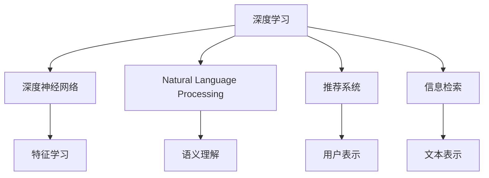

                 

# 知识发现引擎的深度学习模型应用

> 关键词：知识发现,深度学习,深度神经网络,自然语言处理(NLP),推荐系统,信息检索

## 1. 背景介绍

### 1.1 问题由来
在当前信息爆炸的时代，海量的数据正以令人难以想象的速度增长。如何从中挖掘出有价值的知识，是现代科技面临的重大挑战。传统的数据挖掘和统计方法虽然效果显著，但在面对大规模数据和高维度特征时，往往显得力不从心。

因此，近年来，深度学习（Deep Learning）成为了解决这一问题的新希望。利用深度神经网络（Deep Neural Networks, DNNs）的能力，可以从原始数据中自动学习到复杂的特征表示和模式，为知识发现和信息抽取提供了强大的支持。

特别地，深度学习在自然语言处理（Natural Language Processing, NLP）领域展现了强大的潜力，能够在处理海量文本数据时，提取出高维度的语义信息，为知识发现提供了全新的视角。推荐系统和信息检索系统作为与知识发现紧密相关的两个方向，利用深度学习的技术，已经在多个实际应用中取得了显著成效。

### 1.2 问题核心关键点
深度学习在知识发现中的应用主要涉及以下几个关键点：
1. 特征学习：通过深度神经网络自动学习出数据的特征表示，这些表示能够捕捉到数据的复杂关系和模式。
2. 语义理解：在NLP任务中，深度学习可以理解和分析语言的结构和语义，提高信息抽取和文本生成的质量。
3. 推荐系统：利用深度学习模型对用户和物品进行表示学习，从而提升推荐的准确性和个性化。
4. 信息检索：通过学习文本向量空间中的相似度，提高检索结果的相关性。
5. 数据增强：通过生成对抗网络（GANs）等技术，扩充训练数据集，减少过拟合风险。
6. 知识融合：将深度学习模型的输出与其他知识源进行融合，提升知识发现的全面性和准确性。

通过理解这些关键点，可以更清晰地把握深度学习在知识发现中的角色和应用。

## 2. 核心概念与联系

### 2.1 核心概念概述

为更好地理解深度学习在知识发现中的应用，本节将介绍几个密切相关的核心概念：

- **深度学习（Deep Learning, DL）**：指使用多层次神经网络进行模型训练的一种机器学习方法。深度神经网络可以自动学习出数据的复杂特征表示，通过多层抽象，逐步提取出高层次的语义信息。
- **深度神经网络（Deep Neural Network, DNN）**：指具有多层次非线性结构的神经网络，常用于处理图像、文本等复杂数据。深度学习的基础。
- **自然语言处理（Natural Language Processing, NLP）**：利用计算机技术对人类语言进行处理和理解，包括文本分类、信息抽取、机器翻译等任务。
- **推荐系统（Recommendation System, RS）**：根据用户的历史行为和偏好，为用户推荐个性化的产品或内容。
- **信息检索（Information Retrieval, IR）**：通过从数据库中检索出相关文档，帮助用户快速找到所需信息。

这些核心概念之间的逻辑关系可以通过以下Mermaid流程图来展示：



这个流程图展示了几大核心概念的相互关系：

1. 深度学习作为基础方法，通过深度神经网络自动学习数据的特征表示。
2. 在NLP领域，深度学习可以理解语言的语义结构，提高信息抽取和文本生成的质量。
3. 推荐系统利用深度学习对用户和物品进行表示学习，提升推荐的准确性和个性化。
4. 信息检索系统通过学习文本向量空间中的相似度，提高检索结果的相关性。
5. 深度学习还可以通过生成对抗网络等技术，扩充训练数据集，减少过拟合风险。
6. 知识发现过程往往需要融合多源知识，深度学习模型可以与其他知识源进行联合建模。

这些概念共同构成了深度学习在知识发现中的应用框架，使其能够在各个方向上发挥其强大的能力。

## 3. 核心算法原理 & 具体操作步骤

### 3.1 算法原理概述

深度学习在知识发现中的应用，主要基于深度神经网络在特征学习、语义理解、用户表示等方面的优势。其核心算法原理如下：

- **特征学习**：通过卷积神经网络（CNN）或循环神经网络（RNN）等结构，深度神经网络可以从原始数据中学习出复杂的特征表示，捕捉数据中的高层次语义信息。
- **语义理解**：在NLP任务中，通过使用词向量（Word Embedding）和注意力机制（Attention）等技术，深度学习可以理解和分析语言的语义结构，提高信息抽取和文本生成的质量。
- **用户表示**：在推荐系统中，深度学习模型可以学习出用户的隐式特征表示，通过联合学习物品特征，提升推荐结果的准确性和个性化。
- **信息检索**：利用深度学习模型，可以学习文本向量空间中的相似度，提高检索结果的相关性。

深度学习在知识发现中的应用涉及多种具体算法，包括卷积神经网络（CNN）、循环神经网络（RNN）、注意力机制（Attention）、生成对抗网络（GANs）等。这些算法在不同任务中具有各自的特点和优势。

### 3.2 算法步骤详解

基于深度学习的知识发现应用，一般包括以下几个关键步骤：

**Step 1: 数据准备与预处理**
- 收集原始数据集，并进行清洗、去噪等预处理操作。
- 将数据集分为训练集、验证集和测试集。
- 对文本数据进行分词、向量化等预处理，准备输入模型。

**Step 2: 模型选择与设计**
- 根据任务类型，选择合适的深度神经网络架构。
- 设计模型的输入、输出和隐藏层的结构，如卷积层、池化层、LSTM等。
- 确定模型的损失函数和优化器，如交叉熵损失、Adam优化器等。

**Step 3: 模型训练与调参**
- 将训练数据输入模型进行前向传播，计算损失函数。
- 反向传播计算参数梯度，根据优化器更新模型参数。
- 周期性在验证集上评估模型性能，根据性能指标调整超参数。
- 重复上述步骤直至模型收敛。

**Step 4: 模型评估与优化**
- 在测试集上评估模型的性能指标，如准确率、召回率、F1分数等。
- 根据评估结果，调整模型结构或超参数，重新训练。
- 对异常数据进行额外处理，如对抗训练、数据增强等。

**Step 5: 模型应用与维护**
- 将训练好的模型应用于实际任务中，进行推理或推荐。
- 持续收集用户反馈和新的数据，定期更新和优化模型。
- 对模型进行监控和维护，确保其稳定性和性能。

以上是深度学习在知识发现中的基本流程。在实际应用中，还需要针对具体任务的特点，对各个环节进行优化设计，如改进模型结构、引入正则化技术、选择适合的超参数等，以进一步提升模型性能。

### 3.3 算法优缺点

深度学习在知识发现中的应用，具有以下优点：
1. 特征学习能力强：深度神经网络可以自动学习出数据的复杂特征表示，捕捉高层次的语义信息。
2. 泛化能力强：通过在大规模数据上进行训练，深度学习模型能够泛化到未见过的数据。
3. 鲁棒性好：深度学习模型可以处理大规模、高维度的数据，具有较好的鲁棒性。
4. 可解释性强：通过可视化技术，深度学习模型能够解释出特征学习过程和决策逻辑。

同时，深度学习在知识发现中也有一些局限性：
1. 需要大量标注数据：深度学习模型的训练通常需要大量的标注数据，获取高质量标注数据成本较高。
2. 模型复杂度高：深度神经网络模型结构复杂，训练和推理速度较慢。
3. 易过拟合：在大规模数据上进行训练时，深度学习模型容易过拟合，泛化性能可能受限。
4. 计算资源消耗大：深度学习模型参数量巨大，训练和推理时对计算资源和内存的需求较高。

尽管存在这些局限性，但就目前而言，深度学习仍是知识发现中最有效的方法之一。未来相关研究的重点在于如何进一步降低深度学习对标注数据的依赖，提高模型的可解释性和计算效率，同时兼顾鲁棒性和泛化性能。

### 3.4 算法应用领域

深度学习在知识发现中的应用广泛，涉及以下几个主要领域：

- **自然语言处理（NLP）**：如文本分类、情感分析、命名实体识别、机器翻译、文本摘要、问答系统等任务。通过深度学习模型自动学习文本的语义表示，提高信息抽取和文本生成的质量。
- **推荐系统（RS）**：如商品推荐、音乐推荐、视频推荐等。通过深度学习模型学习用户和物品的特征表示，提升推荐结果的准确性和个性化。
- **信息检索（IR）**：如搜索引擎、知识图谱等。通过深度学习模型学习文本向量空间中的相似度，提高检索结果的相关性。
- **金融分析**：如风险评估、股票预测、市场分析等。通过深度学习模型分析金融数据，提取有价值的知识和模式。
- **医学诊断**：如疾病预测、药物发现、影像分析等。通过深度学习模型分析医学数据，辅助医生诊断和治疗。
- **智能交通**：如交通流量预测、智能导航、自动驾驶等。通过深度学习模型分析交通数据，优化交通管理。

除了上述这些经典领域，深度学习还在智能制造、智能家居、社交媒体分析、舆情监控等领域得到广泛应用，为各行各业带来了变革性的影响。随着深度学习技术的不断演进，相信其在知识发现中的应用前景将更加广阔。

## 4. 数学模型和公式 & 详细讲解 & 举例说明

### 4.1 数学模型构建

本节将使用数学语言对深度学习在知识发现中的应用进行更加严格的刻画。

记深度神经网络为 $f_{\theta}(x)$，其中 $x$ 为输入，$\theta$ 为模型参数。假设训练数据集为 $D=\{(x_i,y_i)\}_{i=1}^N$，其中 $x_i$ 为输入样本，$y_i$ 为对应的标签。

定义模型 $f_{\theta}$ 在训练数据集 $D$ 上的经验风险为：

$$
\mathcal{L}(\theta) = \frac{1}{N}\sum_{i=1}^N \ell(f_{\theta}(x_i),y_i)
$$

其中 $\ell$ 为损失函数，用于衡量模型预测输出与真实标签之间的差异。常见的损失函数包括交叉熵损失、均方误差损失等。

深度学习模型的优化目标是最小化经验风险，即找到最优参数：

$$
\theta^* = \mathop{\arg\min}_{\theta} \mathcal{L}(\theta)
$$

在实践中，我们通常使用基于梯度的优化算法（如SGD、Adam等）来近似求解上述最优化问题。设 $\eta$ 为学习率，$\lambda$ 为正则化系数，则参数的更新公式为：

$$
\theta \leftarrow \theta - \eta \nabla_{\theta}\mathcal{L}(\theta) - \eta\lambda\theta
$$

其中 $\nabla_{\theta}\mathcal{L}(\theta)$ 为损失函数对参数 $\theta$ 的梯度，可通过反向传播算法高效计算。

### 4.2 公式推导过程

以下我们以文本分类任务为例，推导交叉熵损失函数及其梯度的计算公式。

假设模型 $f_{\theta}$ 在输入 $x$ 上的输出为 $\hat{y}=f_{\theta}(x) \in [0,1]$，表示样本属于正类的概率。真实标签 $y \in \{0,1\}$。则二分类交叉熵损失函数定义为：

$$
\ell(f_{\theta}(x),y) = -[y\log \hat{y} + (1-y)\log (1-\hat{y})]
$$

将其代入经验风险公式，得：

$$
\mathcal{L}(\theta) = -\frac{1}{N}\sum_{i=1}^N [y_i\log f_{\theta}(x_i)+(1-y_i)\log(1-f_{\theta}(x_i))]
$$

根据链式法则，损失函数对参数 $\theta_k$ 的梯度为：

$$
\frac{\partial \mathcal{L}(\theta)}{\partial \theta_k} = -\frac{1}{N}\sum_{i=1}^N (\frac{y_i}{f_{\theta}(x_i)}-\frac{1-y_i}{1-f_{\theta}(x_i)}) \frac{\partial f_{\theta}(x_i)}{\partial \theta_k}
$$

其中 $\frac{\partial f_{\theta}(x_i)}{\partial \theta_k}$ 可进一步递归展开，利用自动微分技术完成计算。

在得到损失函数的梯度后，即可带入参数更新公式，完成模型的迭代优化。重复上述过程直至收敛，最终得到适应特定任务的最优模型参数 $\theta^*$。

## 5. 项目实践：代码实例和详细解释说明

### 5.1 开发环境搭建

在进行深度学习知识发现的应用实践前，我们需要准备好开发环境。以下是使用Python进行PyTorch开发的环境配置流程：

1. 安装Anaconda：从官网下载并安装Anaconda，用于创建独立的Python环境。

2. 创建并激活虚拟环境：
```bash
conda create -n dl-env python=3.8 
conda activate dl-env
```

3. 安装PyTorch：根据CUDA版本，从官网获取对应的安装命令。例如：
```bash
conda install pytorch torchvision torchaudio cudatoolkit=11.1 -c pytorch -c conda-forge
```

4. 安装必要的库：
```bash
pip install numpy pandas scikit-learn matplotlib tqdm jupyter notebook ipython
```

5. 安装相关工具包：
```bash
pip install transformers pytorch-lightning
```

完成上述步骤后，即可在`dl-env`环境中开始深度学习知识发现的应用实践。

### 5.2 源代码详细实现

下面我们以文本分类任务为例，给出使用Transformers库对BERT模型进行文本分类的PyTorch代码实现。

首先，定义模型和优化器：

```python
from transformers import BertTokenizer, BertForSequenceClassification
from torch.utils.data import DataLoader, Dataset
import torch

class TextDataset(Dataset):
    def __init__(self, texts, labels, tokenizer):
        self.texts = texts
        self.labels = labels
        self.tokenizer = tokenizer
        
    def __len__(self):
        return len(self.texts)
    
    def __getitem__(self, item):
        text = self.texts[item]
        label = self.labels[item]
        
        encoding = self.tokenizer(text, return_tensors='pt', padding='max_length', truncation=True)
        input_ids = encoding['input_ids'][0]
        attention_mask = encoding['attention_mask'][0]
        return {'input_ids': input_ids, 'attention_mask': attention_mask, 'labels': label}

# 标签与id的映射
label2id = {'negative': 0, 'positive': 1}

# 创建dataset
tokenizer = BertTokenizer.from_pretrained('bert-base-uncased')

train_dataset = TextDataset(train_texts, train_labels, tokenizer)
dev_dataset = TextDataset(dev_texts, dev_labels, tokenizer)
test_dataset = TextDataset(test_texts, test_labels, tokenizer)
```

然后，定义训练和评估函数：

```python
from transformers import AdamW
from sklearn.metrics import accuracy_score

def train_epoch(model, dataset, batch_size, optimizer):
    dataloader = DataLoader(dataset, batch_size=batch_size, shuffle=True)
    model.train()
    epoch_loss = 0
    for batch in dataloader:
        input_ids = batch['input_ids'].to(device)
        attention_mask = batch['attention_mask'].to(device)
        labels = batch['labels'].to(device)
        model.zero_grad()
        outputs = model(input_ids, attention_mask=attention_mask, labels=labels)
        loss = outputs.loss
        epoch_loss += loss.item()
        loss.backward()
        optimizer.step()
    return epoch_loss / len(dataloader)

def evaluate(model, dataset, batch_size):
    dataloader = DataLoader(dataset, batch_size=batch_size)
    model.eval()
    preds, labels = [], []
    with torch.no_grad():
        for batch in dataloader:
            input_ids = batch['input_ids'].to(device)
            attention_mask = batch['attention_mask'].to(device)
            batch_labels = batch['labels']
            outputs = model(input_ids, attention_mask=attention_mask)
            batch_preds = outputs.logits.argmax(dim=1).to('cpu').tolist()
            batch_labels = batch_labels.to('cpu').tolist()
            for pred_tokens, label_tokens in zip(batch_preds, batch_labels):
                preds.append(pred_tokens)
                labels.append(label_tokens)
    
    return accuracy_score(labels, preds)

# 定义模型参数
num_labels = len(label2id)
model = BertForSequenceClassification.from_pretrained('bert-base-uncased', num_labels=num_labels)

# 设置超参数
device = torch.device('cuda') if torch.cuda.is_available() else torch.device('cpu')
model.to(device)
learning_rate = 2e-5
optimizer = AdamW(model.parameters(), lr=learning_rate)

# 训练过程
epochs = 5
batch_size = 16

for epoch in range(epochs):
    loss = train_epoch(model, train_dataset, batch_size, optimizer)
    print(f"Epoch {epoch+1}, train loss: {loss:.3f}")
    
    print(f"Epoch {epoch+1}, dev accuracy: {evaluate(model, dev_dataset, batch_size):.2f}")
    
print(f"Test accuracy: {evaluate(model, test_dataset, batch_size):.2f}")
```

以上就是使用PyTorch对BERT模型进行文本分类的完整代码实现。可以看到，得益于Transformers库的强大封装，我们可以用相对简洁的代码完成BERT模型的加载和训练。

### 5.3 代码解读与分析

让我们再详细解读一下关键代码的实现细节：

**TextDataset类**：
- `__init__`方法：初始化文本、标签、分词器等关键组件。
- `__len__`方法：返回数据集的样本数量。
- `__getitem__`方法：对单个样本进行处理，将文本输入编码为token ids，同时将标签转换为模型可接受的格式。

**模型参数**：
- `num_labels`：指定分类的类别数，这里为2。
- `model`：定义使用预训练BERT模型作为分类器。

**训练和评估函数**：
- `train_epoch`：定义一个epoch的训练过程，计算损失并更新模型参数。
- `evaluate`：计算模型在验证集和测试集上的准确率，评估模型性能。
- 在训练过程中，周期性地在验证集上评估模型，防止过拟合。
- 在测试集上评估模型，给出最终的测试准确率。

**训练流程**：
- 定义总的epoch数和batch size，开始循环迭代
- 每个epoch内，先在训练集上训练，输出平均loss
- 在验证集上评估，输出模型在分类任务上的准确率
- 所有epoch结束后，在测试集上评估，给出最终的测试准确率

可以看到，PyTorch配合Transformers库使得BERT模型的文本分类代码实现变得简洁高效。开发者可以将更多精力放在数据处理、模型改进等高层逻辑上，而不必过多关注底层的实现细节。

当然，工业级的系统实现还需考虑更多因素，如模型的保存和部署、超参数的自动搜索、更灵活的任务适配层等。但核心的微调范式基本与此类似。

## 6. 实际应用场景

### 6.1 智能推荐系统

深度学习在推荐系统中的应用，已经广泛应用于电商平台、视频平台、音乐平台等场景。推荐系统通过深度学习模型对用户和物品进行表示学习，从而提升推荐的准确性和个性化。

具体而言，可以收集用户的历史行为数据，如浏览、点击、购买记录等，将这些行为编码为向量，输入到深度学习模型中进行训练。模型学习出用户和物品的表示，然后通过匹配用户和物品的向量，计算相似度，最终输出推荐结果。通过不断迭代优化，深度学习模型能够逐步适应用户的兴趣变化，提供更加个性化的推荐服务。

### 6.2 智能问答系统

智能问答系统通过深度学习模型理解和回答自然语言问题，已经在智能客服、智能助手等领域得到了广泛应用。问答系统收集用户输入的文本问题，将其作为输入，通过深度学习模型自动生成答案。深度学习模型可以理解问题的语义结构，进行语义匹配和信息抽取，从而生成合适的答案。

在技术实现上，可以采用预训练的语言模型（如BERT）作为问答系统的基础，微调使其能够处理具体的问答任务。在推理过程中，可以通过回译、改写等方式，生成更加多样化的回答，提高系统的鲁棒性和自然性。

### 6.3 文本摘要和文本生成

深度学习在文本摘要和文本生成任务中也有广泛应用。通过深度学习模型学习文本的语义结构，可以自动生成高质量的文本摘要和自动创作文章。

在文本摘要任务中，深度学习模型可以自动提取文本的关键信息，生成简洁明了的摘要。在文本生成任务中，深度学习模型可以生成符合语法规则和语义结构的文本内容，提高内容创作效率。

### 6.4 未来应用展望

随着深度学习技术的不断发展，其在知识发现中的应用前景将更加广阔。未来，深度学习将更多地融合多模态数据，拓展应用场景，提升知识发现的质量和效率。

在智慧医疗领域，深度学习可以应用于医学影像分析、疾病预测、药物发现等任务，辅助医生诊断和治疗。在金融分析领域，深度学习可以应用于股票预测、市场分析等任务，帮助机构做出更好的投资决策。在自然灾害预警领域，深度学习可以应用于地震预测、气象预报等任务，提高灾害预警的准确性。

除此之外，深度学习还在智能交通、智能家居、社交媒体分析等领域得到广泛应用，为各行各业带来了新的变革。相信随着深度学习技术的不断演进，其在知识发现中的应用前景将更加广阔。

## 7. 工具和资源推荐

### 7.1 学习资源推荐

为了帮助开发者系统掌握深度学习在知识发现中的应用，这里推荐一些优质的学习资源：

1. 《Deep Learning》书籍：由深度学习领域的权威专家撰写，全面介绍了深度学习的理论基础和应用实践，适合初学者和进阶者。
2. CS231n《深度学习计算机视觉》课程：斯坦福大学开设的深度学习视觉课程，包含丰富的理论和实践内容，适合计算机视觉方向的开发者。
3. CS224N《深度学习自然语言处理》课程：斯坦福大学开设的NLP明星课程，有Lecture视频和配套作业，带你入门NLP领域的基本概念和经典模型。
4. Coursera深度学习专项课程：由知名大学和研究机构开设的深度学习课程，内容覆盖广泛，适合全面学习深度学习技术。
5. Arxiv论文预印库：收集了大量最新的深度学习研究论文，是跟踪前沿进展的好去处。

通过对这些资源的学习实践，相信你一定能够快速掌握深度学习在知识发现中的精髓，并用于解决实际的NLP问题。

### 7.2 开发工具推荐

高效的开发离不开优秀的工具支持。以下是几款用于深度学习知识发现开发的常用工具：

1. PyTorch：基于Python的开源深度学习框架，灵活动态的计算图，适合快速迭代研究。
2. TensorFlow：由Google主导开发的开源深度学习框架，生产部署方便，适合大规模工程应用。
3. Keras：一个高级神经网络API，可以轻松构建和训练深度学习模型，适合快速原型设计。
4. HuggingFace Transformers库：提供了丰富的预训练模型和高效的模型封装，方便开发者进行微调和部署。
5. PyTorch Lightning：基于PyTorch的高级框架，提供可视化训练接口，适合快速构建和训练复杂模型。
6. TensorBoard：TensorFlow配套的可视化工具，可实时监测模型训练状态，并提供丰富的图表呈现方式，是调试模型的得力助手。

合理利用这些工具，可以显著提升深度学习知识发现任务的开发效率，加快创新迭代的步伐。

### 7.3 相关论文推荐

深度学习在知识发现中的应用源于学界的持续研究。以下是几篇奠基性的相关论文，推荐阅读：

1. AlexNet: ImageNet Classification with Deep Convolutional Neural Networks（卷积神经网络）：提出卷积神经网络结构，在图像分类任务中取得了突破性成果。
2. RNN: A Class of Pattern Recognition Learners with Internal Memory（循环神经网络）：提出循环神经网络结构，在自然语言处理任务中广泛应用。
3. Attention is All You Need（注意力机制）：提出注意力机制，在序列建模任务中取得了优异效果。
4. Generative Adversarial Nets（生成对抗网络）：提出生成对抗网络结构，用于数据增强和生成对抗训练。
5. Neural Collaborative Filtering（协同过滤）：提出协同过滤方法，用于推荐系统中的用户和物品表示学习。
6. Sequence to Sequence Learning with Neural Networks（序列到序列学习）：提出序列到序列模型，用于文本生成和翻译任务。

这些论文代表了大深度学习在知识发现中的进展，通过学习这些前沿成果，可以帮助研究者把握学科前进方向，激发更多的创新灵感。

## 8. 总结：未来发展趋势与挑战

### 8.1 总结

本文对深度学习在知识发现中的应用进行了全面系统的介绍。首先阐述了深度学习在特征学习、语义理解、用户表示等方面的优势，明确了深度学习在知识发现中的核心作用。其次，从原理到实践，详细讲解了深度学习在知识发现中的应用流程，给出了文本分类、推荐系统、信息检索等任务的具体代码实现。同时，本文还广泛探讨了深度学习在多个行业领域的应用前景，展示了深度学习技术的广阔应用范围。

通过本文的系统梳理，可以看到，深度学习在知识发现中的应用正在不断拓展，为各行各业带来了新的变革。伴随深度学习技术的不断演进，相信其在知识发现中的应用前景将更加广阔。

### 8.2 未来发展趋势

展望未来，深度学习在知识发现中的应用将呈现以下几个发展趋势：

1. 模型规模持续增大。随着算力成本的下降和数据规模的扩张，深度神经网络模型将不断增大，能够学习出更复杂的语义表示。
2. 融合多模态数据。深度学习将更多地融合多模态数据，拓展应用场景，提升知识发现的质量和效率。
3. 实时化和低延迟。深度学习模型将向实时化和低延迟方向发展，支持实时数据处理和智能决策。
4. 自监督学习。深度学习模型将更多地采用自监督学习范式，减少对标注数据的依赖，提升模型的泛化能力。
5. 融合人工智能技术。深度学习将更多地与知识图谱、逻辑推理、因果分析等人工智能技术融合，提升知识发现的全面性和准确性。

这些趋势将进一步推动深度学习技术的发展，为知识发现提供更强大的支持和更广阔的应用前景。

### 8.3 面临的挑战

尽管深度学习在知识发现中的应用已经取得了显著成效，但在迈向更加智能化、普适化应用的过程中，它仍面临诸多挑战：

1. 数据质量问题。深度学习模型对标注数据的依赖较大，如何获取高质量、大规模的标注数据，是当前的一个重要挑战。
2. 模型复杂度高。深度神经网络模型结构复杂，训练和推理速度较慢，如何提升模型效率，是另一个重要问题。
3. 模型可解释性不足。深度学习模型往往是"黑盒"系统，难以解释其内部工作机制和决策逻辑，需要进一步研究提高可解释性。
4. 鲁棒性问题。深度学习模型在对抗样本和异常数据面前，容易泛化性能受限，需要研究鲁棒性提升方法。
5. 隐私保护问题。深度学习模型需要大量用户数据进行训练，如何保护用户隐私，是另一个重要的研究方向。

尽管存在这些挑战，但通过研究者的不断努力，深度学习在知识发现中的应用前景将更加广阔。未来，研究者需要在数据获取、模型结构、可解释性、鲁棒性和隐私保护等方面进行持续探索，推动深度学习技术在知识发现中的应用不断进步。

### 8.4 研究展望

未来，深度学习在知识发现中的应用将需要从以下几个方面进行深入研究：

1. 知识图谱与深度学习的融合。知识图谱能够提供结构化的知识表示，与深度学习模型结合，可以提升知识发现的全面性和准确性。
2. 多源数据的融合与协同建模。深度学习模型将更多地融合多源数据，协同建模，提升知识发现的综合能力。
3. 自监督与半监督学习。自监督和半监督学习方法能够降低对标注数据的依赖，提升模型的泛化能力。
4. 对抗攻击与防御。研究对抗攻击与防御方法，提高深度学习模型的鲁棒性，防止恶意攻击。
5. 模型压缩与优化。研究模型压缩与优化技术，提升深度学习模型的效率和可解释性。
6. 应用场景的个性化定制。针对特定领域的应用场景，定制深度学习模型，提升模型的针对性和效果。

这些研究方向将推动深度学习技术在知识发现中的应用不断进步，为各个行业带来新的变革和创新。相信随着研究者的不断努力，深度学习在知识发现中的应用前景将更加广阔。

## 9. 附录：常见问题与解答

**Q1：深度学习在知识发现中的应用是否适用于所有NLP任务？**

A: 深度学习在NLP任务中表现出色，但并非所有NLP任务都适合使用深度学习。对于一些特定领域的任务，如语法分析、拼写检查等，传统的方法可能更为适合。因此，在选择深度学习模型时，需要根据具体的任务特点进行评估和选择。

**Q2：深度学习模型如何避免过拟合？**

A: 深度学习模型避免过拟合的方法有很多，包括数据增强、正则化、Dropout、Early Stopping等。数据增强可以通过回译、改写等方式扩充训练集，正则化可以通过L2正则、Dropout等方式减少过拟合风险，Early Stopping可以通过周期性在验证集上评估模型，防止过拟合。

**Q3：深度学习模型在训练过程中如何优化超参数？**

A: 深度学习模型的超参数优化通常需要使用网格搜索、随机搜索等方法进行调参。网格搜索通过枚举可能的超参数组合，选择最优组合进行训练。随机搜索通过随机采样超参数组合，并使用验证集评估性能，选择最优组合。此外，还可以通过贝叶斯优化等方法进行超参数优化。

**Q4：深度学习模型在实际应用中需要注意哪些问题？**

A: 深度学习模型在实际应用中需要注意以下几个问题：
1. 模型训练时间：深度学习模型通常训练时间较长，需要考虑训练时间和计算资源的匹配。
2. 模型效率：深度学习模型在推理时可能会面临效率问题，需要考虑模型的优化和加速。
3. 模型可解释性：深度学习模型往往是"黑盒"系统，难以解释其内部工作机制和决策逻辑，需要研究可解释性技术。
4. 模型鲁棒性：深度学习模型在对抗样本和异常数据面前，容易泛化性能受限，需要研究鲁棒性提升方法。
5. 隐私保护：深度学习模型需要大量用户数据进行训练，如何保护用户隐私，是另一个重要的研究方向。

通过合理应对这些问题，深度学习模型在实际应用中能够更好地发挥其优势，实现更好的性能。

---

作者：禅与计算机程序设计艺术 / Zen and the Art of Computer Programming

