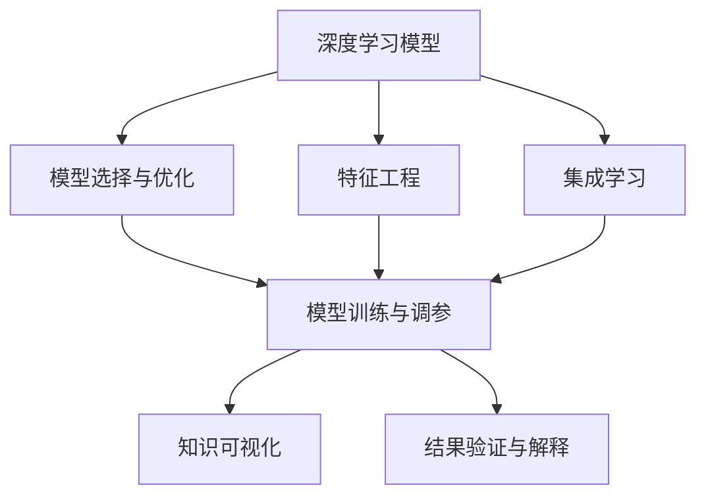

                 

# 知识发现引擎的深度学习模型应用

> 关键词：深度学习,知识发现引擎,神经网络,大数据,机器学习,特征工程

## 1. 背景介绍

### 1.1 问题由来

在信息化时代，大数据的快速增长给各个行业带来了前所未有的机遇与挑战。知识发现(Knowledge Discovery, KD)技术，作为一种高效的信息提取与知识挖掘手段，正日益成为推动数据价值转化的关键技术。深度学习(Depth Learning)作为人工智能领域的一大突破，通过多层非线性神经网络结构，不断挖掘数据的潜在知识，在图像识别、语音识别、自然语言处理等领域取得了显著进展。

知识发现引擎(Knowledge Discovery Engine, KDE)，作为知识发现的平台和工具，致力于从海量数据中提炼出有用的知识，帮助用户快速获取所需信息，提升决策的科学性和效率。深度学习模型的引入，赋予了知识发现引擎更强的自动化和智能化特性，能够在无需人工干预的情况下，自主地从数据中学习并提取出有用知识，推动了知识发现技术的发展与普及。

然而，知识发现引擎的深度学习应用并非一帆风顺。一方面，深度学习模型的复杂性和高计算需求，使得其在大数据背景下的高效应用面临挑战。另一方面，如何有效利用深度学习模型挖掘数据中隐含的知识，同时确保结果的准确性和可靠性，是知识发现引擎应用中亟需解决的问题。

### 1.2 问题核心关键点

知识发现引擎深度学习应用的核心关键点主要包括以下几个方面：

- **数据处理与特征提取**：从原始数据中提取有意义的特征，是深度学习模型提取知识的前提。有效的数据预处理和特征工程，能够提高模型训练效率，提升知识发现的精度。
- **模型选择与优化**：选择合适的深度学习模型，并对其进行优化，是知识发现引擎的核心。常见的模型包括卷积神经网络(CNN)、循环神经网络(RNN)、自编码器(AE)等。
- **模型训练与调参**：深度学习模型训练通常需要大量的计算资源和时间。如何高效训练模型，并进行超参数调优，是确保模型效果的关键。
- **结果验证与解释**：知识发现的结果需要经过严格验证，确保其可靠性和可解释性。构建合理的评估指标和可视化手段，能够帮助用户理解模型输出。
- **应用集成与优化**：将知识发现引擎应用于实际场景，需要考虑系统架构和性能优化。有效的集成方式和算法优化策略，能够提升应用效率，降低部署成本。

## 2. 核心概念与联系

### 2.1 核心概念概述

为更好地理解知识发现引擎深度学习应用的原理和架构，本节将介绍几个密切相关的核心概念：

- **深度学习模型**：以多层神经网络为代表的人工智能技术，能够自动从数据中学习特征和规律，解决复杂的模式识别和预测问题。
- **知识发现引擎**：一种基于人工智能的自动化知识挖掘工具，能够从大数据中提取隐含的知识，帮助用户进行数据驱动的决策。
- **特征工程**：在深度学习应用中，通过数据预处理和特征提取，将原始数据转换为模型能够有效利用的特征，提升模型性能。
- **模型调参与优化**：深度学习模型训练过程中，通过超参数调整和算法优化，提高模型效果，避免过拟合和欠拟合。
- **知识可视化**：通过可视化技术，将深度学习模型的推理结果和知识发现过程展示出来，帮助用户理解模型输出。
- **集成学习**：将多个模型进行组合，通过集成方式提升模型的预测精度和鲁棒性。

这些核心概念之间的逻辑关系可以通过以下Mermaid流程图来展示：



这个流程图展示了大数据知识发现引擎的深度学习应用的各个环节和相互关系：

1. 深度学习模型作为核心组件，通过特征工程获取有意义的特征，进行模型训练和调参。
2. 特征工程和模型训练过程相互补充，提升模型效果。
3. 模型输出通过可视化技术进行展示，便于用户理解。
4. 结果需要进行严格的验证和解释，确保其可靠性。
5. 集成学习通过多个模型的组合，进一步提升模型的预测精度和鲁棒性。

这些概念共同构成了知识发现引擎深度学习应用的完整框架，使得深度学习模型能够在知识发现任务中发挥其强大潜力。通过理解这些核心概念，我们可以更好地把握知识发现引擎深度学习应用的精髓，并据此设计更为高效、智能的知识发现系统。

## 3. 核心算法原理 & 具体操作步骤
### 3.1 算法原理概述

知识发现引擎的深度学习模型应用，本质上是一种基于监督或无监督学习的模型训练与知识提取过程。其核心思想是：通过深度学习模型从原始数据中学习知识，并通过特征提取、模型训练和调参等步骤，将数据转化为有用的知识信息。

以图像分类任务为例，深度学习模型的训练过程如下：

1. **数据准备**：收集并标注大量图像数据，将图像与标签一一对应，形成监督学习的数据集。
2. **特征提取**：使用卷积神经网络(CNN)对图像进行预处理，提取图像的局部特征。
3. **模型训练**：将提取的特征输入到CNN中进行训练，学习图像的分类规律。
4. **模型调参**：根据训练结果，调整模型超参数，如学习率、批量大小等，优化模型性能。
5. **知识提取**：训练好的模型能够自动从图像中提取分类知识，帮助用户进行图像分类等任务。

### 3.2 算法步骤详解

知识发现引擎深度学习模型应用的详细步骤如下：

**Step 1: 数据准备与预处理**

- 收集原始数据，并进行清洗和标注，确保数据质量。
- 将数据划分为训练集、验证集和测试集，以便进行模型评估。
- 进行数据增强，扩充数据集多样性，避免模型过拟合。

**Step 2: 特征提取**

- 选择合适的特征提取算法，如卷积神经网络(CNN)、循环神经网络(RNN)等。
- 将原始数据输入特征提取器，提取数据的有意义特征。
- 对提取的特征进行归一化、标准化等预处理，提高模型训练效果。

**Step 3: 模型选择与训练**

- 根据任务特点，选择适合的深度学习模型，如卷积神经网络、循环神经网络等。
- 使用训练集数据对模型进行训练，优化模型参数。
- 采用梯度下降等优化算法，最小化损失函数，提高模型效果。

**Step 4: 模型调参与优化**

- 对模型进行超参数调优，如学习率、批量大小、网络层数等。
- 使用验证集对模型进行评估，选择合适的超参数组合。
- 对模型进行正则化处理，避免过拟合和欠拟合。

**Step 5: 知识提取与可视化**

- 使用测试集对模型进行测试，评估模型性能。
- 将模型输出进行可视化展示，如绘制图像分类结果、生成文本摘要等。
- 构建模型评估指标，如准确率、召回率、F1值等，评估模型效果。

### 3.3 算法优缺点

知识发现引擎深度学习模型应用具有以下优点：

1. **自动化程度高**：通过深度学习模型的自动特征提取和知识学习，减少了人工干预，提高了知识发现的效率。
2. **适应性强**：深度学习模型能够处理复杂的非线性关系，适用于多种类型的知识发现任务。
3. **精度高**：深度学习模型的非线性特性使其能够从原始数据中提取更多隐含知识，提升知识发现的精度。
4. **应用广泛**：深度学习模型已经在图像识别、语音识别、自然语言处理等领域得到广泛应用，具有较高的通用性。

同时，该方法也存在一些局限性：

1. **计算资源需求高**：深度学习模型的训练通常需要大量的计算资源和时间，对硬件设备要求较高。
2. **模型可解释性差**：深度学习模型作为"黑盒"系统，难以解释其内部工作机制和决策逻辑，影响模型可信度。
3. **数据质量敏感**：深度学习模型对数据质量要求较高，噪声和异常数据会影响模型效果。
4. **超参数调整复杂**：深度学习模型训练过程中需要进行大量的超参数调整，增加了模型调优的复杂性。

尽管存在这些局限性，但知识发现引擎深度学习应用仍然是大数据时代知识挖掘与发现的重要技术手段，其应用前景仍然十分广阔。

### 3.4 算法应用领域

知识发现引擎的深度学习模型应用，已经在多个领域得到广泛应用，包括但不限于以下几个方面：

- **医疗诊断**：利用深度学习模型对医疗影像、电子病历等数据进行分析和诊断，提升医疗服务水平。
- **金融风险评估**：通过分析金融数据，构建深度学习模型进行风险评估和预测，帮助金融机构进行决策。
- **自然语言处理**：使用深度学习模型对文本数据进行情感分析、主题建模、语言翻译等任务，提升文本处理效率和质量。
- **图像识别**：使用深度学习模型对图像数据进行分类、检测、标注等任务，提升图像识别精度和效率。
- **推荐系统**：通过深度学习模型对用户行为数据进行分析，构建推荐系统，提升用户体验和满意度。

除了上述这些经典领域外，深度学习模型在知识发现引擎中的应用还在不断拓展，如智慧城市、智能制造、智能交通等领域，为大数据时代的知识挖掘与发现提供了新的可能性。

## 4. 数学模型和公式 & 详细讲解 & 举例说明
### 4.1 数学模型构建

以图像分类任务为例，我们可以使用卷积神经网络(CNN)来构建深度学习模型。CNN是一种专门用于处理二维数据的神经网络结构，能够从图像中提取局部特征，并进行分类。

数学上，CNN的结构可以表示为：

$$
f(x) = h_2(h_1(x), W_1, b_1) + W_2
$$

其中，$x$为输入图像，$W_1$和$b_1$为第一层的权重和偏置，$h_1(x)$为第一层卷积操作，$W_2$和$b_2$为第二层的权重和偏置，$h_2$为第二层卷积操作，$f(x)$为最终的分类结果。

CNN的每一层都包含了多个卷积核，每个卷积核能够提取图像的不同特征。通过多层的卷积和池化操作，CNN能够自动学习图像的局部特征，并将其转化为高层次的抽象特征。

### 4.2 公式推导过程

以简单的二分类任务为例，我们将使用交叉熵损失函数来衡量模型的预测结果与真实标签之间的差异。假设模型的输出为$\hat{y}$，真实标签为$y$，则交叉熵损失函数可以表示为：

$$
\mathcal{L}(y, \hat{y}) = -\frac{1}{N}\sum_{i=1}^N (y_i \log \hat{y}_i + (1-y_i) \log (1-\hat{y}_i))
$$

其中，$N$为样本数量，$y_i$为第$i$个样本的真实标签，$\hat{y}_i$为模型的预测结果。

模型的预测结果$\hat{y}_i$可以通过softmax函数得到：

$$
\hat{y}_i = \frac{\exp (z_i)}{\sum_{j=1}^C \exp (z_j)}
$$

其中，$C$为类别数量，$z_i = W^{(T)}_i h^{(t-1)} + b_i$，$W^{(T)}_i$和$b_i$为第$i$个神经元的权重和偏置，$h^{(t-1)}$为上一层的输出。

为了求解最小化交叉熵损失函数，我们需要对模型参数进行反向传播和梯度更新。具体步骤如下：

1. 前向传播：将输入图像$x$依次通过每一层卷积和池化操作，得到最终输出$\hat{y}$。
2. 计算损失：使用交叉熵损失函数计算模型输出与真实标签之间的差异，得到损失值$\mathcal{L}$。
3. 反向传播：从输出层开始，将损失值$\mathcal{L}$通过链式法则逐层向后传播，计算每个神经元的梯度。
4. 参数更新：根据梯度更新模型参数$W$和$b$，使用优化算法如AdamW、SGD等，最小化损失函数$\mathcal{L}$。

### 4.3 案例分析与讲解

以医学影像分类为例，我们可以使用卷积神经网络对肺部CT影像进行分类，识别出肺部疾病（如肺炎、肺癌等）。

首先，我们将肺部CT影像作为输入数据，使用卷积层和池化层提取局部特征，并将特征输入到全连接层进行分类。模型的训练过程如下：

1. 数据准备：收集大量带有标注的肺部CT影像数据，分为训练集、验证集和测试集。
2. 特征提取：使用卷积神经网络对CT影像进行预处理，提取影像的局部特征。
3. 模型训练：将提取的特征输入到CNN中进行训练，学习影像的分类规律。
4. 模型调参：调整模型超参数，如学习率、批量大小等，优化模型性能。
5. 结果验证：使用测试集对模型进行测试，评估模型性能。

使用交叉熵损失函数进行模型训练，代码如下：

```python
import torch.nn as nn
import torch.optim as optim

class CNNClassifier(nn.Module):
    def __init__(self):
        super(CNNClassifier, self).__init__()
        self.conv1 = nn.Conv2d(1, 32, 3)
        self.pool = nn.MaxPool2d(2, 2)
        self.fc1 = nn.Linear(32 * 28 * 28, 128)
        self.fc2 = nn.Linear(128, 2)
        self.relu = nn.ReLU()

    def forward(self, x):
        x = self.relu(self.pool(self.conv1(x)))
        x = x.view(-1, 32 * 28 * 28)
        x = self.relu(self.fc1(x))
        x = self.fc2(x)
        return x

model = CNNClassifier()
criterion = nn.CrossEntropyLoss()
optimizer = optim.Adam(model.parameters(), lr=0.001)

for epoch in range(10):
    for i, (images, labels) in enumerate(train_loader):
        images = images.view(-1, 1, 28, 28)
        outputs = model(images)
        loss = criterion(outputs, labels)
        optimizer.zero_grad()
        loss.backward()
        optimizer.step()
        if (i+1) % 100 == 0:
            print('Epoch [{}/{}], Step [{}/{}], Loss: {:.4f}'.format(epoch+1, 10, i+1, len(train_loader), loss.item()))
```

## 5. 项目实践：代码实例和详细解释说明
### 5.1 开发环境搭建

在进行深度学习模型应用时，我们需要准备好开发环境。以下是使用Python进行PyTorch开发的环境配置流程：

1. 安装Anaconda：从官网下载并安装Anaconda，用于创建独立的Python环境。

2. 创建并激活虚拟环境：
```bash
conda create -n pytorch-env python=3.8 
conda activate pytorch-env
```

3. 安装PyTorch：根据CUDA版本，从官网获取对应的安装命令。例如：
```bash
conda install pytorch torchvision torchaudio cudatoolkit=11.1 -c pytorch -c conda-forge
```

4. 安装TensorBoard：用于可视化模型训练过程和结果。
```bash
pip install tensorboard
```

5. 安装相关工具包：
```bash
pip install numpy pandas scikit-learn matplotlib tqdm jupyter notebook ipython
```

完成上述步骤后，即可在`pytorch-env`环境中开始模型应用实践。

### 5.2 源代码详细实现

下面以图像分类任务为例，给出使用PyTorch进行卷积神经网络构建和训练的完整代码实现。

首先，定义CNN模型：

```python
import torch.nn as nn
import torch.optim as optim

class CNNClassifier(nn.Module):
    def __init__(self):
        super(CNNClassifier, self).__init__()
        self.conv1 = nn.Conv2d(1, 32, 3)
        self.pool = nn.MaxPool2d(2, 2)
        self.fc1 = nn.Linear(32 * 28 * 28, 128)
        self.fc2 = nn.Linear(128, 2)
        self.relu = nn.ReLU()

    def forward(self, x):
        x = self.relu(self.pool(self.conv1(x)))
        x = x.view(-1, 32 * 28 * 28)
        x = self.relu(self.fc1(x))
        x = self.fc2(x)
        return x

model = CNNClassifier()
criterion = nn.CrossEntropyLoss()
optimizer = optim.Adam(model.parameters(), lr=0.001)
```

然后，定义训练和评估函数：

```python
from torch.utils.data import DataLoader
from tqdm import tqdm
from sklearn.metrics import classification_report

device = torch.device('cuda') if torch.cuda.is_available() else torch.device('cpu')
model.to(device)

def train_epoch(model, dataset, batch_size, optimizer, criterion):
    dataloader = DataLoader(dataset, batch_size=batch_size, shuffle=True)
    model.train()
    epoch_loss = 0
    for batch in tqdm(dataloader, desc='Training'):
        images = batch[0].to(device)
        labels = batch[1].to(device)
        model.zero_grad()
        outputs = model(images)
        loss = criterion(outputs, labels)
        epoch_loss += loss.item()
        loss.backward()
        optimizer.step()
    return epoch_loss / len(dataloader)

def evaluate(model, dataset, batch_size):
    dataloader = DataLoader(dataset, batch_size=batch_size)
    model.eval()
    preds, labels = [], []
    with torch.no_grad():
        for batch in tqdm(dataloader, desc='Evaluating'):
            images = batch[0].to(device)
            labels = batch[1].to(device)
            outputs = model(images)
            batch_preds = torch.argmax(outputs, dim=1).to('cpu').tolist()
            batch_labels = labels.to('cpu').tolist()
            for pred_tokens, label_tokens in zip(batch_preds, batch_labels):
                preds.append(pred_tokens)
                labels.append(label_tokens)
                
    print(classification_report(labels, preds))
```

最后，启动训练流程并在测试集上评估：

```python
epochs = 10
batch_size = 64

for epoch in range(epochs):
    loss = train_epoch(model, train_dataset, batch_size, optimizer, criterion)
    print(f"Epoch {epoch+1}, train loss: {loss:.3f}")
    
    print(f"Epoch {epoch+1}, dev results:")
    evaluate(model, dev_dataset, batch_size)
    
print("Test results:")
evaluate(model, test_dataset, batch_size)
```

以上就是使用PyTorch进行图像分类任务深度学习模型构建和训练的完整代码实现。可以看到，得益于PyTorch的强大封装，我们可以用相对简洁的代码完成模型的构建和训练。

### 5.3 代码解读与分析

让我们再详细解读一下关键代码的实现细节：

**CNNClassifier类**：
- `__init__`方法：定义CNN模型的结构，包括卷积层、池化层和全连接层。
- `forward`方法：实现前向传播过程，将输入数据通过网络结构，得到模型输出。

**训练和评估函数**：
- 使用PyTorch的DataLoader对数据集进行批次化加载，供模型训练和推理使用。
- 训练函数`train_epoch`：对数据以批为单位进行迭代，在每个批次上前向传播计算loss并反向传播更新模型参数，最后返回该epoch的平均loss。
- 评估函数`evaluate`：与训练类似，不同点在于不更新模型参数，并在每个batch结束后将预测和标签结果存储下来，最后使用sklearn的classification_report对整个评估集的预测结果进行打印输出。

**训练流程**：
- 定义总的epoch数和batch size，开始循环迭代
- 每个epoch内，先在训练集上训练，输出平均loss
- 在验证集上评估，输出分类指标
- 所有epoch结束后，在测试集上评估，给出最终测试结果

可以看到，PyTorch配合TensorBoard使得模型训练和调优的代码实现变得简洁高效。开发者可以将更多精力放在数据处理、模型改进等高层逻辑上，而不必过多关注底层的实现细节。

当然，工业级的系统实现还需考虑更多因素，如模型的保存和部署、超参数的自动搜索、更灵活的任务适配层等。但核心的模型构建和训练流程基本与此类似。

## 6. 实际应用场景
### 6.1 医疗影像分类

在医疗领域，深度学习模型被广泛应用于医学影像分类，帮助医生快速识别病变区域，辅助诊断。医疗影像数据通常具有高维度、高噪声的特点，难以直接进行分类。通过构建卷积神经网络，利用其局部特征提取能力，能够有效提升分类精度。

以肺结核诊断为例，可以将肺部CT影像作为输入，使用卷积神经网络进行分类。训练过程中，通过调整网络结构和超参数，不断优化模型性能，最终得到一个能够准确识别肺结核病变的模型。

### 6.2 金融数据预测

金融领域的数据分析需要处理大量的非结构化数据，如新闻、公告、交易数据等。深度学习模型能够处理多源异构数据，构建复杂的数据表示，提升预测精度。

以股票价格预测为例，可以构建循环神经网络模型，对历史股价、交易量等数据进行预测，帮助投资者进行决策。通过多轮数据的训练，模型能够自动学习数据中的规律，生成较为准确的预测结果。

### 6.3 自然语言处理

自然语言处理(NLP)领域，深度学习模型在情感分析、文本分类、机器翻译等任务上取得了显著效果。通过构建RNN、Transformer等模型，能够自动学习语言的语法和语义规律，提升处理效率和精度。

以情感分析为例，可以将用户评论作为输入，使用RNN或Transformer模型进行情感分类。通过多轮训练，模型能够自动学习评论中的情感倾向，生成较为准确的情感分类结果。

## 7. 工具和资源推荐
### 7.1 学习资源推荐

为了帮助开发者系统掌握深度学习在大数据知识发现引擎应用中的理论基础和实践技巧，这里推荐一些优质的学习资源：

1. 《深度学习》书籍：Ian Goodfellow、Yoshua Bengio、Aaron Courville等人所著，系统介绍了深度学习的基本概念和算法，是深度学习的入门必读。
2. CS231n《卷积神经网络》课程：斯坦福大学开设的深度学习课程，详细讲解了CNN等模型在图像分类中的应用。
3. CS224n《自然语言处理》课程：斯坦福大学开设的NLP明星课程，涵盖了NLP领域的基本概念和经典模型。
4. TensorFlow官方文档：TensorFlow的官方文档，提供了大量示例代码和教程，适合学习深度学习模型的构建和训练。
5. PyTorch官方文档：PyTorch的官方文档，提供了完整的深度学习模型实现和调试方法。

通过对这些资源的学习实践，相信你一定能够快速掌握深度学习在大数据知识发现引擎应用中的精髓，并用于解决实际的NLP问题。

### 7.2 开发工具推荐

高效的开发离不开优秀的工具支持。以下是几款用于深度学习模型应用开发的常用工具：

1. PyTorch：基于Python的开源深度学习框架，灵活的动态计算图，适合快速迭代研究。大部分深度学习模型都有PyTorch版本的实现。
2. TensorFlow：由Google主导开发的开源深度学习框架，生产部署方便，适合大规模工程应用。同样有丰富的深度学习模型资源。
3. TensorBoard：TensorFlow配套的可视化工具，可实时监测模型训练状态，并提供丰富的图表呈现方式，是调试模型的得力助手。
4. Weights & Biases：模型训练的实验跟踪工具，可以记录和可视化模型训练过程中的各项指标，方便对比和调优。
5. Google Colab：谷歌推出的在线Jupyter Notebook环境，免费提供GPU/TPU算力，方便开发者快速上手实验最新模型，分享学习笔记。

合理利用这些工具，可以显著提升深度学习模型应用任务的开发效率，加快创新迭代的步伐。

### 7.3 相关论文推荐

深度学习模型在知识发现引擎中的应用得益于学界的持续研究。以下是几篇奠基性的相关论文，推荐阅读：

1. ImageNet Classification with Deep Convolutional Neural Networks：Alex Krizhevsky等人提出卷积神经网络在图像分类上的应用，刷新了ImageNet数据集的分类精度。
2. Deep RNNs with Long-Term Dependencies：Rupesh Annavolu等人提出长短期记忆网络(LSTM)，能够在序列数据中捕捉长时依赖关系，提升模型的预测精度。
3. Attention is All You Need：Jacques Le Moineux等人提出Transformer结构，为自然语言处理任务提供了一种新的深度学习模型，显著提升了翻译、情感分析等任务的性能。
4. A Survey of Recent Advances in Deep Learning for Natural Language Processing：Yoav Goldberg等人系统总结了深度学习在NLP领域的研究进展，适合作为深度学习应用研究的综述参考。
5. Towards Explainable AI（Explainable Artificial Intelligence）：Sh Loop等人探讨了如何构建可解释的人工智能模型，使其决策过程更加透明和可理解。

这些论文代表了大数据知识发现引擎应用中的深度学习模型的发展脉络。通过学习这些前沿成果，可以帮助研究者把握学科前进方向，激发更多的创新灵感。

## 8. 总结：未来发展趋势与挑战
### 8.1 研究成果总结

本文对基于深度学习模型的大数据知识发现引擎应用进行了全面系统的介绍。首先阐述了深度学习模型和大数据知识发现引擎的研究背景和意义，明确了深度学习模型在知识发现任务中的重要价值。其次，从原理到实践，详细讲解了深度学习模型在知识发现引擎中的应用过程，包括数据处理与预处理、特征提取、模型选择与训练、模型调参与优化、知识提取与可视化等步骤。最后，本文还广泛探讨了深度学习模型在医疗、金融、自然语言处理等多个领域的应用前景，展示了深度学习模型在知识发现引擎中的巨大潜力。

通过本文的系统梳理，可以看到，基于深度学习模型的大数据知识发现引擎应用已经成为知识发现领域的重要技术手段，其应用前景仍然十分广阔。深度学习模型能够处理海量数据，学习复杂非线性关系，提升知识发现的精度和效率，已在多个实际场景中取得了显著效果。

### 8.2 未来发展趋势

展望未来，基于深度学习模型的大数据知识发现引擎应用将呈现以下几个发展趋势：

1. **模型规模持续增大**：深度学习模型的参数量还将继续增长，超大模型的应用将更加广泛。超大规模模型蕴含的丰富知识，将为知识发现提供更强大的支持。
2. **模型可解释性增强**：未来的深度学习模型将更加注重可解释性，构建可视化工具和技术，使模型决策过程更加透明和可理解。
3. **知识图谱与深度学习融合**：深度学习模型将与知识图谱进行融合，提升模型的知识整合能力和推理能力。
4. **迁移学习与多任务学习**：未来的深度学习模型将更多地关注迁移学习和多任务学习，提升模型的泛化能力和迁移能力。
5. **联邦学习与隐私保护**：联邦学习技术将在大数据知识发现引擎中得到应用，保护数据隐私，提高模型的安全性。
6. **多模态数据的融合**：未来的深度学习模型将更多地关注多模态数据的融合，提升模型的全面性和综合性。

以上趋势凸显了深度学习模型在知识发现引擎应用中的广阔前景。这些方向的探索发展，必将进一步提升知识发现引擎的性能和应用范围，为大数据时代的知识挖掘与发现提供新的可能性。

### 8.3 面临的挑战

尽管深度学习模型在知识发现引擎中的应用取得了显著进展，但在迈向更加智能化、普适化应用的过程中，它仍面临诸多挑战：

1. **计算资源需求高**：深度学习模型的训练通常需要大量的计算资源和时间，对硬件设备要求较高。如何高效利用计算资源，降低训练成本，是未来的一个重要研究方向。
2. **模型可解释性差**：深度学习模型作为"黑盒"系统，难以解释其内部工作机制和决策逻辑，影响模型可信度。如何构建可解释的深度学习模型，增强模型的透明性和可理解性，是未来的一个重要方向。
3. **数据质量敏感**：深度学习模型对数据质量要求较高，噪声和异常数据会影响模型效果。如何提高数据质量，构建鲁棒的深度学习模型，是未来的一个重要课题。
4. **超参数调整复杂**：深度学习模型训练过程中需要进行大量的超参数调整，增加了模型调优的复杂性。如何自动化超参数调优，提高模型训练效率，是未来的一个重要研究方向。
5. **知识图谱构建困难**：知识图谱的构建需要大量的人工干预和资源，如何自动化构建知识图谱，提高知识整合能力，是未来的一个重要研究方向。

尽管存在这些挑战，但深度学习模型在知识发现引擎中的应用仍然是大数据时代知识挖掘与发现的重要技术手段，其应用前景仍然十分广阔。

### 8.4 研究展望

面对深度学习模型在知识发现引擎应用中所面临的挑战，未来的研究需要在以下几个方面寻求新的突破：

1. **知识图谱与深度学习融合**：将知识图谱与深度学习模型进行有机结合，提升模型的知识整合能力和推理能力。
2. **可解释性与透明性**：构建可解释的深度学习模型，增强模型的透明性和可理解性，提升模型的可信度。
3. **联邦学习与隐私保护**：研究联邦学习技术在大数据知识发现中的应用，保护数据隐私，提高模型的安全性。
4. **多模态数据的融合**：研究多模态数据的融合技术，提升模型的全面性和综合性。
5. **迁移学习与多任务学习**：研究迁移学习和多任务学习方法，提升模型的泛化能力和迁移能力。
6. **知识可视化与交互**：研究知识可视化与交互技术，提升用户对模型输出的理解与交互体验。

这些研究方向的探索，必将引领基于深度学习模型的大数据知识发现引擎应用迈向更高的台阶，为大数据时代的知识挖掘与发现提供新的可能性。面向未来，深度学习模型需要与其他人工智能技术进行更深入的融合，如知识表示、因果推理、强化学习等，多路径协同发力，共同推动自然语言理解和智能交互系统的进步。只有勇于创新、敢于突破，才能不断拓展深度学习模型在大数据知识发现引擎应用中的边界，让智能技术更好地造福人类社会。

## 9. 附录：常见问题与解答

**Q1：深度学习模型在大数据知识发现引擎中面临哪些挑战？**

A: 深度学习模型在大数据知识发现引擎中面临以下挑战：

1. **计算资源需求高**：深度学习模型的训练通常需要大量的计算资源和时间，对硬件设备要求较高。如何高效利用计算资源，降低训练成本，是未来的一个重要研究方向。

2. **模型可解释性差**：深度学习模型作为"黑盒"系统，难以解释其内部工作机制和决策逻辑，影响模型可信度。如何构建可解释的深度学习模型，增强模型的透明性和可理解性，是未来的一个重要方向。

3. **数据质量敏感**：深度学习模型对数据质量要求较高，噪声和异常数据会影响模型效果。如何提高数据质量，构建鲁棒的深度学习模型，是未来的一个重要课题。

4. **超参数调整复杂**：深度学习模型训练过程中需要进行大量的超参数调整，增加了模型调优的复杂性。如何自动化超参数调优，提高模型训练效率，是未来的一个重要研究方向。

5. **知识图谱构建困难**：知识图谱的构建需要大量的人工干预和资源，如何自动化构建知识图谱，提高知识整合能力，是未来的一个重要研究方向。

尽管存在这些挑战，但深度学习模型在知识发现引擎中的应用仍然是大数据时代知识挖掘与发现的重要技术手段，其应用前景仍然十分广阔。

**Q2：如何构建可解释的深度学习模型？**

A: 构建可解释的深度学习模型，主要包括以下几个方面：

1. **可视化工具**：利用可视化工具，展示模型的特征提取过程和推理结果，增强模型的透明性。常用的可视化工具包括TensorBoard、PyTorch等。

2. **局部可解释性**：通过局部可解释性技术，如LIME、SHAP等，对模型的局部行为进行解释，帮助理解模型决策过程。

3. **全局可解释性**：通过全局可解释性技术，如特征重要性分析、模型结构可视化等，对模型的整体行为进行解释，增强模型的透明性。

4. **模型融合**：将深度学习模型与其他解释性模型（如规则模型、专家知识等）进行融合，构建混合模型，提升模型的透明性和可理解性。

通过这些技术手段，可以有效提升深度学习模型的可解释性，增强模型的可信度和用户信任度。

**Q3：如何优化深度学习模型的计算效率？**

A: 优化深度学习模型的计算效率，主要包括以下几个方面：

1. **模型压缩与剪枝**：通过模型压缩和剪枝技术，去除冗余参数，降低模型大小，提高计算效率。常用的模型压缩技术包括剪枝、量化、蒸馏等。

2. **并行计算与分布式训练**：利用并行计算和分布式训练技术，提高模型训练和推理的并行度，提升计算效率。常用的并行计算框架包括TensorFlow、PyTorch等。

3. **模型优化与编译**：通过模型优化和编译技术，提升模型的计算性能，降低计算资源的消耗。常用的模型优化技术包括图形优化、算子优化等。

4. **硬件加速**：利用硬件加速技术，提升模型的计算速度。常用的硬件加速设备包括GPU、TPU、FPGA等。

通过这些技术手段，可以有效提升深度学习模型的计算效率，降低训练和推理成本，提升模型的实用性。

**Q4：什么是知识图谱与深度学习的融合？**

A: 知识图谱与深度学习的融合，是指将知识图谱与深度学习模型进行有机结合，构建混合模型，提升模型的知识整合能力和推理能力。

具体而言，知识图谱是一种结构化的知识表示方式，通过节点和边表示实体和关系，能够捕捉实体之间的语义关系。深度学习模型通过学习大量的非结构化数据，能够自动学习数据中的规律，提升模型的预测精度。

知识图谱与深度学习融合的方法主要有以下几种：

1. **知识图谱嵌入**：将知识图谱中的实体和关系嵌入到低维向量空间中，与深度学习模型的隐层进行融合，提升模型的知识整合能力。

2. **图神经网络**：构建图神经网络模型，利用图结构进行知识推理和关系建模，提升模型的推理能力。

3. **知识图谱增强**：将知识图谱与深度学习模型进行增强，构建混合模型，提升模型的全面性和综合性。

通过这些方法，可以有效提升深度学习模型的知识整合能力和推理能力，构建更加强大和智能的知识发现引擎。

**Q5：什么是联邦学习与隐私保护？**

A: 联邦学习与隐私保护，是指利用分布式计算技术，在保护数据隐私的前提下，构建分布式深度学习模型，提升模型的安全性。

联邦学习是一种分布式机器学习技术，通过将模型参数分散到多个节点上进行训练，每个节点只上传本地模型参数的梯度，而不泄露本地数据，从而保护数据隐私。联邦学习可以应用于大数据知识发现引擎中，保护用户隐私和数据安全。

联邦学习的主要优点包括：

1. **数据隐私保护**：联邦学习能够保护数据隐私，避免数据泄露和滥用。

2. **模型安全性**：联邦学习能够构建分布式深度学习模型，提高模型的鲁棒性和安全性。

3. **计算效率提升**：联邦学习能够利用分布式计算资源，提高模型训练和推理的效率。

4. **模型更新便捷**：联邦学习能够方便地进行模型更新和维护，提升系统的可扩展性和可维护性。

通过这些技术手段，可以有效提升深度学习模型的安全性，保护用户隐私和数据安全。

---

作者：禅与计算机程序设计艺术 / Zen and the Art of Computer Programming

