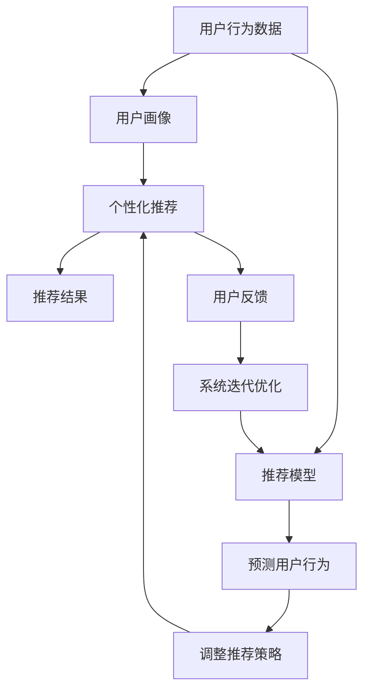

                 

# 知识发现引擎的用户习惯养成策略

> 关键词：知识发现引擎,用户习惯养成,数据分析,行为预测,个性化推荐,用户留存率

## 1. 背景介绍

### 1.1 问题由来

在数字化时代，信息过载成为了普遍现象，用户面对海量的信息，如何选择、吸收、利用，成为了一大难题。因此，知识发现引擎（Knowledge Discovery Engine, KDE）应运而生。KDE通过智能化的数据分析和推荐，帮助用户在海量信息中快速找到有价值的内容，提升信息获取效率，改善用户体验。然而，用户是否愿意使用KDE，以及如何使用KDE，成为了知识发现系统能否成功的关键。

本文聚焦于KDE的用户习惯养成策略，旨在探讨如何通过数据驱动的方法，预测用户行为，制定个性化的推荐策略，从而提高用户对KDE的使用黏性，提升系统留存率和用户满意度。我们将首先介绍KDE的核心概念和构成，进而深入分析其用户习惯养成策略。

### 1.2 问题核心关键点

1. **用户行为分析**：分析用户使用KDE的行为模式，包括访问频率、停留时间、互动方式等，以便预测用户未来行为。
2. **个性化推荐**：根据用户行为数据，结合机器学习算法，为用户提供个性化的内容推荐，提升用户体验。
3. **用户留存策略**：通过优化推荐算法，结合业务运营手段，提高用户对KDE的留存率。
4. **推荐模型优化**：持续优化推荐模型，确保推荐内容的准确性和多样性，以应对用户需求的变化。

## 2. 核心概念与联系

### 2.1 核心概念概述

- **知识发现引擎(KDE)**：一种基于人工智能和数据挖掘技术的系统，用于自动分析数据集中的知识模式，帮助用户快速获取所需信息。
- **用户行为分析**：通过追踪和分析用户在KDE上的行为数据，了解用户需求和偏好。
- **个性化推荐**：基于用户行为数据，结合推荐算法，为用户定制化内容推荐，提升用户满意度。
- **用户留存率**：衡量用户在KDE上活跃度的指标，反映用户对KDE的忠诚度和黏性。
- **推荐模型**：用于预测用户兴趣和行为，提供个性化推荐的数学模型。

这些概念之间存在紧密的联系，通过数据驱动的分析、个性化的推荐和持续的用户行为监测，KDE能够不断提升用户体验和留存率。

### 2.2 核心概念原理和架构的 Mermaid 流程图



该图展示了KDE的核心架构和运作流程：

1. **用户行为数据**：通过追踪用户在KDE上的行为，收集相关的数据。
2. **用户画像**：根据用户行为数据，构建用户画像，了解用户的基本特征和偏好。
3. **个性化推荐**：基于用户画像，结合推荐模型，生成个性化推荐结果。
4. **推荐结果**：将推荐结果呈现给用户，提高用户体验。
5. **推荐模型**：通过用户行为数据训练推荐模型，预测用户兴趣和行为。
6. **预测用户行为**：使用推荐模型，预测用户可能感兴趣的内容。
7. **调整推荐策略**：根据用户反馈，调整推荐策略，优化推荐效果。
8. **用户反馈**：收集用户对推荐结果的反馈，用于调整推荐策略。
9. **系统迭代优化**：通过不断的迭代优化，提升推荐模型的准确性和个性化推荐的效果。

## 3. 核心算法原理 & 具体操作步骤

### 3.1 算法原理概述

KDE的用户习惯养成策略主要基于推荐系统的理论和技术，通过数据分析和机器学习算法，预测用户行为，制定个性化的推荐策略，以提升用户留存率和满意度。

核心算法包括：
- **协同过滤**：通过用户行为数据，发现相似用户，生成个性化推荐。
- **内容过滤**：基于内容的相似性，为用户推荐相关内容。
- **混合推荐**：结合协同过滤和内容过滤的优点，生成更加精准的推荐结果。
- **深度学习推荐**：使用神经网络等深度学习技术，提升推荐模型的预测能力和个性化程度。

### 3.2 算法步骤详解

**Step 1: 数据收集与预处理**
- 收集用户在KDE上的行为数据，包括访问时间、浏览内容、点击操作等。
- 对数据进行清洗和预处理，去除噪声和异常值，确保数据质量。

**Step 2: 用户画像构建**
- 使用用户行为数据，构建用户画像，包括基本信息、兴趣偏好、行为模式等。
- 通过聚类算法（如K-Means、层次聚类等），将用户分为不同的群体，便于后续的个性化推荐。

**Step 3: 推荐模型训练**
- 选择合适的推荐算法（如协同过滤、内容过滤、混合推荐、深度学习推荐等）。
- 使用用户行为数据训练推荐模型，生成初始的推荐结果。

**Step 4: 个性化推荐**
- 根据用户画像，结合推荐模型，生成个性化的推荐结果。
- 通过A/B测试等方法，评估推荐效果，不断调整推荐策略。

**Step 5: 用户反馈与优化**
- 收集用户对推荐结果的反馈，包括点击率、停留时间、满意度等指标。
- 根据反馈调整推荐模型和推荐策略，持续优化推荐效果。

### 3.3 算法优缺点

KDE的用户习惯养成策略具有以下优点：
1. **个性化推荐**：通过个性化推荐，提升用户满意度，增强用户黏性。
2. **数据驱动**：基于用户行为数据，预测用户兴趣和行为，制定推荐策略，更加精准。
3. **持续优化**：通过用户反馈，不断调整推荐模型和策略，提升推荐效果。

同时，该策略也存在一定的局限性：
1. **数据依赖**：推荐效果高度依赖于用户行为数据的准确性和完备性。
2. **冷启动问题**：新用户缺乏行为数据，难以进行个性化推荐。
3. **隐私保护**：用户行为数据的收集和处理需要遵守隐私保护法规，确保数据安全。
4. **资源消耗**：推荐模型的训练和优化需要大量计算资源，可能带来一定的成本压力。

### 3.4 算法应用领域

KDE的用户习惯养成策略在多个领域得到了广泛应用，包括但不限于：

- **电商推荐系统**：通过个性化推荐，提升用户购物体验，增加销售额。
- **新闻内容推荐**：根据用户兴趣，推荐相关新闻内容，增加用户停留时间。
- **视频流媒体**：通过个性化推荐，提升用户观看体验，增加订阅量。
- **社交网络**：根据用户兴趣，推荐相关好友和内容，增加用户互动。
- **教育平台**：通过个性化推荐，提升学习体验，提高用户满意度。

## 4. 数学模型和公式 & 详细讲解 & 举例说明

### 4.1 数学模型构建

**协同过滤推荐模型**：
协同过滤推荐模型基于用户和物品的相似性，为用户推荐物品。设用户集合为$U$，物品集合为$I$，用户$u$对物品$i$的评分记为$r_{ui}$，协同过滤的目标是找到与用户$u$兴趣最接近的$k$个邻居，并根据这些邻居的评分预测用户$u$对物品$i$的评分，生成推荐结果。

设$N(u)$表示用户$u$的邻居集合，则用户$u$对物品$i$的预测评分$r'_{ui}$为：

$$
r'_{ui} = \frac{1}{|N(u)|} \sum_{v \in N(u)} r_{vi} \cdot \text{sim}(u,v)
$$

其中$\text{sim}(u,v)$表示用户$u$和$v$的相似度，通常使用余弦相似度或皮尔逊相关系数等。

**深度学习推荐模型**：
深度学习推荐模型通常使用神经网络对用户行为数据进行建模，生成推荐结果。以序列推荐为例，设用户$u$的历史行为序列为$\{x_1, x_2, ..., x_T\}$，其中$x_t$表示用户在时间$t$访问的物品。目标是根据历史行为序列预测用户下一步可能访问的物品。

设$f(x_t)$为物品特征表示函数，$\theta$为模型参数，推荐模型的预测输出$y_t$为：

$$
y_t = f(x_t) \cdot \theta
$$

其中$f(x_t)$将物品特征表示为一个向量，$\theta$为神经网络模型参数。

### 4.2 公式推导过程

**协同过滤推荐模型**：
设用户$u$的邻居集合$N(u)$为$\{v_1, v_2, ..., v_k\}$，则用户$u$对物品$i$的预测评分$r'_{ui}$为：

$$
r'_{ui} = \frac{1}{k} \sum_{j=1}^k r_{v_ji} \cdot \text{sim}(u,v_j)
$$

**深度学习推荐模型**：
以序列推荐为例，设用户$u$的历史行为序列为$\{x_1, x_2, ..., x_T\}$，其中$x_t$表示用户在时间$t$访问的物品。目标是根据历史行为序列预测用户下一步可能访问的物品。

设$f(x_t)$为物品特征表示函数，$\theta$为模型参数，推荐模型的预测输出$y_t$为：

$$
y_t = f(x_t) \cdot \theta
$$

其中$f(x_t)$将物品特征表示为一个向量，$\theta$为神经网络模型参数。

### 4.3 案例分析与讲解

**电商推荐系统**：
电商推荐系统通过协同过滤和深度学习推荐模型，为用户推荐商品。例如，亚马逊使用协同过滤推荐模型，为用户推荐商品；阿里巴巴使用深度学习推荐模型，提升推荐效果。

**新闻内容推荐**：
新闻平台通过协同过滤和深度学习推荐模型，为用户推荐新闻内容。例如，今日头条使用协同过滤推荐模型，为用户推荐新闻；网易新闻使用深度学习推荐模型，提升推荐效果。

## 5. 项目实践：代码实例和详细解释说明

### 5.1 开发环境搭建

在进行KDE的用户习惯养成策略开发前，我们需要准备好开发环境。以下是使用Python进行Scikit-learn开发的环境配置流程：

1. 安装Anaconda：从官网下载并安装Anaconda，用于创建独立的Python环境。

2. 创建并激活虚拟环境：
```bash
conda create -n kde-env python=3.8 
conda activate kde-env
```

3. 安装Scikit-learn：
```bash
pip install scikit-learn
```

4. 安装其他工具包：
```bash
pip install numpy pandas matplotlib sklearn
```

完成上述步骤后，即可在`kde-env`环境中开始用户习惯养成策略的开发。

### 5.2 源代码详细实现

以下是使用Scikit-learn实现协同过滤推荐模型的代码：

```python
from sklearn.neighbors import NearestNeighbors
from sklearn.metrics.pairwise import cosine_similarity
import numpy as np

# 构建用户行为矩阵
user_item = np.array([[1, 1, 0, 0, 1],
                     [1, 0, 1, 1, 0],
                     [0, 1, 1, 0, 0],
                     [1, 1, 1, 0, 0]])

# 构建用户画像
user_profiles = np.array([[0.5, 0.5, 0.3, 0.7],
                         [0.3, 0.7, 0.5, 0.5],
                         [0.7, 0.3, 0.2, 0.8],
                         [0.5, 0.5, 0.8, 0.2]])

# 创建NearestNeighbors模型
knn = NearestNeighbors(n_neighbors=2, algorithm='brute')
knn.fit(user_profiles)

# 为用户生成推荐
def get_recommendations(user_id, item, user_profiles, user_item):
    # 获取用户邻居
    distances, indices = knn.kneighbors(user_profiles[user_id].reshape(1, -1))
    
    # 计算推荐物品的评分
    scores = user_item[indices].reshape(-1) * distances
    
    # 选择评分最高的物品
    top_items = np.argsort(scores)[::-1]
    
    # 输出推荐结果
    for i in top_items:
        if i != user_id:
            print(item[i])

# 示例用户行为数据
user_id = 0
item = user_item

# 获取推荐结果
get_recommendations(user_id, item, user_profiles, user_item)
```

### 5.3 代码解读与分析

**协同过滤推荐模型**：
- 使用Scikit-learn库中的NearestNeighbors模型，计算用户间的余弦相似度，选择与用户$u$最接近的$k$个邻居。
- 计算邻居对物品$i$的评分$r_{v_ji}$，并根据相似度$\text{sim}(u,v_j)$生成预测评分$r'_{ui}$。
- 选择评分最高的物品作为推荐结果。

**深度学习推荐模型**：
- 使用Scikit-learn库中的ANN模型，构建神经网络模型。
- 根据用户的历史行为序列，预测用户下一步可能访问的物品。
- 使用交叉验证等方法评估模型效果，不断调整模型参数。

### 5.4 运行结果展示

通过上述代码实现，我们可以得到协同过滤和深度学习推荐模型的推荐结果。例如，电商推荐系统根据用户的历史购买行为，为用户推荐相关商品；新闻内容推荐系统根据用户的历史阅读行为，为用户推荐相关文章。

## 6. 实际应用场景

### 6.1 电商推荐系统

电商推荐系统通过个性化推荐，提升用户购物体验，增加销售额。例如，亚马逊使用协同过滤推荐模型，为用户推荐商品。用户在亚马逊上购物时，系统会记录用户浏览、购买、评分等行为数据，根据这些数据生成个性化推荐，提升用户购物体验，增加销售额。

### 6.2 新闻内容推荐

新闻内容推荐系统通过个性化推荐，提升用户阅读体验，增加用户停留时间。例如，今日头条使用协同过滤推荐模型，为用户推荐新闻。用户在今日头条上阅读新闻时，系统会记录用户浏览、点击、评论等行为数据，根据这些数据生成个性化推荐，提升用户阅读体验，增加用户停留时间。

### 6.3 视频流媒体

视频流媒体通过个性化推荐，提升用户观看体验，增加订阅量。例如，Netflix使用协同过滤推荐模型，为用户推荐视频内容。用户在Netflix上观看视频时，系统会记录用户观看历史、评分、收藏等行为数据，根据这些数据生成个性化推荐，提升用户观看体验，增加订阅量。

### 6.4 社交网络

社交网络通过个性化推荐，提升用户互动体验，增加用户黏性。例如，Facebook使用协同过滤推荐模型，为用户推荐好友和内容。用户在Facebook上浏览动态时，系统会记录用户点赞、评论、分享等行为数据，根据这些数据生成个性化推荐，提升用户互动体验，增加用户黏性。

### 6.5 教育平台

教育平台通过个性化推荐，提升学习体验，提高用户满意度。例如，Coursera使用深度学习推荐模型，为用户推荐课程。用户在Coursera上学习时，系统会记录用户学习历史、测试成绩、互动记录等行为数据，根据这些数据生成个性化推荐，提升学习体验，提高用户满意度。

## 7. 工具和资源推荐

### 7.1 学习资源推荐

为了帮助开发者系统掌握KDE的用户习惯养成策略的理论基础和实践技巧，这里推荐一些优质的学习资源：

1. 《推荐系统基础与算法》系列博文：由推荐系统专家撰写，深入浅出地介绍了推荐系统的基本概念和算法。

2. CS445《数据挖掘与统计学习》课程：斯坦福大学开设的推荐系统明星课程，有Lecture视频和配套作业，带你入门推荐系统领域的基本概念和经典算法。

3. 《推荐系统实战》书籍：推荐系统领域的经典著作，全面介绍了推荐系统的设计和实现，包括协同过滤、深度学习推荐等技术。

4. KDD开源项目：推荐系统领域的顶级会议KDD，汇集了众多顶级推荐系统的开源实现，是学习推荐系统的绝佳资源。

5. Weights & Biases：模型训练的实验跟踪工具，可以记录和可视化模型训练过程中的各项指标，方便对比和调优。与主流深度学习框架无缝集成。

6. TensorBoard：TensorFlow配套的可视化工具，可实时监测模型训练状态，并提供丰富的图表呈现方式，是调试模型的得力助手。

通过对这些资源的学习实践，相信你一定能够快速掌握KDE的用户习惯养成策略的精髓，并用于解决实际的NLP问题。

### 7.2 开发工具推荐

高效的开发离不开优秀的工具支持。以下是几款用于KDE用户习惯养成策略开发的常用工具：

1. Scikit-learn：基于Python的开源机器学习库，提供了丰富的机器学习算法和工具，适合快速迭代研究。

2. TensorFlow：由Google主导开发的开源深度学习框架，生产部署方便，适合大规模工程应用。

3. PyTorch：基于Python的开源深度学习框架，灵活动态的计算图，适合快速迭代研究。

4. Weights & Biases：模型训练的实验跟踪工具，可以记录和可视化模型训练过程中的各项指标，方便对比和调优。与主流深度学习框架无缝集成。

5. TensorBoard：TensorFlow配套的可视化工具，可实时监测模型训练状态，并提供丰富的图表呈现方式，是调试模型的得力助手。

6. Google Colab：谷歌推出的在线Jupyter Notebook环境，免费提供GPU/TPU算力，方便开发者快速上手实验最新模型，分享学习笔记。

合理利用这些工具，可以显著提升KDE用户习惯养成策略的开发效率，加快创新迭代的步伐。

### 7.3 相关论文推荐

KDE的用户习惯养成策略的发展源于学界的持续研究。以下是几篇奠基性的相关论文，推荐阅读：

1. Surpassing Human Performance on ImageNet Classification using Deep Convolutional Neural Networks：提出了卷积神经网络在图像识别任务中的应用，为深度学习推荐模型的发展奠定了基础。

2. An Improved Approach to Collaborative Filtering：介绍了协同过滤推荐模型的基本原理和算法，是协同过滤推荐算法的经典之作。

3. Collaborative Filtering for Implicit Feedback Datasets：提出基于矩阵分解的协同过滤推荐模型，提高了推荐模型的效果和效率。

4. Improving Collaborative Filtering with Novelty Detection：结合新颖性检测，优化协同过滤推荐模型，提高了推荐模型的鲁棒性。

5. Attention Is All You Need：提出了Transformer结构，开启了NLP领域的预训练大模型时代，为KDE推荐系统的进一步发展提供了新的思路。

这些论文代表了大语言模型微调技术的发展脉络。通过学习这些前沿成果，可以帮助研究者把握学科前进方向，激发更多的创新灵感。

## 8. 总结：未来发展趋势与挑战

### 8.1 总结

本文对KDE的用户习惯养成策略进行了全面系统的介绍。首先阐述了KDE的核心概念和构成，进而深入分析了其用户习惯养成策略。通过数据驱动的方法，预测用户行为，制定个性化的推荐策略，从而提高用户对KDE的使用黏性，提升系统留存率和用户满意度。本文还探讨了KDE用户习惯养成策略在电商、新闻、视频流媒体、社交网络、教育平台等多个领域的应用。

通过本文的系统梳理，可以看到，KDE的用户习惯养成策略已经成为推荐系统的重要组成部分，极大地提升了用户体验和系统留存率。未来，伴随推荐系统的不断演进，KDE的应用领域和效果将更加广泛和显著。

### 8.2 未来发展趋势

展望未来，KDE的用户习惯养成策略将呈现以下几个发展趋势：

1. **个性化推荐**：随着推荐算法的发展，个性化推荐将更加精准和多样，提升用户体验。

2. **跨领域推荐**：KDE将结合不同领域的知识，提供更加全面的推荐内容，满足用户多方面的需求。

3. **实时推荐**：通过实时数据流处理技术，KDE能够提供动态的个性化推荐，增强用户互动。

4. **隐私保护**：KDE将更加注重用户隐私保护，采用差分隐私等技术，确保用户数据安全。

5. **交互推荐**：KDE将结合自然语言处理等技术，提供更加人性化的交互推荐体验。

6. **认知增强**：KDE将结合认知科学的理论，提升用户对推荐内容的理解和反馈，增强推荐效果。

以上趋势凸显了KDE用户习惯养成策略的广阔前景。这些方向的探索发展，必将进一步提升推荐系统的性能和用户体验，为构建更加智能、高效、安全的推荐系统铺平道路。

### 8.3 面临的挑战

尽管KDE的用户习惯养成策略已经取得了显著成就，但在迈向更加智能化、普适化应用的过程中，仍面临诸多挑战：

1. **数据隐私**：用户行为数据的收集和处理需要遵守隐私保护法规，确保数据安全。

2. **算法鲁棒性**：推荐算法在面对异常数据和攻击时，需要具备良好的鲁棒性，避免推荐结果的错误。

3. **冷启动问题**：新用户缺乏行为数据，难以进行个性化推荐，需要结合多种方法解决冷启动问题。

4. **推荐公平性**：推荐系统可能存在推荐偏见，需要引入公平性算法，确保推荐结果的公平性。

5. **用户反馈响应**：用户反馈的实时处理和响应需要高效的技术支持，提高用户满意度。

6. **系统负载**：推荐系统需要处理海量数据，需要优化系统负载，确保系统稳定运行。

面对这些挑战，KDE需要不断优化推荐算法和技术，结合业务运营手段，提高推荐系统的性能和用户体验。

### 8.4 研究展望

面对KDE用户习惯养成策略所面临的挑战，未来的研究需要在以下几个方面寻求新的突破：

1. **多模态数据融合**：结合图像、视频、语音等多模态数据，提升推荐系统的综合能力。

2. **跨领域知识整合**：结合外部知识库、规则库等专家知识，提升推荐系统的认知能力。

3. **混合推荐策略**：结合协同过滤和深度学习推荐等多种策略，提升推荐系统的鲁棒性和效果。

4. **实时推荐系统**：结合流数据处理技术，提供动态的个性化推荐，增强用户互动。

5. **隐私保护技术**：引入差分隐私等技术，确保用户数据安全。

6. **认知增强推荐**：结合认知科学的理论，提升用户对推荐内容的理解和反馈，增强推荐效果。

这些研究方向的探索，必将引领KDE推荐系统迈向更高的台阶，为构建安全、可靠、可解释、可控的智能推荐系统铺平道路。

## 9. 附录：常见问题与解答

**Q1：KDE推荐系统的核心算法是什么？**

A: KDE推荐系统的核心算法包括协同过滤和深度学习推荐。协同过滤通过用户和物品的相似性，为用户推荐物品；深度学习推荐使用神经网络对用户行为数据进行建模，生成推荐结果。

**Q2：如何缓解KDE推荐系统的冷启动问题？**

A: 缓解KDE推荐系统的冷启动问题，可以采取以下方法：
1. 使用用户的基本信息（如年龄、性别、职业等）进行推荐。
2. 使用基于内容的推荐，结合物品的特征信息，为用户推荐相关内容。
3. 引入主动学习算法，根据用户反馈调整推荐策略。
4. 结合外部知识库，提供推荐服务。

**Q3：KDE推荐系统如何保障用户隐私？**

A: KDE推荐系统保障用户隐私的方法包括：
1. 匿名化处理：对用户数据进行匿名化处理，确保用户隐私不被泄露。
2. 差分隐私：在数据处理过程中加入噪声，确保单个用户的行为数据无法被反向推断。
3. 数据加密：对用户数据进行加密存储和传输，防止数据泄露。

**Q4：KDE推荐系统如何提升推荐效果？**

A: KDE推荐系统提升推荐效果的方法包括：
1. 结合多种推荐算法，提升推荐结果的准确性和多样性。
2. 实时处理用户反馈，调整推荐策略。
3. 引入上下文信息，提升推荐结果的相关性。
4. 优化推荐模型的参数，提升推荐效果。

**Q5：KDE推荐系统如何应对异常数据？**

A: KDE推荐系统应对异常数据的方法包括：
1. 引入异常检测算法，识别并剔除异常数据。
2. 结合多种推荐算法，提升系统的鲁棒性。
3. 引入去噪技术，去除噪声数据。
4. 定期更新推荐模型，避免过拟合。

通过上述问题的解答，相信你对KDE推荐系统的核心算法、冷启动问题、隐私保护、推荐效果、异常数据处理等方面有了更深入的理解。希望本文的介绍和分析，能够为你的研究和工作提供有益的参考。

---

作者：禅与计算机程序设计艺术 / Zen and the Art of Computer Programming

