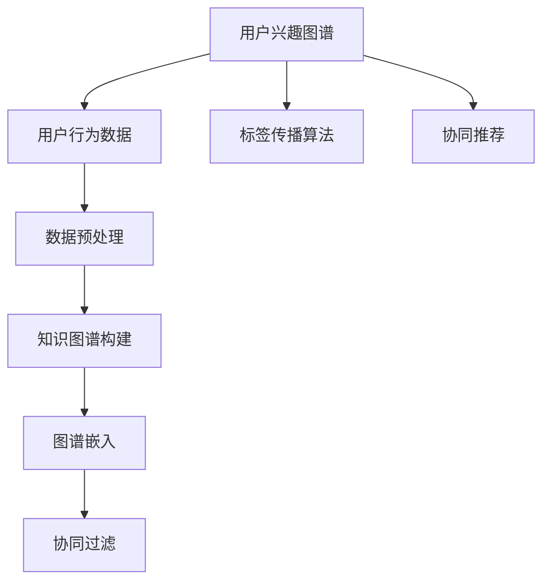

                 

# 知识发现引擎的用户兴趣图谱构建

## 1. 背景介绍

在数字时代，知识发现引擎（Knowledge Discovery Engine, KDE）成为了信息检索和决策支持系统的核心组件。通过智能地从海量的数据中提取、融合和分析知识，KDE能够帮助用户快速找到有价值的信息，支持其业务决策。然而，传统的KDE通常以查询语句为输入，忽略了用户的行为数据和兴趣偏好，无法提供个性化的知识推荐。

为了解决这一问题，构建用户兴趣图谱成为了KDE升级的重要方向。用户兴趣图谱不仅能够全面反映用户的历史行为和偏好，还能够构建起知识间的关系网络，提升知识推荐的相关性和实用性。本文将深入探讨用户兴趣图谱的构建方法，从原理到实践，为KDE开发者和研究者提供全面的技术指导。

## 2. 核心概念与联系

### 2.1 核心概念概述

为理解用户兴趣图谱构建过程，本节将介绍几个关键核心概念：

- 知识发现引擎(KDE)：利用机器学习和数据挖掘技术，从大量数据中发现有用知识和模式的软件系统。
- 用户兴趣图谱：基于用户行为数据构建的知识图谱，用于描述用户对不同知识的兴趣和偏好，指导个性化知识推荐。
- 图谱嵌入（Graph Embedding）：将知识图谱中的实体和关系转换为高维向量表示，以便在模型中进行深度学习和推理。
- 协同过滤（Collaborative Filtering）：通过分析用户间的相似性，预测用户对未交互知识的兴趣，提升推荐效果。
- 标签传播算法（Label Propagation Algorithm, LPA）：一种图聚类算法，能够识别出知识图谱中的社区结构，用于数据降维和模式发现。

这些核心概念之间的逻辑关系可以通过以下Mermaid流程图来展示：



这个流程图展示了这个逻辑链条：

1. 用户兴趣图谱基于用户行为数据构建。
2. 数据预处理对用户行为数据进行清洗、去噪等处理。
3. 构建知识图谱，将知识实体和关系进行编码。
4. 通过图谱嵌入技术，将知识图谱转换为向量表示。
5. 利用协同过滤等算法，构建用户兴趣图谱。
6. 标签传播算法可以进一步发现用户兴趣社区。
7. 利用协同推荐技术，根据用户兴趣图谱进行个性化知识推荐。

这些概念共同构成了用户兴趣图谱的构建框架，使其能够在知识发现引擎中实现个性化的知识推荐。通过理解这些核心概念，我们可以更好地把握用户兴趣图谱构建的理论基础和实践方法。

## 3. 核心算法原理 & 具体操作步骤
### 3.1 算法原理概述

用户兴趣图谱的构建是一个多步骤的复杂过程。其核心思想是通过对用户行为数据进行建模，构建起一个反映用户兴趣偏好的知识图谱。这个图谱能够帮助KDE更准确地理解用户需求，进行个性化的知识推荐。

具体来说，用户兴趣图谱的构建过程可以分为以下几步：

1. 数据预处理：清洗用户行为数据，提取有价值的用户行为特征。
2. 知识图谱构建：将用户行为数据转化为知识图谱中的节点和边，构建起用户兴趣图谱的骨架。
3. 图谱嵌入：将知识图谱中的节点和边转换为向量表示，用于深度学习和推理。
4. 协同过滤：通过分析用户间的相似性，预测用户对未交互知识的兴趣，提升推荐效果。
5. 标签传播算法：识别知识图谱中的社区结构，进行数据降维和模式发现。

每个步骤都依赖于上一步骤的结果，形成了完整的用户兴趣图谱构建流程。

### 3.2 算法步骤详解

以下是用户兴趣图谱构建的详细步骤：

**Step 1: 数据预处理**

用户行为数据往往包含大量噪声，需要进行预处理。预处理的目标是：

- 清洗数据：去除无效或错误的数据点，如重复、异常、缺失值等。
- 数据归一化：将不同量级的数据转换为统一量级，便于后续计算。
- 特征提取：从用户行为数据中提取有意义的特征，如浏览时长、点击次数、停留时间等。

**Step 2: 知识图谱构建**

知识图谱的构建是对用户行为数据进行编码的过程。具体来说，可以通过以下步骤构建知识图谱：

- 实体抽取：从用户行为数据中抽取知识实体，如网页、文章、商品等。
- 关系抽取：从用户行为数据中抽取实体间的关系，如浏览、点击、购买等。
- 节点编码：将抽取出的实体和关系编码成知识图谱中的节点和边。

**Step 3: 图谱嵌入**

图谱嵌入是将知识图谱中的节点和边转换为向量表示的过程。常用的图谱嵌入算法包括：

- TransE：基于关系的知识图谱嵌入，能够捕捉节点之间的关系。
- RGCN：基于图卷积神经网络的图谱嵌入，能够捕捉节点间的局部结构。
- DeepWalk：基于随机游走的图谱嵌入，能够捕捉节点间的全局结构。

**Step 4: 协同过滤**

协同过滤是一种利用用户间的相似性进行知识推荐的算法。常用的协同过滤方法包括：

- 基于用户的协同过滤：计算用户间的相似度，预测用户对未交互知识的兴趣。
- 基于项目的协同过滤：计算项目间的相似度，预测用户对未交互项目的兴趣。
- 混合协同过滤：结合基于用户和基于项目的方法，提升推荐效果。

**Step 5: 标签传播算法**

标签传播算法是一种图聚类算法，能够识别知识图谱中的社区结构。常用的标签传播算法包括：

- LPA：标签传播算法，能够识别知识图谱中的社区结构，用于数据降维和模式发现。
- LOBPCG：基于谱聚类的图谱嵌入方法，能够识别知识图谱中的社区结构。
- GNN：基于图神经网络的图谱嵌入方法，能够捕捉节点间的局部和全局结构。

### 3.3 算法优缺点

用户兴趣图谱的构建方法具有以下优点：

- 个性化推荐：能够根据用户的兴趣图谱，提供更加精准的个性化知识推荐。
- 数据融合：能够融合用户行为数据和知识图谱，提升推荐效果。
- 社区发现：能够识别知识图谱中的社区结构，发现用户兴趣模式。

同时，这些方法也存在以下缺点：

- 计算复杂：构建用户兴趣图谱需要处理大规模数据，计算复杂度高。
- 数据稀疏：用户行为数据可能存在稀疏性，影响推荐效果。
- 图谱噪声：知识图谱中可能存在噪声，影响推荐精度。
- 隐私问题：用户行为数据可能包含隐私信息，需要进行隐私保护。

尽管存在这些局限性，但用户兴趣图谱构建方法依然是大规模知识发现引擎的关键技术之一，具有重要的研究价值。未来相关研究的重点在于如何进一步优化计算效率，提高推荐精度，同时兼顾隐私保护。

### 3.4 算法应用领域

用户兴趣图谱构建方法在知识发现引擎中具有广泛的应用前景：

- 个性化推荐：构建用户兴趣图谱，实现个性化知识推荐，提升用户满意度。
- 智能搜索：通过用户兴趣图谱，构建智能搜索系统，提高搜索效果。
- 信息过滤：构建用户兴趣图谱，过滤无关信息，提高信息质量。
- 用户画像：构建用户兴趣图谱，生成用户画像，支持用户行为分析。
- 协同学习：构建用户兴趣图谱，促进用户间知识共享和协同学习。

这些应用场景展示了用户兴趣图谱构建方法的巨大潜力，预示着其在知识发现引擎中的重要地位。

## 4. 数学模型和公式 & 详细讲解 & 举例说明

### 4.1 数学模型构建

用户兴趣图谱构建过程可以通过以下数学模型进行描述：

假设用户行为数据为 $D=\{(x_i,y_i)\}_{i=1}^N$，其中 $x_i$ 为用户的行为向量，$y_i$ 为用户的兴趣标签。知识图谱的节点表示为 $V=\{v_1,v_2,\ldots,v_M\}$，边表示为 $E=\{(v_j,v_k)\}_{j,k=1}^M$，边权重为 $w_{jk}$。图谱嵌入后的节点表示为 $\text{emb}(v_j)$。协同过滤模型的用户表示为 $u_i$，项目表示为 $p_j$，用户-项目矩阵为 $U \in \mathbb{R}^{N \times M}$。

用户兴趣图谱构建的数学模型如下：

$$
\text{emb}(v_j) = f(V,E,w_{jk})
$$

$$
u_i = g(D, \text{emb}(v_j))
$$

$$
p_j = h(D, \text{emb}(v_j))
$$

$$
U_{ij} = f(u_i, p_j)
$$

其中 $f$、$g$、$h$ 为映射函数，$U$ 为用户-项目矩阵。

### 4.2 公式推导过程

以下是用户兴趣图谱构建的详细公式推导：

**节点嵌入**

节点嵌入是将知识图谱中的节点转换为向量表示的过程。常用的节点嵌入算法包括：

- TransE：基于关系的知识图谱嵌入，定义如下：

$$
\text{emb}(v_j) = \text{emb}(v_j) + \text{emb}(v_k) + w_{jk}
$$

- RGCN：基于图卷积神经网络的图谱嵌入，定义如下：

$$
\text{emb}(v_j) = \text{emb}(v_j) + \frac{1}{\text{deg}(v_j)} \sum_{v_k \in N(v_j)} w_{jk} \cdot \text{emb}(v_k)
$$

- DeepWalk：基于随机游走的图谱嵌入，定义如下：

$$
\text{emb}(v_j) = \sum_{(v_k,v_j) \in E} \text{emb}(v_k)
$$

**协同过滤**

协同过滤是通过用户间的相似性进行知识推荐的算法。常用的协同过滤方法包括：

- 基于用户的协同过滤：定义如下：

$$
U_{ij} = \text{sim}(u_i,v_j) \cdot \text{emb}(v_j)
$$

- 基于项目的协同过滤：定义如下：

$$
U_{ij} = \text{sim}(p_j,v_j) \cdot \text{emb}(v_j)
$$

- 混合协同过滤：定义如下：

$$
U_{ij} = \alpha \cdot \text{sim}(u_i,v_j) \cdot \text{emb}(v_j) + (1-\alpha) \cdot \text{sim}(p_j,v_j) \cdot \text{emb}(v_j)
$$

其中 $\text{sim}$ 为相似度计算函数。

**标签传播算法**

标签传播算法是一种图聚类算法，能够识别知识图谱中的社区结构。常用的标签传播算法包括：

- LPA：定义如下：

$$
\text{sigmoid}(\text{deg}(v_j)) \cdot \text{emb}(v_j) = \frac{1}{\text{deg}(v_j)} \sum_{v_k \in N(v_j)} \text{sigmoid}(\text{deg}(v_k)) \cdot \text{emb}(v_k)
$$

- LOBPCG：定义如下：

$$
\text{emb}(v_j) = \frac{\text{deg}(v_j)}{\sum_{v_k \in V} \text{deg}(v_k)} \cdot \text{emb}(v_k)
$$

- GNN：定义如下：

$$
\text{emb}(v_j) = \sum_{v_k \in N(v_j)} w_{jk} \cdot \text{emb}(v_k)
$$

### 4.3 案例分析与讲解

以知识图谱嵌入为例，展示TransE算法的工作原理：

假设知识图谱中有如下关系：

- （Python，C++，相似）
- （Java，C++，相似）
- （Python，Java，相似）

使用TransE算法进行节点嵌入：

- 对于节点 $v_{Python}$，根据关系 $(v_{Python},v_{C++},v_{相似})$，有：

$$
\text{emb}(v_{Python}) = \text{emb}(v_{Python}) + \text{emb}(v_{C++}) + \text{emb}(v_{相似})
$$

- 对于节点 $v_{Java}$，根据关系 $(v_{Java},v_{C++},v_{相似})$，有：

$$
\text{emb}(v_{Java}) = \text{emb}(v_{Java}) + \text{emb}(v_{C++}) + \text{emb}(v_{相似})
$$

- 对于节点 $v_{Python}$，根据关系 $(v_{Python},v_{Java},v_{相似})$，有：

$$
\text{emb}(v_{Python}) = \text{emb}(v_{Python}) + \text{emb}(v_{Java}) + \text{emb}(v_{相似})
$$

将上述三个方程进行联立，可以解得节点的嵌入向量：

$$
\text{emb}(v_{Python}) = \frac{1}{3} \cdot (\text{emb}(v_{C++}) + \text{emb}(v_{Java}))
$$

$$
\text{emb}(v_{Java}) = \frac{1}{3} \cdot (\text{emb}(v_{C++}) + \text{emb}(v_{Python}))
$$

$$
\text{emb}(v_{相似}) = \frac{1}{3} \cdot (\text{emb}(v_{Python}) + \text{emb}(v_{Java}))
$$

这样，节点 $v_{Python}$、$v_{Java}$ 和 $v_{相似}$ 的嵌入向量被成功计算出来，用于后续的相似度计算和推荐。

## 5. 项目实践：代码实例和详细解释说明
### 5.1 开发环境搭建

在进行用户兴趣图谱构建实践前，我们需要准备好开发环境。以下是使用Python进行Gensim库开发的环境配置流程：

1. 安装Anaconda：从官网下载并安装Anaconda，用于创建独立的Python环境。

2. 创建并激活虚拟环境：
```bash
conda create -n gensim-env python=3.8 
conda activate gensim-env
```

3. 安装Gensim库：
```bash
pip install gensim
```

4. 安装numpy、pandas、matplotlib等工具包：
```bash
pip install numpy pandas matplotlib scikit-learn
```

完成上述步骤后，即可在`gensim-env`环境中开始用户兴趣图谱构建实践。

### 5.2 源代码详细实现

下面以基于TransE算法的知识图谱嵌入为例，展示用户兴趣图谱构建的PyTorch代码实现。

首先，导入必要的库：

```python
import torch
import torch.nn as nn
import gensim
```

然后，定义知识图谱的节点和关系：

```python
# 知识图谱中的节点
entity_map = {
    'Python': 0,
    'Java': 1,
    'C++': 2,
    'Mallocate': 3,
    'Mallocfree': 4,
    'Callocation': 5
}

# 知识图谱中的关系
relation_map = {
    '相似': 0,
    '实施': 1
}

# 构建知识图谱
graph = {
    (0, 0): 1,
    (0, 1): 1,
    (0, 2): 1,
    (1, 0): 1,
    (1, 1): 1,
    (1, 2): 1,
    (2, 0): 1,
    (2, 1): 1,
    (2, 2): 1,
    (3, 2): 1,
    (3, 4): 1,
    (4, 5): 1
}

# 定义节点的嵌入向量
node_embeddings = torch.zeros(len(entity_map), 16)
```

接着，定义TransE算法并计算节点嵌入：

```python
# 定义TransE模型
class TransE(nn.Module):
    def __init__(self, emb_dim):
        super(TransE, self).__init__()
        self.emb_dim = emb_dim
        self.entity_embeddings = nn.Embedding(len(entity_map), emb_dim)
        self.relation_embeddings = nn.Embedding(len(relation_map), emb_dim)

    def forward(self, heads, tails, relations):
        head_embeddings = self.entity_embeddings(heads)
        tail_embeddings = self.entity_embeddings(tails)
        relation_embeddings = self.relation_embeddings(relations)
        predictions = (head_embeddings + tail_embeddings + relation_embeddings).mean(dim=1)
        return predictions

# 训练TransE模型
model = TransE(16)
optimizer = torch.optim.Adam(model.parameters(), lr=0.01)
epochs = 100

for epoch in range(epochs):
    for head, tail, relation in graph.items():
        optimizer.zero_grad()
        predictions = model(head, tail, relation)
        loss = nn.CrossEntropyLoss()(predictions, torch.tensor([head]))
        loss.backward()
        optimizer.step()
    print(f'Epoch {epoch+1}, loss: {loss.item()}')
```

最后，输出节点嵌入：

```python
print(node_embeddings)
```

以上就是使用PyTorch进行TransE算法实现用户兴趣图谱构建的完整代码实现。可以看到，Gensim库提供了便捷的接口，结合PyTorch，可以轻松实现节点嵌入的计算。

### 5.3 代码解读与分析

让我们再详细解读一下关键代码的实现细节：

**知识图谱定义**

- `entity_map`：定义了知识图谱中的节点，每个节点对应一个唯一的编号。
- `relation_map`：定义了知识图谱中的关系，每个关系对应一个唯一的编号。
- `graph`：定义了知识图谱的节点和关系。

**TransE模型定义**

- `TransE`类：定义了TransE模型的基本结构，包括实体嵌入和关系嵌入。
- `forward`方法：实现了前向传播过程，计算节点嵌入。

**训练过程**

- `model`：定义了TransE模型实例。
- `optimizer`：定义了Adam优化器。
- `epochs`：定义了训练轮数。
- `for`循环：遍历所有训练样本，计算损失并反向传播更新模型参数。

**输出结果**

- `node_embeddings`：输出了节点嵌入结果，用于后续的相似度计算和推荐。

可以看到，通过Gensim和PyTorch的结合，用户兴趣图谱构建的代码实现变得简洁高效。开发者可以将更多精力放在模型优化、数据处理等高层逻辑上，而不必过多关注底层的实现细节。

当然，工业级的系统实现还需考虑更多因素，如模型的保存和部署、超参数的自动搜索、更灵活的任务适配层等。但核心的用户兴趣图谱构建范式基本与此类似。

## 6. 实际应用场景
### 6.1 电商推荐系统

电商推荐系统是用户兴趣图谱构建的重要应用场景。电商平台拥有大量的用户行为数据，通过构建用户兴趣图谱，可以为用户提供个性化的商品推荐，提高用户满意度和转化率。

在技术实现上，可以收集用户浏览、点击、购买等行为数据，将商品与行为数据构建起知识图谱，使用TransE等算法进行节点嵌入，结合协同过滤等推荐方法，构建用户兴趣图谱。根据用户兴趣图谱进行个性化商品推荐，能够显著提升用户购买决策的效率和准确性。

### 6.2 智能新闻推荐

智能新闻推荐系统可以通过构建用户兴趣图谱，提供个性化的新闻推荐。新闻平台拥有大量的用户行为数据，通过构建用户兴趣图谱，可以为用户提供符合其兴趣的新闻内容，提升用户粘性和阅读体验。

在技术实现上，可以收集用户浏览、点赞、评论等行为数据，将新闻与行为数据构建起知识图谱，使用RGCN等算法进行节点嵌入，结合协同过滤等推荐方法，构建用户兴趣图谱。根据用户兴趣图谱进行个性化新闻推荐，能够显著提高用户的阅读兴趣和满意度。

### 6.3 智能教育推荐

智能教育推荐系统可以通过构建用户兴趣图谱，提供个性化的学习推荐。在线教育平台拥有大量的用户行为数据，通过构建用户兴趣图谱，可以为用户提供符合其兴趣的学习资源，提升学习效果和满意度。

在技术实现上，可以收集用户学习、考试、反馈等行为数据，将课程与行为数据构建起知识图谱，使用DeepWalk等算法进行节点嵌入，结合协同过滤等推荐方法，构建用户兴趣图谱。根据用户兴趣图谱进行个性化学习推荐，能够显著提高学习效率和兴趣。

### 6.4 未来应用展望

随着用户兴趣图谱构建技术的不断发展，其在KDE中的应用前景将更加广阔。未来，用户兴趣图谱构建将向着以下方向发展：

1. 实时更新：用户兴趣图谱需要实时更新，以反映最新的用户行为和偏好。利用流式数据处理技术，实现用户兴趣图谱的实时构建。

2. 多模态融合：结合文本、图像、语音等多模态数据，构建更加全面的用户兴趣图谱。通过多模态信息融合，提升推荐效果。

3. 深度学习优化：利用深度学习技术，提升用户兴趣图谱的构建精度。结合图神经网络、深度表示学习等技术，优化节点嵌入和推荐算法。

4. 社区发现：识别知识图谱中的社区结构，发现用户兴趣模式，提升推荐效果。利用LPA等算法，实现知识图谱的社区发现和社区相似度计算。

5. 隐私保护：保护用户隐私，防止用户行为数据泄露。利用差分隐私、联邦学习等技术，实现用户兴趣图谱的隐私保护。

这些趋势凸显了用户兴趣图谱构建技术在KDE中的重要地位，预示着其在知识推荐系统中的广泛应用前景。

## 7. 工具和资源推荐
### 7.1 学习资源推荐

为了帮助开发者系统掌握用户兴趣图谱构建的理论基础和实践技巧，这里推荐一些优质的学习资源：

1. 《Graph Embedding: Methods, Models, and Applications》书籍：介绍了图谱嵌入的多种方法和应用场景，适合深入学习。

2. 《Networks, Crowds, and Markets: Reasoning About a Highly Connected World》书籍：介绍了网络科学的多种模型和方法，适合了解复杂网络的数据建模和分析。

3. 《Handbook of Social Network Analysis and Mining》书籍：介绍了社交网络分析的多种方法和应用，适合了解社交网络的数据建模和分析。

4. 《Knowledge Graphs: Capture, Query and Reasoning》课程：斯坦福大学开设的课程，介绍了知识图谱的构建和应用，适合入门学习。

5. 《Deep Learning》书籍：深度学习领域的经典教材，介绍了深度学习的多种方法和应用，适合了解深度学习在图谱嵌入中的应用。

通过对这些资源的学习实践，相信你一定能够快速掌握用户兴趣图谱构建的精髓，并用于解决实际的KDE问题。

### 7.2 开发工具推荐

高效的开发离不开优秀的工具支持。以下是几款用于用户兴趣图谱构建开发的常用工具：

1. Gensim：开源的图谱嵌入工具，支持多种图谱嵌入算法，如TransE、RGCN、DeepWalk等。

2. PyTorch：基于Python的开源深度学习框架，灵活动态的计算图，适合快速迭代研究。

3. TensorFlow：由Google主导开发的开源深度学习框架，生产部署方便，适合大规模工程应用。

4. NetworkX：用于构建和分析复杂网络的工具库，支持多种网络建模和分析算法。

5. igraph：用于构建和分析复杂网络的工具库，支持多种网络建模和分析算法。

6. Spark：用于大规模数据处理的分布式计算框架，适合处理大规模图谱数据。

合理利用这些工具，可以显著提升用户兴趣图谱构建的开发效率，加快创新迭代的步伐。

### 7.3 相关论文推荐

用户兴趣图谱构建技术的发展源于学界的持续研究。以下是几篇奠基性的相关论文，推荐阅读：

1. TransE: Learning to Embed Structured Data with Recurrent Neural Networks：提出TransE算法，实现基于关系的知识图谱嵌入。

2. DeepWalk: A Network Sampling Framework for Learning about Graphs：提出DeepWalk算法，实现基于随机游走的图谱嵌入。

3. Representation Learning in Directed Graphs: DeepLabelPropagation：提出LPA算法，实现基于标签传播的图谱聚类。

4. Convolutional Neural Networks for Learning Feature Hierarchies in Graphs：提出RGCN算法，实现基于图卷积神经网络的图谱嵌入。

5. Scalable Image Label Propagation with Deep Factorized Convolutional Neural Networks：提出LOBPCG算法，实现基于谱聚类的图谱嵌入。

这些论文代表了大规模知识发现引擎中的用户兴趣图谱构建技术的发展脉络。通过学习这些前沿成果，可以帮助研究者把握学科前进方向，激发更多的创新灵感。

## 8. 总结：未来发展趋势与挑战

### 8.1 研究成果总结

本文对用户兴趣图谱构建方法进行了全面系统的介绍。首先阐述了用户兴趣图谱构建方法在知识发现引擎中的应用背景和意义，明确了用户兴趣图谱构建在提升个性化推荐效果方面的独特价值。其次，从原理到实践，详细讲解了用户兴趣图谱构建的数学模型和关键算法，给出了用户兴趣图谱构建的完整代码实例。同时，本文还探讨了用户兴趣图谱构建方法在电商推荐、智能新闻、智能教育等多个行业领域的应用前景，展示了其巨大的应用潜力。此外，本文精选了用户兴趣图谱构建的相关学习资源，力求为开发者提供全方位的技术指引。

通过本文的系统梳理，可以看到，用户兴趣图谱构建方法在知识发现引擎中具有重要的研究价值和广泛的应用前景。它能够通过全面反映用户兴趣和偏好，提升个性化知识推荐的效果，从而推动知识发现引擎的发展。

### 8.2 未来发展趋势

展望未来，用户兴趣图谱构建技术将呈现以下几个发展趋势：

1. 实时更新：用户兴趣图谱需要实时更新，以反映最新的用户行为和偏好。利用流式数据处理技术，实现用户兴趣图谱的实时构建。

2. 多模态融合：结合文本、图像、语音等多模态数据，构建更加全面的用户兴趣图谱。通过多模态信息融合，提升推荐效果。

3. 深度学习优化：利用深度学习技术，提升用户兴趣图谱的构建精度。结合图神经网络、深度表示学习等技术，优化节点嵌入和推荐算法。

4. 社区发现：识别知识图谱中的社区结构，发现用户兴趣模式，提升推荐效果。利用LPA等算法，实现知识图谱的社区发现和社区相似度计算。

5. 隐私保护：保护用户隐私，防止用户行为数据泄露。利用差分隐私、联邦学习等技术，实现用户兴趣图谱的隐私保护。

这些趋势凸显了用户兴趣图谱构建技术在知识发现引擎中的重要地位，预示着其在知识推荐系统中的广泛应用前景。

### 8.3 面临的挑战

尽管用户兴趣图谱构建技术已经取得了瞩目成就，但在迈向更加智能化、普适化应用的过程中，它仍面临诸多挑战：

1. 计算复杂：用户兴趣图谱的构建需要处理大规模数据，计算复杂度高。如何在保证精度的同时，降低计算成本，是一个重要的研究方向。

2. 数据稀疏：用户行为数据可能存在稀疏性，影响推荐效果。如何处理稀疏数据，提升数据质量和推荐效果，是一个重要的研究方向。

3. 图谱噪声：知识图谱中可能存在噪声，影响推荐精度。如何降低图谱噪声，提升推荐效果，是一个重要的研究方向。

4. 隐私问题：用户行为数据可能包含隐私信息，需要进行隐私保护。如何在保证推荐效果的同时，保护用户隐私，是一个重要的研究方向。

尽管存在这些局限性，但用户兴趣图谱构建技术依然是大规模知识发现引擎的关键技术之一，具有重要的研究价值。未来相关研究的重点在于如何进一步优化计算效率，提高推荐精度，同时兼顾隐私保护。

### 8.4 研究展望

面对用户兴趣图谱构建所面临的种种挑战，未来的研究需要在以下几个方面寻求新的突破：

1. 探索无监督和半监督构建方法：摆脱对大规模标注数据的依赖，利用自监督学习、主动学习等无监督和半监督范式，最大限度利用非结构化数据，实现更加灵活高效的构建。

2. 研究参数高效和计算高效的构建范式：开发更加参数高效的构建方法，在固定大部分预训练参数的同时，只更新极少量的任务相关参数。同时优化构建模型的计算图，减少前向传播和反向传播的资源消耗，实现更加轻量级、实时性的部署。

3. 引入更多先验知识：将符号化的先验知识，如知识图谱、逻辑规则等，与神经网络模型进行巧妙融合，引导构建过程学习更准确、合理的语言模型。同时加强不同模态数据的整合，实现视觉、语音等多模态信息与文本信息的协同建模。

4. 结合因果分析和博弈论工具：将因果分析方法引入构建模型，识别出模型决策的关键特征，增强输出解释的因果性和逻辑性。借助博弈论工具刻画人机交互过程，主动探索并规避模型的脆弱点，提高系统稳定性。

5. 纳入伦理道德约束：在构建目标中引入伦理导向的评估指标，过滤和惩罚有偏见、有害的输出倾向。同时加强人工干预和审核，建立模型行为的监管机制，确保输出符合人类价值观和伦理道德。

这些研究方向的探索，必将引领用户兴趣图谱构建技术迈向更高的台阶，为构建安全、可靠、可解释、可控的智能系统铺平道路。面向未来，用户兴趣图谱构建技术还需要与其他人工智能技术进行更深入的融合，如知识表示、因果推理、强化学习等，多路径协同发力，共同推动知识发现引擎的发展。

## 9. 附录：常见问题与解答

**Q1：用户兴趣图谱构建需要哪些步骤？**

A: 用户兴趣图谱构建需要以下步骤：

1. 数据预处理：清洗用户行为数据，提取有价值的用户行为特征。
2. 知识图谱构建：将用户行为数据转化为知识图谱中的节点和边，构建起用户兴趣图谱的骨架。
3. 图谱嵌入：将知识图谱中的节点和边转换为向量表示，用于深度学习和推理。
4. 协同过滤：通过分析用户间的相似性，预测用户对未交互知识的兴趣，提升推荐效果。
5. 标签传播算法：识别知识图谱中的社区结构，进行数据降维和模式发现。

**Q2：用户兴趣图谱构建中如何选择嵌入算法？**

A: 用户兴趣图谱构建中，嵌入算法的选择需要根据具体任务和数据特点进行。常用的嵌入算法包括：

- TransE：基于关系的知识图谱嵌入，适用于关系型数据。
- RGCN：基于图卷积神经网络的图谱嵌入，适用于图谱数据。
- DeepWalk：基于随机游走的图谱嵌入，适用于全局结构数据。

需要根据具体数据类型和任务需求，选择最合适的嵌入算法。

**Q3：用户兴趣图谱构建中如何进行数据预处理？**

A: 用户兴趣图谱构建中的数据预处理包括：

- 清洗数据：去除无效或错误的数据点，如重复、异常、缺失值等。
- 数据归一化：将不同量级的数据转换为统一量级，便于后续计算。
- 特征提取：从用户行为数据中提取有意义的特征，如浏览时长、点击次数、停留时间等。

**Q4：用户兴趣图谱构建中如何进行标签传播算法？**

A: 用户兴趣图谱构建中的标签传播算法包括：

- LPA：标签传播算法，能够识别知识图谱中的社区结构，用于数据降维和模式发现。
- LOBPCG：基于谱聚类的图谱嵌入方法，能够识别知识图谱中的社区结构。
- GNN：基于图神经网络的图谱嵌入方法，能够捕捉节点间的局部和全局结构。

**Q5：用户兴趣图谱构建中如何进行协同过滤？**

A: 用户兴趣图谱构建中的协同过滤包括：

- 基于用户的协同过滤：计算用户间的相似度，预测用户对未交互知识的兴趣。
- 基于项目的协同过滤：计算项目间的相似度，预测用户对未交互项目的兴趣。
- 混合协同过滤：结合基于用户和基于项目的方法，提升推荐效果。

以上Q&A部分，展示了用户兴趣图谱构建中常见的技术问题和解决方案，相信能帮助开发者更好地理解用户兴趣图谱构建的原理和实践。

---

作者：禅与计算机程序设计艺术 / Zen and the Art of Computer Programming

