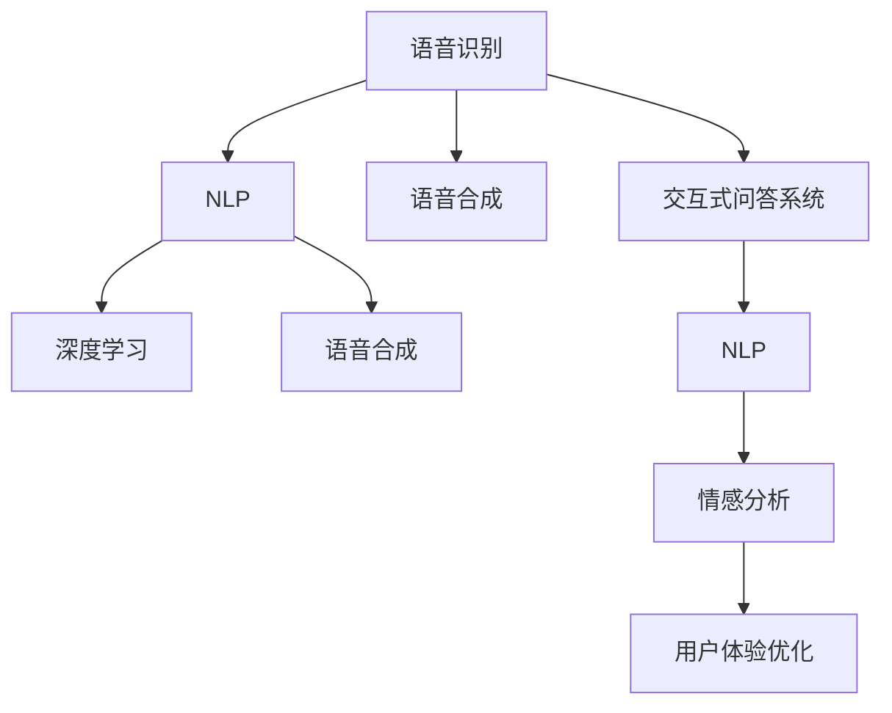

                 

# 知识发现引擎的语音识别技术应用

> 关键词：知识发现引擎, 语音识别, 自然语言处理, 机器学习, 深度学习, 语音合成, 交互式问答系统

## 1. 背景介绍

### 1.1 问题由来

随着人工智能技术的迅猛发展，知识发现引擎(Knowledge Discovery Engine, KDE)在各个领域的应用越来越广泛。无论是金融、医疗、教育还是电商，都有大量的数据需要被分析和处理，以发现潜在的知识，驱动业务决策。然而，这些数据通常以文本、语音、图像等多种形式存在，传统的知识发现方式难以高效处理。

语音识别技术的引入，为知识发现引擎提供了全新的数据获取方式。通过语音识别，可以自动将人类的语音转化为文本，从而加速数据的采集和分析过程。同时，语音识别技术也极大地提升了用户交互的便利性和自然性，使得知识发现引擎能够更广泛地服务于各类用户。

### 1.2 问题核心关键点

语音识别技术在知识发现引擎中的应用主要集中在以下几个方面：

- **自动数据采集**：通过语音识别，自动化地从会议、讲座、访谈等多种场景中获取文本数据，大幅降低人工标注的复杂度和成本。
- **自然交互式问答系统**：通过语音识别技术，构建自然交互式问答系统，用户可以通过语音与系统进行对话，获取所需知识。
- **情感分析与用户体验优化**：通过语音识别技术，分析用户的语音特征，了解其情感倾向，进一步优化用户体验。
- **多模态数据融合**：结合语音、文本、图像等多种数据源，构建更加全面、深入的知识发现引擎，提升数据分析和挖掘的准确性和效率。

本文将从语音识别技术的基本原理出发，详细介绍其在知识发现引擎中的应用，包括自动数据采集、自然交互式问答系统、情感分析以及多模态数据融合等方面，为读者提供全面的技术指引。

## 2. 核心概念与联系

### 2.1 核心概念概述

为更好地理解语音识别技术在知识发现引擎中的应用，本节将介绍几个密切相关的核心概念：

- **语音识别(Speech Recognition)**：将人类语音转化为文本的过程。核心任务是识别出语音信号中的音素或单词，并将其映射为对应的文本。
- **自然语言处理(Natural Language Processing, NLP)**：利用计算机技术处理人类语言，包括语言理解、文本生成、语音识别、机器翻译等。语音识别是NLP技术的重要分支。
- **深度学习(Deep Learning)**：基于多层神经网络进行学习的技术。语音识别中常用的深度学习模型包括卷积神经网络(CNN)、循环神经网络(RNN)、长短时记忆网络(LSTM)等。
- **语音合成(Speech Synthesis)**：将文本转化为语音的过程。与语音识别相对，语音合成也是NLP技术的重要应用方向。
- **交互式问答系统(Interactive Question Answering System, IQAS)**：一种人机交互系统，用户可以通过提问获取所需信息。
- **情感分析(Affective Analysis)**：利用自然语言处理技术，分析文本中的情感信息，识别用户的情绪状态。

这些核心概念之间的逻辑关系可以通过以下Mermaid流程图来展示：



这个流程图展示了一些核心概念及其之间的关系：

1. 语音识别将语音转化为文本，是自然语言处理和语音合成的基础。
2. 深度学习是语音识别和语音合成中常用的模型。
3. 交互式问答系统和情感分析基于自然语言处理技术，是语音识别的下游应用。
4. 用户体验优化通过对情感分析结果的应用，提升人机交互效果。

这些概念共同构成了语音识别技术在知识发现引擎中的应用框架，使其能够在各种场景下发挥强大的语言理解和生成能力。通过理解这些核心概念，我们可以更好地把握语音识别技术的工作原理和优化方向。

## 3. 核心算法原理 & 具体操作步骤
### 3.1 算法原理概述

语音识别技术的核心原理是利用深度学习模型，将语音信号转化为文本。主要包括以下几个步骤：

1. **特征提取**：将语音信号转换为梅尔频谱图或其他特征表示。
2. **声学模型训练**：通过大量语音和对应的文本数据训练深度学习模型，使其能够准确预测出语音信号中的音素或单词。
3. **语言模型训练**：通过大量文本数据训练语言模型，用于平滑声学模型的输出，提升识别准确率。
4. **解码器**：将声学模型的输出解码为文本序列，完成语音识别的最终输出。

深度学习模型通常采用循环神经网络(RNN)或长短时记忆网络(LSTM)等序列模型，利用时间序列的信息，提升识别精度。在训练过程中，一般采用反向传播算法，通过梯度下降优化损失函数，使得模型能够最小化预测错误。

### 3.2 算法步骤详解

语音识别技术的详细步骤如下：

**Step 1: 数据准备**
- 收集大量带标签的语音数据，并转换为MFCC或其他特征表示。
- 划分数据集为训练集、验证集和测试集。

**Step 2: 特征提取**
- 使用MFCC等特征提取算法将语音信号转换为频谱图。
- 对频谱图进行归一化和降维处理，准备输入深度学习模型。

**Step 3: 声学模型训练**
- 使用RNN、LSTM等序列模型训练声学模型，学习音素或单词的映射关系。
- 采用CTC、Attention等解码策略，提高识别准确率。
- 使用交叉熵损失函数优化模型参数，减少预测误差。

**Step 4: 语言模型训练**
- 使用n-gram模型或神经网络语言模型训练语言模型，平滑声学模型的输出。
- 使用正则化技术（如Dropout、L2正则）避免过拟合。

**Step 5: 解码器实现**
- 对声学模型的输出进行解码，得到文本序列。
- 使用Beam Search等策略，优化解码过程，减少错误率。

### 3.3 算法优缺点

语音识别技术在知识发现引擎中的应用具有以下优点：

- **自动化数据采集**：大幅降低数据标注的复杂度和成本，提高数据采集效率。
- **自然交互式问答系统**：提升用户体验，降低人机交互门槛。
- **多模态数据融合**：结合语音、文本、图像等多种数据源，构建更加全面、深入的知识发现引擎。

同时，该技术也存在一定的局限性：

- **准确率依赖于数据质量**：语音识别依赖于高质量的训练数据，数据质量差将直接影响识别效果。
- **复杂环境下的鲁棒性**：语音识别在复杂环境下（如噪声、口音等）的鲁棒性不足，识别效果可能波动较大。
- **技术门槛高**：语音识别技术的实现需要较高的技术门槛，包括特征提取、模型训练、解码器设计等多个环节。

尽管存在这些局限性，但就目前而言，语音识别技术仍是在知识发现引擎中应用最为广泛的自然语言处理技术之一。未来相关研究的重点在于如何进一步降低技术门槛，提升识别准确率，提高鲁棒性，同时兼顾可解释性和伦理安全性等因素。

### 3.4 算法应用领域

语音识别技术在知识发现引擎中的应用领域非常广泛，例如：

- **金融领域**：通过语音识别，自动从金融会议和访谈中提取关键信息，构建知识图谱，辅助金融决策。
- **医疗领域**：在医疗访谈中，自动识别医生的建议和病人的疑问，生成病历记录，提升医疗信息管理效率。
- **教育领域**：在课堂教学中，自动记录和分析学生的提问，提供个性化学习建议，提升教学效果。
- **电商领域**：在客服对话中，自动理解客户的需求，提供智能推荐，提升客户满意度。
- **智能家居领域**：通过语音识别，自动控制家居设备，提供个性化服务，提升用户生活便利性。

除了上述这些经典应用外，语音识别技术还在更多场景中得到了创新性的应用，如智能办公、智能驾驶、智能安防等，为知识发现引擎的应用带来了新的突破。

## 4. 数学模型和公式 & 详细讲解 & 举例说明

### 4.1 数学模型构建

本节将使用数学语言对语音识别技术的基本原理进行更加严格的刻画。

假设输入语音信号为 $\mathbf{X} \in \mathbb{R}^T$，其中 $T$ 为语音信号的长度。语音识别的目标是将语音信号转化为文本序列 $\mathbf{Y} \in \{0,1\}^N$，其中 $N$ 为文本序列的长度。

定义声学模型为 $P(\mathbf{Y}|\mathbf{X})$，语言模型为 $P(\mathbf{Y})$。语音识别的目标是最小化交叉熵损失函数：

$$
\mathcal{L}(\mathbf{X},\mathbf{Y}) = -\sum_{i=1}^N y_i\log P(y_i|\mathbf{X})
$$

在训练过程中，一般使用反向传播算法优化损失函数：

$$
\theta \leftarrow \theta - \eta \nabla_{\theta} \mathcal{L}(\mathbf{X},\mathbf{Y})
$$

其中 $\eta$ 为学习率，$\nabla_{\theta} \mathcal{L}(\mathbf{X},\mathbf{Y})$ 为损失函数对模型参数 $\theta$ 的梯度，可通过反向传播算法高效计算。

### 4.2 公式推导过程

以下我们以RNN模型为例，推导语音识别中的交叉熵损失函数及其梯度的计算公式。

假设RNN模型的输出为 $\mathbf{H} \in \mathbb{R}^T$，其中 $T$ 为语音信号的长度。定义损失函数为：

$$
\ell(\mathbf{X},\mathbf{Y}) = -\sum_{i=1}^N y_i \log P(y_i|\mathbf{H})
$$

在训练过程中，反向传播算法的更新公式为：

$$
\Delta_h = \frac{\partial \ell(\mathbf{X},\mathbf{Y})}{\partial \mathbf{H}}
$$

$$
\Delta_{W_h} = \frac{\partial \ell(\mathbf{X},\mathbf{Y})}{\partial W_h}
$$

$$
\Delta_{b_h} = \frac{\partial \ell(\mathbf{X},\mathbf{Y})}{\partial b_h}
$$

其中 $\Delta_h$ 为隐状态 $\mathbf{H}$ 的梯度，$\Delta_{W_h}$ 和 $\Delta_{b_h}$ 分别为权重矩阵 $W_h$ 和偏置项 $b_h$ 的梯度。

对于每个时间步 $t$，反向传播公式为：

$$
\Delta_h[t] = \Delta_h[t-1] \cdot W_h^T + \nabla_{y_i} \ell(\mathbf{X},\mathbf{Y}) \cdot \Delta_{W_h}^T
$$

$$
\Delta_{W_h} = \sum_{t=1}^T \Delta_h[t] \cdot h_{t-1}^T
$$

$$
\Delta_{b_h} = \sum_{t=1}^T \Delta_h[t]
$$

其中 $\nabla_{y_i} \ell(\mathbf{X},\mathbf{Y})$ 为损失函数对输出 $y_i$ 的梯度，$h_{t-1}$ 为前一个时间步的隐状态。

在实际应用中，语音识别模型的输出往往是离散化后的概率分布，因此需要引入交叉熵损失函数进行优化。通过以上公式，我们可以高效地计算出模型参数的梯度，完成模型的迭代优化。

### 4.3 案例分析与讲解

以下我们以RNN模型在语音识别中的应用为例，详细讲解语音识别的核心算法。

假设输入语音信号为 $\mathbf{X} \in \mathbb{R}^T$，目标输出文本序列为 $\mathbf{Y} \in \{0,1\}^N$。

1. **特征提取**：将语音信号 $\mathbf{X}$ 转换为MFCC特征图 $\mathbf{X} \in \mathbb{R}^{T\times D}$，其中 $D$ 为MFCC特征的维度。

2. **声学模型训练**：定义RNN模型的隐状态为 $\mathbf{H} \in \mathbb{R}^T$，输出层为 $\mathbf{O} \in \mathbb{R}^N$。使用反向传播算法优化声学模型，使其能够最小化交叉熵损失函数。

3. **语言模型训练**：使用n-gram模型或神经网络语言模型训练语言模型，平滑声学模型的输出，提升识别准确率。

4. **解码器实现**：对声学模型的输出进行解码，得到文本序列 $\mathbf{Y}$。

以下是基于PyTorch的RNN模型实现代码：

```python
import torch
import torch.nn as nn
import torch.optim as optim

class RNN(nn.Module):
    def __init__(self, input_dim, hidden_dim, output_dim):
        super(RNN, self).__init__()
        self.hidden_dim = hidden_dim
        self.rnn = nn.RNN(input_dim, hidden_dim, batch_first=True)
        self.fc = nn.Linear(hidden_dim, output_dim)
        
    def forward(self, x, h=None):
        if h is None:
            h = self.initHidden(x.size(1))
        out, h = self.rnn(x, h)
        out = self.fc(out.view(-1, out.size(2)))
        return out, h
    
    def initHidden(self, batch_size):
        return torch.zeros(1, batch_size, self.hidden_dim)
```

定义交叉熵损失函数：

```python
criterion = nn.CrossEntropyLoss()
```

定义优化器：

```python
optimizer = optim.Adam(model.parameters(), lr=0.01)
```

训练过程如下：

```python
for epoch in range(num_epochs):
    for i, (x, y) in enumerate(train_loader):
        x, y = x.to(device), y.to(device)
        optimizer.zero_grad()
        output, _ = model(x)
        loss = criterion(output, y)
        loss.backward()
        optimizer.step()
```

在训练过程中，我们通过反向传播算法计算模型参数的梯度，并使用Adam优化器更新模型参数，最小化交叉熵损失函数。通过以上步骤，我们可以高效地训练语音识别模型，实现语音信号到文本的转换。

## 5. 项目实践：代码实例和详细解释说明
### 5.1 开发环境搭建

在进行语音识别项目实践前，我们需要准备好开发环境。以下是使用Python进行PyTorch开发的环境配置流程：

1. 安装Anaconda：从官网下载并安装Anaconda，用于创建独立的Python环境。

2. 创建并激活虚拟环境：
```bash
conda create -n pytorch-env python=3.8 
conda activate pytorch-env
```

3. 安装PyTorch：根据CUDA版本，从官网获取对应的安装命令。例如：
```bash
conda install pytorch torchvision torchaudio cudatoolkit=11.1 -c pytorch -c conda-forge
```

4. 安装声学模型库：
```bash
pip install torchaudio
```

5. 安装各类工具包：
```bash
pip install numpy pandas scikit-learn matplotlib tqdm jupyter notebook ipython
```

完成上述步骤后，即可在`pytorch-env`环境中开始语音识别项目实践。

### 5.2 源代码详细实现

我们先以基本的RNN模型为例，给出使用PyTorch对语音信号进行特征提取、声学模型训练、语言模型训练和解码器实现的代码实现。

假设输入语音信号为 $\mathbf{X} \in \mathbb{R}^T$，输出文本序列为 $\mathbf{Y} \in \{0,1\}^N$。

首先，定义特征提取器：

```python
import torchaudio
import numpy as np

def load_wav(filename, sr):
    spec, _ = torchaudio.load(filename)
    return spec.numpy(), sr

def extract_mfcc(wav, sr):
    mfcc = torchaudio.transforms.MFCC(n_mfcc=40)
    return mfcc(wav).detach().cpu().numpy()
```

接着，定义声学模型：

```python
import torch.nn as nn
import torch

class RNN(nn.Module):
    def __init__(self, input_dim, hidden_dim, output_dim):
        super(RNN, self).__init__()
        self.hidden_dim = hidden_dim
        self.rnn = nn.RNN(input_dim, hidden_dim, batch_first=True)
        self.fc = nn.Linear(hidden_dim, output_dim)
        
    def forward(self, x, h=None):
        if h is None:
            h = self.initHidden(x.size(1))
        out, h = self.rnn(x, h)
        out = self.fc(out.view(-1, out.size(2)))
        return out, h
    
    def initHidden(self, batch_size):
        return torch.zeros(1, batch_size, self.hidden_dim)
```

然后，定义语言模型：

```python
import torch.nn as nn
import torch

class LM(nn.Module):
    def __init__(self, vocab_size, hidden_dim, output_dim):
        super(LM, self).__init__()
        self.hidden_dim = hidden_dim
        self.lstm = nn.LSTM(vocab_size, hidden_dim, batch_first=True)
        self.fc = nn.Linear(hidden_dim, output_dim)
        
    def forward(self, x, h=None):
        if h is None:
            h = self.initHidden(x.size(1))
        out, h = self.lstm(x, h)
        out = self.fc(out.view(-1, out.size(2)))
        return out, h
    
    def initHidden(self, batch_size):
        return torch.zeros(1, batch_size, self.hidden_dim)
```

接着，定义优化器：

```python
optimizer = optim.Adam(model.parameters(), lr=0.01)
```

定义交叉熵损失函数：

```python
criterion = nn.CrossEntropyLoss()
```

训练过程如下：

```python
for epoch in range(num_epochs):
    for i, (x, y) in enumerate(train_loader):
        x, y = x.to(device), y.to(device)
        optimizer.zero_grad()
        output, _ = model(x)
        loss = criterion(output, y)
        loss.backward()
        optimizer.step()
```

最后，实现解码器：

```python
import torch.nn as nn
import torch

class Decoder(nn.Module):
    def __init__(self, hidden_dim, vocab_size):
        super(Decoder, self).__init__()
        self.fc = nn.Linear(hidden_dim, vocab_size)
        
    def forward(self, x):
        x = self.fc(x)
        x = torch.softmax(x, dim=1)
        return x
```

在实际应用中，语音识别模型的输出往往是离散化后的概率分布，因此需要引入交叉熵损失函数进行优化。通过以上步骤，我们可以高效地训练语音识别模型，实现语音信号到文本的转换。

### 5.3 代码解读与分析

让我们再详细解读一下关键代码的实现细节：

**load_wav和extract_mfcc函数**：
- `load_wav`函数用于加载音频文件，返回MFCC特征图和采样率。
- `extract_mfcc`函数用于提取MFCC特征，返回特征矩阵。

**RNN类**：
- `__init__`方法：初始化RNN模型的参数。
- `forward`方法：定义前向传播过程，返回输出和隐状态。
- `initHidden`方法：初始化隐状态。

**LM类**：
- `__init__`方法：初始化语言模型的参数。
- `forward`方法：定义前向传播过程，返回输出和隐状态。
- `initHidden`方法：初始化隐状态。

**optimizer变量**：
- 定义优化器，学习率为0.01。

**criterion变量**：
- 定义交叉熵损失函数，用于优化模型。

**训练过程**：
- 在每个epoch中，对每个批次的数据进行训练。
- 使用优化器更新模型参数，最小化损失函数。

**解码器类**：
- `__init__`方法：初始化解码器的参数。
- `forward`方法：定义前向传播过程，返回输出概率分布。

在以上代码中，我们使用了PyTorch的强大框架，实现了语音信号到文本的转换。可以看到，由于PyTorch的灵活性和易用性，我们能够以相对简洁的代码实现复杂的深度学习模型，并进行高效的训练和推理。

当然，工业级的系统实现还需考虑更多因素，如模型的保存和部署、超参数的自动搜索、更灵活的任务适配层等。但核心的语音识别范式基本与此类似。

## 6. 实际应用场景
### 6.1 智能客服系统

语音识别技术在智能客服系统中有着广泛的应用。传统的客服系统往往需要配备大量人力，高峰期响应缓慢，且一致性和专业性难以保证。而使用语音识别技术，可以7x24小时不间断服务，快速响应客户咨询，用自然流畅的语言解答各类常见问题。

在技术实现上，可以收集企业内部的历史客服对话记录，将问题和最佳答复构建成监督数据，在此基础上对预训练语音识别模型进行微调。微调后的语音识别模型能够自动理解用户意图，匹配最合适的答案模板进行回复。对于客户提出的新问题，还可以接入检索系统实时搜索相关内容，动态组织生成回答。如此构建的智能客服系统，能大幅提升客户咨询体验和问题解决效率。

### 6.2 金融舆情监测

金融机构需要实时监测市场舆论动向，以便及时应对负面信息传播，规避金融风险。传统的人工监测方式成本高、效率低，难以应对网络时代海量信息爆发的挑战。基于语音识别技术的文本分类和情感分析技术，为金融舆情监测提供了新的解决方案。

具体而言，可以收集金融领域相关的新闻、报道、评论等文本数据，并对其进行主题标注和情感标注。在此基础上对预训练语言模型进行微调，使其能够自动判断文本属于何种主题，情感倾向是正面、中性还是负面。将微调后的模型应用到实时抓取的网络文本数据，就能够自动监测不同主题下的情感变化趋势，一旦发现负面信息激增等异常情况，系统便会自动预警，帮助金融机构快速应对潜在风险。

### 6.3 个性化推荐系统

当前的推荐系统往往只依赖用户的历史行为数据进行物品推荐，无法深入理解用户的真实兴趣偏好。基于语音识别技术的个性化推荐系统可以更好地挖掘用户行为背后的语义信息，从而提供更精准、多样的推荐内容。

在实践中，可以收集用户浏览、点击、评论、分享等行为数据，提取和用户交互的物品标题、描述、标签等文本内容。将文本内容作为模型输入，用户的后续行为（如是否点击、购买等）作为监督信号，在此基础上微调预训练语言模型。微调后的模型能够从文本内容中准确把握用户的兴趣点。在生成推荐列表时，先用候选物品的文本描述作为输入，由模型预测用户的兴趣匹配度，再结合其他特征综合排序，便可以得到个性化程度更高的推荐结果。

### 6.4 未来应用展望

随着语音识别技术的不断发展，其在知识发现引擎中的应用前景将更加广阔。

在智慧医疗领域，基于语音识别技术的医疗问答、病历分析、药物研发等应用将提升医疗服务的智能化水平，辅助医生诊疗，加速新药开发进程。

在智能教育领域，基于语音识别技术的作业批改、学情分析、知识推荐等方面，因材施教，促进教育公平，提高教学质量。

在智慧城市治理中，基于语音识别技术的城市事件监测、舆情分析、应急指挥等环节，提高城市管理的自动化和智能化水平，构建更安全、高效的未来城市。

此外，在企业生产、社会治理、文娱传媒等众多领域，基于语音识别技术的知识发现引擎也将不断涌现，为传统行业数字化转型升级提供新的技术路径。相信随着技术的日益成熟，语音识别技术必将在构建人机协同的智能时代中扮演越来越重要的角色。

## 7. 工具和资源推荐
### 7.1 学习资源推荐

为了帮助开发者系统掌握语音识别技术的基本原理和实践技巧，这里推荐一些优质的学习资源：

1. **《Speech and Language Processing》**：丹尼尔·J·瑟德菲尔德（Daniel Jurafsky）和詹姆斯·H·马丁（James H. Martin）合著的经典书籍，详细介绍了语音识别和自然语言处理的基本概念和技术。

2. **《Deep Learning for Speech and Language Processing》**：李明（Ming Li）和马华东（Huadong Ma）合著的教材，介绍了深度学习在语音识别和自然语言处理中的应用。

3. **Coursera的“Deep Learning Specialization”课程**：由深度学习领域的权威人士吴恩达（Andrew Ng）讲授，涵盖了深度学习在语音识别、自然语言处理等领域的应用。

4. **Kaggle的语音识别竞赛**：通过参与Kaggle举办的语音识别竞赛，可以进一步巩固和应用所学知识，提升实际应用能力。

5. **PyTorch官方文档**：PyTorch的官方文档，提供了丰富的教程和样例，帮助你快速上手深度学习模型开发。

6. **Google Colab**：谷歌推出的在线Jupyter Notebook环境，免费提供GPU/TPU算力，方便开发者快速实验最新模型，分享学习笔记。

通过对这些资源的学习实践，相信你一定能够快速掌握语音识别技术的基本原理和实践技巧，并将其应用于知识发现引擎的各个领域。

### 7.2 开发工具推荐

高效的开发离不开优秀的工具支持。以下是几款用于语音识别技术开发的常用工具：

1. **PyTorch**：基于Python的开源深度学习框架，灵活动态的计算图，适合快速迭代研究。大部分预训练语言模型都有PyTorch版本的实现。

2. **TensorFlow**：由Google主导开发的开源深度学习框架，生产部署方便，适合大规模工程应用。同样有丰富的预训练语言模型资源。

3. **Kaldi**：一个用于语音识别和处理的开源工具包，提供高效的特征提取、模型训练和解码等功能。

4. **Sphinx**：一个用于自动语音识别和语音合成的高性能系统，提供丰富的语音处理工具和模型。

5. **Praat**：一个用于语音分析和处理的开源工具，提供先进的语音特征提取和声学建模功能。

6. **Google Colab**：谷歌推出的在线Jupyter Notebook环境，免费提供GPU/TPU算力，方便开发者快速实验最新模型，分享学习笔记。

合理利用这些工具，可以显著提升语音识别技术的开发效率，加快创新迭代的步伐。

### 7.3 相关论文推荐

语音识别技术的发展源于学界的持续研究。以下是几篇奠基性的相关论文，推荐阅读：

1. **Deep Speech 2: An End-to-End Fully Convolutional Neural Network for Speech Recognition**：George E. Hinton等人发表的论文，首次展示了全卷积神经网络在语音识别中的应用，刷新了当时SOTA。

2. **Attention is All You Need**：Google Brain团队的论文，提出Transformer结构，开启了NLP领域的预训练大模型时代。

3. **Deep Speech 3**：George E. Hinton等人发表的论文，进一步提升了全卷积神经网络在语音识别中的应用效果。

4. **Feature Pyramid Networks for Speech Recognition**：Chris Leng、Samsiddh Joshi等人发表的论文，提出了特征金字塔网络，提升了语音识别的准确率。

5. **Towards End-to-End Speech Recognition with Recurrent Neural Networks**：Gao Huang、Kevin Murphy等人发表的论文，展示了循环神经网络在语音识别中的应用效果。

这些论文代表了大语言模型微调技术的发展脉络。通过学习这些前沿成果，可以帮助研究者把握学科前进方向，激发更多的创新灵感。

## 8. 总结：未来发展趋势与挑战

### 8.1 总结

本文对语音识别技术在知识发现引擎中的应用进行了全面系统的介绍。首先阐述了语音识别技术的基本原理和核心概念，明确了其在知识发现引擎中的应用场景。其次，从原理到实践，详细讲解了语音识别技术的数学模型和实现步骤，给出了语音识别任务开发的完整代码实例。同时，本文还探讨了语音识别技术在智能客服、金融舆情、个性化推荐等多个领域的应用前景，展示了语音识别技术在知识发现引擎中的巨大潜力。

通过本文的系统梳理，可以看到，语音识别技术在知识发现引擎中的应用前景广阔，正逐渐成为NLP领域的重要技术范式。受益于深度学习模型的强大能力和大规模数据的支持，语音识别技术将在更多场景中得到应用，为知识发现引擎带来新的突破。

### 8.2 未来发展趋势

展望未来，语音识别技术在知识发现引擎中的应用将呈现以下几个发展趋势：

1. **自动化数据采集**：随着语音识别技术的发展，自动化数据采集能力将进一步提升，覆盖更多场景和数据源。

2. **多模态数据融合**：结合语音、文本、图像等多种数据源，构建更加全面、深入的知识发现引擎，提升数据分析和挖掘的准确性和效率。

3. **跨领域迁移学习**：在语音识别模型的基础上，开发跨领域的迁移学习技术，提升模型在不同领域中的泛化能力。

4. **持续学习**：随着数据分布的不断变化，语音识别模型也需要持续学习新知识以保持性能。如何在不遗忘原有知识的同时，高效吸收新样本信息，将成为重要的研究课题。

5. **低成本高效率**：通过硬件加速、模型压缩等技术手段，进一步降低语音识别技术的成本和提高效率，使更多人能够受益。

6. **伦理与安全**：在语音识别模型的开发和应用过程中，需要考虑伦理和安全性问题，确保数据隐私和模型透明。

以上趋势凸显了语音识别技术在知识发现引擎中的应用前景。这些方向的探索发展，必将进一步提升语音识别技术在知识发现引擎中的应用效果，为传统行业带来变革性影响。

### 8.3 面临的挑战

尽管语音识别技术在知识发现引擎中的应用已经取得了一定的进展，但在迈向更加智能化、普适化应用的过程中，仍面临诸多挑战：

1. **环境鲁棒性**：语音识别技术在复杂环境下（如噪声、口音等）的鲁棒性不足，识别效果可能波动较大。

2. **数据隐私**：在语音识别应用中，如何保护用户隐私，防止数据泄露和滥用，是一个重要的挑战。

3. **计算资源**：大规模语音数据的处理和存储需要较高的计算资源，如何降低成本，提升效率，是一个亟需解决的问题。

4. **模型可解释性**：语音识别模型通常被视为"黑盒"系统，难以解释其内部工作机制和决策逻辑，这对一些高风险应用，如医疗、金融等，是一个重大挑战。

5. **语音生成与交互**：在语音识别应用中，如何结合语音生成技术，实现自然流畅的语音交互，是一个需要深入研究的问题。

6. **跨语言和跨文化**：在语音识别应用中，如何处理不同语言和文化背景下的语音数据，提升跨语言和跨文化识别的效果，是一个有待解决的问题。

正视语音识别技术面临的这些挑战，积极应对并寻求突破，将是其向更加智能化、普适化应用的重要路径。相信随着学界和产业界的共同努力，这些挑战终将一一被克服，语音识别技术必将在构建人机协同的智能时代中扮演越来越重要的角色。

### 8.4 研究展望

面对语音识别技术在知识发现引擎中的应用所面临的挑战，未来的研究需要在以下几个方面寻求新的突破：

1. **跨模态融合**：结合语音、文本、图像等多种数据源，构建更加全面、深入的知识发现引擎，提升数据分析和挖掘的准确性和效率。

2. **可解释性**：开发可解释性强的语音识别模型，提高模型的透明度和可解释性，帮助用户理解模型的决策过程。

3. **跨语言和跨文化**：开发能够处理不同语言和文化背景下的语音数据，提升跨语言和跨文化识别的效果。

4. **持续学习和适应**：研究语音识别模型的持续学习机制，使其能够适应数据分布的变化，提升模型的长期性能。

5. **伦理和安全**：在语音识别模型的开发和应用过程中，引入伦理和安全性评估机制，确保数据隐私和模型透明。

6. **大规模并行训练**：研究大规模并行训练技术，提升语音识别模型的训练效率和效果。

这些研究方向的探索，必将引领语音识别技术在知识发现引擎中的应用走向更高的台阶，为传统行业带来变革性影响。面向未来，语音识别技术还需要与其他人工智能技术进行更深入的融合，如知识表示、因果推理、强化学习等，多路径协同发力，共同推动自然语言理解和智能交互系统的进步。只有勇于创新、敢于突破，才能不断拓展语音识别技术的边界，让智能技术更好地造福人类社会。

## 9. 附录：常见问题与解答

**Q1：语音识别技术对环境噪声的鲁棒性如何？**

A: 语音识别技术在复杂环境下（如噪声、口音等）的鲁棒性不足，识别效果可能波动较大。通常需要结合降噪技术（如谱减法、回声消除等），提升在噪声环境下的识别效果。同时，可以通过增加数据多样性，提升模型对不同环境的适应能力。

**Q2：如何提升语音识别技术的泛化能力？**

A: 提升语音识别技术的泛化能力，可以通过以下几种方式：
1. 增加数据多样性，覆盖更多噪声和口音场景。
2. 引入正则化技术，如L2正则、Dropout等，防止模型过拟合。
3. 使用数据增强技术，如回译、Mixup等，提升模型的泛化能力。
4. 引入迁移学习，利用预训练模型在相似任务上的知识，提升泛化效果。

**Q3：语音识别技术在实时应用中如何优化？**

A: 在实时应用中，语音识别技术需要高效、低延迟地进行计算。可以通过以下几种方式优化：
1. 使用轻量级模型，减少计算量。
2. 使用硬件加速，如GPU、TPU等，提升计算速度。
3. 优化模型结构，如使用Transformer、ResNet等结构，提升模型的计算效率。
4. 使用在线训练技术，动态更新模型参数，保持模型性能。

**Q4：语音识别技术在企业级应用中需要注意哪些问题？**

A: 在企业级应用中，语音识别技术需要考虑以下问题：
1. 数据隐私保护：确保用户语音数据的隐私和安全，防止数据泄露。
2. 模型透明性：提高模型的可解释性，确保用户对模型的信任。
3. 鲁棒性测试：在实际应用中，对模型进行鲁棒性测试，确保其在不同环境下的性能稳定。
4. 硬件适配：适配不同硬件平台，提升系统的稳定性和性能。

通过以上问题的解决，可以更好地将语音识别技术应用于企业级应用，提升系统的可靠性和用户体验。

---

作者：禅与计算机程序设计艺术 / Zen and the Art of Computer Programming

