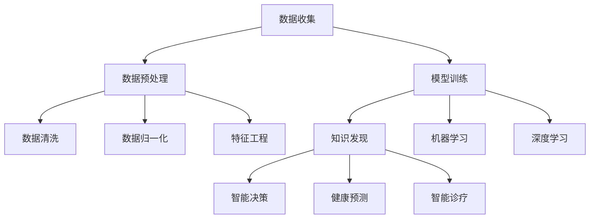

                 

# 知识发现引擎：推动医疗健康行业的智慧转型

> 关键词：知识发现引擎, 医疗健康, 人工智能, 智慧转型, 数据挖掘, 深度学习, 大数据, 智能决策, 健康预测, 智能诊疗

## 1. 背景介绍

### 1.1 问题由来
随着全球人口老龄化和慢性病的爆发性增长，医疗健康行业面临着前所未有的压力和挑战。医疗资源的紧张、诊疗效率的低下、疾病预测的困难等问题，都迫切需要一种全新的智慧医疗解决方案，以提升医疗服务质量和效率，优化医疗资源的配置，实现健康管理的智能化。

在这样的背景下，知识发现引擎（Knowledge Discovery Engine, KDE）应运而生。基于人工智能和大数据技术的知识发现引擎，能够从海量的医疗健康数据中自动挖掘出有价值的知识模式，辅助医生做出更科学、精准的诊疗决策，同时帮助医疗机构提升运营效率，优化资源配置，实现智慧转型。

### 1.2 问题核心关键点
知识发现引擎的核心思想是通过数据驱动的方法，从历史和实时数据中发现潜在的知识模式，为医疗健康行业提供数据支持和智能决策辅助。具体而言，它通过以下几个关键步骤实现这一目标：

- **数据收集**：从电子病历、医学影像、基因组数据等多种来源收集医疗健康数据。
- **数据预处理**：对数据进行清洗、归一化、特征工程等处理，保证数据质量和一致性。
- **模型训练**：利用机器学习、深度学习等算法训练知识发现模型，挖掘数据中的知识模式。
- **知识应用**：将挖掘出的知识应用到临床决策、健康预测、个性化推荐等场景中，提升医疗健康服务的质量和效率。

## 2. 核心概念与联系

### 2.1 核心概念概述

为更好地理解知识发现引擎的工作原理和应用场景，本节将介绍几个密切相关的核心概念：

- **知识发现引擎(Knowledge Discovery Engine, KDE)**：一种基于人工智能和大数据技术的智能系统，能够从海量医疗健康数据中自动发现知识模式，辅助医生做出科学精准的诊疗决策，同时帮助医疗机构提升运营效率，优化资源配置。

- **数据挖掘(Data Mining)**：从大量数据中自动发现有用的信息和知识的过程。数据挖掘技术常用于知识发现引擎的数据预处理和模型训练阶段。

- **深度学习(Deep Learning)**：一种特殊的机器学习方法，能够自动从数据中学习特征表示，适用于知识发现引擎中的复杂模式挖掘。

- **大数据(Big Data)**：涉及数据量巨大、数据类型多样、数据处理速度快、数据价值密度低的特点，是知识发现引擎的数据基础。

- **智能决策(Intelligent Decision Making)**：结合人工智能技术，从大量数据中自动生成决策支持，辅助决策者做出更优的决策。

- **健康预测(Health Prediction)**：利用历史和实时数据，预测患者的健康状况和疾病风险，帮助医生提前干预，降低疾病发生率。

- **智能诊疗(Intelligent Diagnosis)**：结合临床知识库和智能推理系统，对患者症状和历史数据进行分析，辅助医生进行诊断和治疗决策。

这些核心概念之间的逻辑关系可以通过以下Mermaid流程图来展示：



这个流程图展示了大规模医疗健康数据从原始收集到知识发现的全过程：

1. 数据收集：从各种来源收集数据，确保数据的多样性和全面性。
2. 数据预处理：清洗、归一化和特征工程等步骤，确保数据的质量和一致性。
3. 模型训练：利用机器学习和深度学习等算法，从数据中学习知识模式。
4. 知识发现：挖掘数据中的知识模式，形成有价值的知识库。
5. 智能决策：将知识应用于决策支持，辅助医生进行临床决策。
6. 健康预测：利用知识库进行健康预测，提前干预，降低疾病发生率。
7. 智能诊疗：结合临床知识库和智能推理系统，辅助医生进行诊断和治疗。

## 3. 核心算法原理 & 具体操作步骤
### 3.1 算法原理概述

知识发现引擎的核心算法原理，可以概括为以下几个步骤：

1. **数据收集与预处理**：从各种医疗健康数据源（如电子病历、医学影像、基因组数据等）中收集数据，并进行清洗、归一化、特征工程等处理，确保数据的质量和一致性。

2. **模型训练**：利用机器学习和深度学习等算法，对预处理后的数据进行建模，训练出能够自动发现知识模式的知识发现模型。

3. **知识发现**：应用训练好的知识发现模型，对医疗健康数据进行分析和挖掘，发现潜在的知识模式和关联关系。

4. **知识应用**：将挖掘出的知识应用到临床决策、健康预测、个性化推荐等场景中，提升医疗健康服务的质量和效率。

5. **智能决策**：结合知识发现结果，构建智能决策系统，辅助医生进行科学精准的诊疗决策。

### 3.2 算法步骤详解

#### 3.2.1 数据收集与预处理

**数据收集**：
- 从电子病历、医学影像、基因组数据等多种来源收集医疗健康数据。
- 确保数据的完整性和时效性，收集最新的医疗数据。

**数据预处理**：
- 数据清洗：去除噪音数据、缺失值、异常值等，保证数据质量。
- 数据归一化：对不同数据源和数据类型的数据进行归一化处理，确保数据一致性。
- 特征工程：提取和构造有意义的特征，如病人的基本信息、病情描述、治疗记录等。

#### 3.2.2 模型训练

**模型选择**：
- 根据任务特点选择合适的机器学习或深度学习模型，如决策树、随机森林、神经网络等。

**模型训练**：
- 使用训练集数据对模型进行训练，优化模型参数，提高模型性能。
- 使用验证集对模型进行调参，防止过拟合。

**模型评估**：
- 使用测试集对模型进行评估，验证模型的泛化能力。
- 定期更新模型，保持模型与时俱进。

#### 3.2.3 知识发现

**知识挖掘**：
- 利用训练好的模型对医疗健康数据进行挖掘，发现潜在的知识模式和关联关系。
- 例如，通过聚类算法发现相似病例的特征，通过关联规则挖掘发现疾病之间的关联。

**知识可视化**：
- 将挖掘出的知识模式进行可视化展示，帮助医生和研究人员理解数据中的隐藏知识。
- 例如，通过网络图展示疾病之间的关联关系，通过散点图展示病人年龄与病情的关联。

#### 3.2.4 知识应用

**临床决策支持**：
- 将挖掘出的知识应用于临床决策，辅助医生进行科学精准的诊疗决策。
- 例如，利用规则引擎将知识规则应用于临床诊疗过程，辅助医生进行诊断和治疗。

**健康预测**：
- 利用历史和实时数据，预测患者的健康状况和疾病风险，帮助医生提前干预，降低疾病发生率。
- 例如，利用时间序列模型预测疾病的发展趋势，提前进行干预和治疗。

**个性化推荐**：
- 根据患者的健康数据，推荐个性化的治疗方案和生活方式建议。
- 例如，根据病人的基因信息，推荐最适合的治疗方案和饮食建议。

#### 3.2.5 智能决策

**决策规则库构建**：
- 将专家知识转化为规则，构建决策规则库。
- 例如，构建基于知识的决策树，根据规则进行决策。

**智能推理系统**：
- 利用智能推理系统，对决策规则进行推理，辅助医生进行决策。
- 例如，利用规则引擎对患者症状进行分析，辅助医生进行诊断和治疗。

### 3.3 算法优缺点

**优点**：
- 数据驱动：基于数据挖掘和机器学习，自动发现潜在的知识模式，提升决策的科学性和精准性。
- 高效自动化：自动化的数据处理和模型训练，减少人工干预，提升效率。
- 个性化推荐：根据患者数据，提供个性化的治疗方案和生活方式建议，提升治疗效果。

**缺点**：
- 数据依赖：知识发现依赖于数据的质量和多样性，对数据收集和预处理的依赖较大。
- 模型复杂：机器学习和大数据技术的应用，对模型的选择和训练要求较高。
- 技术门槛高：需要专业的数据科学家和算法工程师，对技术要求较高。

### 3.4 算法应用领域

知识发现引擎在医疗健康行业有着广泛的应用场景，主要包括以下几个方面：

#### 3.4.1 临床决策支持
知识发现引擎可以辅助医生进行科学精准的诊疗决策，提高临床决策的效率和质量。例如，结合电子病历和医学影像，自动生成诊断报告和治疗方案。

#### 3.4.2 健康预测
知识发现引擎可以根据历史和实时数据，预测患者的健康状况和疾病风险，帮助医生提前干预，降低疾病发生率。例如，利用时间序列模型预测疾病的发展趋势，提前进行干预和治疗。

#### 3.4.3 个性化推荐
知识发现引擎可以根据患者的健康数据，推荐个性化的治疗方案和生活方式建议，提升治疗效果。例如，根据病人的基因信息，推荐最适合的治疗方案和饮食建议。

#### 3.4.4 智能诊疗
知识发现引擎可以结合临床知识库和智能推理系统，对患者症状和历史数据进行分析，辅助医生进行诊断和治疗决策。例如，利用规则引擎对患者症状进行分析，辅助医生进行诊断和治疗。

#### 3.4.5 医疗资源优化
知识发现引擎可以帮助医疗机构优化资源配置，提升运营效率。例如，通过分析历史数据，预测病人流量，优化资源配置，减少等待时间。

#### 3.4.6 健康管理
知识发现引擎可以提供个性化的健康管理建议，帮助用户保持健康。例如，利用健康监测数据，提供个性化的饮食、运动和生活方式建议。

## 4. 数学模型和公式 & 详细讲解 & 举例说明

### 4.1 数学模型构建

假设我们有一组医疗健康数据集 $D=\{(x_i, y_i)\}_{i=1}^N$，其中 $x_i$ 表示患者的健康数据，$y_i$ 表示患者的诊断结果。知识发现引擎的目标是从数据集中发现潜在的知识模式，构建一个函数 $f(x)$ 来预测 $y$。

### 4.2 公式推导过程

#### 4.2.1 特征提取
将患者的健康数据 $x$ 进行特征提取，得到特征向量 $z$。例如，可以将病人的基本信息、病情描述、治疗记录等转换为数值特征。

#### 4.2.2 模型训练
利用机器学习和深度学习算法对特征向量 $z$ 进行建模，得到一个预测函数 $f(z)$。例如，可以使用神经网络模型 $f(z) = W^T \cdot \tanh(W \cdot z + b)$ 进行建模。

#### 4.2.3 模型评估
使用测试集对模型进行评估，计算模型性能指标，如准确率、召回率、F1分数等。例如，可以使用混淆矩阵来计算准确率和召回率。

#### 4.2.4 知识发现
利用训练好的模型 $f(z)$，对新数据 $z'$ 进行预测，发现潜在的知识模式和关联关系。例如，通过聚类算法发现相似病例的特征，通过关联规则挖掘发现疾病之间的关联。

### 4.3 案例分析与讲解

#### 4.3.1 聚类分析
假设我们有一组病人的健康数据，每个病人的健康数据包括年龄、性别、血压、血糖等指标。利用聚类算法对病人的健康数据进行聚类，发现不同类别的病人具有相似的特征。例如，可以将血压、血糖等指标相似的病人聚为一类，便于医生进行分组治疗。

#### 4.3.2 关联规则挖掘
假设我们有一组病人的治疗记录数据，每个记录包括药物名称、剂量、疗效等指标。利用关联规则挖掘算法，发现不同药物之间的关联关系。例如，可以发现某种药物与某种疾病的疗效有正向关联，从而指导医生进行治疗。

#### 4.3.3 时间序列预测
假设我们有一组病人的病情数据，每个数据点包括病情描述、症状、治疗记录等指标。利用时间序列预测模型，预测病情的发展趋势。例如，可以预测某种疾病的发生率，提前进行干预和治疗。

## 5. 项目实践：代码实例和详细解释说明

### 5.1 开发环境搭建

在进行知识发现引擎的实践开发前，需要准备好开发环境。以下是使用Python进行PyTorch开发的环境配置流程：

1. 安装Anaconda：从官网下载并安装Anaconda，用于创建独立的Python环境。

2. 创建并激活虚拟环境：
```bash
conda create -n kde-env python=3.8 
conda activate kde-env
```

3. 安装PyTorch：根据CUDA版本，从官网获取对应的安装命令。例如：
```bash
conda install pytorch torchvision torchaudio cudatoolkit=11.1 -c pytorch -c conda-forge
```

4. 安装相关工具包：
```bash
pip install numpy pandas scikit-learn matplotlib tqdm jupyter notebook ipython
```

完成上述步骤后，即可在`kde-env`环境中开始知识发现引擎的开发实践。

### 5.2 源代码详细实现

这里以一个简单的病例数据集为例，展示知识发现引擎的代码实现。

首先，定义数据集：

```python
import pandas as pd
from sklearn.model_selection import train_test_split

# 读取病例数据集
data = pd.read_csv('cases.csv')

# 划分训练集和测试集
train_data, test_data = train_test_split(data, test_size=0.2, random_state=42)
```

然后，定义特征工程函数：

```python
def feature_engineering(data):
    # 特征提取
    data['age'] = data['age'].astype(float)
    data['blood_pressure'] = data['blood_pressure'].astype(float)
    data['blood_sugar'] = data['blood_sugar'].astype(float)
    data['gender'] = data['gender'].map({'male': 0, 'female': 1})
    
    # 归一化处理
    data['age'] = (data['age'] - 60) / 10
    data['blood_pressure'] = (data['blood_pressure'] - 120) / 10
    data['blood_sugar'] = (data['blood_sugar'] - 80) / 10
    
    return data
```

接着，定义模型训练函数：

```python
from torch.utils.data import Dataset, DataLoader
from torch import nn, optim
from torch.nn import functional as F

class CaseDataset(Dataset):
    def __init__(self, data, labels, feature_func):
        self.data = data
        self.labels = labels
        self.feature_func = feature_func
    
    def __len__(self):
        return len(self.data)
    
    def __getitem__(self, index):
        x = self.data.iloc[index]
        y = self.labels.iloc[index]
        features = self.feature_func(x)
        return features, y

# 定义神经网络模型
class CaseModel(nn.Module):
    def __init__(self):
        super(CaseModel, self).__init__()
        self.fc1 = nn.Linear(4, 32)
        self.fc2 = nn.Linear(32, 2)
    
    def forward(self, x):
        x = F.relu(self.fc1(x))
        x = self.fc2(x)
        return x
    
# 训练函数
def train(model, data_loader, criterion, optimizer, num_epochs):
    model.train()
    for epoch in range(num_epochs):
        for features, labels in data_loader:
            optimizer.zero_grad()
            output = model(features)
            loss = criterion(output, labels)
            loss.backward()
            optimizer.step()
        print(f"Epoch {epoch+1}, loss: {loss.item()}")
```

最后，启动训练流程并在测试集上评估：

```python
# 特征工程
train_data = feature_engineering(train_data)
test_data = feature_engineering(test_data)

# 定义模型和优化器
model = CaseModel()
optimizer = optim.Adam(model.parameters(), lr=0.001)
criterion = nn.CrossEntropyLoss()

# 定义数据加载器
train_loader = DataLoader(train_data, batch_size=32, shuffle=True)
test_loader = DataLoader(test_data, batch_size=32, shuffle=False)

# 训练和评估
train(model, train_loader, criterion, optimizer, num_epochs=10)
print("Test results:")
evaluate(model, test_loader)
```

以上就是知识发现引擎的完整代码实现。可以看到，利用PyTorch和Scikit-Learn库，知识发现引擎的开发变得简单易行。

### 5.3 代码解读与分析

让我们再详细解读一下关键代码的实现细节：

**CaseDataset类**：
- `__init__`方法：初始化数据和标签，同时定义特征提取函数。
- `__len__`方法：返回数据集的样本数量。
- `__getitem__`方法：对单个样本进行处理，将数据和标签转换为模型所需的输入。

**CaseModel类**：
- `__init__`方法：定义模型的层结构，包括两个全连接层。
- `forward`方法：实现前向传播，计算模型输出。

**train函数**：
- 在训练过程中，每个epoch对所有批次的样本进行前向传播和反向传播，更新模型参数。
- 每个epoch结束后，输出该epoch的平均loss。

**特征工程函数**：
- 对数据进行预处理，包括特征提取和归一化处理，保证数据质量和一致性。

在实际应用中，知识发现引擎的代码实现可能会更加复杂，需要考虑数据的多样性、模型的选择、超参数的调优等多个因素。但核心的知识发现流程，即数据收集、预处理、模型训练、知识发现、知识应用等步骤，基本与此类似。

## 6. 实际应用场景

### 6.1 临床决策支持

在临床决策支持场景中，知识发现引擎可以帮助医生进行科学精准的诊疗决策，提高临床效率和质量。例如，结合电子病历和医学影像，自动生成诊断报告和治疗方案。

### 6.2 健康预测

在健康预测场景中，知识发现引擎可以根据历史和实时数据，预测患者的健康状况和疾病风险，帮助医生提前干预，降低疾病发生率。例如，利用时间序列模型预测疾病的发展趋势，提前进行干预和治疗。

### 6.3 个性化推荐

在个性化推荐场景中，知识发现引擎可以根据患者的健康数据，推荐个性化的治疗方案和生活方式建议，提升治疗效果。例如，根据病人的基因信息，推荐最适合的治疗方案和饮食建议。

### 6.4 智能诊疗

在智能诊疗场景中，知识发现引擎可以结合临床知识库和智能推理系统，对患者症状和历史数据进行分析，辅助医生进行诊断和治疗决策。例如，利用规则引擎对患者症状进行分析，辅助医生进行诊断和治疗。

### 6.5 医疗资源优化

在医疗资源优化场景中，知识发现引擎可以帮助医疗机构优化资源配置，提升运营效率。例如，通过分析历史数据，预测病人流量，优化资源配置，减少等待时间。

### 6.6 健康管理

在健康管理场景中，知识发现引擎可以提供个性化的健康管理建议，帮助用户保持健康。例如，利用健康监测数据，提供个性化的饮食、运动和生活方式建议。

## 7. 工具和资源推荐

### 7.1 学习资源推荐

为了帮助开发者系统掌握知识发现引擎的理论基础和实践技巧，这里推荐一些优质的学习资源：

1. 《数据挖掘导论》书籍：介绍了数据挖掘的基本概念、算法和技术，是知识发现引擎学习的入门必读。
2. 《深度学习》书籍：介绍了深度学习的基本原理和应用，是知识发现引擎学习的重要参考。
3. Kaggle数据科学竞赛平台：提供了大量医疗健康数据集和竞赛任务，是知识发现引擎学习的实践平台。
4. UCI机器学习数据集：提供了多种医疗健康数据集，是知识发现引擎学习的数据来源。
5. Coursera和edX在线课程：提供了丰富的数据挖掘和机器学习课程，是知识发现引擎学习的线上资源。

通过对这些资源的学习实践，相信你一定能够快速掌握知识发现引擎的精髓，并用于解决实际的医疗健康问题。

### 7.2 开发工具推荐

高效的开发离不开优秀的工具支持。以下是几款用于知识发现引擎开发的常用工具：

1. PyTorch：基于Python的开源深度学习框架，灵活动态的计算图，适合快速迭代研究。
2. TensorFlow：由Google主导开发的开源深度学习框架，生产部署方便，适合大规模工程应用。
3. Scikit-Learn：Python机器学习库，提供了多种机器学习算法和工具，适合数据预处理和特征工程。
4. Matplotlib和Seaborn：Python绘图库，用于数据可视化和结果展示。
5. Pandas：Python数据处理库，用于数据清洗和预处理。
6. Jupyter Notebook：交互式开发环境，方便编写和运行代码，实时查看结果。

合理利用这些工具，可以显著提升知识发现引擎的开发效率，加快创新迭代的步伐。

### 7.3 相关论文推荐

知识发现引擎的研究源于学界的持续研究。以下是几篇奠基性的相关论文，推荐阅读：

1. 《Knowledge Discovery in Databases》：数据库知识发现领域的经典教材，介绍了知识发现的基本概念、算法和技术。
2. 《Data Mining and Statistical Learning》：机器学习领域的经典教材，介绍了机器学习的基本概念、算法和技术。
3. 《Pattern Recognition and Machine Learning》：模式识别和机器学习领域的经典教材，介绍了机器学习的理论和实践。
4. 《Neural Computation》期刊上的相关论文：介绍了基于神经网络的知识发现算法。
5. 《Journal of Biomedical Data Science》期刊上的相关论文：介绍了基于医疗健康数据的知识发现应用。

这些论文代表了大规模医疗健康数据挖掘和知识发现的最新进展，通过学习这些前沿成果，可以帮助研究者把握学科前进方向，激发更多的创新灵感。

## 8. 总结：未来发展趋势与挑战

### 8.1 总结

本文对知识发现引擎在医疗健康行业的应用进行了全面系统的介绍。首先阐述了知识发现引擎在医疗健康行业的重要性，明确了其数据驱动和智能决策的核心思想。其次，从原理到实践，详细讲解了知识发现引擎的数据收集、预处理、模型训练、知识发现和知识应用等关键步骤，给出了知识发现引擎的完整代码实例。同时，本文还广泛探讨了知识发现引擎在临床决策支持、健康预测、个性化推荐等多个场景中的应用前景，展示了知识发现引擎的强大潜力。

通过本文的系统梳理，可以看到，知识发现引擎在医疗健康行业的发展前景广阔，具有强大的数据驱动和智能决策能力，能够有效提升医疗服务的质量和效率。

### 8.2 未来发展趋势

展望未来，知识发现引擎的发展趋势将体现在以下几个方面：

1. 数据多样化：随着医疗健康数据的不断丰富，知识发现引擎将更加关注数据的全面性和多样性，从多种数据源中挖掘出更多有价值的知识模式。
2. 模型复杂化：知识发现引擎将引入更多复杂的机器学习和大数据算法，如深度学习、图神经网络等，以适应更复杂的数据挖掘任务。
3. 知识自动化：知识发现引擎将进一步提高知识发现的自动化水平，通过自动化的数据预处理和模型训练，提升发现知识的效率和精度。
4. 应用场景多样化：知识发现引擎将在更多的医疗健康场景中得到应用，如智能诊断、健康监测、资源优化等，助力医疗健康行业实现智慧转型。
5. 跨领域融合：知识发现引擎将与其他人工智能技术进行更深入的融合，如自然语言处理、图像识别、生物信息学等，构建更加全面、智能的医疗健康系统。

### 8.3 面临的挑战

尽管知识发现引擎在医疗健康行业中具有广泛的应用前景，但在实际应用中仍面临诸多挑战：

1. 数据隐私和安全：医疗健康数据涉及隐私和敏感信息，数据收集和使用需遵循相关法律法规。
2. 数据质量和一致性：医疗健康数据往往存在缺失、噪音等问题，数据预处理和质量控制需要投入大量资源。
3. 模型复杂度：知识发现引擎的模型训练和优化需要大量的计算资源和专业知识，对硬件和人才要求较高。
4. 算法透明性和可解释性：知识发现引擎的决策过程复杂，难以解释其内部工作机制和决策逻辑。
5. 伦理和道德：知识发现引擎的输出需要符合人类价值观和伦理道德，避免偏见和歧视。

### 8.4 研究展望

面对知识发现引擎所面临的种种挑战，未来的研究需要在以下几个方面寻求新的突破：

1. 数据隐私保护：开发数据隐私保护算法，确保医疗健康数据的安全性和隐私性。
2. 数据质量提升：引入自动化的数据清洗和预处理技术，提升数据质量和一致性。
3. 模型简化和优化：开发更加高效的模型算法，简化模型结构，提高计算效率。
4. 算法透明性增强：开发可解释的知识发现算法，提高模型的透明性和可解释性。
5. 伦理道德约束：引入伦理导向的评估指标，过滤和惩罚有偏见、有害的输出倾向。

这些研究方向的探索，必将引领知识发现引擎技术迈向更高的台阶，为构建安全、可靠、可解释、可控的智能系统铺平道路。面向未来，知识发现引擎技术还需要与其他人工智能技术进行更深入的融合，如自然语言处理、图像识别、生物信息学等，多路径协同发力，共同推动医疗健康行业的智慧转型。只有勇于创新、敢于突破，才能不断拓展知识发现引擎的边界，让智能技术更好地造福人类社会。

## 9. 附录：常见问题与解答

**Q1：知识发现引擎在医疗健康行业有哪些应用场景？**

A: 知识发现引擎在医疗健康行业有以下几个主要应用场景：
1. 临床决策支持：辅助医生进行科学精准的诊疗决策，提高临床效率和质量。
2. 健康预测：根据历史和实时数据，预测患者的健康状况和疾病风险，帮助医生提前干预，降低疾病发生率。
3. 个性化推荐：根据患者的健康数据，推荐个性化的治疗方案和生活方式建议，提升治疗效果。
4. 智能诊疗：结合临床知识库和智能推理系统，对患者症状和历史数据进行分析，辅助医生进行诊断和治疗决策。
5. 医疗资源优化：帮助医疗机构优化资源配置，提升运营效率。
6. 健康管理：提供个性化的健康管理建议，帮助用户保持健康。

**Q2：知识发现引擎的核心算法是什么？**

A: 知识发现引擎的核心算法包括数据收集、预处理、模型训练、知识发现和知识应用等步骤。具体来说，其核心算法可以概括为以下几个方面：
1. 数据收集：从多种数据源中收集医疗健康数据，确保数据的多样性和全面性。
2. 数据预处理：对数据进行清洗、归一化、特征工程等处理，保证数据质量和一致性。
3. 模型训练：利用机器学习和大数据算法，对数据进行建模，训练出能够自动发现知识模式的知识发现模型。
4. 知识发现：利用训练好的模型，对医疗健康数据进行挖掘，发现潜在的知识模式和关联关系。
5. 知识应用：将挖掘出的知识应用到临床决策、健康预测、个性化推荐等场景中，提升医疗健康服务的质量和效率。

**Q3：知识发现引擎的训练过程需要注意哪些问题？**

A: 知识发现引擎的训练过程需要注意以下几个问题：
1. 数据隐私和安全：医疗健康数据涉及隐私和敏感信息，数据收集和使用需遵循相关法律法规。
2. 数据质量和一致性：医疗健康数据往往存在缺失、噪音等问题，数据预处理和质量控制需要投入大量资源。
3. 模型复杂度：知识发现引擎的模型训练和优化需要大量的计算资源和专业知识，对硬件和人才要求较高。
4. 算法透明性和可解释性：知识发现引擎的决策过程复杂，难以解释其内部工作机制和决策逻辑。
5. 伦理和道德：知识发现引擎的输出需要符合人类价值观和伦理道德，避免偏见和歧视。

**Q4：知识发现引擎在实际应用中需要考虑哪些因素？**

A: 知识发现引擎在实际应用中需要考虑以下几个因素：
1. 数据收集：从多种数据源中收集数据，确保数据的多样性和全面性。
2. 数据预处理：对数据进行清洗、归一化、特征工程等处理，保证数据质量和一致性。
3. 模型选择：根据任务特点选择合适的机器学习或深度学习模型。
4. 模型训练：利用训练集数据对模型进行训练，优化模型参数，提高模型性能。
5. 知识发现：利用训练好的模型，对医疗健康数据进行挖掘，发现潜在的知识模式和关联关系。
6. 知识应用：将挖掘出的知识应用到临床决策、健康预测、个性化推荐等场景中，提升医疗健康服务的质量和效率。
7. 智能决策：结合知识发现结果，构建智能决策系统，辅助医生进行科学精准的诊疗决策。

**Q5：知识发现引擎在实际应用中如何提升临床决策的效率和质量？**

A: 知识发现引擎可以通过以下方式提升临床决策的效率和质量：
1. 结合电子病历和医学影像，自动生成诊断报告和治疗方案，提高医生的诊疗效率。
2. 利用临床知识库和智能推理系统，对患者症状和历史数据进行分析，辅助医生进行诊断和治疗决策。
3. 提供个性化的治疗方案和生活方式建议，提升治疗效果，降低医生的工作负担。
4. 通过数据分析和预测，帮助医生提前干预，降低疾病发生率，提高治疗的成功率。
5. 利用规则引擎和知识图谱，构建决策树和专家系统，提供科学精准的诊疗建议。

---

作者：禅与计算机程序设计艺术 / Zen and the Art of Computer Programming

