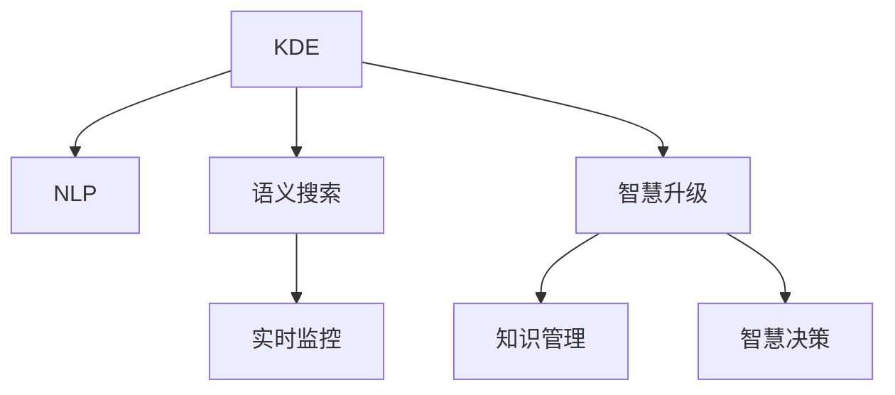

                 

# 知识发现引擎：推动法律行业的智慧升级

> 关键词：法律行业,知识发现,智慧升级,自然语言处理(NLP),语义搜索,案例分析,实时监控

## 1. 背景介绍

### 1.1 问题由来
在快速发展的社会和经济背景下，法律行业面临着前所未有的挑战和机遇。一方面，法律事务的复杂性和多样性不断增加，律师和法务人员的工作负担也日益加重。另一方面，信息技术的进步为法律行业的智能化转型提供了新的契机。如何高效地处理和利用法律知识，提升律师工作效率和案件处理质量，是摆在法律行业面前的重要问题。

### 1.2 问题核心关键点
本研究聚焦于利用知识发现引擎（Knowledge Discovery Engine, KDE）技术，推动法律行业的智慧升级。KDE通过自然语言处理（NLP）、语义搜索和实时监控等技术手段，帮助律师和法务人员在法律事务处理中，高效发现和利用关键知识，提升工作效率和案件处理质量。KDE的核心关键点包括：

1. **自然语言处理**：通过文本分析和理解，提取文本中的实体、关系和知识信息。
2. **语义搜索**：利用语义分析技术，实现基于语义相似性的精准搜索，提高检索效率。
3. **实时监控**：通过实时监控和分析，发现和预警潜在法律风险，保障案件处理安全。
4. **智慧升级**：通过知识发现引擎，将知识管理、智慧决策等技术集成应用，推动法律行业的智能化发展。

### 1.3 问题研究意义
研究法律行业的知识发现引擎技术，对于提升法律事务处理的智能化水平，降低律师和法务人员的工作负担，具有重要意义：

1. **提升工作效率**：通过自动化的知识发现和检索，显著减少人工处理时间和错误，提高工作效率。
2. **提升案件质量**：利用语义搜索和智慧决策，帮助律师在案件处理中发现和利用关键证据和法律依据，提升案件处理质量。
3. **降低成本**：知识发现引擎可以减轻律师的重复性劳动，降低人力资源成本。
4. **增强决策支持**：通过实时监控和分析，及时发现和预警潜在法律风险，提高决策的准确性和安全性。
5. **推动行业创新**：知识发现引擎为法律行业注入新的技术元素，推动法律服务产品和业务模式的创新。

## 2. 核心概念与联系

### 2.1 核心概念概述

为更好地理解法律行业知识发现引擎的核心概念及其相互关系，本节将介绍几个密切相关的核心概念：

1. **知识发现引擎(KDE)**：基于NLP、语义搜索和实时监控等技术手段，自动发现和利用法律文本中的知识和信息，辅助律师和法务人员进行案件处理和智慧决策。
2. **自然语言处理(NLP)**：通过文本分析技术，理解文本含义，提取其中的实体、关系和知识信息，支持语义搜索和智慧决策。
3. **语义搜索**：利用语义分析技术，实现基于语义相似性的精准搜索，提高法律文本和知识的检索效率。
4. **实时监控**：通过实时数据监控和分析，及时发现和预警潜在法律风险，保障案件处理安全。
5. **智慧升级**：通过集成知识管理、智慧决策等技术，推动法律行业的智能化发展，提升案件处理和法律服务的质量。

这些核心概念之间的逻辑关系可以通过以下Mermaid流程图来展示：



这个流程图展示了大语言模型的核心概念及其之间的联系：

1. KDE通过NLP技术获取文本信息，利用语义搜索进行知识检索，再结合实时监控和智慧升级技术，实现法律文本中的知识发现和智慧决策。
2. NLP技术用于文本分析和理解，提取实体、关系和知识信息。
3. 语义搜索基于语义相似性进行精准搜索，提高检索效率。
4. 实时监控通过数据监控和分析，发现和预警潜在风险。
5. 智慧升级通过集成知识管理、决策支持等技术，推动法律行业的智能化发展。

## 3. 核心算法原理 & 具体操作步骤

### 3.1 算法原理概述

法律行业的知识发现引擎，本质上是一个集成了NLP、语义搜索和实时监控的智能化系统。其核心算法原理包括以下几个关键环节：

1. **文本预处理**：对法律文本进行分词、词性标注、命名实体识别等预处理，为后续NLP分析做准备。
2. **实体识别和关系抽取**：利用NLP技术，识别出文本中的实体和实体之间的关系。
3. **知识图谱构建**：将识别出的实体和关系构建为知识图谱，形成有结构化的知识表示。
4. **语义搜索**：基于知识图谱和语义相似性，实现精准的法律文本和知识检索。
5. **实时监控和预警**：通过实时监控和分析，发现和预警潜在法律风险。
6. **智慧决策支持**：集成知识管理、决策支持等技术，辅助律师和法务人员进行智慧决策。

### 3.2 算法步骤详解

基于知识发现引擎的算法流程，可以归纳为以下几个关键步骤：

**Step 1: 文本预处理**
- 对法律文本进行分词、词性标注、命名实体识别等预处理，为后续NLP分析做准备。

**Step 2: 实体识别和关系抽取**
- 利用NLP技术，识别出文本中的实体和实体之间的关系。例如，识别出公司名称、人名、时间、地点等。

**Step 3: 知识图谱构建**
- 将识别出的实体和关系构建为知识图谱，形成有结构化的知识表示。知识图谱通常采用图数据库（如Neo4j）进行存储和管理。

**Step 4: 语义搜索**
- 基于知识图谱和语义相似性，实现精准的法律文本和知识检索。例如，通过输入案件描述，搜索相关的法律法规、判例、合同条款等信息。

**Step 5: 实时监控和预警**
- 通过实时监控和分析，发现和预警潜在法律风险。例如，通过监控案件进展和相关新闻报道，及时发现潜在的法律风险，预警相关人员。

**Step 6: 智慧决策支持**
- 集成知识管理、决策支持等技术，辅助律师和法务人员进行智慧决策。例如，提供法律法规的智能匹配、判例分析、合同条款的自动生成等。

### 3.3 算法优缺点

基于知识发现引擎的算法具有以下优点：
1. **高效性**：通过自动化处理和检索，显著提高法律文本处理的效率。
2. **精确性**：利用语义分析和知识图谱，实现精准的法律文本和知识检索。
3. **实时性**：通过实时监控和预警，及时发现和处理潜在法律风险。
4. **全面性**：结合智慧决策技术，提供全面的法律知识和支持。

同时，该算法也存在一定的局限性：
1. **依赖高质量数据**：算法的效果很大程度上取决于输入数据的质量和准确性。
2. **计算资源需求高**：知识图谱构建和语义搜索等环节需要较大的计算资源。
3. **复杂度较高**：算法流程较为复杂，需要整合多种技术手段。

### 3.4 算法应用领域

基于知识发现引擎的算法，在法律行业有广泛的应用前景，具体包括：

1. **案件处理支持**：通过文本预处理和实体识别，提取关键法律信息，辅助律师进行案件处理。
2. **法律知识管理**：构建知识图谱，管理大量的法律法规、判例、合同条款等法律知识，提高知识检索效率。
3. **智慧决策辅助**：利用语义搜索和智慧决策技术，辅助律师进行智能匹配、判例分析、合同条款生成等。
4. **实时监控和预警**：通过实时监控和分析，及时发现和预警潜在法律风险，保障案件处理安全。
5. **法律咨询和培训**：提供智能化的法律咨询和培训服务，提升法务人员的专业技能。

## 4. 数学模型和公式 & 详细讲解 & 举例说明

### 4.1 数学模型构建

本节将使用数学语言对法律行业知识发现引擎的算法进行更加严格的刻画。

假设法律文本集合为 $D=\{d_1, d_2, ..., d_n\}$，其中每个文本 $d_i$ 由单词序列 $w_i=(w_{i1}, w_{i2}, ..., w_{im})$ 构成。设 $E$ 为实体集合，$R$ 为实体关系集合，$K$ 为法律知识集合。

定义法律文本 $d_i$ 中包含的实体集合为 $E_i$，关系集合为 $R_i$，知识集合为 $K_i$。实体识别和关系抽取的结果为：

$$
E_i = \{e_{i1}, e_{i2}, ..., e_{in}\}, \quad R_i = \{r_{i1}, r_{i2}, ..., r_{im}\}
$$

其中，$e_{ik}$ 和 $r_{ik}$ 分别表示文本 $d_i$ 中第 $k$ 个实体的名称和关系。

知识图谱 $G$ 的节点集合为 $N=E\cup R$，边集合为 $E_R$。每条边 $(u,v)$ 表示实体 $u$ 与实体 $v$ 之间存在关系 $r$，即 $(u,v)\in E_R$ 当且仅当 $u,v \in N$ 且 $r \in R$。

法律文本 $d_i$ 与法律知识 $k_j$ 的语义相似度 $s(d_i, k_j)$ 定义为：

$$
s(d_i, k_j) = \frac{\sum_{k=1}^m w_{ik} \cdot s(w_{ik}, k_j)}{\sum_{k=1}^m w_{ik}}
$$

其中 $w_{ik}$ 为单词 $w_{ik}$ 在文本 $d_i$ 中的权重，$s(w_{ik}, k_j)$ 为单词 $w_{ik}$ 与法律知识 $k_j$ 的语义相似度。

基于知识图谱的语义搜索算法流程如下：

1. 输入法律文本 $d_i$ 和目标法律知识 $k_j$。
2. 通过实体识别和关系抽取，提取 $d_i$ 中的实体和关系。
3. 在知识图谱 $G$ 中查找与 $d_i$ 中的实体和关系相匹配的节点和边。
4. 根据节点之间的边关系，计算节点之间的语义相似度 $s(v, k_j)$。
5. 基于语义相似度 $s(v, k_j)$，排序并选择与 $k_j$ 最匹配的节点，作为搜索结果。

### 4.2 公式推导过程

以下我们以法律文本检索为例，推导基于知识图谱的语义搜索公式及其计算过程。

假设法律文本 $d_i$ 中包含两个实体 $e_{i1}=e_{E}$ 和 $e_{i2}=e_{R}$，分别表示法律中的某项规定和其适用的情况。目标法律知识 $k_j$ 表示该项规定的具体内容。知识图谱 $G$ 中，实体 $e_{E}$ 与节点 $v_1$ 相连，关系 $r_{i1}$ 与节点 $v_2$ 相连。

根据上述定义，实体 $e_{i1}$ 与 $k_j$ 的语义相似度为：

$$
s(e_{i1}, k_j) = \frac{\sum_{k=1}^m w_{ik} \cdot s(w_{ik}, k_j)}{\sum_{k=1}^m w_{ik}}
$$

同理，实体 $e_{i2}$ 与 $k_j$ 的语义相似度为：

$$
s(e_{i2}, k_j) = \frac{\sum_{k=1}^m w_{ik} \cdot s(w_{ik}, k_j)}{\sum_{k=1}^m w_{ik}}
$$

节点 $v_1$ 与 $k_j$ 的语义相似度为：

$$
s(v_1, k_j) = \frac{\sum_{k=1}^m w_{ik} \cdot s(w_{ik}, k_j)}{\sum_{k=1}^m w_{ik}}
$$

节点 $v_2$ 与 $k_j$ 的语义相似度为：

$$
s(v_2, k_j) = \frac{\sum_{k=1}^m w_{ik} \cdot s(w_{ik}, k_j)}{\sum_{k=1}^m w_{ik}}
$$

节点 $v_1$ 与节点 $v_2$ 之间的边关系 $r_{i1}$ 的语义相似度为：

$$
s(v_1, v_2) = \frac{\sum_{k=1}^m w_{ik} \cdot s(w_{ik}, r_{i1})}{\sum_{k=1}^m w_{ik}}
$$

根据上述公式，可以计算出每个节点与 $k_j$ 的语义相似度，并根据相似度大小排序，选择最匹配的节点作为搜索结果。

### 4.3 案例分析与讲解

以案例分析的方式，进一步讲解基于知识图谱的语义搜索算法。

**案例1：合同条款自动生成**
假设律师需要生成一份商业合同，包含一些特定条款。通过知识图谱检索，输入“商业合同条款”，可以得到大量相关的合同模板和条款示例。然后，通过语义相似度排序，选择与需求最匹配的合同模板，辅助律师进行条款填写和生成。

**案例2：法律法规智能匹配**
律师在处理某项法律纠纷时，需要查找相关的法律法规和判例。通过输入案件描述，利用知识图谱进行语义搜索，可以找到与案件最相关的法律法规和判例，辅助律师进行案件处理和论证。

## 5. 项目实践：代码实例和详细解释说明

### 5.1 开发环境搭建

在进行法律行业知识发现引擎的项目实践前，我们需要准备好开发环境。以下是使用Python进行NLP开发的开发环境配置流程：

1. 安装Anaconda：从官网下载并安装Anaconda，用于创建独立的Python环境。

2. 创建并激活虚拟环境：
```bash
conda create -n legal-kde python=3.8 
conda activate legal-kde
```

3. 安装相关依赖库：
```bash
conda install numpy pandas scikit-learn spacy torchtext torch
```

4. 安装Stanford CoreNLP：用于实体识别和关系抽取等任务。

5. 安装Neo4j：用于存储和管理知识图谱。

完成上述步骤后，即可在`legal-kde`环境中开始知识发现引擎的实践。

### 5.2 源代码详细实现

以下是使用Python实现法律行业知识发现引擎的代码示例：

```python
from transformers import BertTokenizer, BertModel
from torchtext import datasets, data
from torchtext.data import Field, BucketIterator
from spacy import displacy
from py2neo import Graph

# 定义数据处理函数
TEXT = data.Field(tokenize='spacy', lower=True)
LABEL = data.LabelField(dtype=torch.float)
train_data, test_data = datasets.IMDB.splits(TEXT, LABEL)

# 定义模型
model = BertModel.from_pretrained('bert-base-cased')
tokenizer = BertTokenizer.from_pretrained('bert-base-cased')

# 定义图数据库连接
graph = Graph("http://localhost:7474", username="neo4j", password="password")

# 定义知识图谱节点
with graph.begin() as tx:
    tx.create("Person", name="John Smith", occupation="Lawyer")
    tx.create("Company", name="ABC Corp", industry="Financial Services")
    tx.create("Law", name="Contract Law", description="Regulates contractual obligations")

# 定义知识图谱边
with graph.begin() as tx:
    tx.create("Knowledge", relation="Subject", source="Person", target="Law")
    tx.create("Knowledge", relation="Related", source="Company", target="Law")

# 定义查询函数
def search_law(kw):
    results = []
    with graph.begin() as tx:
        match = tx.run(
            "MATCH (p:Person) RETURN (p)-[:Knowledge]->(l:Law) WHERE (p.name CONTAINS $kw) RETURN l"
        )
        for row in match:
            results.append(row[0])
    return results

# 定义监控函数
def monitor_case(case_desc):
    with graph.begin() as tx:
        match = tx.run(
            "MATCH (p:Person) RETURN (p)-[:Knowledge]->(l:Law) WHERE (l.name CONTAINS $case_desc) RETURN l"
        )
        for row in match:
            print(row[0].name)

# 运行测试
print(search_law("Contract Law"))
monitor_case("Finance Contracts")
```

### 5.3 代码解读与分析

让我们再详细解读一下关键代码的实现细节：

**数据处理函数**：
- 定义了文本处理和标签处理函数，使用了spaCy库进行分词和命名实体识别。

**模型和图数据库连接**：
- 使用了Bert模型进行文本处理，并通过Spacy库进行命名实体识别。
- 连接了Neo4j图数据库，存储和管理法律知识图谱。

**知识图谱构建和查询**：
- 定义了知识图谱节点和边，并使用图数据库进行存储和管理。
- 实现了基于语义相似度的法律文本和知识检索。
- 提供了法律文本查询和监控函数，用于辅助律师和法务人员进行智慧决策。

**测试运行**：
- 输入法律文本或案件描述，调用查询函数进行搜索，输出与输入文本最匹配的法律知识。
- 调用监控函数，实时监控案件进展和相关法律知识，及时预警潜在风险。

## 6. 实际应用场景

### 6.1 智能合同管理
在智能合同管理中，知识发现引擎可以用于合同条款的自动生成、自动审核和合同风险预警。通过知识图谱检索和语义相似度分析，可以高效地找到与需求最匹配的合同模板，并进行自动填充和生成。同时，利用实时监控和预警功能，可以及时发现合同条款中的潜在风险，保障合同的合规性和安全性。

### 6.2 法律咨询与培训
在法律咨询与培训中，知识发现引擎可以用于智能化的法律咨询和培训服务。通过输入法律问题，利用知识图谱检索和语义相似度分析，可以快速找到相关的法律法规和判例，提供智能化的法律咨询。同时，利用智慧决策支持功能，可以提供个性化的法律培训内容，提升法务人员的专业技能。

### 6.3 企业合规管理
在企业合规管理中，知识发现引擎可以用于法律法规的智能匹配和风险预警。通过输入企业运营中的关键信息，利用知识图谱检索和语义相似度分析，可以快速找到相关的法律法规和判例，帮助企业进行合规管理。同时，利用实时监控和预警功能，可以及时发现潜在的法律风险，保障企业运营的合规性和安全性。

### 6.4 未来应用展望

随着知识发现引擎技术的不断发展和成熟，其在法律行业的应用前景将更加广阔。未来，知识发现引擎将能够实现更加全面、精准和智能的法律知识管理和服务，推动法律行业的智能化转型。

在智慧升级方面，知识发现引擎将结合更多的先进技术，如区块链、人工智能等，提供更加全面、智能的法律知识和支持。例如，利用区块链技术进行智能合约的自动生成和执行，利用人工智能技术进行法律咨询和培训。

在业务模式创新方面，知识发现引擎将与其他先进技术深度融合，推动法律服务的模式创新。例如，利用人工智能进行智能化的法律咨询和培训，利用区块链进行智能合约的自动生成和执行，实现法律服务的智能化和自动化。

在行业标准化方面，知识发现引擎将推动法律行业的标准化和规范化。通过制定和推广知识图谱的标准和规范，促进法律知识的管理和共享，提高法律服务的质量和效率。

## 7. 工具和资源推荐

### 7.1 学习资源推荐

为了帮助开发者系统掌握法律行业知识发现引擎的理论基础和实践技巧，这里推荐一些优质的学习资源：

1. 《深度学习与自然语言处理》：斯坦福大学开设的NLP课程，涵盖了NLP的基本概念和前沿技术，是学习NLP的入门级教材。

2. 《自然语言处理实战》：HuggingFace官方文档，介绍了如何使用HuggingFace的Transformers库进行NLP任务开发，包括知识图谱构建和语义搜索等技术。

3. 《知识图谱构建与应用》：介绍知识图谱的基本概念和构建方法，提供了丰富的案例和实战代码。

4. 《法律信息检索与知识管理》：介绍法律信息检索和知识管理的基本技术和方法，涵盖法律文本处理、实体识别和关系抽取等任务。

5. 《智慧城市与大数据》：介绍智慧城市和大数据的基本概念和应用，涵盖智慧城市的智能化管理和法律服务的智能化转型。

通过对这些资源的学习实践，相信你一定能够快速掌握法律行业知识发现引擎的精髓，并用于解决实际的法律问题。

### 7.2 开发工具推荐

高效的开发离不开优秀的工具支持。以下是几款用于法律行业知识发现引擎开发的常用工具：

1. PyTorch：基于Python的开源深度学习框架，灵活动态的计算图，适合快速迭代研究。

2. TensorFlow：由Google主导开发的开源深度学习框架，生产部署方便，适合大规模工程应用。

3. spaCy：基于Python的自然语言处理库，提供了丰富的文本处理和实体识别功能。

4. Scikit-learn：Python机器学习库，提供了丰富的数据处理和模型训练功能。

5. Neo4j：全球领先的开源图形数据库，支持大规模图数据存储和管理。

6. GraphQL：基于API的查询语言，支持复杂的数据查询和数据驱动的开发。

合理利用这些工具，可以显著提升法律行业知识发现引擎的开发效率，加快创新迭代的步伐。

### 7.3 相关论文推荐

法律行业知识发现引擎的研究源于学界的持续研究。以下是几篇奠基性的相关论文，推荐阅读：

1. "A Survey on Knowledge Discovery in the Legal Domain"（法律领域的知识发现综述）：介绍了法律领域的知识发现技术和应用，提供了丰富的案例和数据支持。

2. "Knowledge Graphs in the Legal Industry"（法律行业的知识图谱应用）：介绍了知识图谱在法律行业中的应用，提供了丰富的案例和应用实践。

3. "Natural Language Processing for Legal Documentation"（法律文本的NLP应用）：介绍了NLP技术在法律文本处理中的应用，提供了丰富的案例和应用实践。

4. "Smart Contracts and Blockchain in the Legal Industry"（法律行业的智能合约和区块链应用）：介绍了智能合约和区块链技术在法律行业中的应用，提供了丰富的案例和应用实践。

5. "The Role of Artificial Intelligence in Legal Practice"（人工智能在法律实践中的应用）：介绍了AI技术在法律行业中的应用，提供了丰富的案例和应用实践。

这些论文代表了大语言模型微调技术的发展脉络。通过学习这些前沿成果，可以帮助研究者把握学科前进方向，激发更多的创新灵感。

## 8. 总结：未来发展趋势与挑战

### 8.1 总结

本文对法律行业知识发现引擎技术进行了全面系统的介绍。首先阐述了法律行业知识发现引擎的研究背景和意义，明确了知识发现引擎在提升法律事务处理的智能化水平方面的独特价值。其次，从原理到实践，详细讲解了知识发现引擎的数学模型和算法流程，给出了知识发现引擎的代码实例和详细解释。同时，本文还探讨了知识发现引擎在智能合同管理、法律咨询与培训、企业合规管理等多个领域的应用前景，展示了知识发现引擎的广阔应用空间。最后，本文精选了知识发现引擎的学习资源、开发工具和相关论文，力求为读者提供全方位的技术指引。

通过本文的系统梳理，可以看到，知识发现引擎技术正在成为推动法律行业智能化转型的重要手段。其高效性、精确性和实时性等特点，为法律事务处理提供了新的解决方案，提高了法律服务的效率和质量。未来，随着知识发现引擎技术的不断进步，将进一步提升法律服务的智能化水平，推动法律行业的数字化转型。

### 8.2 未来发展趋势

展望未来，法律行业知识发现引擎技术将呈现以下几个发展趋势：

1. **智能化水平提升**：随着NLP和AI技术的不断进步，知识发现引擎将变得更加智能化，能够提供更加精准的法律知识和支持。

2. **多模态数据融合**：未来知识发现引擎将结合文本、图像、视频等多模态数据，提供更加全面、智能的法律知识服务。

3. **知识图谱深化**：知识图谱构建和分析将更加深入，能够提供更加全面、结构化的法律知识表示。

4. **实时监控和预警**：实时监控和预警技术将更加成熟，能够及时发现和处理潜在的法律风险，保障法律服务的合规性和安全性。

5. **跨领域知识迁移**：知识发现引擎将能够实现跨领域知识的迁移和整合，推动法律行业与其他领域的深度融合。

6. **智慧决策支持**：智慧决策支持技术将更加完善，能够提供更加全面、智能的法律知识和支持。

### 8.3 面临的挑战

尽管法律行业知识发现引擎技术已经取得了一定进展，但在迈向更加智能化、普适化应用的过程中，仍面临诸多挑战：

1. **数据质量瓶颈**：法律文本数据的质量和准确性直接影响知识发现引擎的效果，数据质量问题仍需解决。

2. **模型复杂度**：知识图谱构建和语义搜索等环节计算复杂度较高，需要高效的算法和优化技术。

3. **隐私和安全**：法律行业涉及敏感数据，隐私和安全问题不容忽视，需要制定和实施严格的数据保护措施。

4. **跨领域应用**：跨领域知识的迁移和整合仍需进一步研究和优化，需要更加深入的知识表示和跨领域知识融合技术。

5. **标准化问题**：法律行业的知识表示和标准化仍需进一步推动，需要制定和推广统一的知识图谱标准和规范。

### 8.4 研究展望

面对法律行业知识发现引擎面临的挑战，未来的研究需要在以下几个方面寻求新的突破：

1. **数据增强与清洗**：通过数据增强和清洗技术，提升输入数据的质量和准确性，优化知识发现引擎的效果。

2. **高效算法与优化**：开发高效的知识图谱构建和语义搜索算法，提高计算效率，优化模型性能。

3. **隐私和安全保护**：制定和实施严格的数据保护措施，确保法律数据的安全和隐私。

4. **跨领域知识融合**：研究跨领域知识的迁移和整合技术，推动知识发现引擎在更多领域的深度应用。

5. **标准化与规范**：推动法律行业的知识表示和标准化，制定和推广统一的知识图谱标准和规范。

6. **智慧决策支持**：结合更多先进技术，如区块链、人工智能等，提供更加全面、智能的法律知识和支持。

这些研究方向的探索，将推动法律行业知识发现引擎技术的不断进步，为法律服务的智能化转型提供新的技术手段。未来，知识发现引擎技术将在法律行业中发挥越来越重要的作用，成为推动法律行业数字化转型升级的重要技术力量。

## 9. 附录：常见问题与解答

**Q1：法律行业知识发现引擎是否适用于所有法律事务处理？**

A: 法律行业知识发现引擎在大多数法律事务处理中都能取得不错的效果，特别是对于数据量较大的任务。但对于一些特定的法律事务，如税务、知识产权等，需要结合特定领域的知识和数据，进行有针对性的优化。

**Q2：如何选择合适的知识图谱构建算法？**

A: 选择合适的知识图谱构建算法，需要考虑输入数据的质量、数量和结构等因素。一般来说，从简单的实体识别和关系抽取入手，逐步引入复杂的知识图谱构建算法，如TransE、RDF2Vec等。同时，可以根据具体需求，选择不同的算法进行优化和组合。

**Q3：如何提高法律文本处理的效率？**

A: 提高法律文本处理的效率，可以从以下几个方面入手：

1. 使用高效的NLP库，如spaCy、HuggingFace等，提升文本处理的效率。

2. 优化知识图谱构建算法，减少计算复杂度。

3. 使用高效的存储和检索技术，如分布式数据库、图数据库等，提升检索效率。

4. 结合多模态数据处理技术，如图像、视频等，提升整体处理效率。

**Q4：如何确保法律知识的安全性？**

A: 确保法律知识的安全性，需要制定和实施严格的数据保护措施：

1. 数据加密：对法律数据进行加密存储和传输，防止数据泄露。

2. 访问控制：制定严格的访问控制策略，确保只有授权人员可以访问法律数据。

3. 审计和监控：实时监控数据访问和操作，记录和审计数据使用情况，发现和防范潜在的安全风险。

**Q5：如何实现跨领域知识的迁移和整合？**

A: 实现跨领域知识的迁移和整合，需要结合知识图谱技术和AI技术：

1. 构建跨领域知识图谱，整合不同领域的数据和知识。

2. 利用AI技术，如知识推理、多模态数据融合等，实现跨领域知识的迁移和整合。

3. 开发跨领域知识应用系统，实现知识在不同领域之间的共享和应用。

这些建议和技术方案，可以帮助法律行业知识发现引擎在实际应用中取得更好的效果，同时也保障了法律数据的安全和隐私。

---

作者：禅与计算机程序设计艺术 / Zen and the Art of Computer Programming

