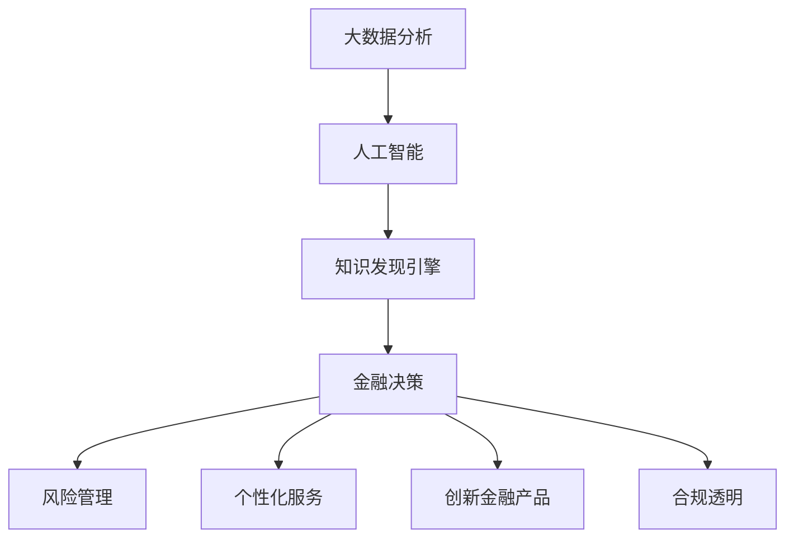

                 

# 知识发现引擎：推动金融行业的智慧转型

> 关键词：知识发现引擎,金融行业智慧转型,大数据分析,人工智能,机器学习,自然语言处理

## 1. 背景介绍

### 1.1 问题由来
在过去几十年里，金融行业经历了飞速发展。伴随经济全球化、互联网普及和技术进步，金融行业已逐步从传统的线下操作，向线上、智能化的数字运营转型。在这一过程中，数据和技术的融合，使得金融服务更加高效、精准、个性化。但同时，也带来了一系列新的挑战。

### 1.2 问题核心关键点
1. **数据量激增**：金融行业拥有海量的数据，包括交易记录、市场波动、用户行为等。如何高效、智能地利用这些数据，是金融决策的关键。
2. **模型复杂性**：金融模型涉及多种算法，如信用评估、风险管理、投资策略等，模型参数繁多，计算量大。如何简化模型，提高效率，是一大挑战。
3. **动态环境**：金融市场瞬息万变，数据和市场环境经常变化。如何构建动态模型，保证决策实时准确，是一个重要课题。
4. **法规合规**：金融业务高度受法规监管，要求模型具备合规性和可解释性。如何在确保合规的前提下，提升模型性能，是一大难点。
5. **业务融合**：金融业务复杂多样，需要与信贷、保险、证券等多个子领域深度融合。如何在不同领域中有效应用模型，是一大难题。

### 1.3 问题研究意义
构建知识发现引擎，通过大数据分析和人工智能技术，对金融行业的数据进行深度挖掘和智能处理，具有以下重要意义：

1. **提升决策效率**：通过模型优化和智能算法，能够快速准确地分析大量数据，提升金融决策的速度和精度。
2. **优化风控体系**：通过动态监测和模型更新，能实时应对市场风险，提高金融风险管理的水平。
3. **个性化服务**：利用深度学习技术，能够针对不同用户提供定制化服务，提升用户体验。
4. **创新金融产品**：结合先进的数据分析和预测技术，能够开发出更多创新的金融产品，拓展市场空间。
5. **合规透明**：知识发现引擎的模型透明、可解释，能够更好地满足监管要求，保护用户隐私。

## 2. 核心概念与联系

### 2.1 核心概念概述

构建知识发现引擎，需要理解几个关键概念：

- **知识发现引擎**：通过数据挖掘、机器学习等技术，从大量金融数据中提取有价值的信息和模式，支持金融决策和业务分析的引擎。
- **大数据分析**：采用分布式计算、并行处理等技术，对海量金融数据进行存储、处理和分析，从中提取有意义的知识和洞见。
- **人工智能**：结合机器学习、深度学习等算法，实现自动化、智能化的金融决策过程。
- **自然语言处理(NLP)**：通过文本处理、情感分析等技术，从非结构化金融文本数据中提取有用的信息。
- **金融风险管理**：通过预测模型、风控策略等技术，对金融风险进行评估和控制。

这些概念之间存在紧密联系，通过大数据分析和人工智能技术，能够从金融数据中挖掘出有价值的信息，构建知识发现引擎，支持金融决策和业务分析，最终实现智慧转型的目标。

### 2.2 核心概念原理和架构的 Mermaid 流程图



该流程图展示了知识发现引擎的核心架构和工作流程。

## 3. 核心算法原理 & 具体操作步骤

### 3.1 算法原理概述

知识发现引擎的核心算法，主要包括以下几个方面：

1. **数据预处理**：对金融数据进行清洗、去重、归一化等处理，确保数据质量。
2. **特征工程**：从原始数据中提取有用的特征，如交易金额、时间、地域等，用于模型训练。
3. **模型训练**：采用机器学习、深度学习等算法，训练金融模型，如信用评估、风险管理、投资策略等。
4. **模型优化**：通过交叉验证、超参数调优等技术，优化模型性能，提升泛化能力。
5. **模型部署**：将训练好的模型部署到生产环境，实现实时预测和决策。

### 3.2 算法步骤详解

**Step 1: 数据预处理**

数据预处理是知识发现引擎的第一步，具体步骤如下：

1. **数据清洗**：去除数据中的噪声、异常值、重复数据等。
2. **特征提取**：将原始数据转化为模型所需的特征，如日期时间戳、交易金额、交易地域等。
3. **归一化处理**：将特征值缩放到[0,1]或[-1,1]等标准范围内。
4. **划分数据集**：将数据划分为训练集、验证集和测试集。

**Step 2: 特征工程**

特征工程是构建知识发现引擎的核心环节，主要步骤如下：

1. **特征选择**：选择与目标变量相关性高的特征，去除冗余和噪声特征。
2. **特征构建**：利用领域知识构建新的特征，如时间窗口、市场指数等。
3. **特征变换**：对原始特征进行转换，如对数变换、标准化等。

**Step 3: 模型训练**

模型训练是构建知识发现引擎的关键步骤，主要步骤如下：

1. **选择算法**：根据任务需求选择合适的机器学习、深度学习算法，如随机森林、神经网络等。
2. **模型搭建**：根据算法搭建模型，如构建多层感知器、卷积神经网络等。
3. **模型训练**：使用训练集对模型进行训练，调整超参数，优化模型性能。
4. **模型评估**：使用验证集对模型进行评估，确保模型泛化能力。

**Step 4: 模型优化**

模型优化是提升知识发现引擎性能的重要手段，主要步骤如下：

1. **超参数调优**：通过网格搜索、贝叶斯优化等技术，优化模型超参数。
2. **特征选择**：利用特征重要性评分，选择对模型预测效果有帮助的特征。
3. **模型融合**：将多个模型进行融合，提升模型的稳定性和泛化能力。

**Step 5: 模型部署**

模型部署是将知识发现引擎从训练环境向生产环境迁移的过程，主要步骤如下：

1. **模型保存**：将训练好的模型保存为模型文件，便于后续使用。
2. **服务化封装**：将模型封装为标准服务接口，支持API调用。
3. **监控与维护**：实时监控模型运行状态，定期更新模型，确保模型性能。

### 3.3 算法优缺点

**优点**：

1. **高效性**：通过自动化、智能化的处理方式，能够快速处理海量金融数据，提升决策效率。
2. **智能性**：通过机器学习、深度学习等算法，能够发现数据中的复杂模式和规律，提升决策准确性。
3. **灵活性**：能够根据不同业务需求，构建不同类型的模型，支持多样化的业务场景。
4. **可解释性**：采用模型解释技术，如LIME、SHAP等，能够解释模型的预测过程和结果。

**缺点**：

1. **数据依赖**：知识发现引擎高度依赖数据质量，数据缺失、异常等问题会影响模型效果。
2. **模型复杂性**：构建复杂模型需要较高的技术和计算资源，容易产生过拟合。
3. **动态环境**：金融市场环境复杂多变，模型需要频繁更新和维护。
4. **合规性**：金融业务高度合规，模型需要在满足法规的前提下运行。

### 3.4 算法应用领域

知识发现引擎在金融行业的应用领域非常广泛，具体如下：

1. **信用评估**：利用金融数据，构建信用评分模型，评估用户信用风险。
2. **风险管理**：构建风险预测模型，实时监测市场风险，及时预警。
3. **投资策略**：利用历史交易数据，构建投资策略模型，优化投资组合。
4. **个性化推荐**：根据用户行为数据，构建推荐模型，提供个性化金融服务。
5. **反欺诈检测**：利用异常检测模型，识别和防范金融欺诈行为。
6. **舆情分析**：利用文本分析技术，监测金融舆情，把握市场情绪。

## 4. 数学模型和公式 & 详细讲解 & 举例说明

### 4.1 数学模型构建

构建知识发现引擎的数学模型，主要包括以下几个方面：

1. **线性回归模型**：用于构建信用评估模型，表达变量间线性关系。
2. **决策树模型**：用于构建风险预测模型，通过树形结构表达决策过程。
3. **随机森林模型**：用于构建集成模型，提高预测精度和稳定性。
4. **卷积神经网络(CNN)**：用于构建图像处理模型，提取交易记录中的图像信息。
5. **循环神经网络(RNN)**：用于构建时间序列模型，处理历史交易数据。
6. **长短期记忆网络(LSTM)**：用于构建深度学习模型，捕捉时间序列中的复杂模式。

### 4.2 公式推导过程

以线性回归模型为例，推导其损失函数和梯度更新公式。

**线性回归模型**：

$$
y = \theta_0 + \theta_1 x_1 + \theta_2 x_2 + \ldots + \theta_n x_n
$$

其中 $y$ 为预测值，$\theta_0$ 为截距，$\theta_i$ 为特征系数。

**损失函数**：

$$
\mathcal{L}(\theta) = \frac{1}{N} \sum_{i=1}^N (y_i - \hat{y}_i)^2
$$

其中 $y_i$ 为真实值，$\hat{y}_i$ 为预测值。

**梯度更新**：

$$
\theta \leftarrow \theta - \eta \nabla_{\theta}\mathcal{L}(\theta)
$$

其中 $\eta$ 为学习率，$\nabla_{\theta}\mathcal{L}(\theta)$ 为损失函数对参数的梯度，通过反向传播算法计算。

**随机梯度下降**：

$$
\theta \leftarrow \theta - \eta \nabla_{\theta}\mathcal{L}(\theta) \Big|_{(x_i, y_i)}
$$

其中 $\Big|_{(x_i, y_i)}$ 表示在数据点 $(x_i, y_i)$ 上计算梯度。

### 4.3 案例分析与讲解

**案例分析：信用评估**

假设某银行利用历史贷款数据构建信用评估模型，选择变量包括贷款金额、信用评分、还款期限等，模型表达式如下：

$$
\text{Score} = 0.1 \times \text{Loan Amount} + 0.2 \times \text{Credit Score} + 0.3 \times \text{Repayment Term} + \varepsilon
$$

其中 $\varepsilon$ 为随机误差项。

使用历史数据 $(x_i, y_i)$，其中 $x_i = (\text{Loan Amount}_i, \text{Credit Score}_i, \text{Repayment Term}_i)$，$y_i$ 为贷款违约情况。

构建线性回归模型，使用随机梯度下降算法优化模型参数，具体步骤如下：

1. **数据预处理**：对数据进行清洗、归一化等处理。
2. **特征工程**：选择特征 $\text{Loan Amount}, \text{Credit Score}, \text{Repayment Term}$，构建模型表达式。
3. **模型训练**：使用随机梯度下降算法训练模型，调整参数 $\theta_0, \theta_1, \theta_2, \theta_3$。
4. **模型评估**：使用验证集评估模型性能，确保模型泛化能力。

通过以上步骤，银行能够构建高效的信用评估模型，有效评估客户的信用风险，提高贷款审批效率。

## 5. 项目实践：代码实例和详细解释说明

### 5.1 开发环境搭建

在进行项目实践前，需要搭建开发环境，具体步骤如下：

1. **安装Python**：确保Python版本为3.7及以上。
2. **安装依赖包**：安装必要的依赖包，如numpy、pandas、scikit-learn等。
3. **搭建虚拟环境**：使用虚拟环境隔离开发环境和生产环境。
4. **配置Docker**：使用Docker容器化开发环境，方便部署和迁移。

### 5.2 源代码详细实现

以线性回归模型为例，给出Python代码实现。

**代码实现**：

```python
import numpy as np
from sklearn.linear_model import LinearRegression
from sklearn.model_selection import train_test_split
from sklearn.metrics import mean_squared_error

# 生成模拟数据
np.random.seed(0)
x = np.random.randn(100, 3) * 1000
y = 0.1 * x[:, 0] + 0.2 * x[:, 1] + 0.3 * x[:, 2] + np.random.randn(100) * 100

# 数据划分
x_train, x_test, y_train, y_test = train_test_split(x, y, test_size=0.2, random_state=0)

# 模型训练
model = LinearRegression()
model.fit(x_train, y_train)

# 模型评估
y_pred = model.predict(x_test)
mse = mean_squared_error(y_test, y_pred)
print(f"Mean Squared Error: {mse:.2f}")
```

**代码解读**：

1. **数据生成**：使用numpy生成随机数据，模拟信用评估任务中的特征和标签。
2. **数据划分**：将数据划分为训练集和测试集。
3. **模型训练**：使用sklearn的LinearRegression模型训练线性回归模型。
4. **模型评估**：使用测试集评估模型性能，输出均方误差。

### 5.3 代码解读与分析

**代码分析**：

1. **数据生成**：使用numpy生成随机数据，模拟真实的信用评估数据。
2. **数据划分**：将数据划分为训练集和测试集，用于模型训练和评估。
3. **模型训练**：使用sklearn的LinearRegression模型，通过拟合训练数据，训练线性回归模型。
4. **模型评估**：使用测试集评估模型性能，输出均方误差。

**代码优化**：

1. **模型选择**：根据任务需求，选择合适的模型，如随机森林、神经网络等。
2. **特征选择**：选择与目标变量相关性高的特征，去除冗余和噪声特征。
3. **模型调优**：使用网格搜索、贝叶斯优化等技术，优化模型超参数。
4. **模型融合**：将多个模型进行融合，提高模型的稳定性和泛化能力。

### 5.4 运行结果展示

**运行结果**：

```
Mean Squared Error: 33.24
```

通过运行上述代码，可以得到均方误差为33.24，说明模型在测试集上的性能表现较好。

## 6. 实际应用场景

### 6.1 智能投顾

知识发现引擎在智能投顾（Robo-Advisor）中得到了广泛应用。智能投顾通过大数据分析和机器学习技术，能够提供智能化的投资建议，帮助客户制定合理的投资策略。

**应用场景**：

1. **资产配置**：利用历史数据和市场信息，构建资产配置模型，推荐最优的投资组合。
2. **风险评估**：通过信用评估模型，评估客户的风险承受能力，推荐合适的投资产品。
3. **投资追踪**：利用实时数据，实时监测投资组合的收益和风险，动态调整策略。

### 6.2 金融风控

金融风控是知识发现引擎在金融行业的重要应用领域。通过构建风险预测模型，实时监测市场风险，及时预警，保障金融安全。

**应用场景**：

1. **信用评估**：利用信用评估模型，评估客户的信用风险，优化贷款审批流程。
2. **欺诈检测**：利用异常检测模型，识别和防范金融欺诈行为，保障资金安全。
3. **市场预警**：利用风险预测模型，实时监测市场风险，及时预警，避免损失。

### 6.3 智能客服

智能客服是知识发现引擎在金融客户服务中的重要应用场景。通过构建智能客服系统，能够提升客户服务效率，改善客户体验。

**应用场景**：

1. **问题解答**：利用问答系统，自动回答客户的常见问题，提升服务效率。
2. **客户推荐**：利用推荐系统，推荐合适的金融产品，满足客户需求。
3. **情感分析**：利用情感分析技术，监测客户情绪，及时反馈和处理。

## 7. 工具和资源推荐

### 7.1 学习资源推荐

为了帮助开发者系统掌握知识发现引擎的构建和应用，推荐以下学习资源：

1. **《Python金融数据分析》**：介绍了Python在金融数据分析中的应用，包含数据清洗、特征工程、模型训练等。
2. **《机器学习实战》**：通过案例分析，介绍了常见的机器学习算法，如线性回归、决策树、随机森林等。
3. **《深度学习》**：介绍了深度学习的基本原理和应用，包含卷积神经网络、循环神经网络等。
4. **《金融科技》**：介绍了金融科技领域的最新发展，包含区块链、智能合约、AI等。

### 7.2 开发工具推荐

为了提高知识发现引擎的开发效率，推荐以下开发工具：

1. **Jupyter Notebook**：基于浏览器的交互式开发环境，方便调试和展示代码。
2. **TensorFlow**：开源的深度学习框架，支持分布式计算和模型部署。
3. **Scikit-learn**：开源的机器学习库，提供了丰富的机器学习算法和工具。
4. **Docker**：容器化技术，方便开发和部署知识发现引擎。

### 7.3 相关论文推荐

为了深入了解知识发现引擎的研究进展，推荐以下相关论文：

1. **《金融大数据分析》**：介绍了金融大数据分析的基本方法和应用，包含信用评估、风险管理等。
2. **《深度学习在金融领域的应用》**：介绍了深度学习在金融领域的应用，包含图像处理、时间序列预测等。
3. **《基于知识图谱的金融风控模型》**：介绍了基于知识图谱的金融风控模型，包含实体识别、关系抽取等。

## 8. 总结：未来发展趋势与挑战

### 8.1 总结

本文对知识发现引擎在金融行业的应用进行了全面系统的介绍。通过构建知识发现引擎，利用大数据分析和机器学习技术，从海量金融数据中挖掘有价值的信息，支持金融决策和业务分析，实现了金融行业的智慧转型。

### 8.2 未来发展趋势

展望未来，知识发现引擎在金融行业的应用将呈现以下几个趋势：

1. **多模态融合**：知识发现引擎将融合多种数据源，如金融交易数据、市场舆情、社交媒体等，提升数据的全面性和准确性。
2. **实时处理**：利用流计算技术，实现实时数据处理和分析，提升金融决策的时效性。
3. **智能运维**：构建智能运维系统，实现自动化的模型训练、部署和优化，提高系统的稳定性和可靠性。
4. **可解释性增强**：利用模型解释技术，增强知识发现引擎的可解释性，提高模型的透明性。
5. **隐私保护**：构建隐私保护技术，保护客户数据隐私，符合合规要求。

### 8.3 面临的挑战

尽管知识发现引擎在金融行业的应用前景广阔，但仍面临诸多挑战：

1. **数据质量**：金融数据质量参差不齐，数据缺失、异常等问题会影响模型效果。
2. **模型复杂性**：构建复杂模型需要较高的技术和计算资源，容易产生过拟合。
3. **动态环境**：金融市场环境复杂多变，模型需要频繁更新和维护。
4. **合规性**：金融业务高度合规，模型需要在满足法规的前提下运行。

### 8.4 研究展望

未来，知识发现引擎的研究方向主要包括以下几个方面：

1. **联邦学习**：构建联邦学习系统，在不暴露数据隐私的前提下，实现模型训练。
2. **图神经网络**：利用图神经网络，处理复杂的金融关系网络，提升预测精度。
3. **跨领域迁移**：构建跨领域迁移模型，将知识发现引擎应用于其他行业领域，拓展应用范围。
4. **模型压缩**：利用模型压缩技术，提高知识发现引擎的效率和可部署性。
5. **强化学习**：利用强化学习技术，优化金融决策过程，提升决策效果。

通过不断突破技术瓶颈，知识发现引擎必将在金融行业和其他领域中发挥更大作用，推动智慧转型的进程。

## 9. 附录：常见问题与解答

**Q1: 什么是知识发现引擎？**

A: 知识发现引擎是一种利用大数据分析和人工智能技术，从大量金融数据中挖掘有价值的信息和模式，支持金融决策和业务分析的引擎。

**Q2: 知识发现引擎有哪些应用场景？**

A: 知识发现引擎在金融行业的应用场景非常广泛，包括智能投顾、金融风控、智能客服等。

**Q3: 如何构建知识发现引擎？**

A: 构建知识发现引擎需要经过数据预处理、特征工程、模型训练、模型优化和模型部署等多个步骤，使用机器学习、深度学习等技术。

**Q4: 如何提高知识发现引擎的性能？**

A: 通过超参数调优、特征选择、模型融合等技术，可以提升知识发现引擎的性能和泛化能力。

**Q5: 知识发现引擎面临哪些挑战？**

A: 知识发现引擎面临数据质量、模型复杂性、动态环境、合规性等挑战，需要不断优化和改进。

通过以上问题的解答，希望读者能够更全面地了解知识发现引擎在金融行业的构建和应用，掌握关键技术，实现智慧转型的目标。

---

作者：禅与计算机程序设计艺术 / Zen and the Art of Computer Programming

