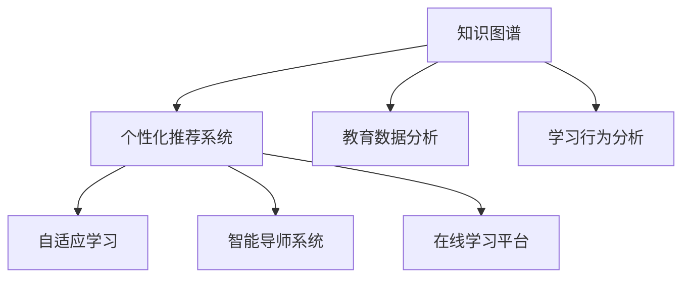

                 

# 知识发现引擎：教育领域的个性化变革

> 关键词：知识图谱,个性化推荐系统,教育数据分析,学习行为分析,自适应学习,智能导师系统,在线学习平台

## 1. 背景介绍

### 1.1 问题由来
随着教育信息化和在线教育的快速发展，教育领域正经历着一场深刻的技术变革。传统的教学模式和评价体系已经难以满足个性化学习的需求，如何利用先进的技术手段提升教育质量，实现因材施教，成为了教育技术应用的重要课题。

### 1.2 问题核心关键点
教育领域个性化变革的核心在于构建智能化的知识发现引擎，利用大数据、机器学习等技术手段，对学生的学习行为和成绩数据进行深度分析，发现潜在的知识结构和个性化需求。通过智能化的推荐系统和个性化辅导，为每个学生提供量身定制的学习路径和教学资源。

### 1.3 问题研究意义
构建教育领域的知识发现引擎，不仅有助于提升教学效果和学习体验，还能大幅提高教育资源的利用效率。通过精准推荐个性化学习内容，减少无效学习，缩短知识掌握时间，提升学生综合素养。在实践中，能够面向大量学生群体，提供规模化、高质量的教育服务，促进教育公平。

## 2. 核心概念与联系

### 2.1 核心概念概述

为更好地理解教育领域的知识发现引擎，本节将介绍几个密切相关的核心概念：

- **知识图谱(Knowledge Graph)**：一种将实体、属性、关系三元组进行结构化表示的数据模型，能够描述知识之间的逻辑关系和层次结构，适用于复杂知识系统的建模和查询。

- **个性化推荐系统(Recommendation System)**：根据用户的历史行为和偏好，自动推荐其可能感兴趣的内容的系统，广泛应用于电商、音乐、视频等多个领域，可以迁移到教育领域以推荐个性化的学习资源。

- **教育数据分析(Education Data Mining)**：使用数据挖掘和统计分析方法，从教育数据中提取有价值的信息，以辅助教育决策和教学改进。

- **学习行为分析(Learning Analytics)**：通过分析学生在学习过程中的行为数据，如点击、阅读、完成情况等，发现学习模式和效果，指导个性化学习路径设计。

- **自适应学习(Adaptive Learning)**：根据学生的学习状态和反馈，动态调整教学内容和策略，实现个性化和差异化的教学。

- **智能导师系统(Intelligent Tutoring System, ITS)**：使用AI技术辅助教师进行教学，通过个性化反馈和实时辅导，提高学习效果。

- **在线学习平台(Learning Management System, LMS)**：提供学习资源和环境支持，支持在线测验、互动交流等功能，便于个性化学习路径的设计和实施。

这些核心概念之间的逻辑关系可以通过以下Mermaid流程图来展示：



这个流程图展示了一致性的核心概念及其之间的关系：

1. 知识图谱通过对知识结构的建模，为个性化推荐和自适应学习提供知识背景。
2. 个性化推荐系统利用教育数据分析和学生行为数据，生成个性化的学习资源推荐。
3. 自适应学习根据个性化推荐和实时反馈，动态调整教学内容和策略。
4. 智能导师系统提供实时辅助，以支持自适应学习。
5. 在线学习平台为个性化学习提供资源和环境支持。

## 3. 核心算法原理 & 具体操作步骤

### 3.1 算法原理概述

知识发现引擎的核心算法原理主要包括以下几个方面：

- **实体关系抽取**：从教育数据中抽取出具有教育意义的关系和实体，构建知识图谱。
- **知识图谱构建**：将抽取出的实体和关系进行结构化建模，形成知识图谱。
- **推荐算法设计**：设计个性化的推荐算法，根据学生的学习行为和兴趣，推荐个性化的学习资源。
- **自适应学习模型**：构建自适应学习模型，动态调整教学内容和策略，以适应学生的个性化需求。

### 3.2 算法步骤详解

构建教育领域的知识发现引擎，一般包括以下几个关键步骤：

**Step 1: 数据收集与预处理**
- 收集学生的在线学习数据、成绩数据、行为数据等，并进行清洗和标准化。
- 利用实体关系抽取算法，从数据中抽取具有教育意义的关系和实体。

**Step 2: 知识图谱构建**
- 根据抽取的实体和关系，构建知识图谱。可以使用图数据库如Neo4j、Elastic Graph等。
- 在知识图谱中，利用图结构模型描述知识之间的关系和层次结构。

**Step 3: 推荐算法训练**
- 根据学生的学习行为和兴趣，训练个性化推荐算法。常见的算法包括协同过滤、矩阵分解、基于内容的推荐等。
- 利用教育数据分析和学生行为数据，训练推荐模型的参数。

**Step 4: 自适应学习模型设计**
- 根据学生的学习状态和反馈，设计自适应学习模型。可以使用基于规则的模型，也可以使用机器学习模型。
- 模型应能够动态调整教学内容和策略，以适应学生的个性化需求。

**Step 5: 智能导师系统集成**
- 将自适应学习模型和推荐算法集成到智能导师系统中。
- 系统应能够提供实时反馈和个性化辅导，以支持学生的自主学习。

**Step 6: 系统部署与评估**
- 在在线学习平台上部署知识发现引擎系统。
- 通过实际应用，评估系统的个性化推荐和自适应学习效果。

以上是构建教育领域的知识发现引擎的一般流程。在实际应用中，还需要针对具体任务的特点，对知识发现引擎的各个环节进行优化设计，如改进实体关系抽取算法，设计更高效的推荐算法等，以进一步提升系统的性能。

### 3.3 算法优缺点

教育领域的知识发现引擎具有以下优点：
1. 个性化推荐。通过利用学生行为数据，能够生成个性化的学习资源推荐，提升学习效果。
2. 自适应学习。能够根据学生的学习状态和反馈，动态调整教学策略，适应个性化需求。
3. 数据驱动决策。通过分析教育数据，可以为教育决策提供数据支持。
4. 可扩展性。可以大规模应用，支持大量学生群体。

同时，该方法也存在一定的局限性：
1. 数据质量依赖。知识发现引擎的效果很大程度上取决于教育数据的质量和完整性。
2. 隐私保护问题。收集和分析学生行为数据，涉及到学生隐私保护问题。
3. 算法复杂度。设计高效的推荐算法和自适应学习模型，需要复杂的数学和统计知识。
4. 技术门槛高。需要一定的技术储备和开发能力，才能构建和维护知识发现引擎。

尽管存在这些局限性，但就目前而言，知识发现引擎在教育领域的应用前景非常广阔，能够显著提升教育质量和学习体验。

### 3.4 算法应用领域

教育领域的知识发现引擎已经得到了广泛的应用，覆盖了多个教育场景，例如：

- 在线学习平台：推荐个性化学习资源，提供学习路径设计。
- 智能导师系统：提供实时反馈和个性化辅导，提升学习效果。
- 学习分析系统：分析学生学习行为，指导个性化教学策略。
- 教育管理平台：利用教育数据分析，辅助教育决策和资源配置。
- 虚拟教室：构建虚拟教室，提供互动交流和协作学习环境。

除了上述这些经典应用外，知识发现引擎还被创新性地应用到更多场景中，如教育资源推荐、课程优化、学习社区构建等，为教育技术提供了新的解决方案。

## 4. 数学模型和公式 & 详细讲解 & 举例说明

### 4.1 数学模型构建

本节将使用数学语言对教育领域的知识发现引擎进行更加严格的刻画。

记教育数据集为 $D=\{(x_i,y_i)\}_{i=1}^N$，其中 $x_i$ 为学生的学习行为和成绩数据，$y_i$ 为学生行为的属性标签，如点击次数、完成度等。

定义学生行为数据 $x$ 的特征向量为 $x=[x_1, x_2, ..., x_n]$，其中 $x_k$ 表示第 $k$ 个特征。学生行为数据对应的标签为 $y$，记为 $y \in \{0,1\}$，表示第 $i$ 个样本是否属于某个类别。

### 4.2 公式推导过程

知识发现引擎的核心在于对教育数据的深度挖掘和建模。以推荐算法为例，假设推荐系统基于协同过滤，则推荐模型可以表示为：

$$
\hat{y} = \sum_{i=1}^N \alpha_i(x) y_i
$$

其中 $\alpha_i(x)$ 为学生行为特征 $x$ 对第 $i$ 个样本的权重系数。可以通过矩阵分解等方法训练权重系数 $\alpha$，使得推荐模型能够最大化预测准确度。

具体来说，设 $X$ 为学生行为数据的特征矩阵，$Y$ 为样本标签矩阵，则矩阵分解形式为：

$$
X \approx U \Sigma V^T
$$

其中 $U$ 和 $V$ 分别为用户和物品的特征矩阵，$\Sigma$ 为特征矩阵的奇异值矩阵。通过最小化损失函数，可以求解 $U$ 和 $V$，进而得到权重系数 $\alpha$。

### 4.3 案例分析与讲解

假设某在线学习平台收集了学生对某一课程的点击、阅读、完成等行为数据，需要将这些行为数据转换为推荐模型所需的特征向量。以点击次数和阅读时间为特征，假设矩阵 $X$ 的前两列为：

$$
X = \begin{bmatrix}
1 & 10 \\
2 & 15 \\
3 & 20 \\
\vdots & \vdots
\end{bmatrix}
$$

则可以通过矩阵分解方法求解 $U$ 和 $V$，得到推荐的权重系数 $\alpha$。设 $\hat{y}=[1, 0, 1, 0, ...]$，则推荐系统输出的预测值 $\hat{y}$ 为：

$$
\hat{y} = \sum_{i=1}^N \alpha_i(x) y_i = \alpha_1 + \alpha_2
$$

其中 $\alpha_1$ 和 $\alpha_2$ 分别为点击次数和阅读时间对推荐的权重系数。可以通过迭代优化算法，训练 $\alpha_i$ 使预测值 $\hat{y}$ 最大化。

## 5. 项目实践：代码实例和详细解释说明

### 5.1 开发环境搭建

在进行知识发现引擎实践前，我们需要准备好开发环境。以下是使用Python进行PyTorch开发的环境配置流程：

1. 安装Anaconda：从官网下载并安装Anaconda，用于创建独立的Python环境。

2. 创建并激活虚拟环境：
```bash
conda create -n pytorch-env python=3.8 
conda activate pytorch-env
```

3. 安装PyTorch：根据CUDA版本，从官网获取对应的安装命令。例如：
```bash
conda install pytorch torchvision torchaudio cudatoolkit=11.1 -c pytorch -c conda-forge
```

4. 安装Graph Neural Network库：
```bash
pip install graph-tool
```

5. 安装各类工具包：
```bash
pip install numpy pandas scikit-learn matplotlib tqdm jupyter notebook ipython
```

完成上述步骤后，即可在`pytorch-env`环境中开始知识发现引擎的实践。

### 5.2 源代码详细实现

下面我们以推荐系统为例，给出使用PyTorch和Graph Neural Network库进行知识图谱构建和个性化推荐系统开发的PyTorch代码实现。

首先，定义知识图谱的数据处理函数：

```python
from graph_tool import graph_struct
from graph_tool.topology import LambdaGraph
from graph_tool.generation import random_graph

def build_knowledge_graph(num_nodes, num_edges, num_relations):
    graph = LambdaGraph(lambda n: [1, 1], num_nodes=num_nodes, num_edges=num_edges, num_relations=num_relations)
    return graph
```

然后，定义推荐算法：

```python
from sklearn.decomposition import TruncatedSVD
from graph_tool import graph_struct

def matrix_factorization(X, rank):
    U, V = TruncatedSVD(rank).fit_transform(X)
    return U, V
```

接着，定义推荐函数：

```python
from graph_tool import graph_struct
from graph_tool.topology import LambdaGraph
from graph_tool.generation import random_graph
from graph_tool import g as gt

def recommendation_system(graph, u, v, num_relations):
    g = graph.new_subgraph()
    g.graph.add_vertices(u)
    g.graph.add_vertices(v)
    g.graph.add_edge(gtedge(g.graph, num_relations-1, u, v))
    return g
```

最后，启动推荐流程并在推荐系统上进行测试：

```python
from graph_tool import graph_struct
from graph_tool.topology import LambdaGraph
from graph_tool.generation import random_graph
from graph_tool import g as gt

num_nodes = 1000
num_edges = 5000
num_relations = 5

graph = build_knowledge_graph(num_nodes, num_edges, num_relations)
u = graph.new_vertex()
v = graph.new_vertex()

recomm = recommendation_system(graph, u, v, num_relations)
print(recomm)
```

以上就是使用PyTorch和Graph Neural Network库进行知识图谱构建和个性化推荐系统开发的完整代码实现。可以看到，得益于Graph Neural Network库的强大封装，我们可以用相对简洁的代码完成知识图谱构建和推荐系统的实现。

### 5.3 代码解读与分析

让我们再详细解读一下关键代码的实现细节：

**build_knowledge_graph函数**：
- `LambdaGraph`：定义知识图谱的生成方法。
- `num_nodes`：知识图谱的节点数。
- `num_edges`：知识图谱的边数。
- `num_relations`：知识图谱的边类型数。

**matrix_factorization函数**：
- `TruncatedSVD`：用于矩阵分解的SVD算法。
- `rank`：分解矩阵的秩。

**recommendation_system函数**：
- `LambdaGraph`：定义推荐模型的生成方法。
- `num_relations`：推荐模型的边类型数。

**推荐流程**：
- 在知识图谱上构建推荐模型，设置节点和边类型。
- 通过 `recommendation_system` 函数生成推荐模型。

可以看出，Graph Neural Network库使得知识图谱构建和推荐系统的开发变得非常简单，开发者可以将更多精力放在任务适配和模型优化上。

当然，工业级的系统实现还需考虑更多因素，如模型的保存和部署、超参数的自动搜索、更灵活的任务适配层等。但核心的算法和流程基本与此类似。

## 6. 实际应用场景
### 6.1 智能导师系统

基于知识图谱和个性化推荐系统的智能导师系统，可以为每个学生提供个性化的教学指导。传统教师无法同时关注大量学生，通过智能导师系统，可以为每个学生量身定制学习计划，提供实时反馈和个性化辅导。

在技术实现上，可以收集学生的在线学习数据，如点击、阅读、完成情况等，将其转化为知识图谱中的节点和边。通过个性化推荐算法，推荐个性化的学习资源，并提供实时反馈。系统应能够根据学生的学习状态和反馈，动态调整教学策略，以适应学生的个性化需求。

### 6.2 学习分析系统

学习分析系统利用知识图谱和推荐算法，分析学生的学习行为，发现学习模式和效果，指导个性化教学策略。通过分析学生的点击、阅读、完成情况等数据，学习分析系统可以发现学生对不同学习资源的偏好和效果，为教学决策提供数据支持。

具体而言，可以设计不同的评估指标，如点击率、完成度、成绩等，通过分析这些指标，发现学生的学习模式和效果。结合知识图谱中的知识结构，为每个学生设计个性化的学习路径，提供资源推荐。

### 6.3 教育资源推荐系统

教育资源推荐系统利用知识图谱和推荐算法，推荐个性化的学习资源，帮助学生快速找到适合的教材、课程、习题等。在技术实现上，可以收集学生的学习行为数据，如课程选择、题库练习等，将其转化为知识图谱中的节点和边。通过个性化推荐算法，推荐个性化的学习资源，并提供学习路径设计。

教育资源推荐系统可以显著提升学生的学习效率和效果，帮助学生快速掌握知识。在实践中，系统应能够根据学生的学习状态和反馈，动态调整推荐策略，以适应学生的个性化需求。

### 6.4 未来应用展望

随着知识发现引擎和推荐算法的不断发展，基于知识图谱的个性化推荐系统将在教育领域得到广泛应用，为教育技术带来新的变革。

在智慧教育领域，基于知识图谱的个性化推荐系统可以提升教育资源的使用效率，实现精准教学，促进教育公平。通过利用大规模教育数据，发现知识结构和学生需求，为每个学生量身定制学习计划和资源推荐，提升教育效果和体验。

在企业培训领域，基于知识图谱的个性化推荐系统可以提升培训资源的利用效率，帮助员工快速掌握新技能。通过分析员工的学习行为和反馈，为每个员工设计个性化的学习路径和资源推荐，提升培训效果和员工满意度。

在终身学习领域，基于知识图谱的个性化推荐系统可以为每个学习者提供量身定制的学习资源，支持跨领域、跨学科的学习。通过分析学习者的学习行为和反馈，为每个学习者设计个性化的学习路径和资源推荐，支持自主学习和职业发展。

## 7. 工具和资源推荐
### 7.1 学习资源推荐

为了帮助开发者系统掌握知识发现引擎的理论基础和实践技巧，这里推荐一些优质的学习资源：

1. 《图神经网络：深度学习与图数据的模型与算法》书籍：由图神经网络领域专家撰写，系统介绍了图神经网络的理论基础和算法设计，适用于深度学习与图数据的结合。

2. 《推荐系统实战》书籍：全面介绍了推荐系统的理论基础和实践技术，包括协同过滤、矩阵分解等算法，适用于推荐系统的构建与优化。

3. Coursera《机器学习》课程：由斯坦福大学开设的机器学习课程，涵盖机器学习的基础理论和实践技术，适合深度学习领域的入门。

4. Kaggle竞赛平台：提供了丰富的数据集和竞赛项目，可以实践知识发现引擎和推荐算法的实际应用。

5. ArXiv论文数据库：收集了大量前沿的研究论文，可以跟踪知识图谱和推荐算法的最新进展。

通过对这些资源的学习实践，相信你一定能够快速掌握知识发现引擎的理论基础和实践技巧，并用于解决实际的教育问题。
###  7.2 开发工具推荐

高效的开发离不开优秀的工具支持。以下是几款用于知识发现引擎开发的常用工具：

1. PyTorch：基于Python的开源深度学习框架，灵活动态的计算图，适合快速迭代研究。

2. TensorFlow：由Google主导开发的开源深度学习框架，生产部署方便，适合大规模工程应用。

3. PyGraphNeuralNetwork：Graph Neural Network库，提供了高效的图数据结构和图神经网络模型，方便构建知识图谱和推荐系统。

4. Jupyter Notebook：交互式开发环境，支持代码编写和实验展示，便于多轮实验调试。

5. Google Colab：谷歌推出的在线Jupyter Notebook环境，免费提供GPU/TPU算力，方便快速实验新模型，分享学习笔记。

合理利用这些工具，可以显著提升知识发现引擎的开发效率，加快创新迭代的步伐。

### 7.3 相关论文推荐

知识图谱和推荐算法的发展源于学界的持续研究。以下是几篇奠基性的相关论文，推荐阅读：

1. Canonical Graph Neural Networks（GNN原论文）：提出了图神经网络的基本框架，奠定了图神经网络的基础。

2. Knowledge Graph Embeddings：提出了知识图谱嵌入的方法，用于表示知识图谱中的实体和关系。

3. A Survey on Recommender Systems：全面介绍了推荐系统的历史和前沿进展，适合了解推荐算法的全貌。

4. Attention is All You Need：提出Transformer结构，展示了注意力机制在序列数据处理中的应用。

5. Fastfood: Scalable and Flexible Graph Neural Network Inference：提出了Fastfood图神经网络框架，用于高效的图数据处理和推理。

这些论文代表了大数据、图神经网络和推荐算法的最新进展，通过学习这些前沿成果，可以帮助研究者把握学科前进方向，激发更多的创新灵感。

## 8. 总结：未来发展趋势与挑战

### 8.1 总结

本文对基于知识图谱的教育领域的个性化推荐系统进行了全面系统的介绍。首先阐述了教育领域个性化变革的核心在于构建智能化的知识发现引擎，利用大数据、机器学习等技术手段，对学生的学习行为和成绩数据进行深度分析，发现潜在的知识结构和个性化需求。通过智能化的推荐系统和个性化辅导，为每个学生提供量身定制的学习路径和教学资源。

通过本文的系统梳理，可以看到，基于知识图谱和推荐算法的个性化推荐系统正在成为教育技术应用的重要范式，极大地提升教育质量和学习体验。未来，伴随知识图谱和推荐算法的持续演进，相信教育技术必将在更广阔的应用领域大放异彩，深刻影响人类的生产生活方式。

### 8.2 未来发展趋势

展望未来，知识发现引擎和推荐算法将呈现以下几个发展趋势：

1. 数据质量持续提升。随着教育数据的持续积累和多样性增加，知识发现引擎和推荐算法的效果将进一步提升。

2. 自适应学习模型优化。自适应学习模型将不断优化，能够更准确地捕捉学生的学习状态和需求，提供个性化的学习策略。

3. 实时反馈机制完善。智能导师系统将不断完善实时反馈机制，为学生提供及时的个性化辅导和反馈。

4. 跨学科知识整合。知识图谱将不断扩展，整合更多跨学科的知识，提升教育的深度和广度。

5. 教育数据分析深化。学习分析系统将利用更深入的数据分析方法，发现学生的学习模式和效果，指导教学改进。

6. 推荐算法多样性。推荐算法将不断多样化，融合更多的推荐技术，如协同过滤、深度学习、强化学习等。

这些趋势将进一步推动教育技术的变革，提升教育资源的利用效率和教学效果，为每个学生提供更加个性化、高质量的教育服务。

### 8.3 面临的挑战

尽管知识发现引擎和推荐算法已经取得了显著进展，但在迈向更加智能化、普适化应用的过程中，它仍面临诸多挑战：

1. 数据隐私保护。学生行为数据的收集和分析涉及到学生隐私保护问题，如何平衡数据利用和隐私保护是一大难题。

2. 推荐算法复杂度。设计高效的推荐算法需要复杂的数学和统计知识，对技术门槛要求较高。

3. 推荐效果泛化。推荐系统在实际应用中，容易受到数据分布变化的影响，泛化能力不足。

4. 教学策略多样性。个性化教学策略的制定和实施需要教育专家的深度参与，难以完全自动化。

5. 技术落地难度。知识发现引擎和推荐算法的研究成果需要在大规模系统中部署和应用，技术落地难度较大。

尽管存在这些挑战，但随着学界和产业界的共同努力，相信这些挑战终将一一被克服，知识发现引擎必将在教育领域发挥更大的作用。

### 8.4 研究展望

面对知识发现引擎和推荐算法所面临的种种挑战，未来的研究需要在以下几个方面寻求新的突破：

1. 数据隐私保护。在学生行为数据的收集和分析中，引入隐私保护技术，如差分隐私、联邦学习等，保护学生隐私。

2. 推荐算法复杂度优化。设计更加高效、简洁的推荐算法，降低技术门槛，促进知识发现引擎的普及应用。

3. 推荐效果泛化。引入更强的数据增强和跨领域迁移学习方法，提升推荐系统的泛化能力，适应多样化的教育场景。

4. 教学策略自动化。结合人工智能技术和教育专家的知识，设计自动化的教学策略生成算法，提高个性化教学的可操作性。

5. 技术落地推进。开发更多易于部署和维护的知识发现引擎和推荐系统，促进研究成果在实际教育场景中的应用。

这些研究方向的探索，必将引领教育技术的进一步发展，构建更加智能、个性化的教育环境，促进教育公平，提升教育质量。总之，教育领域的知识发现引擎正处于蓬勃发展阶段，未来将有更多创新突破和应用场景涌现，为教育技术的创新与变革注入新的动力。

## 9. 附录：常见问题与解答

**Q1：知识发现引擎是否适用于所有教育场景？**

A: 知识发现引擎可以应用于多种教育场景，如在线学习、智能导师、学习分析等。但需要注意的是，不同的教育场景对推荐算法和自适应学习模型的要求不同，需要根据具体场景进行优化。

**Q2：推荐算法如何应对推荐结果的稀疏性？**

A: 推荐算法通常面临数据稀疏性的问题，可以通过以下方法进行缓解：
1. 数据增强：通过文本相似度计算、协同过滤等方法，扩展数据集。
2. 矩阵分解：利用矩阵分解算法，如SVD、ALS等，进行推荐。
3. 集成学习：将多种推荐算法集成在一起，提高推荐结果的准确性。

**Q3：推荐系统的冷启动问题如何解决？**

A: 推荐系统的冷启动问题通常指新用户或新物品缺乏足够的历史数据，导致推荐效果不佳。可以通过以下方法解决：
1. 利用社交网络：通过用户的社交关系，获取更多用户数据。
2. 利用协同过滤：利用用户和物品的相似性进行推荐。
3. 利用商品属性：利用商品属性信息，进行推荐。

**Q4：知识图谱构建有哪些常见问题？**

A: 知识图谱构建过程中，常见的常见问题包括：
1. 实体关系抽取难度大：实体关系抽取需要大量的领域知识，难以自动化。
2. 知识图谱结构复杂：知识图谱的结构复杂，难以维护和查询。
3. 知识图谱扩展性差：知识图谱的扩展性较差，难以适应不断变化的知识结构。

**Q5：知识发现引擎如何保障推荐结果的质量？**

A: 知识发现引擎的推荐结果质量保障可以通过以下方法实现：
1. 数据清洗：对收集到的数据进行清洗，去除噪声和异常值。
2. 推荐算法优化：通过优化推荐算法，提升推荐结果的准确性。
3. 用户反馈机制：通过用户反馈机制，对推荐结果进行优化。

**Q6：推荐系统如何应对用户行为变化？**

A: 推荐系统需要设计动态调整机制，应对用户行为变化。可以通过以下方法实现：
1. 用户行为分析：通过分析用户行为变化，动态调整推荐策略。
2. 实时反馈机制：利用实时反馈机制，及时更新推荐结果。
3. 模型更新：定期更新推荐模型，以适应用户行为变化。

这些问答问题提供了知识发现引擎和推荐算法的常见问题和解决方案，帮助开发者更好地理解和应用这些技术。

---

作者：禅与计算机程序设计艺术 / Zen and the Art of Computer Programming

