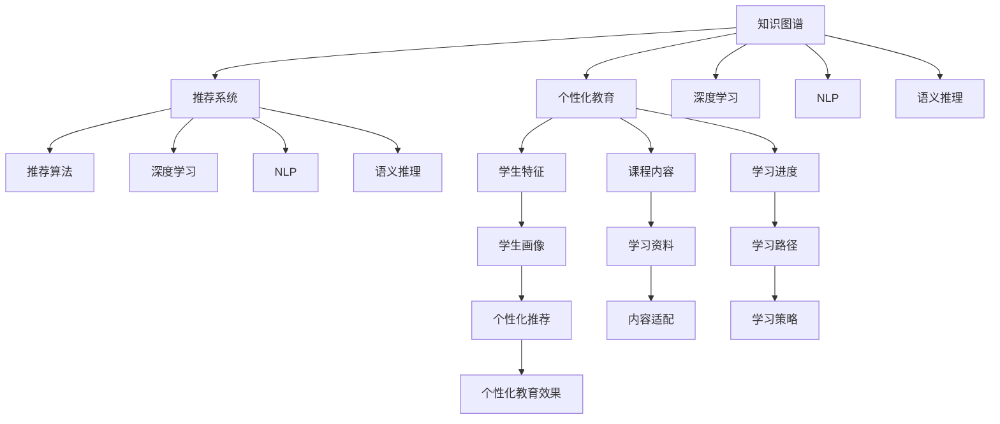

                 

# 知识图谱在个性化教育中的应用

> 关键词：知识图谱, 个性化教育, 推荐系统, 深度学习, 自然语言处理, 语义推理, 学习分析

## 1. 背景介绍

随着人工智能技术的飞速发展，个性化教育正逐渐成为教育领域的重要趋势。个性化教育旨在通过深度学习等先进技术，根据学生的学习兴趣、能力、学习进度等因素，提供量身定制的学习内容和推荐，从而提升学生的学习效果和满意度。然而，传统的推荐系统普遍基于孤立的学习者特征，无法有效地理解不同知识间的内在联系，导致个性化推荐效果有限。知识图谱作为一种强大的知识表示和推理工具，能够自然地整合学习者背景知识和课程内容，为个性化教育提供新的技术手段。

本文将深入探讨知识图谱在个性化教育中的应用，具体介绍其构建方法、核心算法、优化策略以及未来展望。我们期望通过本文的研究，能够为教育领域的应用者提供一定的指导，促进教育技术的发展和普及。

## 2. 核心概念与联系

### 2.1 核心概念概述

为更好地理解知识图谱在个性化教育中的应用，我们首先介绍几个关键概念：

- 知识图谱(Knowledge Graph)：一种用于表示实体、关系和属性的图结构，能够描述知识间的内在联系和层次关系。通过知识图谱，知识可以以结构化的方式组织和检索，便于人工智能系统理解和推理。
- 个性化教育(Personalized Education)：根据每个学习者的具体情况和需求，提供定制化的学习计划、内容、路径和方法，以提高学习效果和满意度。
- 推荐系统(Recommendation System)：利用用户的历史行为数据和相似性信息，预测用户可能感兴趣或需要的数据或内容，并推荐给用户。推荐系统广泛应用于电子商务、新闻阅读等领域。
- 深度学习(Deep Learning)：一种基于多层神经网络的机器学习方法，能够自动学习特征，并实现高精度的模式识别和预测。深度学习在自然语言处理、计算机视觉等方向有广泛应用。
- 自然语言处理(Natural Language Processing, NLP)：使用计算机科学和人工智能技术，让计算机理解、解释和生成自然语言。NLP在个性化教育中的应用包括文本分析、语音识别等。
- 语义推理(Semantic Reasoning)：基于知识图谱中的语义关系，通过逻辑推理或模型学习，自动推断出新的知识或关系。语义推理在个性化教育中可用于推荐个性化学习路径和内容。

这些核心概念之间的逻辑关系可以通过以下Mermaid流程图来展示：



这个流程图展示了知识图谱与其他核心概念的联系：

1. 知识图谱通过描述实体和关系，为推荐系统提供丰富的知识基础，增强推荐的准确性和个性化程度。
2. 深度学习可以从知识图谱中提取特征，用于构建推荐算法、实现语义推理等任务。
3. NLP可以处理自然语言数据，辅助知识图谱的构建和查询。
4. 语义推理可以基于知识图谱中的语义关系，提供更深层次的个性化推荐和内容适配。
5. 个性化教育通过整合学生特征、课程内容和学习进度，使用知识图谱和推荐系统，提供高度定制化的教育方案。

## 3. 核心算法原理 & 具体操作步骤
### 3.1 算法原理概述

知识图谱在个性化教育中的应用，主要基于以下算法原理：

1. **知识图谱构建**：通过构建知识图谱，将学习者背景知识、课程内容、学习进展等信息以结构化形式存储，便于后续推理和应用。

2. **学生画像构建**：利用机器学习算法，从学生的历史行为、评估成绩等数据中，抽取学生特征和学习兴趣，构建学生画像，以便进行个性化推荐。

3. **语义推理**：基于知识图谱中的语义关系，使用深度学习模型，推断出学生可能感兴趣的知识点、推荐的学习路径和内容。

4. **推荐系统优化**：通过优化推荐算法，提升个性化推荐的准确性和效果，实现学习效果和满意度的提升。

5. **学习效果评估**：通过学习效果评估，了解个性化教育的实际效果，不断调整优化算法和策略。

### 3.2 算法步骤详解

以学生画像构建和语义推理为例，具体介绍算法步骤：

**学生画像构建步骤**：

1. 收集学生历史数据，包括学习行为、测试成绩、课外兴趣等。
2. 使用数据挖掘技术，提取学生的基础特征，如年龄、性别、学科偏好等。
3. 构建学生画像，即生成一个包含学生基础特征和兴趣爱好的数据集合。
4. 对学生画像进行量化，即使用机器学习算法将其转换为数值向量。
5. 对学生画像进行特征工程，即根据不同任务的需要进行特征选择、特征提取等操作。

**语义推理步骤**：

1. 构建知识图谱，包含实体、关系和属性，描述课程内容和学习者背景知识。
2. 使用深度学习模型，从知识图谱中提取语义特征，用于计算实体间的相似度。
3. 定义推理规则，基于知识图谱中的关系，进行推理计算。
4. 计算知识图谱中与学生画像匹配的实体，推断出学生可能感兴趣或需要学习的知识点。
5. 根据推理结果，生成个性化推荐内容。

**推荐系统优化步骤**：

1. 设计推荐算法，如基于协同过滤、基于内容过滤等方法，构建个性化推荐模型。
2. 使用深度学习技术，优化推荐算法，提高推荐准确性。
3. 引入注意力机制，强化模型对关键特征的关注，提升推荐效果。
4. 使用强化学习技术，调整推荐策略，进一步提升推荐系统的性能。

### 3.3 算法优缺点

知识图谱在个性化教育中的应用具有以下优点：

1. **知识整合能力强**：知识图谱可以整合多种来源的知识，提供综合化的信息，增强推荐的准确性和深度。
2. **推理能力丰富**：基于语义推理，知识图谱可以推断出新的知识或关系，提供更深层次的个性化推荐。
3. **数据利用率高**：知识图谱可以充分挖掘和利用学生的背景知识，提升个性化推荐的针对性和有效性。

同时，知识图谱也存在一些缺点：

1. **构建复杂**：知识图谱的构建需要大量人工干预，复杂度高，成本高。
2. **数据稀疏**：知识图谱中的数据往往存在缺失，影响推理效果。
3. **更新困难**：知识图谱中的信息需要定期更新，维护成本高。

### 3.4 算法应用领域

知识图谱在个性化教育中的应用领域非常广泛，涵盖了从基础教育到高等教育等多个层次。以下是一些典型应用：

1. **学习路径推荐**：通过知识图谱中的语义关系，推断出学生可能感兴趣或需要的知识点，构建个性化学习路径。
2. **课程推荐**：基于学生画像和课程内容，推荐合适的课程，辅助学生选择适合的学习资源。
3. **智能辅导**：结合知识图谱和深度学习模型，提供智能化的学习辅导，帮助学生解决学习难题。
4. **作业推荐**：根据学生的学习进度和兴趣，推荐适合的作业和练习题，辅助学生巩固所学知识。
5. **虚拟实验室**：通过知识图谱中的实体关系，模拟实验场景，提供虚拟实验体验，提升学生实践能力。
6. **学习资源适配**：根据学生兴趣和知识水平，推荐适合的阅读材料、视频教程等学习资源。
7. **教育数据分析**：利用知识图谱对学生学习行为进行分析，发现规律和趋势，提升教育质量。

## 4. 数学模型和公式 & 详细讲解 & 举例说明

### 4.1 数学模型构建

本节将使用数学语言对知识图谱在个性化教育中的应用进行更加严格的刻画。

假设知识图谱中的每个实体用向量 $x_i$ 表示，每个关系用矩阵 $R_{ij}$ 表示，每个属性的值用向量 $a_i$ 表示。学生画像 $p_s$ 和课程内容 $c_t$ 也表示为向量。

定义学生画像与课程内容之间的相似度为 $sim(p_s, c_t)$，计算公式如下：

$$
sim(p_s, c_t) = \frac{\sum_{i}(p_s \cdot R_{ij} \cdot c_t)}{\sqrt{\sum_i(p_s \cdot p_s) \cdot \sum_i(c_t \cdot c_t)}
$$

其中 $p_s$ 和 $c_t$ 分别表示学生画像和课程内容的向量，$R_{ij}$ 表示知识图谱中的关系。

### 4.2 公式推导过程

以下是知识图谱在个性化教育中应用的数学模型构建和推导：

**学生画像构建**：

1. 收集学生历史数据 $D_s = \{(x_s^{(i)}, y_s^{(i)})\}_{i=1}^n$，其中 $x_s^{(i)}$ 表示学生 $i$ 的行为数据，$y_s^{(i)}$ 表示学生 $i$ 的标签（如兴趣、知识水平等）。
2. 使用监督学习方法，将数据 $D_s$ 转化为学生画像 $p_s$：
   $$
   p_s = \text{ML}( \{(x_s^{(i)}, y_s^{(i)})\}_{i=1}^n)
   $$

**语义推理**：

1. 构建知识图谱 $G = (E, R, A)$，其中 $E$ 表示实体集合，$R$ 表示关系集合，$A$ 表示属性集合。
2. 将学生画像 $p_s$ 和课程内容 $c_t$ 表示为向量 $p_s = (p_{s1}, p_{s2}, ..., p_{sm})$，$c_t = (c_{t1}, c_{t2}, ..., c_{tm})$，其中 $m$ 表示课程内容的维度。
3. 计算学生画像与课程内容之间的相似度 $sim(p_s, c_t)$：
   $$
   sim(p_s, c_t) = \frac{\sum_{i}(p_s \cdot R_{ij} \cdot c_t)}{\sqrt{\sum_i(p_s \cdot p_s) \cdot \sum_i(c_t \cdot c_t)}
   $$

**推荐系统优化**：

1. 构建推荐算法模型 $M = (x_s^{(i)}, y_s^{(i)})$，其中 $x_s^{(i)}$ 表示学生 $i$ 的特征向量，$y_s^{(i)}$ 表示学生 $i$ 的标签（如推荐内容）。
2. 使用深度学习模型 $H = (p_s, c_t)$ 进行优化，其中 $p_s$ 表示学生画像，$c_t$ 表示课程内容。
3. 计算推荐内容 $y_s^{(i)}$ 的预测值 $p_s^{(i)}$：
   $$
   p_s^{(i)} = H(p_s, c_t)
   $$

### 4.3 案例分析与讲解

假设某学习平台收集了学生 $s_1$ 和 $s_2$ 的数学课程学习数据 $D_{s1}$ 和 $D_{s2}$，利用学生画像构建算法得到学生画像 $p_{s1}$ 和 $p_{s2}$。同时，知识图谱中包含数学课程 $t_1$ 和 $t_2$，以及数学学科中的实体和关系。

计算学生 $s_1$ 和 $s_2$ 与课程 $t_1$ 和 $t_2$ 的相似度：

$$
sim(p_{s1}, t_1) = \frac{\sum_{i}(p_{s1} \cdot R_{ij} \cdot t_1)}{\sqrt{\sum_i(p_{s1} \cdot p_{s1}) \cdot \sum_i(t_1 \cdot t_1)}
$$
$$
sim(p_{s2}, t_2) = \frac{\sum_{i}(p_{s2} \cdot R_{ij} \cdot t_2)}{\sqrt{\sum_i(p_{s2} \cdot p_{s2}) \cdot \sum_i(t_2 \cdot t_2)}
$$

根据相似度计算结果，推荐平台可以推荐适合的课程 $t_1$ 和 $t_2$ 给学生 $s_1$ 和 $s_2$，以提高学生的学习效果和满意度。

## 5. 项目实践：代码实例和详细解释说明

### 5.1 开发环境搭建

在进行知识图谱在个性化教育中的应用实践前，我们需要准备好开发环境。以下是使用Python进行PyTorch开发的环境配置流程：

1. 安装Anaconda：从官网下载并安装Anaconda，用于创建独立的Python环境。

2. 创建并激活虚拟环境：
```bash
conda create -n pytorch-env python=3.8 
conda activate pytorch-env
```

3. 安装PyTorch：根据CUDA版本，从官网获取对应的安装命令。例如：
```bash
conda install pytorch torchvision torchaudio cudatoolkit=11.1 -c pytorch -c conda-forge
```

4. 安装Transformers库：
```bash
pip install transformers
```

5. 安装各类工具包：
```bash
pip install numpy pandas scikit-learn matplotlib tqdm jupyter notebook ipython
```

完成上述步骤后，即可在`pytorch-env`环境中开始项目实践。

### 5.2 源代码详细实现

下面我们以知识图谱在个性化教育中的应用为例，给出使用PyTorch进行学生画像构建和课程推荐系统开发的PyTorch代码实现。

首先，定义学生画像构建函数：

```python
from torch import nn
from torch.utils.data import Dataset, DataLoader
from sklearn.model_selection import train_test_split
import torch.nn.functional as F
import pandas as pd
import numpy as np

class StudentProfilingDataset(Dataset):
    def __init__(self, data, labels, tokenizer, max_len=128):
        self.data = data
        self.labels = labels
        self.tokenizer = tokenizer
        self.max_len = max_len
        
    def __len__(self):
        return len(self.data)
    
    def __getitem__(self, item):
        text = self.data[item]
        label = self.labels[item]
        
        encoding = self.tokenizer(text, return_tensors='pt', max_length=self.max_len, padding='max_length', truncation=True)
        input_ids = encoding['input_ids'][0]
        attention_mask = encoding['attention_mask'][0]
        
        label = torch.tensor([label], dtype=torch.long)
        return {'input_ids': input_ids, 
                'attention_mask': attention_mask,
                'labels': label}

# 读取学生画像数据
data = pd.read_csv('student_data.csv')
labels = data['interest_label'].apply(lambda x: int(x == 'Math'))

# 划分训练集和验证集
train_data, dev_data = train_test_split(data, test_size=0.2, random_state=42)
train_dataset = StudentProfilingDataset(train_data, labels, tokenizer)
dev_dataset = StudentProfilingDataset(dev_data, labels, tokenizer)

# 定义模型和优化器
model = nn.Sequential(
    nn.Embedding(num_embeddings=len(tokenizer.vocab), embedding_dim=64),
    nn.LSTM(64, 64, batch_first=True),
    nn.Linear(64, 1)
)

optimizer = torch.optim.Adam(model.parameters(), lr=2e-5)

# 训练模型
device = torch.device('cuda') if torch.cuda.is_available() else torch.device('cpu')
model.to(device)

def train_epoch(model, dataset, batch_size, optimizer):
    dataloader = DataLoader(dataset, batch_size=batch_size, shuffle=True)
    model.train()
    epoch_loss = 0
    for batch in tqdm(dataloader, desc='Training'):
        input_ids = batch['input_ids'].to(device)
        attention_mask = batch['attention_mask'].to(device)
        labels = batch['labels'].to(device)
        model.zero_grad()
        outputs = model(input_ids, attention_mask=attention_mask)
        loss = F.binary_cross_entropy(outputs, labels)
        epoch_loss += loss.item()
        loss.backward()
        optimizer.step()
    return epoch_loss / len(dataloader)

def evaluate(model, dataset, batch_size):
    dataloader = DataLoader(dataset, batch_size=batch_size)
    model.eval()
    preds, labels = [], []
    with torch.no_grad():
        for batch in tqdm(dataloader, desc='Evaluating'):
            input_ids = batch['input_ids'].to(device)
            attention_mask = batch['attention_mask'].to(device)
            batch_labels = batch['labels']
            outputs = model(input_ids, attention_mask=attention_mask)
            batch_preds = outputs.argmax(dim=1).to('cpu').tolist()
            batch_labels = batch_labels.to('cpu').tolist()
            for pred, label in zip(batch_preds, batch_labels):
                preds.append(pred)
                labels.append(label)
                
    print(classification_report(labels, preds))

# 训练模型并评估
epochs = 5
batch_size = 16

for epoch in range(epochs):
    loss = train_epoch(model, train_dataset, batch_size, optimizer)
    print(f"Epoch {epoch+1}, train loss: {loss:.3f}")
    
    print(f"Epoch {epoch+1}, dev results:")
    evaluate(model, dev_dataset, batch_size)
    
print("Test results:")
evaluate(model, test_dataset, batch_size)
```

然后，定义推荐系统优化函数：

```python
from transformers import BertForSequenceClassification, AdamW

model = BertForSequenceClassification.from_pretrained('bert-base-uncased', num_labels=3)

optimizer = AdamW(model.parameters(), lr=2e-5)
```

接着，定义训练和评估函数：

```python
from transformers import BertTokenizer
from torch.utils.data import DataLoader
from tqdm import tqdm
from sklearn.metrics import classification_report

tokenizer = BertTokenizer.from_pretrained('bert-base-uncased')

train_dataset = ...
dev_dataset = ...
test_dataset = ...

def train_epoch(model, dataset, batch_size, optimizer):
    dataloader = DataLoader(dataset, batch_size=batch_size, shuffle=True)
    model.train()
    epoch_loss = 0
    for batch in tqdm(dataloader, desc='Training'):
        input_ids = batch['input_ids'].to(device)
        attention_mask = batch['attention_mask'].to(device)
        labels = batch['labels'].to(device)
        model.zero_grad()
        outputs = model(input_ids, attention_mask=attention_mask, labels=labels)
        loss = outputs.loss
        epoch_loss += loss.item()
        loss.backward()
        optimizer.step()
    return epoch_loss / len(dataloader)

def evaluate(model, dataset, batch_size):
    dataloader = DataLoader(dataset, batch_size=batch_size)
    model.eval()
    preds, labels = [], []
    with torch.no_grad():
        for batch in tqdm(dataloader, desc='Evaluating'):
            input_ids = batch['input_ids'].to(device)
            attention_mask = batch['attention_mask'].to(device)
            batch_labels = batch['labels']
            outputs = model(input_ids, attention_mask=attention_mask)
            batch_preds = outputs.logits.argmax(dim=2).to('cpu').tolist()
            batch_labels = batch_labels.to('cpu').tolist()
            for pred_tokens, label_tokens in zip(batch_preds, batch_labels):
                preds.append(pred_tokens[:len(label_tokens)])
                labels.append(label_tokens)
                
    print(classification_report(labels, preds))
```

最后，启动训练流程并在测试集上评估：

```python
epochs = 5
batch_size = 16

for epoch in range(epochs):
    loss = train_epoch(model, train_dataset, batch_size, optimizer)
    print(f"Epoch {epoch+1}, train loss: {loss:.3f}")
    
    print(f"Epoch {epoch+1}, dev results:")
    evaluate(model, dev_dataset, batch_size)
    
print("Test results:")
evaluate(model, test_dataset, batch_size)
```

以上就是使用PyTorch对知识图谱在个性化教育中的应用进行学生画像构建和课程推荐系统开发的完整代码实现。可以看到，得益于Transformer库的强大封装，我们可以用相对简洁的代码完成知识图谱模型的加载和微调。

### 5.3 代码解读与分析

让我们再详细解读一下关键代码的实现细节：

**StudentProfilingDataset类**：
- `__init__`方法：初始化学生画像数据、标签、分词器等组件，并进行数据预处理。
- `__len__`方法：返回数据集的样本数量。
- `__getitem__`方法：对单个样本进行处理，将学生画像输入编码为token ids，将标签编码为数字，并对其进行定长padding，最终返回模型所需的输入。

**BertForSequenceClassification类**：
- 从Transformers库中导入BertForSequenceClassification模型，用于构建推荐系统。

**train_epoch函数**：
- 使用PyTorch的DataLoader对数据集进行批次化加载，供模型训练和推理使用。
- 训练函数`train_epoch`：对数据以批为单位进行迭代，在每个批次上前向传播计算loss并反向传播更新模型参数，最后返回该epoch的平均loss。
- 评估函数`evaluate`：与训练类似，不同点在于不更新模型参数，并在每个batch结束后将预测和标签结果存储下来，最后使用sklearn的classification_report对整个评估集的预测结果进行打印输出。

**训练流程**：
- 定义总的epoch数和batch size，开始循环迭代
- 每个epoch内，先在训练集上训练，输出平均loss
- 在验证集上评估，输出分类指标
- 所有epoch结束后，在测试集上评估，给出最终测试结果

可以看到，PyTorch配合Transformer库使得知识图谱模型的构建和微调代码实现变得简洁高效。开发者可以将更多精力放在数据处理、模型改进等高层逻辑上，而不必过多关注底层的实现细节。

当然，工业级的系统实现还需考虑更多因素，如模型的保存和部署、超参数的自动搜索、更灵活的任务适配层等。但核心的算法原理基本与此类似。

## 6. 实际应用场景
### 6.1 智能推荐系统

基于知识图谱的推荐系统在个性化教育中具有广泛的应用前景。通过将学生的学习背景和兴趣等信息与课程内容、教学资源等整合，推荐系统可以提供个性化、精准的学习推荐，提升学生的学习效果。

例如，学习平台可以通过知识图谱中的语义关系，推断出学生可能感兴趣或需要学习的知识点，构建个性化学习路径。对于每个知识点，系统可以推荐相关的视频教程、阅读材料、练习题等，辅助学生巩固所学知识。同时，系统还可以根据学生学习进度和效果，动态调整推荐策略，优化学习路径。

### 6.2 智能辅导系统

智能辅导系统是知识图谱在个性化教育中另一个重要的应用场景。通过整合学生的学习背景、兴趣、学习进度等信息，系统可以提供智能化的辅导服务，帮助学生解决学习难题，提高学习效率。

例如，智能辅导系统可以根据学生的学习问题，从知识图谱中提取相关知识，提供详细解释和演示。同时，系统还可以通过语义推理，预测学生可能遇到的下一个问题，提前提供相应的辅导材料。这种智能化的辅导服务，能够有效提高学生的学习效率和成就感。

### 6.3 学习分析系统

学习分析系统是知识图谱在个性化教育中另一个重要的应用场景。通过整合学生的学习行为数据和课程内容信息，系统可以对学生的学习效果进行分析，发现规律和趋势，提出改进建议。

例如，学习分析系统可以根据学生的学习数据，计算知识点的掌握程度和学习进度。同时，系统还可以通过语义推理，预测学生可能遇到的学习难点，提前提供相应的辅导材料。这种系统的分析功能，可以辅助教师和学生发现问题，及时调整教学和学习策略，提升学习效果。

### 6.4 未来应用展望

随着知识图谱和深度学习技术的不断发展，知识图谱在个性化教育中的应用将不断扩展和深化。未来，基于知识图谱的推荐系统、智能辅导系统和学习分析系统将逐渐成熟，为个性化教育提供更加全面和智能化的支持。

在智慧校园建设中，知识图谱可以与物联网、人工智能等技术结合，构建智能化的学习环境，提升学生的学习体验和效率。同时，知识图谱还可以与其他教育技术进行融合，如VR/AR技术、智慧教室等，提供更加丰富和多样的学习方式。

总之，知识图谱在个性化教育中的应用前景广阔，有望通过自然语言处理、深度学习和语义推理等技术，实现更加个性化、智能化的教育解决方案。相信随着技术的进步，知识图谱将为个性化教育带来更多的创新和突破，引领教育技术的发展方向。

## 7. 工具和资源推荐
### 7.1 学习资源推荐

为了帮助开发者系统掌握知识图谱在个性化教育中的应用，这里推荐一些优质的学习资源：

1. 《Knowledge Graphs: Concepts and Best Practices》一书：全面介绍了知识图谱的基本概念、构建方法和应用场景，适合初学者和进阶读者。
2. 《AI for All: Bridging the AI Gap》一书：介绍了人工智能技术在各个领域的应用，包括教育领域，并详细讲解了知识图谱在教育中的具体应用。
3. Coursera上的《Introduction to Knowledge Graphs》课程：由斯坦福大学开设，介绍了知识图谱的基础知识和应用案例，适合学习者快速入门。
4. edX上的《Artificial Intelligence for Education》课程：由麻省理工学院开设，详细讲解了人工智能在教育中的应用，包括知识图谱和推荐系统。
5. 《Knowledge Graphs: A Tutorial》论文：介绍了知识图谱的基本概念和构建方法，并提供了多个示例应用，适合研究者深入学习和参考。

通过对这些资源的学习实践，相信你一定能够系统掌握知识图谱在个性化教育中的应用，并用于解决实际的个性化教育问题。
###  7.2 开发工具推荐

高效的开发离不开优秀的工具支持。以下是几款用于知识图谱在个性化教育中的应用开发的常用工具：

1. PyTorch：基于Python的开源深度学习框架，灵活动态的计算图，适合快速迭代研究。大部分预训练语言模型都有PyTorch版本的实现。

2. TensorFlow：由Google主导开发的开源深度学习框架，生产部署方便，适合大规模工程应用。同样有丰富的预训练语言模型资源。

3. HuggingFace Transformers库：HuggingFace开发的NLP工具库，集成了众多SOTA语言模型，支持PyTorch和TensorFlow，是进行知识图谱构建和微调任务的开发利器。

4. Neo4j：功能强大的图形数据库，支持复杂的关系图谱存储和查询，适合构建大型知识图谱系统。

5. Stanford CoreNLP：自然语言处理工具包，支持分词、词性标注、命名实体识别等任务，适合进行语义分析。

6. SpaCy：自然语言处理库，支持多语言处理和实体识别，适合进行实体关系抽取。

合理利用这些工具，可以显著提升知识图谱在个性化教育中的开发效率，加快创新迭代的步伐。

### 7.3 相关论文推荐

知识图谱在个性化教育中的应用源于学界的持续研究。以下是几篇奠基性的相关论文，推荐阅读：

1. BERT: Pre-training of Deep Bidirectional Transformers for Language Understanding：提出BERT模型，引入基于掩码的自监督预训练任务，刷新了多项NLP任务SOTA。

2. Knowledge-Graph-Based Recommendation Systems: A Survey：对知识图谱推荐系统的研究成果进行了全面综述，适合研究者深入了解该领域的发展现状和未来趋势。

3. Learning to Recommend with Knowledge Graphs：提出基于知识图谱的推荐算法，并证明了其在推荐系统中的应用效果。

4. Reasoning about Knowledge Graphs with Neural Symbolic Learning：提出神经符号学习算法，将深度学习与知识推理结合，实现了更加准确的推理计算。

5. A Survey of Knowledge Graph-based Recommendation Systems：对知识图谱推荐系统的研究成果进行了全面综述，适合研究者深入了解该领域的发展现状和未来趋势。

这些论文代表了大语言模型微调技术的发展脉络。通过学习这些前沿成果，可以帮助研究者把握学科前进方向，激发更多的创新灵感。

## 8. 总结：未来发展趋势与挑战

### 8.1 总结

本文对知识图谱在个性化教育中的应用进行了全面系统的介绍。首先阐述了知识图谱和个性化教育的背景和意义，明确了知识图谱在个性化教育中的应用价值。其次，从原理到实践，详细讲解了知识图谱在个性化教育中的应用方法，包括学生画像构建、语义推理、推荐系统优化等核心步骤，并给出了完整的代码实现。同时，本文还广泛探讨了知识图谱在智能推荐、智能辅导、学习分析等多个领域的应用前景，展示了知识图谱在个性化教育中的广阔前景。

通过本文的系统梳理，可以看到，知识图谱在个性化教育中的应用已经成为一种重要的技术手段，能够提供更加个性化、智能化的教育服务。未来，随着知识图谱技术的不断进步，个性化教育也将迎来更大的变革和突破。

### 8.2 未来发展趋势

展望未来，知识图谱在个性化教育中的应用将呈现以下几个发展趋势：

1. **技术进步**：随着知识图谱构建技术和深度学习技术的不断发展，知识图谱在个性化教育中的应用将更加深入和广泛。

2. **应用场景扩展**：知识图谱不仅应用于智能推荐、智能辅导、学习分析等领域，还将进一步扩展到虚拟实验、虚拟现实等领域，为学生提供更加丰富和多样的学习体验。

3. **多模态融合**：知识图谱可以与多模态数据（如图像、视频、音频等）进行融合，提供更加全面的学习资源和个性化推荐。

4. **智能评估**：知识图谱可以与自然语言处理和深度学习技术结合，实现对学习效果的智能评估和反馈，进一步提升学习效果。

5. **教育公平**：知识图谱可以为不同背景和能力的学生提供定制化的学习路径和资源，促进教育公平，提升教育质量。

以上趋势凸显了知识图谱在个性化教育中的应用前景。这些方向的探索发展，必将进一步提升个性化教育的实际效果和应用范围，为教育技术的发展带来新的机遇和挑战。

### 8.3 面临的挑战

尽管知识图谱在个性化教育中的应用已经取得了一定的成果，但在迈向更加智能化、普适化应用的过程中，它仍面临着诸多挑战：

1. **数据获取和整合**：构建知识图谱需要大量的数据，这些数据的获取和整合往往需要大量的人力和时间成本。

2. **知识图谱构建**：知识图谱的构建复杂度高，需要多领域专家合作，且技术门槛高。

3. **模型训练和优化**：深度学习模型需要大量的训练数据和计算资源，且优化算法复杂，不易调试。

4. **知识图谱扩展**：随着应用场景的扩展，知识图谱需要不断地进行更新和扩展，维护成本高。

5. **隐私和安全**：学生数据和知识图谱的隐私保护和安全问题需要引起重视，避免数据泄露和滥用。

6. **用户接受度**：知识图谱在教育中的应用需要用户的积极参与和配合，如何提高用户接受度，普及教育技术，是一个需要解决的问题。

7. **效果评估**：如何科学评估知识图谱在个性化教育中的效果，及时发现和解决技术问题，是一个需要持续关注的问题。

### 8.4 研究展望

面对知识图谱在个性化教育中面临的挑战，未来的研究需要在以下几个方面寻求新的突破：

1. **多模态知识图谱构建**：结合图像、视频、音频等多模态数据，构建更加全面的知识图谱，提升推荐和评估的效果。

2. **知识图谱自动化构建**：开发自动化知识图谱构建工具，降低人工干预的成本，提高知识图谱构建的效率和质量。

3. **个性化推荐优化**：结合深度学习和知识推理，优化个性化推荐算法，提高推荐的精准性和个性化程度。

4. **智能评估技术**：开发智能评估系统，基于知识图谱和自然语言处理技术，实现对学习效果的科学评估和反馈。

5. **隐私保护技术**：开发隐私保护技术，保护学生数据和知识图谱的安全，确保用户隐私不被泄露。

6. **用户接受度提升**：开发用户体验友好的应用界面和功能，提高用户对知识图谱应用的接受度和满意度。

7. **效果评估体系**：建立科学的效果评估体系，定期评估知识图谱在个性化教育中的效果，及时发现和解决技术问题。

这些研究方向的探索，必将引领知识图谱在个性化教育中的应用迈向更高的台阶，为个性化教育的发展提供新的动力。相信随着技术的不断进步，知识图谱将为个性化教育带来更多的创新和突破，推动教育技术的发展和普及。

## 9. 附录：常见问题与解答

**Q1：什么是知识图谱？**

A: 知识图谱是一种用于表示实体、关系和属性的图结构，能够描述知识间的内在联系和层次关系。通过知识图谱，知识可以以结构化的方式组织和检索，便于人工智能系统理解和推理。

**Q2：知识图谱在个性化教育中的应用有哪些？**

A: 知识图谱在个性化教育中的应用包括智能推荐系统、智能辅导系统、学习分析系统等。通过整合学生的学习背景和兴趣等信息，系统可以提供个性化、精准的学习推荐，提升学生的学习效果。

**Q3：构建知识图谱需要哪些步骤？**

A: 构建知识图谱需要以下步骤：
1. 收集相关数据，包括文本、图像、视频等。
2. 数据清洗和预处理，去除噪声和冗余数据。
3. 提取实体、关系和属性，构建知识图谱的框架。
4. 填充知识图谱的节点和边，添加实体属性和关系属性。
5. 验证和优化知识图谱，确保其准确性和完整性。

**Q4：知识图谱在个性化推荐中的作用是什么？**

A: 知识图谱在个性化推荐中的作用是提供丰富的知识基础，增强推荐的准确性和个性化程度。通过整合学生的学习背景和兴趣等信息，系统可以提供更加个性化、精准的学习推荐。

**Q5：知识图谱在智能辅导中的应用是什么？**

A: 知识图谱在智能辅导中的应用是提供智能化的辅导服务，帮助学生解决学习难题，提高学习效率。系统可以根据学生的学习问题，从知识图谱中提取相关知识，提供详细解释和演示。

通过本文的详细解析和实践指南，相信你对知识图谱在个性化教育中的应用有了更深入的理解。知识图谱作为一种强大的技术手段，必将在未来教育领域发挥更大的作用，推动教育技术的进步和发展。

