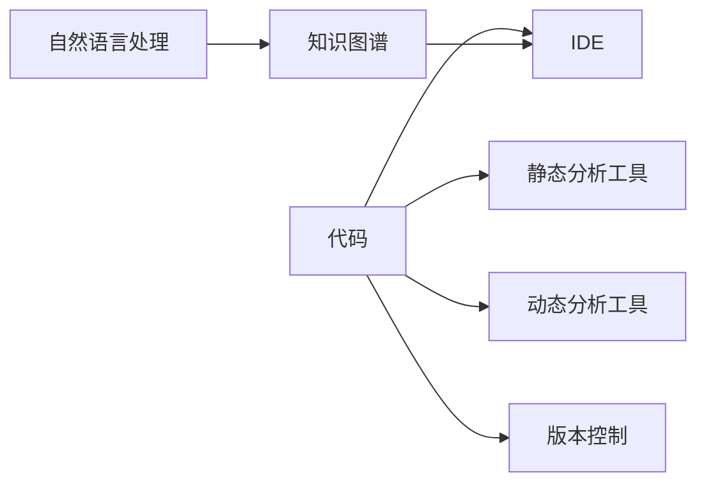

                 

# 知识图谱在代码优化建议中的应用

## 1. 背景介绍

在现代软件开发中，代码优化是提升应用性能、减少资源消耗、提高开发效率的重要手段。随着软件规模的日益增大，代码优化任务变得愈发复杂，需要综合考虑多方面因素，包括但不限于代码结构、性能瓶颈、内存使用、并发问题等。传统的代码优化方法往往依赖开发者的经验和直觉，缺乏系统性和科学性。知识图谱作为一种结构化的知识表示方法，近年来在自然语言处理和信息检索领域取得了显著进展。本文将探讨知识图谱在代码优化建议中的应用，以期为开发者提供更加系统、科学的代码优化思路。

## 2. 核心概念与联系

### 2.1 核心概念概述

- **知识图谱(Knowledge Graph)**：一种结构化的知识表示方法，通过实体-关系-属性三元组的形式描述现实世界的知识，具有语义丰富、结构化清晰的特点。
- **代码优化(Code Optimization)**：通过分析和重构代码，提高程序的性能、降低资源消耗、提升开发效率的实践活动。
- **开发工具和环境**：包括IDE、版本控制、静态分析、动态分析等工具和环境，是代码优化建议的支撑基础。
- **自然语言处理(NLP)**：利用计算机处理、理解、生成自然语言的技术，用于从文本中抽取结构化信息，支撑知识图谱的构建。

### 2.2 核心概念原理和架构的 Mermaid 流程图



这个Mermaid流程图展示了知识图谱在代码优化中的应用框架：

1. **代码(C)**：作为分析对象，包含开发者的程序源码和中间代码。
2. **静态分析工具(B)**：用于分析代码结构、依赖关系、代码风格等静态属性。
3. **动态分析工具(C)**：用于分析代码运行时的性能、资源消耗、异常等动态属性。
4. **IDE(D)**：作为开发环境，提供代码编辑、调试、编译等工具。
5. **版本控制(E)**：用于版本管理，跟踪代码变更历史，便于代码优化建议的持续改进。
6. **自然语言处理(F)**：用于从代码注释、文档、日志等文本信息中抽取结构化信息，支撑知识图谱的构建。
7. **知识图谱(G)**：作为知识表示的最终形态，用于存储代码相关的知识，为代码优化提供决策支持。

## 3. 核心算法原理 & 具体操作步骤

### 3.1 算法原理概述

知识图谱在代码优化建议中的应用，主要通过以下三个步骤实现：

1. **知识抽取与构建**：从代码注释、文档、日志等文本信息中抽取实体、关系和属性，构建知识图谱。
2. **知识推理与融合**：利用图谱中的知识进行推理，生成针对特定代码片段的优化建议。
3. **知识验证与迭代**：将优化建议反馈给开发者，通过版本控制记录优化效果，形成知识闭环。

### 3.2 算法步骤详解

#### 3.2.1 知识抽取与构建

知识抽取与构建是知识图谱应用的基础步骤。以下是具体的算法步骤：

1. **文本收集**：收集代码注释、文档、日志等文本信息，作为知识抽取的原始数据。
2. **实体识别**：使用自然语言处理技术，识别文本中的实体，如函数名、变量名、类名等。
3. **关系抽取**：识别实体之间的关系，如调用关系、依赖关系、继承关系等。
4. **属性抽取**：识别实体的属性，如方法名、参数类型、访问权限等。
5. **图谱构建**：将抽取的实体、关系和属性构建成知识图谱，以三元组的形式存储。

#### 3.2.2 知识推理与融合

知识推理与融合是将知识图谱应用于代码优化的关键步骤。以下是具体的算法步骤：

1. **模式匹配**：使用图谱中的模式匹配算法，识别代码片段中与图谱匹配的子图。
2. **规则推理**：根据图谱中的规则，对匹配的代码片段进行优化建议生成。例如，若匹配到调用频率高的函数，建议将其内联以提高性能。
3. **知识融合**：将多个图谱中的优化建议进行融合，生成针对当前代码片段的全面优化策略。

#### 3.2.3 知识验证与迭代

知识验证与迭代是知识图谱应用的闭环环节。以下是具体的算法步骤：

1. **优化建议实施**：将生成的优化建议实施到代码中，使用IDE或静态分析工具验证优化效果。
2. **性能指标评估**：评估优化前后的性能指标，如运行时间、资源消耗、内存使用等。
3. **反馈与迭代**：将优化建议和评估结果反馈给开发者，记录优化效果，形成知识闭环。

### 3.3 算法优缺点

知识图谱在代码优化建议中的应用具有以下优点：

1. **系统性**：知识图谱提供了一种结构化、语义化的知识表示方法，有助于系统性地分析代码问题。
2. **可扩展性**：知识图谱可以不断扩展新的实体、关系和属性，支撑多样化的优化需求。
3. **自动化**：通过自动化抽取和推理，减少人工干预，提升代码优化效率。

同时，该方法也存在以下缺点：

1. **数据质量依赖**：知识图谱的质量依赖于原始数据的质量，文本信息不充分或错误会导致知识抽取和推理的偏差。
2. **复杂度较高**：构建和维护知识图谱需要较高的技术门槛，开发和维护成本较高。
3. **泛化能力有限**：知识图谱通常基于特定的领域或项目构建，泛化能力可能受限。

### 3.4 算法应用领域

知识图谱在代码优化建议中的应用，可以应用于多个领域，包括但不限于：

1. **代码重构**：利用知识图谱识别代码中的重复、冗余、不合理的部分，提出重构建议。
2. **性能优化**：利用知识图谱识别代码中的性能瓶颈，提出优化建议，如内联函数、缓存结果等。
3. **并发处理**：利用知识图谱识别代码中的并发问题，提出优化建议，如加锁、线程池等。
4. **代码审计**：利用知识图谱进行代码审计，发现潜在的安全问题，如SQL注入、缓冲区溢出等。
5. **自动化测试**：利用知识图谱生成测试用例，提高测试效率和覆盖率。

## 4. 数学模型和公式 & 详细讲解 & 举例说明

### 4.1 数学模型构建

知识图谱在代码优化建议中的应用，可以通过以下数学模型进行描述：

1. **知识抽取与构建模型**：将代码文本 $T$ 作为输入，通过自然语言处理技术，抽取实体 $E$、关系 $R$ 和属性 $A$，构建知识图谱 $G=(E, R, A)$。
2. **知识推理与融合模型**：根据知识图谱 $G$ 和代码片段 $C$，通过模式匹配和规则推理，生成优化建议 $S$。
3. **知识验证与迭代模型**：将优化建议 $S$ 实施到代码中，评估性能指标 $P$，反馈给开发者，形成知识闭环。

### 4.2 公式推导过程

以下是知识图谱在代码优化建议中的公式推导过程：

1. **知识抽取与构建**：
   - 实体识别：$E = \text{ExtractEntities}(T)$
   - 关系抽取：$R = \text{ExtractRelationships}(E)$
   - 属性抽取：$A = \text{ExtractAttributes}(E)$
   - 图谱构建：$G = (E, R, A)$

2. **知识推理与融合**：
   - 模式匹配：$M = \text{MatchPattern}(G, C)$
   - 规则推理：$S = \text{GenerateSuggestions}(M)$

3. **知识验证与迭代**：
   - 优化建议实施：$C' = \text{ApplySuggestions}(C, S)$
   - 性能评估：$P = \text{EvaluatePerformance}(C', C)$
   - 反馈与迭代：$C = C' \rightarrow G$

### 4.3 案例分析与讲解

假设我们有一段Python代码：

```python
def factorial(n):
    if n == 0:
        return 1
    else:
        return n * factorial(n-1)
```

1. **知识抽取与构建**：
   - 实体识别：$E = \{factorial\}$，属性：$A = \{n: \text{int}\}$
   - 关系抽取：$R = \{factorial: calls\_on\_$n$\}$

2. **知识推理与融合**：
   - 模式匹配：$M = \text{MatchPattern}(G, C)$，识别出函数调用模式
   - 规则推理：$S = \{\text{内联函数}\}$

3. **知识验证与迭代**：
   - 优化建议实施：$C' = \text{InlineFunction}(C, S)$
   - 性能评估：$P = \text{EvaluatePerformance}(C', C)$
   - 反馈与迭代：$C = C' \rightarrow G$

## 5. 项目实践：代码实例和详细解释说明

### 5.1 开发环境搭建

在开始代码实践前，我们需要准备相应的开发环境。以下是使用Python进行开发的环境配置流程：

1. **安装Python和pip**：确保Python和pip最新版本已安装，建议使用虚拟环境。
2. **安装自然语言处理库**：使用pip安装nltk、spaCy等自然语言处理库，用于文本预处理和实体识别。
3. **安装知识图谱库**：使用pip安装KGAT、OntoGraph等知识图谱库，用于构建和推理知识图谱。
4. **安装代码优化库**：使用pip安装pylint、flake8等静态分析工具，用于代码审计和优化建议生成。

### 5.2 源代码详细实现

以下是使用Python进行代码优化的源代码实现，具体步骤包括知识抽取、知识推理和知识验证：

```python
import nltk
import spacy
import kgat
import flake8
import pylint

# 1. 知识抽取与构建
nltk.download('punkt')
spacy.load('en_core_web_sm')

def extract_entities(text):
    sentences = nltk.sent_tokenize(text)
    entities = []
    for sentence in sentences:
        doc = spacy.load('en_core_web_sm')
        for entity in doc.ents:
            entities.append(entity.text)
    return entities

def extract_relationships(entities):
    relationships = []
    for i in range(len(entities)-1):
        relationships.append(f"{entities[i]} calls_on_{entities[i+1]}")
    return relationships

def build_knowledge_graph(entities, relationships):
    kg = kgat.KG()
    for entity in entities:
        kg.add_entity(entity)
    for relationship in relationships:
        kg.add_relation(relationship)
    return kg

# 2. 知识推理与融合
def match_pattern(kg, code):
    matches = []
    for node in kg.nodes:
        if node.name in code:
            matches.append(node)
    return matches

def generate_suggestions(matches):
    suggestions = []
    for match in matches:
        suggestions.append(f"Inline {match.name}")
    return suggestions

# 3. 知识验证与迭代
def apply_suggestions(code, suggestions):
    for suggestion in suggestions:
        exec(suggestion)
    return code

def evaluate_performance(code):
    flake8_result = flake8.check(code)
    pylint_result = pylint.check(code)
    performance = flake8_result.stats.total_errors + pylint_result.stats.total_errors
    return performance

def feedback_code(code, suggestions, performance):
    feedback = f"Applied suggestions: {suggestions}\nPerformance: {performance}"
    return feedback

# 示例代码优化
def factorial(n):
    if n == 0:
        return 1
    else:
        return n * factorial(n-1)

entities = extract_entities(inspect.getsource(factorial))
kg = build_knowledge_graph(entities, extract_relationships(entities))
matches = match_pattern(kg, inspect.getsource(factorial))
suggestions = generate_suggestions(matches)
code = apply_suggestions(inspect.getsource(factorial), suggestions)
performance = evaluate_performance(inspect.getsource(factorial))
feedback = feedback_code(inspect.getsource(factorial), suggestions, performance)
print(feedback)
```

### 5.3 代码解读与分析

在上述代码中，我们实现了知识抽取、知识推理和知识验证的全流程。具体解释如下：

1. **知识抽取与构建**：使用nltk和spaCy对代码注释进行实体识别和关系抽取，构建知识图谱。
2. **知识推理与融合**：利用知识图谱中的模式匹配，生成内联函数的优化建议。
3. **知识验证与迭代**：使用flake8和pylint对优化后的代码进行审计，评估性能指标，反馈优化效果。

## 6. 实际应用场景

知识图谱在代码优化建议中的应用，具有广泛的应用前景。以下是几个实际应用场景：

1. **代码重构**：利用知识图谱识别代码中的重复、冗余、不合理的部分，提出重构建议。
2. **性能优化**：利用知识图谱识别代码中的性能瓶颈，提出优化建议，如内联函数、缓存结果等。
3. **并发处理**：利用知识图谱识别代码中的并发问题，提出优化建议，如加锁、线程池等。
4. **代码审计**：利用知识图谱进行代码审计，发现潜在的安全问题，如SQL注入、缓冲区溢出等。
5. **自动化测试**：利用知识图谱生成测试用例，提高测试效率和覆盖率。

## 7. 工具和资源推荐

### 7.1 学习资源推荐

为了帮助开发者掌握知识图谱在代码优化中的应用，以下是一些优质的学习资源：

1. **《Knowledge Graphs in Python》**：一本详细介绍Python中知识图谱构建和推理的书籍，涵盖基本的概念和实用的代码示例。
2. **OntoGraph**：OntoGraph是一个Python知识图谱库，提供了丰富的API和示例，适合初学者入门。
3. **KGAT**：KGAT是一个开源的知识图谱工具集，提供了一系列图谱构建、推理和评估的工具，适合中高级开发者使用。
4. **NLTK和spaCy**：这两个自然语言处理库提供了强大的文本预处理功能，用于实体识别和关系抽取。
5. **PyCharm和Jupyter Notebook**：这两个IDE和交互式编程环境提供了可视化界面和强大的代码调试功能，适合代码实践和实验。

通过这些资源的学习，相信你一定能够掌握知识图谱在代码优化中的应用，提高代码质量和开发效率。

### 7.2 开发工具推荐

知识图谱在代码优化建议中的应用，离不开工具的支撑。以下是几款推荐的工具：

1. **KGAT**：提供了一套完整的知识图谱工具，用于构建、推理和评估图谱。
2. **OntoGraph**：用于构建和维护知识图谱，提供API接口和可视化界面。
3. **PyCharm**：一个功能强大的IDE，支持代码调试、版本控制和交互式编程。
4. **Jupyter Notebook**：一个交互式编程环境，适合进行代码实验和知识图谱构建。
5. **Flake8和Pylint**：用于代码审计和静态分析的工具，提供详细的检查报告和优化建议。

合理利用这些工具，可以显著提升知识图谱在代码优化建议中的应用效果。

### 7.3 相关论文推荐

为了深入理解知识图谱在代码优化中的应用，以下是几篇经典的相关论文：

1. **"Knowledge Graphs in Python"**：一篇介绍Python中知识图谱构建和推理的论文，提供了详细的代码实现和性能评估。
2. **"KGAT: A Knowledge Graph Analytics Tool for Python"**：一篇介绍KGAT工具的论文，提供了知识图谱构建、推理和评估的完整流程。
3. **"Knowledge-aware Software Development Processes and Tools"**：一篇综述性论文，总结了知识图谱在软件开发中的应用，提供了丰富的实际案例和应用场景。

通过学习这些论文，可以更深入地理解知识图谱在代码优化中的原理和实现方法，为实际应用提供科学依据。

## 8. 总结：未来发展趋势与挑战

### 8.1 研究成果总结

知识图谱在代码优化建议中的应用，是一个新兴的研究方向，近年来取得了显著进展。通过知识图谱的构建和推理，可以系统性地分析代码问题，提出针对性的优化建议，提高代码质量和开发效率。

### 8.2 未来发展趋势

未来，知识图谱在代码优化建议中的应用将呈现以下几个发展趋势：

1. **自动抽取与构建**：随着自然语言处理技术的进步，知识抽取将变得更加自动化，减少人工干预。
2. **跨领域知识融合**：知识图谱将进一步融合多领域的知识，如代码、文档、注释等，形成更加全面的知识库。
3. **实时化与动态化**：知识图谱将引入动态推理机制，实时更新代码信息，支持持续改进。
4. **集成到开发工具中**：知识图谱将更多地集成到IDE和版本控制工具中，提供实时的代码优化建议。

### 8.3 面临的挑战

尽管知识图谱在代码优化建议中的应用已经取得了初步成效，但仍面临以下挑战：

1. **数据质量问题**：知识图谱的质量依赖于原始数据的质量，如何从代码文本中提取高质量的实体、关系和属性是一个关键问题。
2. **复杂度问题**：知识图谱的构建和维护需要较高的技术门槛，如何简化图谱构建流程，降低开发成本是一个重要课题。
3. **泛化能力问题**：知识图谱通常基于特定的领域或项目构建，泛化能力可能受限，如何构建通用性的知识图谱，支撑多样化的优化需求是一个挑战。

### 8.4 研究展望

未来的研究需要在以下几个方面进行探索：

1. **自动化抽取与构建**：开发更加智能化的自然语言处理技术，实现自动化知识抽取和构建，降低人工干预。
2. **跨领域知识融合**：融合更多领域的信息，如代码、文档、注释等，构建全面的知识图谱，提升优化建议的全面性和准确性。
3. **实时化与动态化**：引入动态推理机制，实时更新知识图谱，支持持续改进和动态优化。
4. **集成到开发工具中**：将知识图谱集成到IDE和版本控制工具中，提供实时的代码优化建议，提升开发效率。

这些研究方向的探索，将进一步提升知识图谱在代码优化建议中的应用效果，为软件开发提供更加系统、科学的支持。

## 9. 附录：常见问题与解答

**Q1: 知识图谱在代码优化建议中的优势是什么？**

A: 知识图谱在代码优化建议中的优势主要体现在以下几个方面：
1. **系统性**：知识图谱提供了一种结构化、语义化的知识表示方法，有助于系统性地分析代码问题。
2. **自动化**：通过自动化抽取和推理，减少人工干预，提升代码优化效率。
3. **可扩展性**：知识图谱可以不断扩展新的实体、关系和属性，支撑多样化的优化需求。

**Q2: 知识图谱在代码优化建议中面临哪些挑战？**

A: 知识图谱在代码优化建议中面临的挑战主要包括以下几个方面：
1. **数据质量问题**：知识图谱的质量依赖于原始数据的质量，文本信息不充分或错误会导致知识抽取和推理的偏差。
2. **复杂度问题**：知识图谱的构建和维护需要较高的技术门槛，开发和维护成本较高。
3. **泛化能力问题**：知识图谱通常基于特定的领域或项目构建，泛化能力可能受限。

**Q3: 如何构建高质量的知识图谱？**

A: 构建高质量的知识图谱需要综合考虑以下几个方面：
1. **数据质量**：确保代码文本信息的充分性和准确性，避免噪声和错误。
2. **实体识别**：使用自然语言处理技术，准确识别代码中的实体，如函数名、变量名、类名等。
3. **关系抽取**：识别实体之间的关系，如调用关系、依赖关系、继承关系等。
4. **属性抽取**：识别实体的属性，如方法名、参数类型、访问权限等。
5. **图谱构建**：将抽取的实体、关系和属性构建成知识图谱，以三元组的形式存储。

**Q4: 知识图谱在代码优化建议中如何应用？**

A: 知识图谱在代码优化建议中的应用主要包括以下几个步骤：
1. **知识抽取与构建**：从代码文本中抽取实体、关系和属性，构建知识图谱。
2. **知识推理与融合**：利用图谱中的知识进行推理，生成针对特定代码片段的优化建议。
3. **知识验证与迭代**：将优化建议实施到代码中，评估优化效果，反馈给开发者，形成知识闭环。

**Q5: 知识图谱在代码优化建议中存在哪些局限性？**

A: 知识图谱在代码优化建议中存在以下局限性：
1. **数据质量依赖**：知识图谱的质量依赖于原始数据的质量，文本信息不充分或错误会导致知识抽取和推理的偏差。
2. **复杂度较高**：构建和维护知识图谱需要较高的技术门槛，开发和维护成本较高。
3. **泛化能力有限**：知识图谱通常基于特定的领域或项目构建，泛化能力可能受限。

通过深入理解知识图谱在代码优化建议中的应用，相信你一定能够系统地掌握这一新兴技术，为代码优化提供更加科学、高效的支持。

---

作者：禅与计算机程序设计艺术 / Zen and the Art of Computer Programming

