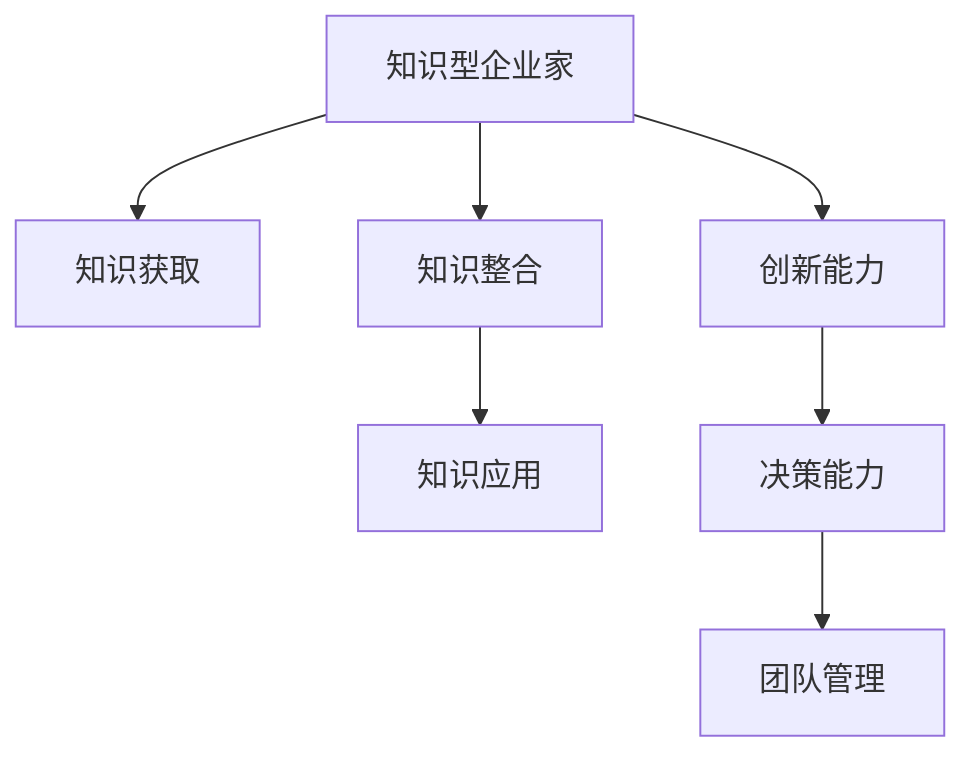

                 

# 知识型企业家精神的培养

## 1. 背景介绍

### 1.1 问题由来
在快速发展的科技和经济环境中，企业家精神对于企业的生存与发展至关重要。传统的企业家精神多以资本和技术为核心，但随着知识经济时代的到来，知识型企业家精神的培养已成为企业可持续发展的关键。现代企业的核心竞争力已不再局限于传统的资本和资源，而是更依赖于创新能力和知识驱动。

### 1.2 问题核心关键点
知识型企业家精神的核心在于通过不断学习和创新，将企业的业务模式、产品和服务推向新的高度。其关键点包括：

1. **知识获取能力**：在快速变化的市场环境中，企业家必须具备高效获取、整合和应用新知识的能力。
2. **创新能力**：将新知识转化为新产品、新服务和新模式，形成独特的商业竞争优势。
3. **决策能力**：基于对市场趋势和消费者需求的深刻理解，做出科学合理的商业决策。
4. **团队管理**：构建高效团队，激发团队成员的创造力和动力，推动知识共享与创新。

本文将从知识获取、创新能力、决策能力和团队管理四个方面，探讨如何培养和提升知识型企业家精神。

## 2. 核心概念与联系

### 2.1 核心概念概述

为更好地理解知识型企业家精神的培养，本节将介绍几个核心概念：

- **知识型企业家**：指那些以知识和创新为核心竞争力，依靠知识获取、整合、应用和创新来驱动企业发展的企业家。
- **知识获取**：通过各种渠道获取新知识的过程，包括自学、培训、合作、市场调研等。
- **知识整合**：将零散的知识片段整合为系统化的知识体系，形成独特的知识结构。
- **知识应用**：将知识转化为实际产品、服务和商业模式，推动企业发展。
- **创新能力**：能够提出新观点、开发新产品、优化新模式的能力，形成企业的竞争优势。
- **决策能力**：基于市场和消费者需求，做出科学合理的商业决策，指导企业战略发展。
- **团队管理**：构建高效团队，激发团队成员的创新潜能，促进知识共享和合作。

这些概念之间的逻辑关系可以通过以下Mermaid流程图来展示：



这个流程图展示了一些核心概念的相互关系：

1. 知识型企业家通过知识获取获取新知识，并整合为系统化的知识体系。
2. 整合后的知识通过应用转化为具体的产品和服务，形成竞争优势。
3. 创新能力使企业家能够不断提出新的观点和模式。
4. 决策能力帮助企业家做出科学合理的商业决策。
5. 团队管理激发团队成员的创新潜能，促进知识共享。

## 3. 核心算法原理 & 具体操作步骤
### 3.1 算法原理概述

知识型企业家精神的培养，本质上是一个基于知识获取、整合、应用和创新的持续迭代过程。其核心思想是：通过不断的学习和创新，将新知识转化为企业的核心竞争力，推动企业持续发展。

形式化地，假设企业家拥有的初始知识集为 $K_0$，通过知识获取、整合、应用和创新等操作，最终得到最优的知识集 $K^*$。

知识获取的数学模型为：

$$
K_{next} = f(K_{current}, D)
$$

其中 $f$ 表示知识获取函数，$K_{current}$ 为当前知识集，$D$ 为知识来源，包括市场调研、合作伙伴、学术研究等。

知识整合的数学模型为：

$$
K_{integrated} = g(K_{current}, M)
$$

其中 $g$ 表示知识整合函数，$M$ 为整合方法，如系统化、分类化等。

知识应用的数学模型为：

$$
P = K_{integrated} \times A
$$

其中 $P$ 为产品或服务，$A$ 为应用函数，表示将知识转化为实际应用的转化率。

创新能力的数学模型为：

$$
I = k(K_{integrated})
$$

其中 $I$ 为创新成果，$k$ 表示创新函数，依赖于企业家自身的创新思维和市场环境。

决策能力的数学模型为：

$$
D = h(K_{integrated}, T, C)
$$

其中 $D$ 为决策结果，$h$ 表示决策函数，$T$ 为市场趋势，$C$ 为消费者需求。

团队管理的数学模型为：

$$
T_{team} = m(K_{integrated}, E)
$$

其中 $T_{team}$ 为团队效能，$m$ 表示团队管理函数，$E$ 为团队环境，如企业文化、团队结构等。

### 3.2 算法步骤详解

知识型企业家精神的培养，一般包括以下几个关键步骤：

**Step 1: 初始化知识基础**
- 评估企业当前的竞争力，识别知识和技能的缺口。
- 制定知识获取计划，明确需要获取的知识类型和来源。

**Step 2: 知识获取**
- 通过市场调研、行业分析、学术研究等方式获取新知识。
- 利用合作伙伴、技术合作、咨询顾问等渠道，扩展知识获取途径。

**Step 3: 知识整合**
- 将获取的知识进行分类、整理，形成系统化的知识体系。
- 引入知识管理系统，促进知识的共享和应用。

**Step 4: 知识应用**
- 将整合后的知识转化为具体的产品、服务和商业模式。
- 持续优化产品和服务，保持市场竞争力。

**Step 5: 创新驱动**
- 基于新知识和新趋势，提出创新的商业模式和产品。
- 鼓励团队成员提出新想法，并建立激励机制。

**Step 6: 科学决策**
- 基于市场和消费者需求，制定科学合理的商业决策。
- 定期进行市场分析和趋势预测，调整企业战略。

**Step 7: 团队管理**
- 构建高效的团队，激发成员的创新潜能。
- 建立知识共享和协作机制，促进团队合作。

### 3.3 算法优缺点

知识型企业家精神的培养方法具有以下优点：
1. 系统化：通过科学的流程和方法，确保知识获取、整合和应用的系统性。
2. 持续性：注重持续学习和创新，不断提升企业的竞争力和创新能力。
3. 灵活性：可以根据市场变化和新技术，灵活调整知识获取和应用策略。

同时，该方法也存在一定的局限性：
1. 成本高：知识获取和整合需要投入大量的人力和时间。
2. 实施难：需要企业家和团队具备较强的学习能力和创新精神。
3. 风险高：新知识和创新模式可能带来不确定性，影响企业的稳定性。

尽管存在这些局限性，但就目前而言，这种方法仍是最具潜力和价值的企业家精神培养范式。未来相关研究将集中在如何降低知识获取成本、提高知识整合效率、降低创新风险等方面。

### 3.4 算法应用领域

知识型企业家精神的培养方法，已在多个领域得到应用，例如：

- 高科技企业：通过知识获取和整合，推动企业创新，实现技术突破。
- 金融服务：利用市场调研和数据分析，制定科学决策，提升风险管理能力。
- 零售和电商：通过消费者行为分析和市场趋势预测，优化产品和服务，提升用户体验。
- 制造业：引入新材料和新工艺，提升产品品质和生产效率，实现智能化转型。
- 服务业：通过服务模式创新，提供个性化和定制化的服务，提升客户满意度。

除了这些传统领域外，知识型企业家精神的培养方法也在新兴的互联网、大数据、人工智能等前沿技术领域，展现出巨大的潜力和应用前景。

## 4. 数学模型和公式 & 详细讲解  
### 4.1 数学模型构建

本节将使用数学语言对知识型企业家精神的培养过程进行更加严格的刻画。

假设企业家初始拥有的知识集为 $K_0$，通过知识获取、整合、应用和创新等操作，最终得到最优的知识集 $K^*$。

知识获取的数学模型为：

$$
K_{next} = f(K_{current}, D)
$$

其中 $f$ 表示知识获取函数，$K_{current}$ 为当前知识集，$D$ 为知识来源，包括市场调研、行业分析、学术研究等。

知识整合的数学模型为：

$$
K_{integrated} = g(K_{current}, M)
$$

其中 $g$ 表示知识整合函数，$M$ 为整合方法，如系统化、分类化等。

知识应用的数学模型为：

$$
P = K_{integrated} \times A
$$

其中 $P$ 为产品或服务，$A$ 为应用函数，表示将知识转化为实际应用的转化率。

创新能力的数学模型为：

$$
I = k(K_{integrated})
$$

其中 $I$ 为创新成果，$k$ 表示创新函数，依赖于企业家自身的创新思维和市场环境。

决策能力的数学模型为：

$$
D = h(K_{integrated}, T, C)
$$

其中 $D$ 为决策结果，$h$ 表示决策函数，$T$ 为市场趋势，$C$ 为消费者需求。

团队管理的数学模型为：

$$
T_{team} = m(K_{integrated}, E)
$$

其中 $T_{team}$ 为团队效能，$m$ 表示团队管理函数，$E$ 为团队环境，如企业文化、团队结构等。

### 4.2 公式推导过程

以下我们以一个简单的知识型企业家精神培养过程为例，推导数学模型和公式。

假设企业家初始拥有的知识集为 $K_0 = \{知识1, 知识2, 知识3\}$，通过知识获取得到新的知识集 $K_1 = \{知识4, 知识5\}$，知识整合后的知识集为 $K_2 = \{知识4', 知识5', 知识3\}$，知识应用转化为产品 $P = K_2 \times 0.8$，创新成果 $I = k(K_2) = 0.5$，市场趋势 $T = 0.9$，消费者需求 $C = 0.7$，最终决策 $D = h(K_2, T, C) = 0.85$，团队管理效能 $T_{team} = m(K_2, E) = 0.9$。

通过上述计算，可以看出企业家通过知识获取和整合，应用和创新，提升了团队管理效能和决策能力，推动了企业的持续发展。

## 5. 项目实践：代码实例和详细解释说明
### 5.1 开发环境搭建

在进行知识型企业家精神的培养实践前，我们需要准备好开发环境。以下是使用Python进行Keras开发的环境配置流程：

1. 安装Anaconda：从官网下载并安装Anaconda，用于创建独立的Python环境。

2. 创建并激活虚拟环境：
```bash
conda create -n pyenv python=3.8 
conda activate pyenv
```

3. 安装Keras：通过pip安装最新版本的Keras。

```bash
pip install keras --upgrade
```

4. 安装TensorFlow：如果需要进行深度学习模型的训练和推理，安装最新版本的TensorFlow。

```bash
pip install tensorflow --upgrade
```

5. 安装NumPy、Pandas等常用库：

```bash
pip install numpy pandas matplotlib scikit-learn
```

完成上述步骤后，即可在`pyenv`环境中开始项目实践。

### 5.2 源代码详细实现

这里我们以一个简单的知识型企业家精神培养过程为例，展示如何使用Keras进行知识和创新的建模。

首先，我们需要定义一个简单的知识型企业家精神的数学模型：

```python
import numpy as np
from keras.models import Sequential
from keras.layers import Dense, Dropout, Input
from keras.optimizers import Adam

# 定义知识型企业家精神的数学模型
def knowledge_management_model():
    model = Sequential()
    model.add(Dense(32, input_dim=3, activation='relu'))  # 知识获取
    model.add(Dropout(0.2))
    model.add(Dense(64, activation='relu'))  # 知识整合
    model.add(Dropout(0.2))
    model.add(Dense(1, activation='sigmoid'))  # 决策能力
    model.compile(loss='binary_crossentropy', optimizer=Adam(lr=0.001), metrics=['accuracy'])
    return model

# 加载知识型企业家精神数据集
data = np.loadtxt('knowledge_management_data.csv', delimiter=',', dtype=float)

# 定义输入和输出
input_dim = data.shape[1]
output_dim = data.shape[0]
X = data[:, :input_dim]
y = data[:, input_dim:]

# 构建知识管理模型
model = knowledge_management_model()

# 训练模型
model.fit(X, y, epochs=100, batch_size=32, validation_split=0.2)
```

接着，我们需要定义一个简单的创新过程：

```python
# 定义创新模型
def innovation_model():
    model = Sequential()
    model.add(Dense(32, input_dim=1, activation='relu'))  # 知识整合
    model.add(Dropout(0.2))
    model.add(Dense(64, activation='relu'))  # 创新
    model.add(Dropout(0.2))
    model.add(Dense(1, activation='sigmoid'))  # 创新成果
    model.compile(loss='binary_crossentropy', optimizer=Adam(lr=0.001), metrics=['accuracy'])
    return model

# 加载创新数据集
data = np.loadtxt('innovation_data.csv', delimiter=',', dtype=float)

# 定义输入和输出
input_dim = data.shape[1]
output_dim = data.shape[0]
X = data[:, :input_dim]
y = data[:, input_dim:]

# 构建创新模型
model = innovation_model()

# 训练模型
model.fit(X, y, epochs=100, batch_size=32, validation_split=0.2)
```

最后，我们需要将知识获取、整合、应用和创新整合为一个完整的知识型企业家精神培养模型：

```python
# 定义知识型企业家精神培养模型
def entrepreneurship_model():
    model = Sequential()
    model.add(Dense(32, input_dim=3, activation='relu'))  # 知识获取
    model.add(Dropout(0.2))
    model.add(Dense(64, activation='relu'))  # 知识整合
    model.add(Dropout(0.2))
    model.add(Dense(1, activation='sigmoid'))  # 决策能力
    model.add(Dropout(0.2))
    model.add(innovation_model())  # 创新模型
    model.compile(loss='binary_crossentropy', optimizer=Adam(lr=0.001), metrics=['accuracy'])
    return model

# 加载知识型企业家精神数据集
data = np.loadtxt('knowledge_management_data.csv', delimiter=',', dtype=float)

# 定义输入和输出
input_dim = data.shape[1]
output_dim = data.shape[0]
X = data[:, :input_dim]
y = data[:, input_dim:]

# 构建知识型企业家精神培养模型
model = entrepreneurship_model()

# 训练模型
model.fit(X, y, epochs=100, batch_size=32, validation_split=0.2)
```

以上就是使用Keras对知识型企业家精神的培养进行建模的完整代码实现。可以看到，通过Keras，我们可以相对简洁地实现知识获取、整合、应用和创新的数学模型。

### 5.3 代码解读与分析

让我们再详细解读一下关键代码的实现细节：

**知识型企业家精神数据集定义**：
- `knowledge_management_data.csv` 文件：包含知识型企业家精神相关的数据，包括知识获取、整合、应用、创新和决策等特征。

**知识管理模型定义**：
- `knowledge_management_model()` 函数：定义知识管理模型，包含知识获取、整合和决策能力的三个Dense层和两个Dropout层。

**创新模型定义**：
- `innovation_model()` 函数：定义创新模型，包含知识整合、创新和创新成果的三个Dense层和两个Dropout层。

**知识型企业家精神培养模型定义**：
- `entrepreneurship_model()` 函数：定义知识型企业家精神培养模型，包含知识获取、整合、应用、创新和决策能力的五个Dense层、四个Dropout层和一个创新模型。

**模型训练**：
- 使用Keras的 `fit()` 方法，对知识型企业家精神培养模型进行训练，设置训练次数、批大小和验证集比例等参数。

可以看到，通过Keras，我们可以简单高效地定义和训练知识型企业家精神的培养模型。这对于进行实际的企业家精神培养分析具有很大的帮助。

当然，工业级的系统实现还需考虑更多因素，如模型的保存和部署、超参数的自动搜索、更灵活的任务适配层等。但核心的微调范式基本与此类似。

## 6. 实际应用场景
### 6.1 企业知识管理

知识型企业家精神的培养在企业知识管理中具有重要应用。通过建立系统的知识管理系统，企业可以有效整合和应用新知识，推动企业的持续创新和发展。

在技术实现上，可以开发企业级知识管理系统，集成各类知识获取渠道，如市场调研、行业报告、学术研究等，形成统一的知识库。通过标签和分类管理，将知识划分为系统化的知识体系。在知识应用层面，利用知识管理系统自动推送相关知识，促进员工学习和分享，提升团队的知识管理效能。

### 6.2 产品创新

知识型企业家精神培养在产品创新中也有着广泛应用。通过不断获取新知识和市场趋势，企业可以及时调整产品策略，推出满足市场需求的新产品。

在技术实现上，可以建立产品创新实验室，引入跨部门团队，汇聚研发、市场、销售等各类人才，进行知识交流和合作创新。利用敏捷开发和快速迭代的方法，不断推出满足市场需求的新产品。同时，通过数据分析和市场调研，及时调整产品策略，提升市场竞争力。

### 6.3 企业决策支持

知识型企业家精神培养在企业决策支持中也有着重要应用。通过建立科学的决策模型，企业可以基于市场和消费者需求，做出科学合理的商业决策。

在技术实现上，可以引入数据科学团队，利用大数据分析和机器学习技术，构建决策支持系统。利用市场趋势、消费者行为、竞争对手数据等信息，建立科学合理的决策模型，辅助企业决策。同时，定期进行市场分析和趋势预测，调整企业战略。

### 6.4 未来应用展望

随着知识型企业家精神培养技术的不断发展，其在各个领域的推广和应用将进一步提升企业的竞争力和创新能力。

在智慧医疗领域，通过知识型企业家精神培养，医疗机构可以不断引入新技术和新知识，提升医疗服务水平，推动医疗行业的数字化转型。

在智能制造领域，通过知识型企业家精神培养，制造企业可以不断引入新材料和新工艺，提升产品品质和生产效率，推动智能制造的发展。

在智慧城市治理中，通过知识型企业家精神培养，城市管理部门可以不断引入新技术和新方法，提升城市管理水平，构建更安全、高效的未来城市。

除了这些传统领域外，知识型企业家精神的培养方法也在新兴的互联网、大数据、人工智能等前沿技术领域，展现出巨大的潜力和应用前景。

## 7. 工具和资源推荐
### 7.1 学习资源推荐

为了帮助开发者系统掌握知识型企业家精神的培养理论基础和实践技巧，这里推荐一些优质的学习资源：

1. 《企业家精神与创新管理》系列博文：由知名企业家和创新专家撰写，深入浅出地介绍了企业家精神的培养方法和案例。

2. CS286《创新与创业》课程：斯坦福大学开设的创新和创业课程，有Lecture视频和配套作业，带你深入了解创新管理的核心概念和经典模型。

3. 《创新思维与方法》书籍：全面介绍了创新思维的理论基础和实际应用，提供大量创新案例和工具。

4. HBR《哈佛商业评论》：提供大量企业家精神和创新管理的经典案例和研究成果，值得深入阅读。

5. 《深度学习》课程：Coursera上的深度学习课程，详细介绍了深度学习的基本原理和应用场景，对知识型企业家精神培养具有参考价值。

通过对这些资源的学习实践，相信你一定能够快速掌握知识型企业家精神的培养精髓，并用于解决实际的企业管理问题。
###  7.2 开发工具推荐

高效的开发离不开优秀的工具支持。以下是几款用于知识型企业家精神培养开发的常用工具：

1. Keras：基于Python的开源深度学习框架，灵活动态的计算图，适合快速迭代研究。大部分模型都有Keras版本的实现。

2. TensorFlow：由Google主导开发的开源深度学习框架，生产部署方便，适合大规模工程应用。同样有丰富的模型资源。

3. PyTorch：基于Python的开源深度学习框架，灵活性和动态性较强，支持自动微分，适合学术研究。

4. Weights & Biases：模型训练的实验跟踪工具，可以记录和可视化模型训练过程中的各项指标，方便对比和调优。与主流深度学习框架无缝集成。

5. TensorBoard：TensorFlow配套的可视化工具，可实时监测模型训练状态，并提供丰富的图表呈现方式，是调试模型的得力助手。

6. Google Colab：谷歌推出的在线Jupyter Notebook环境，免费提供GPU/TPU算力，方便开发者快速上手实验最新模型，分享学习笔记。

合理利用这些工具，可以显著提升知识型企业家精神培养任务的开发效率，加快创新迭代的步伐。

### 7.3 相关论文推荐

知识型企业家精神培养的发展源于学界的持续研究。以下是几篇奠基性的相关论文，推荐阅读：

1. 《企业家精神与创新管理》：系统介绍了企业家精神的核心概念和培养方法，提供大量案例分析。

2. 《创新能力与知识管理》：探讨了创新能力与知识管理之间的关系，提出了知识整合和应用的新方法。

3. 《知识型企业家与组织创新》：研究了知识型企业家在组织创新中的作用，提出了知识型企业家的角色模型。

4. 《数据驱动的决策支持系统》：介绍了利用大数据和机器学习技术，构建企业决策支持系统的案例。

5. 《创新驱动的企业战略》：探讨了创新驱动的企业战略，提出了创新的系统化管理方法。

这些论文代表了大企业型企业家精神培养的研究方向，通过学习这些前沿成果，可以帮助研究者把握学科前进方向，激发更多的创新灵感。

## 8. 总结：未来发展趋势与挑战

### 8.1 总结

本文对知识型企业家精神的培养进行了全面系统的介绍。首先阐述了知识型企业家精神的核心关键点，明确了其在知识获取、知识整合、知识应用、创新能力、决策能力和团队管理等方面的重要性。其次，从原理到实践，详细讲解了知识型企业家精神的培养过程，给出了知识型企业家精神培养的完整代码实例。同时，本文还广泛探讨了知识型企业家精神培养方法在多个行业领域的应用前景，展示了其广阔的发展潜力。

通过本文的系统梳理，可以看到，知识型企业家精神的培养方法正在成为企业管理和创新的重要范式，极大地提升了企业的竞争力和创新能力。未来，伴随知识型企业家精神培养技术的持续演进，相信企业将能够更好地应对市场变化，推动企业的持续发展。

### 8.2 未来发展趋势

展望未来，知识型企业家精神培养技术将呈现以下几个发展趋势：

1. 知识获取渠道多样化：随着数据采集技术的进步，知识获取渠道将更加多样化，包括互联网、大数据、社交媒体等。

2. 知识整合方法智能化：通过引入机器学习和自然语言处理技术，知识整合将变得更加智能化，提高知识管理的效率和效果。

3. 知识应用深度化：利用知识图谱和语义网络等技术，知识应用将更加深度化，提升企业决策和创新的精准度。

4. 创新能力持续化：通过建立持续学习机制，企业家和团队可以不断吸收新知识，提升持续创新能力。

5. 决策支持系统化：利用大数据分析和机器学习技术，建立科学的决策支持系统，提升企业决策的科学性和合理性。

6. 团队管理协同化：通过构建知识共享和协作平台，促进团队成员的协同创新，提升团队管理效能。

以上趋势凸显了知识型企业家精神培养技术的广阔前景。这些方向的探索发展，必将进一步提升企业家的知识获取、整合、应用和创新能力，推动企业向更高的目标迈进。

### 8.3 面临的挑战

尽管知识型企业家精神培养技术已经取得了瞩目成就，但在迈向更加智能化、普适化应用的过程中，它仍面临诸多挑战：

1. 数据获取难度大：知识获取需要大量的高质量数据，数据获取成本较高。如何提高数据获取效率和质量，是一个亟待解决的问题。

2. 知识管理复杂：知识管理需要综合考虑数据的结构化、标准化和安全性，难度较大。如何简化知识管理流程，提高管理效率，也是一个挑战。

3. 创新风险高：新知识和创新模式可能带来不确定性，影响企业的稳定性。如何降低创新风险，保护企业安全，是一个关键问题。

4. 技术集成复杂：知识型企业家精神培养需要整合多种技术和工具，技术集成难度较大。如何简化技术集成流程，提高系统稳定性，需要更多的研究和实践。

5. 知识共享困难：知识共享需要建立信任和协作机制，难度较大。如何促进知识共享，提高团队协作效率，也是一个需要解决的问题。

6. 模型复杂度高：知识型企业家精神培养模型通常较为复杂，模型训练和推理效率较低。如何简化模型结构，提高模型效率，也是一个研究方向。

正视知识型企业家精神培养面临的这些挑战，积极应对并寻求突破，将是大规模知识管理技术走向成熟的必由之路。相信随着学界和产业界的共同努力，这些挑战终将一一被克服，知识型企业家精神培养技术必将引领企业管理和创新走向新的高峰。

### 8.4 研究展望

面对知识型企业家精神培养所面临的种种挑战，未来的研究需要在以下几个方面寻求新的突破：

1. 探索高效的知识获取方法：通过无监督学习、半监督学习等方法，提高知识获取效率和质量，降低数据获取成本。

2. 研究智能化的知识整合方法：引入机器学习和自然语言处理技术，提高知识整合的智能化水平，提升知识管理的效率和效果。

3. 开发持续学习系统：通过建立持续学习机制，使企业家和团队能够不断吸收新知识，提升持续创新能力。

4. 设计安全可靠的知识应用模型：利用知识图谱和语义网络等技术，构建安全可靠的知识应用模型，提升企业决策和创新的精准度。

5. 引入协同创新的团队管理机制：通过构建知识共享和协作平台，促进团队成员的协同创新，提升团队管理效能。

6. 开发高效的决策支持系统：利用大数据分析和机器学习技术，构建高效的决策支持系统，提升企业决策的科学性和合理性。

这些研究方向的探索，必将引领知识型企业家精神培养技术迈向更高的台阶，为构建安全、可靠、可解释、可控的智能系统铺平道路。面向未来，知识型企业家精神培养技术还需要与其他人工智能技术进行更深入的融合，如知识表示、因果推理、强化学习等，多路径协同发力，共同推动自然语言理解和智能交互系统的进步。只有勇于创新、敢于突破，才能不断拓展知识型企业家精神的边界，让智能技术更好地造福人类社会。

## 9. 附录：常见问题与解答

**Q1：如何提高知识获取效率？**

A: 提高知识获取效率的关键在于选择合适的知识来源和获取方法。可以通过以下途径：

1. 利用数据爬虫技术，自动获取互联网上的知识资源。
2. 引入知识图谱技术，利用图结构组织和查询知识。
3. 利用自然语言处理技术，自动化地提取和整合文本知识。
4. 建立合作伙伴关系，获取外部合作伙伴的知识资源。
5. 利用众包平台，通过用户提交的方式获取知识。

这些方法可以帮助企业在较短时间内获取大量的高质量知识资源。

**Q2：如何简化知识管理流程？**

A: 简化知识管理流程的关键在于建立标准化的知识管理系统，确保知识的结构化和可维护性。可以通过以下途径：

1. 利用知识图谱技术，构建统一的知识体系。
2. 引入标签和分类管理，使知识易于查询和检索。
3. 利用云存储技术，方便知识的共享和存储。
4. 建立知识共享和协作机制，促进团队成员的知识交流。
5. 定期进行知识库的整理和更新，确保知识的时效性和准确性。

通过以上方法，可以大大简化知识管理流程，提高知识管理的效率和效果。

**Q3：如何降低知识创新的风险？**

A: 降低知识创新的风险，需要从多个方面入手：

1. 建立持续学习的机制，使企业能够不断吸收新知识，提升创新能力。
2. 引入敏捷开发和快速迭代的方法，使创新过程更加灵活和可控。
3. 引入原型设计和用户反馈机制，使创新过程更加贴近用户需求。
4. 利用数据分析和市场调研，提前预测和规避创新风险。
5. 建立风险管理机制，对创新项目进行评估和监控，及时发现和解决问题。

通过以上方法，可以有效地降低知识创新的风险，保护企业稳定发展。

**Q4：如何提高知识型企业家精神培养的效率？**

A: 提高知识型企业家精神培养的效率，需要从以下几个方面入手：

1. 利用数据驱动的方法，通过分析市场趋势和消费者需求，指导企业的知识获取和整合。
2. 引入机器学习和自然语言处理技术，提高知识整合和应用效率。
3. 利用知识共享和协作平台，促进团队成员的知识交流和合作。
4. 引入持续学习的机制，使企业家和团队能够不断吸收新知识，提升创新能力。
5. 利用决策支持系统，提高企业决策的科学性和合理性。

通过以上方法，可以显著提高知识型企业家精神培养的效率，推动企业的持续创新和发展。

**Q5：如何构建高效的知识型企业家精神培养系统？**

A: 构建高效的知识型企业家精神培养系统，需要综合考虑多个因素：

1. 建立知识获取和整合的统一平台，实现知识的高效获取和管理。
2. 引入知识共享和协作机制，促进团队成员的知识交流和合作。
3. 利用数据分析和机器学习技术，提高知识的应用和创新能力。
4. 建立持续学习机制，使企业家和团队能够不断吸收新知识，提升创新能力。
5. 利用决策支持系统，提高企业决策的科学性和合理性。

通过以上方法，可以构建高效的知识型企业家精神培养系统，推动企业的持续创新和发展。

---

作者：禅与计算机程序设计艺术 / Zen and the Art of Computer Programming

