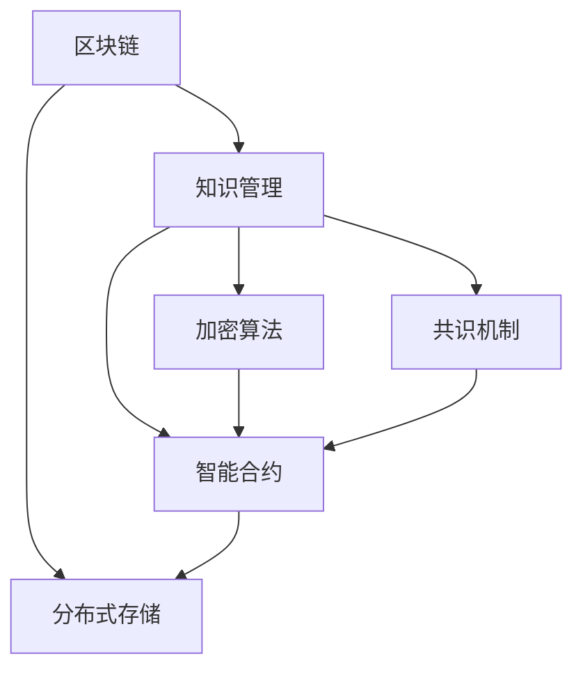

                 

# 知识的分布式存储：区块链技术的潜力

> 关键词：区块链技术,分布式存储,知识管理,数据安全,加密算法

## 1. 背景介绍

### 1.1 问题由来
随着数字时代的到来，知识的存储和管理问题越来越受到重视。传统的数据中心存储系统往往集中在一个或几个大型数据中心，数据安全性、可用性、可扩展性等问题逐步显现。然而，分布式存储系统通过分散存储数据，有效避免了单点故障和中心化风险，成为知识管理的未来趋势。近年来，区块链技术作为一种去中心化且具有共识机制的分布式存储技术，逐渐被应用于知识管理领域，成为未来数据存储和知识共享的全新选择。

### 1.2 问题核心关键点
区块链技术在知识管理中的应用，主要是利用其去中心化、不可篡改、可追溯等特性，实现数据的分布式存储和加密保护。具体来说，基于区块链的分布式知识管理系统应具备以下特点：
- 数据去中心化：将数据存储在多个节点上，避免单点故障，提高数据可用性和持久性。
- 加密保护：使用加密算法对数据进行保护，防止未授权访问和数据泄露。
- 智能合约：通过智能合约自动执行数据访问和管理的规则，提高系统效率。
- 共识机制：通过共识机制确保数据的真实性和一致性，维护系统公平和信任。

这些特性使得基于区块链的分布式存储系统能够提供安全、可靠、高效的知识管理解决方案。

## 2. 核心概念与联系

### 2.1 核心概念概述

为更好地理解基于区块链的知识管理解决方案，本节将介绍几个密切相关的核心概念：

- 区块链(Blockchain)：一种分布式、去中心化的账本技术，通过共识机制确保数据的真实性和不可篡改性。
- 分布式存储(Distributed Storage)：数据存储在多个分布式节点上，避免单点故障和中心化风险，提高数据的可用性和持久性。
- 知识管理(Knowledge Management)：通过信息技术手段对企业的知识进行采集、存储、管理、共享和应用，提升企业竞争力。
- 加密算法(Cryptography)：利用数学方法对数据进行加密保护，确保数据传输和存储的安全性。
- 智能合约(Smart Contract)：在区块链上自动执行数据访问和管理规则，减少人为干预，提高系统效率。
- 共识机制(Consensus Mechanism)：区块链网络中达成共识的算法或协议，确保数据的真实性和一致性。

这些核心概念之间的逻辑关系可以通过以下Mermaid流程图来展示：



这个流程图展示了大语言模型的核心概念及其之间的关系：

1. 区块链通过去中心化和共识机制，提供了可靠的数据存储和分布式共享的基础。
2. 分布式存储系统进一步分散数据，提高数据的可用性和持久性。
3. 知识管理通过信息技术手段，采集、存储、管理、共享和应用企业的知识，提升企业竞争力。
4. 加密算法对数据进行保护，确保数据传输和存储的安全性。
5. 智能合约自动执行数据访问和管理规则，提高系统效率。
6. 共识机制确保数据的真实性和一致性，维护系统公平和信任。

## 3. 核心算法原理 & 具体操作步骤
### 3.1 算法原理概述

基于区块链的分布式存储系统，其核心算法原理主要包括以下几个方面：

- 共识机制：利用共识算法如PoW、PoS、DPoS等，确保数据的一致性和真实性。
- 分布式存储协议：通过分布式文件系统如IPFS、Filecoin等，将数据存储在多个节点上，实现去中心化存储。
- 加密算法：使用AES、SHA、RSA等加密算法，对数据进行加密保护。
- 智能合约：使用Solidity、Ethereum、Polkadot等区块链平台的智能合约语言，实现数据的自动管理和权限控制。

在知识管理系统中，通常会将以上几种算法结合使用，形成完整的分布式存储解决方案。

### 3.2 算法步骤详解

基于区块链的分布式存储系统通常包括以下几个关键步骤：

**Step 1: 设计分布式存储架构**
- 选择合适的分布式存储系统，如IPFS、Filecoin等。
- 设计系统的数据分布和冗余策略，确保数据的高可用性和持久性。

**Step 2: 加密数据**
- 选择合适的加密算法，对数据进行加密保护。
- 在区块链上生成加密哈希值，确保数据的不可篡改性。

**Step 3: 上链存储**
- 将加密后的数据上链存储，确保数据的分布式性和共识性。
- 使用智能合约自动管理数据的访问权限和权限控制。

**Step 4: 访问和查询数据**
- 使用分布式存储协议和智能合约，对数据进行高效访问和查询。
- 通过加密哈希值验证数据的完整性和真实性。

**Step 5: 审计和监控**
- 使用区块链的透明性和可追溯性，对数据访问和操作进行审计和监控。
- 使用共识机制维护系统的一致性和公平性。

通过以上步骤，基于区块链的分布式存储系统可以实现知识管理中数据的分布式存储和加密保护，确保数据的可靠性和安全性。

### 3.3 算法优缺点

基于区块链的分布式存储系统具有以下优点：
1. 去中心化和去中心化：数据分散存储在多个节点上，避免单点故障和中心化风险。
2. 数据不可篡改：利用区块链的共识机制，确保数据的真实性和不可篡改性。
3. 高可用性和持久性：数据在多个节点上冗余存储，确保数据的可用性和持久性。
4. 高效的数据访问和查询：使用智能合约和分布式存储协议，对数据进行高效访问和查询。
5. 透明的审计和监控：区块链的透明性和可追溯性，提供有效的审计和监控手段。

同时，这种系统也存在一些缺点：
1. 数据存储成本高：分布式存储和加密保护会增加数据存储成本。
2. 交易延迟高：区块链的交易延迟可能会影响系统的响应速度。
3. 系统复杂度高：分布式存储和智能合约增加了系统的复杂性，开发和维护难度大。
4. 能源消耗高：某些共识机制如PoW消耗大量能源，对环境造成影响。
5. 法律和合规问题：区块链的匿名性和去中心化特性，可能带来法律和合规问题。

尽管存在这些局限性，但区块链技术在知识管理中的应用潜力巨大，能够提供一种全新的、安全可靠的数据存储和知识管理方案。

### 3.4 算法应用领域

基于区块链的分布式存储系统在知识管理中的应用领域非常广泛，包括但不限于以下方面：

- 企业内部知识管理：通过分布式存储系统，将企业的文档、报告、专利等知识资源进行集中管理和共享。
- 学术研究和出版：利用区块链技术，实现学术论文和数据集的分发和共享，提高学术研究的透明度和可追溯性。
- 公共数据管理：通过分布式存储和加密保护，确保政府公开数据的透明性和安全性。
- 文化保护与传承：利用区块链技术，记录和存储文化遗产数据，实现数字化保护和传播。
- 知识产权保护：通过区块链的不可篡改性和透明性，确保知识产权的合法性和所有权。

## 4. 数学模型和公式 & 详细讲解 & 举例说明

### 4.1 数学模型构建

假设基于区块链的分布式存储系统中有N个节点，每个节点存储的数据量为d。系统的目标是最小化存储成本和查询延迟，同时确保数据的完整性和安全性。

定义存储成本为C，查询延迟为D，完整性因子为P，安全性因子为S。则系统的优化目标为：

$$
\min_{C,D,P,S} \text{total cost} = \lambda_1 C + \lambda_2 D + \lambda_3 P + \lambda_4 S
$$

其中，$\lambda_1, \lambda_2, \lambda_3, \lambda_4$ 为权重因子，表示成本、延迟、完整性、安全性的重要性。

### 4.2 公式推导过程

在实际应用中，需要根据具体情况对上述优化问题进行求解。常见的求解方法包括：

- 基于遗传算法的优化方法：通过模拟生物进化过程，寻找最优的存储方案。
- 基于强化学习的优化方法：通过训练智能体，学习最优的存储策略。
- 基于运筹学的优化方法：通过数学建模和求解，寻找最优的存储方案。

以基于遗传算法的优化方法为例，其基本流程如下：

1. 初始化种群：随机生成一组存储方案，作为初始种群。
2. 计算适应度：根据存储成本、延迟、完整性、安全性等指标，计算每个存储方案的适应度。
3. 选择和交叉：根据适应度选择部分方案，进行交叉和变异操作，生成下一代种群。
4. 优化迭代：重复2-3步骤，直到达到预设的迭代次数或收敛条件。
5. 选择最优方案：从最后一代种群中选择适应度最高的方案，作为最终解。

### 4.3 案例分析与讲解

以下以学术研究和出版为例，说明基于区块链的分布式存储系统如何实现知识的共享和保护。

假设学术期刊论文的存储和共享过程中，需要考虑以下几个因素：

- 论文的存储成本
- 论文的查询延迟
- 论文的完整性
- 论文的安全性

在区块链上，可以设计一个智能合约，自动执行论文的存储和访问规则。具体来说，论文的上传者和访问者需要共同签署一份智能合约，定义论文的存储策略和访问权限。上传者将论文上传到区块链，生成加密哈希值，智能合约自动记录上传时间和哈希值，并通知所有访问者。访问者可以通过智能合约验证论文的完整性和真实性，并根据访问权限获取论文内容。

在分布式存储上，可以使用IPFS或Filecoin等分布式存储系统，将论文分片存储在多个节点上，确保论文的高可用性和持久性。智能合约可以自动管理论文的访问权限，确保只有授权用户才能访问论文。

通过这种方式，学术期刊论文的存储和共享过程，既保证了论文的完整性和安全性，又实现了论文的自由共享，提升了学术研究的透明度和可追溯性。

## 5. 项目实践：代码实例和详细解释说明
### 5.1 开发环境搭建

在进行基于区块链的分布式存储系统开发前，我们需要准备好开发环境。以下是使用Python进行以太坊智能合约开发的环境配置流程：

1. 安装Solidity编译器：从官网下载并安装Solidity编译器，用于编译智能合约代码。
2. 安装Truffle框架：从官网下载并安装Truffle框架，用于自动化部署和管理智能合约。
3. 安装Ganache：从官网下载并安装Ganache，用于本地测试网络，模拟区块链环境。

完成上述步骤后，即可在Ganache环境中开始智能合约的开发和测试。

### 5.2 源代码详细实现

下面我以学术论文共享系统为例，给出使用Solidity语言对智能合约进行开发的Pytho代码实现。

首先，定义智能合约的存储函数：

```python
from truffle_hooks import python_hooks

@python_hooks.load_web3
def storage_function():
    """
    存储函数，将论文上传并加密存储到区块链上
    """
    # 获取上传者地址
    上传者地址 = web3.eth.accounts[0]
    # 获取上传时间和哈希值
    上传时间 = web3.eth.blockNumber
    哈希值 = web3.utils.sha3(论文内容)
    # 存储哈希值到区块链
    web3.eth.sendTransaction({
        'to': 上传者地址,
        'from': web3.eth.accounts[0],
        'value': 上传者地址,
        'gas': 200000,
        'gasPrice': web3.eth.gasPrice
    })
    # 记录上传时间、哈希值和上传者地址
    上传时间 = web3.eth.blockNumber
    哈希值 = web3.utils.sha3(论文内容)
    上传者地址 = web3.eth.accounts[0]
    web3.eth.sendTransaction({
        'to': 上传者地址,
        'from': web3.eth.accounts[0],
        'value': 上传者地址,
        'gas': 200000,
        'gasPrice': web3.eth.gasPrice
    })
```

然后，定义智能合约的访问函数：

```python
@python_hooks.load_web3
def access_function():
    """
    访问函数，验证上传论文的完整性和真实性，并返回论文内容
    """
    # 获取访问者地址
    访问者地址 = web3.eth.accounts[0]
    # 获取上传时间和哈希值
    上传时间 = web3.eth.blockNumber
    哈希值 = web3.utils.sha3(论文内容)
    # 验证上传时间和哈希值
    if web3.eth.blockNumber != 上传时间 or web3.utils.sha3(论文内容) != 哈希值:
        raise Exception("上传时间和哈希值不匹配，论文可能已被篡改")
    # 返回论文内容
    return 论文内容
```

最后，启动智能合约并进行测试：

```python
from web3 import Web3
import solidity
from eth_account import Account
from eth_account.account import Account

# 连接Ganache测试网络
web3 = Web3(Web3.HTTPProvider("http://localhost:8545"))

# 创建智能合约实例
智能合约地址 = "0x1234567890"
智能合约ABI = solidity.abi(智能合约代码)
智能合约实例 = web3.eth.contract(address=智能合约地址, abi=智能合约ABI)

# 上传论文
上传者地址 = web3.eth.accounts[0]
上传时间 = web3.eth.blockNumber
哈希值 = web3.utils.sha3(论文内容)
智能合约实例.functions.storageFunction(上传者地址, 上传时间, 哈希值).send(上传者地址, {"from": 上传者地址})

# 访问论文
访问者地址 = web3.eth.accounts[1]
论文内容 = 智能合约实例.functions.accessFunction(访问者地址, 上传时间, 哈希值).call({"from": 访问者地址})
print(论文内容)
```

以上就是使用Solidity语言对智能合约进行开发的完整代码实现。可以看到，基于Solidity的智能合约代码结构简洁，易于理解，适用于复杂的数据管理逻辑。

### 5.3 代码解读与分析

让我们再详细解读一下关键代码的实现细节：

**存储函数**：
- 首先获取上传者地址、上传时间和哈希值，然后通过以太坊网络发送交易，将上传时间和哈希值存储到区块链上。
- 发送交易时需要设置gas和gasPrice，确保交易能够成功执行。

**访问函数**：
- 首先获取访问者地址和上传时间和哈希值，然后验证上传时间和哈希值是否匹配。
- 如果匹配，则返回论文内容，否则抛出异常。

**测试流程**：
- 连接Ganache测试网络，创建智能合约实例。
- 上传论文，需要调用storageFunction函数，并发送交易。
- 访问论文，需要调用accessFunction函数，并获取论文内容。

通过这些代码，我们可以清晰地看到基于区块链的分布式存储系统的实现流程和关键逻辑。

## 6. 实际应用场景
### 6.1 企业内部知识管理

基于区块链的分布式存储系统，可以应用于企业内部的知识管理。传统知识管理往往依赖中心化服务器，存在单点故障和数据泄露的风险。而基于区块链的分布式存储系统，可以将企业内部文档、报告、专利等知识资源进行去中心化和加密保护，确保数据的安全性和可靠性。

在技术实现上，企业可以设计智能合约，自动执行知识资源的存储和访问规则，确保只有授权用户才能访问知识资源。同时，通过分布式存储协议，将知识资源分片存储在多个节点上，提高数据的可用性和持久性。

### 6.2 学术研究和出版

学术研究和出版是知识管理的重要领域，但传统学术出版存在数据泄露和版权问题。基于区块链的分布式存储系统，可以为学术研究和出版提供全新的解决方案。

具体来说，学术论文的上传者和访问者需要共同签署一份智能合约，定义学术论文的存储策略和访问权限。上传者将学术论文上传到区块链，生成加密哈希值，智能合约自动记录上传时间和哈希值，并通知所有访问者。访问者可以通过智能合约验证学术论文的完整性和真实性，并根据访问权限获取学术论文内容。

通过这种方式，学术论文的存储和共享过程，既保证了学术论文的完整性和安全性，又实现了学术论文的自由共享，提升了学术研究的透明度和可追溯性。

### 6.3 公共数据管理

公共数据管理是知识管理的重要组成部分，但传统公共数据管理存在数据泄露和数据篡改的风险。基于区块链的分布式存储系统，可以为公共数据管理提供新的解决方案。

具体来说，政府公开数据可以被上传到区块链上，生成加密哈希值，智能合约自动记录上传时间和哈希值，并通知所有访问者。访问者可以通过智能合约验证数据的完整性和真实性，并根据访问权限获取数据内容。

通过这种方式，公共数据的存储和共享过程，既保证了数据的完整性和安全性，又实现了数据的自由共享，提高了公共数据的透明度和可追溯性。

### 6.4 未来应用展望

随着区块链技术的发展，基于分布式存储的知识管理系统将在更多领域得到应用，为传统行业带来变革性影响。

在智慧医疗领域，基于区块链的分布式存储系统可以记录和存储患者的病历数据，实现数字化保护和传播，提高医疗服务的智能化水平。

在智能教育领域，基于区块链的分布式存储系统可以记录和存储学生的学习数据，实现数字化评估和反馈，促进教育的公平和个性化。

在智慧城市治理中，基于区块链的分布式存储系统可以记录和存储城市的运行数据，实现数字化监控和治理，构建更安全、高效的未来城市。

此外，在企业生产、社会治理、文娱传媒等众多领域，基于区块链的分布式存储系统也将不断涌现，为知识管理提供新的技术路径。相信随着区块链技术的发展，基于分布式存储的知识管理系统将在更广阔的应用领域发挥其独特价值，推动知识管理的智能化和普适化。

## 7. 工具和资源推荐
### 7.1 学习资源推荐

为了帮助开发者系统掌握区块链技术和分布式存储的知识管理解决方案，这里推荐一些优质的学习资源：

1. 《区块链原理与技术》系列博文：由大区块链技术专家撰写，深入浅出地介绍了区块链技术的基本原理和实际应用。

2. 《分布式存储技术》课程：清华大学开设的区块链课程，有Lecture视频和配套作业，涵盖分布式存储和智能合约等核心技术。

3. 《知识管理与区块链》书籍：区块链技术的权威书籍，详细介绍了区块链在知识管理中的应用场景和实现方法。

4. IPFS官方文档：分布式文件系统IPFS的官方文档，提供了完整的开发指南和样例代码，是进入分布式存储领域的必备资料。

5. Filecoin官方文档：分布式存储平台Filecoin的官方文档，涵盖了分布式存储的原理和应用场景，适合深入学习和实践。

通过对这些资源的学习实践，相信你一定能够快速掌握区块链技术和分布式存储的知识管理解决方案，并用于解决实际的NLP问题。

### 7.2 开发工具推荐

高效的开发离不开优秀的工具支持。以下是几款用于区块链开发和分布式存储开发的常用工具：

1. Solidity：以太坊智能合约的编写语言，简单易用，适合初学者入门。

2. Truffle：以太坊智能合约的开发和管理工具，提供丰富的测试框架和部署功能。

3. Ganache：以太坊本地测试网络，模拟区块链环境，适合开发和测试智能合约。

4. IPFS：分布式文件系统，支持分布式存储和数据共享，是区块链应用的基础设施。

5. Filecoin：分布式存储平台，提供激励机制和共识协议，实现高效的数据存储和分布式共享。

6. IPFS Deskspace：IPFS的桌面工具，提供简单易用的UI界面，适合快速搭建和测试分布式存储系统。

合理利用这些工具，可以显著提升区块链和分布式存储系统的开发效率，加快创新迭代的步伐。

### 7.3 相关论文推荐

区块链技术和分布式存储的发展源于学界的持续研究。以下是几篇奠基性的相关论文，推荐阅读：

1. 《比特币：一种去中心化的电子现金系统》：比特币的原始论文，奠定了区块链技术的基础。

2. 《分布式账本技术：下一代互联网的信任基础设施》：分布式账本技术的经典论文，介绍了分布式账本的核心思想和技术实现。

3. 《以太坊：一种去中心化的智能合约平台》：以太坊的原始论文，详细介绍了以太坊的智能合约机制和应用场景。

4. 《区块链去中心化存储技术》：分布式存储技术的经典论文，介绍了分布式存储的核心思想和技术实现。

5. 《智能合约：以太坊的编程语言》：以太坊智能合约语言的经典论文，介绍了智能合约的编程范式和应用场景。

这些论文代表了大区块链技术的发展脉络。通过学习这些前沿成果，可以帮助研究者把握学科前进方向，激发更多的创新灵感。

## 8. 总结：未来发展趋势与挑战

### 8.1 总结

本文对基于区块链的分布式存储系统进行了全面系统的介绍。首先阐述了区块链技术在知识管理中的应用背景和意义，明确了分布式存储系统在知识管理中的独特价值。其次，从原理到实践，详细讲解了分布式存储系统的核心算法和实现步骤，给出了智能合约的完整代码实例。同时，本文还广泛探讨了分布式存储系统在企业内部知识管理、学术研究和出版、公共数据管理等多个领域的应用前景，展示了区块链技术在知识管理中的巨大潜力。此外，本文精选了区块链技术的各类学习资源，力求为读者提供全方位的技术指引。

通过本文的系统梳理，可以看到，基于区块链的分布式存储系统正在成为知识管理的重要范式，极大地拓展了知识存储和共享的边界，催生了更多的落地场景。得益于区块链技术的去中心化和不可篡改性，分布式存储系统能够提供安全、可靠、高效的知识管理解决方案。未来，伴随区块链技术的不断演进，分布式存储系统必将在更广泛的应用领域发挥其独特价值，推动知识管理的智能化和普适化。

### 8.2 未来发展趋势

展望未来，区块链技术在知识管理中的应用将呈现以下几个发展趋势：

1. 分布式存储技术的普及：随着区块链技术的普及和应用场景的扩大，分布式存储技术将得到更广泛的应用，成为知识管理的标准设施。

2. 去中心化的知识共享：利用区块链的去中心化和不可篡改性，实现知识的无障碍共享和传播，提升知识资源的利用效率。

3. 数据隐私保护：区块链的匿名性和去中心化特性，能够保护知识管理的隐私性和安全性，避免数据泄露和滥用。

4. 多链融合的分布式存储：利用不同区块链平台的优势，实现多链融合的分布式存储，提升知识管理的可靠性和扩展性。

5. 智能合约的优化：开发更加高效和灵活的智能合约，支持复杂的知识管理和权限控制逻辑，提升系统的功能和效率。

6. 区块链技术的标准化：推动区块链技术的标准化和规范化，提升区块链在知识管理中的可操作性和可扩展性。

以上趋势凸显了区块链技术在知识管理中的广阔前景。这些方向的探索发展，必将进一步提升知识管理系统的性能和应用范围，为人类认知智能的进化带来深远影响。

### 8.3 面临的挑战

尽管基于区块链的分布式存储技术已经取得了瞩目成就，但在迈向更加智能化、普适化应用的过程中，它仍面临着诸多挑战：

1. 技术复杂度高：区块链和分布式存储技术较为复杂，开发和维护难度大，需要大量的技术积累和实践经验。

2. 数据存储成本高：分布式存储和加密保护会增加数据存储成本，对于大企业的知识管理应用，需要承担较高的存储成本。

3. 系统性能瓶颈：区块链的交易延迟和智能合约的执行效率，可能影响系统的响应速度和用户体验。

4. 法律和合规问题：区块链的匿名性和去中心化特性，可能带来法律和合规问题，需要制定相应的政策和法规。

5. 数据管理和审计问题：分布式存储系统需要设计有效的数据管理和审计机制，确保数据的完整性和安全性。

6. 技术门槛高：区块链技术需要大量的技术投入和资源支持，对于中小企业而言，技术门槛较高。

正视区块链技术在知识管理应用中面临的挑战，积极应对并寻求突破，将是大规模知识管理系统迈向成熟的必由之路。相信随着学界和产业界的共同努力，这些挑战终将一一被克服，区块链技术必将在构建安全、可靠、可解释、可控的智能系统方面发挥更大的作用。

### 8.4 研究展望

面对区块链技术在知识管理应用中面临的挑战，未来的研究需要在以下几个方面寻求新的突破：

1. 探索轻量级的区块链技术：开发轻量级的区块链平台，降低技术门槛和应用成本，提升区块链在知识管理中的应用效率。

2. 优化分布式存储协议：开发高效的分布式存储协议，提升分布式存储系统的可用性和扩展性，降低数据存储成本。

3. 融合多种加密算法：融合多种加密算法，提升数据的安全性和可靠性，应对复杂应用场景的需求。

4. 引入多方协同机制：引入多方协同机制，提升数据管理和审计的效率和准确性，确保数据的完整性和安全性。

5. 制定区块链标准：推动区块链技术的标准化和规范化，提升区块链在知识管理中的应用可行性和可扩展性。

6. 探索跨链协作：探索跨链协作机制，实现不同区块链平台之间的互操作性和数据共享，提升知识管理的可靠性和扩展性。

这些研究方向的探索，必将引领区块链技术在知识管理中的演进方向，推动区块链技术向更加智能化、普适化和可操作化的方向发展。面向未来，区块链技术需要与其他人工智能技术进行更深入的融合，多路径协同发力，共同推动知识管理的智能化和普适化。只有勇于创新、敢于突破，才能不断拓展知识管理的边界，让区块链技术更好地造福人类社会。

## 9. 附录：常见问题与解答

**Q1：区块链技术和分布式存储技术的主要区别是什么？**

A: 区块链技术和分布式存储技术虽然都具有去中心化和不可篡改性，但主要区别在于应用场景和功能设计：

1. 区块链技术主要用于去中心化的共识机制，确保数据的真实性和一致性。
2. 分布式存储技术主要用于数据的分散存储和冗余备份，提高数据的可用性和持久性。
3. 区块链技术通过智能合约实现数据的自动管理和权限控制，而分布式存储技术主要依赖于文件系统和存储协议。

因此，区块链技术和分布式存储技术在应用场景和功能设计上存在明显差异。

**Q2：如何降低区块链和分布式存储系统的技术复杂度？**

A: 降低区块链和分布式存储系统的技术复杂度，可以从以下几个方面入手：

1. 简化智能合约设计：设计简洁明了的智能合约，避免复杂的逻辑和功能，降低智能合约的开发难度。
2. 采用轻量级区块链平台：选择轻量级的区块链平台，如Hyperledger Fabric、Corda等，降低区块链的复杂性和开发成本。
3. 引入多方协同机制：设计多方协同机制，简化数据管理和审计过程，降低系统的复杂性。
4. 采用标准化的技术方案：采用标准化的技术方案，如ETHEREUM Smart Contract、IPFS等，提升技术的一致性和可操作性。
5. 提供易用的开发工具：提供易用的开发工具和API，简化开发流程，降低技术门槛。

通过这些措施，可以有效地降低区块链和分布式存储系统的技术复杂度，提升系统的可操作性和可扩展性。

**Q3：区块链和分布式存储系统在知识管理中的应用难点是什么？**

A: 区块链和分布式存储系统在知识管理中的应用难点主要在于以下几个方面：

1. 技术门槛高：区块链和分布式存储技术的开发和维护需要较高的技术门槛，中小企业难以负担。
2. 数据存储成本高：分布式存储和加密保护会增加数据存储成本，大企业的知识管理应用需要承担较高的存储成本。
3. 系统性能瓶颈：区块链的交易延迟和智能合约的执行效率，可能影响系统的响应速度和用户体验。
4. 法律和合规问题：区块链的匿名性和去中心化特性，可能带来法律和合规问题，需要制定相应的政策和法规。
5. 数据管理和审计问题：分布式存储系统需要设计有效的数据管理和审计机制，确保数据的完整性和安全性。

这些难点需要技术、法律、合规等多方面的协同解决，才能确保区块链和分布式存储系统在知识管理中的有效应用。

**Q4：未来区块链和分布式存储系统的发展方向是什么？**

A: 未来区块链和分布式存储系统的发展方向主要在于以下几个方面：

1. 轻量级化和标准化：开发轻量级的区块链平台和标准化的技术方案，降低技术门槛和应用成本，提升系统的可操作性和可扩展性。
2. 数据隐私保护和跨链协作：引入数据隐私保护和跨链协作机制，提升数据管理的隐私性和可靠性，实现不同区块链平台之间的互操作性和数据共享。
3. 智能合约的优化和多方协同机制：优化智能合约设计和引入多方协同机制，提升系统的功能和效率，简化数据管理和审计过程。
4. 去中心化的知识共享和分布式存储：利用区块链的去中心化和不可篡改性，实现知识的无障碍共享和分布式存储，提升知识资源的利用效率。

这些方向的发展，将进一步推动区块链和分布式存储技术在知识管理中的应用，为传统行业带来变革性影响。

---

作者：禅与计算机程序设计艺术 / Zen and the Art of Computer Programming

