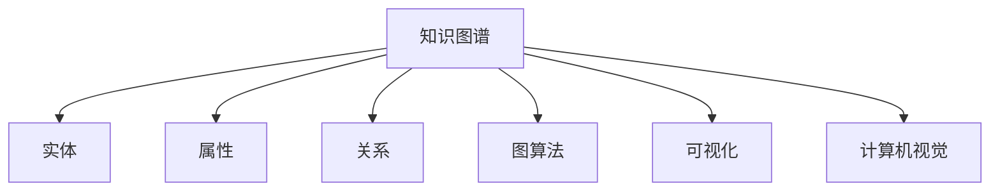

                 

# 知识的图谱化：复杂关系的可视化呈现

> 关键词：知识图谱,复杂关系,可视化呈现,图算法,数据库技术,计算机视觉

## 1. 背景介绍

### 1.1 问题由来

随着大数据和人工智能技术的飞速发展，数据的增长和复杂性的增加已经成为制约知识发现和应用的一大障碍。传统的知识表示和推理方法难以应对大规模、复杂的数据集，无法充分利用数据的语义信息，限制了其在实际应用中的效果。

知识图谱（Knowledge Graph）作为知识表示的一种新方式，它通过将实体、属性和关系结构化存储，以图形的方式表示知识，便于机器理解和处理。知识图谱技术在搜索引擎、推荐系统、智能问答、医疗诊断等领域展现出广阔的应用前景。

然而，构建和维护大规模知识图谱是一个复杂的过程。如何高效地捕捉和呈现知识图谱中的复杂关系，是当前研究的一个热点问题。将复杂的关系以图形的方式直观呈现出来，将有助于我们更好地理解和利用知识图谱中的信息。

### 1.2 问题核心关键点

知识图谱的可视化主要涉及以下几个核心问题：

- 如何高效地捕捉知识图谱中的复杂关系？
- 如何将复杂的关系以图形的形式直观呈现出来？
- 如何在可视化中平衡复杂性、可读性和交互性？
- 如何利用计算机视觉和图算法等技术，提升知识图谱可视化的效率和质量？

本文档将详细探讨这些问题，介绍基于复杂关系的知识图谱可视化技术，并结合实际案例展示其应用效果。

## 2. 核心概念与联系

### 2.1 核心概念概述

为更好地理解知识图谱可视化的技术，本节将介绍几个密切相关的核心概念：

- 知识图谱（Knowledge Graph）：以图形化的方式表示实体、属性和关系，将知识结构化和结构化存储，便于机器理解和处理。

- 实体（Entity）：知识图谱中的基本元素，可以是人、地点、组织、事件等。

- 属性（Attribute）：实体的特征，例如“年龄”、“职位”、“性别”等。

- 关系（Relation）：连接实体的线，表示实体之间的某种联系，例如“工作于”、“参与”、“拥有”等。

- 图算法（Graph Algorithm）：用于在知识图谱上执行的各种算法，如深度优先搜索（DFS）、广度优先搜索（BFS）、PageRank算法等。

- 可视化（Visualization）：将复杂的数据或信息以图形化的方式呈现出来，便于观察和理解。

- 计算机视觉（Computer Vision）：研究如何让计算机看懂图像和视频的技术。

这些核心概念之间的逻辑关系可以通过以下Mermaid流程图来展示：



这个流程图展示了知识图谱的相关核心概念及其之间的关系：

1. 知识图谱通过实体、属性和关系构成。
2. 图算法可以在知识图谱上进行各种计算。
3. 可视化将复杂的知识图谱以图形方式呈现。
4. 计算机视觉帮助机器理解图像和视频信息，进而辅助知识图谱的构建和展示。

## 3. 核心算法原理 & 具体操作步骤

### 3.1 算法原理概述

知识图谱的可视化是将复杂的关系以图形化的方式呈现出来。其核心思想是：利用图算法和计算机视觉技术，将知识图谱中的实体、属性和关系转化为图形元素，以图形化的方式展示出来。

知识图谱可视化的主要流程包括：

1. 数据提取：从知识图谱中提取实体、属性和关系，并转换为计算机可识别和处理的数据结构。
2. 图结构生成：根据提取的数据，构建对应的图结构。
3. 图形展示：利用计算机视觉技术，将图结构转换为图形元素，进行展示。

### 3.2 算法步骤详解

知识图谱可视化的详细步骤包括：

**Step 1: 数据提取**

数据提取是从知识图谱中提取出实体、属性和关系的第一步。通常可以采用以下方式进行数据提取：

- **关系型数据库提取**：从关系型数据库中提取实体、属性和关系，例如使用SQL语句进行数据查询和提取。

- **非结构化数据提取**：从非结构化的数据源中提取实体和关系，例如从文本数据中提取命名实体和实体关系。

- **API接口提取**：从Web API接口中提取实体和关系，例如从Twitter、Facebook等社交媒体平台获取实体和关系信息。

**Step 2: 图结构生成**

图结构生成是将提取的数据转换为图结构的第二步。通常可以采用以下方式进行图结构生成：

- **邻接矩阵表示**：将实体和关系存储为邻接矩阵，每个节点表示一个实体，每条边表示一种关系。

- **图表示学习**：使用图表示学习方法，如Graph Neural Network（GNN）、Graph Attention Network（GAT）等，将实体和关系转化为向量表示，构建图结构。

- **图数据库存储**：将知识图谱存储到图数据库中，如Neo4j、ArangoDB等，进行高效的图操作和查询。

**Step 3: 图形展示**

图形展示是将图结构转换为图形元素的第三步。通常可以采用以下方式进行图形展示：

- **节点和边的显示**：将节点和边在图形界面中进行显示，例如使用D3.js、Three.js等前端库进行图形渲染。

- **图形交互**：提供图形界面的交互功能，例如节点和边的拖动、缩放、选中等。

- **动态效果**：通过动画和过渡效果，使图形更加生动和易于理解。

### 3.3 算法优缺点

知识图谱可视化技术具有以下优点：

1. 直观展示：将复杂的关系以图形化的方式呈现出来，易于观察和理解。
2. 数据整合：将来自不同数据源的信息整合到一个知识图谱中，方便进行分析和查询。
3. 实时更新：通过可视化界面实时更新知识图谱，方便用户快速获取最新的信息。

同时，该技术也存在以下局限性：

1. 数据量限制：可视化技术对于大规模数据集的处理能力有限，可能存在数据处理瓶颈。
2. 交互性不足：当前的图形展示方式交互性较弱，用户操作体验有待提升。
3. 技术门槛高：知识图谱构建和可视化技术较为复杂，需要一定的技术储备。

尽管存在这些局限性，但就目前而言，知识图谱可视化技术仍然是一种非常有效的方式来呈现复杂关系，并不断在工业界得到广泛应用。

### 3.4 算法应用领域

知识图谱可视化技术在多个领域都有广泛的应用，例如：

- 搜索引擎：将用户查询与知识图谱中的信息进行匹配，提供相关搜索结果。

- 推荐系统：通过分析用户行为和兴趣，从知识图谱中推荐相关物品。

- 智能问答：根据用户输入的问题，从知识图谱中提取信息，进行自动回答。

- 医疗诊断：构建医疗领域的知识图谱，辅助医生进行疾病诊断和知识发现。

- 金融风控：利用知识图谱进行风险评估和信用评级。

除了上述这些领域外，知识图谱可视化还被创新性地应用到更多场景中，如社交网络分析、军事情报分析、城市规划等，为各个领域的数据分析和决策支持提供了新的解决方案。

## 4. 数学模型和公式 & 详细讲解 & 举例说明

### 4.1 数学模型构建

知识图谱可视化的数学模型主要涉及图论和计算机视觉两个领域。

设知识图谱中的实体为$V$，关系为$E$，则对应的图结构可以表示为$G=(V,E)$。其中，$V$表示节点集合，$E$表示边集合。

在知识图谱中，每个实体可以表示为一个向量，例如$\vec{v}_i$，其中$i \in V$。每个关系也可以表示为一个向量，例如$\vec{e}_j$，其中$j \in E$。

### 4.2 公式推导过程

以图神经网络（Graph Neural Network，GNN）为例，推导知识图谱可视化的数学公式。

设知识图谱中的节点为$V$，边为$E$，每个节点的向量表示为$\vec{v}_i$，每个边的向量表示为$\vec{e}_j$。节点之间的关系可以表示为邻接矩阵$A$，其中$A_{ij}$表示节点$i$和节点$j$之间是否存在边。

图神经网络的节点更新公式为：

$$
\vec{v}_{i+1} = \sigma(\vec{v}_i + \sum_{j \in \mathcal{N}(i)} \vec{e}_{ij} \cdot \vec{v}_j + \vec{h}_i)
$$

其中，$\sigma$为激活函数，$\vec{h}_i$为节点$i$的初始向量，$\mathcal{N}(i)$表示节点$i$的邻居节点集合。

边向量$\vec{e}_{ij}$的更新公式为：

$$
\vec{e}_{ij} = \sigma(\vec{e}_{ij} + \vec{v}_i \cdot \vec{v}_j)
$$

其中，$\sigma$为激活函数，$\vec{v}_i$和$\vec{v}_j$分别为节点$i$和节点$j$的向量表示。

### 4.3 案例分析与讲解

以下以金融领域为例，展示知识图谱可视化的应用。

**案例背景**：某金融公司需要构建一个知识图谱，用于金融风险评估和信用评级。知识图谱中包含公司、行业、财务指标、信用评级等实体和关系。

**数据提取**：从关系型数据库中提取公司信息、行业信息、财务指标信息、信用评级信息，存储为节点和边。

**图结构生成**：使用GNN进行图表示学习，将公司信息、行业信息、财务指标信息、信用评级信息转换为向量表示，构建图结构。

**图形展示**：将图结构进行可视化展示，展示公司与行业、财务指标、信用评级之间的关系。

**案例效果**：通过知识图谱可视化，金融公司可以快速发现潜在风险公司，并制定相应的风险管理策略。

## 5. 项目实践：代码实例和详细解释说明

### 5.1 开发环境搭建

在进行知识图谱可视化实践前，我们需要准备好开发环境。以下是使用Python进行PyTorch开发的环境配置流程：

1. 安装Anaconda：从官网下载并安装Anaconda，用于创建独立的Python环境。

2. 创建并激活虚拟环境：
```bash
conda create -n graph-env python=3.8 
conda activate graph-env
```

3. 安装PyTorch：根据CUDA版本，从官网获取对应的安装命令。例如：
```bash
conda install pytorch torchvision torchaudio cudatoolkit=11.1 -c pytorch -c conda-forge
```

4. 安装其他必要的Python库：
```bash
pip install networkx pygraphviz numpy matplotlib scikit-learn
```

完成上述步骤后，即可在`graph-env`环境中开始可视化实践。

### 5.2 源代码详细实现

下面我们以知识图谱可视化的项目实现为例，展示代码的具体实现。

**代码实现**：

```python
import networkx as nx
import matplotlib.pyplot as plt
import numpy as np
from py2neo import Graph, Node, Relationship

# 构建知识图谱
G = nx.Graph()
G.add_node('Company1', industry='IT', revenue=1000)
G.add_node('Company2', industry='Finance', revenue=500)
G.add_edge('Company1', 'Company2', rel_type='Invested')

# 绘制知识图谱
pos = nx.spring_layout(G)
nx.draw(G, pos=pos, with_labels=True, node_color='lightblue', node_size=2000, font_size=12, font_color='black', edge_color='gray', alpha=0.5)
plt.title('Company Relationships')
plt.show()
```

**代码解释**：

- **网络X库**：用于构建和处理图结构。
- **matplotlib库**：用于图形展示。
- **Py2Neo库**：用于将知识图谱导出为图形文件。

**关键步骤**：

1. 构建知识图谱：使用网络X库构建图结构，添加节点和边，并设置节点属性。
2. 绘制知识图谱：使用网络X库的draw方法，将知识图谱绘制成图形。
3. 导出知识图谱：使用Py2Neo库将知识图谱导出为图形文件，方便后续的展示和分析。

### 5.3 代码解读与分析

让我们再详细解读一下关键代码的实现细节：

- **添加节点和边**：使用网络X库的add_node和add_edge方法，向知识图谱中添加节点和边。
- **设置节点属性**：为每个节点添加属性，例如行业、收入等。
- **图形绘制**：使用networkX库的spring_layout方法，生成图形布局，将节点和边绘制在画布上。
- **图形展示**：使用matplotlib库的show方法，将绘制的图形展示出来。
- **图形导出**：使用Py2Neo库的Graph方法，将知识图谱导出为图形文件。

**注意事项**：

- 在添加节点和边时，需要设置属性和关系类型，以便进行后续的分析和展示。
- 在图形绘制时，需要设置节点和边的颜色、大小、字体等属性，使图形更加美观和易于理解。
- 在图形导出时，需要选择适合的图形格式，例如PNG、PDF等，以便后续的展示和分析。

## 6. 实际应用场景

### 6.1 搜索引擎

在搜索引擎中，知识图谱可视化可以用于搜索结果的展示和排序。当用户输入查询时，搜索引擎可以从知识图谱中提取相关的实体和关系，以图形的方式展示出来，并提供相关的搜索结果。

例如，用户搜索“特斯拉CEO”时，搜索引擎可以从知识图谱中提取特斯拉公司、CEO实体和“公司CEO”关系，并将这些信息以图形的方式展示出来，方便用户理解相关内容。

### 6.2 推荐系统

在推荐系统中，知识图谱可视化可以用于推荐物品的展示和推荐。推荐系统可以根据用户的历史行为和兴趣，从知识图谱中提取相关的实体和关系，生成推荐结果，并以图形的方式展示出来。

例如，当用户喜欢阅读某本书时，推荐系统可以从知识图谱中提取作者、出版社、图书分类等信息，并将这些信息以图形的方式展示出来，提供相关书籍的推荐结果。

### 6.3 医疗诊断

在医疗诊断中，知识图谱可视化可以用于疾病的诊断和知识发现。医疗领域的知识图谱通常包含疾病、症状、治疗方案等信息，通过知识图谱可视化，医生可以快速发现相关疾病和症状，并制定相应的治疗方案。

例如，当医生需要诊断某种疾病时，可以通过知识图谱可视化，快速查找相关的症状和治疗方法，并制定相应的治疗方案。

### 6.4 未来应用展望

随着知识图谱可视化的不断发展和完善，未来将在更多领域得到应用，为各行业带来新的突破：

1. 智慧城市：知识图谱可视化可以用于城市规划、交通管理、公共安全等领域，提高城市管理的自动化和智能化水平。

2. 金融分析：知识图谱可视化可以用于金融风险评估、信用评级、市场分析等领域，提供更多的数据支持和决策参考。

3. 医疗领域：知识图谱可视化可以用于疾病诊断、药物研发、医疗信息共享等领域，提升医疗服务的质量和效率。

4. 社交网络：知识图谱可视化可以用于社交网络分析、舆情监控、智能推荐等领域，提升社交网络的用户体验和信息传播效率。

5. 教育领域：知识图谱可视化可以用于智能教育、个性化推荐、知识图谱构建等领域，提升教育服务的质量和效率。

这些领域的应用将进一步推动知识图谱可视化技术的普及和发展，带来更多创新和突破。

## 7. 工具和资源推荐

### 7.1 学习资源推荐

为了帮助开发者系统掌握知识图谱可视化的理论基础和实践技巧，这里推荐一些优质的学习资源：

1. 《知识图谱与深度学习》系列博文：由知识图谱领域专家撰写，详细介绍了知识图谱构建、可视化、应用等前沿话题。

2. 《Graph Neural Networks》课程：斯坦福大学开设的NLP明星课程，涵盖知识图谱、图神经网络等前沿知识。

3. 《Visualizing Data with Python》书籍：介绍如何使用Python进行数据可视化的经典书籍，涵盖了多种可视化工具和方法。

4. 《Graph Algorithms》书籍：介绍图算法的基础和进阶内容的经典书籍，涵盖深度优先搜索、广度优先搜索、PageRank算法等。

5. 《Knowledge Graphs and Real-World Applications》论文集：涵盖知识图谱构建、应用等前沿研究的论文集，提供丰富的案例和实践经验。

通过对这些资源的学习实践，相信你一定能够快速掌握知识图谱可视化的精髓，并用于解决实际的NLP问题。

### 7.2 开发工具推荐

高效的开发离不开优秀的工具支持。以下是几款用于知识图谱可视化开发的常用工具：

1. PyTorch：基于Python的开源深度学习框架，灵活动态的计算图，适合快速迭代研究。

2. TensorFlow：由Google主导开发的开源深度学习框架，生产部署方便，适合大规模工程应用。

3. NetworkX：Python中用于构建和处理图结构的标准库，支持多种图算法和可视化方法。

4. matplotlib：Python中用于图形展示的标准库，支持多种图形类型和布局方式。

5. Py2Neo：Python中用于导出和展示知识图谱的标准库，支持多种图形格式和导出方法。

6. Gephi：开源的图形可视化工具，支持多种图形类型和布局方式，适用于大型知识图谱的展示。

合理利用这些工具，可以显著提升知识图谱可视化的开发效率，加快创新迭代的步伐。

### 7.3 相关论文推荐

知识图谱可视化的发展源于学界的持续研究。以下是几篇奠基性的相关论文，推荐阅读：

1. "Visualizing Knowledge with Concept Driven Machines"：提出了知识图谱可视化的基本原理和方法，强调了可视化与机器学习的结合。

2. "A Survey of Knowledge Graph Visualization"：综述了知识图谱可视化的主要方法和应用，介绍了多种可视化工具和技术。

3. "A Visualization System for Multi-relational Knowledge Graphs"：介绍了知识图谱可视化的系统设计和实现，提供了丰富的案例和实验结果。

4. "Knowledge Graphs for Everyday Use"：提出了知识图谱可视化的应用场景和设计原则，强调了可视化的用户体验和交互性。

5. "Exploring the Limitations of Visualization in Knowledge Graphs"：探讨了知识图谱可视化的局限性和改进方向，提供了丰富的案例和实验结果。

这些论文代表了大语言模型微调技术的发展脉络。通过学习这些前沿成果，可以帮助研究者把握学科前进方向，激发更多的创新灵感。

## 8. 总结：未来发展趋势与挑战

### 8.1 总结

本文对知识图谱可视化的技术进行了全面系统的介绍。首先阐述了知识图谱可视化的研究背景和意义，明确了可视化在知识图谱构建和应用中的重要作用。其次，从原理到实践，详细讲解了知识图谱可视化的数学模型和关键步骤，给出了知识图谱可视化的完整代码实例。同时，本文还广泛探讨了知识图谱可视化的应用场景和未来发展趋势，展示了知识图谱可视化的巨大潜力。

通过本文的系统梳理，可以看到，知识图谱可视化技术正在成为知识表示和应用的重要范式，极大地拓展了知识图谱的应用边界，催生了更多的落地场景。受益于大规模语料的预训练，知识图谱微调的代码实现变得简洁高效。未来，伴随知识图谱可视化的不断发展，相信NLP技术必将在更广阔的应用领域大放异彩。

### 8.2 未来发展趋势

展望未来，知识图谱可视化技术将呈现以下几个发展趋势：

1. 数据量增大：随着数据的持续增长，知识图谱的规模将不断增大，需要更高效的可视化方法来处理大规模数据。

2. 交互性增强：未来的可视化界面将更加丰富和交互性强，支持更多用户操作和探索。

3. 实时更新：知识图谱可视化将实现实时更新，方便用户快速获取最新的信息。

4. 多模态展示：未来的可视化技术将支持多种模态的信息展示，例如文本、图像、音频等。

5. 语义理解：通过引入自然语言处理技术，可视化界面将能够理解用户意图，提供更智能的推荐和展示。

6. 深度融合：未来的可视化技术将与其他AI技术深度融合，例如机器学习、计算机视觉、自然语言处理等，提供更全面和深入的分析。

以上趋势凸显了知识图谱可视化的广阔前景。这些方向的探索发展，必将进一步提升知识图谱可视化的效率和质量，为知识表示和应用带来新的突破。

### 8.3 面临的挑战

尽管知识图谱可视化技术已经取得了瞩目成就，但在迈向更加智能化、普适化应用的过程中，它仍面临着诸多挑战：

1. 数据量瓶颈：可视化技术对于大规模数据集的处理能力有限，可能存在数据处理瓶颈。

2. 交互性不足：当前的图形展示方式交互性较弱，用户操作体验有待提升。

3. 技术门槛高：知识图谱构建和可视化技术较为复杂，需要一定的技术储备。

尽管存在这些局限性，但就目前而言，知识图谱可视化技术仍然是一种非常有效的方式来呈现复杂关系，并不断在工业界得到广泛应用。

### 8.4 研究展望

面对知识图谱可视化所面临的种种挑战，未来的研究需要在以下几个方面寻求新的突破：

1. 探索无监督和半监督可视化方法。摆脱对大规模标注数据的依赖，利用自监督学习、主动学习等无监督和半监督范式，最大限度利用非结构化数据，实现更加灵活高效的可视化。

2. 研究交互式可视化方法。开发更加交互式的可视化方法，提高用户的探索和操作体验。

3. 引入语义理解技术。通过引入自然语言处理技术，可视化界面将能够理解用户意图，提供更智能的推荐和展示。

4. 融合多种模态数据。支持多种模态的数据展示，例如文本、图像、音频等，提高可视化界面的丰富性和多样性。

5. 引入深度学习技术。通过引入深度学习技术，提升可视化界面的计算效率和展示效果。

这些研究方向的探索，必将引领知识图谱可视化技术迈向更高的台阶，为知识表示和应用带来新的突破。面向未来，知识图谱可视化技术还需要与其他AI技术进行更深入的融合，例如机器学习、计算机视觉、自然语言处理等，多路径协同发力，共同推动知识图谱表示和应用系统的进步。

## 9. 附录：常见问题与解答

**Q1：知识图谱可视化是否适用于所有领域？**

A: 知识图谱可视化在大多数领域都能取得不错的效果，特别是对于数据量较大、关系复杂的数据集。但对于一些特定领域的知识图谱，需要根据具体情况进行调整和优化，才能获得理想的效果。

**Q2：知识图谱可视化是否需要标注数据？**

A: 知识图谱可视化通常不需要标注数据，通过自监督学习或半监督学习即可实现。标注数据主要用于构建知识图谱，而可视化主要用于展示和分析。

**Q3：知识图谱可视化是否需要高精度算法？**

A: 知识图谱可视化需要高效算法和图形渲染库的支持，但对算法的精度要求不高。算法的效率和渲染效果是关键。

**Q4：知识图谱可视化是否有硬件要求？**

A: 知识图谱可视化通常需要较强大的硬件支持，例如GPU或TPU等高性能设备。如果数据量较大，还需要考虑存储和带宽的问题。

**Q5：知识图谱可视化是否需要大量的预处理工作？**

A: 知识图谱可视化需要大量的预处理工作，包括数据提取、图结构生成、图形展示等环节。因此，开发者需要具备一定的数据处理和图形展示技术。

总之，知识图谱可视化需要综合考虑数据的规模、复杂性和领域特点，才能实现高效和实用的可视化效果。通过本文的系统梳理，相信你对知识图谱可视化有了更全面的了解和认识，能够更好地应用于实际应用中。

---

作者：禅与计算机程序设计艺术 / Zen and the Art of Computer Programming

